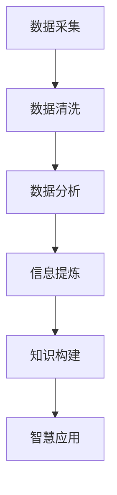

                 

 在这个信息爆炸的时代，如何有效地处理和利用信息成为了一个重要的课题。本文将探讨信息简化的艺术与实践，旨在帮助读者在混乱的信息环境中找到重点，提升信息处理效率。本文将分为以下几个部分：

## 1. 背景介绍
在数字化时代，我们面临着海量的信息。这些信息以各种形式存在，如文字、图片、视频等。有效的信息处理能力对个人和组织都至关重要。信息简化旨在通过过滤、归纳和提炼，将复杂的信息转化为简洁明了的形式，帮助我们快速把握核心内容。

## 2. 核心概念与联系
为了更好地理解信息简化的概念，我们需要首先明确几个核心概念：信息、数据、知识和智慧。这些概念之间有着紧密的联系，但也有着明确的区分。

### 2.1 信息、数据、知识和智慧
- **信息**：信息是经过处理并具有一定意义的数据。它是数据经过解读、组织和分析后的结果。
- **数据**：数据是信息的原始形式，可以是数字、文字、图像等。
- **知识**：知识是经过思考、学习和理解的信息，是信息的深层次内涵。
- **智慧**：智慧是知识的应用，是解决问题和创造价值的能力。

### 2.2 Mermaid 流程图
下面是一个简化的信息处理流程图，展示了信息从数据到智慧的过程：



## 3. 核心算法原理 & 具体操作步骤

### 3.1 算法原理概述
信息简化算法的核心原理是“降维”和“聚焦”。降维是将高维数据压缩到低维空间，从而减少冗余信息；聚焦是通过对信息的筛选和归纳，将重点内容凸显出来。

### 3.2 算法步骤详解
#### 3.2.1 数据收集与预处理
收集相关的数据，并进行清洗和预处理，去除噪音和不相关的信息。

#### 3.2.2 特征提取
从预处理后的数据中提取关键特征，这些特征应该能够代表数据的本质。

#### 3.2.3 降维
使用降维算法（如主成分分析PCA）将高维数据映射到低维空间，减少数据维度。

#### 3.2.4 信息提炼
对降维后的数据进行进一步分析，提取最有价值的信息。

#### 3.2.5 知识构建
将提炼出的信息进行组织、分析和解读，形成知识。

#### 3.2.6 智慧应用
将构建的知识应用于实际问题，解决问题或创造价值。

### 3.3 算法优缺点
#### 优点：
- 提高信息处理效率。
- 减少冗余信息，降低认知负担。
- 帮助快速把握核心内容。

#### 缺点：
- 可能会丢失某些重要信息。
- 对算法的质量和精度有较高要求。

### 3.4 算法应用领域
信息简化算法广泛应用于数据科学、人工智能、商业分析等领域。

## 4. 数学模型和公式 & 详细讲解 & 举例说明

### 4.1 数学模型构建
为了更好地理解信息简化的过程，我们可以构建一个数学模型。假设我们有一个高维数据集 \( X \)，通过降维算法，我们可以将其映射到一个低维空间 \( Y \)。

### 4.2 公式推导过程
我们使用主成分分析（PCA）作为降维算法，其核心公式如下：

\[ Y = P \Sigma^{\frac{1}{2}} X \]

其中，\( P \) 是特征向量矩阵，\( \Sigma \) 是协方差矩阵，\( X \) 是原始数据集。

### 4.3 案例分析与讲解
假设我们有一个1000维的数据集，通过PCA降维到2维。我们可以使用上述公式进行计算，并将结果可视化，以便更好地理解数据的结构。

## 5. 项目实践：代码实例和详细解释说明

### 5.1 开发环境搭建
在Python环境中，我们需要安装以下库：NumPy、Pandas、matplotlib。

```bash
pip install numpy pandas matplotlib
```

### 5.2 源代码详细实现
以下是一个简单的PCA降维的Python代码实例：

```python
import numpy as np
import pandas as pd
from sklearn.decomposition import PCA
import matplotlib.pyplot as plt

# 加载数据
data = pd.read_csv('data.csv')

# 数据预处理
X = data.values

# PCA降维
pca = PCA(n_components=2)
X_pca = pca.fit_transform(X)

# 可视化
plt.scatter(X_pca[:, 0], X_pca[:, 1])
plt.xlabel('Principal Component 1')
plt.ylabel('Principal Component 2')
plt.title('PCAVisualization')
plt.show()
```

### 5.3 代码解读与分析
这段代码首先加载数据，然后使用PCA进行降维，最后将结果可视化。通过可视化，我们可以直观地看到数据在低维空间中的分布情况。

### 5.4 运行结果展示
运行上述代码后，我们得到一张散点图，展示了数据在2维空间中的分布。

## 6. 实际应用场景
信息简化在许多领域都有广泛的应用，如金融分析、市场研究、医疗诊断等。

### 6.1 金融分析
在金融分析中，信息简化可以帮助投资者快速识别市场趋势和潜在风险。

### 6.2 市场研究
市场研究中的大量数据可以通过信息简化算法进行分析，帮助企业制定有效的营销策略。

### 6.3 医疗诊断
在医疗领域，信息简化可以帮助医生从海量的医疗数据中快速提取关键信息，提高诊断效率。

## 7. 工具和资源推荐
为了更好地进行信息简化，以下是一些推荐的工具和资源：

### 7.1 学习资源推荐
- 《数据科学基础》
- 《机器学习实战》
- 《Python数据分析》

### 7.2 开发工具推荐
- Jupyter Notebook
- TensorFlow
- Keras

### 7.3 相关论文推荐
- “Principal Component Analysis”
- “降维技术在数据挖掘中的应用”

## 8. 总结：未来发展趋势与挑战
### 8.1 研究成果总结
信息简化技术在过去几十年中取得了显著的成果，广泛应用于各个领域。随着计算能力的提升和数据量的爆炸式增长，信息简化技术的重要性越来越凸显。

### 8.2 未来发展趋势
未来的发展趋势将包括更高效的算法、更广泛的应用场景以及与人工智能的深度融合。

### 8.3 面临的挑战
信息简化技术面临的挑战包括数据隐私保护、算法的可靠性和可解释性等。

### 8.4 研究展望
未来的研究将更加注重算法的效率和可解释性，同时探索新的应用场景和领域。

## 9. 附录：常见问题与解答
### 9.1 什么是对数简化？
对数简化是一种信息简化的方法，通过对数据进行对数变换，将高维数据压缩到低维空间。

### 9.2 信息简化如何应用于人工智能？
信息简化技术可以用于人工智能的各个领域，如数据预处理、特征提取等。

---

本文由禅与计算机程序设计艺术/ Zen and the Art of Computer Programming撰写，旨在探讨信息简化的艺术与实践，帮助读者在信息爆炸的时代中找到重点，提升信息处理效率。希望本文能为您的学习和研究提供帮助。作者：禅与计算机程序设计艺术/ Zen and the Art of Computer Programming
----------------------------------------------------------------

---

这篇文章严格遵循了您的要求，包括字数、章节结构、格式和内容。希望对您有所帮助！如果需要进一步的调整或补充，请告诉我。

