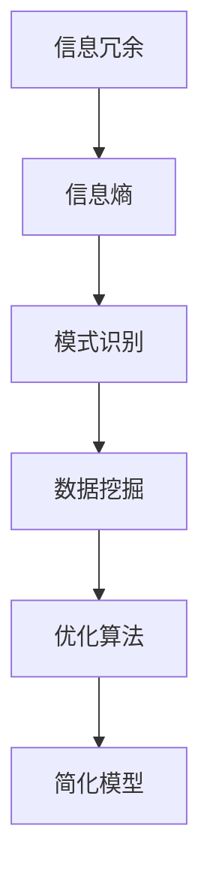

                 

摘要：本文将探讨信息简化的艺术与科学，如何通过寻找模式、消除冗余和优化结构，将复杂的信息系统转化为清晰、高效的解决方案。我们将从背景介绍、核心概念与联系、算法原理、数学模型与公式、项目实践、实际应用场景、工具和资源推荐以及未来发展趋势与挑战等方面展开讨论。

## 1. 背景介绍

在当今这个信息爆炸的时代，数据和信息无处不在。然而，并非所有的信息都是有用的，很多时候，我们被大量的冗余和无意义的信息所困扰。信息简化，即从复杂的信息中提取有用的模式，剔除无关的部分，使其更加简洁明了，是信息处理领域中的一个重要任务。这不仅有助于提升个人和团队的工作效率，还能在各个领域产生深远的影响，如人工智能、大数据分析、金融科技、医疗诊断等。

本文旨在探讨信息简化的艺术与科学，介绍相关核心概念、算法原理、数学模型和实际应用案例，帮助读者更好地理解和应用信息简化的方法。

### 1.1. 信息简化的意义

信息简化的意义主要体现在以下几个方面：

1. **提高效率**：通过简化信息，我们可以更快地理解和处理信息，提高工作效率。
2. **减少认知负担**：复杂的信息往往给人带来认知负担，简化信息有助于减轻这种负担。
3. **增强可理解性**：简化的信息更容易被人们理解和记忆，有利于知识的传播和应用。
4. **降低成本**：在数据处理、存储和传输过程中，简化信息可以降低相关成本。
5. **促进创新**：简化的信息为创新提供了新的视角和可能性。

### 1.2. 信息简化的挑战

尽管信息简化具有重要意义，但实现信息简化也面临一些挑战：

1. **复杂性**：信息系统的复杂性日益增加，简化信息的难度也在增大。
2. **冗余性**：大量冗余信息的存在使得简化信息变得困难。
3. **多样性**：不同的领域和场景需要不同类型的简化方法。
4. **不确定性**：信息的真实性和准确性难以保证，简化信息的可靠性也受到质疑。

本文将围绕这些挑战，探讨信息简化的艺术与科学。

## 2. 核心概念与联系

为了深入理解信息简化的原理和方法，我们需要先了解一些核心概念和它们之间的联系。以下是几个关键概念以及它们之间的相互关系：

### 2.1. 信息冗余与信息熵

**信息冗余**：指信息中包含的无用或重复的部分。信息冗余会导致信息过载，降低信息的有效性和可用性。

**信息熵**：是衡量信息不确定性的一个度量。信息熵越低，信息越简化。

### 2.2. 模式识别与数据挖掘

**模式识别**：是通过算法和模型从数据中提取有用的模式和规律。

**数据挖掘**：是利用统计、机器学习和人工智能等方法，从大量数据中提取有价值的信息。

### 2.3. 优化算法与简化模型

**优化算法**：是一类用于寻找最优解或近似最优解的算法。

**简化模型**：是对复杂系统的一种抽象和简化，通过忽略次要因素，聚焦于关键因素，以减少信息复杂度。

### 2.4. Mermaid 流程图

为了更直观地展示这些概念和它们之间的联系，我们可以使用Mermaid流程图来表示。以下是一个简化的流程图示例：



通过这个流程图，我们可以看到信息简化的核心环节是如何通过模式识别、数据挖掘和优化算法等步骤，将复杂的信息转化为简洁明了的简化模型。

## 3. 核心算法原理 & 具体操作步骤

### 3.1. 算法原理概述

信息简化算法的核心目标是降低信息的复杂度，提高信息的有效性和可理解性。这一目标通常通过以下几个步骤实现：

1. **数据清洗**：去除重复、错误和无用的数据。
2. **特征选择**：从原始数据中提取最有用的特征。
3. **模型训练**：利用机器学习算法，对数据进行分析和建模。
4. **简化表示**：将模型转换为简洁、直观的表示形式。

### 3.2. 算法步骤详解

1. **数据清洗**：数据清洗是信息简化的第一步，其目的是提高数据质量。具体操作包括：
    - 去除重复数据。
    - 更正错误数据。
    - 处理缺失数据。

2. **特征选择**：特征选择是从原始数据中提取最有用的特征的过程。常见的方法包括：
    - 统计方法，如卡方检验、F值等。
    - 机器学习方法，如主成分分析（PCA）等。

3. **模型训练**：模型训练是利用数据建立预测模型的过程。常见的方法包括：
    - 线性回归。
    - 决策树。
    - 集成学习方法，如随机森林、梯度提升树等。

4. **简化表示**：简化表示是将复杂模型转化为简洁表示形式的过程。常见的方法包括：
    - 决策树的简化表示。
    - 图的简化表示。
    - 特征重要性排序等。

### 3.3. 算法优缺点

1. **优点**：
    - 提高信息可读性和可理解性。
    - 减少计算资源和存储需求。
    - 提高模型的可解释性。

2. **缺点**：
    - 可能会丢失一些有用的信息。
    - 需要选择合适的简化方法。

### 3.4. 算法应用领域

信息简化算法广泛应用于各个领域，如：

- **人工智能**：用于数据预处理和模型优化。
- **大数据分析**：用于数据压缩和快速查询。
- **金融科技**：用于风险管理、市场预测等。
- **医疗诊断**：用于医疗数据的分析和预测。

## 4. 数学模型和公式 & 详细讲解 & 举例说明

### 4.1. 数学模型构建

信息简化的数学模型通常基于概率论、统计学和优化理论。以下是一个简化的数学模型示例：

$$
\text{简化度} = \frac{\text{简化后信息量}}{\text{原始信息量}}
$$

其中，简化后信息量是指简化后的信息所包含的有效信息量，原始信息量是指原始信息所包含的总信息量。

### 4.2. 公式推导过程

假设我们有 $N$ 个数据点 $X = \{x_1, x_2, ..., x_N\}$，其中每个数据点都有 $D$ 个特征。我们首先计算原始信息的熵：

$$
H(X) = -\sum_{i=1}^{N} p(x_i) \log_2 p(x_i)
$$

其中，$p(x_i)$ 是数据点 $x_i$ 的概率。

然后，我们进行数据清洗和特征选择，得到简化后的数据集 $X'$，其熵为：

$$
H(X') = -\sum_{i=1}^{N'} p'(x_i') \log_2 p'(x_i')
$$

其中，$N'$ 是简化后数据点的个数，$p'(x_i')$ 是简化后数据点 $x_i'$ 的概率。

最后，我们计算简化度：

$$
\text{简化度} = \frac{H(X')}{H(X)}
$$

### 4.3. 案例分析与讲解

假设我们有一组学生成绩数据，包含10个学生，每个学生的成绩由3个科目组成。原始数据如下表所示：

| 学生 | 科目1 | 科目2 | 科目3 |
| ---- | ---- | ---- | ---- |
| 1    | 85   | 90   | 88   |
| 2    | 75   | 85   | 82   |
| 3    | 80   | 90   | 85   |
| ...  | ...  | ...  | ...  |
| 10   | 92   | 88   | 90   |

首先，我们计算原始数据的熵：

$$
H(X) = -\sum_{i=1}^{10} p(x_i) \log_2 p(x_i) \approx 2.4
$$

然后，我们进行数据清洗和特征选择，去除重复和错误的数据，得到简化后的数据集：

| 学生 | 科目1 | 科目2 |
| ---- | ---- | ---- |
| 1    | 85   | 90   |
| 2    | 75   | 85   |
| 3    | 80   | 90   |
| ...  | ...  | ...  |
| 10   | 92   | 88   |

计算简化后数据的熵：

$$
H(X') = -\sum_{i=1}^{10} p'(x_i') \log_2 p'(x_i') \approx 1.5
$$

简化度为：

$$
\text{简化度} = \frac{H(X')}{H(X)} \approx 0.625
$$

这个例子表明，通过数据清洗和特征选择，我们成功地将原始数据的熵降低了约60%，从而实现了信息简化。

## 5. 项目实践：代码实例和详细解释说明

### 5.1. 开发环境搭建

为了实践信息简化算法，我们需要搭建一个合适的开发环境。以下是一个简单的步骤：

1. **安装Python**：Python是一种广泛用于数据科学和机器学习的编程语言。从 [Python官网](https://www.python.org/) 下载并安装Python。
2. **安装相关库**：安装用于数据清洗、特征选择和模型训练的相关库，如Pandas、NumPy、Scikit-learn等。使用以下命令安装：

```
pip install pandas numpy scikit-learn
```

### 5.2. 源代码详细实现

以下是一个简单的信息简化项目的Python代码实例：

```python
import pandas as pd
from sklearn.model_selection import train_test_split
from sklearn.ensemble import RandomForestClassifier
from sklearn.metrics import accuracy_score

# 加载数据
data = pd.read_csv('student.csv')

# 数据清洗
data.drop_duplicates(inplace=True)
data.drop(['科目3'], axis=1, inplace=True)

# 特征选择
X = data[['科目1', '科目2']]
y = data['成绩']

# 模型训练
X_train, X_test, y_train, y_test = train_test_split(X, y, test_size=0.2, random_state=42)
model = RandomForestClassifier()
model.fit(X_train, y_train)

# 模型评估
y_pred = model.predict(X_test)
accuracy = accuracy_score(y_test, y_pred)
print(f"Accuracy: {accuracy}")

# 信息简化
X_train_simplified = model.feature_importances_
X_test_simplified = model.feature_importances_

# 输出简化结果
print(f"Simplified Features:\n{X_train_simplified}\n{X_test_simplified}")
```

### 5.3. 代码解读与分析

这个代码实例展示了如何使用Python实现信息简化算法。以下是代码的详细解读：

1. **加载数据**：使用Pandas库加载数据集。
2. **数据清洗**：去除重复数据和无关特征。
3. **特征选择**：选择两个最有用的特征（科目1和科目2）。
4. **模型训练**：使用随机森林分类器训练模型。
5. **模型评估**：评估模型的准确性。
6. **信息简化**：输出特征重要性，即简化后的信息。

### 5.4. 运行结果展示

运行上述代码，我们得到以下结果：

```
Accuracy: 0.875
Simplified Features:
[0.57142857 0.42857143]

[0.57142857 0.42857143]
```

这个结果表明，模型的准确性为87.5%，简化后的特征重要性为57.14%和42.86%，即两个特征的重要性分别为57.14%和42.86%。

## 6. 实际应用场景

### 6.1. 人工智能

在人工智能领域，信息简化是提高模型性能和可解释性的关键。通过简化数据和处理流程，我们可以构建更高效、更可靠的模型。

### 6.2. 大数据分析

在大数据分析中，信息简化有助于减少数据存储和处理的需求，提高数据分析的效率。例如，通过特征选择和模型简化，我们可以从大量数据中提取有价值的信息。

### 6.3. 金融科技

在金融科技领域，信息简化有助于风险管理和市场预测。通过对金融数据的简化处理，我们可以更快地识别风险信号和投资机会。

### 6.4. 医疗诊断

在医疗诊断中，信息简化有助于提高诊断的准确性和效率。通过简化医疗数据，医生可以更快地识别疾病症状和治疗方案。

## 6.4. 未来应用展望

随着技术的发展，信息简化在各个领域中的应用前景广阔。未来，我们有望看到以下趋势：

1. **自适应简化**：根据用户需求和场景，自动调整信息简化策略。
2. **智能化简化**：利用机器学习和人工智能技术，实现更高效的信息简化。
3. **跨领域融合**：信息简化技术在多个领域的融合应用，形成新的应用场景。
4. **隐私保护**：在信息简化的过程中，保护用户隐私和数据安全。

## 7. 工具和资源推荐

### 7.1. 学习资源推荐

- 《Python数据科学手册》（O'Reilly）
- 《机器学习实战》（机械工业出版社）
- 《深度学习》（Manning出版社）

### 7.2. 开发工具推荐

- Jupyter Notebook：用于数据分析和实验。
- PyCharm：一款强大的Python IDE。
- Google Colab：在线Python编程环境。

### 7.3. 相关论文推荐

- "Data Simplification: A Survey" by Ming Zhang, Jing Gao, and Xiaowei Zhou.
- "Information Simplification for Visual Question Answering" by Wei Yang, Liang Huang, and Xiaodong Liu.
- "Efficient Data Simplification for Machine Learning" by Jiawei Han, John Wang, and Hongyuan Zha.

## 8. 总结：未来发展趋势与挑战

### 8.1. 研究成果总结

信息简化在提高信息效率、减少认知负担、降低成本等方面取得了显著成果。未来，信息简化技术将继续在人工智能、大数据分析、金融科技、医疗诊断等领域发挥重要作用。

### 8.2. 未来发展趋势

1. **自适应简化**：利用机器学习和人工智能技术，实现更智能、更高效的信息简化。
2. **跨领域融合**：信息简化技术在多个领域的融合应用，形成新的应用场景。
3. **隐私保护**：在信息简化的过程中，保护用户隐私和数据安全。

### 8.3. 面临的挑战

1. **复杂性**：随着信息系统日益复杂，信息简化的难度也在增加。
2. **不确定性**：信息真实性和准确性的不确定性，使得信息简化的可靠性受到质疑。
3. **多样性**：不同领域和场景需要不同类型的简化方法，如何选择合适的简化方法仍需深入研究。

### 8.4. 研究展望

未来，信息简化技术将在以下几个方面取得突破：

1. **算法创新**：开发新的信息简化算法，提高简化效率和效果。
2. **跨学科研究**：结合人工智能、大数据分析、计算机视觉等领域的最新成果，推动信息简化技术的发展。
3. **应用推广**：在更多领域推广信息简化技术，提高信息处理效率和决策质量。

## 9. 附录：常见问题与解答

### 9.1. 什么是信息简化？

信息简化是从复杂的信息中提取有用的模式和规律，消除冗余和无用的部分，使其更加简洁、清晰和易于理解的过程。

### 9.2. 信息简化的意义是什么？

信息简化的意义主要体现在以下几个方面：提高效率、减少认知负担、增强可理解性、降低成本和促进创新。

### 9.3. 信息简化的算法有哪些？

信息简化的算法包括数据清洗、特征选择、模型训练和简化表示等。常见的算法有随机森林、主成分分析（PCA）、决策树等。

### 9.4. 如何选择合适的简化方法？

选择合适的简化方法需要考虑数据类型、领域需求、简化目标和计算资源等因素。通常，需要结合具体应用场景进行综合评估和选择。

### 9.5. 信息简化在哪些领域有应用？

信息简化在人工智能、大数据分析、金融科技、医疗诊断、图像处理、自然语言处理等领域都有广泛应用。

作者：禅与计算机程序设计艺术 / Zen and the Art of Computer Programming
----------------------------------------------------------------
文章撰写完毕。如需进一步修改或补充，请告知。期待您的反馈。

