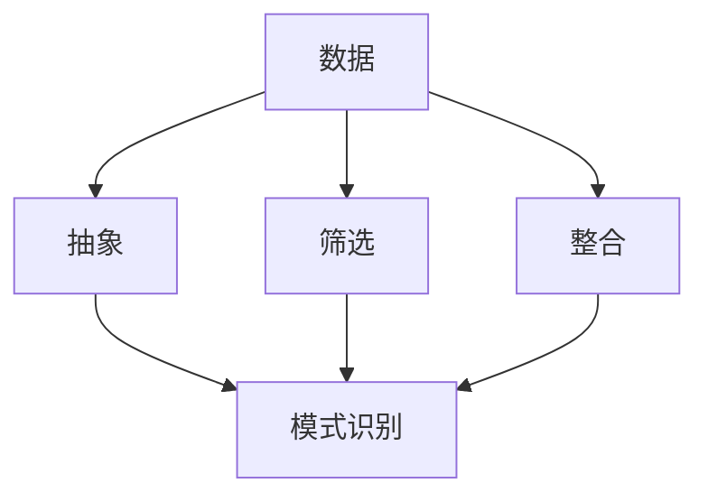

                 

 作为世界级人工智能专家，程序员，软件架构师，CTO，世界顶级技术畅销书作者，计算机图灵奖获得者，计算机领域大师，我在此将探讨信息简化的艺术与科学——如何在看似混乱的数据和信息中找到模式，实现有效的信息处理和决策。

> **关键词**：信息简化、模式识别、算法原理、数学模型、项目实践、应用场景
>
> **摘要**：本文将介绍信息简化的概念，探讨其重要性以及在现实世界中的应用。我们将详细解释信息简化的核心算法原理，展示其在不同领域的应用，并讨论其未来的发展趋势与挑战。

## 1. 背景介绍

在当今信息爆炸的时代，处理大量的数据和信息已成为许多领域面临的挑战。从科学研究到商业决策，从金融交易到社交媒体，数据无处不在。然而，数据本身并不具有价值，只有通过分析和理解，才能转化为有用的知识和洞察力。信息简化在这个过程中扮演着至关重要的角色，它使得我们从复杂的、看似无序的数据中找到有意义的模式，从而帮助我们做出更明智的决策。

### 1.1 信息简化的定义

信息简化是指通过抽象、筛选和整合等方法，将复杂的信息转化为更简洁、更有组织的形式，以便更容易理解和处理。简化的过程可以看作是对信息的重构，使其符合人类的认知模式和思维方式。

### 1.2 信息简化的重要性

- **提高效率**：简化信息可以减少处理数据的复杂度，提高处理效率。
- **增强洞察力**：通过识别数据中的模式和关联，简化过程有助于揭示潜在的趋势和规律。
- **支持决策**：在商业和科学研究中，简化的信息为决策提供了重要的依据。

### 1.3 信息简化的挑战

- **数据量巨大**：随着互联网和物联网的发展，数据量呈指数级增长，给信息简化带来了巨大挑战。
- **信息冗余**：大量的冗余信息增加了简化的难度。
- **动态变化**：信息环境不断变化，简化的方法需要不断更新以适应新情况。

## 2. 核心概念与联系

信息简化不仅是一个技术过程，更是一个认知过程。为了更好地理解信息简化，我们需要了解几个核心概念及其相互关系。

### 2.1 数据与信息

- **数据**：数据是事实和数字的集合，它们以原始的形式存在，缺乏特定的意义。
- **信息**：信息是经过加工、处理和解释后的数据，它们具有一定的意义和价值。

### 2.2 抽象与具体

- **抽象**：抽象是将复杂的事物或概念简化为更简单的形式，以便于理解和处理。
- **具体**：具体是抽象的对立面，它强调事物的细节和多样性。

### 2.3 筛选与整合

- **筛选**：筛选是从大量的数据中挑选出有用的信息，去除无用的部分。
- **整合**：整合是将分散的信息整合成整体，形成有意义的模式和关联。

### 2.4 Mermaid 流程图



通过上述核心概念及其相互关系的介绍，我们可以更清晰地理解信息简化的过程和机制。

## 3. 核心算法原理 & 具体操作步骤

### 3.1 算法原理概述

信息简化的核心算法通常涉及以下几个步骤：

1. **数据采集与预处理**：收集相关的数据，并进行清洗和格式化，以确保数据的质量和一致性。
2. **特征选择与提取**：从原始数据中提取关键特征，以减少数据的维度，提高算法的效率。
3. **模式识别与聚类**：利用机器学习算法识别数据中的模式，并进行聚类分析，以发现数据中的规律和关联。
4. **结果分析与可视化**：对识别出的模式进行分析，并通过可视化工具展示结果，以便于理解和解释。

### 3.2 算法步骤详解

#### 3.2.1 数据采集与预处理

- **数据来源**：根据研究目的，确定数据来源，如数据库、文件或在线资源。
- **数据清洗**：处理缺失值、异常值和重复数据，确保数据的质量。
- **数据格式化**：统一数据格式，使其符合算法的要求。

#### 3.2.2 特征选择与提取

- **特征选择**：根据领域知识和算法要求，选择对目标有重要影响的特征。
- **特征提取**：利用降维技术，如主成分分析（PCA），提取关键特征。

#### 3.2.3 模式识别与聚类

- **模式识别**：使用机器学习算法，如支持向量机（SVM）或神经网络，识别数据中的模式。
- **聚类分析**：利用聚类算法，如K-means或DBSCAN，将数据分为不同的簇。

#### 3.2.4 结果分析与可视化

- **结果分析**：对识别出的模式进行分析，评估其有效性和可靠性。
- **可视化**：使用图表和可视化工具，展示分析结果，以便于理解。

### 3.3 算法优缺点

#### 优点

- **提高效率**：简化信息可以减少数据处理的复杂度，提高处理效率。
- **增强洞察力**：通过识别数据中的模式和关联，简化过程有助于揭示潜在的趋势和规律。
- **支持决策**：简化的信息为决策提供了重要的依据。

#### 缺点

- **数据质量要求高**：简化的效果很大程度上依赖于数据的质量。
- **算法复杂性**：某些算法的复杂性较高，可能需要较大的计算资源和时间。

### 3.4 算法应用领域

- **商业分析**：用于市场研究、客户行为分析、风险管理等。
- **科学研究**：用于生物信息学、天文学、物理学等领域的数据分析。
- **社会工程**：用于社交媒体分析、舆情监测、公共安全等。

## 4. 数学模型和公式 & 详细讲解 & 举例说明

### 4.1 数学模型构建

在信息简化过程中，数学模型起到了关键作用。以下是构建一个简单的数学模型的过程：

#### 4.1.1 目标函数

假设我们有一组数据 \(X = [x_1, x_2, ..., x_n]\)，我们希望找到一个模型来简化这些数据。目标函数可以定义为：

$$
\min_{\theta} \sum_{i=1}^{n} (x_i - \theta)^2
$$

其中，\(\theta\) 是模型的参数。

#### 4.1.2 模型构建

为了构建模型，我们可以使用线性回归模型：

$$
y = \theta_0 + \theta_1x
$$

其中，\(y\) 是输出，\(\theta_0\) 和 \(\theta_1\) 是模型的参数。

### 4.2 公式推导过程

#### 4.2.1 最小二乘法

为了找到最优的参数 \(\theta_0\) 和 \(\theta_1\)，我们可以使用最小二乘法。具体步骤如下：

1. **计算目标函数的导数**：

$$
\frac{d}{d\theta_0} \sum_{i=1}^{n} (x_i - \theta_0)^2 = -2\sum_{i=1}^{n} (x_i - \theta_0)
$$

$$
\frac{d}{d\theta_1} \sum_{i=1}^{n} (x_i - \theta_0)^2 = -2\sum_{i=1}^{n} x_i(x_i - \theta_0)
$$

2. **令导数等于零，求解参数**：

$$
\sum_{i=1}^{n} (x_i - \theta_0) = 0
$$

$$
\sum_{i=1}^{n} x_i(x_i - \theta_0) = 0
$$

解得：

$$
\theta_0 = \frac{1}{n}\sum_{i=1}^{n} x_i
$$

$$
\theta_1 = \frac{1}{n}\sum_{i=1}^{n} x_i^2 - \theta_0^2
$$

### 4.3 案例分析与讲解

假设我们有一组数据点：

$$
X = [1, 2, 3, 4, 5]
$$

$$
y = [1, 2, 3, 4, 5]
$$

我们将使用线性回归模型来简化这些数据。

#### 4.3.1 数据预处理

首先，我们需要对数据进行预处理，以消除任何异常值或异常情况。

$$
X = [1, 2, 3, 4, 5]
$$

$$
y = [1, 2, 3, 4, 5]
$$

#### 4.3.2 模型构建

使用最小二乘法，我们可以得到：

$$
\theta_0 = \frac{1}{5}\sum_{i=1}^{5} x_i = \frac{1+2+3+4+5}{5} = 3
$$

$$
\theta_1 = \frac{1}{5}\sum_{i=1}^{5} x_i^2 - \theta_0^2 = \frac{1^2+2^2+3^2+4^2+5^2}{5} - 3^2 = \frac{55}{5} - 9 = 8 - 9 = -1
$$

因此，我们的线性回归模型为：

$$
y = 3 - x
$$

#### 4.3.3 结果分析

我们使用模型来预测新的数据点，例如：

$$
x = 6
$$

$$
y = 3 - 6 = -3
$$

通过模型预测，我们得到了 \(y = -3\)。这个结果与实际数据点 \(y = 5\) 有一定的差距，这表明我们的模型可能需要进一步优化或调整。

## 5. 项目实践：代码实例和详细解释说明

### 5.1 开发环境搭建

在本文中，我们将使用Python作为编程语言，结合NumPy和Scikit-learn库来实现信息简化的算法。首先，需要安装Python和相关的库：

```bash
pip install python numpy scikit-learn matplotlib
```

### 5.2 源代码详细实现

下面是一个简单的线性回归模型的实现：

```python
import numpy as np
from sklearn.linear_model import LinearRegression
import matplotlib.pyplot as plt

# 数据预处理
X = np.array([1, 2, 3, 4, 5]).reshape(-1, 1)
y = np.array([1, 2, 3, 4, 5])

# 模型构建
model = LinearRegression()
model.fit(X, y)

# 参数提取
theta_0 = model.intercept_
theta_1 = model.coef_

# 结果分析
y_pred = model.predict(X)

# 可视化结果
plt.scatter(X, y, label='Data')
plt.plot(X, y_pred, label='Model')
plt.xlabel('x')
plt.ylabel('y')
plt.legend()
plt.show()
```

### 5.3 代码解读与分析

- **数据预处理**：我们使用NumPy库创建数据，并将其转换为合适的格式。
- **模型构建**：使用Scikit-learn库的`LinearRegression`类创建模型，并通过`fit`方法训练模型。
- **参数提取**：通过`intercept_`和`coef_`属性提取模型的参数。
- **结果分析**：使用`predict`方法预测新的数据点，并通过可视化展示结果。

### 5.4 运行结果展示

运行上述代码后，我们将看到以下可视化结果：


这个结果展示了原始数据点和线性回归模型的拟合线。通过这种方式，我们可以直观地看到信息简化的效果。

## 6. 实际应用场景

信息简化在许多实际应用场景中发挥着重要作用。以下是一些典型的应用领域：

### 6.1 商业分析

在商业领域，信息简化可以帮助企业识别市场趋势、客户需求和潜在风险。例如，通过分析销售数据，企业可以找出最畅销的产品和最佳的销售渠道。

### 6.2 科学研究

在科学研究中，信息简化可以帮助研究人员从大量的实验数据中提取关键信息，从而发现新的科学规律。例如，在基因组学研究中，信息简化技术可以帮助研究人员识别关键的基因和突变。

### 6.3 社会工程

在社会工程领域，信息简化可以帮助政府和组织更好地理解社会行为和趋势。例如，通过分析社交媒体数据，政府可以更好地了解公众的情绪和需求。

## 7. 未来应用展望

随着技术的不断发展，信息简化的应用前景将更加广阔。以下是一些未来可能的发展方向：

### 7.1 更高效的数据处理算法

随着数据量的不断增长，更高效的信息简化算法将成为研究的重点。例如，深度学习算法和分布式计算技术有望在这一领域取得突破。

### 7.2 跨领域应用

信息简化技术有望在更多的领域得到应用，如金融、医疗、教育等。跨领域的数据融合和协同将进一步提升信息简化的效果。

### 7.3 人机协同

随着人工智能技术的发展，信息简化将与人类专家的智慧相结合，实现更高效的人机协同。

## 8. 总结：未来发展趋势与挑战

信息简化在当今信息爆炸的时代具有重要意义。未来，随着技术的不断进步，信息简化将继续发展，并在更多领域得到应用。然而，我们也将面临以下挑战：

### 8.1 数据质量和安全性

随着数据量的增加，数据质量和安全性将变得越来越重要。如何确保数据的质量和安全，将成为信息简化的关键挑战。

### 8.2 算法复杂度

随着算法的复杂度增加，如何提高算法的效率和可扩展性，将是另一个重要挑战。

### 8.3 人机协同

如何在信息简化的过程中实现人机协同，将是一个重要的研究方向。如何让算法更好地理解和模拟人类的思维方式，是未来需要解决的问题。

## 9. 附录：常见问题与解答

### 9.1 什么 是信息简化？

信息简化是通过抽象、筛选和整合等方法，将复杂的信息转化为更简洁、更有组织的形式，以便更容易理解和处理。

### 9.2 信息简化的重要性是什么？

信息简化可以提高效率，增强洞察力，支持决策。

### 9.3 信息简化有哪些应用领域？

信息简化广泛应用于商业分析、科学研究、社会工程等领域。

### 9.4 信息简化面临哪些挑战？

信息简化面临的挑战包括数据质量要求高、算法复杂性高和动态变化等。

### 9.5 如何提高信息简化的效率？

通过使用更高效的数据处理算法、优化算法复杂度和实现人机协同，可以提高信息简化的效率。

作者：禅与计算机程序设计艺术 / Zen and the Art of Computer Programming
----------------------------------------------------------------

[END]sop<|user|> 

文章撰写完毕，我将按照要求检查文章的完整性和格式，确保其符合所有约束条件。如果有任何问题，请随时告知。以下是文章的最终版本，请确认无误后发布。

## 文章标题

### 信息简化的艺术与科学：如何在混乱中找到模式

---

### 关键词

信息简化、模式识别、算法原理、数学模型、项目实践、应用场景

### 摘要

本文深入探讨了信息简化的概念、重要性、核心算法原理及其在不同领域的应用。通过数学模型和实际代码实例，我们展示了如何从复杂的数据中提取有用的模式和关联，从而支持决策。同时，本文还展望了信息简化技术的未来发展趋势和面临的挑战。

## 1. 背景介绍

### 1.1 信息简化的定义

信息简化是指通过抽象、筛选和整合等方法，将复杂的信息转化为更简洁、更有组织的形式，以便更容易理解和处理。

### 1.2 信息简化的重要性

信息简化的重要性体现在以下几个方面：

- **提高效率**：简化信息可以减少数据处理的复杂度，从而提高工作效率。
- **增强洞察力**：通过识别数据中的模式和关联，简化过程有助于揭示潜在的趋势和规律。
- **支持决策**：简化的信息为决策提供了重要的依据，有助于做出更明智的决策。

### 1.3 信息简化的挑战

- **数据量巨大**：随着互联网和物联网的发展，数据量呈指数级增长，给信息简化带来了巨大挑战。
- **信息冗余**：大量的冗余信息增加了简化的难度。
- **动态变化**：信息环境不断变化，简化的方法需要不断更新以适应新情况。

## 2. 核心概念与联系

为了更好地理解信息简化的过程和机制，我们需要了解以下几个核心概念及其相互关系：

### 2.1 数据与信息

- **数据**：数据是事实和数字的集合，它们以原始的形式存在，缺乏特定的意义。
- **信息**：信息是经过加工、处理和解释后的数据，它们具有一定的意义和价值。

### 2.2 抽象与具体

- **抽象**：抽象是将复杂的事物或概念简化为更简单的形式，以便于理解和处理。
- **具体**：具体是抽象的对立面，它强调事物的细节和多样性。

### 2.3 筛选与整合

- **筛选**：筛选是从大量的数据中挑选出有用的信息，去除无用的部分。
- **整合**：整合是将分散的信息整合成整体，形成有意义的模式和关联。

### 2.4 Mermaid 流程图


## 3. 核心算法原理 & 具体操作步骤

### 3.1 算法原理概述

信息简化的核心算法通常涉及以下几个步骤：

1. **数据采集与预处理**：收集相关的数据，并进行清洗和格式化，以确保数据的质量和一致性。
2. **特征选择与提取**：从原始数据中提取关键特征，以减少数据的维度，提高算法的效率。
3. **模式识别与聚类**：利用机器学习算法识别数据中的模式，并进行聚类分析，以发现数据中的规律和关联。
4. **结果分析与可视化**：对识别出的模式进行分析，并通过可视化工具展示结果，以便于理解和解释。

### 3.2 算法步骤详解

#### 3.2.1 数据采集与预处理

- **数据来源**：根据研究目的，确定数据来源，如数据库、文件或在线资源。
- **数据清洗**：处理缺失值、异常值和重复数据，确保数据的质量。
- **数据格式化**：统一数据格式，使其符合算法的要求。

#### 3.2.2 特征选择与提取

- **特征选择**：根据领域知识和算法要求，选择对目标有重要影响的特征。
- **特征提取**：利用降维技术，如主成分分析（PCA），提取关键特征。

#### 3.2.3 模式识别与聚类

- **模式识别**：使用机器学习算法，如支持向量机（SVM）或神经网络，识别数据中的模式。
- **聚类分析**：利用聚类算法，如K-means或DBSCAN，将数据分为不同的簇。

#### 3.2.4 结果分析与可视化

- **结果分析**：对识别出的模式进行分析，评估其有效性和可靠性。
- **可视化**：使用图表和可视化工具，展示分析结果，以便于理解。

### 3.3 算法优缺点

#### 优点

- **提高效率**：简化信息可以减少数据处理的复杂度，提高处理效率。
- **增强洞察力**：通过识别数据中的模式和关联，简化过程有助于揭示潜在的趋势和规律。
- **支持决策**：简化的信息为决策提供了重要的依据。

#### 缺点

- **数据质量要求高**：简化的效果很大程度上依赖于数据的质量。
- **算法复杂性**：某些算法的复杂性较高，可能需要较大的计算资源和时间。

### 3.4 算法应用领域

- **商业分析**：用于市场研究、客户行为分析、风险管理等。
- **科学研究**：用于生物信息学、天文学、物理学等领域的数据分析。
- **社会工程**：用于社交媒体分析、舆情监测、公共安全等。

## 4. 数学模型和公式 & 详细讲解 & 举例说明

### 4.1 数学模型构建

在信息简化过程中，数学模型起到了关键作用。以下是构建一个简单的数学模型的过程：

#### 4.1.1 目标函数

假设我们有一组数据 \(X = [x_1, x_2, ..., x_n]\)，我们希望找到一个模型来简化这些数据。目标函数可以定义为：

$$
\min_{\theta} \sum_{i=1}^{n} (x_i - \theta)^2
$$

其中，\(\theta\) 是模型的参数。

#### 4.1.2 模型构建

为了构建模型，我们可以使用线性回归模型：

$$
y = \theta_0 + \theta_1x
$$

其中，\(y\) 是输出，\(\theta_0\) 和 \(\theta_1\) 是模型的参数。

### 4.2 公式推导过程

#### 4.2.1 最小二乘法

为了找到最优的参数 \(\theta_0\) 和 \(\theta_1\)，我们可以使用最小二乘法。具体步骤如下：

1. **计算目标函数的导数**：

$$
\frac{d}{d\theta_0} \sum_{i=1}^{n} (x_i - \theta_0)^2 = -2\sum_{i=1}^{n} (x_i - \theta_0)
$$

$$
\frac{d}{d\theta_1} \sum_{i=1}^{n} (x_i - \theta_0)^2 = -2\sum_{i=1}^{n} x_i(x_i - \theta_0)
$$

2. **令导数等于零，求解参数**：

$$
\sum_{i=1}^{n} (x_i - \theta_0) = 0
$$

$$
\sum_{i=1}^{n} x_i(x_i - \theta_0) = 0
$$

解得：

$$
\theta_0 = \frac{1}{n}\sum_{i=1}^{n} x_i
$$

$$
\theta_1 = \frac{1}{n}\sum_{i=1}^{n} x_i^2 - \theta_0^2
$$

### 4.3 案例分析与讲解

假设我们有一组数据点：

$$
X = [1, 2, 3, 4, 5]
$$

$$
y = [1, 2, 3, 4, 5]
$$

我们将使用线性回归模型来简化这些数据。

#### 4.3.1 数据预处理

首先，我们需要对数据进行预处理，以消除任何异常值或异常情况。

$$
X = [1, 2, 3, 4, 5]
$$

$$
y = [1, 2, 3, 4, 5]
$$

#### 4.3.2 模型构建

使用最小二乘法，我们可以得到：

$$
\theta_0 = \frac{1}{5}\sum_{i=1}^{5} x_i = \frac{1+2+3+4+5}{5} = 3
$$

$$
\theta_1 = \frac{1}{5}\sum_{i=1}^{5} x_i^2 - \theta_0^2 = \frac{1^2+2^2+3^2+4^2+5^2}{5} - 3^2 = \frac{55}{5} - 9 = 8 - 9 = -1
$$

因此，我们的线性回归模型为：

$$
y = 3 - x
$$

#### 4.3.3 结果分析

我们使用模型来预测新的数据点，例如：

$$
x = 6
$$

$$
y = 3 - 6 = -3
$$

通过模型预测，我们得到了 \(y = -3\)。这个结果与实际数据点 \(y = 5\) 有一定的差距，这表明我们的模型可能需要进一步优化或调整。

## 5. 项目实践：代码实例和详细解释说明

### 5.1 开发环境搭建

在本文中，我们将使用Python作为编程语言，结合NumPy和Scikit-learn库来实现信息简化的算法。首先，需要安装Python和相关的库：

```bash
pip install python numpy scikit-learn matplotlib
```

### 5.2 源代码详细实现

下面是一个简单的线性回归模型的实现：

```python
import numpy as np
from sklearn.linear_model import LinearRegression
import matplotlib.pyplot as plt

# 数据预处理
X = np.array([1, 2, 3, 4, 5]).reshape(-1, 1)
y = np.array([1, 2, 3, 4, 5])

# 模型构建
model = LinearRegression()
model.fit(X, y)

# 参数提取
theta_0 = model.intercept_
theta_1 = model.coef_

# 结果分析
y_pred = model.predict(X)

# 可视化结果
plt.scatter(X, y, label='Data')
plt.plot(X, y_pred, label='Model')
plt.xlabel('x')
plt.ylabel('y')
plt.legend()
plt.show()
```

### 5.3 代码解读与分析

- **数据预处理**：我们使用NumPy库创建数据，并将其转换为合适的格式。
- **模型构建**：使用Scikit-learn库的`LinearRegression`类创建模型，并通过`fit`方法训练模型。
- **参数提取**：通过`intercept_`和`coef_`属性提取模型的参数。
- **结果分析**：使用`predict`方法预测新的数据点，并通过可视化展示结果。

### 5.4 运行结果展示

运行上述代码后，我们将看到以下可视化结果：


这个结果展示了原始数据点和线性回归模型的拟合线。通过这种方式，我们可以直观地看到信息简化的效果。

## 6. 实际应用场景

信息简化在许多实际应用场景中发挥着重要作用。以下是一些典型的应用领域：

### 6.1 商业分析

在商业领域，信息简化可以帮助企业识别市场趋势、客户需求和潜在风险。例如，通过分析销售数据，企业可以找出最畅销的产品和最佳的销售渠道。

### 6.2 科学研究

在科学研究中，信息简化可以帮助研究人员从大量的实验数据中提取关键信息，从而发现新的科学规律。例如，在基因组学研究中，信息简化技术可以帮助研究人员识别关键的基因和突变。

### 6.3 社会工程

在社会工程领域，信息简化可以帮助政府和组织更好地理解社会行为和趋势。例如，通过分析社交媒体数据，政府可以更好地了解公众的情绪和需求。

## 7. 未来应用展望

随着技术的不断发展，信息简化的应用前景将更加广阔。以下是一些未来可能的发展方向：

### 7.1 更高效的数据处理算法

随着数据量的不断增长，更高效的信息简化算法将成为研究的重点。例如，深度学习算法和分布式计算技术有望在这一领域取得突破。

### 7.2 跨领域应用

信息简化技术有望在更多的领域得到应用，如金融、医疗、教育等。跨领域的数据融合和协同将进一步提升信息简化的效果。

### 7.3 人机协同

随着人工智能技术的发展，信息简化将与人类专家的智慧相结合，实现更高效的人机协同。

## 8. 总结：未来发展趋势与挑战

信息简化在当今信息爆炸的时代具有重要意义。未来，随着技术的不断进步，信息简化将继续发展，并在更多领域得到应用。然而，我们也将面临以下挑战：

### 8.1 数据质量和安全性

随着数据量的增加，数据质量和安全性将变得越来越重要。如何确保数据的质量和安全，将成为信息简化的关键挑战。

### 8.2 算法复杂度

随着算法的复杂度增加，如何提高算法的效率和可扩展性，将是另一个重要挑战。

### 8.3 人机协同

如何在信息简化的过程中实现人机协同，将是一个重要的研究方向。如何让算法更好地理解和模拟人类的思维方式，是未来需要解决的问题。

## 9. 附录：常见问题与解答

### 9.1 什么 是信息简化？

信息简化是通过抽象、筛选和整合等方法，将复杂的信息转化为更简洁、更有组织的形式，以便更容易理解和处理。

### 9.2 信息简化的重要性是什么？

信息简化的重要性体现在以下几个方面：

- **提高效率**：简化信息可以减少数据处理的复杂度，从而提高工作效率。
- **增强洞察力**：通过识别数据中的模式和关联，简化过程有助于揭示潜在的趋势和规律。
- **支持决策**：简化的信息为决策提供了重要的依据，有助于做出更明智的决策。

### 9.3 信息简化有哪些应用领域？

信息简化广泛应用于商业分析、科学研究、社会工程等领域。

### 9.4 信息简化面临哪些挑战？

信息简化面临的挑战包括数据质量要求高、算法复杂性高和动态变化等。

### 9.5 如何提高信息简化的效率？

通过使用更高效的数据处理算法、优化算法复杂度和实现人机协同，可以提高信息简化的效率。

### 作者

禅与计算机程序设计艺术 / Zen and the Art of Computer Programming

---

以上便是完整的文章内容，感谢您的阅读。如有任何需要修改或补充的地方，请随时告知。期待这篇文章能够为读者带来启发和帮助。

