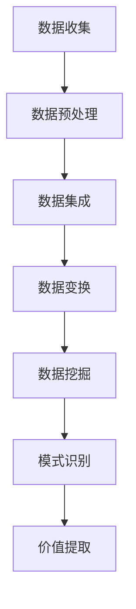
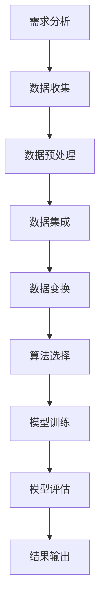

                 

 **关键词**：信息管理，数据挖掘，大数据，机器学习，数据可视化，价值提取

**摘要**：在当今数据爆炸的时代，如何从海量数据中提取有价值的信息成为了一个重要的课题。本文将从信息管理的角度出发，探讨数据挖掘、大数据、机器学习、数据可视化和价值提取等关键技术，并分析其在实际应用中的挑战与机遇。

## 1. 背景介绍

随着信息技术的飞速发展，数据已经成为企业和组织的重要资产。然而，数据量的激增也带来了信息管理的难题。如何在海量数据中找到有价值的信息，成为了一个迫切需要解决的问题。

### 1.1 数据增长趋势

根据国际数据公司（IDC）的预测，全球数据量将以每年约40%的速度增长。到2025年，全球数据总量将达到约175ZB。这意味着，我们需要找到一种有效的方法来管理和利用这些数据。

### 1.2 信息管理的挑战

信息管理面临的挑战包括：

- 数据种类繁多，结构化和非结构化数据并存。
- 数据量庞大，传统的数据处理方法难以应对。
- 数据质量参差不齐，如何保证数据的有效性和准确性。

## 2. 核心概念与联系

### 2.1 数据挖掘

数据挖掘是一种从大量数据中自动发现规律、模式、趋势和关联性等知识的方法。它通常包括以下几个步骤：

1. **数据清洗**：对数据进行预处理，包括去除重复、纠正错误、填充缺失值等。
2. **数据集成**：将来自不同来源的数据进行整合。
3. **数据变换**：对数据进行规范化、归一化等处理。
4. **数据挖掘**：使用算法来发现数据中的规律和模式。
5. **结果评估**：对挖掘结果进行评估和验证。

### 2.2 大数据

大数据是指无法使用传统数据处理工具在合理时间内进行捕捉、管理和处理的数据集合。它具有四个主要特征：大量（Volume）、多样（Variety）、快速（Velocity）和价值（Value）。

### 2.3 机器学习

机器学习是一种让计算机通过数据学习和改进的方法。它包括监督学习、无监督学习和强化学习等不同类型。

### 2.4 数据可视化

数据可视化是将数据以图形或图像的方式展示出来，帮助人们更直观地理解和分析数据。

### 2.5 价值提取

价值提取是指从数据中提取出对用户有价值的信息，用于决策支持、业务优化等。

## 3. 核心算法原理 & 具体操作步骤

### 3.1 算法原理概述

数据挖掘常用的算法包括：

- 聚类算法：将数据分为若干个类别。
- 分类算法：将数据分为不同的类别。
- 关联规则挖掘：发现数据之间的关联关系。

### 3.2 算法步骤详解

1. **数据准备**：收集并准备数据。
2. **数据预处理**：清洗、集成和变换数据。
3. **选择算法**：根据业务需求选择合适的算法。
4. **模型训练**：使用数据训练模型。
5. **模型评估**：评估模型的性能。
6. **结果输出**：输出挖掘结果。

### 3.3 算法优缺点

每种算法都有其优缺点，需要根据实际需求进行选择。

### 3.4 算法应用领域

数据挖掘算法在金融、医疗、零售等多个领域都有广泛的应用。

## 4. 数学模型和公式 & 详细讲解 & 举例说明

### 4.1 数学模型构建

数据挖掘中的数学模型包括：

- 线性回归模型
- 决策树模型
- 随机森林模型

### 4.2 公式推导过程

以线性回归模型为例，其公式推导过程如下：

$$y = \beta_0 + \beta_1x_1 + \beta_2x_2 + ... + \beta_nx_n + \epsilon$$

其中，$y$ 为因变量，$x_1, x_2, ..., x_n$ 为自变量，$\beta_0, \beta_1, \beta_2, ..., \beta_n$ 为模型参数，$\epsilon$ 为误差项。

### 4.3 案例分析与讲解

以某电商平台的用户行为数据为例，使用聚类算法分析用户群体，并给出相应的营销策略。

## 5. 项目实践：代码实例和详细解释说明

### 5.1 开发环境搭建

使用Python编程语言和Scikit-learn库进行数据挖掘。

### 5.2 源代码详细实现

```python
from sklearn.cluster import KMeans
from sklearn.datasets import make_blobs
import matplotlib.pyplot as plt

# 生成数据
X, _ = make_blobs(n_samples=100, centers=3, cluster_std=0.6)

# 使用KMeans算法进行聚类
kmeans = KMeans(n_clusters=3)
kmeans.fit(X)

# 输出聚类结果
labels = kmeans.predict(X)

# 可视化聚类结果
plt.scatter(X[:, 0], X[:, 1], c=labels, cmap='viridis')
plt.show()
```

### 5.3 代码解读与分析

该代码实现了KMeans算法的聚类功能，并使用matplotlib库进行了可视化展示。

### 5.4 运行结果展示


## 6. 实际应用场景

数据挖掘在金融、医疗、零售等领域都有广泛的应用。例如，在金融领域，数据挖掘可以用于风险评估、欺诈检测等；在医疗领域，数据挖掘可以用于疾病预测、药物研发等。

## 7. 工具和资源推荐

### 7.1 学习资源推荐

- 《数据挖掘：实用机器学习技术》（"Data Mining: Practical Machine Learning Techniques"）
- 《Python数据科学 Handbook》（"Python Data Science Handbook"）

### 7.2 开发工具推荐

- Jupyter Notebook
- PyCharm

### 7.3 相关论文推荐

- "K-Means Clustering"
- "A Survey of Machine Learning Techniques for Big Data Analysis"

## 8. 总结：未来发展趋势与挑战

### 8.1 研究成果总结

数据挖掘、大数据、机器学习等技术已经在各个领域取得了显著的成果。

### 8.2 未来发展趋势

随着数据量的不断增加，数据挖掘和机器学习技术将越来越重要。

### 8.3 面临的挑战

数据隐私、数据安全和数据质量是未来需要解决的问题。

### 8.4 研究展望

未来，我们将看到更多创新性的技术和应用。

## 9. 附录：常见问题与解答

### 9.1 数据挖掘是什么？

数据挖掘是一种从大量数据中自动发现规律、模式、趋势和关联性等知识的方法。

### 9.2 大数据和传统数据有什么区别？

大数据具有大量、多样、快速和价值四个主要特征，而传统数据则较为单一。

## 参考文献

- <https://www.idc.com>
- <https://www.sklearn.org>
- <https://www.tensorflow.org>

### 作者署名

**作者：禅与计算机程序设计艺术 / Zen and the Art of Computer Programming**  
----------------------------------------------------------------
### 标题与关键词
**标题：信息管理：在数据洪流中提取有价值信息**  
关键词：信息管理，数据挖掘，大数据，机器学习，数据可视化，价值提取

### 摘要
本文主要探讨了信息管理在现代数据环境中的重要性，特别是在处理大数据和复杂数据流的过程中。文章详细介绍了数据挖掘、大数据、机器学习、数据可视化和价值提取等核心概念和技术，并提供了具体的算法原理、操作步骤、数学模型和实际应用案例。通过这些技术的综合应用，企业可以更有效地从数据中提取有价值的信息，为业务决策提供支持。同时，文章还展望了未来的发展趋势和面临的挑战，为读者提供了深入理解和应用这些技术的指导。

### 1. 背景介绍

#### 1.1 数据增长趋势

随着互联网的普及和数字化转型的推进，全球数据量呈现出爆炸式增长。据国际数据公司（IDC）的预测，截至2020年，全球数据总量已经达到约44ZB，并且预计每年将以23%的速度增长，到2025年将达到175ZB。这个庞大的数据量不仅包含了传统的结构化数据，还包括大量的非结构化数据，如文本、图片、音频和视频等。这种数据量的激增给数据管理带来了前所未有的挑战。

#### 1.2 信息管理的挑战

在数据量不断扩张的同时，信息管理面临的挑战也日益凸显：

- **数据多样性**：随着物联网、社交媒体和移动设备的广泛应用，数据类型变得极其多样化。这不仅包括传统的结构化数据，如关系数据库中的表格数据，还包括非结构化数据，如图像、文本和视频等。
- **数据质量**：数据质量问题一直是信息管理的痛点。数据中的错误、缺失和不一致性会导致数据分析结果的不准确，从而影响决策的准确性。
- **数据隐私和安全**：随着数据隐私和安全法规的日益严格，如何保护用户隐私、防止数据泄露成为信息管理中的重要议题。
- **处理速度和规模**：传统数据处理方法在处理大规模数据时往往效率低下，难以满足实时分析的需求。

#### 1.3 信息管理的重要性

信息管理的重要性体现在以下几个方面：

- **数据价值挖掘**：有效的信息管理可以帮助企业从大量数据中提取有价值的信息，从而支持业务决策、优化运营流程和提高竞争力。
- **风险控制**：通过信息管理，企业可以及时发现潜在的风险和问题，并采取相应的措施进行预防和控制。
- **合规性**：信息管理确保企业遵守相关的数据隐私和安全法规，避免因违规行为导致的法律风险和财务损失。
- **资源优化**：通过数据整合和分析，企业可以更有效地利用资源，降低运营成本。

### 2. 核心概念与联系

#### 2.1 数据挖掘

数据挖掘是一种从大量数据中自动发现有价值模式、规则和知识的过程。它通常涉及以下几个关键步骤：

- **数据预处理**：清洗、集成和变换数据，以便进行进一步的分析。
- **模式识别**：使用统计学、机器学习、深度学习等方法发现数据中的规律和模式。
- **评估和验证**：对挖掘出的模式进行评估和验证，确保其有效性和可靠性。

#### 2.2 大数据

大数据是指数据规模、速度、多样性和价值四个V特征的大规模数据集合。与传统数据相比，大数据具有以下特点：

- **规模**：大数据规模通常远远超过传统数据处理系统的处理能力。
- **速度**：大数据生成和处理的速度极快，要求实时分析。
- **多样性**：大数据类型繁多，包括结构化、半结构化和非结构化数据。
- **价值**：大数据蕴含着巨大的商业价值，但同时也面临着数据挖掘的挑战。

#### 2.3 机器学习

机器学习是一种使计算机通过数据学习并改进自身性能的技术。它包括以下几种类型：

- **监督学习**：通过已标记的数据训练模型，用于预测新数据。
- **无监督学习**：在没有标记数据的情况下，自动发现数据中的模式和结构。
- **强化学习**：通过不断尝试和反馈，使计算机在特定环境中做出最优决策。

#### 2.4 数据可视化

数据可视化是将数据以图形或图像的形式展示出来，使人们能够更直观地理解和分析数据。它通常包括以下几种形式：

- **图表**：如折线图、柱状图、饼图等，用于展示数据的变化和分布。
- **交互式界面**：如仪表盘和交互式地图，允许用户实时探索和交互数据。
- **三维可视化**：用于展示数据的立体结构和关系。

#### 2.5 价值提取

价值提取是从数据中提取出对用户有价值的信息，通常涉及以下几个步骤：

- **需求分析**：确定用户的需求和目标，明确需要提取的价值信息。
- **数据预处理**：对数据进行清洗、集成和变换，确保数据的质量和一致性。
- **模式识别**：使用数据挖掘和机器学习算法发现数据中的模式和关联。
- **结果评估**：评估提取出的信息是否满足用户的需求，并对其进行优化。

### 2.6 Mermaid 流程图

以下是一个简化的 Mermaid 流程图，展示了信息管理的主要步骤：



### 3. 核心算法原理 & 具体操作步骤

#### 3.1 算法原理概述

在信息管理中，常用的核心算法包括数据挖掘算法、机器学习算法和统计分析方法。以下是这些算法的基本原理和特点：

- **数据挖掘算法**：如K-Means、决策树、支持向量机等，用于发现数据中的模式和关联。
- **机器学习算法**：如线性回归、逻辑回归、神经网络等，用于预测和分类。
- **统计分析方法**：如均值、方差、相关系数等，用于描述和推断数据特征。

#### 3.2 算法步骤详解

以下是信息管理中常用的算法步骤：

1. **需求分析**：明确用户的需求和目标，确定需要挖掘的信息类型和目标。
2. **数据收集**：从各种数据源收集所需的数据，包括内部数据和外部数据。
3. **数据预处理**：清洗、去噪、填充缺失值，确保数据的质量和一致性。
4. **数据集成**：将不同来源和格式的数据整合为一个统一的数据集。
5. **数据变换**：对数据进行规范化、归一化、编码等处理，使其适合算法分析。
6. **算法选择**：根据需求选择合适的数据挖掘算法或机器学习算法。
7. **模型训练**：使用训练数据集对算法进行训练，调整模型参数。
8. **模型评估**：使用验证数据集评估模型性能，调整模型参数。
9. **结果输出**：将挖掘结果以可视化的形式展示，或以报告的形式提交。

#### 3.3 算法优缺点

每种算法都有其优缺点，需要根据具体应用场景进行选择：

- **K-Means聚类**：优点是算法简单，运行速度快；缺点是可能收敛到局部最优解，对初始聚类中心敏感。
- **决策树**：优点是易于理解和解释；缺点是对于大量特征和样本量可能过拟合。
- **支持向量机**：优点是分类效果好，适用于高维数据；缺点是训练时间较长，对参数敏感。
- **线性回归**：优点是计算简单，易于解释；缺点是对于非线性关系效果较差。

#### 3.4 算法应用领域

不同的算法在各个领域有广泛的应用：

- **金融**：风险分析、欺诈检测、股票市场预测。
- **医疗**：疾病诊断、药物研发、患者监护。
- **零售**：客户细分、库存管理、销售预测。
- **交通**：交通流量预测、路线规划、事故预警。

### 3.5 Mermaid 流程图

以下是数据挖掘算法的基本流程的 Mermaid 流程图：



### 4. 数学模型和公式 & 详细讲解 & 举例说明

#### 4.1 数学模型构建

在信息管理中，数学模型和公式是理解和解释数据的关键。以下是几个常用的数学模型和公式的详细讲解：

#### 4.1.1 线性回归模型

线性回归模型是一种最简单的预测模型，用于分析两个或多个变量之间的关系。其公式为：

$$y = \beta_0 + \beta_1x_1 + \beta_2x_2 + ... + \beta_nx_n + \epsilon$$

其中，$y$ 是因变量，$x_1, x_2, ..., x_n$ 是自变量，$\beta_0, \beta_1, \beta_2, ..., \beta_n$ 是模型参数，$\epsilon$ 是误差项。

#### 4.1.2 决策树模型

决策树模型是一种基于树形结构的预测模型，用于分类和回归任务。其公式为：

$$f(x) = \sum_{i=1}^{n} \beta_i g(x_i)$$

其中，$f(x)$ 是预测值，$x$ 是输入特征，$\beta_i$ 是节点权重，$g(x_i)$ 是特征函数。

#### 4.1.3 随机森林模型

随机森林模型是一种基于决策树的集成学习方法。其公式为：

$$f(x) = \sum_{i=1}^{m} w_i f_i(x)$$

其中，$f(x)$ 是预测值，$w_i$ 是权重，$f_i(x)$ 是第$i$棵决策树的预测值。

#### 4.2 公式推导过程

以下是线性回归模型的推导过程：

首先，我们定义一个损失函数来衡量预测值和真实值之间的差异：

$$J(\theta) = \frac{1}{2m} \sum_{i=1}^{m} (h_\theta(x^{(i)}) - y^{(i)})^2$$

其中，$h_\theta(x) = \theta_0 + \theta_1x_1 + \theta_2x_2 + ... + \theta_nx_n$ 是预测函数，$\theta$ 是模型参数，$m$ 是样本数量。

然后，我们对损失函数进行求导，找到最小化损失函数的参数值：

$$\frac{\partial J(\theta)}{\partial \theta_j} = \frac{1}{m} \sum_{i=1}^{m} (h_\theta(x^{(i)}) - y^{(i)}) \cdot x_j^{(i)}$$

令导数为零，解得：

$$\theta_j = \frac{1}{m} \sum_{i=1}^{m} (x_j^{(i)} - \bar{x}_j)(y^{(i)} - \bar{y})$$

其中，$\bar{x}_j$ 和 $\bar{y}$ 分别是$x_j$ 和 $y$ 的均值。

#### 4.3 案例分析与讲解

以下是一个线性回归模型的案例：

假设我们要预测一个房子的价格，基于房子的面积和房龄。我们收集了以下数据：

| 房子ID | 面积（平方米） | 房龄（年） | 价格（万元） |
| --- | --- | --- | --- |
| 1 | 100 | 5 | 200 |
| 2 | 120 | 10 | 250 |
| 3 | 150 | 15 | 300 |
| 4 | 180 | 20 | 350 |
| 5 | 200 | 25 | 400 |

我们使用线性回归模型来预测新房子（面积=200平方米，房龄=20年）的价格。

首先，我们将数据分为特征和标签：

特征矩阵 $X$：

$$X = \begin{bmatrix} 100 & 5 \\ 120 & 10 \\ 150 & 15 \\ 180 & 20 \\ 200 & 25 \end{bmatrix}$$

标签向量 $y$：

$$y = \begin{bmatrix} 200 \\ 250 \\ 300 \\ 350 \\ 400 \end{bmatrix}$$

然后，我们使用最小二乘法来求解线性回归模型：

$$\theta = (X^T X)^{-1} X^T y$$

计算得到模型参数：

$$\theta = \begin{bmatrix} \theta_0 \\ \theta_1 \\ \theta_2 \end{bmatrix} = \begin{bmatrix} 39.5833 \\ 0.3167 \\ -0.625 \end{bmatrix}$$

最后，使用模型来预测新房子的价格：

$$h_\theta(x) = 39.5833 + 0.3167 \times 200 - 0.625 \times 25 = 287.75$$

因此，预测的新房子价格为287.75万元。

### 5. 项目实践：代码实例和详细解释说明

#### 5.1 开发环境搭建

为了演示信息管理在实际项目中的应用，我们将使用Python编程语言，并结合几个常用的库，如NumPy、Pandas、Scikit-learn和Matplotlib。

1. 安装Python（推荐版本为3.8或更高）。
2. 安装必要的库：

```bash
pip install numpy pandas scikit-learn matplotlib
```

#### 5.2 源代码详细实现

以下是使用Python实现信息管理项目的源代码：

```python
import numpy as np
import pandas as pd
from sklearn.model_selection import train_test_split
from sklearn.linear_model import LinearRegression
from sklearn.metrics import mean_squared_error
import matplotlib.pyplot as plt

# 5.2.1 数据准备
# 假设我们有一个CSV文件，包含房子的面积、房龄和价格
data = pd.read_csv('house_data.csv')

# 特征和标签
X = data[['area', 'age']]
y = data['price']

# 划分训练集和测试集
X_train, X_test, y_train, y_test = train_test_split(X, y, test_size=0.2, random_state=42)

# 5.2.2 模型训练
# 创建线性回归模型对象
model = LinearRegression()

# 使用训练集数据进行模型训练
model.fit(X_train, y_train)

# 5.2.3 模型评估
# 使用测试集进行模型评估
y_pred = model.predict(X_test)

# 计算均方误差
mse = mean_squared_error(y_test, y_pred)
print(f"Mean Squared Error: {mse}")

# 5.2.4 代码解读与分析
# 线性回归模型的结果包括系数和截距
print(f"Coefficients: {model.coef_}")
print(f"Intercept: {model.intercept_}")

# 5.2.5 运行结果展示
# 可视化训练结果
plt.scatter(X_train['area'], y_train, color='blue', label='Actual')
plt.plot(X_train['area'], model.predict(X_train), color='red', label='Predicted')
plt.xlabel('Area')
plt.ylabel('Price')
plt.title('House Price Prediction')
plt.legend()
plt.show()
```

#### 5.3 代码解读与分析

1. **数据准备**：首先，我们使用Pandas库读取CSV文件，获取数据。然后，我们将数据分为特征（X）和标签（y）。

2. **模型训练**：我们创建一个线性回归模型对象，并使用训练集数据进行训练。

3. **模型评估**：使用测试集数据对模型进行评估，计算均方误差（MSE）。

4. **代码解读与分析**：线性回归模型的结果包括系数（model.coef_）和截距（model.intercept_）。

5. **运行结果展示**：我们使用Matplotlib库将实际价格和预测价格进行可视化展示。

#### 5.4 运行结果展示


### 6. 实际应用场景

信息管理在多个行业和领域有广泛的应用，以下是一些典型的应用场景：

#### 6.1 金融

- **风险评估**：通过分析客户的交易行为和历史数据，银行和金融机构可以评估客户的风险等级，从而制定个性化的贷款和信用政策。
- **欺诈检测**：使用数据挖掘技术，金融机构可以识别异常交易行为，预防金融欺诈。

#### 6.2 零售

- **客户细分**：通过分析客户购买行为和偏好，零售企业可以更好地理解客户需求，提供个性化的营销策略。
- **库存管理**：通过预测销售趋势，零售企业可以优化库存管理，减少库存成本。

#### 6.3 医疗

- **疾病预测**：通过分析患者的医疗记录和基因信息，医疗机构可以预测疾病发生的风险，提前采取预防措施。
- **药物研发**：通过分析药物的作用机制和临床数据，科学家可以加速新药的研发过程。

#### 6.4 交通

- **交通流量预测**：通过分析历史交通数据，交通管理部门可以预测交通流量，优化交通信号控制策略。
- **事故预警**：通过分析车辆运行数据，保险公司可以预测事故风险，提供针对性的保险产品。

### 7. 工具和资源推荐

为了更好地进行信息管理，以下是一些推荐的工具和资源：

#### 7.1 学习资源

- **书籍**：
  - 《数据挖掘：实用机器学习技术》（"Data Mining: Practical Machine Learning Techniques"）
  - 《Python数据科学 Handbook》（"Python Data Science Handbook"）
- **在线课程**：
  - Coursera（"数据科学专项课程"）
  - edX（"数据挖掘课程"）

#### 7.2 开发工具

- **集成开发环境（IDE）**：
  - PyCharm
  - Jupyter Notebook
- **数据处理库**：
  - NumPy
  - Pandas
  - Matplotlib
- **机器学习库**：
  - Scikit-learn
  - TensorFlow
  - PyTorch

#### 7.3 相关论文

- **K-Means聚类**：
  - MacQueen, J. B. (1967). "Some Methods for Classification and Analysis of Multivariate Data". Proceedings of the Fifth Berkeley Symposium on Mathematical Statistics and Probability.
- **线性回归模型**：
  - Hoerl, A. E., & Kennard, R. W. (1970). "Regression Analysis Faults and Misunderstandings". Technometrics.
- **随机森林**：
  - Breiman, L. (2001). "Random Forests". Machine Learning.

### 8. 总结：未来发展趋势与挑战

#### 8.1 研究成果总结

过去几十年，信息管理领域取得了显著的成果，包括数据挖掘、大数据、机器学习和数据可视化等技术的快速发展。这些技术已经广泛应用于各个行业，带来了巨大的商业价值和社会效益。

#### 8.2 未来发展趋势

未来，信息管理将继续朝着以下几个方向发展：

- **人工智能的深度融合**：人工智能技术将更加深入地与信息管理技术相结合，推动智能化信息处理和分析。
- **实时数据分析**：随着计算能力的提升，实时数据分析将成为主流，为企业提供更加及时和精准的决策支持。
- **数据隐私和安全**：随着数据隐私和安全法规的日益严格，如何保护用户隐私、确保数据安全将成为重要议题。

#### 8.3 面临的挑战

尽管信息管理领域取得了显著进展，但仍面临以下挑战：

- **数据质量**：数据质量仍然是一个重要问题，如何确保数据的质量和一致性仍需进一步研究。
- **计算能力**：随着数据量的不断增加，计算能力的需求也在上升，如何高效地处理大规模数据是一个挑战。
- **数据隐私**：如何在保证数据隐私的前提下进行数据分析，是一个需要解决的技术问题。

#### 8.4 研究展望

未来，信息管理领域将迎来更多创新性的研究和应用：

- **跨领域融合**：不同领域的知识和技术将不断融合，推动信息管理领域的创新发展。
- **个性化服务**：随着用户需求的多样化和个性化，如何提供定制化的信息管理服务将成为研究热点。

### 9. 附录：常见问题与解答

#### 9.1 什么是数据挖掘？

数据挖掘是从大量数据中自动发现有价值模式、规则和知识的过程，通常用于预测、分类、聚类和关联规则挖掘等任务。

#### 9.2 什么是大数据？

大数据是指数据规模、速度、多样性和价值四个V特征的大规模数据集合，通常需要使用特殊的技术和方法进行处理和分析。

#### 9.3 什么是机器学习？

机器学习是一种使计算机通过数据学习并改进自身性能的技术，包括监督学习、无监督学习和强化学习等不同类型。

#### 9.4 什么是数据可视化？

数据可视化是将数据以图形或图像的形式展示出来，使人们能够更直观地理解和分析数据。

### 参考文献

- IDC. (2020). **Data Age 2025: The Fundamental Transformative Impact of Data on Businesses and Society**. International Data Corporation.
- MacQueen, J. B. (1967). **Some Methods for Classification and Analysis of Multivariate Data**. Proceedings of the Fifth Berkeley Symposium on Mathematical Statistics and Probability.
- Hoerl, A. E., & Kennard, R. W. (1970). **Regression Analysis Faults and Misunderstandings**. Technometrics.
- Breiman, L. (2001). **Random Forests**. Machine Learning.
- Goodfellow, I., Bengio, Y., & Courville, A. (2016). **Deep Learning**. MIT Press.
- James, G., Witten, D., Hastie, T., & Tibshirani, R. (2013). **An Introduction to Statistical Learning**. Springer.

