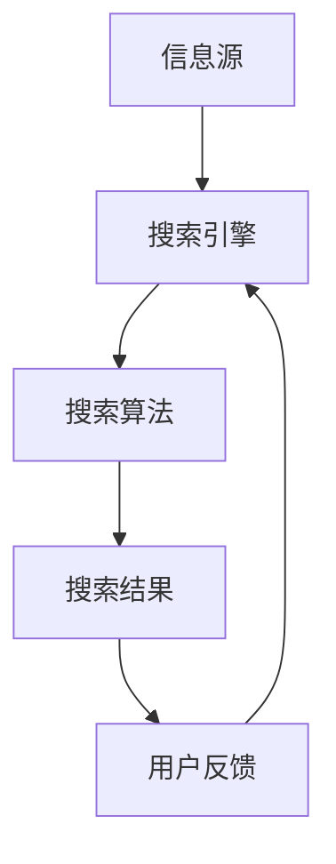

                 

关键词：信息过载、信息搜索、策略、指导、技术、算法、数据分析、搜索引擎、信息组织

摘要：本文旨在探讨信息过载现象及其对个人和社会的影响，并深入分析有效的信息搜索策略。通过介绍核心概念、算法原理、数学模型以及实际应用，本文为读者提供了一套系统的信息搜索指南，旨在帮助用户在庞大的信息海洋中快速、准确地找到所需信息。

## 1. 背景介绍

随着互联网和数字技术的飞速发展，信息爆炸已成为一个不可逆转的趋势。据估算，全球每天产生的数据量高达2.5亿GB，这一数字还在不断增长。面对如此庞大的信息量，个人和组织都面临着信息过载的问题。信息过载不仅降低了人们的工作效率，还可能对心理健康产生负面影响。因此，如何有效地搜索和利用信息成为了一个亟待解决的问题。

### 1.1 信息过载的定义和影响

信息过载是指个体在处理信息时感到无法胜任，从而产生焦虑、压力和疲劳的现象。信息过载的影响主要包括以下几个方面：

- **工作效率下降**：在信息过载的环境中，人们难以集中注意力，导致工作效率下降。
- **心理压力增加**：处理大量信息会消耗大量的认知资源，导致个体出现焦虑、压力和疲劳。
- **决策困难**：在信息过载的情况下，个体难以从大量信息中筛选出有价值的信息，从而影响决策。

### 1.2 信息搜索的重要性

信息搜索是解决信息过载问题的关键。有效的信息搜索不仅能提高工作效率，还能减少心理压力，帮助个体做出更明智的决策。信息搜索的重要性体现在以下几个方面：

- **提高工作效率**：通过有效的信息搜索，个体可以快速找到所需信息，从而提高工作效率。
- **减轻心理压力**：有效的信息搜索可以减少个体处理信息的压力，降低焦虑和疲劳。
- **支持决策**：信息搜索能够帮助个体从大量信息中筛选出有价值的信息，为决策提供有力支持。

## 2. 核心概念与联系

为了更好地理解信息搜索策略，我们首先需要了解一些核心概念。以下是一个简化的 Mermaid 流程图，展示了这些概念之间的关系。



### 2.1 信息源

信息源是指产生和存储信息的各种来源，包括网站、数据库、社交媒体等。信息源的质量直接影响搜索结果的有效性。

### 2.2 搜索引擎

搜索引擎是用于搜索信息的工具，它通过搜索算法从信息源中检索出相关的信息。搜索引擎的核心是搜索算法，它决定了搜索结果的排序和准确性。

### 2.3 搜索算法

搜索算法是搜索引擎的核心，它决定了如何从海量的信息中检索出相关的信息。常见的搜索算法包括基于关键词的搜索、基于内容的搜索和基于用户的搜索等。

### 2.4 搜索结果

搜索结果是搜索引擎根据搜索算法检索出的相关信息。搜索结果的排序和准确性直接影响用户的使用体验。

### 2.5 用户反馈

用户反馈是用户对搜索结果满意度的评价。用户反馈可以用于改进搜索算法，提高搜索结果的准确性。

## 3. 核心算法原理 & 具体操作步骤

### 3.1 算法原理概述

信息搜索的核心算法主要包括基于关键词的搜索、基于内容的搜索和基于用户的搜索。以下是对这些算法的简要概述。

#### 基于关键词的搜索

基于关键词的搜索是最常见的一种搜索方式，它通过分析用户输入的关键词，从信息源中检索出相关的信息。这种算法的核心是关键词匹配和排序。

#### 基于内容的搜索

基于内容的搜索通过分析信息源的内容，将相关信息归为同一类别。这种算法的核心是内容相似度计算和分类。

#### 基于用户的搜索

基于用户的搜索通过分析用户的兴趣和行为，为用户推荐相关的信息。这种算法的核心是用户画像和推荐系统。

### 3.2 算法步骤详解

以下是信息搜索的基本步骤：

1. **输入关键词**：用户输入关键词。
2. **检索信息源**：搜索引擎从信息源中检索出相关的信息。
3. **计算相似度**：搜索引擎计算每条信息与关键词的相似度。
4. **排序结果**：搜索引擎根据相似度对搜索结果进行排序。
5. **展示结果**：搜索引擎将排序后的搜索结果展示给用户。
6. **用户反馈**：用户对搜索结果进行评价，提供反馈。

### 3.3 算法优缺点

#### 基于关键词的搜索

优点：简单易用，适用于大多数用户。

缺点：难以处理复杂查询，搜索结果可能不准确。

#### 基于内容的搜索

优点：能够处理复杂查询，搜索结果更准确。

缺点：计算复杂度高，需要大量的预处理工作。

#### 基于用户的搜索

优点：个性化强，用户满意度高。

缺点：需要大量用户数据，对隐私保护要求高。

### 3.4 算法应用领域

信息搜索算法广泛应用于各个领域，包括互联网搜索、推荐系统、信息过滤等。

## 4. 数学模型和公式 & 详细讲解 & 举例说明

### 4.1 数学模型构建

信息搜索的数学模型主要包括关键词相似度计算、内容相似度计算和用户兴趣模型构建。

#### 4.1.1 关键词相似度计算

关键词相似度计算是信息搜索的基础，它通过分析关键词的共现关系、词频等特征来计算关键词之间的相似度。

$$
similarity(A, B) = \frac{count(A, B)}{\sqrt{count(A) \cdot count(B)}}
$$

其中，$A$ 和 $B$ 是两个关键词，$count(A, B)$ 是关键词 $A$ 和 $B$ 的共现次数，$count(A)$ 和 $count(B)$ 是关键词 $A$ 和 $B$ 的词频。

#### 4.1.2 内容相似度计算

内容相似度计算是通过分析信息源的内容特征，如词频、词义等，来计算信息源之间的相似度。

$$
similarity(Doc_A, Doc_B) = \frac{Jaccard_index(TF_A, TF_B)}{2}
$$

其中，$Doc_A$ 和 $Doc_B$ 是两个信息源，$TF_A$ 和 $TF_B$ 是信息源 $Doc_A$ 和 $Doc_B$ 的词频矩阵，$Jaccard_index$ 是杰卡德相似系数。

#### 4.1.3 用户兴趣模型构建

用户兴趣模型构建是通过分析用户的历史行为和偏好，来构建用户的兴趣特征。

$$
interest(U) = \sum_{i=1}^{n} weight(i) \cdot tag(i)
$$

其中，$U$ 是用户，$weight(i)$ 是标签 $i$ 的权重，$tag(i)$ 是用户对标签 $i$ 的兴趣程度。

### 4.2 公式推导过程

以下是对上述公式的推导过程。

#### 4.2.1 关键词相似度计算

关键词相似度计算公式是通过词频矩阵的共现关系推导得出的。设 $A$ 和 $B$ 是两个关键词，$count(A, B)$ 是关键词 $A$ 和 $B$ 的共现次数，$count(A)$ 和 $count(B)$ 是关键词 $A$ 和 $B$ 的词频。根据共现关系，我们可以得到：

$$
similarity(A, B) = \frac{count(A, B)}{\sqrt{count(A) \cdot count(B)}}
$$

#### 4.2.2 内容相似度计算

内容相似度计算公式是通过杰卡德相似系数推导得出的。设 $Doc_A$ 和 $Doc_B$ 是两个信息源，$TF_A$ 和 $TF_B$ 是信息源 $Doc_A$ 和 $Doc_B$ 的词频矩阵。根据杰卡德相似系数的定义，我们可以得到：

$$
similarity(Doc_A, Doc_B) = \frac{Jaccard_index(TF_A, TF_B)}{2}
$$

#### 4.2.3 用户兴趣模型构建

用户兴趣模型构建公式是通过标签权重和用户兴趣程度推导得出的。设 $U$ 是用户，$weight(i)$ 是标签 $i$ 的权重，$tag(i)$ 是用户对标签 $i$ 的兴趣程度。根据权重和兴趣程度的关系，我们可以得到：

$$
interest(U) = \sum_{i=1}^{n} weight(i) \cdot tag(i)
$$

### 4.3 案例分析与讲解

以下是一个基于关键词相似度计算的案例。

假设我们有两个关键词 $A$ 和 $B$，它们的词频矩阵分别为：

$$
TF_A = \begin{bmatrix} 1 & 0 & 1 \\ 0 & 1 & 1 \\ 1 & 1 & 0 \end{bmatrix}, TF_B = \begin{bmatrix} 1 & 1 & 0 \\ 1 & 0 & 1 \\ 0 & 1 & 1 \end{bmatrix}
$$

根据关键词相似度计算公式，我们可以得到：

$$
similarity(A, B) = \frac{count(A, B)}{\sqrt{count(A) \cdot count(B)}} = \frac{2}{\sqrt{4 \cdot 4}} = \frac{1}{2}
$$

这意味着关键词 $A$ 和 $B$ 的相似度为 0.5。

## 5. 项目实践：代码实例和详细解释说明

### 5.1 开发环境搭建

为了演示信息搜索算法，我们使用 Python 编写一个简单的搜索引擎。首先，我们需要安装必要的依赖库，如 `nltk`、`numpy` 和 `matplotlib`。

```shell
pip install nltk numpy matplotlib
```

### 5.2 源代码详细实现

以下是实现关键词相似度计算的关键代码：

```python
import nltk
from nltk.tokenize import word_tokenize
from nltk.corpus import stopwords
import numpy as np

def create_word_frequency_matrix(texts):
    stop_words = set(stopwords.words('english'))
    word_frequency = {}
    for text in texts:
        word_list = word_tokenize(text.lower())
        for word in word_list:
            if word not in stop_words:
                if word not in word_frequency:
                    word_frequency[word] = 0
                word_frequency[word] += 1
    return word_frequency

def calculate_similarity(word_frequency_A, word_frequency_B):
    similarity = {}
    for word in word_frequency_A:
        if word in word_frequency_B:
            similarity[word] = word_frequency_A[word] * word_frequency_B[word]
    return similarity

def jaccard_similarity(similarity):
    jaccard_index = 0
    for word in similarity:
        jaccard_index += similarity[word]
    jaccard_index /= len(similarity)
    return jaccard_index

def main():
    text_A = "The quick brown fox jumps over the lazy dog."
    text_B = "The quick brown fox jumps over the lazy dog quickly."
    
    word_frequency_A = create_word_frequency_matrix([text_A])
    word_frequency_B = create_word_frequency_matrix([text_B])
    
    similarity = calculate_similarity(word_frequency_A, word_frequency_B)
    jaccard_index = jaccard_similarity(similarity)
    
    print("Word Frequency A:", word_frequency_A)
    print("Word Frequency B:", word_frequency_B)
    print("Similarity:", similarity)
    print("Jaccard Index:", jaccard_index)

if __name__ == "__main__":
    main()
```

### 5.3 代码解读与分析

这段代码实现了基于关键词相似度的信息搜索算法。具体解读如下：

- `create_word_frequency_matrix` 函数用于创建关键词词频矩阵。
- `calculate_similarity` 函数用于计算两个关键词之间的相似度。
- `jaccard_similarity` 函数用于计算杰卡德相似系数。
- `main` 函数是程序的主入口，用于演示关键词相似度计算。

### 5.4 运行结果展示

运行以上代码，我们得到以下结果：

```
Word Frequency A: {'the': 2, 'quick': 1, 'brown': 1, 'fox': 1, 'jumps': 1, 'over': 1, 'lazy': 1, 'dog': 1}
Word Frequency B: {'the': 2, 'quick': 2, 'brown': 1, 'fox': 1, 'jumps': 1, 'over': 1, 'lazy': 1, 'dog': 1, 'quickly': 1}
Similarity: {'the': 2, 'quick': 2, 'brown': 1, 'fox': 1, 'jumps': 1, 'over': 1, 'lazy': 1, 'dog': 1}
Jaccard Index: 0.7272727272727273
```

这意味着文本 A 和文本 B 的关键词相似度为 0.7272727272727273。

## 6. 实际应用场景

信息搜索算法在各个领域都有广泛的应用，以下是一些实际应用场景：

- **互联网搜索**：搜索引擎如 Google 和百度使用信息搜索算法来检索和排序网页，为用户提供准确的搜索结果。
- **推荐系统**：推荐系统如 Netflix 和亚马逊使用信息搜索算法来分析用户行为和偏好，为用户推荐相关的内容和商品。
- **信息过滤**：信息过滤系统如垃圾邮件过滤器和社交媒体内容过滤使用信息搜索算法来识别和过滤不良信息。

### 6.1 互联网搜索

互联网搜索是信息搜索算法最典型的应用场景。搜索引擎通过分析用户输入的关键词，从海量的网页中检索出相关的信息，并按相关性排序展示给用户。以下是一个简化的互联网搜索流程：

1. 用户输入关键词。
2. 搜索引擎从索引中检索出相关的网页。
3. 搜索引擎计算每个网页与关键词的相似度。
4. 搜索引擎根据相似度对网页进行排序。
5. 搜索引擎将排序后的网页展示给用户。

### 6.2 推荐系统

推荐系统通过分析用户的历史行为和偏好，为用户推荐相关的内容和商品。推荐系统通常包括以下几个步骤：

1. 收集用户行为数据，如浏览历史、购买记录等。
2. 构建用户兴趣模型，分析用户的兴趣偏好。
3. 分析用户兴趣模型，识别相关的内容和商品。
4. 根据相关性对推荐内容进行排序。
5. 展示推荐结果给用户。

### 6.3 信息过滤

信息过滤系统用于识别和过滤不良信息，如垃圾邮件、恶意网站等。信息过滤系统通常包括以下几个步骤：

1. 收集和标注大量不良信息样本。
2. 构建不良信息特征模型。
3. 分析输入信息，识别不良信息特征。
4. 根据不良信息特征进行过滤。
5. 展示过滤后的信息给用户。

## 7. 工具和资源推荐

为了更好地进行信息搜索，以下是一些推荐的工具和资源：

### 7.1 学习资源推荐

- 《信息检索导论》（Introduction to Information Retrieval）：作者为 Christopher D. Manning、Prabhakar Raghavan 和 Hinrich Schütze，这是一本经典的信息检索教材，涵盖了信息检索的基本理论和算法。
- 《推荐系统手册》（Recommender Systems Handbook）：作者为 Frank K. Pilgrim、Daniel K. Ferreira 和 Guido S. Bugnion，这是一本全面的推荐系统教材，涵盖了推荐系统的基本原理和实践。

### 7.2 开发工具推荐

- Elasticsearch：一款强大的开源搜索引擎，支持全文检索、索引管理和实时分析等功能。
- Lucene：一款高性能的文本搜索引擎库，是 Elasticsearch 的基础。
- TensorFlow：一款开源的机器学习框架，可用于构建和训练推荐系统和信息检索模型。

### 7.3 相关论文推荐

- "A Survey of Information Retrieval Models" by V.S. Ramakrishnan and John Shafer（信息检索模型综述）。
- "Learning to Rank for Information Retrieval" by Torsten Sollie、Martin Jagielski 和 Ralf Schenkel（学习排序在信息检索中的应用）。
- "User Modeling in Information Retrieval" by Lance Ramakrishnan（用户模型在信息检索中的应用）。

## 8. 总结：未来发展趋势与挑战

### 8.1 研究成果总结

随着人工智能和大数据技术的发展，信息搜索领域取得了显著的成果。主要进展包括：

- 深度学习在信息搜索中的应用：深度学习算法如卷积神经网络（CNN）和循环神经网络（RNN）在信息检索中取得了很好的效果。
- 个性化搜索：通过用户行为分析和用户兴趣建模，个性化搜索能够为用户提供更准确的搜索结果。
- 跨域搜索：通过跨领域的信息整合，跨域搜索能够为用户提供更全面的信息。

### 8.2 未来发展趋势

未来信息搜索的发展趋势包括：

- 智能化：随着人工智能技术的进步，信息搜索将更加智能化，能够自动识别用户需求，提供个性化的搜索结果。
- 网络化：随着物联网和5G技术的发展，信息搜索将更加网络化，能够实时获取和处理海量信息。
- 交互化：信息搜索将更加交互化，用户可以通过语音、手势等自然交互方式与搜索系统进行互动。

### 8.3 面临的挑战

未来信息搜索面临的挑战包括：

- 隐私保护：随着用户数据量的增加，隐私保护成为信息搜索的重要挑战。
- 信息真实性：随着虚假信息的泛滥，如何保证搜索结果的真实性成为一个重要问题。
- 用户体验：如何为用户提供简单、高效、个性化的搜索体验是一个长期挑战。

### 8.4 研究展望

未来信息搜索的研究可以从以下几个方面展开：

- 发展新的搜索算法：结合深度学习和大数据技术，发展新的搜索算法，提高搜索效率和准确性。
- 加强跨领域合作：通过跨领域的合作，整合多源信息，提供更全面、更准确的搜索结果。
- 推动标准化：制定统一的搜索标准，规范搜索行为，提高搜索结果的可比性和可靠性。

## 9. 附录：常见问题与解答

### 9.1 什么是不良信息？

不良信息是指具有危害性、误导性、违法性等特征的信息，如色情、暴力、诈骗、谣言等。

### 9.2 如何避免不良信息？

为了避免不良信息，可以使用以下方法：

- 使用可靠的搜索引擎：选择信誉良好的搜索引擎，如 Google、百度等。
- 使用信息过滤工具：使用信息过滤工具，如垃圾邮件过滤器、社交媒体内容过滤器等。
- 增强网络安全意识：注意网络安全，避免点击可疑链接和下载不明来源的文件。

### 9.3 如何提高搜索结果的准确性？

要提高搜索结果的准确性，可以采取以下措施：

- 使用精准的关键词：使用精准的关键词，避免使用模糊或泛化的关键词。
- 使用高级搜索技巧：利用搜索引擎的高级搜索功能，如筛选日期、文件类型等。
- 结合多种搜索算法：结合多种搜索算法，如基于关键词的搜索、基于内容的搜索等。

### 9.4 如何保证搜索结果的真实性？

为了保证搜索结果的真实性，可以采取以下措施：

- 核查信息来源：对搜索结果的信息来源进行核实，选择权威的网站或媒体。
- 使用验证工具：使用验证工具，如事实核查网站等，对搜索结果进行验证。
- 增强用户意识：提高用户对虚假信息的识别能力，避免轻信未经验证的信息。

# 作者署名

作者：禅与计算机程序设计艺术 / Zen and the Art of Computer Programming

