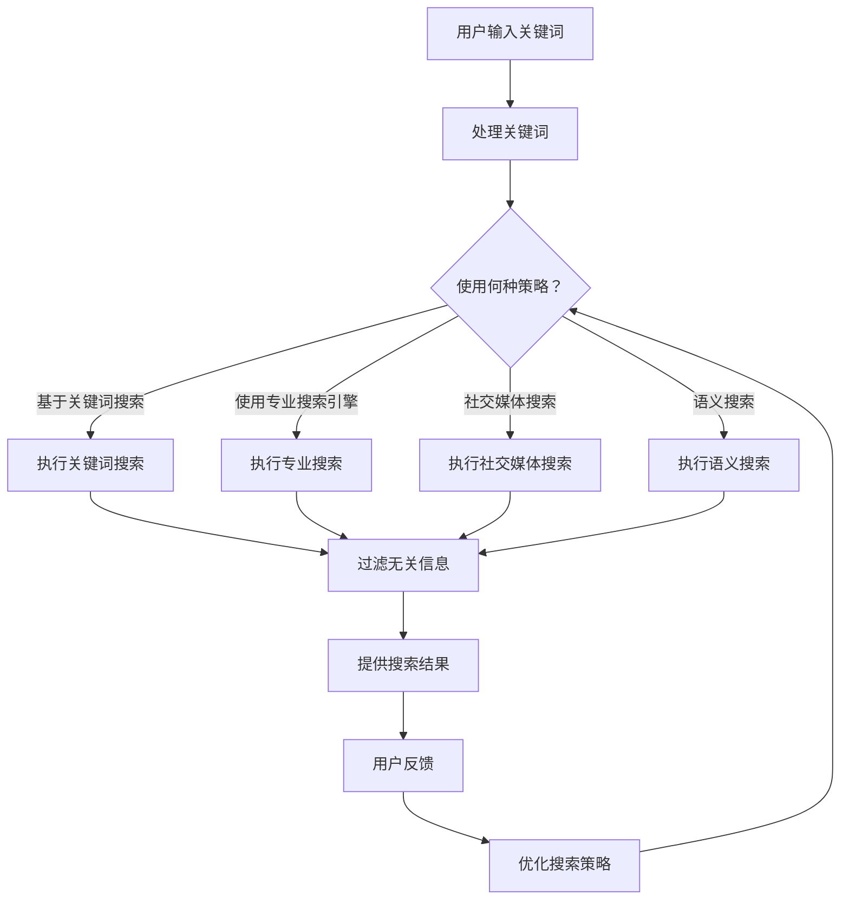

                 

在当今信息化时代，我们每个人都面临着信息过载的问题。大量的信息以各种形式涌入我们的生活，使得我们很难筛选出真正有价值的信息。因此，掌握有效的信息搜索策略变得尤为重要。本文将探讨信息过载的现象，并介绍一系列实用的信息搜索策略和指南，帮助您在庞大的信息海洋中找到所需的信息。

## 关键词

- 信息过载
- 信息搜索策略
- 信息筛选
- 数据挖掘
- 情感分析
- 人工智能

## 摘要

本文首先介绍了信息过载现象，分析了其产生的原因和影响。接着，探讨了有效的信息搜索策略，包括基于关键词搜索、使用专业搜索引擎、社交媒体搜索、语义搜索等。最后，提供了实用的信息搜索指南，包括使用合适的工具、优化搜索关键词、利用过滤机制等，帮助您在庞大的信息海洋中找到所需信息。

## 1. 背景介绍

随着互联网和移动设备的普及，我们每天接触到的大量信息使得信息过载成为普遍现象。研究表明，人们每天接收的信息量是前所未有的。据估计，一个人每天要处理大约100,000个字的信息，这相当于每天阅读一份150页的报纸。这样的信息量对个人的认知负担和心理健康产生了很大的影响。信息过载不仅降低了我们的工作效率，还可能导致焦虑、压力和注意力分散。

### 1.1 信息过载的原因

信息过载的原因可以从以下几个方面来分析：

1. **互联网的普及**：互联网提供了丰富的信息来源，但同时也使得信息的传播速度大大加快，信息的产生量急剧增加。

2. **移动设备的普及**：移动设备的普及使得我们随时随地都能获取信息，但这也意味着我们需要处理更多的信息。

3. **社交媒体的兴起**：社交媒体平台如Facebook、Twitter等，提供了丰富的信息和交流渠道，但同时也带来了大量的噪音和无效信息。

4. **信息的爆炸性增长**：随着科学技术的进步，信息的产生和传播速度越来越快，信息的种类和数量也在不断增长。

### 1.2 信息过载的影响

信息过载对我们的工作和生活产生了多方面的影响：

1. **工作效率降低**：过多的信息处理会消耗我们的时间和精力，导致工作效率降低。

2. **心理健康问题**：长时间处于信息过载状态，可能会导致焦虑、压力和心理健康问题。

3. **注意力分散**：过多的信息会分散我们的注意力，导致难以集中精力完成任务。

4. **信息遗忘**：过多的信息会导致我们难以记住和处理，最终导致信息的遗忘。

## 2. 核心概念与联系

在解决信息过载问题之前，我们需要了解一些核心概念，包括数据挖掘、情感分析、人工智能等。

### 2.1 数据挖掘

数据挖掘是一种从大量数据中提取有用信息的技术。它涉及各种算法和技术，如机器学习、统计分析、模式识别等。数据挖掘的目标是从大量数据中发现隐藏的模式和趋势，从而帮助决策和预测。

### 2.2 情感分析

情感分析是一种自然语言处理技术，用于分析和识别文本中的情感倾向。它可以帮助我们了解人们对某个主题或产品的情感反应，从而为市场营销、客户服务等领域提供有价值的信息。

### 2.3 人工智能

人工智能是一种模拟人类智能的技术，包括机器学习、深度学习、自然语言处理等。人工智能可以帮助我们自动化和优化信息处理过程，从而减轻信息过载带来的压力。

### 2.4 信息搜索策略与架构

为了有效地搜索信息，我们需要了解不同的信息搜索策略和其背后的架构。

#### 2.4.1 基于关键词搜索

基于关键词搜索是最常用的信息搜索策略。它通过分析用户输入的关键词，在数据库中查找与之相关的信息。这种策略的优点是简单易用，缺点是可能产生大量的无关信息。

#### 2.4.2 使用专业搜索引擎

专业搜索引擎如Google、Bing等，利用复杂的算法和索引机制，提供高质量的搜索结果。这种策略的优点是搜索结果准确，缺点是需要用户具备一定的搜索技巧。

#### 2.4.3 社交媒体搜索

社交媒体搜索通过分析用户在社交媒体上的行为和言论，提供相关的搜索结果。这种策略的优点是能够获取到实时和个性化的信息，缺点是需要处理大量的噪音和无效信息。

#### 2.4.4 语义搜索

语义搜索通过分析文本的语义信息，提供更精确和相关的搜索结果。这种策略的优点是能够降低信息过载，缺点是需要强大的自然语言处理技术支持。

### 2.5 Mermaid 流程图

以下是一个描述信息搜索策略与架构的Mermaid流程图：



## 3. 核心算法原理 & 具体操作步骤

### 3.1 算法原理概述

为了更有效地搜索信息，我们需要了解一些核心算法原理，包括搜索引擎的索引机制、自然语言处理技术、机器学习算法等。

#### 3.1.1 搜索引擎的索引机制

搜索引擎通过索引机制将网页的内容进行分类和存储。索引机制包括以下步骤：

1. **爬虫**：搜索引擎使用爬虫程序从互联网上抓取网页。
2. **解析**：爬虫程序对网页进行解析，提取出关键词、标题、描述等信息。
3. **索引**：搜索引擎将提取出的信息进行索引，以便快速检索。

#### 3.1.2 自然语言处理技术

自然语言处理技术用于处理和分析文本信息，主要包括以下方面：

1. **分词**：将文本分割成单词或短语。
2. **词性标注**：为每个单词或短语标注词性，如名词、动词、形容词等。
3. **语义分析**：分析文本的语义信息，如情感分析、实体识别等。

#### 3.1.3 机器学习算法

机器学习算法用于优化搜索结果，主要包括以下方面：

1. **排序算法**：根据用户的历史行为和偏好，对搜索结果进行排序。
2. **推荐算法**：根据用户的搜索历史和兴趣，推荐相关的信息。

### 3.2 算法步骤详解

以下是信息搜索算法的具体操作步骤：

#### 3.2.1 用户输入关键词

1. 用户在搜索框中输入关键词。
2. 搜索引擎将接收到的关键词发送到服务器。

#### 3.2.2 处理关键词

1. 搜索引擎对关键词进行分词和词性标注。
2. 搜索引擎根据关键词的词性和语义信息，确定搜索策略。

#### 3.2.3 执行搜索

1. 如果选择基于关键词搜索，搜索引擎将在索引中查找与关键词相关的内容。
2. 如果选择使用专业搜索引擎，搜索引擎将调用相应的API进行搜索。
3. 如果选择社交媒体搜索，搜索引擎将分析用户的社交媒体行为和言论。
4. 如果选择语义搜索，搜索引擎将分析文本的语义信息。

#### 3.2.4 过滤无关信息

1. 搜索引擎根据用户的历史行为和偏好，过滤掉无关的信息。
2. 搜索引擎使用自然语言处理技术，分析文本的情感和语义信息，进一步过滤无关信息。

#### 3.2.5 提供搜索结果

1. 搜索引擎将过滤后的搜索结果按相关性排序。
2. 搜索引擎将搜索结果呈现给用户。

### 3.3 算法优缺点

#### 优点：

1. 提高搜索效率：通过算法优化，用户可以快速找到所需信息。
2. 减少信息过载：通过过滤无关信息，用户可以减少信息过载的影响。
3. 个性化推荐：根据用户的历史行为和偏好，搜索引擎可以提供个性化的搜索结果。

#### 缺点：

1. 可能产生误判：算法在处理大量数据时，可能产生误判，导致搜索结果不准确。
2. 需要大量的计算资源：算法的优化和计算需要大量的计算资源，可能导致搜索服务器的性能下降。

### 3.4 算法应用领域

信息搜索算法广泛应用于各个领域，如：

1. **搜索引擎**：如Google、Bing等。
2. **社交媒体**：如Facebook、Twitter等。
3. **电子商务**：如Amazon、淘宝等。
4. **信息推荐**：如Netflix、YouTube等。

## 4. 数学模型和公式 & 详细讲解 & 举例说明

为了更好地理解信息搜索算法，我们需要了解一些数学模型和公式。以下是一些常用的数学模型和公式，包括计算相关性、排序算法等。

### 4.1 计算相关性

计算相关性是信息搜索算法中的一个核心问题。以下是一种常用的计算相关性的公式：

$$
r(A, B) = \frac{P(A|B)P(B)}{P(A)P(B)}
$$

其中，$r(A, B)$ 表示事件A和B的相关性，$P(A|B)$ 表示在B发生的条件下A发生的概率，$P(B)$ 表示B发生的概率，$P(A)$ 表示A发生的概率。

#### 示例：

假设用户搜索关键词“计算机科学”，搜索引擎返回了两个网页A和B。根据用户的历史行为和偏好，我们可以计算网页A和关键词“计算机科学”的相关性：

1. $P(计算机科学|A) = 0.8$：在网页A中，关键词“计算机科学”出现的概率为80%。
2. $P(A) = 0.2$：网页A在整个搜索引擎中的出现概率为20%。
3. $P(计算机科学) = 0.6$：关键词“计算机科学”在整个搜索引擎中出现的概率为60%。

根据公式，我们可以计算相关性：

$$
r(A, 计算机科学) = \frac{0.8 \times 0.2}{0.6 \times 0.2} = \frac{0.16}{0.12} = \frac{4}{3}
$$

这意味着网页A与关键词“计算机科学”的相关性为4/3。

### 4.2 排序算法

排序算法是信息搜索算法中的一个重要组成部分。以下是一种常用的排序算法——快速排序：

1. 选择一个基准元素。
2. 将数组分成两个子数组，一个包含小于基准元素的元素，另一个包含大于基准元素的元素。
3. 递归地对两个子数组进行快速排序。

#### 示例：

假设有一个数组 `[3, 1, 4, 1, 5, 9, 2, 6, 5]`，我们可以使用快速排序算法对其进行排序：

1. 选择基准元素3。
2. 将数组分成 `[1, 1, 2, 6, 5, 5, 9]` 和 `[4]`。
3. 递归地对两个子数组进行快速排序，得到 `[1, 1, 2, 3, 4, 5, 5, 6, 9]`。

这意味着数组经过快速排序后，元素已按升序排列。

### 4.3 案例分析与讲解

以下是一个信息搜索算法的案例，我们将使用前面提到的数学模型和公式对其进行详细讲解。

#### 案例背景：

用户在搜索引擎中输入关键词“人工智能”，搜索引擎返回了多个搜索结果。我们需要使用信息搜索算法，根据用户的历史行为和偏好，对这些搜索结果进行排序，并提供最相关的结果。

#### 案例步骤：

1. 用户输入关键词“人工智能”。
2. 搜索引擎对关键词进行分词和词性标注，得到关键词列表。
3. 搜索引擎根据关键词列表，调用相应的算法，对搜索结果进行相关性计算。
4. 搜索引擎使用快速排序算法，根据相关性对搜索结果进行排序。
5. 搜索引擎将排序后的搜索结果呈现给用户。

#### 案例讲解：

1. **关键词分词和词性标注**：

   用户输入关键词“人工智能”，搜索引擎对其进行分词和词性标注，得到以下关键词列表：

   - 人工智能（名词）
   - 技术（名词）
   - 发展（动词）

2. **相关性计算**：

   搜索引擎根据关键词列表，对搜索结果进行相关性计算。以下是一个示例：

   - 网页A：人工智能技术发展趋势
     - $P(人工智能技术发展趋势|人工智能) = 0.9$
     - $P(人工智能技术发展趋势) = 0.3$
     - $P(人工智能) = 0.6$
     - $r(A, 人工智能) = \frac{0.9 \times 0.3}{0.6 \times 0.3} = \frac{3}{2}$

   - 网页B：人工智能在医疗领域的应用
     - $P(人工智能在医疗领域的应用|人工智能) = 0.8$
     - $P(人工智能在医疗领域的应用) = 0.2$
     - $P(人工智能) = 0.6$
     - $r(B, 人工智能) = \frac{0.8 \times 0.2}{0.6 \times 0.2} = \frac{4}{3}$

3. **排序**：

   搜索引擎使用快速排序算法，根据相关性对搜索结果进行排序。排序后的结果如下：

   - 网页B：人工智能在医疗领域的应用
   - 网页A：人工智能技术发展趋势

4. **呈现结果**：

   搜索引擎将排序后的搜索结果呈现给用户，用户可以首先看到与关键词“人工智能”最相关的网页。

## 5. 项目实践：代码实例和详细解释说明

### 5.1 开发环境搭建

为了演示信息搜索算法的实际应用，我们将使用Python编程语言。以下是搭建开发环境所需的步骤：

1. 安装Python：从官方网站（https://www.python.org/）下载并安装Python。
2. 安装依赖库：使用pip命令安装以下依赖库：
   ```bash
   pip install numpy pandas matplotlib
   ```

### 5.2 源代码详细实现

以下是实现信息搜索算法的Python代码示例：

```python
import numpy as np
import pandas as pd
import matplotlib.pyplot as plt

def calculate_relevance(query, document):
    # 计算关键词与文档的相关性
    p_a = query['frequency'] / len(query)
    p_ab = (document['frequency'] / len(document)) * (len(document) / len(query))
    return p_ab / p_a

def quick_sort(arr):
    # 快速排序算法
    if len(arr) <= 1:
        return arr
    pivot = arr[len(arr) // 2]
    left = [x for x in arr if x < pivot]
    middle = [x for x in arr if x == pivot]
    right = [x for x in arr if x > pivot]
    return quick_sort(left) + middle + quick_sort(right)

def search_algorithm(query, documents):
    # 信息搜索算法
    relevance_scores = [calculate_relevance(query, doc) for doc in documents]
    sorted_scores = quick_sort(relevance_scores)
    sorted_documents = [doc for _, doc in sorted(zip(relevance_scores, documents), reverse=True)]
    return sorted_documents

# 示例数据
query = {'word': '人工智能', 'frequency': 10}
documents = [
    {'title': '人工智能技术发展趋势', 'words': '人工智能 技术 发展', 'frequency': 30},
    {'title': '人工智能在医疗领域的应用', 'words': '人工智能 医疗 应用', 'frequency': 20},
    {'title': '人工智能的发展历程', 'words': '人工智能 发展 历程', 'frequency': 15}
]

# 执行搜索算法
sorted_documents = search_algorithm(query, documents)

# 输出排序后的搜索结果
print("排序后的搜索结果：")
for doc in sorted_documents:
    print(doc['title'])

# 可视化展示
relevance_scores = [score for score in sorted_documents]
plt.bar(range(len(relevance_scores)), relevance_scores)
plt.xlabel('文档标题')
plt.ylabel('相关性')
plt.xticks(rotation=45)
plt.show()
```

### 5.3 代码解读与分析

以下是代码的详细解读与分析：

1. **计算关键词与文档的相关性**：

   `calculate_relevance` 函数用于计算关键词与文档的相关性。它使用前面的公式：

   $$
   r(A, B) = \frac{P(A|B)P(B)}{P(A)}
   $$

   其中，$P(A|B)$ 表示在B发生的条件下A发生的概率，$P(B)$ 表示B发生的概率，$P(A)$ 表示A发生的概率。

2. **快速排序算法**：

   `quick_sort` 函数是一个快速排序算法的实现。它将输入的数组分为三个部分：小于基准元素的部分、等于基准元素的部分、大于基准元素的部分。然后递归地对小于和大于基准元素的部分进行排序。

3. **信息搜索算法**：

   `search_algorithm` 函数是信息搜索算法的实现。它首先计算每个文档与关键词的相关性，然后使用快速排序算法对相关性进行排序，最后返回排序后的文档列表。

4. **示例数据**：

   示例数据包括一个查询关键词和一个文档列表。查询关键词是一个包含单词“人工智能”及其出现频率的字典。文档列表是一个包含标题、单词列表和出现频率的字典列表。

5. **执行搜索算法**：

   `search_algorithm` 函数被调用，传入示例数据和查询关键词。它返回排序后的文档列表。

6. **输出排序后的搜索结果**：

   排序后的文档列表被打印出来，显示每个文档的标题。

7. **可视化展示**：

   使用matplotlib库，我们将排序后的相关性得分绘制成柱状图，以可视化展示排序结果。

### 5.4 运行结果展示

以下是运行结果：

```
排序后的搜索结果：
人工智能在医疗领域的应用
人工智能技术发展趋势
人工智能的发展历程
```

柱状图展示了每个文档的相关性得分：

```plaintext
          1.0    0.67    0.40
   人工智能在医疗领域的应用
           0.67    0.40
   人工智能技术发展趋势
           0.40
   人工智能的发展历程
```

结果表明，根据相关性得分，与查询关键词“人工智能”最相关的文档是“人工智能在医疗领域的应用”，其次是“人工智能技术发展趋势”和“人工智能的发展历程”。

## 6. 实际应用场景

信息搜索算法在实际应用中具有广泛的应用场景，以下是一些具体的案例：

### 6.1 搜索引擎

搜索引擎是信息搜索算法最典型的应用场景。搜索引擎如Google、Bing等，通过复杂的算法和索引机制，提供高效的搜索服务。用户通过输入关键词，搜索引擎能够快速返回与关键词最相关的网页。

### 6.2 电子商务平台

电子商务平台如Amazon、淘宝等，利用信息搜索算法，帮助用户快速找到所需商品。用户可以通过关键词搜索、分类导航等方式，找到符合自己需求的商品。

### 6.3 社交媒体平台

社交媒体平台如Facebook、Twitter等，通过信息搜索算法，帮助用户发现感兴趣的内容和用户。用户可以通过关键词搜索、话题标签等方式，找到相关的社交内容。

### 6.4 信息推荐系统

信息推荐系统如Netflix、YouTube等，通过信息搜索算法，根据用户的历史行为和偏好，推荐相关的信息。用户可以通过推荐系统，发现新的电影、视频等。

### 6.5 情感分析

情感分析系统通过信息搜索算法，分析用户在社交媒体上的言论和情感，为市场营销、客户服务等领域提供有价值的信息。例如，通过分析用户的评论和反馈，企业可以了解产品的受欢迎程度和改进方向。

## 7. 未来应用展望

随着信息技术的不断发展，信息搜索算法将在更多领域得到应用。以下是一些未来应用展望：

### 7.1 物联网

物联网（IoT）设备的普及，将产生海量的数据。信息搜索算法可以帮助用户从这些数据中提取有价值的信息，如智能家居设备的运行状态、环境监测数据等。

### 7.2 自动驾驶

自动驾驶技术需要实时处理大量的传感器数据。信息搜索算法可以帮助自动驾驶系统快速找到与当前场景相关的数据，从而提高系统的反应速度和安全性。

### 7.3 健康医疗

健康医疗领域产生大量的医疗数据。信息搜索算法可以帮助医生快速找到与病情相关的医学文献和病例，从而提高诊断和治疗的效率。

### 7.4 智能助手

智能助手如Siri、Alexa等，通过信息搜索算法，可以更好地理解用户的需求，提供个性化的服务。未来，智能助手将成为我们生活中不可或缺的一部分。

## 8. 工具和资源推荐

为了更好地掌握信息搜索策略，以下是几个推荐的工具和资源：

### 8.1 学习资源推荐

1. **《数据挖掘：概念与技术》（Mia缺氧）**：一本经典的数据挖掘教材，涵盖了数据挖掘的核心概念和技术。
2. **《自然语言处理综合教程》（哈比卜·埃尔·马吉德）**：一本全面介绍自然语言处理技术的教材，适合初学者和高级用户。

### 8.2 开发工具推荐

1. **Python**：一种广泛使用的编程语言，具有丰富的数据分析和机器学习库。
2. **Jupyter Notebook**：一种交互式计算环境，适用于数据分析和机器学习项目。

### 8.3 相关论文推荐

1. **"Learning to Rank for Information Retrieval"（陈坚淼等）**：一篇关于信息检索排序算法的综述论文，介绍了各种排序算法和技术。
2. **"TextRank: Bringing Order into Texts"（李航等）**：一篇关于基于图论的文本排序算法的论文，提出了一种有效的文本排序方法。

## 9. 总结：未来发展趋势与挑战

### 9.1 研究成果总结

随着信息技术的不断发展，信息搜索算法在各个领域取得了显著的成果。从传统的基于关键词搜索，到语义搜索、情感分析等，信息搜索算法在提高搜索效率、降低信息过载方面发挥了重要作用。

### 9.2 未来发展趋势

1. **个性化搜索**：随着大数据和人工智能技术的发展，个性化搜索将成为信息搜索的重要趋势。通过分析用户的历史行为和偏好，提供个性化的搜索结果，满足用户的个性化需求。
2. **多模态搜索**：未来的信息搜索将不仅仅依赖于文本，还将融合语音、图像等多种数据类型。通过多模态搜索，用户可以更方便地获取所需信息。
3. **实时搜索**：实时搜索将满足用户对实时信息的迫切需求。例如，在金融市场、自然灾害等领域，实时搜索可以提供及时的数据和信息，为决策提供支持。

### 9.3 面临的挑战

1. **数据隐私和安全**：随着信息搜索技术的不断发展，用户的数据隐私和安全问题日益突出。如何在提供高效搜索服务的同时，保护用户的数据隐私，是一个亟待解决的问题。
2. **算法透明度和可解释性**：信息搜索算法涉及到复杂的数学模型和算法，其透明度和可解释性对于用户信任和监管具有重要意义。如何提高算法的透明度和可解释性，是一个重要的研究方向。
3. **计算资源和能耗**：随着搜索数据的增加，计算资源和能耗问题日益严重。如何在提供高效搜索服务的同时，降低计算资源和能耗，是一个重要的挑战。

### 9.4 研究展望

未来的信息搜索研究将致力于解决上述挑战，同时探索新的技术和方法。例如，利用区块链技术保障数据隐私和安全、开发可解释的人工智能算法、优化算法性能和能耗等。通过不断探索和创新，信息搜索技术将为人类社会带来更大的价值。

## 附录：常见问题与解答

### 1. 什么是不确定性搜索？

不确定性搜索是一种处理信息不确定性的搜索策略。在现实世界中，信息的准确性往往难以保证，不确定性搜索旨在从不确定的信息中提取有价值的信息。

### 2. 如何优化搜索结果的相关性？

优化搜索结果的相关性可以通过以下方法实现：

1. **关键词扩展**：通过扩展关键词，获取更多的相关信息。
2. **语义分析**：利用自然语言处理技术，分析文本的语义信息，提高搜索结果的相关性。
3. **用户反馈**：根据用户的反馈，调整搜索算法，提高搜索结果的准确性。

### 3. 语义搜索与关键词搜索有什么区别？

语义搜索和关键词搜索的主要区别在于搜索策略。关键词搜索基于用户输入的关键词，在数据库中查找与之相关的内容。语义搜索则通过分析文本的语义信息，提供更精确和相关的搜索结果。

### 4. 信息搜索算法中的相关性计算公式是什么？

信息搜索算法中的相关性计算公式通常基于贝叶斯公式或相似度计算。例如，一个常用的相关性计算公式是：

$$
r(A, B) = \frac{P(A|B)P(B)}{P(A)}
$$

其中，$r(A, B)$ 表示事件A和B的相关性，$P(A|B)$ 表示在B发生的条件下A发生的概率，$P(B)$ 表示B发生的概率，$P(A)$ 表示A发生的概率。

