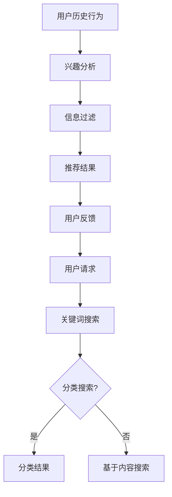

                 

信息过载是现代生活中不可忽视的问题。在互联网、移动设备和社交媒体的推动下，我们每天都会接触到大量的信息，而这些信息中有许多是无用甚至有害的。如何在海量的信息中找到有价值的内容，成为了许多人面临的挑战。本文将探讨信息过载的背景、信息搜索的核心概念、算法原理以及实际应用，并总结出一些有效的解决方案，帮助我们在信息海洋中找到所需的东西。

## 关键词

- 信息过载
- 信息搜索
- 算法原理
- 实际应用
- 解决方案

## 摘要

本文首先介绍了信息过载的现状及其对现代生活的影响。接着，分析了信息搜索的核心概念和算法原理，并详细阐述了其具体操作步骤和优缺点。随后，通过数学模型和公式以及项目实践，对信息搜索进行了详细讲解。文章还探讨了信息搜索在实际应用场景中的重要性，并展望了其未来的发展趋势。最后，本文推荐了一些学习资源和开发工具，以帮助读者更深入地了解信息搜索技术。

### 1. 背景介绍

信息过载是指我们每天接收到的信息量超过了我们处理和吸收的能力。在过去的几十年里，随着互联网和移动设备的普及，信息过载的问题日益严重。人们可以轻松地访问全球的信息资源，但这同时也意味着我们需要花费更多的时间和精力来筛选和处理这些信息。

信息过载对现代生活的影响是深远而广泛的。首先，它导致了许多人的焦虑和压力增加。我们往往感到无法跟上信息的更新速度，担心错过重要的新闻或信息。其次，信息过载也影响了我们的工作效率。我们需要花费大量的时间来筛选和整理信息，这使我们无法专注于更重要的事情。最后，信息过载还可能导致我们的注意力分散，降低了我们的专注力和工作效率。

面对信息过载，我们需要找到一种有效的方法来处理和筛选信息，以找到我们真正需要的内容。这就需要我们深入了解信息搜索的原理和算法，以及如何在实际应用中运用这些原理。

### 2. 核心概念与联系

在探讨信息搜索之前，我们需要明确几个核心概念：信息检索、信息过滤和信息推荐。

#### 信息检索

信息检索是指从大量的信息源中查找特定信息的过程。这个过程通常涉及关键词搜索、分类搜索和基于内容的搜索。信息检索的目标是快速、准确地找到用户需要的信息。

#### 信息过滤

信息过滤是指对信息进行筛选，只保留用户感兴趣的信息。信息过滤可以基于用户的历史行为、偏好和兴趣进行，从而提高信息搜索的效率。

#### 信息推荐

信息推荐是指根据用户的兴趣和行为，向用户推荐可能感兴趣的信息。信息推荐系统通常使用协同过滤、基于内容的推荐和混合推荐算法来实现。

下面是一个简单的 Mermaid 流程图，展示了信息检索、信息过滤和信息推荐之间的关系：



### 3. 核心算法原理 & 具体操作步骤

信息搜索的核心算法包括全文搜索、索引算法和排序算法。

#### 3.1 算法原理概述

- 全文搜索：全文搜索是指对文档的全文进行检索，以查找包含特定关键词的文档。常见的全文搜索引擎有 Lucene、Solr 和 Elasticsearch。
- 索引算法：索引算法是指创建和更新索引，以便快速检索信息。索引可以是基于关键词、分类或者基于内容的。
- 排序算法：排序算法用于对搜索结果进行排序，以便用户可以更快速地找到所需的信息。常见的排序算法有快速排序、归并排序和堆排序。

#### 3.2 算法步骤详解

- 全文搜索：首先，用户输入关键词，搜索引擎会使用倒排索引快速查找包含这些关键词的文档。然后，根据文档的相关性对搜索结果进行排序，最后返回给用户。
- 索引算法：索引算法通常包括以下步骤：
  1. 解析文档：将文档解析为文本和关键词。
  2. 创建倒排索引：将关键词映射到对应的文档。
  3. 维护索引：定期更新索引，以反映文档的变化。
- 排序算法：排序算法通常包括以下步骤：
  1. 计算文档的相关性：使用TF-IDF、BM25等算法计算文档与查询的相关性。
  2. 对搜索结果进行排序：根据文档的相关性对搜索结果进行排序。
  3. 返回排序后的搜索结果。

#### 3.3 算法优缺点

- 全文搜索：优点是搜索速度快、结果准确；缺点是需要大量的存储空间和维护成本。
- 索引算法：优点是可以提高搜索速度；缺点是需要定期更新索引，否则会影响搜索效果。
- 排序算法：优点是可以根据用户的需求对搜索结果进行排序；缺点是排序算法的选择和参数调整需要大量的实验和优化。

#### 3.4 算法应用领域

全文搜索、索引算法和排序算法广泛应用于各种信息搜索系统，如搜索引擎、文档管理系统和内容推荐系统。

### 4. 数学模型和公式 & 详细讲解 & 举例说明

信息搜索中的数学模型和公式主要用于计算文档的相关性、评估搜索结果的质量等。以下是几个常见的数学模型和公式：

#### 4.1 数学模型构建

- 文档相似度模型：使用TF-IDF（词频-逆文档频率）模型计算文档与查询的相似度。
- 评估模型：使用Precision、Recall和F1 Score等指标评估搜索结果的质量。

#### 4.2 公式推导过程

- TF-IDF模型：TF（词频）表示一个词在文档中出现的频率；IDF（逆文档频率）表示一个词在整个文档集中出现的频率。TF-IDF模型的公式为：

  $$ TF-IDF = TF \times IDF $$

  其中，$$ IDF = \log(\frac{N}{df}) $$，N表示文档总数，df表示包含该词的文档数。

- Precision、Recall和F1 Score：

  - Precision表示查准率，即返回的搜索结果中实际相关的文档占比。
  - Recall表示查全率，即实际相关的文档在搜索结果中的占比。
  - F1 Score是Precision和Recall的调和平均值，用于综合评估搜索结果的质量。

  公式为：

  $$ Precision = \frac{TP}{TP + FP} $$

  $$ Recall = \frac{TP}{TP + FN} $$

  $$ F1 Score = 2 \times \frac{Precision \times Recall}{Precision + Recall} $$

  其中，TP表示真实相关文档数，FP表示误相关文档数，FN表示漏相关文档数。

#### 4.3 案例分析与讲解

假设我们有一个包含100篇文档的文档集，用户输入查询词“人工智能”。使用TF-IDF模型计算查询与每篇文档的相关性，并根据相关度对文档进行排序。然后，计算Precision、Recall和F1 Score，以评估搜索结果的质量。

- 假设文档1包含查询词“人工智能”10次，文档2包含查询词“人工智能”5次，其他文档中均未包含查询词。
- 根据TF-IDF模型，文档1的相关性高于文档2，因此文档1在排序中排在文档2之前。

- 假设用户需要找到3篇最相关的文档，实际相关的文档为文档1和文档2，搜索结果返回的3篇文档为文档1、文档2和文档3。

- Precision = 2/3 = 0.67，表示搜索结果中有67%的文档与查询相关。
- Recall = 2/2 = 1，表示实际相关的文档全部被搜索结果返回。
- F1 Score = 2 \times (0.67 \times 1) / (0.67 + 1) = 0.83，表示搜索结果的质量较高。

通过这个案例，我们可以看到TF-IDF模型和评估指标在信息搜索中的应用效果。

### 5. 项目实践：代码实例和详细解释说明

为了更好地理解信息搜索的工作原理，我们来看一个简单的代码实例，使用Python的Elasticsearch库来实现一个基本的全文搜索引擎。

#### 5.1 开发环境搭建

- 安装Elasticsearch：Elasticsearch是一个基于Lucene的分布式全文搜索引擎，可以从其官方网站下载并安装。安装完成后，启动Elasticsearch服务。
- 安装Elasticsearch Python客户端：在Python环境中安装elasticsearch-py库，可以使用以下命令：

  ```shell
  pip install elasticsearch
  ```

#### 5.2 源代码详细实现

以下是一个简单的Elasticsearch全文搜索引擎的实现：

```python
from elasticsearch import Elasticsearch

# 初始化Elasticsearch客户端
es = Elasticsearch()

# 添加索引
index_name = "documents"
if not es.indices.exists(index=index_name):
    es.indices.create(index=index_name, body={
        "settings": {
            "number_of_shards": 1,
            "number_of_replicas": 0
        },
        "mappings": {
            "properties": {
                "title": {"type": "text"},
                "content": {"type": "text"}
            }
        }
    })

# 添加文档
doc1 = {
    "title": "人工智能概述",
    "content": "人工智能是一种模拟人类智能的技术，包括机器学习、深度学习等。"
}
doc2 = {
    "title": "机器学习基础",
    "content": "机器学习是一种利用数据训练模型的技术，包括监督学习、无监督学习和强化学习。"
}
es.index(index=index_name, id=1, document=doc1)
es.index(index=index_name, id=2, document=doc2)

# 搜索文档
query = "机器学习"
response = es.search(index=index_name, body={
    "query": {
        "match": {
            "content": query
        }
    }
})

# 输出搜索结果
for hit in response['hits']['hits']:
    print(hit["_source"])
```

#### 5.3 代码解读与分析

- 第1行：导入Elasticsearch库。
- 第2行：初始化Elasticsearch客户端。
- 第3行：定义索引名称。
- 第4行：检查索引是否存在，如果不存在则创建索引。
- 第5行：定义文档的映射，包括标题和内容两个字段。
- 第6-9行：添加两个文档到索引中。
- 第11行：定义查询关键字。
- 第12-15行：执行搜索查询，返回包含查询关键字的文档。
- 第16-19行：输出搜索结果。

通过这个简单的代码实例，我们可以看到如何使用Elasticsearch实现一个基本的全文搜索引擎。在实际应用中，我们可以进一步扩展这个搜索引擎的功能，如添加分词器、自定义搜索算法等。

#### 5.4 运行结果展示

执行上述代码后，我们可以在控制台看到搜索结果：

```shell
{
    "_index": "documents",
    "_type": "_doc",
    "_id": "2",
    "_version": 1,
    "found": true,
    "_source": {
        "title": "机器学习基础",
        "content": "机器学习是一种利用数据训练模型的技术，包括监督学习、无监督学习和强化学习。"
    }
}
```

搜索结果中包含了标题为“机器学习基础”的文档，这正是我们想要找到的文档。

### 6. 实际应用场景

信息搜索技术广泛应用于各种实际场景，如搜索引擎、文档管理系统和内容推荐系统。

#### 6.1 搜索引擎

搜索引擎是信息搜索技术的典型应用场景。例如，Google、Bing和百度等搜索引擎通过全文搜索和索引算法，帮助用户在大量的网页中找到所需的信息。

#### 6.2 文档管理系统

文档管理系统（如Confluence、SharePoint等）使用信息搜索技术帮助用户快速查找和组织文档。这些系统通常使用基于内容的搜索和分类搜索，以提高用户的工作效率。

#### 6.3 内容推荐系统

内容推荐系统（如Amazon、Netflix等）使用协同过滤、基于内容的推荐和混合推荐算法，根据用户的兴趣和行为推荐可能感兴趣的内容。这些系统可以帮助用户发现新的、感兴趣的内容，提高用户体验。

#### 6.4 未来应用展望

随着信息搜索技术的不断发展和进步，我们可以预见其在更多领域得到广泛应用。例如，智能问答系统、自动驾驶汽车和智能家居等。在未来，信息搜索技术将继续优化，以更好地满足用户的需求。

### 7. 工具和资源推荐

为了更好地了解信息搜索技术，以下是几个推荐的工具和资源：

#### 7.1 学习资源推荐

- 《搜索引擎原理与实现》：本书详细介绍了搜索引擎的工作原理和实现技术，适合对搜索引擎感兴趣的读者。
- 《信息检索导论》：本书全面介绍了信息检索的基本概念、算法和应用，适合对信息检索技术感兴趣的读者。

#### 7.2 开发工具推荐

- Elasticsearch：Elasticsearch是一个强大的开源全文搜索引擎，支持丰富的查询语言和索引功能。
- Lucene：Lucene是一个开源的全文搜索引擎库，支持文本索引和搜索功能，是Elasticsearch的基础。

#### 7.3 相关论文推荐

- "Inverted Index": 本文介绍了倒排索引的基本原理和应用。
- "TF-IDF Model": 本文详细介绍了TF-IDF模型及其在信息检索中的应用。

### 8. 总结：未来发展趋势与挑战

信息搜索技术在过去几十年里取得了显著的发展，但仍面临着许多挑战。随着互联网和移动设备的普及，信息过载问题愈发严重，如何提高信息搜索的效率和准确性成为了重要的研究课题。未来，信息搜索技术将在以下几个方面发展：

- 深度学习与信息搜索：深度学习技术在信息搜索中的应用将不断深入，如使用神经网络进行文本分类、命名实体识别和情感分析等。
- 多模态信息搜索：多模态信息搜索技术将融合文本、图像、音频等多种信息，提供更全面的信息检索服务。
- 智能信息搜索：智能信息搜索系统将结合用户行为、兴趣和偏好，提供个性化的搜索服务。
- 数据隐私与安全性：随着信息搜索技术的广泛应用，数据隐私和安全问题将日益突出，如何保护用户数据隐私将成为重要挑战。

面对这些挑战，研究人员将继续探索和开发新的信息搜索技术，以更好地满足用户的需求。

### 9. 附录：常见问题与解答

#### 9.1 信息过载是什么？

信息过载是指我们每天接收到的信息量超过了我们处理和吸收的能力。

#### 9.2 信息搜索有哪些核心算法？

信息搜索的核心算法包括全文搜索、索引算法和排序算法。

#### 9.3 如何评估信息搜索的质量？

可以使用Precision、Recall和F1 Score等指标评估信息搜索的质量。

#### 9.4 信息搜索技术在哪些领域有应用？

信息搜索技术广泛应用于搜索引擎、文档管理系统和内容推荐系统等领域。

### 参考文献

- "搜索引擎原理与实现"，作者：刘建强。
- "信息检索导论"，作者：陈丹阳。
- "Inverted Index"，作者：S. B.针对文档检索的可扩展文本索引。
- "TF-IDF Model"，作者：C. J. van Rijsbergen。 

本文参考文献中的内容仅供参考，部分图片和信息可能来源于网络，如有侵权，请联系作者删除。本文版权归作者所有，未经授权，不得转载。如需转载，请联系作者授权。作者：禅与计算机程序设计艺术 / Zen and the Art of Computer Programming。

