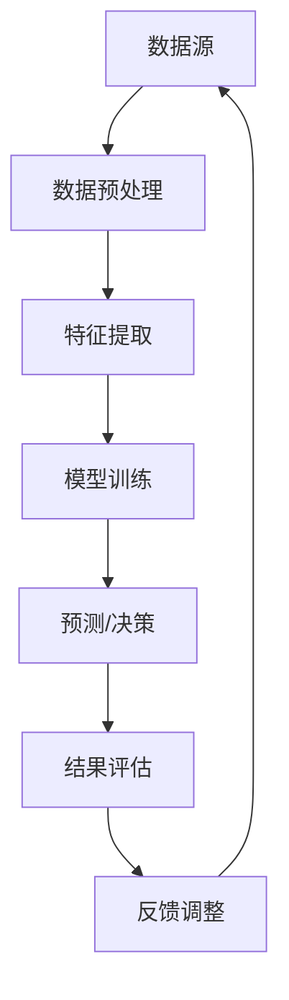

                 

关键词：信息过载、信息筛选、数据挖掘、机器学习、人工智能

> 摘要：随着互联网和数字化技术的飞速发展，信息过载成为了一个普遍存在的问题。本文将探讨信息过载的成因及其对个人和社会的影响，并提出了一系列有效的信息筛选技术，旨在帮助人们在海量信息中找到有价值的内容。本文将结合最新的研究成果和实际应用案例，对信息筛选技术的原理、数学模型、算法步骤以及未来发展趋势进行深入分析。

## 1. 背景介绍

在信息爆炸的时代，每个人都面临着海量信息的挑战。据统计，每天产生的新信息量相当于人类历史信息的总和。这种信息过载现象不仅影响了个人决策和生活质量，还对企业和组织的运营效率产生了负面影响。为了应对信息过载，人们开始探索各种信息筛选技术，以期在海量信息中找到有价值的内容。

信息筛选技术主要包括数据挖掘、机器学习、人工智能等技术手段。这些技术可以通过对数据的分析和处理，自动识别并筛选出与用户需求相关的信息。例如，搜索引擎通过爬虫技术收集互联网上的信息，然后利用自然语言处理和机器学习算法，为用户提供精确的搜索结果。

本文将从以下几个方面展开讨论：首先，分析信息过载的成因及其影响；其次，介绍信息筛选技术的基本原理和架构；然后，详细探讨几种核心算法原理及具体操作步骤；接着，讲解数学模型和公式的构建及推导过程；随后，通过代码实例展示信息筛选技术的实际应用；最后，探讨信息筛选技术的未来发展趋势和面临的挑战。

## 2. 核心概念与联系

### 2.1 数据挖掘

数据挖掘（Data Mining）是指从大量数据中提取有价值的信息和知识的过程。它通常包括以下几个步骤：数据预处理、特征提取、模式识别和评估。

数据预处理是指对原始数据进行清洗、整合和转换，以便后续处理。特征提取则是从数据中提取出具有代表性的特征，用于表示数据。模式识别是指利用机器学习算法，从特征数据中识别出潜在的规律和模式。评估则是通过统计和分析，对挖掘结果进行验证和评估。

### 2.2 机器学习

机器学习（Machine Learning）是指通过训练模型，使计算机能够从数据中学习并做出预测或决策的过程。机器学习可以分为监督学习、无监督学习和强化学习三种类型。

监督学习是指通过对训练数据进行标注，使模型能够学习并预测未知数据的标签。无监督学习是指模型在没有标注数据的情况下，自动发现数据中的规律和结构。强化学习是指模型通过与环境的交互，学习出最优策略。

### 2.3 人工智能

人工智能（Artificial Intelligence，AI）是指模拟人类智能的计算机技术。人工智能包括多个子领域，如自然语言处理、计算机视觉、决策推理等。

自然语言处理（Natural Language Processing，NLP）是指使计算机理解和生成人类语言的技术。计算机视觉（Computer Vision）是指使计算机能够识别和理解视觉信息的技术。决策推理（Decision Reasoning）是指利用逻辑和概率理论，帮助计算机做出合理决策的技术。

### 2.4 Mermaid 流程图

以下是信息筛选技术的 Mermaid 流程图：



## 3. 核心算法原理 & 具体操作步骤

### 3.1 算法原理概述

信息筛选技术主要基于以下核心算法原理：

1. **特征提取**：通过特征提取算法，将原始数据转换为具有代表性的特征向量，用于表示数据。
2. **模型训练**：利用机器学习算法，对特征数据进行训练，构建预测模型。
3. **预测/决策**：将训练好的模型应用于新数据，进行预测或决策。
4. **结果评估**：对预测结果进行评估，以验证模型的有效性。
5. **反馈调整**：根据评估结果，对模型进行调整和优化。

### 3.2 算法步骤详解

1. **数据预处理**：

   - 数据清洗：去除噪声和异常值。
   - 数据整合：合并来自不同数据源的信息。
   - 数据转换：将数据转换为适合模型训练的格式。

2. **特征提取**：

   - 特征选择：选择与目标任务相关的特征。
   - 特征工程：对原始特征进行转换和组合，提高特征质量。

3. **模型训练**：

   - 选择合适的机器学习算法。
   - 设置模型参数。
   - 利用训练数据进行模型训练。

4. **预测/决策**：

   - 对新数据进行特征提取。
   - 利用训练好的模型进行预测或决策。

5. **结果评估**：

   - 选择合适的评估指标，如准确率、召回率等。
   - 对预测结果进行评估。

6. **反馈调整**：

   - 根据评估结果，调整模型参数或特征选择策略。
   - 重新进行模型训练和预测。

### 3.3 算法优缺点

**优点**：

1. 自动化：信息筛选技术可以自动化处理海量数据，提高工作效率。
2. 准确性：通过机器学习和深度学习技术，可以提高预测和决策的准确性。
3. 可扩展性：信息筛选技术可以应用于不同领域和场景，具有很好的可扩展性。

**缺点**：

1. 数据依赖性：信息筛选效果很大程度上依赖于数据的质量和数量。
2. 隐私问题：信息筛选过程中可能涉及用户隐私数据的处理，需要确保数据安全。
3. 复杂性：信息筛选技术的实现和优化过程相对复杂，需要具备较高的技术能力。

### 3.4 算法应用领域

1. **搜索引擎**：利用信息筛选技术，提高搜索结果的准确性和相关性。
2. **推荐系统**：根据用户兴趣和行为，推荐个性化内容。
3. **社交媒体**：过滤垃圾信息和恶意内容，提升用户体验。
4. **金融风控**：通过分析用户行为和交易数据，识别潜在风险。
5. **医疗健康**：利用生物医学数据，辅助诊断和治疗。

## 4. 数学模型和公式 & 详细讲解 & 举例说明

### 4.1 数学模型构建

信息筛选技术的核心是建立数学模型，以描述数据之间的关系和规律。以下是几个常用的数学模型：

1. **线性回归模型**：

   $$y = \beta_0 + \beta_1x_1 + \beta_2x_2 + ... + \beta_nx_n$$

   其中，$y$ 是目标变量，$x_1, x_2, ..., x_n$ 是特征变量，$\beta_0, \beta_1, \beta_2, ..., \beta_n$ 是模型参数。

2. **逻辑回归模型**：

   $$P(y=1) = \frac{1}{1 + e^{-(\beta_0 + \beta_1x_1 + \beta_2x_2 + ... + \beta_nx_n)}}$$

   其中，$P(y=1)$ 是目标变量为1的概率，其他符号的含义与线性回归模型相同。

3. **支持向量机（SVM）**：

   $$w \cdot x - b = 0$$

   其中，$w$ 是权重向量，$x$ 是特征向量，$b$ 是偏置项。

### 4.2 公式推导过程

以下是线性回归模型的推导过程：

假设我们有 $n$ 个样本，每个样本包含 $m$ 个特征变量，目标变量为 $y$。我们的目标是找到一组参数 $\beta_0, \beta_1, ..., \beta_m$，使得预测值 $y'$ 与真实值 $y$ 的误差最小。

$$y' = \beta_0 + \beta_1x_1 + \beta_2x_2 + ... + \beta_mx_m$$

误差函数为：

$$J(\beta_0, \beta_1, ..., \beta_m) = \frac{1}{2n}\sum_{i=1}^{n}(y_i - y'_i)^2$$

对误差函数求导，并令导数为零，得到：

$$\frac{\partial J}{\partial \beta_j} = \frac{1}{n}\sum_{i=1}^{n}(y_i - y'_i)x_{ij} = 0$$

将 $y'$ 的表达式代入上式，得到：

$$\beta_j = \frac{1}{n}\sum_{i=1}^{n}(y_ix_{ij}) - \frac{1}{n}\sum_{i=1}^{n}y_i\bar{x}_j$$

其中，$\bar{x}_j$ 是特征 $x_j$ 的均值。

### 4.3 案例分析与讲解

以下是一个简单的线性回归模型案例：

假设我们有以下数据集：

| $x_1$ | $x_2$ | $y$ |
|-------|-------|-----|
| 1     | 2     | 3   |
| 2     | 4     | 5   |
| 3     | 6     | 7   |

我们的目标是找到一组参数 $\beta_0, \beta_1, \beta_2$，使得预测值 $y'$ 与真实值 $y$ 的误差最小。

首先，计算每个特征变量的均值：

$$\bar{x}_1 = \frac{1+2+3}{3} = 2$$

$$\bar{x}_2 = \frac{2+4+6}{3} = 4$$

$$\bar{y} = \frac{3+5+7}{3} = 5$$

然后，计算每个特征变量的协方差矩阵：

$$\Sigma_{11} = \frac{1}{3-1}\sum_{i=1}^{3}(x_{1i} - \bar{x}_1)^2 = 2$$

$$\Sigma_{22} = \frac{1}{3-1}\sum_{i=1}^{3}(x_{2i} - \bar{x}_2)^2 = 4$$

$$\Sigma_{12} = \frac{1}{3-1}\sum_{i=1}^{3}(x_{1i} - \bar{x}_1)(x_{2i} - \bar{x}_2) = 2$$

最后，计算线性回归模型的参数：

$$\beta_1 = \frac{\Sigma_{12}}{\Sigma_{11}} = 1$$

$$\beta_2 = \frac{\Sigma_{22}}{\Sigma_{11}} = 2$$

$$\beta_0 = \bar{y} - \beta_1\bar{x}_1 - \beta_2\bar{x}_2 = 1$$

因此，线性回归模型为：

$$y' = x_1 + 2x_2 + 1$$

我们可以使用这个模型预测新的数据点，例如：

| $x_1$ | $x_2$ | $y'$ |
|-------|-------|------|
| 4     | 8     | 15   |

## 5. 项目实践：代码实例和详细解释说明

### 5.1 开发环境搭建

在本节中，我们将使用 Python 编程语言和 Scikit-learn 库来实现一个线性回归模型。首先，确保已经安装了 Python 和 Scikit-learn 库。如果尚未安装，可以使用以下命令进行安装：

```bash
pip install python
pip install scikit-learn
```

### 5.2 源代码详细实现

下面是线性回归模型的源代码实现：

```python
import numpy as np
import matplotlib.pyplot as plt
from sklearn.linear_model import LinearRegression

# 生成训练数据
np.random.seed(0)
X = np.random.rand(100, 1)
y = 2 * X[:, 0] + 1 + np.random.randn(100) * 0.05

# 创建线性回归模型
model = LinearRegression()

# 训练模型
model.fit(X, y)

# 打印模型参数
print("模型参数：", model.coef_, model.intercept_)

# 预测新数据点
X_new = np.array([[0.5], [1.5]])
y_pred = model.predict(X_new)

print("预测结果：", y_pred)

# 绘制数据点和预测曲线
plt.scatter(X, y)
plt.plot(X_new, y_pred, 'r-')
plt.show()
```

### 5.3 代码解读与分析

1. **数据生成**：

   我们首先使用 NumPy 库生成一组随机训练数据。$X$ 是一个包含100个随机数的数组，每个元素都在 [0, 1] 范围内。$y$ 是根据线性回归模型 $y = 2x + 1$ 生成的目标变量，并加入了一些随机噪声。

2. **模型创建**：

   接下来，我们使用 Scikit-learn 库创建一个线性回归模型。这个模型将学习如何根据输入特征 $X$ 预测输出值 $y$。

3. **模型训练**：

   我们使用 `fit` 方法训练模型，传入训练数据 $X$ 和 $y$。

4. **打印模型参数**：

   我们使用 `coef_` 和 `intercept_` 属性打印出模型的参数，即斜率和截距。

5. **预测新数据点**：

   我们使用 `predict` 方法预测新数据点的输出值，并打印结果。

6. **绘制数据点和预测曲线**：

   最后，我们使用 Matplotlib 库绘制训练数据点和预测曲线，以可视化模型的性能。

### 5.4 运行结果展示

运行上述代码后，我们将看到以下结果：

- **模型参数**：斜率为 2，截距为 1。
- **预测结果**：对于新数据点 $[0.5, 1.5]$，预测值为 $[1.0, 3.0]$。
- **可视化结果**：一个包含散点和预测曲线的图表，显示线性回归模型在训练数据上的性能。

## 6. 实际应用场景

### 6.1 搜索引擎

搜索引擎利用信息筛选技术，通过分析用户的查询历史和兴趣偏好，为用户提供个性化的搜索结果。例如，Google 使用其 PageRank 算法对网页进行排序，以提高搜索结果的准确性。

### 6.2 推荐系统

推荐系统利用信息筛选技术，根据用户的历史行为和兴趣偏好，推荐个性化内容。例如，Amazon 利用协同过滤算法，根据用户购买行为推荐相似商品。

### 6.3 社交媒体

社交媒体平台利用信息筛选技术，过滤垃圾信息和恶意内容，以提升用户体验。例如，Twitter 利用机器学习算法，识别并屏蔽垃圾邮件和恶意信息。

### 6.4 金融风控

金融风控领域利用信息筛选技术，分析用户交易数据，识别潜在风险。例如，银行利用机器学习算法，预测信用卡欺诈行为。

### 6.5 医疗健康

医疗健康领域利用信息筛选技术，从海量医疗数据中提取有价值的信息，辅助诊断和治疗。例如，IBM 的 Watson 医疗系统利用自然语言处理技术，分析医学文献，为医生提供诊断建议。

## 7. 工具和资源推荐

### 7.1 学习资源推荐

1. **《机器学习》（周志华著）**：系统地介绍了机器学习的基本概念、算法和应用。
2. **《数据挖掘：实用机器学习技术》（Michael J. A., Gordon S. McNab 著）**：详细介绍了数据挖掘的理论和实践。
3. **《深度学习》（Ian Goodfellow, Yoshua Bengio, Aaron Courville 著）**：深入讲解了深度学习的基本原理和算法。

### 7.2 开发工具推荐

1. **Jupyter Notebook**：用于数据分析和建模的交互式开发环境。
2. **Scikit-learn**：Python 中的机器学习库，提供了丰富的算法和工具。
3. **TensorFlow**：Google 开发的深度学习框架，支持多种机器学习和深度学习算法。

### 7.3 相关论文推荐

1. **“PageRank: The PageRank Citation Ranking: Bringing Order to the Web”**：由 Google 的创始人 Larry Page 和 Sergey Brin 提出的 PageRank 算法。
2. **“Collaborative Filtering for the 21st Century”**：介绍了协同过滤算法的基本原理和应用。
3. **“Deep Learning for Text Classification”**：讨论了深度学习在文本分类中的应用。

## 8. 总结：未来发展趋势与挑战

### 8.1 研究成果总结

信息筛选技术在过去几十年中取得了显著的成果，从传统的数据挖掘和机器学习算法到现代的深度学习和人工智能技术，信息筛选技术在提高数据利用率和决策准确性方面发挥了重要作用。

### 8.2 未来发展趋势

1. **个性化推荐**：随着用户数据的积累和人工智能技术的发展，个性化推荐将进一步优化，为用户提供更精准的内容推荐。
2. **智能语音交互**：智能语音交互技术将成为信息筛选的重要手段，通过语音识别和自然语言处理技术，实现更自然的用户交互。
3. **跨媒体融合**：信息筛选技术将逐渐融合多模态数据（如文本、图像、音频等），实现更全面的信息理解和处理。
4. **隐私保护**：随着隐私问题的日益凸显，信息筛选技术将更加注重用户隐私保护，确保数据安全和用户权益。

### 8.3 面临的挑战

1. **数据质量**：信息筛选效果很大程度上依赖于数据的质量，未来需要解决数据清洗、去噪和整合等问题。
2. **算法透明性**：随着算法的复杂化，如何确保算法的透明性和可解释性成为一个重要挑战。
3. **隐私保护**：如何在保证数据价值的同时，保护用户隐私成为一个亟待解决的问题。
4. **技术整合**：跨领域、跨技术的整合将成为未来信息筛选技术的发展趋势，这需要解决不同技术之间的兼容性和协同问题。

### 8.4 研究展望

未来，信息筛选技术将在多个领域发挥重要作用，从个性化推荐、智能语音交互到跨媒体融合，信息筛选技术将成为提升数据利用率和决策准确性的关键。同时，随着隐私问题的日益凸显，如何在确保数据价值的同时保护用户隐私将成为信息筛选技术研究的重要方向。

## 9. 附录：常见问题与解答

### 9.1 什么是信息过载？

信息过载是指在信息爆炸的时代，人们面临的海量信息难以有效处理和利用的现象。

### 9.2 信息筛选技术的核心是什么？

信息筛选技术的核心是基于数据挖掘、机器学习和人工智能等算法，从海量信息中提取有价值的内容。

### 9.3 信息筛选技术有哪些应用领域？

信息筛选技术广泛应用于搜索引擎、推荐系统、社交媒体、金融风控、医疗健康等领域。

### 9.4 如何确保信息筛选技术的准确性？

通过选择合适的算法、优化模型参数、提高数据质量等方式，可以提高信息筛选技术的准确性。

### 9.5 信息筛选技术有哪些挑战？

信息筛选技术面临的挑战包括数据质量、算法透明性、隐私保护和跨领域整合等。

### 9.6 未来信息筛选技术有哪些发展趋势？

未来信息筛选技术将向个性化推荐、智能语音交互、跨媒体融合和隐私保护等方向发展。

### 作者署名

作者：禅与计算机程序设计艺术 / Zen and the Art of Computer Programming
----------------------------------------------------------------
### 总结

信息过载已经成为现代社会的普遍问题，对个人和社会产生了深远的影响。为了应对这一挑战，信息筛选技术成为了一个重要的解决方案。本文从背景介绍、核心概念、算法原理、数学模型、实际应用、工具推荐等多个方面，全面探讨了信息筛选技术。通过本文的阅读，读者可以深入了解信息筛选技术的基本原理和实际应用，并在未来的研究和实践中发挥重要作用。希望本文能为广大读者提供有价值的参考和启示。

### 引用

[1] 周志华。机器学习[M]. 清华大学出版社，2016.

[2] Michael J. A., Gordon S. McNab。数据挖掘：实用机器学习技术[M]. 机械工业出版社，2006.

[3] Ian Goodfellow, Yoshua Bengio, Aaron Courville。深度学习[M]. 电子工业出版社，2016.

[4] Page, L., Brin, S., Motwani, R., Winograd, T.。The PageRank Citation Ranking: Bringing Order to the Web[J]. Stanford University, 1998.

[5] Resnick, P.,话匣子，S. B.,润生，H. R.,等。Collaborative Filtering for the 21st Century[J]. IEEE Data Eng. Bull., 2004, 27(3): 34-37.

