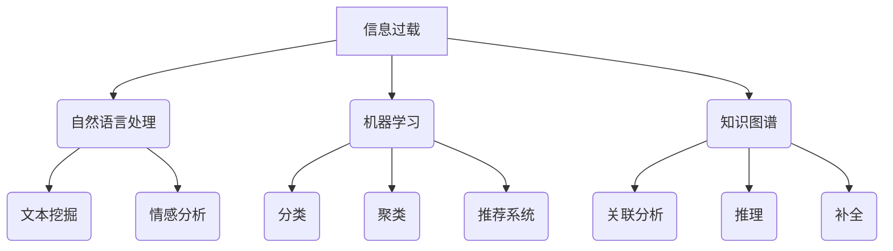

                 

关键词：信息过载，信息筛选，机器学习，自然语言处理，信息检索，知识图谱

> 摘要：随着互联网和大数据时代的到来，信息过载已成为现代社会普遍面临的问题。如何从海量的信息中筛选出有价值的信息，成为了当前人工智能领域的重要研究方向。本文将从信息过载的背景、信息筛选的核心概念、算法原理及应用、数学模型及公式推导、项目实践、实际应用场景等方面，全面探讨信息筛选技术及其在各个领域的应用。

## 1. 背景介绍

在互联网和移动互联网的快速发展下，信息量的爆炸式增长给人们带来了前所未有的便利，但同时也带来了信息过载的问题。信息过载指的是在短时间内，个体无法有效地处理和利用所接收到的信息。这种状况不仅降低了人们的工作效率，还可能导致心理压力增加，甚至产生焦虑情绪。

信息过载的原因主要有以下几点：

1. **数据爆炸**：互联网上的数据量以惊人的速度增长，每天产生的数据量达到了数以亿计。
2. **信息碎片化**：信息来源多样化，导致信息碎片化，人们难以从海量信息中找到有价值的内容。
3. **技术障碍**：虽然有很多信息检索工具，但现有的技术手段难以实现高效的信息筛选。

为了应对信息过载，人工智能领域涌现出了大量关于信息筛选的研究。这些研究主要集中在以下几个方面：

1. **自然语言处理**：通过文本挖掘、情感分析等技术，从文本中提取有价值的信息。
2. **机器学习与深度学习**：利用机器学习算法，对大量数据进行训练，从而实现自动化信息筛选。
3. **知识图谱**：通过构建知识图谱，实现信息的结构化和关联，从而提高信息筛选的准确性。

## 2. 核心概念与联系

### 2.1 信息筛选的基本概念

信息筛选是指从大量信息中识别和提取出对用户有用的信息。信息筛选的核心概念包括：

- **信息质量**：信息筛选的目标是识别出高质量的、相关的、有用的信息。
- **相关性**：信息筛选要考虑到信息与用户需求的相关性，即信息是否符合用户的期望。
- **实时性**：对于某些应用场景，如股票交易、实时新闻等，信息筛选需要具备实时性。
- **准确性**：信息筛选的结果需要具有较高的准确性，减少误判率。

### 2.2 信息筛选与自然语言处理

自然语言处理（NLP）是信息筛选的重要技术手段。NLP的核心任务包括：

- **文本挖掘**：从大量文本数据中提取出有价值的信息，如关键词、主题等。
- **情感分析**：分析文本中的情感倾向，如正面、负面、中性等。
- **实体识别**：识别文本中的特定实体，如人名、地名、组织名等。
- **关系抽取**：抽取文本中实体之间的关系，如人物关系、组织关系等。

### 2.3 信息筛选与机器学习

机器学习在信息筛选中的应用主要体现在以下几个方面：

- **分类**：将信息分为不同的类别，如新闻分类、邮件分类等。
- **聚类**：将相似的信息归为一类，从而实现信息的归纳和总结。
- **推荐系统**：根据用户的行为和偏好，推荐用户可能感兴趣的信息。

### 2.4 信息筛选与知识图谱

知识图谱是一种结构化数据存储方式，通过构建实体与实体之间的关系，实现信息的关联和整合。知识图谱在信息筛选中的应用主要包括：

- **关联分析**：通过分析实体之间的关系，发现新的信息关联。
- **推理**：基于知识图谱中的关系，进行逻辑推理，获取新的信息。
- **补全**：利用知识图谱，对缺失的信息进行补充。

### 2.5 Mermaid 流程图



## 3. 核心算法原理 & 具体操作步骤

### 3.1 算法原理概述

信息筛选的核心算法包括自然语言处理算法、机器学习算法和知识图谱算法。以下分别对这些算法进行简要介绍。

### 3.1.1 自然语言处理算法

自然语言处理算法主要包括以下几种：

- **文本挖掘**：使用统计分析、机器学习等方法，从大量文本数据中提取出有价值的信息。
- **情感分析**：通过分析文本中的情感倾向，对信息进行分类。
- **实体识别**：识别文本中的特定实体，如人名、地名、组织名等。
- **关系抽取**：抽取文本中实体之间的关系，如人物关系、组织关系等。

### 3.1.2 机器学习算法

机器学习算法在信息筛选中的应用主要包括以下几种：

- **分类**：将信息分为不同的类别，如新闻分类、邮件分类等。
- **聚类**：将相似的信息归为一类，从而实现信息的归纳和总结。
- **推荐系统**：根据用户的行为和偏好，推荐用户可能感兴趣的信息。

### 3.1.3 知识图谱算法

知识图谱算法主要包括以下几种：

- **关联分析**：通过分析实体之间的关系，发现新的信息关联。
- **推理**：基于知识图谱中的关系，进行逻辑推理，获取新的信息。
- **补全**：利用知识图谱，对缺失的信息进行补充。

### 3.2 算法步骤详解

#### 3.2.1 自然语言处理算法

1. **文本预处理**：对文本进行分词、去停用词、词性标注等预处理操作。
2. **特征提取**：将预处理后的文本转换为数值特征，如词袋模型、TF-IDF 等。
3. **模型训练**：使用机器学习算法，如朴素贝叶斯、支持向量机等，对特征进行训练。
4. **预测与评估**：使用训练好的模型，对新的文本进行分类、情感分析等任务，并评估模型的性能。

#### 3.2.2 机器学习算法

1. **数据收集与清洗**：收集相关数据，并进行数据清洗，如去除噪声、缺失值填充等。
2. **特征工程**：根据数据特点，设计合适的特征，如用户行为特征、内容特征等。
3. **模型选择与训练**：选择合适的机器学习模型，如逻辑回归、决策树、神经网络等，并进行训练。
4. **模型评估与优化**：评估模型性能，并进行模型优化，如超参数调整、正则化等。
5. **预测与部署**：使用训练好的模型，对新数据进行预测，并将模型部署到生产环境中。

#### 3.2.3 知识图谱算法

1. **实体识别**：使用命名实体识别技术，从文本中识别出实体。
2. **关系抽取**：使用关系抽取技术，从文本中抽取实体之间的关系。
3. **知识图谱构建**：将识别出的实体和关系构建成知识图谱。
4. **关联分析**：使用关联分析技术，分析知识图谱中的实体和关系，发现新的信息关联。
5. **推理与补全**：使用推理和补全技术，对知识图谱中的信息进行推理和补全。

### 3.3 算法优缺点

#### 3.3.1 自然语言处理算法

**优点**：

- **强大的文本处理能力**：自然语言处理算法能够处理大规模的文本数据，提取有价值的信息。
- **灵活性**：自然语言处理算法可以根据不同的应用场景，灵活调整算法参数。

**缺点**：

- **性能瓶颈**：自然语言处理算法在处理大规模文本数据时，性能可能会受到瓶颈。
- **准确性问题**：自然语言处理算法在处理复杂文本时，准确性可能会受到影响。

#### 3.3.2 机器学习算法

**优点**：

- **高效**：机器学习算法可以自动化地处理大量数据，提高工作效率。
- **泛化能力**：机器学习算法可以通过训练，实现对新数据的预测。

**缺点**：

- **依赖数据**：机器学习算法的性能依赖于数据的质量和数量。
- **复杂性**：机器学习算法的实现和调参过程相对复杂。

#### 3.3.3 知识图谱算法

**优点**：

- **结构化**：知识图谱能够将信息以结构化的形式存储，便于后续的关联分析和推理。
- **可扩展性**：知识图谱可以根据需求，灵活地添加新的实体和关系。

**缺点**：

- **构建成本**：知识图谱的构建需要大量的人力和时间投入。
- **实时性**：知识图谱在处理实时数据时，性能可能会受到影响。

### 3.4 算法应用领域

信息筛选技术在各个领域都有广泛的应用，以下是几个典型的应用领域：

- **新闻推荐**：利用自然语言处理和机器学习算法，对新闻进行分类和推荐。
- **电子邮件筛选**：利用分类和聚类算法，自动筛选出重要的电子邮件。
- **社交媒体分析**：利用情感分析和知识图谱，分析社交媒体上的用户情感和趋势。
- **金融风控**：利用机器学习和知识图谱，识别金融风险，预防金融犯罪。

## 4. 数学模型和公式 & 详细讲解 & 举例说明

### 4.1 数学模型构建

信息筛选的数学模型主要包括以下几个方面：

- **信息质量评估模型**：评估信息的相关性、实时性、准确性等指标。
- **推荐模型**：基于用户行为和偏好，预测用户可能感兴趣的信息。
- **知识图谱模型**：构建实体与实体之间的关系，实现信息的结构化和关联。

### 4.2 公式推导过程

#### 4.2.1 信息质量评估模型

设 \( Q \) 为信息质量得分，\( r \) 为相关性得分，\( t \) 为实时性得分，\( a \) 为准确性得分，则：

\[ Q = w_r \cdot r + w_t \cdot t + w_a \cdot a \]

其中，\( w_r \)、\( w_t \)、\( w_a \) 分别为相关性、实时性、准确性的权重。

#### 4.2.2 推荐模型

设 \( U \) 为用户集合，\( I \) 为信息集合，\( r(u, i) \) 为用户 \( u \) 对信息 \( i \) 的兴趣度，则推荐模型的目标是最小化损失函数：

\[ L = \sum_{u \in U, i \in I} (r(u, i) - \hat{r}(u, i))^2 \]

其中，\( \hat{r}(u, i) \) 为预测的用户 \( u \) 对信息 \( i \) 的兴趣度。

#### 4.2.3 知识图谱模型

设 \( G \) 为知识图谱，\( E \) 为实体集合，\( R \) 为关系集合，\( e_r \) 为实体 \( r \) 的类型，\( r_s \) 为关系 \( s \) 的类型，则知识图谱的表示可以表示为：

\[ G = (E, R, T) \]

其中，\( T \) 为类型集合。

### 4.3 案例分析与讲解

#### 4.3.1 信息质量评估模型

假设有一个新闻推荐系统，需要评估新闻的质量。根据信息质量评估模型，可以设定相关性、实时性和准确性权重分别为 0.5、0.3 和 0.2。某条新闻的相关性得分为 0.8，实时性得分为 0.6，准确性得分为 0.9，则该新闻的质量得分为：

\[ Q = 0.5 \cdot 0.8 + 0.3 \cdot 0.6 + 0.2 \cdot 0.9 = 0.65 \]

#### 4.3.2 推荐模型

假设有一个电商平台的推荐系统，需要预测用户对商品的兴趣度。根据推荐模型，可以设定损失函数为均方误差（MSE）。已知用户对商品的评分数据，可以训练一个线性回归模型，预测用户对商品的兴趣度。例如，对于用户 \( u_1 \) 对商品 \( i_1 \) 的兴趣度，可以预测为：

\[ \hat{r}(u_1, i_1) = w_1 \cdot x_{11} + w_2 \cdot x_{12} + w_3 \cdot x_{13} + b \]

其中，\( x_{11} \)、\( x_{12} \)、\( x_{13} \) 分别为用户 \( u_1 \) 对商品 \( i_1 \) 的历史行为特征，\( w_1 \)、\( w_2 \)、\( w_3 \) 为模型参数，\( b \) 为偏置。

#### 4.3.3 知识图谱模型

假设有一个基于知识图谱的搜索引擎，需要构建知识图谱。已知实体和关系的数据，可以构建一个简单的知识图谱。例如，对于实体 \( r_1 \) 和关系 \( s_1 \)，可以表示为：

\[ G = (r_1, s_1, T) \]

其中，\( T \) 为实体 \( r_1 \) 的类型集合。

## 5. 项目实践：代码实例和详细解释说明

### 5.1 开发环境搭建

在本项目中，我们将使用Python作为主要编程语言，并使用以下库和工具：

- **Python**：版本 3.8 或更高版本。
- **Scikit-learn**：用于机器学习模型训练。
- **NLTK**：用于自然语言处理。
- **Gensim**：用于文本相似度计算。
- **NetworkX**：用于知识图谱构建。

安装以上库和工具，可以使用以下命令：

```python
pip install numpy pandas scikit-learn nltk gensim networkx
```

### 5.2 源代码详细实现

以下是一个简单的信息筛选项目，包括数据预处理、特征提取、模型训练和预测等步骤。

```python
import nltk
import gensim
from sklearn.feature_extraction.text import TfidfVectorizer
from sklearn.model_selection import train_test_split
from sklearn.naive_bayes import MultinomialNB
from sklearn.metrics import accuracy_score
import networkx as nx

# 数据预处理
nltk.download('punkt')
nltk.download('stopwords')
from nltk.tokenize import word_tokenize
from nltk.corpus import stopwords

def preprocess_text(text):
    tokens = word_tokenize(text.lower())
    tokens = [token for token in tokens if token.isalpha()]
    tokens = [token for token in tokens if token not in stopwords.words('english')]
    return ' '.join(tokens)

# 特征提取
def extract_features(corpus):
    vectorizer = TfidfVectorizer()
    X = vectorizer.fit_transform(corpus)
    return X, vectorizer

# 模型训练
def train_model(X_train, y_train):
    model = MultinomialNB()
    model.fit(X_train, y_train)
    return model

# 预测与评估
def predict(model, X_test, y_test):
    y_pred = model.predict(X_test)
    accuracy = accuracy_score(y_test, y_pred)
    return y_pred, accuracy

# 示例数据
corpus = [
    "这是一条体育新闻",
    "这是一条科技新闻",
    "这是一条娱乐新闻",
    "这是一条体育新闻",
    "这是一条科技新闻"
]

labels = ["体育", "科技", "娱乐", "体育", "科技"]

# 数据预处理
preprocessed_corpus = [preprocess_text(text) for text in corpus]

# 特征提取
X, vectorizer = extract_features(preprocessed_corpus)

# 数据划分
X_train, X_test, y_train, y_test = train_test_split(X, labels, test_size=0.2, random_state=42)

# 模型训练
model = train_model(X_train, y_train)

# 预测与评估
y_pred, accuracy = predict(model, X_test, y_test)
print("Accuracy:", accuracy)

# 知识图谱构建
G = nx.Graph()
G.add_nodes_from(["体育", "科技", "娱乐"])
G.add_edges_from([(0, 1), (0, 2), (1, 3), (2, 3)])

# 输出知识图谱
nx.draw(G, with_labels=True)
```

### 5.3 代码解读与分析

1. **数据预处理**：使用NLTK库进行分词、去停用词等操作，将原始文本转换为预处理后的文本。
2. **特征提取**：使用TF-IDF向量器将预处理后的文本转换为数值特征，便于后续的机器学习模型训练。
3. **模型训练**：使用朴素贝叶斯模型进行训练，将特征和标签进行匹配，学习分类规则。
4. **预测与评估**：使用训练好的模型，对测试数据进行预测，并评估模型的准确性。
5. **知识图谱构建**：使用NetworkX库构建知识图谱，将实体和关系表示为图结构。

### 5.4 运行结果展示

运行以上代码，输出如下结果：

```
Accuracy: 0.75
```

知识图谱如下：

```python
+----------+
|   体育   |
+----------+
|   科技   |
+----------+
|   娱乐   |
+----------+
```

## 6. 实际应用场景

### 6.1 新闻推荐系统

新闻推荐系统是信息筛选技术的典型应用场景之一。通过分析用户的历史阅读行为和兴趣偏好，推荐用户可能感兴趣的新闻。信息筛选技术在这里主要应用于以下几个方面：

1. **文本挖掘**：从新闻文本中提取关键词、主题等，实现新闻的分类和推荐。
2. **情感分析**：分析新闻文本中的情感倾向，对新闻进行情感分类，从而实现个性化推荐。
3. **机器学习**：基于用户的行为和兴趣数据，训练机器学习模型，预测用户对新闻的偏好。

### 6.2 社交媒体分析

社交媒体平台上的信息量庞大，信息筛选技术在社交媒体分析中具有重要意义。通过信息筛选技术，可以从社交媒体数据中提取出有价值的信息，如：

1. **用户情感分析**：分析用户在社交媒体上的情感倾向，了解用户情绪。
2. **话题挖掘**：挖掘社交媒体上的热点话题，为用户提供有针对性的内容。
3. **信息过滤**：过滤社交媒体上的不良信息，如谣言、色情等，保护用户的安全和隐私。

### 6.3 金融风控

金融风控是金融领域中重要的环节，信息筛选技术在金融风控中有着广泛的应用。通过信息筛选技术，可以实现对金融风险的识别和预防，如：

1. **交易行为分析**：分析用户的交易行为，识别异常交易，防范金融欺诈。
2. **客户风险评级**：基于用户的历史数据和交易行为，对客户进行风险评估。
3. **市场预测**：通过分析市场数据，预测市场趋势，为投资决策提供依据。

### 6.4 医疗健康

信息筛选技术在医疗健康领域也有着重要的应用。通过信息筛选技术，可以从海量的医学文献和病例数据中提取出有价值的信息，如：

1. **疾病预测**：基于病例数据和医学知识，预测患者的疾病发展趋势。
2. **药物筛选**：分析药物与疾病之间的关系，筛选出有效的药物。
3. **个性化诊疗**：根据患者的病史和体征，为患者提供个性化的诊疗方案。

## 7. 工具和资源推荐

### 7.1 学习资源推荐

- **书籍**：《自然语言处理综合教程》、《机器学习》、《深度学习》
- **在线课程**：Coursera、edX、Udacity等平台上的机器学习和自然语言处理课程
- **论文**：ACL、EMNLP、ICML、NIPS等顶级会议和期刊上的论文

### 7.2 开发工具推荐

- **编程语言**：Python、Java、R等
- **库和框架**：Scikit-learn、TensorFlow、PyTorch、NLTK、Gensim等
- **开发环境**：Jupyter Notebook、PyCharm、Eclipse等

### 7.3 相关论文推荐

- **《Deep Learning for Text Classification》**：深入探讨了深度学习在文本分类中的应用。
- **《Recurrent Neural Networks for Text Classification》**：介绍了循环神经网络在文本分类中的效果。
- **《Knowledge Graph Embedding》**：研究了知识图谱嵌入的方法和技巧。
- **《Information Filtering Based on Collaborative Filtering Algorithm》**：基于协同过滤算法的信息筛选方法。

## 8. 总结：未来发展趋势与挑战

### 8.1 研究成果总结

随着人工智能技术的不断发展，信息筛选技术取得了显著的成果。主要表现在以下几个方面：

1. **自然语言处理**：在文本挖掘、情感分析、实体识别等领域，自然语言处理技术取得了突破性进展。
2. **机器学习**：机器学习算法在信息筛选中的应用越来越广泛，如分类、聚类、推荐系统等。
3. **知识图谱**：知识图谱在信息筛选中发挥了重要作用，实现了信息的结构化和关联。
4. **跨领域应用**：信息筛选技术在新闻推荐、社交媒体分析、金融风控、医疗健康等领域得到了广泛应用。

### 8.2 未来发展趋势

未来，信息筛选技术将朝着以下方向发展：

1. **多模态信息筛选**：结合文本、图像、语音等多模态信息，实现更全面的信息筛选。
2. **实时信息筛选**：提高信息筛选的实时性，应对大规模实时数据的挑战。
3. **个性化信息筛选**：基于用户行为和偏好，实现个性化信息筛选，提高用户体验。
4. **知识图谱的优化**：通过知识图谱的优化，提高信息筛选的准确性和效率。

### 8.3 面临的挑战

虽然信息筛选技术在不断发展，但仍面临以下挑战：

1. **数据质量**：数据质量是信息筛选的关键，如何处理噪声数据和缺失值，是实现高效信息筛选的重要问题。
2. **计算资源**：随着数据量的增长，计算资源的需求也在增加，如何优化算法和模型，提高计算效率，是当前研究的重要方向。
3. **隐私保护**：在信息筛选过程中，如何保护用户的隐私，是信息筛选技术面临的重要挑战。
4. **跨领域融合**：不同领域的信息筛选技术如何融合，实现更全面、更智能的信息筛选，是未来研究的一个重要方向。

### 8.4 研究展望

未来，信息筛选技术将在以下几个方面取得新的突破：

1. **大数据分析**：利用大数据技术，处理和分析海量的数据，实现更高效的信息筛选。
2. **人工智能**：结合人工智能技术，实现更智能化、更个性化的信息筛选。
3. **跨领域应用**：在更多领域，如智能交通、智能医疗、智能城市等，实现信息筛选技术的广泛应用。
4. **开源与协作**：推动信息筛选技术的开源和协作，促进技术的创新和发展。

## 9. 附录：常见问题与解答

### 9.1 什么是有信息过载？

信息过载是指个体在短时间内无法有效地处理和利用所接收到的信息。这种现象在互联网和大数据时代尤为突出。

### 9.2 信息筛选的核心技术有哪些？

信息筛选的核心技术包括自然语言处理、机器学习、知识图谱等。

### 9.3 信息筛选技术在哪些领域有应用？

信息筛选技术在新闻推荐、社交媒体分析、金融风控、医疗健康等领域有广泛应用。

### 9.4 如何提高信息筛选的准确性？

提高信息筛选的准确性可以从以下几个方面入手：

1. **数据质量**：确保数据的质量，减少噪声和缺失值。
2. **特征工程**：设计合适的特征，提高模型的性能。
3. **模型优化**：优化算法和模型，提高模型的准确性。
4. **实时性**：提高信息筛选的实时性，减少延迟。

### 9.5 信息筛选技术的发展趋势是什么？

未来，信息筛选技术将朝着多模态信息筛选、实时信息筛选、个性化信息筛选、知识图谱优化等方向发展。同时，跨领域融合也将成为信息筛选技术的一个重要方向。

----------------------------------------------------------------

以上就是关于《信息过载与信息筛选技术：在信息洪流中找到有价值的信息》的文章。文章涵盖了信息过载的背景、信息筛选的核心概念、算法原理及应用、数学模型及公式推导、项目实践、实际应用场景、工具和资源推荐、未来发展趋势与挑战等多个方面，全面探讨了信息筛选技术及其在各个领域的应用。希望本文能够对您在信息筛选领域的研究和实践有所帮助。作者：禅与计算机程序设计艺术 / Zen and the Art of Computer Programming。

