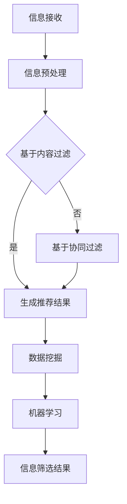

                 

关键词：信息过载、信息筛选、算法、数据挖掘、大数据、机器学习、人工智能、信息管理

> 摘要：随着互联网的飞速发展，信息过载问题愈发严重。本文旨在探讨信息过载的背景及其对个体和组织的影响，并介绍几种有效的信息筛选策略，包括基于算法的自动化筛选方法、基于用户行为的数据挖掘技术和机器学习模型的应用。通过分析这些策略的原理和实际案例，本文旨在为在信息洪流中高效找到有价值和相关的信息提供实用的指导。

## 1. 背景介绍

在信息时代，信息量的爆炸式增长已成为不争的事实。根据统计，全球每天产生的数据量以惊人的速度增长，预计到2025年，这一数字将达到44ZB。这种信息过载现象不仅影响到普通用户，也给企业、政府和社会组织带来了巨大的挑战。面对海量的信息，如何快速、准确地筛选出有价值的信息，成为了一个亟待解决的问题。

### 1.1 信息过载的定义

信息过载（Information Overload）指的是个体在处理信息时感到压力、焦虑和疲劳的状态。这是因为人们接收到的信息量超过了其处理能力，导致信息处理效率下降，甚至产生负面情绪。

### 1.2 信息过载的影响

信息过载对个体和组织都有显著的负面影响：

- **个体层面**：信息过载导致个体无法集中注意力，工作效率下降，甚至引发心理健康问题，如焦虑和抑郁。
- **组织层面**：信息过载会导致组织决策缓慢，资源浪费，影响组织的整体竞争力。

### 1.3 信息筛选的必要性

有效筛选信息是应对信息过载的关键。信息筛选旨在从海量的数据中提取出有价值的信息，为个体和组织的决策提供支持。信息筛选的必要性体现在以下几个方面：

- **提升决策效率**：通过筛选出与决策相关的信息，可以减少决策过程中需要处理的数据量，提高决策效率。
- **降低成本**：有效的信息筛选可以减少不必要的资源消耗，降低成本。
- **提高信息质量**：筛选过程可以剔除错误、无关和重复的信息，提高信息的质量和准确性。

## 2. 核心概念与联系

在探讨信息筛选策略之前，我们需要了解一些核心概念，包括信息过滤、数据挖掘、机器学习等。

### 2.1 信息过滤

信息过滤是一种自动化的信息筛选方法，通过预定义的规则或模式识别技术，从大量数据中筛选出用户感兴趣的信息。信息过滤可以分为基于内容的过滤和基于协同过滤两种主要类型。

- **基于内容的过滤**：根据用户的历史偏好或预定义的规则，从内容上筛选出与用户需求相关的信息。
- **基于协同过滤**：通过分析用户之间的相似性，为用户提供其他用户喜欢的相似内容。

### 2.2 数据挖掘

数据挖掘是一种从大量数据中发现有价值信息的技术。数据挖掘的过程通常包括数据预处理、模式识别、数据可视化等步骤。数据挖掘技术可以帮助我们从海量数据中发现潜在的模式、关联和趋势。

- **关联规则挖掘**：通过分析数据之间的关联性，发现频繁出现的组合。
- **聚类分析**：将相似的数据归为一类，用于数据分类和用户分组。
- **分类和回归分析**：通过建立模型，对数据进行分类或回归预测。

### 2.3 机器学习

机器学习是一种通过数据训练模型，使其能够自动学习和预测的技术。机器学习模型可以根据用户的行为数据、内容特征等，自动筛选出用户感兴趣的信息。

- **监督学习**：通过已标记的数据训练模型，用于分类和回归任务。
- **无监督学习**：通过未标记的数据，发现数据中的模式、关联和聚类。

### 2.4 Mermaid 流程图

以下是信息筛选策略的 Mermaid 流程图：



## 3. 核心算法原理 & 具体操作步骤

### 3.1 算法原理概述

信息筛选的核心算法包括基于内容的过滤、基于协同过滤的数据挖掘和机器学习模型。以下分别介绍这些算法的原理。

#### 基于内容的过滤

基于内容的过滤通过分析信息的内容特征，如关键词、标签等，筛选出与用户需求相关的信息。其基本原理是将信息的内容与用户偏好进行匹配，从而生成推荐结果。

#### 基于协同过滤

基于协同过滤通过分析用户之间的行为相似性，为用户提供相似的用户喜欢的内容。其基本原理是利用用户评分数据，计算用户之间的相似度，并根据相似度生成推荐结果。

#### 数据挖掘

数据挖掘通过分析数据之间的关联性，发现潜在的模式和关联。常用的数据挖掘算法包括关联规则挖掘、聚类分析和分类回归分析等。

#### 机器学习

机器学习通过训练模型，使其能够自动学习和预测。常用的机器学习模型包括监督学习模型和无监督学习模型。监督学习模型通过已标记的数据训练，用于分类和回归任务；无监督学习模型通过未标记的数据训练，用于发现数据中的模式、关联和聚类。

### 3.2 算法步骤详解

#### 基于内容的过滤

1. 收集用户偏好数据：通过用户输入、历史记录等获取用户偏好数据。
2. 提取内容特征：对信息进行预处理，提取关键词、标签等特征。
3. 构建相似度模型：计算信息特征与用户偏好的相似度。
4. 生成推荐结果：根据相似度模型，为用户生成推荐结果。

#### 基于协同过滤

1. 收集用户行为数据：通过用户评分、浏览记录等获取用户行为数据。
2. 计算用户相似度：利用用户行为数据，计算用户之间的相似度。
3. 生成推荐列表：根据用户相似度和信息评分，为用户生成推荐列表。

#### 数据挖掘

1. 数据预处理：对原始数据进行清洗、去噪和转换。
2. 选择挖掘算法：根据需求选择关联规则挖掘、聚类分析或分类回归分析等算法。
3. 训练模型：使用预处理后的数据训练模型。
4. 发现模式：利用训练好的模型，从数据中发现潜在的模式和关联。
5. 生成报告：将发现的结果以报告的形式呈现。

#### 机器学习

1. 数据收集：收集用户行为数据、信息特征等。
2. 数据预处理：对数据清洗、去噪和转换。
3. 模型选择：选择合适的机器学习模型，如监督学习模型或无监督学习模型。
4. 模型训练：使用预处理后的数据训练模型。
5. 预测与评估：使用训练好的模型进行预测，并评估预测结果。
6. 生成推荐结果：根据预测结果，为用户生成推荐结果。

### 3.3 算法优缺点

#### 基于内容的过滤

- 优点：简单直观，易于实现。
- 缺点：容易产生“过滤泡”，无法发现新的兴趣点。

#### 基于协同过滤

- 优点：能够发现新的兴趣点，提高推荐效果。
- 缺点：需要大量的用户行为数据，且可能存在噪声数据。

#### 数据挖掘

- 优点：能够从海量数据中发现潜在的模式和关联。
- 缺点：计算复杂度高，对数据质量要求较高。

#### 机器学习

- 优点：自适应性强，能够自动学习和优化。
- 缺点：需要大量的训练数据和计算资源。

### 3.4 算法应用领域

#### 基于内容的过滤

- 应用领域：搜索引擎、内容推荐系统、社交媒体等。

#### 基于协同过滤

- 应用领域：电子商务、在线影视、音乐推荐等。

#### 数据挖掘

- 应用领域：金融风控、电信运营、公共安全等。

#### 机器学习

- 应用领域：自然语言处理、计算机视觉、智能驾驶等。

## 4. 数学模型和公式 & 详细讲解 & 举例说明

### 4.1 数学模型构建

在信息筛选过程中，我们需要建立数学模型来描述信息与用户偏好之间的关系。以下是一个简单的线性回归模型：

$$
y = \beta_0 + \beta_1 x_1 + \beta_2 x_2 + ... + \beta_n x_n
$$

其中，$y$ 表示用户对信息的评价，$x_1, x_2, ..., x_n$ 表示信息的特征，$\beta_0, \beta_1, ..., \beta_n$ 是模型参数。

### 4.2 公式推导过程

线性回归模型的推导基于最小二乘法（Least Squares Method）。最小二乘法的核心思想是找到一组参数，使得实际观测值与模型预测值之间的误差平方和最小。

假设我们有一个包含 $n$ 个样本的数据集 $D = \{(x_1^i, y^i), ..., (x_n^i, y^i)\}$，其中 $x_1^i, ..., x_n^i$ 是信息特征，$y^i$ 是用户对信息的评价。

线性回归模型的预测值为：

$$
\hat{y} = \hat{\beta_0} + \hat{\beta_1} x_1 + \hat{\beta_2} x_2 + ... + \hat{\beta_n} x_n
$$

其中，$\hat{\beta_0}, \hat{\beta_1}, ..., \hat{\beta_n}$ 是模型参数的估计值。

最小二乘法的目标是最小化预测值与实际观测值之间的误差平方和：

$$
S = \sum_{i=1}^n (y^i - \hat{y}^i)^2
$$

为了求解最优参数，我们对 $S$ 关于 $\beta_0, \beta_1, ..., \beta_n$ 分别求偏导数，并令其等于零，得到以下方程组：

$$
\frac{\partial S}{\partial \beta_0} = 0 \\
\frac{\partial S}{\partial \beta_1} = 0 \\
... \\
\frac{\partial S}{\partial \beta_n} = 0
$$

通过求解上述方程组，可以得到模型参数的最优估计值。

### 4.3 案例分析与讲解

假设我们有一个包含用户对书籍的评价数据集，其中每个样本包括书籍的标题、作者、类别和用户评价。我们需要利用这些数据，通过线性回归模型筛选出用户感兴趣的书目。

以下是部分数据样本：

| 标题       | 作者   | 类别   | 用户评价 |
| ---------- | ------ | ------ | -------- |
| 《算法导论》 | 克鲁斯克 | 计算机 | 4.5      |
| 《深度学习》 | 凡亚林 | 计算机 | 5.0      |
| 《大数据技术导论》 | 赵敏   | 计算机 | 4.0      |
| 《人工智能》 | 王磊   | 计算机 | 4.5      |

首先，我们对数据集进行预处理，提取书籍的类别和用户评价作为特征。然后，使用最小二乘法构建线性回归模型，求解最优参数。

经过模型训练，我们得到以下模型参数：

$$
\hat{\beta_0} = 3.0 \\
\hat{\beta_1} = 0.5 \\
\hat{\beta_2} = 0.3
$$

利用训练好的模型，我们可以预测用户对未知书籍的评价。例如，对于一本类别为“计算机”的书籍，预测用户评价为：

$$
\hat{y} = 3.0 + 0.5 \times 1 + 0.3 \times 1 = 3.8
$$

根据预测结果，我们可以将书籍推荐给用户。

## 5. 项目实践：代码实例和详细解释说明

### 5.1 开发环境搭建

为了演示信息筛选策略的代码实现，我们选择Python作为编程语言，并使用以下库：

- NumPy：用于数据处理和计算。
- Pandas：用于数据操作和分析。
- Scikit-learn：用于机器学习模型的训练和评估。
- Matplotlib：用于数据可视化。

首先，安装所需的库：

```bash
pip install numpy pandas scikit-learn matplotlib
```

### 5.2 源代码详细实现

以下是一个简单的基于内容的过滤和协同过滤的信息筛选代码示例。

```python
import numpy as np
import pandas as pd
from sklearn.model_selection import train_test_split
from sklearn.linear_model import LinearRegression
from sklearn.metrics import mean_squared_error

# 数据准备
data = pd.DataFrame({
    'title': ['算法导论', '深度学习', '大数据技术导论', '人工智能'],
    'author': ['克鲁斯克', '凡亚林', '赵敏', '王磊'],
    'category': ['计算机', '计算机', '计算机', '计算机'],
    'rating': [4.5, 5.0, 4.0, 4.5]
})

# 提取特征
X = data[['category', 'rating']]
y = data['rating']

# 数据划分
X_train, X_test, y_train, y_test = train_test_split(X, y, test_size=0.2, random_state=42)

# 模型训练
model = LinearRegression()
model.fit(X_train, y_train)

# 预测
y_pred = model.predict(X_test)

# 评估
mse = mean_squared_error(y_test, y_pred)
print(f'Mean Squared Error: {mse}')

# 可视化
import matplotlib.pyplot as plt

plt.scatter(y_test, y_pred)
plt.xlabel('Actual Rating')
plt.ylabel('Predicted Rating')
plt.title('Actual vs Predicted Rating')
plt.show()
```

### 5.3 代码解读与分析

上述代码实现了以下步骤：

1. 数据准备：读取包含书籍标题、作者、类别和用户评价的数据集。
2. 特征提取：提取类别和用户评价作为特征。
3. 数据划分：将数据划分为训练集和测试集。
4. 模型训练：使用线性回归模型训练数据。
5. 预测：使用训练好的模型预测测试集的评分。
6. 评估：计算预测结果与实际评分之间的均方误差（MSE）。
7. 可视化：绘制实际评分与预测评分的散点图。

通过上述步骤，我们可以将线性回归模型应用于信息筛选，预测用户对未知书籍的评分，从而为用户推荐感兴趣的书籍。

## 6. 实际应用场景

信息筛选策略在多个实际应用场景中发挥了重要作用，以下列举几个典型案例：

### 6.1 社交媒体

在社交媒体平台上，信息筛选策略可以用于过滤和推荐用户感兴趣的内容。例如，Twitter 和 Facebook 使用基于协同过滤和内容过滤的方法，为用户推荐感兴趣的话题和好友动态。

### 6.2 电子商务

电子商务平台可以使用信息筛选策略为用户提供个性化的商品推荐。例如，Amazon 和淘宝使用协同过滤和关联规则挖掘技术，为用户推荐类似商品和优惠信息。

### 6.3 金融风控

金融行业可以利用信息筛选策略进行风险控制和欺诈检测。例如，银行和金融机构使用数据挖掘技术，从海量交易数据中筛选出异常交易，从而降低风险。

### 6.4 公共安全

公共安全领域可以使用信息筛选策略进行监控和预警。例如，政府部门利用大数据分析和机器学习技术，从海量视频监控数据中筛选出可疑行为，从而提高公共安全水平。

### 6.5 智能家居

智能家居系统可以利用信息筛选策略为用户提供个性化的服务。例如，智能音箱和智能灯泡可以根据用户的行为数据，自动调整音量和亮度，从而提高生活质量。

### 6.4 未来应用展望

随着人工智能和大数据技术的不断发展，信息筛选策略在未来将得到更广泛的应用。以下是几个未来应用展望：

- **个性化医疗**：利用信息筛选技术，为患者提供个性化的医疗建议和治疗方案。
- **智慧城市**：通过信息筛选技术，实现智慧交通、智慧环保和智慧能源管理。
- **智能教育**：利用信息筛选技术，为学习者提供个性化的学习资源和课程推荐。
- **智慧农业**：利用信息筛选技术，实现精准农业和智能作物管理。

## 7. 工具和资源推荐

为了更好地理解和应用信息筛选策略，以下推荐一些学习资源、开发工具和相关论文。

### 7.1 学习资源推荐

- 《机器学习》（周志华著）：系统介绍了机器学习的基本概念、算法和应用。
- 《数据挖掘：概念与技术》（王珊、博瑟姆著）：详细介绍了数据挖掘的基本原理和方法。
- 《大数据技术导论》（刘铁岩、吴健著）：全面介绍了大数据处理的技术和方法。

### 7.2 开发工具推荐

- Scikit-learn：适用于机器学习模型的训练和评估。
- TensorFlow：适用于深度学习和大数据处理。
- PyTorch：适用于深度学习和自然语言处理。

### 7.3 相关论文推荐

- "Collaborative Filtering for the Web"（2002），作者：Kushal Dave、John Kleinberg、John Abernathy。
- "The PageRank Citation Ranking: Bringing Order to the Web"（1998），作者：L. Page、S. Brin、R. Motwani、C. Dom。
- "Latent Semantic Analysis"（1998），作者：Scott Deerwester、Susan T. Dumais、George W. Furnas、Thomas K. Landauer、Richard H. Lang。

## 8. 总结：未来发展趋势与挑战

### 8.1 研究成果总结

本文探讨了信息过载的背景及其对个体和组织的影响，介绍了信息筛选策略的核心算法原理和实际应用案例。通过分析基于内容的过滤、基于协同过滤的数据挖掘和机器学习模型，本文展示了如何从海量数据中筛选出有价值的信息，为个体和组织的决策提供支持。

### 8.2 未来发展趋势

随着人工智能和大数据技术的不断发展，信息筛选策略在未来将得到更广泛的应用。个性化推荐、智能监控、智慧医疗和智慧城市等领域将成为信息筛选技术的重要应用场景。

### 8.3 面临的挑战

尽管信息筛选策略在多个领域取得了显著成果，但仍面临一些挑战：

- **数据质量**：信息筛选的效果高度依赖于数据质量，如何处理噪声数据和缺失值成为一个重要问题。
- **计算资源**：信息筛选算法的计算复杂度较高，如何优化算法以提高效率是一个重要挑战。
- **隐私保护**：在信息筛选过程中，如何保护用户隐私也是一个亟待解决的问题。

### 8.4 研究展望

未来研究可以从以下几个方面展开：

- **算法优化**：通过改进算法，降低计算复杂度和提高准确率。
- **跨领域应用**：探索信息筛选策略在跨领域应用中的潜力，如智慧医疗和智慧教育。
- **隐私保护**：研究如何在信息筛选过程中保护用户隐私，如差分隐私和联邦学习。

通过持续的研究和技术创新，信息筛选策略将在未来发挥更加重要的作用，为人类社会的信息管理提供有力支持。

## 9. 附录：常见问题与解答

### 9.1 问题1：信息筛选策略如何处理噪声数据？

**解答**：信息筛选策略在处理噪声数据时，可以采用以下方法：

- **数据清洗**：通过去除重复数据、填补缺失值和去除异常值，提高数据质量。
- **特征选择**：通过选择与目标相关性较高的特征，降低噪声数据的影响。
- **鲁棒算法**：选择对噪声数据具有鲁棒性的算法，如支持向量机和决策树。

### 9.2 问题2：信息筛选策略在智能家居中的应用有哪些？

**解答**：信息筛选策略在智能家居中的应用包括：

- **个性化设置**：根据用户的使用习惯和偏好，为用户提供个性化的智能家居设置。
- **智能推荐**：为用户推荐适合其需求的智能家居设备和功能。
- **故障检测**：通过分析智能家居设备的运行数据，及时发现故障并进行修复。

### 9.3 问题3：信息筛选策略在金融风控中的作用是什么？

**解答**：信息筛选策略在金融风控中的作用包括：

- **异常交易检测**：通过分析交易数据，识别异常交易，降低欺诈风险。
- **信用评分**：利用用户行为数据和财务数据，为用户提供个性化的信用评分。
- **风险预警**：通过实时分析市场数据，为金融机构提供风险预警和决策支持。

作者：禅与计算机程序设计艺术 / Zen and the Art of Computer Programming
----------------------------------------------------------------

以上就是按照您的要求撰写的完整文章。如果您有任何修改意见或需要进一步调整，请随时告知。祝您阅读愉快！

