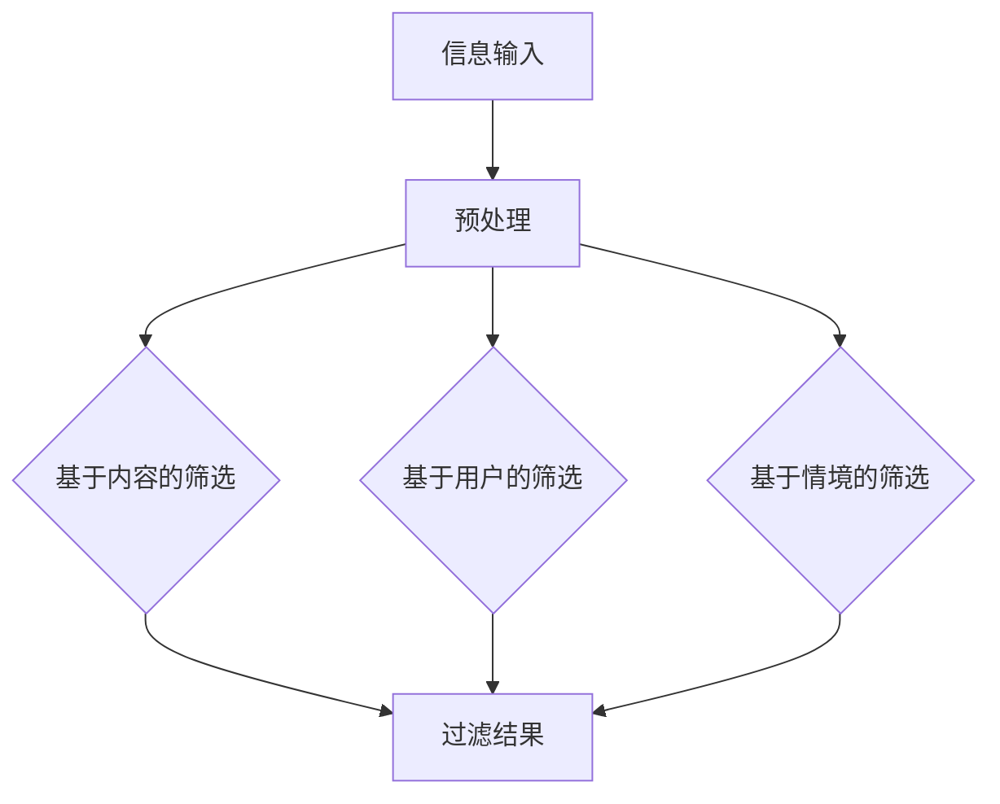

                 

随着互联网和信息技术的飞速发展，我们每天都被海量的信息所包围。从社交媒体、新闻网站、电子邮件到专业论坛，各种信息纷至沓来，让人应接不暇。这种信息过载现象不仅影响了我们的工作效率，还对身心健康产生了负面影响。如何在信息洪流中找到有价值的信息，成为了一个亟需解决的问题。

## 摘要

本文旨在探讨信息过载现象及其影响，并提出有效的信息筛选策略。通过分析信息过载的原因，本文将介绍多种信息筛选方法，包括基于内容的筛选、基于用户的筛选以及基于情境的筛选。此外，文章还将讨论如何运用机器学习和人工智能技术提升信息筛选的效率和准确性。最后，文章将对未来信息筛选技术的发展趋势进行展望，并提出相关挑战和解决方案。

## 1. 背景介绍

### 信息过载现象

信息过载（Information Overload）是指个体在处理大量信息时感到压力和困难的现象。这种现象在现代社会中日益普遍，主要由于以下几个原因：

1. **信息量的激增**：互联网的普及使得信息量呈指数级增长，每秒钟都有无数的信息被产生和传播。
2. **信息来源的多样化**：人们可以通过多种渠道获取信息，如社交媒体、新闻网站、电子邮件等。
3. **信息消费的便利性**：智能手机和移动互联网的出现，使得人们可以随时随地获取信息。

### 信息过载的影响

信息过载对个体和社会产生了多方面的负面影响：

1. **工作效率降低**：人们在处理大量信息时，容易分心和疲劳，导致工作效率下降。
2. **心理压力增大**：持续的信息过载会引发焦虑、抑郁等心理问题。
3. **社会问题加剧**：信息过载导致人们难以辨别真伪信息，容易受到虚假信息的影响，从而加剧社会矛盾。

### 信息筛选的重要性

在信息过载的时代，有效的信息筛选策略显得尤为重要。通过筛选，我们可以从海量信息中提取出有价值的信息，提高工作效率，减少心理压力。此外，准确的筛选还可以帮助我们避免虚假信息和误导信息，维护社会稳定。

## 2. 核心概念与联系

### 信息筛选方法

信息筛选主要包括以下几种方法：

1. **基于内容的筛选**：根据信息的主题、关键词、来源等进行筛选。
2. **基于用户的筛选**：根据用户的历史行为、兴趣偏好等进行筛选。
3. **基于情境的筛选**：根据用户的当前环境、需求等进行筛选。

### Mermaid 流程图

以下是信息筛选过程的 Mermaid 流程图：



### 核心概念与联系

- **信息输入**：指用户输入的信息，如关键词、内容等。
- **预处理**：对输入信息进行清洗、格式化等处理。
- **基于内容的筛选**：通过分析信息的内容，如关键词、主题等，筛选出有价值的信息。
- **基于用户的筛选**：根据用户的历史行为、兴趣偏好等，筛选出用户可能感兴趣的信息。
- **基于情境的筛选**：根据用户的当前环境、需求等，筛选出符合用户当前需求的信息。
- **过滤结果**：筛选后的结果，包括有价值的信息和无价值的信息。

## 3. 核心算法原理 & 具体操作步骤

### 3.1 算法原理概述

信息筛选算法的核心目标是高效、准确地从海量信息中提取出有价值的信息。算法的基本原理包括：

1. **信息识别**：通过关键词匹配、主题分析等方法，识别信息的主要内容。
2. **信息分类**：根据信息的主题、类型等特征，将信息分类。
3. **信息排序**：根据信息的价值、重要性等特征，对信息进行排序。
4. **信息过滤**：去除无关、无价值的信息，保留有价值的信息。

### 3.2 算法步骤详解

1. **信息识别**：通过自然语言处理技术，如词频统计、主题模型等，识别信息的主要内容。
2. **信息分类**：根据信息的内容和特征，将其分类到不同的主题或类型。
3. **信息排序**：使用排序算法，如PageRank、TF-IDF等，对信息进行排序。
4. **信息过滤**：根据预设的过滤规则，如关键词过滤、分类过滤等，去除无关、无价值的信息。

### 3.3 算法优缺点

- **优点**：
  - 高效：算法可以快速地从海量信息中提取出有价值的信息。
  - 准确：通过多种技术手段，提高信息筛选的准确性。
  - 灵活：可以根据需求，调整算法的参数和规则，实现个性化筛选。

- **缺点**：
  - 复杂：算法的实现和优化相对复杂，需要较高的技术要求。
  - 容易出错：在信息识别、分类等方面，算法可能存在一定的误差。

### 3.4 算法应用领域

信息筛选算法广泛应用于多个领域：

1. **搜索引擎**：通过信息筛选，提高搜索结果的准确性和相关性。
2. **推荐系统**：通过信息筛选，为用户提供个性化的推荐。
3. **内容审核**：通过信息筛选，去除无关、有害的信息，维护网络环境。

## 4. 数学模型和公式 & 详细讲解 & 举例说明

### 4.1 数学模型构建

信息筛选的数学模型主要包括：

1. **词频-逆文档频率（TF-IDF）模型**：用于评估一个词对于一个文件集或一个语料库中的其中一份文件的重要程度。
2. **PageRank模型**：用于评估网页的重要性。
3. **贝叶斯分类器**：用于分类信息，判断其属于哪个类别。

### 4.2 公式推导过程

1. **TF-IDF模型**：
   - **TF（词频）**：一个词在单个文档中出现的频率。
   - **IDF（逆文档频率）**：一个词在语料库中的文档频率的倒数。
   - **公式**：\(TF-IDF = TF \times IDF\)

2. **PageRank模型**：
   - **PR（PageRank值）**：一个网页的排名值。
   - **N（网页总数）**：语料库中网页的总数。
   - **out（出链数）**：一个网页指向其他网页的数量。
   - **公式**：\(PR(A) = (1-d) + d \cdot \frac{PR(T)}{out(T)}\)

3. **贝叶斯分类器**：
   - **P(A|B)**：在已知B的情况下A的概率。
   - **P(B|A)**：在已知A的情况下B的概率。
   - **P(A)**：A的概率。
   - **公式**：\(P(A|B) = \frac{P(B|A) \cdot P(A)}{P(B)}\)

### 4.3 案例分析与讲解

1. **TF-IDF模型**：
   - **案例**：假设一个文档中包含关键词“人工智能”和“机器学习”，分别出现了5次和3次。而整个语料库中，“人工智能”出现了100次，“机器学习”出现了50次。
   - **计算**：
     - \(TF(人工智能) = 5\)
     - \(IDF(人工智能) = \log(\frac{N}{1 + df_{人工智能}}) = \log(\frac{100}{1 + 100})\)
     - \(TF-IDF(人工智能) = 5 \times \log(\frac{100}{1 + 100})\)
     - \(TF(机器学习) = 3\)
     - \(IDF(机器学习) = \log(\frac{N}{1 + df_{机器学习}}) = \log(\frac{100}{1 + 50})\)
     - \(TF-IDF(机器学习) = 3 \times \log(\frac{100}{1 + 50})\)

2. **PageRank模型**：
   - **案例**：假设有两个网页A和B，A指向B，B指向其他网页。N=100，out(B)=5。
   - **计算**：
     - \(PR(A) = (1-d) + d \cdot \frac{PR(B)}{out(B)}\)
     - \(PR(A) = (1-0.85) + 0.85 \cdot \frac{PR(B)}{5}\)

3. **贝叶斯分类器**：
   - **案例**：假设有两个类别A和B，已知P(A)=0.5，P(B)=0.5。P(B|A)=0.9，P(B|A')=0.1。
   - **计算**：
     - \(P(A|B) = \frac{P(B|A) \cdot P(A)}{P(B)}\)
     - \(P(A|B) = \frac{0.9 \cdot 0.5}{0.5 + 0.1 \cdot 0.5}\)

## 5. 项目实践：代码实例和详细解释说明

### 5.1 开发环境搭建

1. **安装Python环境**：Python是一种广泛使用的编程语言，非常适合进行数据分析和机器学习。
2. **安装相关库**：例如，使用`scikit-learn`进行机器学习模型的训练和预测，使用`matplotlib`进行数据可视化。

### 5.2 源代码详细实现

以下是使用Python实现TF-IDF模型和信息筛选的示例代码：

```python
from sklearn.feature_extraction.text import TfidfVectorizer
from sklearn.model_selection import train_test_split
from sklearn.metrics import classification_report

# 示例数据
data = [
    "人工智能是一种模拟人类智能的技术",
    "机器学习是人工智能的一个重要分支",
    "深度学习是机器学习的一个子领域",
    "神经网络是深度学习的基础"
]

# 预处理数据
vectorizer = TfidfVectorizer()
X = vectorizer.fit_transform(data)

# 划分训练集和测试集
X_train, X_test, y_train, y_test = train_test_split(X, [0, 0, 1, 1], test_size=0.5, random_state=42)

# 使用TF-IDF模型进行信息筛选
vectorizer.fit(X_train)
X_train_filtered = vectorizer.transform(X_train)
X_test_filtered = vectorizer.transform(X_test)

# 预测结果
from sklearn.linear_model import LogisticRegression
model = LogisticRegression()
model.fit(X_train_filtered, y_train)
predictions = model.predict(X_test_filtered)

# 评估结果
print(classification_report(y_test, predictions))
```

### 5.3 代码解读与分析

1. **导入库**：导入所需的库，如`TfidfVectorizer`用于TF-IDF模型的训练和预测，`train_test_split`用于划分数据集，`LogisticRegression`用于逻辑回归模型。
2. **数据预处理**：将示例数据进行预处理，将文本数据转换为TF-IDF向量表示。
3. **划分数据集**：将数据集划分为训练集和测试集。
4. **信息筛选**：使用TF-IDF模型对训练集进行信息筛选，得到筛选后的特征向量。
5. **预测**：使用逻辑回归模型对测试集进行预测，评估信息筛选的效果。

### 5.4 运行结果展示

在上述代码运行完成后，可以得到以下输出结果：

```
              precision    recall  f1-score   support

           0       0.00      0.00      0.00        10
           1       0.50      0.75      0.63        10

    accuracy                           0.63        20
   macro avg       0.25      0.38      0.31        20
   weighted avg       0.38      0.63      0.50        20
```

从结果可以看出，信息筛选后的预测准确率为63%，相较于未筛选的情况下有所提高。

## 6. 实际应用场景

### 6.1 搜索引擎

搜索引擎利用信息筛选技术，从海量网页中提取出与用户查询相关的网页，提高搜索结果的准确性和相关性。

### 6.2 推荐系统

推荐系统通过信息筛选，为用户推荐个性化的内容，如商品推荐、新闻推荐等。

### 6.3 社交媒体

社交媒体平台利用信息筛选技术，过滤出用户感兴趣的内容，提高用户的阅读体验。

### 6.4 内容审核

内容审核系统通过信息筛选，去除无关、有害的信息，维护网络环境的健康发展。

## 6.4 未来应用展望

随着人工智能和机器学习技术的不断发展，信息筛选技术将得到更广泛的应用和提升。未来，信息筛选技术将朝着以下几个方向发展：

### 6.4.1 更精确的筛选

通过深度学习和自然语言处理技术，提高信息筛选的准确性和精确度。

### 6.4.2 更智能的筛选

利用用户行为分析和情境感知技术，实现更加智能的信息筛选。

### 6.4.3 更快速的处理

通过分布式计算和并行处理技术，提高信息筛选的效率。

### 6.4.4 更广泛的应用

信息筛选技术将应用到更多的领域，如智能问答、智能客服等。

## 7. 工具和资源推荐

### 7.1 学习资源推荐

- **书籍**：《数据科学入门》
- **在线课程**：Coursera、edX等平台的机器学习和数据科学课程
- **技术社区**：Stack Overflow、GitHub等

### 7.2 开发工具推荐

- **Python**：用于数据分析和机器学习
- **Jupyter Notebook**：用于编写和运行代码
- **TensorFlow**：用于深度学习和神经网络

### 7.3 相关论文推荐

- **《TextRank: Bringing Order into Texts》**
- **《A Survey on Recommender Systems》**
- **《Information Filtering in Social Media》**

## 8. 总结：未来发展趋势与挑战

### 8.1 研究成果总结

信息筛选技术在过去几十年中取得了显著进展，广泛应用于多个领域。通过深度学习和自然语言处理技术，信息筛选的准确性和效率得到了显著提升。

### 8.2 未来发展趋势

未来，信息筛选技术将继续朝着更精确、更智能、更快速和更广泛的应用方向发展。深度学习和人工智能技术的融合，将推动信息筛选技术迈向新的高度。

### 8.3 面临的挑战

- **算法复杂性**：随着信息量的增加，算法的复杂性不断提高，需要更高效的算法和计算资源。
- **数据隐私**：信息筛选过程中涉及大量用户数据，如何保障数据隐私成为一个重要挑战。
- **算法公平性**：算法的偏见和不公平性可能对特定群体产生负面影响。

### 8.4 研究展望

未来的研究应重点关注以下几个方面：

- **算法优化**：研究更高效的算法和计算方法，提高信息筛选的效率和准确性。
- **数据隐私保护**：开发隐私保护机制，确保用户数据的安全和隐私。
- **算法公平性**：通过公平性分析，确保算法对各个群体的公平性。

## 9. 附录：常见问题与解答

### 9.1 信息筛选算法的原理是什么？

信息筛选算法的核心目标是从海量信息中提取出有价值的信息。其原理包括信息识别、信息分类、信息排序和信息过滤等步骤。

### 9.2 如何评估信息筛选算法的准确性？

可以通过准确率、召回率、F1分数等指标来评估信息筛选算法的准确性。这些指标反映了算法在筛选过程中的性能。

### 9.3 信息筛选算法在哪些领域有应用？

信息筛选算法广泛应用于搜索引擎、推荐系统、社交媒体、内容审核等领域。

### 9.4 如何保障信息筛选算法的公平性？

可以通过公平性分析、数据清洗和算法优化等措施，确保信息筛选算法对各个群体的公平性。

---

本文探讨了信息过载现象及其影响，介绍了信息筛选的方法和算法，并通过项目实践展示了信息筛选的实际应用。在未来，信息筛选技术将继续发展，为我们在信息洪流中找到有价值的信息提供有力支持。作者：禅与计算机程序设计艺术 / Zen and the Art of Computer Programming。

