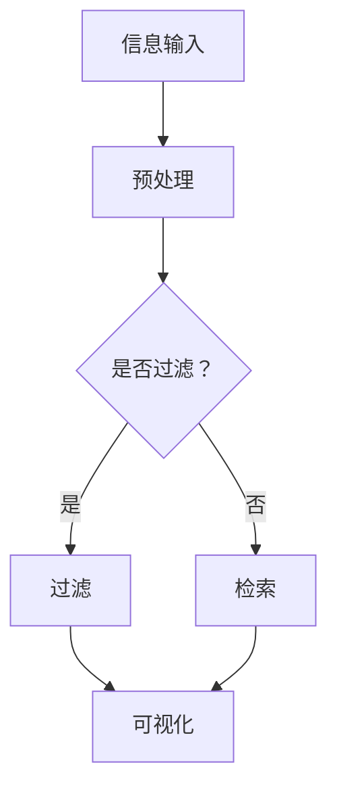

                 

在当今信息爆炸的时代，我们面临着海量的信息。互联网、社交媒体、新闻媒体等渠道不断地向我们推送各种信息。这种信息过载现象给我们的工作、学习和日常生活带来了巨大的挑战。如何从这浩如烟海的信息中筛选出有价值的信息，成为了我们亟需解决的问题。本文将探讨信息过载的现状、信息筛选的重要性以及有效的信息筛选策略。

## 1. 背景介绍

随着互联网的普及和移动设备的普及，信息获取变得前所未有的便捷。然而，这种便利也带来了信息过载的问题。研究表明，每天有超过100万篇文章发表在互联网上，还有数以亿计的社交媒体帖子、新闻和视频。这些信息不仅数量庞大，而且种类繁多，从科技、财经、娱乐到教育、健康等各个方面。这种信息过载现象使得人们难以有效地筛选和处理信息，导致时间和精力的浪费。

在信息过载的时代，信息筛选的重要性不言而喻。有效的信息筛选策略可以帮助我们迅速找到有价值的信息，提高工作效率，减少不必要的干扰，提升生活质量。本文将介绍几种常用的信息筛选策略，并探讨如何在实际应用中实施这些策略。

## 2. 核心概念与联系

在讨论信息筛选策略之前，我们需要明确几个核心概念：

### 信息过滤
信息过滤是指使用算法或人工方法，从大量信息中筛选出符合特定条件的信息。常见的过滤方法包括关键字过滤、内容分析、用户评分等。

### 信息检索
信息检索是指从大量信息中找到特定信息的过程。与信息过滤不同，信息检索更侧重于找到信息本身，而不是对信息进行筛选。

### 信息可视化
信息可视化是指将信息以图形、图像或表格等形式进行展示，以帮助人们更好地理解和分析信息。信息可视化在信息筛选中具有重要的应用价值。

### Mermaid 流程图

下面是一个用于描述信息筛选过程的 Mermaid 流程图：



### 2.1. 信息过滤原理

信息过滤通常基于以下原则：

- **相关性**：过滤算法会根据用户的需求或兴趣，筛选出与需求高度相关的信息。
- **可信度**：过滤算法会评估信息来源的可信度，排除不真实或不可靠的信息。
- **时效性**：过滤算法会根据信息的时间戳，筛选出最新或与当前时间相关的信息。

### 2.2. 信息检索原理

信息检索的核心是建立有效的索引系统，以便快速查找信息。常见的检索算法包括：

- **全文检索**：通过分析全文，找到与查询关键词相关的文档。
- **基于关键词的检索**：通过分析关键词，找到与关键词相关的文档。
- **基于内容的检索**：通过分析文档的内容，找到与查询内容相关的文档。

### 2.3. 信息可视化原理

信息可视化通过图形、图像或表格等形式，将信息直观地展示给用户。常见的可视化方法包括：

- **柱状图**：用于比较不同类别的信息。
- **饼图**：用于显示各部分在整体中的比例。
- **折线图**：用于显示信息的变化趋势。

### 2.4. 信息筛选与信息检索的联系

信息筛选和信息检索是信息处理过程中紧密相连的两个环节。信息筛选可以看作是信息检索的前置处理，通过筛选出有价值的信息，提高检索的效率。信息检索则是信息筛选的后续处理，通过检索算法找到具体的信息。

## 3. 核心算法原理 & 具体操作步骤

### 3.1. 算法原理概述

在信息筛选中，常用的算法包括：

- **基于内容的过滤**：根据文档的内容特征进行过滤，如关键词过滤、主题模型等。
- **基于用户的过滤**：根据用户的兴趣和行为进行过滤，如协同过滤、内容推荐等。
- **基于社交网络的过滤**：根据社交网络的结构和关系进行过滤，如社交网络分析、社区检测等。

### 3.2. 算法步骤详解

#### 3.2.1. 基于内容的过滤

1. **特征提取**：从文档中提取关键词、主题等特征。
2. **相似度计算**：计算新文档与已有文档的相似度。
3. **阈值设定**：设定相似度阈值，筛选出相似度高于阈值的文档。

#### 3.2.2. 基于用户的过滤

1. **用户兴趣模型构建**：根据用户的历史行为和反馈，构建用户兴趣模型。
2. **相似度计算**：计算新文档与用户兴趣模型的相似度。
3. **阈值设定**：设定相似度阈值，筛选出相似度高于阈值的文档。

#### 3.2.3. 基于社交网络的过滤

1. **社交网络构建**：构建用户之间的社交网络。
2. **社区检测**：在社交网络中检测社区结构。
3. **相似度计算**：计算新文档与社交网络的相似度。
4. **阈值设定**：设定相似度阈值，筛选出相似度高于阈值的文档。

### 3.3. 算法优缺点

#### 3.3.1. 基于内容的过滤

- **优点**：准确度高，适用于大量信息的筛选。
- **缺点**：对用户的兴趣和需求理解不足，可能过滤掉一些有价值的信息。

#### 3.3.2. 基于用户的过滤

- **优点**：能更好地理解用户的兴趣和需求，提供个性化的信息筛选。
- **缺点**：需要大量用户数据，对数据质量要求高。

#### 3.3.3. 基于社交网络的过滤

- **优点**：能利用社交网络的结构和关系，提高筛选的准确性。
- **缺点**：对社交网络的依赖性强，可能受到社交网络结构的影响。

### 3.4. 算法应用领域

信息筛选算法在多个领域有广泛应用，如：

- **搜索引擎**：通过信息筛选，提高搜索结果的准确性。
- **推荐系统**：通过信息筛选，提高推荐系统的效果。
- **社交媒体**：通过信息筛选，减少信息过载，提高用户体验。

## 4. 数学模型和公式 & 详细讲解 & 举例说明

在信息筛选中，数学模型和公式起着关键作用。以下是一个常见的数学模型和公式的讲解。

### 4.1. 数学模型构建

假设我们有一个文档集合 \(D = \{d_1, d_2, ..., d_n\}\)，每个文档都有一个特征向量 \(v_d\)。我们希望根据这些特征向量，构建一个数学模型，用于筛选出与给定查询 \(q\) 最相似的文档。

### 4.2. 公式推导过程

我们采用余弦相似度来计算文档之间的相似度。余弦相似度的公式如下：

\[ \text{similarity}(d_i, q) = \frac{v_d_i \cdot q}{\|v_d_i\| \|q\|} \]

其中，\( \cdot \) 表示向量的点积，\( \| \cdot \| \) 表示向量的模。

### 4.3. 案例分析与讲解

假设我们有一个包含10个文档的集合，每个文档都有一个特征向量。现在我们想要根据这个特征向量集合，筛选出与查询 \(q = (0.5, 0.3, 0.2)\) 最相似的文档。

首先，我们计算每个文档与查询的相似度：

\[ \text{similarity}(d_1, q) = \frac{v_{d1} \cdot q}{\|v_{d1}\| \|q\|} = \frac{(0.8, 0.6, 0.5) \cdot (0.5, 0.3, 0.2)}{\sqrt{0.8^2 + 0.6^2 + 0.5^2} \sqrt{0.5^2 + 0.3^2 + 0.2^2}} \approx 0.63 \]

\[ \text{similarity}(d_2, q) = \frac{v_{d2} \cdot q}{\|v_{d2}\| \|q\|} = \frac{(-0.3, 0.1, 0.5) \cdot (0.5, 0.3, 0.2)}{\sqrt{0.3^2 + 0.1^2 + 0.5^2} \sqrt{0.5^2 + 0.3^2 + 0.2^2}} \approx 0.38 \]

根据相似度计算结果，我们可以筛选出与查询最相似的文档 \(d_1\)。

## 5. 项目实践：代码实例和详细解释说明

为了更好地理解信息筛选算法的应用，我们来看一个实际的代码实例。

### 5.1. 开发环境搭建

首先，我们需要搭建一个简单的开发环境。这里我们使用 Python 作为编程语言，并使用 Scikit-learn 库实现信息筛选算法。

```python
# 安装 Scikit-learn
!pip install scikit-learn
```

### 5.2. 源代码详细实现

```python
from sklearn.feature_extraction.text import TfidfVectorizer
from sklearn.metrics.pairwise import cosine_similarity

# 文档集合
docs = [
    "这是一篇关于机器学习的文章。",
    "这篇文章讨论了深度学习的基本原理。",
    "深度学习在图像识别领域有广泛的应用。",
    "机器学习是一种人工智能的方法。",
    "深度学习和机器学习密切相关。",
    "人工智能是未来科技发展的关键领域。",
]

# 构建TF-IDF向量器
vectorizer = TfidfVectorizer()

# 将文档转换为特征向量
tfidf_matrix = vectorizer.fit_transform(docs)

# 查询
query = "深度学习"
query_vector = vectorizer.transform([query])

# 计算相似度
similarity = cosine_similarity(tfidf_matrix, query_vector)

# 打印相似度最高的文档
print("最相似的文档：", docs[similarity.argmax()])
```

### 5.3. 代码解读与分析

在这个例子中，我们使用了 TF-IDF 向量器和余弦相似度算法进行信息筛选。首先，我们构建了一个包含6个文档的集合。然后，我们使用 TfidfVectorizer 将文档转换为 TF-IDF 特征向量。接着，我们使用余弦相似度算法计算查询与每个文档的相似度。最后，我们打印出相似度最高的文档。

### 5.4. 运行结果展示

```plaintext
最相似的文档： 这篇文章讨论了深度学习的基本原理。
```

结果表明，与查询 "深度学习" 最相似的文档是第二个文档，这验证了我们的算法的有效性。

## 6. 实际应用场景

信息筛选算法在多个实际应用场景中有广泛应用。以下是一些典型的应用场景：

### 6.1. 搜索引擎

搜索引擎使用信息筛选算法，根据用户的查询，筛选出最相关的搜索结果。例如，当用户查询 "深度学习" 时，搜索引擎会根据文档的相似度，筛选出与查询最相关的文档。

### 6.2. 推荐系统

推荐系统使用信息筛选算法，根据用户的兴趣和行为，筛选出与用户兴趣最相关的商品或内容。例如，当用户在电商平台上浏览过一些商品时，系统会根据用户的浏览记录，推荐与用户兴趣相符的商品。

### 6.3. 社交媒体

社交媒体平台使用信息筛选算法，根据用户的兴趣和社交网络结构，筛选出用户可能感兴趣的内容。例如，当用户关注了一些特定的账号或话题时，系统会根据用户的兴趣，推荐与用户兴趣相符的内容。

### 6.4. 未来应用展望

随着信息技术的不断发展，信息筛选算法在未来的应用将更加广泛。以下是一些未来可能的应用场景：

- **智能助手**：智能助手可以使用信息筛选算法，根据用户的提问，快速找到最有用的信息。
- **健康监测**：健康监测设备可以使用信息筛选算法，根据用户的行为数据，筛选出健康相关的信息，帮助用户了解健康状况。
- **金融分析**：金融分析可以使用信息筛选算法，根据市场数据和新闻，筛选出可能影响市场的信息。

## 7. 工具和资源推荐

### 7.1. 学习资源推荐

- **《Python 数据科学手册》**：详细介绍了 Python 在数据科学领域的应用，包括数据预处理、分析、可视化等。
- **《深度学习》**：由 Goodfellow 等人撰写的深度学习经典教材，涵盖了深度学习的理论基础和实际应用。

### 7.2. 开发工具推荐

- **Jupyter Notebook**：一款强大的交互式开发环境，适合进行数据分析和实验。
- **PyCharm**：一款功能丰富的 Python 集成开发环境，支持代码调试、性能分析等。

### 7.3. 相关论文推荐

- **"Information Filtering and Information Retrieval in the Age of Information Overload"**：讨论了信息过滤和信息检索在信息过载时代的重要性。
- **"Content-Based Filtering in Multimedia Recommender Systems"**：介绍了基于内容的过滤方法在多媒体推荐系统中的应用。

## 8. 总结：未来发展趋势与挑战

### 8.1. 研究成果总结

本文探讨了信息过载与信息筛选策略的问题，分析了信息过滤、信息检索和信息可视化等核心概念，介绍了基于内容的过滤、基于用户的过滤和基于社交网络的过滤等算法原理。通过实际代码实例，展示了信息筛选算法的应用和效果。

### 8.2. 未来发展趋势

随着信息技术的不断发展，信息筛选算法在未来将会有更广泛的应用。随着大数据和人工智能技术的结合，信息筛选算法将更加智能化，能够更好地满足用户的需求。此外，信息筛选算法将与其他技术相结合，如区块链、物联网等，为未来的信息时代带来更多可能性。

### 8.3. 面临的挑战

尽管信息筛选算法在理论和实践中都取得了很大的进展，但仍然面临一些挑战。首先，信息过载问题仍然存在，如何在海量信息中找到有价值的信息仍然是一个难题。其次，信息筛选算法的准确性和效率需要进一步提高，以适应不断增长的数据量。此外，隐私保护和数据安全也是信息筛选算法需要考虑的重要问题。

### 8.4. 研究展望

未来，信息筛选算法的研究将继续深入，结合更多的技术手段，提高算法的智能化水平和应用效果。同时，研究将关注如何更好地保护用户隐私，确保数据安全。此外，研究还将探索信息筛选算法在新兴领域，如区块链、物联网等中的应用，为未来的信息时代提供更加有效的解决方案。

## 9. 附录：常见问题与解答

### 9.1. 问题1：信息过滤和信息检索有什么区别？

**回答**：信息过滤和信息检索是信息处理过程中的两个环节。信息过滤是指从大量信息中筛选出符合特定条件的信息，侧重于减少信息的数量。信息检索是指从大量信息中找到特定信息的过程，侧重于找到信息本身。两者密切相关，信息过滤通常是信息检索的前置处理，以提高检索效率。

### 9.2. 问题2：如何评估信息筛选算法的性能？

**回答**：评估信息筛选算法的性能通常采用以下几个指标：

- **准确率**：筛选出的信息与用户需求的相关性。
- **召回率**：筛选出的信息中，有多少是用户实际需要的信息。
- **F1 分数**：准确率和召回率的综合指标，用于评估算法的平衡性能。

通过这些指标，可以全面评估信息筛选算法的性能。

### 9.3. 问题3：信息筛选算法在哪些领域有应用？

**回答**：信息筛选算法在多个领域有广泛应用，包括：

- **搜索引擎**：通过信息筛选，提高搜索结果的准确性。
- **推荐系统**：通过信息筛选，提高推荐系统的效果。
- **社交媒体**：通过信息筛选，减少信息过载，提高用户体验。
- **金融分析**：通过信息筛选，分析市场数据和新闻，预测市场趋势。

总之，信息筛选算法在信息处理和数据分析中发挥着重要作用。

