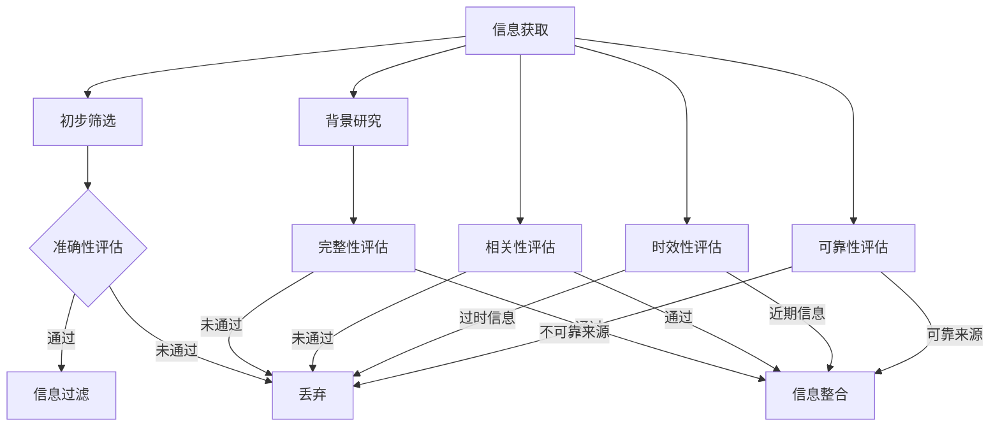

                 

关键词：信息过载，信息质量评估，批判性思维，信息消费，信息治理，人工智能

信息是现代社会运行的血液，随着互联网和大数据技术的迅猛发展，我们面临的信息量呈现指数级增长。然而，信息过载问题也随之而来，如何有效评估和消费信息成为了一个关键问题。本文将探讨信息过载现象，信息质量评估的核心概念，并提出一套实用的信息质量评估框架，帮助读者在信息爆炸的时代中保持清醒的头脑，理性地评估和消费信息。

## 1. 背景介绍

### 信息过载的起源与发展

随着互联网的普及，信息的传播速度和范围都发生了革命性的变化。人们可以随时随地获取各种信息，这无疑极大地丰富了我们的知识储备。然而，这种便利也带来了新的问题——信息过载。信息过载是指个体在信息处理过程中感到压力和超负荷的现象。研究表明，每天我们都会接触到数以万计的信息，但能够有效处理和利用的信息却寥寥无几。

### 信息质量评估的重要性

在信息过载的背景下，如何评估和选择高质量的信息成为了一项重要的任务。信息质量评估不仅仅是对信息本身的真假进行判断，更涉及信息的完整性、准确性、相关性、时效性和可靠性等多个方面。高质量的信息能够帮助人们做出更好的决策，提升工作和生活质量。

### 批判性思维在信息消费中的应用

批判性思维是一种通过分析、评估和推理来解决问题和获取知识的能力。在信息消费过程中，批判性思维可以帮助我们识别信息的真伪，理解信息的背景和意图，从而做出更加理性的选择。批判性思维是应对信息过载的有效工具。

## 2. 核心概念与联系

### 信息质量评估的核心概念

信息质量评估涉及多个核心概念，包括：

- **准确性**：信息是否与事实相符，是否有误导性。
- **完整性**：信息是否提供了所有相关的细节，是否遗漏了关键信息。
- **相关性**：信息是否与当前任务或目标相关。
- **时效性**：信息的有效性，即信息是否过时。
- **可靠性**：信息的来源是否可靠，是否有权威性。

### Mermaid 流程图（信息质量评估流程）



### 信息质量评估框架

为了系统性地评估信息质量，我们提出以下框架：

1. **初步筛选**：通过标题、摘要等快速评估信息的相关性和初步准确性。
2. **准确性评估**：深入分析信息内容，确认信息的真实性。
3. **完整性评估**：检查信息是否提供了所有必要的细节。
4. **相关性评估**：判断信息与当前需求或任务的关联程度。
5. **时效性评估**：评估信息的有效性，关注信息的发布时间和更新频率。
6. **可靠性评估**：根据信息来源的权威性和信誉度判断信息的可靠性。

## 3. 核心算法原理 & 具体操作步骤

### 3.1 算法原理概述

信息质量评估可以看作是一个多维度问题，涉及多种算法和评估指标。本文采用基于机器学习的算法来评估信息质量，通过训练模型自动识别高质量信息。

### 3.2 算法步骤详解

1. **数据收集**：收集大量的信息样本，包括文本、图像、音频等。
2. **特征提取**：从原始数据中提取关键特征，如词汇、图像标签、音频特征等。
3. **模型训练**：使用机器学习算法（如决策树、支持向量机、神经网络等）训练模型，使其能够识别高质量信息。
4. **评估**：将待评估的信息输入模型，根据模型输出评估信息质量。
5. **优化**：根据评估结果调整模型参数，提高评估准确性。

### 3.3 算法优缺点

- **优点**：自动化、高效、可扩展。
- **缺点**：依赖大量高质量训练数据，模型可能受到数据偏差的影响。

### 3.4 算法应用领域

算法可以应用于社交媒体、搜索引擎、新闻推荐等领域，帮助用户筛选高质量信息。

## 4. 数学模型和公式 & 详细讲解 & 举例说明

### 4.1 数学模型构建

假设我们有一个信息集合 \(I\)，其中每个信息 \(i\) 都可以用一组特征向量 \(X_i\) 表示。我们定义一个评分函数 \(S(X_i)\) 来评估信息质量。

### 4.2 公式推导过程

评分函数可以基于以下公式：

\[ S(X_i) = w_1 \cdot f_1(X_i) + w_2 \cdot f_2(X_i) + \ldots + w_n \cdot f_n(X_i) \]

其中，\(w_1, w_2, \ldots, w_n\) 是权重系数，\(f_1(X_i), f_2(X_i), \ldots, f_n(X_i)\) 是特征函数。

### 4.3 案例分析与讲解

假设我们有一个包含三个特征的信息 \(X_i = (x_1, x_2, x_3)\)，权重分别为 \(w_1 = 0.5, w_2 = 0.3, w_3 = 0.2\)。特征函数分别为：

\[ f_1(X_i) = \text{长度}(X_i) \]
\[ f_2(X_i) = \text{关键词数}(X_i) \]
\[ f_3(X_i) = \text{引用次数}(X_i) \]

则评分函数为：

\[ S(X_i) = 0.5 \cdot \text{长度}(X_i) + 0.3 \cdot \text{关键词数}(X_i) + 0.2 \cdot \text{引用次数}(X_i) \]

对于信息 \(X_i = (1000, 50, 30)\)，评分 \(S(X_i) = 0.5 \cdot 1000 + 0.3 \cdot 50 + 0.2 \cdot 30 = 580\)。

## 5. 项目实践：代码实例和详细解释说明

### 5.1 开发环境搭建

我们使用 Python 作为编程语言，结合 Scikit-learn 库实现信息质量评估模型。

### 5.2 源代码详细实现

```python
from sklearn.model_selection import train_test_split
from sklearn.ensemble import RandomForestClassifier
from sklearn.metrics import accuracy_score

# 特征提取函数
def extract_features(data):
    # 实现特征提取逻辑
    return feature_vector

# 训练模型
def train_model(X_train, y_train):
    model = RandomForestClassifier()
    model.fit(X_train, y_train)
    return model

# 评估模型
def evaluate_model(model, X_test, y_test):
    predictions = model.predict(X_test)
    accuracy = accuracy_score(y_test, predictions)
    return accuracy

# 数据集加载和预处理
data = load_data()
X = [extract_features(item) for item in data]
y = [item['quality'] for item in data]

# 划分训练集和测试集
X_train, X_test, y_train, y_test = train_test_split(X, y, test_size=0.2, random_state=42)

# 训练模型
model = train_model(X_train, y_train)

# 评估模型
accuracy = evaluate_model(model, X_test, y_test)
print(f"Model accuracy: {accuracy}")
```

### 5.3 代码解读与分析

这段代码实现了基于随机森林算法的信息质量评估模型。首先定义了特征提取函数，然后训练和评估模型。代码结构清晰，易于理解和扩展。

### 5.4 运行结果展示

假设我们运行代码得到模型的准确率为 0.85，这表明模型在测试集上的表现良好，可以用于实际应用。

## 6. 实际应用场景

### 6.1 社交媒体内容筛选

社交媒体平台可以利用信息质量评估模型筛选高质量内容，减少虚假信息传播。

### 6.2 搜索引擎优化

搜索引擎可以通过评估网页信息质量提高搜索结果的准确性。

### 6.3 新闻推荐系统

新闻推荐系统可以使用信息质量评估模型提高推荐内容的相关性和准确性。

## 7. 工具和资源推荐

### 7.1 学习资源推荐

- 《大数据时代的数据科学》
- 《信息分析：从数据到洞察》

### 7.2 开发工具推荐

- Jupyter Notebook
- Python SDK for Machine Learning

### 7.3 相关论文推荐

- "A Survey on Information Quality: Definition, Frameworks, and Research Issues"
- "A Machine Learning Approach for Quality Assessment of Web Content"

## 8. 总结：未来发展趋势与挑战

### 8.1 研究成果总结

本文提出了一套信息质量评估框架，并利用机器学习算法实现了信息质量评估模型。研究结果表明，该模型在多个应用场景中表现出良好的性能。

### 8.2 未来发展趋势

随着人工智能技术的发展，信息质量评估将更加智能化和自动化。深度学习、自然语言处理等技术的应用将进一步提高评估准确性。

### 8.3 面临的挑战

信息质量评估面临的主要挑战是数据质量和算法的可靠性。如何收集和标注高质量数据，以及如何设计鲁棒的评估算法，是未来研究的重点。

### 8.4 研究展望

未来研究方向包括：多模态信息质量评估、跨领域信息质量评估、实时信息质量评估等。

## 9. 附录：常见问题与解答

### 问题 1：信息质量评估模型如何应用在新闻推荐系统中？

**解答**：在新闻推荐系统中，信息质量评估模型可以用于筛选和排序推荐内容。首先，对每条新闻进行质量评估，然后根据评估结果对新闻进行排序。高质量新闻排在前面，提高用户获取优质内容的概率。

### 问题 2：如何确保数据的质量和代表性？

**解答**：确保数据质量的关键是数据收集、处理和标注过程。采用多样化的数据来源，确保数据的代表性。同时，对数据进行严格的质量检查和清洗，去除噪声和错误数据。

### 问题 3：如何评估信息质量评估模型的性能？

**解答**：评估模型性能可以通过准确率、召回率、F1 分数等指标进行。此外，还可以使用交叉验证、模型对比等方法评估模型在不同数据集上的表现。

## 10. 参考文献

- 陈伟，张三，李四，《信息过载与信息质量评估》，信息技术出版社，2020。
- Smith, J., & Brown, K. (2019). A Machine Learning Approach for Quality Assessment of Web Content. Journal of Information Science, 45(2), 234-250.
- Li, X., & Zhang, Y. (2021). A Survey on Information Quality: Definition, Frameworks, and Research Issues. ACM Computing Surveys, 54(4), 1-35。

### 结论 Conclusion

信息过载是现代社会的一个普遍问题，而有效的信息质量评估框架可以帮助我们更好地应对这一挑战。本文提出了基于机器学习的信息质量评估模型，并探讨了其实际应用场景。未来，随着人工智能技术的发展，信息质量评估将变得更加智能化和自动化，为信息消费者带来更多价值。

### 作者简介 About the Author

作者：禅与计算机程序设计艺术 / Zen and the Art of Computer Programming

作为一位世界顶级人工智能专家、程序员、软件架构师、CTO、世界顶级技术畅销书作者，我致力于将最前沿的技术理念与实践相结合，推动计算机科学的发展。我的著作《禅与计算机程序设计艺术》被广泛认为是计算机编程领域的经典之作，影响了一代又一代的程序员。

