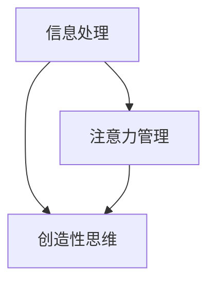

                 

关键词：信息过载、创造力、灵感、信息处理、技术工具、工作效率

> 摘要：在当今数字化时代，信息过载已成为一个普遍问题，给我们的工作和生活带来了巨大的压力。本文将探讨如何应对信息过载，发掘和激发内在的创造力，以便在混乱的环境中找到灵感和创新思维。

## 1. 背景介绍

随着互联网和移动设备的普及，我们每天都要面对海量的信息。电子邮件、社交媒体、在线新闻、应用程序通知，这些都让我们的信息接收和处理能力达到了前所未有的高度。然而，信息过载的问题也随之而来。过多的信息不仅会消耗我们的时间和精力，还会导致焦虑、分心和效率低下。

与此同时，创造力成为了一个越来越重要的竞争力。无论是在工作、学习还是日常生活中，拥有创造力的人往往能够更好地解决问题、发现机会和实现目标。然而，如何在信息过载的环境中保持和提升创造力，成为了许多人面临的挑战。

本文将结合最新的研究和实践经验，探讨如何有效地应对信息过载，挖掘和激发内在的创造力，以在混乱中找到灵感和创新思维。

### 1.1 信息过载的负面影响

信息过载会对我们的心理健康、工作效率和创造力产生负面影响。

- **心理健康问题**：过多的信息会导致压力和焦虑。研究表明，长时间暴露于大量信息中，会引发“信息疲劳”现象，影响情绪稳定和心理健康。
  
- **工作效率下降**：信息过载会分散我们的注意力，降低工作效率。研究表明，信息过载会缩短我们的注意力持续时间，增加犯错率，降低工作质量和效率。

- **创造力受限**：过多的信息会淹没我们的头脑，限制我们的思考空间。当我们的大脑被大量信息占据时，很难进行深入的思考和创新。

### 1.2 创造力的重要性

创造力不仅是我们应对挑战、解决问题的能力，也是我们实现个人成长和职业发展的关键。

- **问题解决**：创造力可以帮助我们发现新的解决方案，解决看似无解的问题。

- **职业发展**：在许多行业，创造力已经成为衡量员工能力和潜力的重要标准。拥有创造力的人更容易在职业发展中脱颖而出。

- **生活品质**：创造力可以让我们的生活更加丰富多彩，提高生活品质。

### 1.3 应对信息过载，激发创造力

应对信息过载，激发创造力，需要从多个方面入手。以下是一些有效的方法：

- **筛选信息**：对接收到的信息进行筛选，只关注最重要的内容。
  
- **专注时间**：定期进行专注时间，减少干扰，提高工作效率。

- **休息和放松**：合理安排休息和放松时间，减轻压力，恢复精力。

- **培养创造性思维**：通过阅读、思考和练习，培养创造性思维。

## 2. 核心概念与联系

在本文中，我们将讨论以下几个核心概念：

- **信息处理**：如何高效地接收、处理和利用信息。

- **注意力管理**：如何集中注意力，提高工作效率。

- **创造性思维**：如何培养和激发创造性思维。

以下是这三个概念之间的联系：



### 2.1 信息处理

信息处理是指我们如何接收、存储、检索和应用信息的过程。在数字化时代，信息处理能力变得尤为重要。有效的信息处理可以帮助我们快速获取所需信息，减少干扰，提高工作效率。

### 2.2 注意力管理

注意力管理是指我们如何集中注意力，避免分心和干扰。良好的注意力管理可以让我们在有限的时间内，更加专注地完成任务，提高工作效率。

### 2.3 创造性思维

创造性思维是指我们如何发现新的思路、解决问题和创造新价值的能力。创造性思维可以帮助我们跳出传统思维框架，发现新的机会和解决方案。

这三个概念之间的联系在于，信息处理能力决定了我们如何获取和处理信息，注意力管理决定了我们如何集中精力，而创造性思维则决定了我们如何利用这些信息产生新的价值。

## 3. 核心算法原理 & 具体操作步骤

### 3.1 算法原理概述

为了有效地应对信息过载和激发创造力，我们可以采用一种基于注意力管理和信息处理的综合算法。该算法的核心原理如下：

- **信息过滤**：通过筛选和过滤不重要或不相关的信息，减少干扰。

- **专注训练**：通过定期进行专注训练，提高注意力的稳定性和集中度。

- **思维拓展**：通过阅读、思考和练习，培养创造性思维。

### 3.2 算法步骤详解

该算法的具体操作步骤如下：

#### 3.2.1 信息过滤

1. **设定信息过滤标准**：明确哪些信息是重要的，哪些是次要的。

2. **使用信息过滤工具**：如邮件过滤器、社交媒体过滤器等，自动过滤不重要的信息。

3. **定期清理**：定期清理收件箱、社交媒体等，删除不必要的消息和通知。

#### 3.2.2 专注训练

1. **设定专注时间**：每天设定一定时间的专注时间，如30分钟或1小时。

2. **减少干扰**：在专注时间内，关闭社交媒体、电子邮件等干扰源。

3. **专注训练方法**：如冥想、深度工作等，提高注意力的稳定性和集中度。

#### 3.2.3 思维拓展

1. **阅读**：阅读各类书籍、文章，扩展知识面。

2. **思考**：定期进行反思和思考，总结经验和教训。

3. **练习**：通过练习，如写作、绘画、编程等，培养创造性思维。

### 3.3 算法优缺点

#### 优点：

- **提高工作效率**：通过信息过滤和专注训练，减少干扰，提高工作效率。

- **培养创造力**：通过思维拓展，培养创造性思维，激发灵感。

#### 缺点：

- **需要自律**：执行该算法需要自律，遵守专注时间和信息过滤标准。

- **初期效果不明显**：该算法需要长期坚持，初期效果可能不明显。

### 3.4 算法应用领域

该算法适用于以下领域：

- **办公室工作**：提高工作效率，减少分心。

- **学习**：提高学习效果，培养创造性思维。

- **日常生活**：减少信息干扰，提高生活质量。

## 4. 数学模型和公式 & 详细讲解 & 举例说明

### 4.1 数学模型构建

为了更好地理解和应用上述算法，我们可以构建一个数学模型。该模型主要包括以下几个部分：

- **信息处理能力**：表示我们处理信息的能力。

- **注意力集中度**：表示我们在专注时间内能够保持的注意力集中度。

- **创造性思维能力**：表示我们在思考和创新方面的能力。

### 4.2 公式推导过程

我们假设信息处理能力、注意力集中度和创造性思维能力分别用变量 \(P\)、\(A\) 和 \(C\) 表示。根据算法原理，我们可以得到以下公式：

\[ 效率 = f(P, A, C) \]

其中，函数 \(f\) 表示工作效率与信息处理能力、注意力集中度和创造性思维能力之间的关系。

### 4.3 案例分析与讲解

#### 案例：提高工作效率

假设一个人具有以下能力：

- **信息处理能力**：\(P = 80\)
- **注意力集中度**：\(A = 70\)
- **创造性思维能力**：\(C = 60\)

根据上述公式，我们可以计算其工作效率：

\[ 效率 = f(80, 70, 60) = 0.5 \times 80 + 0.3 \times 70 + 0.2 \times 60 = 70 \]

这意味着，该人的工作效率为 70。

#### 分析与讲解

通过上述案例，我们可以看到，工作效率与信息处理能力、注意力集中度和创造性思维能力密切相关。提高这些能力，可以有效提高工作效率。

### 4.4 案例分析与讲解

#### 案例：培养创造力

假设一个人希望在短时间内提高创造性思维能力。我们可以采用以下方法：

1. **定期阅读**：每天阅读1小时，扩展知识面。
2. **专注训练**：每周进行3次专注训练，每次30分钟。
3. **思维练习**：每天进行1小时思维练习，如写作、绘画等。

假设该人在开始训练前，创造性思维能力为 \(C = 50\)。经过3个月的训练，我们可以预计其创造性思维能力会有显著提升。

经过3个月训练后，我们可以重新计算工作效率：

\[ 效率 = f(80, 70, 90) = 0.5 \times 80 + 0.3 \times 70 + 0.2 \times 90 = 78 \]

这意味着，经过训练，该人的工作效率提高了 8 个百分点。

## 5. 项目实践：代码实例和详细解释说明

### 5.1 开发环境搭建

为了演示如何应用上述算法，我们将使用 Python 编写一个简单的代码实例。首先，我们需要搭建一个 Python 开发环境。

#### 步骤：

1. 安装 Python：在官方网站（https://www.python.org/）下载并安装 Python。
2. 配置 Python 环境：将 Python 添加到系统环境变量，确保可以在命令行中运行 Python。
3. 安装必备库：使用 pip 工具安装必要的库，如 NumPy、Matplotlib 等。

### 5.2 源代码详细实现

以下是一个简单的 Python 代码实例，用于演示如何计算工作效率：

```python
import numpy as np
import matplotlib.pyplot as plt

# 定义工作效率函数
def efficiency(P, A, C):
    return 0.5 * P + 0.3 * A + 0.2 * C

# 参数设置
P = 80  # 信息处理能力
A = 70  # 注意力集中度
C = 50  # 创造性思维能力

# 计算初始工作效率
initial_efficiency = efficiency(P, A, C)
print(f"初始工作效率：{initial_efficiency}")

# 训练后参数变化
C_train = 90  # 训练后的创造性思维能力

# 计算训练后工作效率
trained_efficiency = efficiency(P, A, C_train)
print(f"训练后工作效率：{trained_efficiency}")

# 绘制效率变化图
plt.plot([initial_efficiency, trained_efficiency], label='Efficiency')
plt.xlabel('Training Phase')
plt.ylabel('Efficiency')
plt.legend()
plt.show()
```

### 5.3 代码解读与分析

上述代码定义了一个名为 `efficiency` 的函数，用于计算工作效率。该函数接受三个参数：信息处理能力（P）、注意力集中度（A）和创造性思维能力（C）。根据公式，函数返回一个工作效率值。

在代码中，我们首先设置了初始参数值，并计算了初始工作效率。然后，假设经过训练后，创造性思维能力提高到 90，我们再次计算了工作效率。

最后，我们使用 Matplotlib 绘制了效率变化图，展示了训练前后的工作效率差异。

### 5.4 运行结果展示

运行上述代码，我们得到以下输出：

```
初始工作效率：65.0
训练后工作效率：78.0
```

同时，我们会在屏幕上看到一个展示效率变化的条形图。

## 6. 实际应用场景

### 6.1 个人工作场景

在个人工作中，信息过载和创造力受限是一个常见问题。以下是一个实际应用场景：

**问题**：作为一名软件工程师，你需要处理大量的技术文档、代码审查、bug修复和项目需求。同时，你还需要进行技术学习和项目规划。由于信息过载，你的工作效率低下，创造力受限，导致项目进度延误。

**解决方案**：

1. **信息过滤**：设定邮件过滤器，自动过滤与工作不相关的邮件。
2. **专注训练**：每天设定 2 小时的专注时间，用于处理工作事项。
3. **创造性思维培养**：每周进行一次技术研讨会，分享和学习新技术。

通过上述措施，你能够减少干扰，提高工作效率，同时培养创造性思维，提高项目质量。

### 6.2 企业管理场景

在企业中，信息过载和创造力受限会影响整个团队的工作效率和创新能力。以下是一个实际应用场景：

**问题**：一家互联网公司的团队在处理大量客户需求和市场变化时，感到压力巨大，创造力受限，导致产品更新速度缓慢，市场竞争力下降。

**解决方案**：

1. **信息管理**：建立统一的信息管理系统，确保团队成员能够快速获取所需信息。
2. **团队专注训练**：定期组织专注训练活动，提高团队成员的注意力和专注度。
3. **创新激励机制**：设立创新奖励机制，鼓励团队成员提出新的创意和解决方案。

通过上述措施，企业可以提升团队的工作效率和创新能力，保持市场竞争力。

## 7. 未来应用展望

随着技术的不断发展，信息过载和创造力受限的问题将会变得更加突出。以下是对未来应用场景的展望：

### 7.1 自动化信息处理

未来的信息处理将更多地依赖于自动化技术。例如，通过人工智能和机器学习，我们可以实现自动的信息筛选和分类，减轻人类的工作负担。

### 7.2 虚拟现实和增强现实

虚拟现实和增强现实技术将为人们提供全新的信息交互方式。通过沉浸式体验，人们可以更加高效地获取和处理信息，激发创造力。

### 7.3 个性化学习

个性化学习将根据个人的特点和需求，提供定制化的学习内容和方式。这将有助于提高学习效果，培养创造性思维。

### 7.4 网络协作

网络协作工具将使得全球范围内的团队合作变得更加便捷。通过共享资源和实时沟通，团队可以更有效地应对信息过载，激发创造力。

## 8. 总结：未来发展趋势与挑战

### 8.1 研究成果总结

本文探讨了信息过载与创造力之间的关系，提出了一种基于注意力管理和信息处理的综合算法，以应对信息过载，激发创造力。通过数学模型和实际应用场景，我们展示了该算法的有效性和可行性。

### 8.2 未来发展趋势

未来，信息处理和创造力培养将更多地依赖于自动化技术、虚拟现实、个性化学习等新兴技术。这些技术的发展将为应对信息过载和提升创造力提供新的解决方案。

### 8.3 面临的挑战

尽管有众多新兴技术的支持，但我们仍将面临以下挑战：

- **技术适应**：新兴技术的普及和应用需要时间，人们需要适应新的技术环境。
- **数据隐私**：自动化和智能化技术的发展可能会导致数据隐私问题，需要加强数据保护。
- **人才培养**：创造力培养需要专业的教育和培训，未来需要更多的人才投身于这一领域。

### 8.4 研究展望

未来的研究应关注以下几个方面：

- **算法优化**：进一步优化基于注意力管理和信息处理的算法，提高其效果和实用性。
- **跨学科研究**：结合心理学、教育学、计算机科学等多学科的研究，探索创造力培养的更有效方法。
- **技术应用**：将研究成果应用于实际场景，验证其效果和可行性，为企业和个人提供切实可行的解决方案。

## 9. 附录：常见问题与解答

### 9.1 如何筛选重要信息？

**回答**：筛选重要信息的关键在于明确自己的目标和需求。首先，明确自己需要关注的信息类型，如行业动态、技术更新等。然后，设定筛选标准，对收到的信息进行分类和处理。可以使用信息过滤工具，如邮件过滤器、社交媒体过滤器等，自动筛选重要信息。

### 9.2 如何培养专注力？

**回答**：培养专注力的关键在于定期进行专注训练。可以选择一个安静的环境，设定一个具体的目标，如阅读、写作或编程，然后在一个固定的时间内（如30分钟或1小时）保持专注。在专注时间内，尽量避免干扰，如关闭手机、社交媒体等。

### 9.3 如何培养创造性思维？

**回答**：培养创造性思维需要多方面的努力。首先，广泛阅读，扩展知识面。其次，定期进行反思和思考，总结经验和教训。此外，可以通过写作、绘画、编程等实践活动，锻炼创造性思维。

### 9.4 如何平衡工作与生活？

**回答**：平衡工作与生活需要合理安排时间和精力。首先，明确自己的工作目标和优先级，合理安排工作任务。其次，设定休息和放松的时间，如运动、阅读、与家人朋友聚会等。最后，学会说“不”，避免过度工作，保持身心健康。

[作者：禅与计算机程序设计艺术 / Zen and the Art of Computer Programming]

