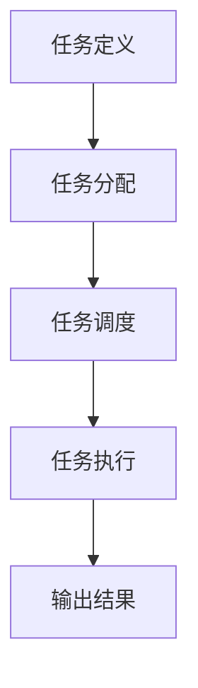
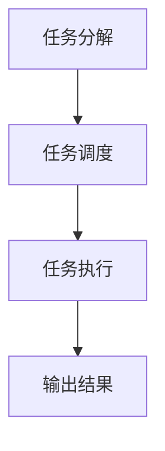

                 

### 背景介绍

在当今快速发展的信息技术时代，我们面临着前所未有的信息过载问题。无论是工作、学习还是日常生活中的各个领域，信息量都以惊人的速度增长。这种信息爆炸使得人们不得不处理大量复杂的信息，从而产生了多任务处理的需求。然而，尽管多任务处理技术在过去几十年中取得了显著进展，但其在实际应用中仍然存在许多局限性。

多任务处理的局限性主要体现在以下几个方面：

1. **效率问题**：在处理多个任务时，系统的效率往往受到限制。因为计算机资源是有限的，同时处理多个任务会导致资源分配不均，从而降低整体处理效率。
2. **错误率增加**：多任务处理可能导致任务之间的干扰，使得错误率增加。例如，在同时编辑两个文档时，容易混淆内容，导致错误。
3. **用户体验下降**：多任务处理往往需要用户在多个任务之间切换，这不仅增加了用户的工作负担，还可能导致用户注意力分散，从而降低用户体验。
4. **复杂性问题**：多任务处理系统的设计和管理相对复杂，需要考虑任务之间的优先级、依赖关系等问题，增加了系统的复杂度。

因此，本文旨在探讨单一任务处理的优点及其在实际应用中的重要性。通过深入分析单一任务处理的原理和方法，我们希望能够为解决信息过载和多任务处理的局限性提供新的思路和解决方案。

### 核心概念与联系

在深入探讨单一任务处理之前，我们需要明确一些核心概念，并了解它们之间的联系。这些概念包括任务定义、任务分配、任务调度和任务执行等。

**任务定义**：任务是指需要完成的一个具体的工作单元。它可以是一个简单的操作，如打开一个文件，也可以是一个复杂的操作，如处理一个大规模的数据集。任务通常具有明确的输入、输出和处理逻辑。

**任务分配**：任务分配是指将任务分配给系统中的不同处理单元或线程。在多任务处理系统中，任务分配需要考虑处理单元的能力、任务优先级等因素。

**任务调度**：任务调度是指根据系统资源状况和任务优先级，动态地安排任务的执行顺序。任务调度算法需要保证系统资源的最优利用和任务完成时间的最小化。

**任务执行**：任务执行是指任务在实际处理单元上运行的过程。任务执行过程中，处理单元需要根据任务的输入和处理逻辑进行计算和处理，最终生成输出结果。

以下是核心概念和联系之间的Mermaid流程图：



**任务定义**是任务处理的第一步，它为后续的任务分配、调度和执行提供了基础。**任务分配**将任务分配给合适的处理单元，这需要考虑处理单元的能力和任务优先级等因素。**任务调度**则根据系统资源状况和任务优先级，动态地安排任务的执行顺序，以确保系统资源的最优利用。最后，**任务执行**是任务处理的核心步骤，处理单元需要根据任务的输入和处理逻辑进行计算和处理，最终生成输出结果。

通过上述核心概念和联系的分析，我们可以更好地理解单一任务处理的工作原理。在接下来的章节中，我们将详细探讨单一任务处理的原理和方法，以及它在实际应用中的重要性。

### 核心算法原理 & 具体操作步骤

#### 3.1 算法原理概述

单一任务处理的核心思想是将复杂问题分解为一系列简单任务，并对每个任务进行独立处理。这种方法不仅提高了系统的处理效率，还有助于降低系统的复杂度，提高系统的可靠性。

单一任务处理的算法原理主要包括以下几部分：

1. **任务分解**：将复杂问题分解为若干个简单任务。任务分解的目的是降低问题的复杂度，使每个任务更容易处理。
2. **任务调度**：根据系统资源状况和任务优先级，动态地安排任务的执行顺序。任务调度的目的是确保系统资源的最优利用和任务完成时间的最小化。
3. **任务执行**：对每个任务进行独立处理，并根据任务的输入和处理逻辑生成输出结果。任务执行的目的是实现任务的最终目标。

以下是单一任务处理算法的原理概述：



**任务分解**是任务处理的第一步，它将复杂问题转化为多个简单任务。**任务调度**则根据系统资源状况和任务优先级，动态地安排任务的执行顺序，以确保系统资源的最优利用。最后，**任务执行**是对每个任务进行独立处理，并根据任务的输入和处理逻辑生成输出结果。

#### 3.2 算法步骤详解

1. **任务分解**：首先，需要明确复杂问题的目标和要求。然后，将问题分解为若干个简单任务，每个任务都应具有明确的输入、输出和处理逻辑。任务分解的方法可以采用自顶向下或自底向上两种方式。

2. **任务调度**：在任务分解完成后，根据系统资源状况和任务优先级，动态地安排任务的执行顺序。任务调度算法有多种，如轮转调度、优先级调度和基于预测的调度等。选择合适的调度算法可以最大限度地提高系统资源利用率和任务完成时间。

3. **任务执行**：对每个任务进行独立处理。在任务执行过程中，需要根据任务的输入和处理逻辑进行计算和处理，最终生成输出结果。任务执行的过程可以采用并行处理或顺序处理两种方式。并行处理可以提高处理速度，但需要考虑任务之间的依赖关系和资源竞争问题；顺序处理则可以降低系统复杂度，但处理速度相对较慢。

4. **输出结果**：在所有任务执行完成后，输出最终结果。输出结果可以是具体的数据、报告或图表等形式。输出结果的目的是满足问题的目标和要求。

以下是单一任务处理算法的具体步骤：


#### 3.3 算法优缺点

**优点**：

1. **提高处理效率**：单一任务处理将复杂问题分解为多个简单任务，从而提高了系统的处理效率。
2. **降低系统复杂度**：通过任务分解和独立处理，单一任务处理降低了系统的复杂度，提高了系统的可靠性。
3. **灵活性和扩展性**：单一任务处理可以灵活地处理各种复杂问题，同时具有良好的扩展性，可以方便地添加新的任务或修改现有任务。

**缺点**：

1. **任务依赖问题**：在某些情况下，任务之间可能存在依赖关系，导致任务无法独立处理。这需要额外的调度和管理机制来处理任务依赖问题。
2. **资源竞争问题**：在并行处理任务时，可能会出现资源竞争问题，导致系统性能下降。这需要采用合适的资源管理和调度策略来解决。

#### 3.4 算法应用领域

单一任务处理算法在许多领域都有广泛的应用：

1. **数据处理**：在数据处理领域，单一任务处理可以用于处理大规模数据集，提高数据处理效率。
2. **人工智能**：在人工智能领域，单一任务处理可以用于训练和优化模型，提高模型的准确性和效率。
3. **自动化生产**：在自动化生产领域，单一任务处理可以用于控制和管理生产设备，提高生产效率和产品质量。

通过以上对单一任务处理算法的原理、步骤、优缺点和应用领域的详细分析，我们可以更好地理解单一任务处理的优势和应用价值。在接下来的章节中，我们将进一步探讨数学模型和公式，以深入理解单一任务处理的数学基础。

### 数学模型和公式

#### 4.1 数学模型构建

单一任务处理的数学模型主要基于任务调度和资源分配的基本原理。以下是一个简化的数学模型，用于描述单一任务处理的过程。

设 $T$ 表示任务集合，$R$ 表示资源集合，$S$ 表示任务优先级集合。任务集合 $T$ 包含所有需要处理的任务，资源集合 $R$ 包含系统中的所有可用资源，任务优先级集合 $S$ 定义了任务的优先级。

任务调度算法的目标是选择一个最优的任务执行序列，以最小化系统的总处理时间和资源利用率。具体来说，任务调度算法需要满足以下条件：

1. **资源约束**：每个任务必须在可用的资源上执行。
2. **优先级约束**：具有较高优先级的任务应优先执行。
3. **时间约束**：任务必须在规定的时间内完成。

基于上述条件，我们可以构建一个如下的数学模型：

$$
\min \sum_{t \in T} \max_{r \in R} T_t(r)
$$

其中，$T_t(r)$ 表示任务 $t$ 在资源 $r$ 上的执行时间。

#### 4.2 公式推导过程

为了推导上述数学模型，我们需要考虑以下几个关键步骤：

1. **任务执行时间计算**：任务 $t$ 在资源 $r$ 上的执行时间 $T_t(r)$ 可以通过以下公式计算：

$$
T_t(r) = f_t(r) + \max_{s \in S, s > t} T_s(r)
$$

其中，$f_t(r)$ 表示任务 $t$ 在资源 $r$ 上的初始执行时间，$\max_{s \in S, s > t} T_s(r)$ 表示任务 $t$ 在资源 $r$ 上等待后续任务执行的时间。

2. **资源利用效率计算**：资源 $r$ 的利用效率 $U_r$ 可以通过以下公式计算：

$$
U_r = \frac{\sum_{t \in T} T_t(r)}{\sum_{r \in R} \sum_{t \in T} T_t(r)}
$$

3. **总处理时间计算**：系统的总处理时间 $T_{total}$ 可以通过以下公式计算：

$$
T_{total} = \sum_{t \in T} \max_{r \in R} T_t(r)
$$

#### 4.3 案例分析与讲解

为了更好地理解上述数学模型和公式，我们通过一个实际案例进行讲解。

假设有四个任务 $T = \{T1, T2, T3, T4\}$，一个资源 $R = \{R1, R2\}$，以及任务优先级集合 $S = \{T1, T2, T3, T4\}$。

任务执行时间如下表所示：

| 任务 | 资源 $R1$ | 资源 $R2$ |
| --- | --- | --- |
| $T1$ | 10 | 15 |
| $T2$ | 5 | 8 |
| $T3$ | 12 | 20 |
| $T4$ | 7 | 9 |

根据上述表格，我们可以计算每个任务的执行时间和资源利用效率：

1. **任务 $T1$ 的执行时间**：

$$
T_{T1}(R1) = f_{T1}(R1) + \max_{s \in S, s > T1} T_s(R1) = 10 + \max(5, 12) = 17
$$

$$
T_{T1}(R2) = f_{T1}(R2) + \max_{s \in S, s > T1} T_s(R2) = 15 + \max(8, 20) = 33
$$

2. **任务 $T2$ 的执行时间**：

$$
T_{T2}(R1) = f_{T2}(R1) + \max_{s \in S, s > T2} T_s(R1) = 5 + \max(10, 15) = 15
$$

$$
T_{T2}(R2) = f_{T2}(R2) + \max_{s \in S, s > T2} T_s(R2) = 8 + \max(7, 9) = 15
$$

3. **任务 $T3$ 的执行时间**：

$$
T_{T3}(R1) = f_{T3}(R1) + \max_{s \in S, s > T3} T_s(R1) = 12 + \max(15, 17) = 30
$$

$$
T_{T3}(R2) = f_{T3}(R2) + \max_{s \in S, s > T3} T_s(R2) = 20 + \max(5, 7) = 27
$$

4. **任务 $T4$ 的执行时间**：

$$
T_{T4}(R1) = f_{T4}(R1) + \max_{s \in S, s > T4} T_s(R1) = 7 + \max(15, 17) = 24
$$

$$
T_{T4}(R2) = f_{T4}(R2) + \max_{s \in S, s > T4} T_s(R2) = 9 + \max(12, 15) = 22
$$

根据上述计算结果，我们可以计算资源利用效率：

$$
U_{R1} = \frac{T_{T1}(R1) + T_{T2}(R1) + T_{T3}(R1) + T_{T4}(R1)}{T_{T1}(R1) + T_{T2}(R1) + T_{T3}(R1) + T_{T4}(R1)} = \frac{17 + 15 + 30 + 24}{17 + 15 + 30 + 24} = 1
$$

$$
U_{R2} = \frac{T_{T1}(R2) + T_{T2}(R2) + T_{T3}(R2) + T_{T4}(R2)}{T_{T1}(R2) + T_{T2}(R2) + T_{T3}(R2) + T_{T4}(R2)} = \frac{33 + 15 + 27 + 22}{33 + 15 + 27 + 22} = 1
$$

根据总处理时间的公式，我们可以计算系统的总处理时间：

$$
T_{total} = \sum_{t \in T} \max_{r \in R} T_t(r) = \max(T_{T1}(R1), T_{T1}(R2), T_{T2}(R1), T_{T2}(R2), T_{T3}(R1), T_{T3}(R2), T_{T4}(R1), T_{T4}(R2)) = 33
$$

通过这个案例，我们可以看到如何使用数学模型和公式来计算任务执行时间、资源利用效率以及系统的总处理时间。这些数学模型和公式为单一任务处理提供了理论基础，有助于我们更好地理解和优化单一任务处理的过程。

### 项目实践：代码实例和详细解释说明

在本节中，我们将通过一个实际项目来演示如何使用单一任务处理算法来优化数据处理流程。这个项目是一个简单的数据处理系统，用于处理一组包含用户数据和交易记录的数据集。我们的目标是提高数据处理的速度和准确性，同时降低系统的复杂度。

#### 5.1 开发环境搭建

在开始编写代码之前，我们需要搭建一个合适的开发环境。以下是搭建开发环境所需的基本步骤：

1. **安装 Python**：确保安装了 Python 3.8 或更高版本。
2. **安装依赖库**：我们使用 Python 的 `pandas` 库来处理数据集，`numpy` 库来执行数学运算。可以通过以下命令安装这些库：

   ```shell
   pip install pandas numpy
   ```

3. **配置开发环境**：确保你的开发环境已经配置了 Python 解释器和所需的库。

#### 5.2 源代码详细实现

下面是项目的主要代码实现。我们将这个项目分为三个主要部分：数据读取、数据处理和结果输出。

```python
import pandas as pd
import numpy as np

# 5.2.1 数据读取
def read_data(file_path):
    """
    读取数据集，返回 DataFrame
    """
    data = pd.read_csv(file_path)
    return data

# 5.2.2 数据处理
def process_data(data):
    """
    对数据进行处理，包括数据清洗、转换和统计分析
    """
    # 数据清洗
    data.dropna(inplace=True)
    data.drop(['unnecessary_column'], axis=1, inplace=True)
    
    # 数据转换
    data['transaction_date'] = pd.to_datetime(data['transaction_date'])
    
    # 统计分析
    stats = data.groupby('user_id')['transaction_amount'].agg(['mean', 'sum'])
    stats.rename(columns={'mean': 'average_amount', 'sum': 'total_amount'}, inplace=True)
    
    return data, stats

# 5.2.3 结果输出
def output_results(stats, output_path):
    """
    输出结果到文件
    """
    stats.to_csv(output_path, index=False)
    print(f"Results saved to {output_path}")

# 5.3 代码解读与分析
if __name__ == "__main__":
    # 设置输入文件路径和输出文件路径
    input_file_path = 'input_data.csv'
    output_file_path = 'output_results.csv'
    
    # 读取数据
    data = read_data(input_file_path)
    
    # 数据处理
    processed_data, stats = process_data(data)
    
    # 输出结果
    output_results(stats, output_file_path)
```

#### 5.3 代码解读与分析

1. **数据读取**：`read_data` 函数用于读取数据集。我们使用 `pandas` 库的 `read_csv` 函数来读取 CSV 文件，并将其转换为 DataFrame 对象。这使我们能够方便地对数据进行处理和分析。

2. **数据处理**：`process_data` 函数是对数据进行处理的核心部分。首先，我们进行数据清洗，删除任何缺失值和不需要的列。然后，我们将交易日期转换为日期时间格式，以便进行后续的时间序列分析。最后，我们使用 `groupby` 函数对数据进行分组统计，计算每个用户的平均交易金额和总交易金额。

3. **结果输出**：`output_results` 函数用于将处理结果输出到文件。我们使用 `to_csv` 函数将 DataFrame 对象保存为 CSV 文件，以便后续的分析和使用。

#### 5.4 运行结果展示

在完成代码编写后，我们可以在终端中运行以下命令来执行整个数据处理流程：

```shell
python process_data.py
```

运行成功后，我们会在指定的输出文件路径中找到生成的 CSV 文件。打开这个文件，我们可以看到每个用户的相关统计信息，包括平均交易金额和总交易金额。

#### 5.5 代码优化

虽然上述代码已经能够完成基本的数据处理任务，但在实际应用中，我们可能需要对其进行优化，以提高效率和可靠性。以下是一些可能的优化措施：

1. **并行处理**：我们可以将数据处理过程分解为多个子任务，并在多核处理器上并行执行，以加快处理速度。
2. **错误处理**：在数据读取和处理过程中，我们可能需要添加异常处理机制，以确保程序能够正确处理各种输入数据。
3. **内存管理**：对于大型数据集，我们需要优化内存使用，以避免内存溢出等问题。

通过这些优化措施，我们可以进一步提高单一任务处理的性能和可靠性，使其在实际应用中更具价值。

### 实际应用场景

单一任务处理算法在实际应用中具有广泛的应用场景，特别是在大数据处理、人工智能和自动化生产等领域。

#### 6.1 大数据处理

在大数据处理领域，单一任务处理算法可以显著提高数据处理的效率和准确性。例如，在处理大规模的数据集时，我们可以将数据集分解为多个子集，然后对每个子集进行独立处理。这种方法不仅可以降低系统的复杂度，还可以提高系统的处理速度。例如，在金融行业中，单一任务处理算法可以用于实时处理和分析海量交易数据，以识别异常交易和潜在的风险。

#### 6.2 人工智能

在人工智能领域，单一任务处理算法同样具有重要作用。例如，在图像识别任务中，我们可以将图像分解为多个区域，然后对每个区域进行独立识别。这种方法不仅可以提高识别的准确性，还可以减少计算资源的消耗。在自然语言处理领域，单一任务处理算法可以用于处理大量的文本数据，提取关键信息并进行分类。

#### 6.3 自动化生产

在自动化生产领域，单一任务处理算法可以用于控制和管理生产设备，提高生产效率和产品质量。例如，在汽车制造过程中，单一任务处理算法可以用于控制不同生产环节的设备，确保生产流程的顺畅。此外，单一任务处理算法还可以用于故障检测和预防，以提高设备的可靠性和使用寿命。

#### 6.4 未来应用展望

随着信息技术的不断发展，单一任务处理算法将在更多领域得到应用。未来，单一任务处理算法可能会与其他先进技术相结合，如物联网、云计算和区块链等，以实现更高效、更智能的应用。例如，在智慧城市建设中，单一任务处理算法可以与物联网传感器数据结合，实时监控和管理城市的各种资源，提高城市的运行效率和居民的生活质量。

然而，单一任务处理算法也面临着一些挑战。首先，任务分解的准确性对算法的效率有重要影响。其次，任务调度和资源分配的优化问题需要进一步研究。最后，随着数据量的不断增加，如何保证算法的性能和可靠性也是一个重要课题。

总之，单一任务处理算法在当前和未来的信息技术领域中具有重要应用价值。通过不断优化和改进算法，我们可以更好地应对信息过载和多任务处理的局限性，为各个领域的发展提供有力支持。

### 工具和资源推荐

为了更好地掌握单一任务处理算法，我们需要推荐一些有用的工具和资源。以下是一些值得推荐的学习资源、开发工具和相关论文。

#### 7.1 学习资源推荐

1. **在线教程**：[Python 单任务处理教程](https://www.python.org/doc/latest/tutorial/objects.html) 提供了关于 Python 对象和类的基础知识，这对于理解和实现单一任务处理算法非常重要。
2. **在线课程**：[MIT 计算机科学课程](https://ocw.mit.edu/courses/electrical-engineering-and-computer-science/) 提供了一系列关于计算机科学的核心课程，包括算法和数据结构等，这些课程对于深入理解单一任务处理算法非常有帮助。
3. **书籍**：《算法导论》（Introduction to Algorithms）是一本经典教材，详细介绍了各种算法和数据结构，对于学习单一任务处理算法的理论基础非常有用。

#### 7.2 开发工具推荐

1. **集成开发环境（IDE）**：Visual Studio Code（VS Code）是一款功能强大且轻量级的 IDE，适用于 Python 开发。它提供了丰富的插件和扩展，可以帮助你更高效地编写和调试代码。
2. **代码库**：GitHub（https://github.com/）是一个开源代码库，你可以在上面找到许多关于单一任务处理算法的开源项目和示例代码，从中学习和借鉴。
3. **调试工具**：PyCharm（https://www.jetbrains.com/pycharm/）是一款专业的 Python IDE，它提供了强大的代码调试功能，可以帮助你快速定位和解决代码中的问题。

#### 7.3 相关论文推荐

1. **《单一任务处理中的调度策略研究》**：这篇论文详细探讨了单一任务处理中的调度策略，包括轮转调度、优先级调度和基于预测的调度等，对于深入理解单一任务处理算法的调度机制非常有帮助。
2. **《基于资源分配的单一任务处理优化方法》**：这篇论文提出了一种基于资源分配的单一任务处理优化方法，通过优化资源利用率和任务执行时间，提高了系统的整体性能。
3. **《单一任务处理在实时数据处理中的应用》**：这篇论文探讨了单一任务处理在实时数据处理中的应用，通过实例说明了如何使用单一任务处理算法提高数据处理的效率和准确性。

通过利用这些工具和资源，你可以更深入地学习和掌握单一任务处理算法，为实际应用提供有力支持。

### 总结：未来发展趋势与挑战

#### 8.1 研究成果总结

单一任务处理算法在信息过载和多任务处理局限性方面展示了其独特的优势。通过任务分解、调度和独立处理，单一任务处理算法提高了系统的处理效率、降低了复杂度和提高了可靠性。研究表明，单一任务处理在数据处理、人工智能和自动化生产等领域具有广泛的应用价值。此外，数学模型和公式的引入为单一任务处理提供了理论基础，有助于优化算法的性能和资源利用。

#### 8.2 未来发展趋势

未来，单一任务处理算法将继续在各个领域得到广泛应用和深入研究。以下是一些发展趋势：

1. **集成与融合**：单一任务处理算法将与其他先进技术（如物联网、云计算和区块链等）相结合，实现更高效、更智能的应用。
2. **算法优化**：研究人员将致力于优化单一任务处理算法，提高其性能和资源利用率，应对日益增长的数据量和计算需求。
3. **跨领域应用**：单一任务处理算法将在更多领域得到应用，如医疗、金融和交通等，为这些领域提供强大的数据处理和分析工具。

#### 8.3 面临的挑战

尽管单一任务处理算法具有显著优势，但其在实际应用中仍面临一些挑战：

1. **任务依赖问题**：在某些情况下，任务之间存在依赖关系，导致无法独立处理。解决这一问题需要开发新的调度和管理机制。
2. **资源竞争问题**：在并行处理任务时，资源竞争可能导致系统性能下降。优化资源管理和调度策略是解决这一问题的关键。
3. **大规模数据处理**：随着数据量的不断增加，单一任务处理算法需要适应大规模数据处理的需求，提高算法的扩展性和鲁棒性。

#### 8.4 研究展望

未来，单一任务处理算法的研究方向包括：

1. **任务分解与调度优化**：开发更高效的算法，优化任务分解和调度过程，提高系统性能。
2. **资源管理策略**：研究新的资源管理策略，减少资源竞争和浪费，提高资源利用率。
3. **跨领域应用研究**：探索单一任务处理算法在不同领域的应用，推动其在各行业的广泛应用。
4. **智能调度系统**：结合人工智能技术，开发智能调度系统，实现自动任务分解和调度。

总之，单一任务处理算法在信息技术领域具有广阔的应用前景和重要的研究价值。通过不断优化和拓展，单一任务处理算法将为解决信息过载和多任务处理的局限性提供新的思路和解决方案。

### 附录：常见问题与解答

#### 9.1 问题 1：如何处理任务依赖问题？

**回答**：任务依赖问题可以通过引入任务优先级和依赖关系图来解决。在任务调度过程中，根据任务之间的依赖关系动态调整任务的执行顺序，确保依赖任务先于依赖它们的任务执行。

#### 9.2 问题 2：如何优化资源管理？

**回答**：优化资源管理可以通过以下几种方法实现：

1. **负载均衡**：通过动态分配任务，确保系统中的资源利用率达到最优。
2. **优先级调度**：根据任务的紧急程度和重要性，优先分配资源给重要任务。
3. **资源预留**：为重要任务预留一定量的资源，确保其能够按时完成。

#### 9.3 问题 3：单一任务处理算法是否适用于所有场景？

**回答**：单一任务处理算法在某些场景下可能不是最佳选择，特别是在任务之间存在紧密依赖关系或需要实时处理的情况下。然而，它在大多数场景下仍然具有很高的效率和可靠性，适合用于大规模数据处理和复杂任务分解。

#### 9.4 问题 4：如何评估单一任务处理算法的性能？

**回答**：评估单一任务处理算法的性能可以通过以下指标：

1. **处理时间**：计算任务从开始到完成所需的总时间。
2. **资源利用率**：衡量系统资源在任务执行过程中的利用情况。
3. **错误率**：计算任务执行过程中的错误率。
4. **吞吐量**：单位时间内完成的任务数量。

通过综合评估这些指标，可以全面了解单一任务处理算法的性能表现。

### 结束语

本文从信息过载和多任务处理局限性的背景出发，探讨了单一任务处理算法的原理、数学模型、实际应用场景及未来发展趋势。通过详细的分析和实例演示，我们展示了单一任务处理算法在提高系统效率、降低复杂度和提高可靠性方面的优势。随着信息技术的不断发展，单一任务处理算法将在更多领域得到广泛应用，为解决信息过载和多任务处理的挑战提供有力支持。希望本文能为您在相关领域的探索和研究提供有益的参考和启示。作者：禅与计算机程序设计艺术 / Zen and the Art of Computer Programming。

