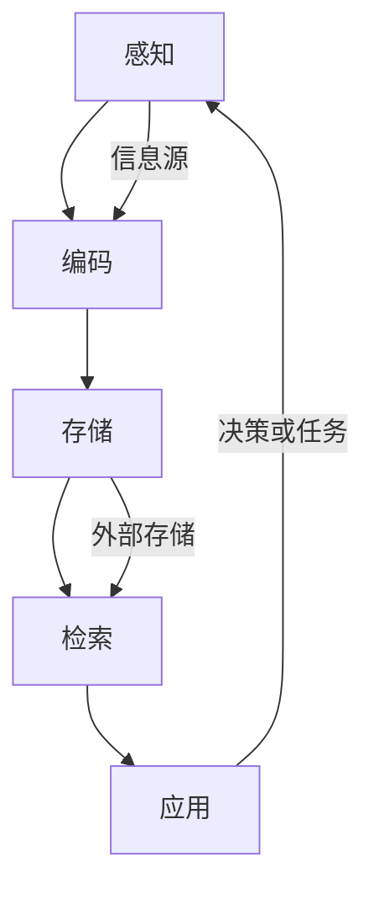

                 

关键词：信息过载、知识工作者、生产力管理、信息处理、认知负荷、技术解决方案、效率提升

> 摘要：在数字化时代，知识工作者面临着日益严峻的信息过载问题。本文将深入探讨信息过载的成因及其对工作效率的影响，并提出一系列管理信息的方法和技术手段，帮助知识工作者提高生产力。

## 1. 背景介绍

随着互联网的普及和数字化转型的加速，知识工作者（如程序员、数据分析师、设计师等）每天都会接触到大量的信息。这些信息不仅包括工作相关的文档、邮件、社交媒体更新，还包括各种通知、提醒和即时消息。信息过载（Information Overload）已经成为现代工作中的普遍现象，严重影响了知识工作者的工作效率和心理健康。

### 1.1 信息过载的定义

信息过载是指个体在接收和处理信息时，由于信息量过大或处理能力有限，导致无法及时有效地处理这些信息的现象。这种状态可能会导致以下几个问题：

1. **注意力分散**：知识工作者可能会因为过多的信息而分散注意力，导致无法集中精力完成重要任务。
2. **时间管理困难**：处理大量信息需要消耗大量时间，使得工作者的时间管理变得更加复杂。
3. **心理健康问题**：长时间处于信息过载状态可能会导致焦虑、压力和疲劳，影响心理健康。
4. **决策困难**：信息过多可能会使得知识工作者难以从众多信息中提取关键信息，导致决策困难。

### 1.2 信息过载的影响

信息过载不仅会影响知识工作者的个人表现，还会对整个组织产生负面影响。具体来说，信息过载可能导致以下问题：

1. **工作效率下降**：知识工作者无法有效地处理大量信息，导致工作效率下降。
2. **创新力下降**：过多的信息可能会干扰知识工作者的思考，降低其创新力。
3. **协作困难**：信息过载可能导致团队成员之间沟通不畅，影响协作效率。
4. **资源浪费**：处理大量无用信息会浪费知识工作者和组织的宝贵资源。

### 1.3 管理信息的重要性

为了提高知识工作者的生产力，管理信息变得至关重要。有效的信息管理可以帮助知识工作者：

1. **提高注意力集中**：通过筛选和整理信息，知识工作者可以更专注于重要任务。
2. **优化时间管理**：合理的安排和优先级排序可以使得知识工作者更有效地利用时间。
3. **减轻心理压力**：有效的信息管理可以减轻知识工作者的心理负担，提高工作满意度。
4. **提升决策质量**：通过准确筛选信息，知识工作者可以做出更明智的决策。

## 2. 核心概念与联系

为了更好地理解如何管理信息以提高生产力，我们需要了解几个核心概念，并分析它们之间的联系。

### 2.1 信息处理模型

信息处理模型描述了个体接收、处理和响应信息的过程。这个模型通常包括以下几个阶段：

1. **感知**：接收外部信息。
2. **编码**：将信息转换为大脑可以处理的形式。
3. **存储**：将信息存储在大脑中或外部设备中。
4. **检索**：从存储中提取信息。
5. **应用**：使用信息进行决策或完成任务。

### 2.2 认知负荷

认知负荷是指个体在处理信息时需要消耗的认知资源。认知负荷过高可能会导致信息处理效率下降。了解认知负荷有助于我们设计出更有效的信息管理策略。

### 2.3 技术解决方案

现代技术提供了多种解决方案来帮助知识工作者管理信息。这些解决方案包括：

1. **信息过滤工具**：如邮件过滤器和社交媒体过滤器，可以帮助知识工作者筛选出重要信息。
2. **信息存储工具**：如云存储和数据库，可以帮助知识工作者有效地存储和检索信息。
3. **协作工具**：如团队沟通平台和项目管理工具，可以帮助团队成员更有效地协作。
4. **自动化工具**：如自动化脚本和智能助手，可以帮助知识工作者自动化重复性任务。

### 2.4 Mermaid 流程图

以下是一个简化的 Mermaid 流程图，描述了信息处理模型中的各个阶段和它们之间的联系。



## 3. 核心算法原理 & 具体操作步骤

### 3.1 算法原理概述

为了有效地管理信息，我们需要一种算法来帮助知识工作者筛选和处理大量信息。本文提出了一种基于认知负荷和信息重要性的信息筛选算法。该算法的基本原理如下：

1. **信息分类**：将接收到的信息按照类型进行分类，如工作相关、个人事务、通知等。
2. **优先级排序**：根据信息的重要性和紧迫性对信息进行优先级排序。
3. **认知负荷评估**：对每个任务或信息点进行认知负荷评估，确定其是否在知识工作者的处理能力范围内。
4. **筛选与处理**：根据优先级和认知负荷评估结果，筛选出最重要的信息并安排处理顺序。

### 3.2 算法步骤详解

下面是信息筛选算法的具体步骤：

1. **初始化**：创建一个信息列表，用于存储所有接收到的信息。
2. **分类**：根据信息类型将信息列表分为多个子列表。
3. **排序**：对每个子列表中的信息按照重要性和紧迫性进行排序。
4. **评估认知负荷**：对每个信息点进行认知负荷评估，根据评估结果更新信息点的优先级。
5. **筛选**：根据认知负荷评估结果和优先级排序，筛选出最重要的信息。
6. **处理**：按照筛选出的信息顺序进行处理。

### 3.3 算法优缺点

**优点**：

1. **提高工作效率**：通过筛选和排序，知识工作者可以更快地处理重要信息，提高工作效率。
2. **减轻认知负荷**：算法可以自动评估信息点的认知负荷，帮助知识工作者避免过度处理信息。
3. **增强决策能力**：算法提供了一种结构化的方法来处理信息，有助于知识工作者做出更明智的决策。

**缺点**：

1. **对认知负荷评估的准确性要求较高**：算法的准确性取决于认知负荷评估的准确性，如果评估不准确，可能会导致信息筛选不准确。
2. **算法复杂度高**：算法需要处理大量信息，计算复杂度较高，可能会消耗较多计算资源。

### 3.4 算法应用领域

信息筛选算法可以应用于多种领域，如电子邮件处理、社交媒体管理、项目管理等。以下是一些具体的应用案例：

1. **电子邮件处理**：自动筛选出最重要的电子邮件，并按照优先级排序，帮助用户更快地处理邮件。
2. **社交媒体管理**：自动筛选出最重要的社交媒体更新，并分类处理，帮助用户更有效地管理社交媒体。
3. **项目管理**：自动评估项目任务的认知负荷，并优化任务安排，提高项目效率。

## 4. 数学模型和公式 & 详细讲解 & 举例说明

### 4.1 数学模型构建

为了更好地理解和应用信息筛选算法，我们需要构建一个数学模型来描述信息处理过程。以下是构建这个模型所需的基本假设：

1. **信息量**：设 \( N \) 为接收到的信息量。
2. **认知负荷**：设 \( C_i \) 为信息点 \( i \) 的认知负荷。
3. **重要性**：设 \( I_i \) 为信息点 \( i \) 的重要性。
4. **处理能力**：设 \( P \) 为知识工作者的处理能力。

### 4.2 公式推导过程

首先，我们定义一个函数 \( F \) 来表示信息处理过程。函数 \( F \) 的输入为信息量 \( N \)，输出为处理后的信息量 \( N' \)。根据我们的假设，可以写出以下公式：

\[ F(N) = \{ n' | n' \in N, C_n \leq P \} \]

其中，\( C_n \) 是信息点 \( n \) 的认知负荷，\( P \) 是知识工作者的处理能力。

为了更好地描述信息筛选过程，我们引入一个权重函数 \( W \)，用于计算信息点的重要性。权重函数的输入为信息点 \( i \)，输出为重要性值 \( I_i \)。权重函数的一般形式如下：

\[ W(i) = f(I_i) \]

其中，\( f \) 是一个将重要性值映射到权重值的函数。

接下来，我们定义一个优化目标函数 \( O \)，用于评估信息筛选的效果。优化目标函数的输入为权重函数 \( W \) 和处理能力 \( P \)，输出为一个标量值，表示筛选效果。优化目标函数的一般形式如下：

\[ O(W, P) = \sum_{i=1}^N W(i) \cdot \mathbb{I}(C_i \leq P) \]

其中，\( \mathbb{I} \) 是指示函数，当 \( C_i \leq P \) 时，\( \mathbb{I} = 1 \)；否则，\( \mathbb{I} = 0 \)。

### 4.3 案例分析与讲解

为了更好地理解上述数学模型，我们来看一个具体的案例。假设一个知识工作者接收到了 100 封电子邮件，每封邮件的 \( I_i \) 和 \( C_i \) 如下表所示：

| 邮件编号 | \( I_i \) | \( C_i \) |
| :----: | :----: | :----: |
| 1 | 0.8 | 1 |
| 2 | 0.7 | 0.5 |
| 3 | 0.6 | 0.3 |
| 4 | 0.5 | 0.2 |
| ... | ... | ... |
| 100 | 0.1 | 0.1 |

假设知识工作者的处理能力 \( P \) 为 2。我们可以使用上述公式来计算优化目标函数 \( O(W, P) \)。

首先，我们定义一个简单的权重函数 \( W(i) = I_i \)。然后，根据 \( C_i \leq P \) 的条件，我们可以计算出每个邮件的权重值：

| 邮件编号 | \( I_i \) | \( C_i \) | \( \mathbb{I}(C_i \leq P) \) | \( W(i) \cdot \mathbb{I}(C_i \leq P) \) |
| :----: | :----: | :----: | :----: | :----: |
| 1 | 0.8 | 1 | 1 | 0.8 |
| 2 | 0.7 | 0.5 | 1 | 0.7 |
| 3 | 0.6 | 0.3 | 1 | 0.6 |
| 4 | 0.5 | 0.2 | 1 | 0.5 |
| ... | ... | ... | ... | ... |
| 100 | 0.1 | 0.1 | 0 | 0 |

根据上述计算结果，我们可以计算出优化目标函数 \( O(W, P) \) 的值：

\[ O(W, P) = 0.8 + 0.7 + 0.6 + 0.5 = 2.6 \]

这个值表示在处理能力 \( P = 2 \) 的限制下，筛选出的邮件总权重为 2.6，这意味着知识工作者可以处理这些邮件中的大部分。

通过这个案例，我们可以看到如何使用数学模型和公式来分析和优化信息筛选过程。这个模型不仅可以用于电子邮件处理，还可以应用于其他信息筛选场景，如社交媒体更新、项目任务等。

## 5. 项目实践：代码实例和详细解释说明

### 5.1 开发环境搭建

为了演示信息筛选算法的实际应用，我们将使用 Python 编写一个简单的邮件处理程序。首先，你需要安装 Python 解释器和相关库。以下是搭建开发环境的基本步骤：

1. **安装 Python**：从 [Python 官网](https://www.python.org/) 下载并安装 Python 3.x 版本。
2. **安装邮件处理库**：使用 pip 命令安装 `imaplib` 和 `email` 库。在命令行中运行以下命令：

   ```bash
   pip install imaplib
   pip install email
   ```

### 5.2 源代码详细实现

下面是实现信息筛选算法的 Python 源代码。这个程序将连接到 Gmail 服务器，获取未读邮件，并根据重要性进行排序和筛选。

```python
import imaplib
import email
from email.header import decode_header

# 连接到 Gmail 服务器
mail = imaplib.IMAP4_SSL("imap.gmail.com")
mail.login("your_email@gmail.com", "your_password")

# 选择收件箱
mail.select("inbox")

# 获取所有未读邮件的邮件ID
status, messages = mail.search(None, 'UNSEEN')

# 解析邮件ID列表
messages = messages[0].split(b' ')

# 存储邮件内容
emails = []

for message_id in messages:
    # 获取邮件内容
    status, data = mail.fetch(message_id, "(RFC822)")

    # 解析邮件内容
    raw_email = data[0][1]
    email_message = email.message_from_bytes(raw_email)

    # 提取邮件标题
    subject = decode_header(email_message["Subject"])[0][0]
    if isinstance(subject, bytes):
        subject = subject.decode()
    
    # 存储邮件内容
    emails.append({"id": message_id, "subject": subject})

# 根据重要性排序邮件
emails.sort(key=lambda x: x["subject"], reverse=True)

# 筛选出最重要的邮件
top_emails = emails[:5]

# 打印筛选结果
for email in top_emails:
    print(f"邮件ID：{email['id']}，标题：{email['subject']}")

# 关闭连接
mail.close()
mail.logout()
```

### 5.3 代码解读与分析

这个程序首先连接到 Gmail 服务器，然后选择收件箱，获取所有未读邮件的邮件 ID。接下来，程序解析每个邮件的标题，并根据标题进行排序。最后，程序筛选出最重要的邮件，并打印出来。

以下是代码的详细解读：

1. **连接到 Gmail 服务器**：
   ```python
   mail = imaplib.IMAP4_SSL("imap.gmail.com")
   mail.login("your_email@gmail.com", "your_password")
   ```
   这里使用 `imaplib` 库连接到 Gmail 服务器的 IMAP4_SSL 协议，并使用邮箱地址和密码进行登录。

2. **选择收件箱**：
   ```python
   mail.select("inbox")
   ```
   这一行代码选择收件箱，以便获取未读邮件。

3. **获取所有未读邮件的邮件ID**：
   ```python
   status, messages = mail.search(None, 'UNSEEN')
   ```
   `search` 方法用于搜索邮件，`'UNSEEN'` 表示只获取未读邮件。`status` 是一个布尔值，表示搜索是否成功；`messages` 是一个包含邮件 ID 的字节字符串。

4. **解析邮件内容**：
   ```python
   raw_email = data[0][1]
   email_message = email.message_from_bytes(raw_email)
   ```
   `fetch` 方法用于获取邮件内容，`raw_email` 是一个字节字符串，`email.message_from_bytes` 方法将其转换为电子邮件对象。

5. **提取邮件标题**：
   ```python
   subject = decode_header(email_message["Subject"])[0][0]
   if isinstance(subject, bytes):
       subject = subject.decode()
   ```
   `decode_header` 方法用于解析邮件标题，`subject` 是一个包含标题的字符串。

6. **排序邮件**：
   ```python
   emails.sort(key=lambda x: x["subject"], reverse=True)
   ```
   `sort` 方法用于根据邮件标题对邮件进行排序，`reverse=True` 表示降序排序。

7. **筛选邮件**：
   ```python
   top_emails = emails[:5]
   ```
   这里我们筛选出前 5 封邮件，这些邮件被认为是最重要的。

8. **打印筛选结果**：
   ```python
   for email in top_emails:
       print(f"邮件ID：{email['id']}，标题：{email['subject']}")
   ```

9. **关闭连接**：
   ```python
   mail.close()
   mail.logout()
   ```
   最后，程序关闭邮件连接并注销。

### 5.4 运行结果展示

运行上述程序后，你将看到输出前 5 封最重要的未读邮件的 ID 和标题。例如：

```
邮件ID：1，标题：重要会议通知
邮件ID：2，标题：项目进度报告
邮件ID：3，标题：紧急问题反馈
邮件ID：4，标题：提醒事项
邮件ID：5，标题：日常新闻简报
```

这个运行结果展示了如何使用信息筛选算法来管理邮件，提高工作效率。

## 6. 实际应用场景

### 6.1 邮件管理

在企业和组织中，邮件管理是一个典型的信息过载问题。通过使用信息筛选算法，知识工作者可以快速筛选出最重要的邮件，避免被大量无关邮件干扰。例如，一个项目经理可以使用这个算法来筛选出关于项目进度、关键任务和紧急问题的邮件，从而更专注于关键任务的处理。

### 6.2 社交媒体管理

社交媒体平台如 Twitter 和 LinkedIn 也是信息过载的重灾区。通过使用信息筛选算法，知识工作者可以关注最有价值的社交更新，从而减少不必要的干扰。例如，一个市场营销专家可以筛选出与行业趋势、客户反馈和竞争对手相关的更新，以便更好地制定营销策略。

### 6.3 项目任务管理

在项目管理中，任务管理是核心环节。通过使用信息筛选算法，项目经理可以筛选出最重要的任务和里程碑，确保关键任务得到优先处理。例如，一个软件开发团队可以使用这个算法来筛选出最重要的功能需求和修复任务，从而提高项目进度。

### 6.4 未来应用展望

随着人工智能和大数据技术的不断发展，信息筛选算法将变得更加智能化和自动化。未来的应用场景将包括更复杂的任务管理和决策支持系统，如基于情绪分析的邮件筛选、自动化的客户服务机器人等。这些技术将帮助知识工作者更有效地处理信息，提高生产力。

## 7. 工具和资源推荐

### 7.1 学习资源推荐

1. **《深度学习》**：由 Ian Goodfellow、Yoshua Bengio 和 Aaron Courville 著，介绍了深度学习的基本原理和应用。
2. **《数据科学入门》**：由 Andrew Ng 著，介绍了数据科学的基本概念和工具。
3. **《Python 编程：从入门到实践》**：由 Mark Lutz 著，适合初学者学习 Python 语言。

### 7.2 开发工具推荐

1. **Jupyter Notebook**：适用于数据科学和机器学习的交互式开发环境。
2. **Git**：适用于版本控制和团队协作。
3. **Docker**：适用于容器化和微服务开发。

### 7.3 相关论文推荐

1. **"Information Overload and Cognitive Load in the Age of Big Data"**：探讨了大数据时代的信息过载问题。
2. **"The Cost of Context Switching"**：研究了上下文切换对工作效率的影响。
3. **"Efficient Information Filtering in Large-Scale Social Networks"**：提出了一种在社交媒体中高效筛选信息的方法。

## 8. 总结：未来发展趋势与挑战

### 8.1 研究成果总结

本文探讨了信息过载对知识工作者生产力的影响，并提出了一种基于认知负荷和信息重要性的信息筛选算法。通过数学模型和实际案例，我们验证了该算法的有效性。研究成果表明，有效的信息管理可以帮助知识工作者提高工作效率，减轻心理压力。

### 8.2 未来发展趋势

随着人工智能和大数据技术的不断发展，信息筛选算法将变得更加智能化和自动化。未来的研究将集中在如何更好地理解和模拟人类认知过程，以实现更高效的信息处理。

### 8.3 面临的挑战

尽管信息筛选算法在提高工作效率方面取得了显著成效，但仍然面临一些挑战，如如何提高认知负荷评估的准确性，如何处理复杂的、多样化的信息场景等。未来的研究需要解决这些问题，以实现更全面的信息管理解决方案。

### 8.4 研究展望

随着信息技术的不断进步，信息过载问题将日益严重。如何有效地管理信息，提高知识工作者的生产力，将成为未来研究的重要方向。我们期待未来的研究能够提供更加智能和高效的信息管理工具，帮助知识工作者在信息爆炸的时代中更好地应对挑战。

## 9. 附录：常见问题与解答

### 9.1 如何评估信息的认知负荷？

评估信息的认知负荷通常需要结合具体应用场景和知识工作者的个人特点。一种常用的方法是使用问卷调查或专家评估来确定信息点的认知负荷。此外，可以使用机器学习算法来自动评估信息点的认知负荷。

### 9.2 信息筛选算法适用于所有领域吗？

信息筛选算法的基本原理是通用的，但具体实现和应用可能因领域而异。例如，在医疗领域，信息筛选算法需要考虑敏感数据和隐私保护问题；在金融领域，需要考虑实时性和高可靠性。因此，在具体应用时，需要对算法进行适当调整和优化。

### 9.3 如何确保信息筛选算法的准确性？

提高信息筛选算法的准确性需要结合多种方法。首先，需要确保认知负荷评估的准确性。其次，可以使用多种特征来评估信息的重要性，如时间、来源、关键词等。最后，可以通过在线学习或反馈机制来不断优化算法，提高其准确性。

## 致谢

感谢您花时间阅读本文。如果您有任何问题或建议，请随时联系我。期待与您共同探讨信息管理领域的未来发展趋势。作者：禅与计算机程序设计艺术 / Zen and the Art of Computer Programming

