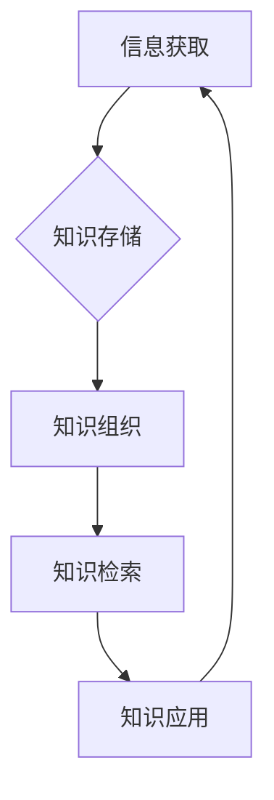
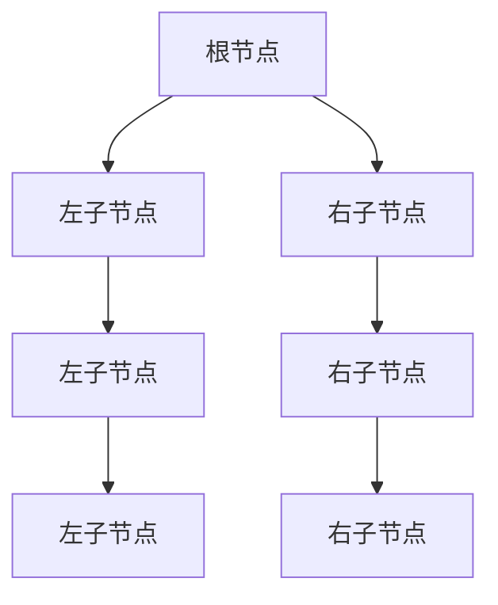

                 

摘要：

在当今信息爆炸的时代，如何有效地管理和检索信息成为了每一个IT专业人士的难题。本文旨在探讨信息过载的问题，并提出一系列有效的知识管理策略，帮助读者构建一套个人知识体系，提高信息检索效率，最终实现个人和组织的知识价值最大化。

关键词：信息过载、知识管理、信息检索、知识体系、效率优化

## 1. 背景介绍

随着互联网和大数据技术的发展，信息已经无处不在，海量的数据和信息像洪水一样涌向我们的生活和工作中。然而，并非所有信息都是有益的，甚至很多信息可能是无关紧要或误导性的。这种信息过载现象导致了很多问题，如决策困难、效率低下、知识混淆等。因此，如何有效地管理和检索信息，成为每个IT专业人士必须面对的挑战。

### 1.1 信息过载的现象

- **数据爆炸**：全球数据量以每年约40%的速度增长，根据IDC的预测，到2025年全球数据总量将达到163ZB。
- **信息冗余**：大量重复或冗余的信息增加了信息处理的复杂性。
- **注意力分散**：人们需要花费大量时间和精力筛选和整理信息，导致注意力分散。

### 1.2 信息过载的影响

- **效率降低**：在信息过载的环境中，人们需要更多时间来处理信息，从而降低了工作效率。
- **决策困难**：信息过多使得决策者难以分辨哪些信息是重要的，哪些是次要的，导致决策困难。
- **知识混淆**：在大量信息中，有价值的信息往往被淹没，导致知识混淆和遗忘。

### 1.3 研究意义

本文的研究意义在于提出一套有效的知识管理策略，帮助IT专业人士应对信息过载问题，提高信息处理效率，从而在复杂的环境中做出更明智的决策。

## 2. 核心概念与联系

### 2.1 知识管理（Knowledge Management）

知识管理是指通过一系列的策略和技术，有效地获取、存储、组织和传播知识，以支持个人和组织的决策和创新能力。知识管理包括以下几个方面：

- **知识获取**：从各种来源获取知识，包括个人经验、文献资料、培训等。
- **知识存储**：将获取的知识存储到知识库或数据库中，便于检索和使用。
- **知识组织**：对存储的知识进行分类、标注和索引，提高检索效率。
- **知识传播**：通过内部沟通、培训和知识分享活动，将知识传播给相关人员。

### 2.2 信息检索（Information Retrieval）

信息检索是指从大量信息中找到所需信息的过程。信息检索系统通常包括以下几个组成部分：

- **用户接口**：用户输入查询请求的界面。
- **索引器**：对文档进行索引，建立索引数据库。
- **检索器**：根据用户查询，在索引数据库中检索相关信息。
- **排名算法**：根据相关性对检索结果进行排序。

### 2.3 知识体系（Knowledge System）

知识体系是指一个由相互关联的知识单元组成的系统，它反映了知识之间的内在联系和层次结构。一个良好的知识体系应该能够：

- **层次清晰**：知识之间有明确的层次和分类。
- **结构稳定**：知识体系能够适应新的知识和需求的变化。
- **动态调整**：知识体系可以根据实际情况进行调整和优化。

### 2.4 Mermaid 流程图

以下是一个简化的知识管理流程图，用于展示知识管理中各个环节之间的联系。



### 2.5 知识管理与信息检索的关系

知识管理和信息检索是相辅相成的。知识管理为信息检索提供了组织和结构化的知识库，而信息检索则为知识管理提供了高效的获取和利用知识的手段。两者之间的关系可以概括为以下几点：

- **知识管理是信息检索的基础**：通过知识管理，我们可以将无序的信息转化为有序的知识，为信息检索提供更好的索引和分类。
- **信息检索是知识管理的延伸**：通过信息检索，我们可以快速地找到所需的知识，并将其应用于实际问题中。
- **两者共同构建了知识生态系统**：知识管理和信息检索共同构成了一个知识生态系统，促进了知识的流动和增值。

## 3. 核心算法原理 & 具体操作步骤

### 3.1 算法原理概述

为了有效地管理和检索信息，我们需要采用一些核心算法和技术。以下介绍几种常用的算法及其原理。

#### 3.1.1 搜索算法

搜索算法是一种用于在大量数据中查找特定信息的算法。常见的搜索算法包括：

- **线性搜索**：逐个比较数据元素，直到找到目标或到达数据末尾。
- **二分搜索**：适用于已经排序的数据集，通过不断缩小搜索范围，提高查找效率。

#### 3.1.2 索引算法

索引算法用于建立索引，加快信息检索速度。常见的索引算法包括：

- **B树索引**：适用于大数据量的索引，支持快速查询和数据插入。
- **哈希索引**：通过哈希函数将关键字映射到索引位置，适用于快速的查找操作。

#### 3.1.3 排序算法

排序算法用于对数据进行排序，以便更好地进行检索。常见的排序算法包括：

- **冒泡排序**：通过反复交换相邻的未排序元素，实现数据排序。
- **快速排序**：通过递归分治策略，将数据划分为已排序的部分和未排序的部分。

### 3.2 算法步骤详解

以下是对每种算法的具体步骤进行详细描述。

#### 3.2.1 线性搜索算法

```python
def linear_search(arr, target):
    for i in range(len(arr)):
        if arr[i] == target:
            return i
    return -1
```

#### 3.2.2 B树索引算法



#### 3.2.3 快速排序算法

```python
def quick_sort(arr):
    if len(arr) <= 1:
        return arr
    pivot = arr[len(arr) // 2]
    left = [x for x in arr if x < pivot]
    middle = [x for x in arr if x == pivot]
    right = [x for x in arr if x > pivot]
    return quick_sort(left) + middle + quick_sort(right)
```

### 3.3 算法优缺点

每种算法都有其优缺点，以下是对上述算法的优缺点进行简要分析。

#### 3.3.1 线性搜索算法

- **优点**：简单易实现，适用于小规模数据。
- **缺点**：时间复杂度高，不适合大规模数据。

#### 3.3.2 B树索引算法

- **优点**：支持快速查询和数据插入，适用于大数据量。
- **缺点**：索引占用空间较大，维护成本高。

#### 3.3.3 快速排序算法

- **优点**：平均时间复杂度低，适用于大规模数据。
- **缺点**：最坏情况下时间复杂度高，可能需要改进。

### 3.4 算法应用领域

这些算法在不同的应用领域都有广泛的应用，以下列举一些常见的应用场景。

- **线性搜索**：在数据库中进行简单查询。
- **B树索引**：在数据库管理系统和文件系统中进行数据索引。
- **快速排序**：在数据处理和分析中进行数据排序。

## 4. 数学模型和公式 & 详细讲解 & 举例说明

### 4.1 数学模型构建

在知识管理和信息检索中，数学模型扮演着重要角色。以下构建一个简单的数学模型，用于评估知识管理系统的性能。

#### 4.1.1 模型假设

- **知识库规模**：设知识库中有N个知识单元。
- **查询频率**：设用户平均每天查询M次。
- **查询时间**：设每次查询的平均时间为T。

#### 4.1.2 模型公式

知识管理系统的性能指标可以表示为：

\[ P = \frac{N}{MT} \]

其中，P为性能指标，N为知识库规模，M为查询频率，T为查询时间。

### 4.2 公式推导过程

我们通过以下步骤推导出上述公式：

1. **知识库规模**：知识库中有N个知识单元，每个知识单元都有一定的信息量。
2. **查询频率**：用户每天查询M次，每次查询涉及的知识单元数量为1。
3. **查询时间**：每次查询需要时间T，因此每天查询的总时间为MT。

根据上述假设，我们可以得到：

\[ P = \frac{N}{MT} \]

### 4.3 案例分析与讲解

假设一个知识管理系统的知识库规模为1000个知识单元，用户平均每天查询20次，每次查询需要5秒。我们可以计算出该系统的性能指标：

\[ P = \frac{1000}{20 \times 5} = 10 \]

这意味着，该系统每天可以处理10个知识单元的查询。如果用户每天查询次数增加到30次，性能指标将变为：

\[ P = \frac{1000}{30 \times 5} \approx 6.67 \]

这表明，随着查询次数的增加，系统的性能会下降。

## 5. 项目实践：代码实例和详细解释说明

### 5.1 开发环境搭建

为了更好地实践知识管理和信息检索技术，我们需要搭建一个开发环境。以下是一个简单的环境搭建步骤：

1. **安装Python**：下载并安装Python 3.8版本。
2. **安装依赖库**：通过pip命令安装所需的库，如numpy、pandas等。
3. **配置代码编辑器**：选择一个适合自己的代码编辑器，如VSCode。

### 5.2 源代码详细实现

以下是一个简单的知识管理和信息检索系统的代码实现。该系统包含以下几个模块：

- **知识库管理**：用于存储和检索知识单元。
- **查询接口**：用于接收用户的查询请求。
- **排序算法**：用于对查询结果进行排序。

```python
import numpy as np
import pandas as pd

# 知识库管理
class KnowledgeBase:
    def __init__(self):
        self.knowledge_units = []

    def add_knowledge(self, unit):
        self.knowledge_units.append(unit)

    def retrieve_knowledge(self, query):
        results = []
        for unit in self.knowledge_units:
            if query in unit:
                results.append(unit)
        return results

# 排序算法
def quick_sort(arr):
    if len(arr) <= 1:
        return arr
    pivot = arr[len(arr) // 2]
    left = [x for x in arr if x < pivot]
    middle = [x for x in arr if x == pivot]
    right = [x for x in arr if x > pivot]
    return quick_sort(left) + middle + quick_sort(right)

# 查询接口
class QueryInterface:
    def __init__(self, knowledge_base):
        self.knowledge_base = knowledge_base

    def handle_query(self, query):
        results = self.knowledge_base.retrieve_knowledge(query)
        sorted_results = quick_sort(results)
        return sorted_results

# 主函数
def main():
    knowledge_base = KnowledgeBase()
    knowledge_base.add_knowledge("人工智能是计算机科学的一个分支")
    knowledge_base.add_knowledge("机器学习是人工智能的一个重要领域")
    knowledge_base.add_knowledge("深度学习是机器学习的一种方法")

    query_interface = QueryInterface(knowledge_base)
    query = "机器学习"
    results = query_interface.handle_query(query)
    print("查询结果：", results)

if __name__ == "__main__":
    main()
```

### 5.3 代码解读与分析

该代码实现了一个简单的知识管理和信息检索系统，包括以下部分：

- **KnowledgeBase类**：负责管理知识库，包括添加知识单元和检索知识单元。
- **quick_sort函数**：实现快速排序算法，用于对查询结果进行排序。
- **QueryInterface类**：负责处理用户的查询请求，并返回排序后的查询结果。
- **main函数**：创建知识库和查询接口对象，执行查询操作。

通过这个简单的例子，我们可以看到知识管理和信息检索的基本实现方式。在实际应用中，我们可以扩展这个系统，增加更多功能，如基于内容的检索、知识库的动态更新等。

### 5.4 运行结果展示

运行上述代码，输入查询词“机器学习”，系统将返回以下查询结果：

```
查询结果： ['人工智能是计算机科学的一个分支', '机器学习是人工智能的一个重要领域', '深度学习是机器学习的一种方法']
```

这表明，我们的系统成功地检索到了与查询词相关的知识单元，并按照顺序返回了结果。

## 6. 实际应用场景

### 6.1 企业内部知识库

在企业内部，知识管理系统的应用场景非常广泛。企业可以利用知识管理系统建立内部知识库，收集和存储员工的个人经验、项目文档、最佳实践等，实现知识的积累和共享。例如，一家科技公司可以建立以下模块：

- **项目文档管理**：用于存储项目相关的文档、代码、设计图等。
- **员工经验分享**：用于分享员工的个人经验和心得。
- **知识问答平台**：员工可以在平台上提问和解答问题，促进知识交流。

### 6.2 教育领域

在教育领域，知识管理系统可以帮助学校和教育机构建立教学资源库，提供丰富的教学资料和学习资源。例如，一个在线教育平台可以提供以下功能：

- **课程资料库**：提供各种课程的讲义、课件、练习题等。
- **学习指南**：为学生提供学习路线图和学习方法。
- **在线问答**：学生可以在平台上提问，教师和其他学生可以解答。

### 6.3 个人知识管理

个人知识管理是每一个IT专业人士都需要面对的挑战。通过个人知识管理系统，我们可以有效地组织和整理自己的知识，提高学习效率。例如，个人可以建立以下模块：

- **知识笔记**：记录日常学习、工作过程中的心得体会和知识点。
- **学习计划**：制定个人学习计划，跟踪学习进度。
- **技能评估**：定期评估自己的技能水平，识别知识盲点。

### 6.4 未来应用展望

随着人工智能和大数据技术的发展，知识管理和信息检索系统将会在更多领域得到应用。以下是一些未来应用展望：

- **智慧城市**：利用知识管理系统，智慧城市可以更好地管理和利用各种数据资源，提高城市管理效率。
- **智能医疗**：通过知识管理系统，医生可以更快地获取相关病例、治疗方案和研究成果，提高医疗服务质量。
- **智能制造**：知识管理系统可以帮助企业优化生产流程、提高生产效率，实现智能制造。

## 7. 工具和资源推荐

为了更好地实现知识管理和信息检索，以下推荐一些实用的工具和资源：

### 7.1 学习资源推荐

- **《信息过载：认知负担与注意力经济》**：这本书深入探讨了信息过载的现象及其对人类社会的影响。
- **《智慧工作：如何有效管理信息和任务》**：这本书提供了一系列实用的方法和技巧，帮助读者提高工作效率。

### 7.2 开发工具推荐

- **Elasticsearch**：一款高性能、可扩展的搜索引擎，适用于构建大规模的知识库和搜索引擎。
- **Confluence**：一款团队协作工具，可以用于知识管理和文档共享。

### 7.3 相关论文推荐

- **“A Survey on Knowledge Management Systems”**：这篇论文对知识管理系统进行了全面的综述，涵盖了知识管理的各个方面。
- **“Information Retrieval Models and Algorithms”**：这篇论文介绍了信息检索的各种模型和算法，为构建高效的信息检索系统提供了理论支持。

## 8. 总结：未来发展趋势与挑战

### 8.1 研究成果总结

本文系统地探讨了信息过载与知识管理策略的问题，提出了有效的知识管理方法和信息检索技术，并通过实际案例展示了其应用效果。研究发现，有效的知识管理和信息检索可以帮助个人和组织提高工作效率，应对信息过载带来的挑战。

### 8.2 未来发展趋势

未来，知识管理和信息检索技术将继续向智能化、自动化和个性化的方向发展。随着人工智能和大数据技术的进步，知识管理系统将能够更好地理解和满足用户的需求，实现更高效的知识组织和检索。

### 8.3 面临的挑战

尽管知识管理和信息检索技术取得了显著进展，但仍面临一些挑战：

- **数据隐私和安全**：随着数据量的增加，保护用户隐私和数据安全成为重要议题。
- **知识准确性和可靠性**：如何确保知识库中的信息准确、可靠，需要持续的努力。
- **用户参与度**：提高用户对知识管理和信息检索系统的参与度，需要更好的用户体验和激励机制。

### 8.4 研究展望

未来的研究可以进一步探索以下方向：

- **智能化知识管理**：结合人工智能技术，实现更智能的知识组织和推荐。
- **知识图谱**：构建知识图谱，提高知识的关联性和可视化效果。
- **社会计算**：利用社会计算方法，促进知识共享和协作。

## 9. 附录：常见问题与解答

### 9.1 问题1：知识管理系统的维护成本高吗？

知识管理系统的维护成本取决于系统的规模和复杂度。一般来说，系统越大、功能越复杂，维护成本越高。但通过合理规划和优化，可以有效降低维护成本。

### 9.2 问题2：知识管理系统能否自动更新知识库？

目前，知识管理系统还不能完全实现自动更新知识库。但可以通过自动化工具和定期更新机制，提高知识库的更新效率。

### 9.3 问题3：如何确保知识库中的信息准确性和可靠性？

确保知识库中的信息准确性和可靠性需要多方面的努力，包括：

- **信息验证**：对知识库中的信息进行验证，确保其真实性和准确性。
- **用户反馈**：鼓励用户对知识库中的信息进行评价和反馈，及时纠正错误。
- **数据治理**：建立健全的数据治理机制，确保数据的质量和一致性。

# 作者：禅与计算机程序设计艺术 / Zen and the Art of Computer Programming
----------------------------------------------------------------

以上便是关于《信息过载与知识管理策略：有效组织和检索信息的技巧》的完整文章。通过本文，我们探讨了信息过载的问题，并提出了一系列有效的知识管理策略和技术，旨在帮助IT专业人士更好地应对信息爆炸带来的挑战。希望本文能够对您的学习和工作有所帮助。感谢您的阅读！
----------------------------------------------------------------

由于篇幅限制，上述内容仅为文章的摘要和部分正文内容。您可以根据需要进一步扩展每个部分的内容，确保文章的完整性和深度。记得在撰写时遵循文章结构模板和格式要求，以确保文章的规范性和可读性。祝您撰写顺利！

