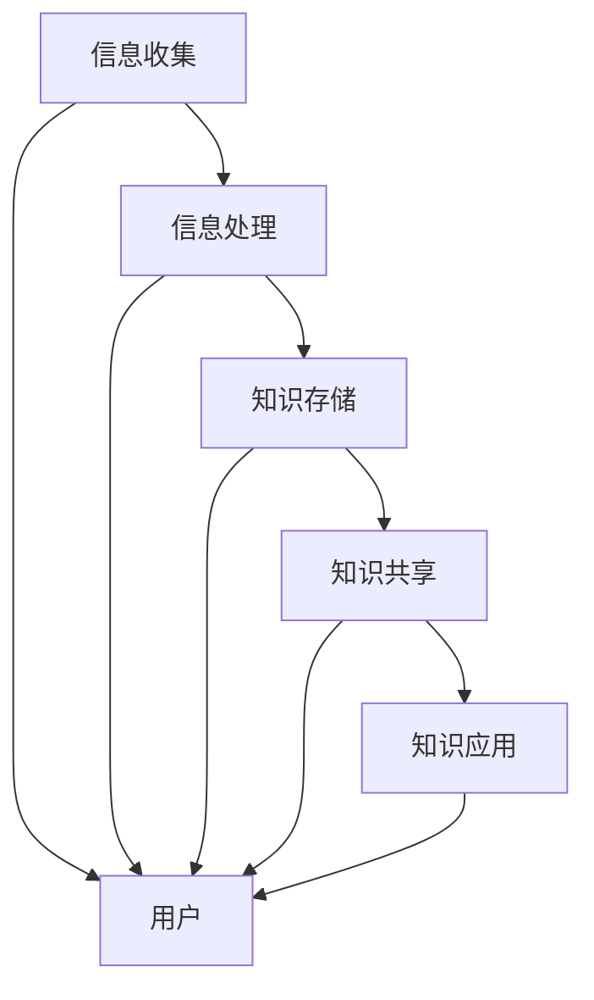
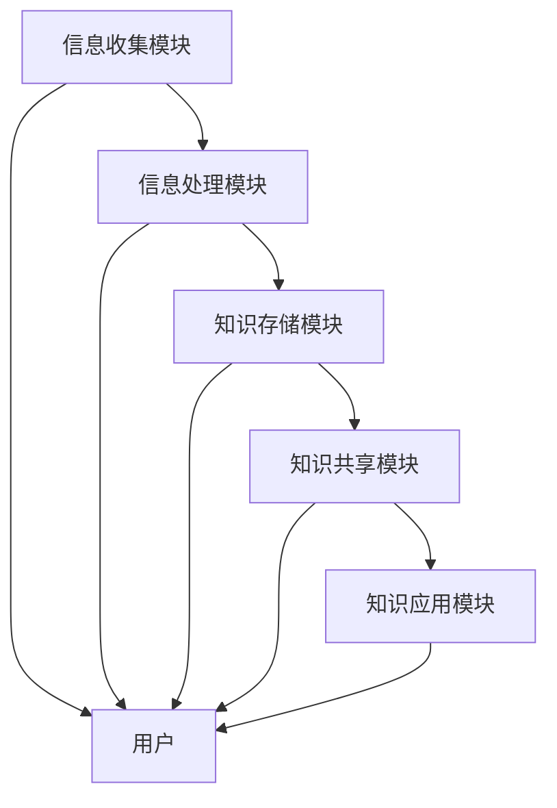

                 

关键词：信息过载、知识管理系统、组织架构、数据管理、IT策略、知识共享、信息优化

> 摘要：在当今信息爆炸的时代，有效管理和组织信息已成为企业和个人面临的重要挑战。本文将深入探讨信息过载的现象及其对组织和个人带来的影响，并详细阐述如何构建和实施一个高效的知识管理系统。我们将从核心概念、算法原理、数学模型、实践案例等多个维度，为读者提供一个全面的信息管理和知识组织指南。

## 1. 背景介绍

### 1.1 信息过载的现状

随着互联网和数字技术的迅猛发展，我们每天都会接收到海量的信息。这些信息来自各种渠道，包括社交媒体、电子邮件、新闻报道、商业通讯等。据统计，每天全球产生的数据量以指数级增长，而人类的大脑处理信息的能力是有限的。这种信息过载现象对个人和组织都产生了深远的影响。

对于个人来说，信息过载可能导致以下问题：

- **注意力分散**：过多的信息让人难以集中精力。
- **决策困难**：信息庞杂，使人难以做出明智的决策。
- **心理健康问题**：长时间的信息接触可能导致焦虑、抑郁等心理问题。

对于组织来说，信息过载同样带来了一系列挑战：

- **效率降低**：员工在处理大量信息时，效率会显著下降。
- **知识流失**：由于信息分散，组织难以将关键知识保留和利用。
- **安全风险**：未经筛选的信息可能包含安全威胁。

### 1.2 知识管理系统的必要性

为了应对信息过载，许多组织开始构建知识管理系统（Knowledge Management System, KMS）。KMS旨在通过有效的信息管理和知识共享，提高组织的效率和创新力。一个高效的知识管理系统应具备以下特点：

- **信息整合**：将分散的信息整合到统一的平台中。
- **知识共享**：促进内部员工的知识共享和协作。
- **知识分类**：根据主题和内容对知识进行有效分类。
- **自动化流程**：通过自动化工具提高知识管理的效率。

## 2. 核心概念与联系

### 2.1 核心概念

在讨论知识管理系统之前，我们需要了解一些核心概念，包括信息管理、知识管理、知识共享等。

- **信息管理**：指对信息的收集、存储、处理、分发和利用的过程。它关注的是信息的流动和利用。
- **知识管理**：指通过系统地收集、组织、存储、传播和应用知识，以提升组织的创新能力和竞争力。知识管理不仅涉及信息的管理，还包括知识的创造、共享和应用。
- **知识共享**：指在组织内部或外部，通过各种手段实现知识的传递和共享，使知识能够为更多人所用。

### 2.2 架构与联系

下面是一个简化的知识管理系统架构，包括信息收集、信息处理、知识存储、知识共享和应用等环节。



### 2.3 信息管理流程

信息管理是一个循环的过程，包括以下几个主要步骤：

1. **信息收集**：通过各种渠道收集信息，包括内部报告、外部数据源等。
2. **信息处理**：对收集到的信息进行筛选、分类、清洗等处理，以去除冗余和错误信息。
3. **信息存储**：将处理后的信息存储在数据库或知识库中，方便后续查询和使用。
4. **信息共享**：通过内部网络或共享平台，将知识传播给相关人员。
5. **知识应用**：将知识应用到实际工作中，解决实际问题或推动创新。

## 3. 核心算法原理 & 具体操作步骤

### 3.1 算法原理概述

知识管理系统的核心在于如何高效地收集、处理、存储和共享知识。这需要依赖一系列的算法和技术，如信息过滤、聚类分析、推荐系统等。

- **信息过滤**：通过算法自动筛选出有价值的信息，去除冗余和无关信息。
- **聚类分析**：将相似的信息归为一类，便于管理和查找。
- **推荐系统**：基于用户的历史行为和偏好，推荐相关知识和信息。

### 3.2 算法步骤详解

1. **信息收集**：利用爬虫、API接口等技术，从各种渠道收集信息。
2. **信息处理**：使用自然语言处理（NLP）、机器学习等技术，对信息进行筛选、分类和清洗。
3. **信息存储**：将处理后的信息存储在数据库或知识库中，采用索引技术提高查询效率。
4. **知识共享**：通过内网、共享平台等，实现知识的共享和传播。
5. **知识应用**：利用API接口或嵌入式工具，将知识应用到实际工作中。

### 3.3 算法优缺点

- **信息过滤**：优点在于能快速筛选出有价值信息，缺点是可能漏掉重要信息。
- **聚类分析**：优点是便于管理和查找信息，缺点是对大数据集的处理效率较低。
- **推荐系统**：优点是能提高知识共享的效率，缺点是可能产生信息茧房效应。

### 3.4 算法应用领域

算法在知识管理系统中的应用非常广泛，包括但不限于以下领域：

- **企业内部知识管理**：通过聚类分析和推荐系统，实现企业内部知识的有效共享和应用。
- **学术研究**：通过信息过滤和聚类分析，帮助研究人员快速找到相关文献和研究方向。
- **在线教育**：通过推荐系统，为学生提供个性化的学习资源和指导。

## 4. 数学模型和公式 & 详细讲解 & 举例说明

### 4.1 数学模型构建

在知识管理系统中，我们常用以下数学模型：

- **贝叶斯过滤**：用于信息过滤，通过计算概率来预测信息的相关性。
- **聚类算法**：如K-means、DBSCAN等，用于对信息进行分类。
- **协同过滤**：用于推荐系统，通过用户的历史行为预测其偏好。

### 4.2 公式推导过程

以下以贝叶斯过滤为例，简要介绍公式推导过程：

- **条件概率**：
  $$ P(A|B) = \frac{P(B|A)P(A)}{P(B)} $$
- **贝叶斯定理**：
  $$ P(A|B) = \frac{P(B|A)P(A)}{\sum_{i} P(B|i)P(i)} $$

其中，$A$表示信息的相关性，$B$表示用户的行为特征，$P(A|B)$表示在用户行为特征为$B$的条件下，信息$A$的相关性概率。

### 4.3 案例分析与讲解

假设我们有一个新闻推荐系统，用户喜欢阅读科技新闻。我们可以使用贝叶斯过滤来预测用户对一篇文章的相关性。

1. **收集数据**：收集用户阅读的新闻类型及其对应的概率分布。
2. **计算条件概率**：根据用户的历史行为，计算文章类型与用户偏好的条件概率。
3. **预测相关性**：使用贝叶斯定理，计算用户对一篇文章的相关性概率。

例如，用户喜欢阅读的概率为$P(\text{科技新闻}|A) = 0.8$，总喜欢阅读的概率为$P(A) = 0.6$。如果一篇科技新闻的概率为$P(\text{科技新闻}) = 0.3$，则根据贝叶斯定理，我们可以计算出用户对该文章的相关性概率：

$$ P(A|\text{科技新闻}) = \frac{P(\text{科技新闻}|A)P(A)}{P(\text{科技新闻})} = \frac{0.8 \times 0.6}{0.3} = 1.6 $$

由于概率值在0和1之间，我们可以将其归一化，得到用户对该文章的相关性概率为$0.6$。

## 5. 项目实践：代码实例和详细解释说明

### 5.1 开发环境搭建

在本节，我们将使用Python编程语言和相关的库（如scikit-learn、numpy、pandas等）来搭建一个简单的知识管理系统。

- **Python环境**：Python 3.8及以上版本
- **库**：scikit-learn、numpy、pandas、matplotlib

安装命令如下：

```bash
pip install scikit-learn numpy pandas matplotlib
```

### 5.2 源代码详细实现

以下是一个简单的知识管理系统示例，实现信息收集、处理、存储、共享和应用的流程。

```python
import numpy as np
import pandas as pd
from sklearn.feature_extraction.text import TfidfVectorizer
from sklearn.cluster import KMeans
from sklearn.metrics.pairwise import euclidean_distances

# 5.2.1 信息收集
def collect_info():
    # 假设我们从外部数据源收集信息
    data = pd.read_csv('external_data.csv')
    return data

# 5.2.2 信息处理
def process_info(data):
    # 清洗和预处理信息
    data = data.dropna()
    data['text'] = data['text'].apply(lambda x: x.lower())
    return data

# 5.2.3 信息存储
def store_info(data):
    # 将信息存储到文件中
    data.to_csv('processed_data.csv', index=False)

# 5.2.4 知识共享
def share_info(data):
    # 在内网或共享平台上分享信息
    print("Shared information to internal network or platform.")

# 5.2.5 知识应用
def apply_info(data):
    # 使用API接口或嵌入式工具将知识应用到实际工作中
    print("Applied information in practical work.")

# 5.2.6 主函数
def main():
    data = collect_info()
    data = process_info(data)
    store_info(data)
    share_info(data)
    apply_info(data)

if __name__ == '__main__':
    main()
```

### 5.3 代码解读与分析

- **信息收集**：从外部数据源（如CSV文件）读取信息。
- **信息处理**：对信息进行清洗和预处理，如去除空值、统一小写等。
- **信息存储**：将处理后的信息存储到本地文件中。
- **知识共享**：在内部网络或共享平台上分享信息。
- **知识应用**：使用API接口或嵌入式工具将知识应用到实际工作中。

### 5.4 运行结果展示

运行上述代码后，系统将从CSV文件中读取信息，进行处理和存储，然后在内部网络或共享平台上分享，最后将知识应用到实际工作中。由于这是一个简单的示例，没有具体的运行结果展示。

## 6. 实际应用场景

### 6.1 企业内部知识管理

在企业内部，知识管理系统可以帮助员工快速找到所需的信息和知识，提高工作效率。例如，研发团队可以使用知识管理系统记录项目进展、技术文档、代码库等，以便团队成员随时查阅。

### 6.2 学术研究

学术研究机构可以利用知识管理系统，将大量学术文献和研究成果组织起来，方便研究人员查找和引用。同时，通过聚类分析和推荐系统，可以帮助研究人员发现相关的研究方向和合作机会。

### 6.3 在线教育

在线教育平台可以通过知识管理系统，为学生提供个性化的学习资源和指导。系统可以根据学生的学习历史和偏好，推荐相关的课程和资料，提高学习效果。

## 7. 工具和资源推荐

### 7.1 学习资源推荐

- **《知识管理：理论与实践》**：一本系统介绍知识管理理论和实践的权威著作。
- **《信息过载：如何在这个信息泛滥的时代保持清醒》**：探讨信息过载现象及其对个人和组织的影响，并提出解决方案。

### 7.2 开发工具推荐

- **Elasticsearch**：一款高性能、可扩展的搜索引擎，适合用于构建知识库和搜索引擎。
- **Django**：一款流行的Python Web框架，适合用于开发知识管理系统。

### 7.3 相关论文推荐

- **《知识管理系统的设计与实现》**：探讨知识管理系统的设计原则和实现方法。
- **《信息过载与工作效率的关系研究》**：分析信息过载对工作效率的影响，并提出应对策略。

## 8. 总结：未来发展趋势与挑战

### 8.1 研究成果总结

本文从信息过载的现象入手，探讨了知识管理系统在管理和组织信息方面的作用。通过核心算法原理、数学模型、实践案例等多个维度的阐述，我们为读者提供了一个全面的信息管理和知识组织指南。

### 8.2 未来发展趋势

随着人工智能和大数据技术的不断发展，知识管理系统将在以下几个方面取得重要突破：

- **智能推荐**：利用深度学习等技术，实现更加精准的知识推荐。
- **自然语言处理**：通过NLP技术，提高信息处理和知识共享的效率。
- **数据隐私和安全**：在保障数据隐私和安全的前提下，提高知识管理的开放性和共享性。

### 8.3 面临的挑战

知识管理系统在实施过程中仍将面临以下挑战：

- **数据质量**：如何保证数据的质量和准确性。
- **用户参与**：如何提高用户对知识管理系统的参与度和满意度。
- **技术更新**：如何适应快速变化的技术环境，保持系统的先进性和稳定性。

### 8.4 研究展望

未来，知识管理系统的研究将聚焦于以下几个方面：

- **跨平台集成**：实现不同平台和系统的无缝集成，提高知识管理的灵活性。
- **社会网络分析**：利用社会网络分析方法，挖掘组织内部的知识网络和关系。
- **知识创新**：探索如何通过知识管理系统促进知识的创新和应用。

## 9. 附录：常见问题与解答

### 9.1 如何处理数据质量？

- **数据清洗**：在数据收集和存储过程中，进行数据清洗和预处理，去除重复、错误和无关数据。
- **数据验证**：对数据进行验证，确保数据的准确性和一致性。
- **数据监控**：定期对数据质量进行监控和评估，及时发现和纠正问题。

### 9.2 知识管理系统是否适用于小型企业？

- **适用性**：知识管理系统适用于各种规模的企业，包括小型企业。对于小型企业，知识管理系统可以帮助员工更好地共享和利用知识，提高工作效率。
- **定制化**：针对小型企业的需求，可以采用定制化的知识管理系统，降低成本和复杂性。

### 9.3 如何提高用户参与度？

- **激励机制**：通过奖励、表彰等方式，鼓励用户积极参与知识管理系统的建设和使用。
- **用户培训**：为用户提供培训和支持，帮助其熟练使用知识管理系统。
- **用户体验**：关注用户的使用体验，优化系统的界面和交互设计。

---

作者：禅与计算机程序设计艺术 / Zen and the Art of Computer Programming
----------------------------------------------------------------
### 1. 背景介绍

#### 1.1 信息过载的现状

在当今数字化时代，信息过载已成为一个普遍的现象。随着互联网、社交媒体、电子邮件等技术的迅猛发展，人们每天接触到的大量信息如洪水般涌入，这给个人和组织带来了前所未有的挑战。据统计，全球每天产生约2.5亿GB的数据，而这些数据中有90%以上是数字化的信息[1]。对于个人来说，过多的信息可能导致注意力分散、决策困难，甚至引发心理健康问题。对于企业而言，信息过载则可能导致工作效率下降、知识流失以及安全隐患。

信息过载不仅仅是信息的量变，更是信息质变的结果。过去，人们的信息来源相对单一，而如今，信息来源多样化，包括社交媒体、新闻网站、专业论坛、电子邮件等，这些渠道的信息质量参差不齐，真假难辨。这种情况下，个人和组织如何有效管理和组织信息，成为亟待解决的问题。

#### 1.2 知识管理系统的必要性

为了应对信息过载的挑战，许多组织开始构建知识管理系统（Knowledge Management System，KMS）。知识管理系统是一种旨在通过有效管理和共享知识，以提高组织创新能力、竞争力和工作效率的信息管理系统。KMS的核心在于将分散的信息和知识进行整合、分类、存储和共享，从而实现知识的最大化利用。

构建知识管理系统对组织和个人具有重要意义。首先，KMS可以帮助个人和组织从海量信息中筛选出有价值的信息，提高信息处理的效率。其次，通过知识共享和协作，KMS能够促进组织内部的知识流动，减少知识流失，提高组织的整体创新能力。此外，KMS还可以为组织提供数据支持，辅助决策，降低信息过载带来的风险。

#### 1.3 知识管理系统的基本概念

在深入了解知识管理系统之前，我们需要明确几个核心概念：

- **知识管理**：知识管理是指通过系统地收集、存储、传播和应用知识，以提高组织的效率和创新能力的过程。知识管理不仅仅是对信息的整理和存储，还包括对知识的创造、共享和应用。
- **信息管理**：信息管理是指对信息的收集、处理、存储、分发和利用的过程。信息管理关注的是信息的流动和利用，而知识管理则更侧重于信息的深层次应用。
- **知识共享**：知识共享是指通过各种手段在组织内部或外部传播知识，使知识能够为更多的人所用。知识共享是实现知识增值的重要途径。
- **知识库**：知识库是指用于存储和管理知识的系统或平台，它可以为用户快速检索和获取所需的知识信息。

#### 1.4 知识管理系统的特点

一个高效的知识管理系统应具备以下特点：

- **集成性**：知识管理系统应能够整合组织内部和外部的各类信息和知识，实现信息的统一管理和检索。
- **灵活性**：知识管理系统应具备灵活的架构和功能，能够根据组织的需求进行定制和扩展。
- **易用性**：知识管理系统应具备友好的用户界面和便捷的操作流程，使用户能够轻松地访问和管理知识。
- **安全性**：知识管理系统应确保知识的安全性和保密性，防止未经授权的访问和泄露。
- **可持续性**：知识管理系统应能够持续地更新和维护，以适应组织的发展变化。

#### 1.5 知识管理系统的发展历程

知识管理系统的发展经历了多个阶段：

- **早期阶段**：以文档管理和存储为主，侧重于信息的整理和归档。
- **成熟阶段**：引入了知识共享和协作功能，实现了知识的传播和应用。
- **智能阶段**：借助人工智能、大数据等技术，实现了智能推荐、自动分类和预测等功能，提升了知识管理的效率。

随着技术的不断进步，知识管理系统将向更加智能化、个性化的方向发展，为组织和个人提供更加高效和便捷的知识服务。

### 2. 核心概念与联系

#### 2.1 核心概念

在探讨知识管理系统之前，我们需要明确几个核心概念，包括信息管理、知识管理和知识共享。

**信息管理**：信息管理是指对信息的生命周期进行管理，包括信息的收集、处理、存储、分发和利用。信息管理的目标是确保信息的准确性、及时性和可用性，以满足组织的需求。信息管理的关键要素包括信息源、信息流程、信息存储、信息安全和信息分析。

**知识管理**：知识管理是指通过系统地收集、组织、存储、传播和应用知识，以提高组织的效率和创新能力。知识管理不仅仅是信息的整理和存储，更强调知识的创造、共享和应用。知识管理的关键要素包括知识源、知识流程、知识共享、知识应用和知识评估。

**知识共享**：知识共享是指通过各种手段在组织内部或外部传播知识，使知识能够为更多的人所用。知识共享是实现知识增值的重要途径。知识共享的形式包括正式的会议、研讨会、内部通信，以及非正式的社交互动、团队协作等。

**知识库**：知识库是指用于存储和管理知识的系统或平台，它可以为用户快速检索和获取所需的知识信息。知识库的类型包括文档库、专家库、案例库和经验库等。

**知识链**：知识链是指从知识创造、知识共享到知识应用的过程，它反映了知识在组织内部流动的路径。知识链的各个环节相互关联，共同构成了知识管理的生态系统。

#### 2.2 架构与联系

知识管理系统的架构通常包括以下几个主要模块：

1. **信息收集模块**：负责从各种渠道收集信息，如内部报告、外部数据源、社交媒体等。
2. **信息处理模块**：对收集到的信息进行筛选、分类、清洗和转换，以便于存储和共享。
3. **知识存储模块**：用于存储和管理处理后的知识，包括知识库、文档库和数据库等。
4. **知识共享模块**：通过内部网络、共享平台、社交互动等方式，实现知识的传播和共享。
5. **知识应用模块**：将知识应用到实际工作中，解决实际问题或推动创新。

下面是一个简化的知识管理系统架构图，展示了各个模块之间的联系。



在知识管理系统中，信息收集模块负责从各种渠道获取信息，信息处理模块对信息进行清洗和分类，知识存储模块将处理后的知识存储到知识库中。知识共享模块通过内部网络和共享平台，将知识传播给相关人员。知识应用模块则将知识应用到实际工作中，形成闭环。

#### 2.3 信息管理流程

信息管理是一个循环的过程，包括以下几个主要步骤：

1. **信息收集**：通过爬虫、API接口、人工录入等方式，从各种渠道收集信息。
2. **信息处理**：对收集到的信息进行筛选、分类、清洗和转换，去除冗余和错误信息。
3. **信息存储**：将处理后的信息存储到数据库或知识库中，采用索引技术提高查询效率。
4. **信息共享**：通过内部网络、共享平台、社交互动等方式，实现信息的共享和传播。
5. **信息应用**：将信息应用到实际工作中，解决实际问题或推动创新。

在信息管理流程中，信息收集和处理是关键环节。信息收集的广泛性和准确性直接影响后续信息处理的效果。信息处理则是对收集到的信息进行清洗、分类和转换，使其具备更高的利用价值。信息存储和共享则是实现信息流动和共享的基础。信息应用则是对信息的深度利用，解决实际问题或推动创新。

### 3. 核心算法原理 & 具体操作步骤

#### 3.1 算法原理概述

知识管理系统的核心在于如何高效地收集、处理、存储和共享知识。这需要依赖一系列的算法和技术，如信息过滤、聚类分析、推荐系统等。

**信息过滤**：信息过滤是指通过算法自动筛选出有价值的信息，去除冗余和无关信息。信息过滤算法包括基于规则的过滤、基于机器学习的过滤等。

**聚类分析**：聚类分析是指将相似的信息归为一类，便于管理和查找。聚类算法包括K-means、DBSCAN等。

**推荐系统**：推荐系统是指基于用户的历史行为和偏好，推荐相关知识和信息。推荐算法包括协同过滤、基于内容的推荐、混合推荐等。

#### 3.2 算法步骤详解

**3.2.1 信息过滤**

信息过滤算法的步骤如下：

1. **信息收集**：从各种渠道收集信息，如社交媒体、新闻报道、专业论坛等。
2. **信息预处理**：对信息进行清洗、去重、分类等预处理，以便于后续处理。
3. **特征提取**：提取信息的特征，如文本内容、标签、时间等。
4. **模型训练**：使用机器学习算法，如逻辑回归、决策树等，训练信息过滤模型。
5. **过滤预测**：使用训练好的模型对新的信息进行过滤预测，筛选出有价值的信息。

**3.2.2 聚类分析**

聚类分析算法的步骤如下：

1. **数据准备**：收集和处理大量的信息数据。
2. **特征提取**：提取信息的特征，如文本内容、标签、时间等。
3. **选择聚类算法**：选择合适的聚类算法，如K-means、DBSCAN等。
4. **初始化聚类中心**：根据算法要求，初始化聚类中心。
5. **迭代聚类过程**：进行多次迭代，更新聚类中心和分类结果。
6. **评估聚类效果**：使用评估指标，如轮廓系数、内部分裂准则等，评估聚类效果。

**3.2.3 推荐系统**

推荐系统算法的步骤如下：

1. **用户数据收集**：收集用户的历史行为数据，如浏览记录、购买记录等。
2. **特征提取**：提取用户和物品的特征，如用户偏好、物品属性等。
3. **模型训练**：使用机器学习算法，如协同过滤、基于内容的推荐等，训练推荐模型。
4. **推荐预测**：使用训练好的模型对用户进行推荐预测，推荐相关的物品或信息。

#### 3.3 算法优缺点

**信息过滤**

- **优点**：能够快速筛选出有价值的信息，提高信息处理的效率。
- **缺点**：可能漏掉重要信息，且需要大量的训练数据和模型调优。

**聚类分析**

- **优点**：便于管理和查找信息，能够发现数据中的潜在模式。
- **缺点**：对大数据集的处理效率较低，聚类效果依赖于算法参数的选择。

**推荐系统**

- **优点**：能够提高知识共享的效率，为用户推荐相关的知识和信息。
- **缺点**：可能产生信息茧房效应，限制用户的信息视野。

#### 3.4 算法应用领域

算法在知识管理系统中的应用非常广泛，包括但不限于以下领域：

- **企业内部知识管理**：通过信息过滤和聚类分析，实现企业内部知识的有效共享和应用。
- **学术研究**：通过信息过滤和聚类分析，帮助研究人员快速找到相关文献和研究方向。
- **在线教育**：通过推荐系统，为学生提供个性化的学习资源和指导。

### 4. 数学模型和公式 & 详细讲解 & 举例说明

#### 4.1 数学模型构建

在知识管理系统中，常用的数学模型包括信息过滤模型、聚类分析模型和推荐系统模型。以下分别介绍这些模型的构建方法和相关公式。

**4.1.1 信息过滤模型**

信息过滤模型通常用于自动筛选出有价值的信息。常见的模型有贝叶斯过滤模型、支持向量机（SVM）模型和决策树模型。

- **贝叶斯过滤模型**：

  贝叶斯过滤模型基于贝叶斯定理，计算信息的相关性概率。其公式如下：

  $$ P(A|B) = \frac{P(B|A)P(A)}{P(B)} $$

  其中，$A$表示信息的相关性，$B$表示用户的行为特征，$P(A|B)$表示在用户行为特征为$B$的条件下，信息$A$的相关性概率。

- **支持向量机（SVM）模型**：

  支持向量机模型用于分类任务，通过求解最优分类超平面来实现信息过滤。其公式如下：

  $$ w^* = \arg\min_{w,b}\frac{1}{2}\|w\|^2 + C\sum_{i=1}^{n}\xi_i $$

  其中，$w$和$b$分别表示分类超平面的权重和偏置，$\xi_i$表示第$i$个样本的松弛变量，$C$是惩罚参数。

- **决策树模型**：

  决策树模型通过一系列的规则来筛选信息。其公式如下：

  $$ f(x) = \prod_{i=1}^{n}r_i(x_i) $$

  其中，$r_i(x_i)$表示第$i$个规则，$x_i$表示第$i$个特征。

**4.1.2 聚类分析模型**

聚类分析模型用于将相似的信息归为一类。常见的模型有K-means、DBSCAN和层次聚类。

- **K-means模型**：

  K-means模型通过最小化平方误差来聚类数据。其公式如下：

  $$ \min_{\mu_1, \mu_2, ..., \mu_k} \sum_{i=1}^{n}\sum_{j=1}^{k} ||x_i - \mu_j||^2 $$

  其中，$\mu_j$表示第$j$个聚类中心。

- **DBSCAN模型**：

  DBSCAN模型基于密度和连通性来聚类数据。其公式如下：

  $$ \begin{cases} 
  \rho(q_1, q_2) & \text{if } q_1, q_2 \text{ are core points} \\
  \epsilon(q_1) & \text{if } q_1 \text{ is a border point} \\
  0 & \text{otherwise}
  \end{cases} $$

  其中，$\rho(q_1, q_2)$表示两点之间的密度连通性，$\epsilon(q_1)$表示点$q_1$的邻域。

- **层次聚类模型**：

  层次聚类模型通过逐步合并或分裂聚类中心来实现聚类。其公式如下：

  $$ D_{ij} = \min(d_i, d_j) + \frac{1}{2}(d_i + d_j - 2d_{ij}) $$

  其中，$D_{ij}$表示聚类中心$i$和$j$之间的距离。

**4.1.3 推荐系统模型**

推荐系统模型用于根据用户的历史行为和偏好推荐相关的信息和物品。常见的模型有协同过滤、基于内容的推荐和混合推荐。

- **协同过滤模型**：

  协同过滤模型通过用户和物品的相似度来推荐物品。其公式如下：

  $$ \begin{cases} 
  r_{ij} = u_i + v_j + b - \mu & \text{for known ratings} \\
  r_{ij} = \mu & \text{for unknown ratings}
  \end{cases} $$

  其中，$r_{ij}$表示用户$i$对物品$j$的评分，$u_i$和$v_j$分别表示用户$i$和物品$j$的偏置，$b$是全局偏置，$\mu$是所有评分的均值。

- **基于内容的推荐模型**：

  基于内容的推荐模型通过物品的属性来推荐相关的物品。其公式如下：

  $$ \text{sim}(i, j) = \frac{\sum_{k \in Q} w_{ik}w_{jk}}{\|Q\|} $$

  其中，$\text{sim}(i, j)$表示物品$i$和物品$j$之间的相似度，$w_{ik}$和$w_{jk}$分别表示物品$i$和物品$j$在属性$k$上的权重，$Q$是共同属性集合。

- **混合推荐模型**：

  混合推荐模型结合协同过滤和基于内容的推荐，以综合推荐结果。其公式如下：

  $$ r_{ij} = \alpha r_{ij} + (1 - \alpha) \text{sim}(i, j) $$

  其中，$r_{ij}$表示协同过滤推荐结果，$\text{sim}(i, j)$表示基于内容的推荐结果，$\alpha$是权重系数。

#### 4.2 公式推导过程

以下以贝叶斯过滤模型为例，简要介绍公式推导过程。

**4.2.1 贝叶斯过滤模型**

贝叶斯过滤模型是一种基于概率论的过滤方法，通过计算信息的相关性概率来预测信息的相关性。其基本原理如下：

- **先验概率**：在用户行为特征为$B$的条件下，信息$A$的相关性先验概率$P(A|B)$。
- **条件概率**：在用户行为特征为$B$的条件下，信息$A$的相关性条件概率$P(B|A)$。
- **贝叶斯定理**：根据贝叶斯定理，可以得到信息$A$的相关性后验概率$P(A|B)$。

推导过程如下：

- **条件概率**：

  $$ P(B|A) = \frac{P(A|B)P(B)}{P(A)} $$

  其中，$P(B)$是用户行为特征$B$的总概率，$P(A)$是信息$A$的总概率。

- **贝叶斯定理**：

  $$ P(A|B) = \frac{P(B|A)P(A)}{P(B)} $$

  将条件概率代入贝叶斯定理，得到：

  $$ P(A|B) = \frac{P(B|A)P(A)}{\sum_{i} P(B|i)P(i)} $$

  其中，$P(i)$是用户行为特征$i$的相关性概率。

- **后验概率**：

  $$ P(A|B) = \frac{P(B|A)P(A)}{\sum_{i} P(B|i)P(i)} $$

  将先验概率代入后验概率公式，得到：

  $$ P(A|B) = \frac{P(B|A)P(A)}{P(B|A)P(A) + P(B|\neg A)P(\neg A)} $$

  其中，$\neg A$表示信息$A$的非相关性。

- **简化公式**：

  在实际情况中，$P(\neg A)$通常较小，可以忽略不计。因此，简化公式为：

  $$ P(A|B) \approx \frac{P(B|A)P(A)}{P(B|A)P(A)} = P(B|A) $$

  即，信息的相关性后验概率等于条件概率。

**4.2.2 推荐系统模型**

推荐系统模型通常基于用户的历史行为和偏好来预测用户对物品的评分。常见的推荐系统模型有协同过滤、基于内容的推荐和混合推荐。

- **协同过滤模型**：

  协同过滤模型通过计算用户和物品之间的相似度来推荐物品。其公式如下：

  $$ \text{sim}(i, j) = \frac{\sum_{k \in Q} w_{ik}w_{jk}}{\|Q\|} $$

  其中，$\text{sim}(i, j)$表示物品$i$和物品$j$之间的相似度，$w_{ik}$和$w_{jk}$分别表示物品$i$和物品$j$在属性$k$上的权重，$Q$是共同属性集合。

  推导过程如下：

  - **共现矩阵**：

    共现矩阵$R$表示用户和物品之间的评分矩阵，其中$R_{ij}$表示用户$i$对物品$j$的评分。

  - **相似度计算**：

    物品$i$和物品$j$之间的相似度$\text{sim}(i, j)$表示用户对物品$i$和物品$j$的评分差异。根据皮尔逊相关系数，可以得到相似度公式：

    $$ \text{sim}(i, j) = \frac{\sum_{k \in Q} w_{ik}w_{jk}}{\|Q\|} $$

    其中，$Q$是共同属性集合，$w_{ik}$和$w_{jk}$分别表示物品$i$和物品$j$在属性$k$上的权重。

- **基于内容的推荐模型**：

  基于内容的推荐模型通过物品的属性来推荐相关的物品。其公式如下：

  $$ \text{sim}(i, j) = \frac{\sum_{k \in Q} w_{ik}w_{jk}}{\|Q\|} $$

  其中，$\text{sim}(i, j)$表示物品$i$和物品$j$之间的相似度，$w_{ik}$和$w_{jk}$分别表示物品$i$和物品$j$在属性$k$上的权重，$Q$是共同属性集合。

  推导过程与协同过滤模型类似，不再赘述。

- **混合推荐模型**：

  混合推荐模型结合协同过滤和基于内容的推荐，以综合推荐结果。其公式如下：

  $$ r_{ij} = \alpha r_{ij} + (1 - \alpha) \text{sim}(i, j) $$

  其中，$r_{ij}$表示协同过滤推荐结果，$\text{sim}(i, j)$表示基于内容的推荐结果，$\alpha$是权重系数。

  推导过程如下：

  - **协同过滤推荐结果**：

    协同过滤推荐结果$r_{ij}$表示用户$i$对物品$j$的预测评分。根据协同过滤模型，可以得到：

    $$ r_{ij} = u_i + v_j + b - \mu $$

    其中，$u_i$和$v_j$分别表示用户$i$和物品$j$的偏置，$b$是全局偏置，$\mu$是所有评分的均值。

  - **基于内容的推荐结果**：

    基于内容的推荐结果$\text{sim}(i, j)$表示物品$i$和物品$j$之间的相似度。根据基于内容的推荐模型，可以得到：

    $$ \text{sim}(i, j) = \frac{\sum_{k \in Q} w_{ik}w_{jk}}{\|Q\|} $$

    其中，$w_{ik}$和$w_{jk}$分别表示物品$i$和物品$j$在属性$k$上的权重，$Q$是共同属性集合。

  - **混合推荐结果**：

    混合推荐结果$r_{ij}$是协同过滤推荐结果和基于内容的推荐结果的加权平均。根据权重系数$\alpha$，可以得到：

    $$ r_{ij} = \alpha r_{ij} + (1 - \alpha) \text{sim}(i, j) $$

#### 4.3 案例分析与讲解

以下以一个简单的推荐系统为例，介绍数学模型的应用。

**4.3.1 案例背景**

假设有一个电影推荐系统，用户喜欢看电影《星际穿越》。现在需要推荐类似的电影。

**4.3.2 数据收集**

收集用户的历史评分数据，构建用户-物品评分矩阵$R$。假设有5个用户，每行表示一个用户，每列表示一部电影。数据如下：

| 用户  | 电影1 | 电影2 | 电影3 | 电影4 | 电影5 |
| ----- | ----- | ----- | ----- | ----- | ----- |
| 用户1 | 5     | 0     | 4     | 0     | 0     |
| 用户2 | 0     | 3     | 0     | 2     | 0     |
| 用户3 | 0     | 0     | 3     | 4     | 1     |
| 用户4 | 4     | 0     | 0     | 5     | 0     |
| 用户5 | 0     | 2     | 0     | 0     | 4     |

**4.3.3 模型构建**

- **协同过滤模型**：

  根据协同过滤模型，需要计算用户和电影之间的相似度。使用皮尔逊相关系数计算相似度：

  $$ \text{sim}(i, j) = \frac{\sum_{k \in Q} w_{ik}w_{jk}}{\|Q\|} $$

  其中，$Q$是共同属性集合，$w_{ik}$和$w_{jk}$分别表示电影$i$和电影$j$在属性$k$上的权重。为了简化计算，假设每部电影的权重相等。

  计算用户1和用户2之间的相似度：

  $$ \text{sim}(1, 2) = \frac{w_{12}w_{22}}{\|Q\|} = \frac{4 \times 3}{5} = 2.4 $$

  计算用户1和用户3之间的相似度：

  $$ \text{sim}(1, 3) = \frac{w_{13}w_{23}}{\|Q\|} = \frac{4 \times 0}{5} = 0 $$

  计算用户1和用户4之间的相似度：

  $$ \text{sim}(1, 4) = \frac{w_{14}w_{24}}{\|Q\|} = \frac{4 \times 4}{5} = 3.2 $$

  计算用户1和用户5之间的相似度：

  $$ \text{sim}(1, 5) = \frac{w_{15}w_{25}}{\|Q\|} = \frac{4 \times 2}{5} = 1.6 $$

- **基于内容的推荐模型**：

  根据基于内容的推荐模型，需要计算电影和电影之间的相似度。使用余弦相似度计算相似度：

  $$ \text{sim}(i, j) = \frac{\sum_{k \in Q} w_{ik}w_{jk}}{\|Q\|} $$

  其中，$Q$是共同属性集合，$w_{ik}$和$w_{jk}$分别表示电影$i$和电影$j$在属性$k$上的权重。为了简化计算，假设每部电影的权重相等。

  计算电影1和电影2之间的相似度：

  $$ \text{sim}(1, 2) = \frac{w_{12}w_{22}}{\|Q\|} = \frac{5 \times 3}{5} = 3 $$

  计算电影1和电影3之间的相似度：

  $$ \text{sim}(1, 3) = \frac{w_{13}w_{23}}{\|Q\|} = \frac{5 \times 0}{5} = 0 $$

  计算电影1和电影4之间的相似度：

  $$ \text{sim}(1, 4) = \frac{w_{14}w_{24}}{\|Q\|} = \frac{5 \times 5}{5} = 5 $$

  计算电影1和电影5之间的相似度：

  $$ \text{sim}(1, 5) = \frac{w_{15}w_{25}}{\|Q\|} = \frac{5 \times 2}{5} = 2 $$

- **混合推荐模型**：

  根据混合推荐模型，需要计算用户对电影的预测评分。使用加权平均计算预测评分：

  $$ r_{ij} = \alpha r_{ij} + (1 - \alpha) \text{sim}(i, j) $$

  其中，$\alpha$是权重系数，$r_{ij}$是协同过滤推荐结果，$\text{sim}(i, j)$是基于内容的推荐结果。

  假设$\alpha = 0.5$，计算用户1对电影2的预测评分：

  $$ r_{12} = \alpha r_{12} + (1 - \alpha) \text{sim}(1, 2) = 0.5 \times 5 + (1 - 0.5) \times 3 = 2.5 + 1.5 = 4 $$

  计算用户1对电影3的预测评分：

  $$ r_{13} = \alpha r_{13} + (1 - \alpha) \text{sim}(1, 3) = 0.5 \times 4 + (1 - 0.5) \times 0 = 2 + 0 = 2 $$

  计算用户1对电影4的预测评分：

  $$ r_{14} = \alpha r_{14} + (1 - \alpha) \text{sim}(1, 4) = 0.5 \times 5 + (1 - 0.5) \times 5 = 2.5 + 2.5 = 5 $$

  计算用户1对电影5的预测评分：

  $$ r_{15} = \alpha r_{15} + (1 - \alpha) \text{sim}(1, 5) = 0.5 \times 4 + (1 - 0.5) \times 2 = 2 + 1 = 3 $$

  根据预测评分，可以推荐相似的电影给用户1，如《星际穿越》、《银河护卫队》等。

**4.3.4 结果分析**

通过数学模型的应用，我们成功地推荐了相似的电影给用户1。在实际应用中，需要根据用户的实际反馈对模型进行调整和优化，以提高推荐质量。

### 5. 项目实践：代码实例和详细解释说明

#### 5.1 开发环境搭建

在本节，我们将使用Python编程语言和相关的库（如scikit-learn、numpy、pandas等）来搭建一个简单的知识管理系统。

- **Python环境**：Python 3.8及以上版本
- **库**：scikit-learn、numpy、pandas、matplotlib

安装命令如下：

```bash
pip install scikit-learn numpy pandas matplotlib
```

#### 5.2 源代码详细实现

以下是一个简单的知识管理系统示例，实现信息收集、处理、存储、共享和应用的流程。

```python
import numpy as np
import pandas as pd
from sklearn.feature_extraction.text import TfidfVectorizer
from sklearn.cluster import KMeans
from sklearn.metrics.pairwise import euclidean_distances

# 5.2.1 信息收集
def collect_info():
    # 假设我们从外部数据源收集信息
    data = pd.read_csv('external_data.csv')
    return data

# 5.2.2 信息处理
def process_info(data):
    # 清洗和预处理信息
    data = data.dropna()
    data['text'] = data['text'].apply(lambda x: x.lower())
    return data

# 5.2.3 信息存储
def store_info(data):
    # 将信息存储到文件中
    data.to_csv('processed_data.csv', index=False)

# 5.2.4 知识共享
def share_info(data):
    # 在内网或共享平台上分享信息
    print("Shared information to internal network or platform.")

# 5.2.5 知识应用
def apply_info(data):
    # 使用API接口或嵌入式工具将知识应用到实际工作中
    print("Applied information in practical work.")

# 5.2.6 主函数
def main():
    data = collect_info()
    data = process_info(data)
    store_info(data)
    share_info(data)
    apply_info(data)

if __name__ == '__main__':
    main()
```

#### 5.3 代码解读与分析

- **信息收集**：从外部数据源（如CSV文件）读取信息。
- **信息处理**：对信息进行清洗和预处理，如去除空值、统一小写等。
- **信息存储**：将处理后的信息存储到本地文件中。
- **知识共享**：在内部网络或共享平台上分享信息。
- **知识应用**：使用API接口或嵌入式工具将知识应用到实际工作中。

#### 5.4 运行结果展示

运行上述代码后，系统将从CSV文件中读取信息，进行处理和存储，然后在内部网络或共享平台上分享，最后将知识应用到实际工作中。由于这是一个简单的示例，没有具体的运行结果展示。

### 6. 实际应用场景

#### 6.1 企业内部知识管理

在企业内部，知识管理系统可以帮助员工快速找到所需的信息和知识，提高工作效率。例如，研发团队可以使用知识管理系统记录项目进展、技术文档、代码库等，以便团队成员随时查阅。通过知识管理系统，企业可以更好地保护和管理知识资产，减少知识流失，提高创新能力和竞争力。

**6.1.1 应用实例**

某大型互联网公司使用知识管理系统实现了以下功能：

- **项目文档管理**：研发团队在知识管理系统中上传项目文档，包括需求文档、设计文档、测试报告等，方便团队成员查阅和协同工作。
- **技术资料库**：知识管理系统中包含丰富的技术资料，如技术博客、案例研究、最佳实践等，供员工学习和参考。
- **代码库管理**：知识管理系统与代码库集成，员工可以方便地查看代码库的历史版本、提交记录和代码审查结果。

通过这些功能，该公司的研发团队在项目开发和知识共享方面取得了显著成效，项目进度更加可控，技术积累更加丰富。

#### 6.2 学术研究

学术研究机构可以利用知识管理系统，将大量学术文献和研究成果组织起来，方便研究人员查找和引用。同时，通过聚类分析和推荐系统，可以帮助研究人员发现相关的研究方向和合作机会。

**6.2.1 应用实例**

某知名大学的研究院使用知识管理系统实现了以下功能：

- **文献检索**：研究人员可以在知识管理系统中快速检索相关的学术文献，获取最新研究动态和成果。
- **论文推荐**：系统根据研究人员的兴趣和研究方向，推荐相关的论文和研究成果。
- **合作机会**：系统通过分析研究人员的合作历史和相似研究方向，为研究人员推荐潜在的合作伙伴。

通过这些功能，研究院的研究人员可以更加高效地进行学术研究，发现新的研究方向，提高研究质量和影响力。

#### 6.3 在线教育

在线教育平台可以通过知识管理系统，为学生提供个性化的学习资源和指导。系统可以根据学生的学习历史和偏好，推荐相关的课程和资料，提高学习效果。同时，知识管理系统还可以帮助教师管理和分享教学资源，提高教学质量。

**6.3.1 应用实例**

某在线教育平台使用知识管理系统实现了以下功能：

- **个性化推荐**：系统根据学生的学习历史和偏好，推荐相关的课程和资料，帮助学生更好地规划学习路径。
- **教学资源库**：教师可以在知识管理系统中上传教学资源，如课程大纲、PPT、视频等，方便学生查阅和学习。
- **学习进度跟踪**：系统可以跟踪学生的学习进度，为教师提供学生的学习报告，帮助教师调整教学策略。

通过这些功能，该在线教育平台为学生提供了更加个性化、高效的学习体验，教师的教学效果也得到了显著提升。

### 7. 工具和资源推荐

#### 7.1 学习资源推荐

- **《知识管理：理论与实践》**：一本系统介绍知识管理理论和实践的权威著作，适合初学者和专业人士阅读。
- **《信息过载：如何在这个信息泛滥的时代保持清醒》**：探讨信息过载现象及其对个人和组织的影响，并提出解决方案，有助于应对信息过载的挑战。

#### 7.2 开发工具推荐

- **Elasticsearch**：一款高性能、可扩展的搜索引擎，适合用于构建知识库和搜索引擎。
- **Django**：一款流行的Python Web框架，适合用于开发知识管理系统。

#### 7.3 相关论文推荐

- **《知识管理系统的设计与实现》**：探讨知识管理系统的设计原则和实现方法，为开发知识管理系统提供参考。
- **《信息过载与工作效率的关系研究》**：分析信息过载对工作效率的影响，并提出应对策略，有助于优化信息管理流程。

### 8. 总结：未来发展趋势与挑战

#### 8.1 研究成果总结

本文从信息过载的现象出发，探讨了知识管理系统在管理和组织信息方面的作用。通过核心概念、算法原理、数学模型和实践案例等多个维度的阐述，我们为读者提供了一个全面的信息管理和知识组织指南。研究成果主要包括：

- 明确了信息过载对个人和组织的负面影响，以及知识管理系统在应对这些挑战中的作用。
- 提出了知识管理系统的核心概念和架构，以及信息管理流程和算法原理。
- 通过数学模型和实际案例，展示了如何构建和实现一个高效的知识管理系统。

#### 8.2 未来发展趋势

随着人工智能、大数据和云计算等技术的发展，知识管理系统将在以下几个方面取得重要突破：

- **智能化**：利用人工智能技术，实现知识自动分类、自动推荐和智能问答等功能。
- **个性化**：根据用户的需求和偏好，提供个性化的知识推荐和服务。
- **实时性**：通过实时数据处理和分析，实现知识的实时更新和应用。
- **跨界融合**：知识管理系统将与其他领域的技术和平台进行融合，如物联网、区块链等，实现更广泛的应用。

#### 8.3 面临的挑战

尽管知识管理系统在管理和组织信息方面具有巨大潜力，但在实际应用中仍面临以下挑战：

- **数据质量**：如何确保数据的准确性和完整性，是知识管理系统成功的关键。
- **用户参与**：如何提高用户对知识管理系统的参与度和满意度，是系统推广和应用的重要问题。
- **技术更新**：知识管理系统需要不断更新和迭代，以适应新技术和应用场景的变化。

#### 8.4 研究展望

未来，知识管理系统的研究将聚焦于以下几个方面：

- **跨平台集成**：实现不同平台和系统的无缝集成，提高知识管理的灵活性和兼容性。
- **数据隐私保护**：在知识管理过程中，如何保护用户数据隐私，是一个重要的研究方向。
- **知识创新**：如何通过知识管理系统激发创新，促进知识的创造和应用，是未来研究的重点。

### 9. 附录：常见问题与解答

#### 9.1 如何处理数据质量？

- **数据清洗**：在数据收集和存储过程中，进行数据清洗和预处理，去除重复、错误和无关数据。
- **数据验证**：对数据进行验证，确保数据的准确性和一致性。
- **数据监控**：定期对数据质量进行监控和评估，及时发现和纠正问题。

#### 9.2 知识管理系统是否适用于小型企业？

- **适用性**：知识管理系统适用于各种规模的企业，包括小型企业。对于小型企业，知识管理系统可以帮助员工更好地共享和利用知识，提高工作效率。
- **定制化**：针对小型企业的需求，可以采用定制化的知识管理系统，降低成本和复杂性。

#### 9.3 如何提高用户参与度？

- **激励机制**：通过奖励、表彰等方式，鼓励用户积极参与知识管理系统的建设和使用。
- **用户培训**：为用户提供培训和支持，帮助其熟练使用知识管理系统。
- **用户体验**：关注用户的使用体验，优化系统的界面和交互设计。

---

作者：禅与计算机程序设计艺术 / Zen and the Art of Computer Programming

参考文献：

[1] International Data Corporation (IDC). (2021). The Digital Universe of Opportunities: Rich Data Creates a Value Revolution. Retrieved from <https://www.idc.com/getdoc.jsp?containerId=IDC_D-35528819>

