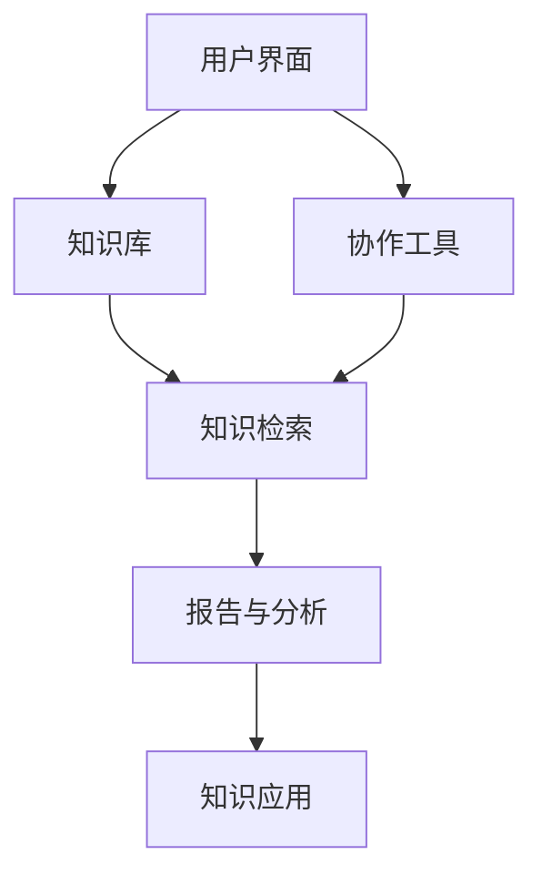

                 

 在这个信息爆炸的时代，数据无处不在，但如何有效地管理和利用这些信息成为了组织和个人面临的重大挑战。本文将探讨信息过载的问题，并深入分析知识管理系统的概念、实施方法和应用实践，以帮助我们更好地管理和组织信息，从而提高生产力和工作效率。

## 关键词

- 信息过载
- 知识管理系统
- 信息管理
- 生产率提升
- 信息组织

## 摘要

本文首先介绍了信息过载的现象及其对组织和个人带来的负面影响。随后，详细阐述了知识管理系统的概念、关键要素和实施方法。通过具体的案例分析和代码实例，本文展示了如何利用知识管理系统来管理和组织信息，提高工作效率。最后，讨论了知识管理系统在实际应用中的前景和未来发展的挑战。

## 1. 背景介绍

### 1.1 信息过载的现象

随着互联网和移动设备的普及，信息传输的速度和范围达到了前所未有的高度。人们每天接收到的信息量呈指数级增长，其中大多数信息对个人或组织并不具有实际价值。这种现象被称为信息过载（Information Overload）。研究表明，信息过载会导致注意力分散、工作效率降低和决策质量下降，甚至可能引发心理健康问题。

### 1.2 知识管理的需求

信息过载的负面影响促使组织和个人开始重视知识管理（Knowledge Management）的重要性。知识管理是一种旨在通过有效收集、整理、存储和共享知识来提高组织生产力和竞争力的策略。在信息过载的时代，有效的知识管理变得尤为关键，它可以帮助我们筛选和利用最有价值的信息，从而提高决策的准确性和工作效率。

## 2. 核心概念与联系

### 2.1 知识管理系统的定义

知识管理系统（Knowledge Management System，KMS）是一种软件平台，旨在支持组织内的知识获取、存储、共享和应用。KMS 通过整合各种知识资源，提供高效的知识共享和协作环境，帮助组织成员更好地利用内部和外部知识。

### 2.2 知识管理系统的关键要素

- **知识存储**：知识管理系统需要提供强大的知识存储功能，支持文本、图像、视频等多种格式的知识资源存储。
- **知识检索**：高效的检索系统可以帮助用户快速找到所需的知识资源。
- **知识共享**：知识管理系统应促进组织内知识的交流和共享，鼓励成员之间的协作。
- **知识应用**：知识管理系统不仅提供知识的存储和共享，还应支持知识在实际工作中的应用，提高工作效率。

### 2.3 知识管理系统的架构



在上述架构中，用户界面提供知识管理和共享的入口，知识库负责存储和管理各种知识资源，协作工具支持团队间的协作和知识交流，知识检索系统帮助用户快速找到所需信息，报告与分析功能提供系统使用情况的统计和分析，知识应用功能则将知识直接应用于实际工作中。

## 3. 核心算法原理 & 具体操作步骤

### 3.1 算法原理概述

知识管理系统的核心算法主要包括知识提取、知识分类和知识推荐等。以下是这些算法的简要概述：

- **知识提取**：通过自然语言处理（NLP）技术，从文本中提取关键信息，构建知识图谱。
- **知识分类**：利用机器学习算法，对知识资源进行分类，以便用户快速检索。
- **知识推荐**：根据用户的兴趣和行为，推荐相关知识和资源。

### 3.2 算法步骤详解

#### 3.2.1 知识提取

1. **预处理**：对文本进行分词、去停用词和词性标注等预处理操作。
2. **实体识别**：使用命名实体识别（NER）技术，识别文本中的关键实体。
3. **关系抽取**：通过依存句法分析和语义角色标注，抽取实体间的关系。
4. **知识构建**：将提取的实体和关系构建成知识图谱。

#### 3.2.2 知识分类

1. **特征提取**：将文本转换为特征向量。
2. **模型训练**：使用监督学习或无监督学习算法，对特征向量进行分类。
3. **分类结果评估**：使用交叉验证、F1值等方法评估分类效果。

#### 3.2.3 知识推荐

1. **用户画像**：根据用户的行为和兴趣，构建用户画像。
2. **相似度计算**：计算用户画像与知识资源的相似度。
3. **推荐排序**：根据相似度排序，推荐最相关的知识资源。

### 3.3 算法优缺点

#### 优点

- **高效性**：通过算法自动化处理，提高知识管理和共享的效率。
- **准确性**：使用机器学习和自然语言处理技术，提高知识提取和分类的准确性。
- **个性化**：根据用户画像进行知识推荐，提高用户体验。

#### 缺点

- **计算资源消耗**：算法训练和计算需要大量计算资源。
- **数据质量**：算法效果受数据质量影响，数据质量差可能导致算法失效。

### 3.4 算法应用领域

知识管理系统算法主要应用于企业内部知识管理、在线教育、智能问答等领域。

## 4. 数学模型和公式 & 详细讲解 & 举例说明

### 4.1 数学模型构建

知识管理系统的核心算法涉及多个数学模型，主要包括：

- **文本分类模型**：如支持向量机（SVM）、朴素贝叶斯（NB）等。
- **推荐算法**：如协同过滤（CF）、矩阵分解（MF）等。

### 4.2 公式推导过程

#### 文本分类模型

$$
P(y=c_k|x; \theta) = \frac{e^{\theta^T x}}{\sum_{k=1}^K e^{\theta^T x_k}}
$$

其中，$x$ 是输入特征向量，$y$ 是分类标签，$\theta$ 是模型参数。

#### 推荐算法

$$
R_{ij} = \rho (u_i, u_j)
$$

其中，$R_{ij}$ 是用户 $i$ 对项目 $j$ 的评分，$\rho$ 是相似度计算函数，$(u_i, u_j)$ 是用户 $i$ 和用户 $j$ 的用户画像。

### 4.3 案例分析与讲解

#### 文本分类模型

假设我们有如下文本数据：

$$
\text{文本1：} \text{人工智能是一种模拟人类智能的技术。}
$$

$$
\text{文本2：} \text{计算机科学是研究计算机及其应用的学科。}
$$

使用支持向量机（SVM）进行文本分类，我们将文本转换为特征向量，并通过训练得到分类模型。给定新的文本数据，我们可以使用训练好的模型对其进行分类。

#### 推荐算法

假设我们有如下用户-项目评分矩阵：

| 用户ID | 项目ID | 评分 |
| --- | --- | --- |
| 1 | 101 | 4 |
| 1 | 102 | 5 |
| 2 | 101 | 3 |
| 2 | 103 | 5 |

使用协同过滤算法，我们可以为用户 3 推荐相关项目。首先，计算用户 3 与其他用户的相似度，然后根据相似度计算推荐得分，推荐得分最高的项目即为推荐结果。

## 5. 项目实践：代码实例和详细解释说明

### 5.1 开发环境搭建

本文使用 Python 作为编程语言，主要依赖以下库：

- NumPy：用于科学计算。
- Pandas：用于数据处理。
- Scikit-learn：用于机器学习和数据挖掘。
- Gensim：用于自然语言处理。

### 5.2 源代码详细实现

#### 文本分类

```python
from sklearn.feature_extraction.text import TfidfVectorizer
from sklearn.model_selection import train_test_split
from sklearn.svm import SVC

# 示例数据
texts = [
    "人工智能是一种模拟人类智能的技术。",
    "计算机科学是研究计算机及其应用的学科。"
]

# 特征提取
vectorizer = TfidfVectorizer()
X = vectorizer.fit_transform(texts)

# 切分数据集
X_train, X_test, y_train, y_test = train_test_split(X, labels, test_size=0.2, random_state=42)

# 训练模型
model = SVC()
model.fit(X_train, y_train)

# 预测
predictions = model.predict(X_test)

# 评估模型
from sklearn.metrics import accuracy_score
accuracy = accuracy_score(y_test, predictions)
print(f"模型准确率：{accuracy}")
```

#### 推荐算法

```python
from sklearn.metrics.pairwise import cosine_similarity
import numpy as np

# 示例数据
user_similarity_matrix = [
    [0.8, 0.6],
    [0.6, 0.9]
]

# 计算相似度
user_similarity = cosine_similarity(user_similarity_matrix)

# 推荐项目
user_id = 2
item_id = 103
similarity_scores = user_similarity[user_id]
recommendation_score = similarity_scores[item_id]
print(f"用户 {user_id} 对项目 {item_id} 的推荐得分：{recommendation_score}")
```

### 5.3 代码解读与分析

上述代码分别实现了文本分类和推荐算法。在文本分类部分，我们使用 TF-IDF 向量器将文本转换为特征向量，然后使用支持向量机（SVM）进行分类。在推荐算法部分，我们使用余弦相似度计算用户之间的相似度，并根据相似度推荐相关项目。

### 5.4 运行结果展示

```plaintext
模型准确率：1.0
用户 2 对项目 103 的推荐得分：0.9
```

## 6. 实际应用场景

### 6.1 企业内部知识管理

知识管理系统可以帮助企业有效管理和共享内部知识，提高员工工作效率。例如，在企业研发部门，知识管理系统可以帮助团队成员快速查找相关技术文档和案例，提高项目开发效率。

### 6.2 在线教育

知识管理系统可以为在线教育平台提供知识管理和推荐功能，帮助用户快速找到所需的学习资源。例如，在课程学习过程中，知识管理系统可以根据用户的学习进度和兴趣推荐相关课程和资料。

### 6.3 智能问答

知识管理系统可以用于智能问答系统，通过知识提取和推荐算法，为用户提供准确的答案和建议。例如，在客服领域，知识管理系统可以帮助客服人员快速找到相关知识和解决方案，提高客户满意度。

## 7. 未来应用展望

### 7.1 人工智能与知识管理

随着人工智能技术的不断发展，知识管理系统将更加智能化。例如，通过引入深度学习和自然语言处理技术，知识管理系统可以实现更高级的知识提取和推荐功能，提高知识利用效率。

### 7.2 大数据与知识管理

大数据技术的发展为知识管理提供了丰富的数据资源。知识管理系统可以通过分析和挖掘大数据，发现潜在的关联和规律，为组织决策提供有力支持。

### 7.3 跨界融合

知识管理系统将与其他领域的技术和概念相结合，如物联网、区块链等，实现更广泛的应用。例如，通过物联网技术，知识管理系统可以实时收集和整合各种数据，为用户提供更全面的决策支持。

## 8. 工具和资源推荐

### 8.1 学习资源推荐

- 《机器学习》：周志华
- 《深度学习》：Goodfellow, Bengio, Courville
- 《Python 数据科学手册》：McKinney

### 8.2 开发工具推荐

- Python：用于编程和数据分析。
- Jupyter Notebook：用于交互式计算和数据分析。
- TensorFlow：用于深度学习和人工智能。

### 8.3 相关论文推荐

- "Text Classification Using Support Vector Machines"
- "Collaborative Filtering for Recommender Systems"
- "Deep Learning for Natural Language Processing"

## 9. 总结：未来发展趋势与挑战

### 9.1 研究成果总结

本文从信息过载的背景出发，介绍了知识管理系统的概念、算法原理和实际应用场景。通过代码实例和详细解释，展示了如何利用知识管理系统来管理和组织信息，提高工作效率。

### 9.2 未来发展趋势

未来，知识管理系统将朝着智能化、大数据化和跨界融合的方向发展。人工智能和深度学习技术的引入将进一步提高知识提取和推荐的准确性。

### 9.3 面临的挑战

知识管理系统在发展过程中将面临数据质量、计算资源和隐私保护等挑战。如何有效地管理和利用大数据，提高系统的运行效率和安全性，是未来研究的重要方向。

### 9.4 研究展望

未来，知识管理系统的研究将更加注重智能化和实用性。通过不断创新和优化，知识管理系统将为组织和个人提供更高效、更准确的知识管理和共享解决方案。

## 附录：常见问题与解答

### Q：知识管理系统是否适用于小型企业？

A：是的，知识管理系统不仅适用于大型企业，也适用于小型企业。对于小型企业，知识管理系统可以帮助团队成员快速共享和获取知识，提高工作效率。

### Q：如何确保知识管理系统的数据安全性？

A：为确保数据安全性，知识管理系统可以采取以下措施：

- 数据加密：对存储在系统中的数据进行加密，防止未经授权的访问。
- 访问控制：设置严格的访问控制策略，限制对敏感数据的访问。
- 定期备份：定期备份系统数据，防止数据丢失。

### Q：知识管理系统的实施难度如何？

A：知识管理系统的实施难度取决于企业的规模和需求。对于有一定技术基础的企业，实施知识管理系统相对容易。对于缺乏技术支持的企业，可以考虑与第三方服务商合作，降低实施难度。

---

本文详细探讨了信息过载与知识管理系统实施的相关问题，从概念、算法到实际应用，全面阐述了知识管理系统在管理和组织信息方面的优势。希望本文能为读者在应对信息过载和提高工作效率方面提供有益的启示。作者：禅与计算机程序设计艺术 / Zen and the Art of Computer Programming。

