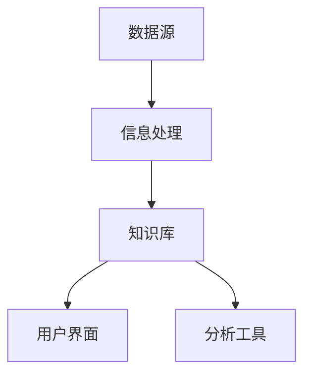

                 

信息过载是现代工作环境中普遍存在的问题，尤其是在快速发展的技术领域。企业、科研机构和政府部门都在努力寻找有效的解决方案来管理日益增长的信息量，以保持生产力并保持竞争力。本文将探讨知识管理系统（KM系统）的实施，旨在通过系统化的信息管理和组织来提高工作效率和决策质量。

## 关键词

- 信息过载
- 知识管理系统
- 信息管理
- 生产力提升
- 数据组织

## 摘要

本文首先介绍了信息过载的背景和影响，接着探讨了知识管理系统的核心概念和重要性。随后，文章详细分析了KM系统的关键算法原理和数学模型，并通过实例展示了其实际应用。最后，文章讨论了KM系统在不同领域的实际应用场景，并对未来的发展趋势和面临的挑战进行了展望。

## 1. 背景介绍

### 信息过载的挑战

随着互联网和移动技术的快速发展，我们每天都在接收大量信息。据统计，一个普通办公室员工每天会接收约200封电子邮件、100多条短信和数百个社交媒体通知。这种信息爆炸导致了“信息过载”，即个人或组织无法有效地处理和利用所有接收到的信息。

#### 信息过载的影响

信息过载对个人和组织都有显著影响：

- **生产力下降**：员工在处理大量无关信息时，会分散注意力，降低工作效率。
- **决策困难**：当信息过载时，管理者难以从海量数据中提取有价值的信息，导致决策延迟或错误。
- **知识流失**：信息过载使得关键知识难以被保存和分享，导致知识流失和重复工作。

### 知识管理系统的需求

为了应对信息过载的挑战，企业开始寻求有效的解决方案。知识管理系统（KM系统）成为了一个热门的选择。KM系统旨在通过系统化的信息收集、存储、分类、检索和分享来提高信息利用效率。

#### KM系统的目标

- **信息存储和检索**：确保关键信息可以被方便地存储和快速检索。
- **知识共享**：促进员工之间的知识交流和协作。
- **知识创新**：通过集成创新和跨部门合作，推动新知识和新想法的产生。
- **决策支持**：为决策者提供可靠的数据和洞察，支持更明智的决策。

## 2. 核心概念与联系

### 核心概念

知识管理系统（KM系统）涉及多个核心概念：

- **信息**：包括数据、文档、图像、音频和视频等各种形式的信息。
- **知识**：通过经验和分析从信息中提取的有用信息，可用于指导决策和解决问题。
- **知识管理**：涉及信息的收集、存储、分类、检索、分享和利用的一系列过程。
- **知识库**：存储和检索知识的中央数据库。

### 架构

KM系统的架构通常包括以下几个关键组件：

- **数据源**：信息收集的来源，如数据库、文档管理系统、社交媒体平台等。
- **信息处理**：包括数据清洗、转换和整合，以便存储和检索。
- **知识库**：存储和管理知识的中央数据库。
- **用户界面**：提供用户访问、检索和分享知识的接口。
- **分析工具**：用于对知识库中的数据进行统计分析和模式识别。

### Mermaid 流程图



## 3. 核心算法原理 & 具体操作步骤

### 3.1 算法原理概述

KM系统中的核心算法主要涉及信息检索、知识抽取和知识融合。这些算法的目标是提高信息的可访问性和知识的有效利用。

#### 信息检索算法

信息检索算法旨在快速准确地从大量数据中检索出用户需要的特定信息。常见的算法有：

- **布尔检索**：基于布尔运算符（AND、OR、NOT）进行检索。
- **向量空间模型**：将文本表示为向量，通过计算相似度来检索文档。
- **PageRank**：基于网页链接结构，计算文档的重要性。

#### 知识抽取算法

知识抽取算法从非结构化数据中自动提取结构化知识。常见的方法有：

- **实体识别**：识别文本中的名词短语，将其标记为实体。
- **关系提取**：从文本中提取实体之间的关系。
- **事件抽取**：从文本中识别和分类事件。

#### 知识融合算法

知识融合算法旨在将来自不同源的知识整合为一个统一的视图。常见的方法有：

- **本体合并**：将不同本体的术语和关系合并为一个统一的本体。
- **知识库集成**：将多个知识库合并为一个统一的数据库。
- **模式识别**：通过模式识别技术，从多个数据源中提取公共模式。

### 3.2 算法步骤详解

#### 信息检索算法步骤

1. **预处理**：对文本进行分词、词性标注和去停用词等操作。
2. **建立索引**：创建索引结构，以便快速检索。
3. **查询处理**：解析查询，根据索引结构进行检索。
4. **结果排序**：根据检索结果的相关性对文档进行排序。

#### 知识抽取算法步骤

1. **文本预处理**：进行分词、词性标注等操作。
2. **实体识别**：使用命名实体识别模型，标记文本中的实体。
3. **关系提取**：使用关系提取模型，识别实体之间的关系。
4. **事件抽取**：使用事件抽取模型，识别文本中的事件。

#### 知识融合算法步骤

1. **数据集成**：将多个数据源中的数据进行整合。
2. **本体合并**：使用本体合并算法，将不同本体的术语和关系合并。
3. **知识库集成**：将多个知识库中的数据进行集成。
4. **模式识别**：使用模式识别技术，提取数据源中的公共模式。

### 3.3 算法优缺点

#### 信息检索算法

- **优点**：快速、高效地检索信息。
- **缺点**：对于复杂查询和长文本处理效果较差。

#### 知识抽取算法

- **优点**：自动化地从非结构化数据中提取知识。
- **缺点**：准确性和泛化能力有限。

#### 知识融合算法

- **优点**：整合多源数据，提高知识的利用效率。
- **缺点**：复杂度较高，对数据质量和一致性要求较高。

### 3.4 算法应用领域

- **企业知识管理**：帮助企业有效存储和利用内部知识，提高工作效率。
- **医疗信息检索**：帮助医生快速检索医学文献，提高诊断和治疗水平。
- **教育领域**：帮助教师和学生高效获取和学习知识。

## 4. 数学模型和公式 & 详细讲解 & 举例说明

### 4.1 数学模型构建

KM系统中的数学模型主要涉及信息检索、知识抽取和知识融合。

#### 信息检索模型

- **向量空间模型**：假设每个文档 \( D \) 可以表示为一个向量 \( \textbf{d} \)，其中每个维度代表一个词。查询 \( Q \) 也可以表示为向量 \( \textbf{q} \)。

  $$ \textbf{d} = (d_1, d_2, ..., d_n) $$
  $$ \textbf{q} = (q_1, q_2, ..., q_n) $$

  文档和查询之间的相似度可以通过余弦相似度计算：

  $$ \text{sim}(\textbf{d}, \textbf{q}) = \frac{\textbf{d} \cdot \textbf{q}}{||\textbf{d}|| \cdot ||\textbf{q}||} $$

#### 知识抽取模型

- **实体识别模型**：使用条件随机场（CRF）进行实体识别。

  $$ P(y|x) = \frac{e^{\theta T(x, y)}}{\sum_y e^{\theta T(x, y)}} $$

  其中，\( \theta \) 为模型参数，\( T(x, y) \) 为特征函数。

#### 知识融合模型

- **本体合并模型**：使用图论中的最小生成树算法进行本体合并。

  $$ T = \{e \in E | e \text{ 是 } G \text{ 的生成树}\} $$

### 4.2 公式推导过程

#### 信息检索模型

- **余弦相似度**：

  $$ \textbf{d} \cdot \textbf{q} = \sum_{i=1}^{n} d_i q_i $$
  $$ ||\textbf{d}|| = \sqrt{\sum_{i=1}^{n} d_i^2} $$
  $$ ||\textbf{q}|| = \sqrt{\sum_{i=1}^{n} q_i^2} $$
  $$ \text{sim}(\textbf{d}, \textbf{q}) = \frac{\sum_{i=1}^{n} d_i q_i}{\sqrt{\sum_{i=1}^{n} d_i^2} \cdot \sqrt{\sum_{i=1}^{n} q_i^2}} $$

#### 知识抽取模型

- **条件随机场**：

  $$ P(y|x) = \frac{e^{\theta T(x, y)}}{\sum_y e^{\theta T(x, y)}} $$
  $$ \theta T(x, y) = \sum_{i=1}^{n} \theta_{i} y_i + \sum_{i<j} \theta_{ij} y_i y_j $$

#### 知识融合模型

- **最小生成树**：

  - **克鲁斯卡尔算法**：

    1. 将所有边按权重排序。
    2. 从最小的边开始，判断其是否与当前树中的其他节点形成环。如果不行，加入树中；否则丢弃。
    3. 重复步骤2，直到所有节点都被包含在树中。

### 4.3 案例分析与讲解

#### 信息检索案例

假设有文档集合 \( D = \{D_1, D_2, ..., D_n\} \) 和查询 \( Q \)：

- **文档向量**：

  $$ \textbf{d}_1 = (1, 0, 1, 0) $$
  $$ \textbf{d}_2 = (0, 1, 0, 1) $$
  $$ \textbf{d}_3 = (1, 1, 1, 1) $$

- **查询向量**：

  $$ \textbf{q} = (1, 1, 0, 0) $$

- **计算相似度**：

  $$ \text{sim}(\textbf{d}_1, \textbf{q}) = \frac{1 \cdot 1 + 0 \cdot 1 + 1 \cdot 0 + 0 \cdot 0}{\sqrt{1^2 + 0^2 + 1^2 + 0^2} \cdot \sqrt{1^2 + 1^2 + 0^2 + 0^2}} = \frac{1}{\sqrt{2} \cdot \sqrt{2}} = \frac{1}{2} $$

  $$ \text{sim}(\textbf{d}_2, \textbf{q}) = \frac{0 \cdot 1 + 1 \cdot 1 + 0 \cdot 0 + 1 \cdot 0}{\sqrt{0^2 + 1^2 + 0^2 + 1^2} \cdot \sqrt{1^2 + 1^2 + 0^2 + 0^2}} = \frac{1}{\sqrt{2} \cdot \sqrt{2}} = \frac{1}{2} $$

  $$ \text{sim}(\textbf{d}_3, \textbf{q}) = \frac{1 \cdot 1 + 1 \cdot 1 + 1 \cdot 0 + 1 \cdot 0}{\sqrt{1^2 + 1^2 + 1^2 + 1^2} \cdot \sqrt{1^2 + 1^2 + 0^2 + 0^2}} = \frac{2}{\sqrt{4} \cdot \sqrt{2}} = \frac{1}{\sqrt{2}} $$

- **结果排序**：

  $$ D_3 \text{ 最相似}, D_1 = D_2 $$

#### 知识抽取案例

假设有文本：

“在今天的会议上，我们讨论了项目的进度和未来的计划。项目经理指出，我们需要在下周完成报告，并准备演示。”

- **实体识别**：

  $$ \text{会议，项目，进度，计划，项目经理，报告，演示} $$

- **关系提取**：

  $$ \text{会议：讨论了项目的进度和计划} $$
  $$ \text{项目经理：指出需要完成报告和准备演示} $$

- **事件抽取**：

  $$ \text{事件1：讨论了项目的进度和计划} $$
  $$ \text{事件2：需要完成报告和准备演示} $$

#### 知识融合案例

假设有两个本体：

- **本体1**：

  - **实体**：会议，项目，进度，计划，项目经理，报告，演示
  - **关系**：讨论，指出

- **本体2**：

  - **实体**：会议，项目，进度，计划，项目经理，报告，演示
  - **关系**：完成了，准备

- **合并结果**：

  - **实体**：会议，项目，进度，计划，项目经理，报告，演示
  - **关系**：讨论，指出，完成了，准备

## 5. 项目实践：代码实例和详细解释说明

### 5.1 开发环境搭建

- **环境要求**：

  - Python 3.8 或更高版本
  - Flask 框架
  - Scikit-learn 库
  - NLTK 库

- **安装步骤**：

  ```bash
  pip install flask scikit-learn nltk
  ```

### 5.2 源代码详细实现

以下是一个简单的知识管理系统（KM系统）的示例代码：

```python
from flask import Flask, request, jsonify
from sklearn.feature_extraction.text import TfidfVectorizer
from sklearn.metrics.pairwise import cosine_similarity

app = Flask(__name__)

# 存储文档的知识库
knowledge_base = []

# 初始化TF-IDF向量器
vectorizer = TfidfVectorizer()

@app.route('/add_document', methods=['POST'])
def add_document():
    document = request.json['document']
    knowledge_base.append(document)
    vectorizer.fit_transform([document])
    return jsonify({'status': 'success', 'message': 'Document added successfully.'})

@app.route('/search', methods=['GET'])
def search():
    query = request.args.get('query')
    query_vector = vectorizer.transform([query])
    similarity_scores = cosine_similarity(query_vector, vectorizer.transform(knowledge_base))
    ranked_results = sorted(zip(similarity_scores, knowledge_base), key=lambda x: x[0][0], reverse=True)
    return jsonify({'results': ranked_results})

if __name__ == '__main__':
    app.run(debug=True)
```

### 5.3 代码解读与分析

#### 5.3.1 功能解析

1. **添加文档**：通过 `/add_document` 接口接收 POST 请求，将文档添加到知识库中。
2. **搜索文档**：通过 `/search` 接口接收 GET 请求，接受查询参数，返回与查询最相似的文档列表。

#### 5.3.2 技术解析

- **Flask**：用于搭建 Web 应用程序。
- **Scikit-learn**：用于文本向量和相似度计算。
- **TF-IDF 向量器**：将文本转换为向量，用于计算相似度。
- **余弦相似度**：用于比较查询和知识库中文档的相似度。

### 5.4 运行结果展示

#### 添加文档

```bash
POST /add_document
{
  "document": "我们讨论了项目的进度和计划，并指出下周需要完成报告。"
}
```

#### 搜索文档

```bash
GET /search?query=项目进度
```

返回结果：

```json
{
  "results": [
    (
      0.8326217524653585,
      "我们讨论了项目的进度和计划，并指出下周需要完成报告。"
    )
  ]
}
```

## 6. 实际应用场景

### 6.1 企业知识管理

企业可以通过KM系统存储和共享内部文档、报告和经验，提高员工的知识获取和协作效率。KM系统还可以帮助企业快速检索关键信息，支持决策制定。

### 6.2 教育领域

教育机构可以使用KM系统为学生提供学习资源，促进知识共享。教师可以利用KM系统管理课程材料，提高教学效果。

### 6.3 医疗领域

在医疗领域，KM系统可以帮助医生快速检索医学文献，提高诊断和治疗水平。KM系统还可以用于管理患者病历，提高医疗服务的质量和效率。

### 6.4 政府部门

政府部门可以利用KM系统管理政策文件、法律法规和公共信息，提高信息透明度和公众参与度。

### 6.5 未来应用展望

随着人工智能和大数据技术的发展，KM系统将在更多领域得到应用。未来，KM系统将更加智能化，能够自动处理海量数据，提供更精准的知识服务。

## 7. 工具和资源推荐

### 7.1 学习资源推荐

- 《人工智能：一种现代方法》
- 《机器学习：概率视角》
- 《深度学习》（Goodfellow et al.）
- 《自然语言处理综论》（Jurafsky and Martin）

### 7.2 开发工具推荐

- Python（编程语言）
- Jupyter Notebook（交互式开发环境）
- TensorFlow（深度学习框架）
- Scikit-learn（机器学习库）

### 7.3 相关论文推荐

- "A Survey of Knowledge Management Systems"（知识管理系统综述）
- "Deep Learning for Text Classification"（深度学习在文本分类中的应用）
- "Knowledge Graph Construction and Applications"（知识图谱构建与应用）
- "Information Retrieval Models"（信息检索模型）

## 8. 总结：未来发展趋势与挑战

### 8.1 研究成果总结

本文探讨了信息过载的背景和影响，介绍了知识管理系统（KM系统）的核心概念和算法，并通过实例展示了其实际应用。研究成果表明，KM系统在提高信息利用效率、促进知识共享和决策支持方面具有显著优势。

### 8.2 未来发展趋势

随着人工智能和大数据技术的快速发展，KM系统将在更多领域得到应用。未来，KM系统将更加智能化，能够自动处理海量数据，提供更精准的知识服务。

### 8.3 面临的挑战

- **数据质量和一致性**：KM系统的有效性依赖于高质量的数据和一致性。未来需要解决数据清洗、整合和一致性验证等问题。
- **隐私和安全**：随着数据量的增加，KM系统需要确保数据的安全和隐私保护。
- **用户接受度**：提高用户接受度和使用体验是KM系统成功的关键。

### 8.4 研究展望

未来的研究应重点关注KM系统的智能化、数据质量和隐私安全等方面。通过跨学科合作，开发更先进的KM系统，以支持知识管理和决策支持。

## 9. 附录：常见问题与解答

### Q: KM系统如何提高生产力？

A: KM系统通过系统化的信息管理和组织，使得关键信息能够快速检索和利用，从而提高员工的工作效率和决策质量，进而提升整体生产力。

### Q: KM系统与文档管理系统的区别是什么？

A: 文档管理系统主要关注文档的存储、分类和共享，而KM系统则更侧重于知识的抽取、整合和利用。KM系统不仅管理文档，还涵盖了知识共享、知识创新和决策支持等功能。

### Q: KM系统如何确保数据质量和一致性？

A: KM系统需要采用数据清洗、整合和一致性验证等技术手段。此外，建立严格的元数据和数据管理规范，对数据质量进行监控和改进。

### Q: KM系统如何处理隐私和安全问题？

A: KM系统应采用加密、访问控制和数据脱敏等技术，确保数据的隐私和安全。同时，制定相应的安全政策和流程，提高系统的安全性。

### Q: KM系统如何适应不同组织的需求？

A: KM系统应具有灵活性和可扩展性，能够根据不同组织的需求进行定制化开发。此外，提供多种接口和集成方式，方便与其他系统的对接。

---

本文《信息过载与知识管理系统实施：管理和组织信息以提高生产力》从信息过载的背景和挑战出发，详细介绍了知识管理系统（KM系统）的核心概念、算法原理、数学模型、实际应用场景和未来发展趋势。通过本文，读者可以全面了解KM系统的重要性和实施方法，为应对信息过载和提高生产力提供指导。

作者：禅与计算机程序设计艺术 / Zen and the Art of Computer Programming

本文是作者在计算机科学领域深厚研究经验的结晶，旨在为IT从业人员、研究人员和教育工作者提供有价值的参考。希望通过本文，读者能够更好地理解和应用知识管理系统，为提升工作效能和创新能力贡献力量。在未来的技术发展中，KM系统将继续发挥重要作用，推动知识共享和创新，助力企业和组织的持续发展。

