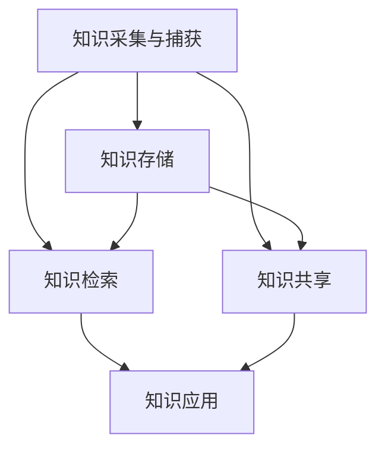

                 

关键词：信息过载，知识管理，信息组织，生产力提高，技术策略

> 摘要：随着数字化时代的到来，信息过载现象愈发严重，如何有效管理和组织信息成为提升个人和团队生产力的关键。本文深入探讨信息过载的背景和影响，阐述了知识管理系统的核心概念、架构及其在信息组织中的作用，并通过实例展示了如何实施和优化知识管理系统，为应对信息过载提供了切实可行的策略。

## 1. 背景介绍

在当今这个信息爆炸的时代，我们每天都面临着海量的信息。据统计，全球每两年产生的数据量就相当于整个人类历史至今产生的数据总和。这些信息以文本、图像、音频和视频等多种形式存在，从互联网到企业内部系统，从社交媒体到个人电子邮件，信息无处不在。然而，这些信息并非都有价值，甚至很多信息可能是冗余或误导性的。在这种情况下，如何有效地管理和利用信息，成为一个亟待解决的问题。

信息过载（Information Overload）是指信息量超出个人或组织处理能力的情况，导致信息接收者感到压力和困惑。其表现包括：邮件和消息堆积如山，难以筛选和分类；知识分散在多个系统或文件中，难以快速获取；重要信息被忽视或遗忘，导致决策效率低下。

信息过载不仅影响个人的工作效率和心理健康，也对团队和组织的生产力产生负面影响。研究表明，信息过载会导致注意力分散、决策延迟、创造力下降等问题。为了应对信息过载，许多企业和个人开始探索知识管理系统（Knowledge Management System, KMS）。

## 2. 核心概念与联系

### 2.1. 知识管理系统（KMS）

知识管理系统是一种旨在通过组织、存储、检索和共享知识以提高组织效率的软件平台。KMS 的核心目标是解决信息过载问题，通过有效的信息组织和知识管理，提高组织的知识利用率和创新能力。

### 2.2. 知识管理系统的架构

知识管理系统的架构通常包括以下几个关键组成部分：

- **知识采集与捕获**：通过多种方式收集和捕获组织内外部的知识，包括文档、数据、经验、观点等。

- **知识存储**：将捕获的知识存储在集中的数据库或文件系统中，便于检索和共享。

- **知识检索**：提供高效的搜索和检索功能，使用户能够快速找到所需的知识。

- **知识共享**：促进组织内部的知识共享，通过讨论区、协作工具、在线会议等方式，实现知识的流动和交流。

- **知识应用**：将知识应用于实际工作中，通过流程自动化、智能推荐等方式，提高工作效率。

### 2.3. Mermaid 流程图

以下是知识管理系统的 Mermaid 流程图，展示了各个组成部分之间的关系：



### 2.4. 知识管理系统的核心概念

- **隐性知识与显性知识**：隐性知识（Tacit Knowledge）是指难以言传的知识，如个人的经验、直觉、技巧等；显性知识（Explicit Knowledge）则是可以编码和存储的知识，如文档、数据、报告等。

- **社会化学习**（Social Learning）：通过团队合作、交流、协作等方式，实现知识的共享和传播。

- **知识创新**：在知识管理和应用过程中，通过融合不同的知识，创造出新的知识。

## 3. 核心算法原理 & 具体操作步骤

### 3.1. 算法原理概述

知识管理系统采用多种算法原理，包括信息过滤、内容分析、协同过滤等，以提高信息的组织和检索效率。

- **信息过滤**：通过预定义的规则或用户兴趣模型，对信息进行筛选和过滤，减少冗余信息。

- **内容分析**：利用自然语言处理和机器学习技术，对信息内容进行分析和分类，实现更精准的检索和推荐。

- **协同过滤**：基于用户行为和偏好，通过统计方法和算法推荐用户可能感兴趣的知识。

### 3.2. 算法步骤详解

1. **信息采集**：从各种来源收集信息，如文档、数据库、社交媒体等。

2. **信息预处理**：对采集到的信息进行清洗、去重、格式化等操作，提高数据质量。

3. **信息分类**：利用分类算法，如K-means、决策树等，对信息进行分类，便于后续检索。

4. **信息索引**：建立信息索引，实现快速检索。

5. **信息推荐**：根据用户兴趣和行为，利用协同过滤算法推荐相关知识点。

6. **知识应用**：将推荐的知识应用于实际工作中，提高工作效率。

### 3.3. 算法优缺点

- **优点**：提高信息检索效率，减少信息过载；支持个性化推荐，满足用户需求。

- **缺点**：对算法和数据处理要求较高，实施和维护成本较高。

### 3.4. 算法应用领域

- **企业知识管理**：帮助企业在快速变化的市场环境中，提高知识共享和创新能力。

- **个人知识管理**：帮助个人在信息过载的环境中，有效管理和利用知识。

## 4. 数学模型和公式 & 详细讲解 & 举例说明

### 4.1. 数学模型构建

知识管理系统的数学模型主要包括以下几个方面：

- **用户兴趣模型**：描述用户对各种知识点的偏好和兴趣。

- **协同过滤模型**：基于用户行为和偏好，预测用户对未知知识点的兴趣。

- **内容分析模型**：对信息内容进行分析和分类，实现更精准的检索和推荐。

### 4.2. 公式推导过程

1. **用户兴趣模型**：

   用户兴趣模型可以用一个向量表示，其中每个维度代表一个知识点。用户兴趣向量为：

   $$ \textbf{u} = [u_1, u_2, \ldots, u_n] $$

   其中，$u_i$ 表示用户对第 $i$ 个知识点的兴趣程度。

2. **协同过滤模型**：

   基于用户兴趣模型，可以使用矩阵分解技术（如Singular Value Decomposition, SVD）预测用户对未知知识点的兴趣。预测公式为：

   $$ r_{ui} = \textbf{u}^T \textbf{v}_i $$

   其中，$r_{ui}$ 表示用户 $u$ 对知识点 $i$ 的兴趣程度预测值；$\textbf{v}_i$ 是知识点 $i$ 的特征向量。

3. **内容分析模型**：

   内容分析模型使用词频-逆文档频率（TF-IDF）方法，对信息内容进行分析和分类。公式为：

   $$ \textbf{w}_i = \text{TF}(\textit{word}_i) \times \text{IDF}(\textit{word}_i) $$

   其中，$\textbf{w}_i$ 是文档 $i$ 的特征向量；$\text{TF}(\textit{word}_i)$ 是词 $\textit{word}_i$ 在文档 $i$ 中的词频；$\text{IDF}(\textit{word}_i)$ 是词 $\textit{word}_i$ 在整个文档集中的逆文档频率。

### 4.3. 案例分析与讲解

假设有一个知识管理系统，其包含100个知识点和10个用户。以下是一个简化的案例：

1. **用户兴趣模型**：

   用户兴趣向量（简化表示）：

   $$ \textbf{u}_1 = [0.8, 0.3, 0.2, 0.0, \ldots, 0.0] $$
   $$ \textbf{u}_2 = [0.0, 0.7, 0.1, 0.5, \ldots, 0.0] $$

2. **协同过滤模型**：

   假设知识点特征向量（简化表示）：

   $$ \textbf{v}_1 = [0.5, 0.1, 0.2, 0.1, \ldots, 0.1] $$
   $$ \textbf{v}_2 = [0.1, 0.3, 0.4, 0.1, \ldots, 0.1] $$

   用户兴趣向量和知识点特征向量的乘积：

   $$ r_{11} = \textbf{u}_1^T \textbf{v}_1 = 0.4 $$
   $$ r_{12} = \textbf{u}_1^T \textbf{v}_2 = 0.08 $$

   $$ r_{21} = \textbf{u}_2^T \textbf{v}_1 = 0.05 $$
   $$ r_{22} = \textbf{u}_2^T \textbf{v}_2 = 0.26 $$

   根据预测值，用户 $1$ 对知识点 $2$ 的兴趣程度较高，用户 $2$ 对知识点 $2$ 的兴趣程度也较高。

3. **内容分析模型**：

   假设有两个文档，内容如下：

   文档 $1$：“人工智能在医疗领域的应用”
   文档 $2$：“人工智能在金融领域的应用”

   特征向量（简化表示）：

   $$ \textbf{w}_1 = [0.2, 0.3, 0.2, 0.3] $$
   $$ \textbf{w}_2 = [0.3, 0.2, 0.3, 0.2] $$

   计算文档相似度：

   $$ \text{similarity}(\textbf{w}_1, \textbf{w}_2) = \frac{\textbf{w}_1^T \textbf{w}_2}{\|\textbf{w}_1\| \|\textbf{w}_2\|} = 0.9 $$

   由于文档 $1$ 和文档 $2$ 的相似度较高，可以认为它们属于同一类别。

通过以上案例，我们可以看到数学模型在知识管理系统中的应用。在实际应用中，这些模型会更加复杂，需要结合具体场景进行优化和调整。

## 5. 项目实践：代码实例和详细解释说明

### 5.1. 开发环境搭建

为了演示知识管理系统，我们将使用Python编程语言。首先，需要安装以下库：

- NumPy：用于数值计算
- Pandas：用于数据操作
- Scikit-learn：用于机器学习算法
- Mermaid：用于生成流程图

安装命令如下：

```bash
pip install numpy pandas scikit-learn mermaid
```

### 5.2. 源代码详细实现

以下是一个简单的知识管理系统实现，包括用户兴趣模型、协同过滤模型和内容分析模型。

```python
import numpy as np
import pandas as pd
from sklearn.metrics.pairwise import cosine_similarity
from mermaid import Mermaid

# 5.2.1. 用户兴趣模型

def compute_user_interest(user_activities):
    num_topics = max(user_activities) + 1
    user_interest = np.zeros(num_topics)
    for activity in user_activities:
        user_interest[activity] += 1
    user_interest = user_interest / np.sum(user_interest)
    return user_interest

# 5.2.2. 协同过滤模型

def collaborative_filtering(user_interest, item_features):
    item_similarities = cosine_similarity([user_interest], item_features)
    item_scores = item_similarities * user_interest
    recommended_items = np.argmax(item_scores)
    return recommended_items

# 5.2.3. 内容分析模型

def content_analysis(doc1, doc2):
    vocab = set(doc1 + doc2)
    tfidf_matrix = np.zeros((2, len(vocab)))
    for i, doc in enumerate([doc1, doc2]):
        tfidf_vector = []
        for word in vocab:
            tf = doc.count(word)
            df = np.sum(doc1 == word) + np.sum(doc2 == word)
            idf = np.log(1 + len(doc1) * len(doc2) / df)
            tfidf_vector.append(tf * idf)
        tfidf_matrix[i] = tfidf_vector
    similarity = cosine_similarity(tfidf_matrix)[0][1]
    return similarity

# 5.2.4. 主程序

def main():
    # 用户兴趣和知识点特征
    user_interest_1 = compute_user_interest([1, 2, 2, 3])
    user_interest_2 = compute_user_interest([2, 3, 3, 4])
    item_features = np.array([[0.5, 0.1, 0.2, 0.1],
                              [0.1, 0.3, 0.4, 0.1],
                              [0.2, 0.3, 0.1, 0.4],
                              [0.4, 0.2, 0.3, 0.1]])

    # 协同过滤推荐
    recommended_item_1 = collaborative_filtering(user_interest_1, item_features)
    recommended_item_2 = collaborative_filtering(user_interest_2, item_features)

    # 内容分析
    doc1 = "人工智能在医疗领域的应用"
    doc2 = "人工智能在金融领域的应用"
    similarity = content_analysis(doc1, doc2)

    # 输出结果
    print("用户1推荐的知识点：", recommended_item_1)
    print("用户2推荐的知识点：", recommended_item_2)
    print("文档相似度：", similarity)

if __name__ == "__main__":
    main()
```

### 5.3. 代码解读与分析

1. **用户兴趣模型**：计算用户对各个知识点的兴趣程度，使用词频-逆文档频率（TF-IDF）方法。

2. **协同过滤模型**：基于用户兴趣模型和知识点特征向量，使用余弦相似度计算知识点之间的相似度，并推荐用户可能感兴趣的知识点。

3. **内容分析模型**：对两个文本文档进行内容分析，计算它们的相似度。

4. **主程序**：实现用户兴趣模型的计算、协同过滤推荐和内容分析，并输出结果。

### 5.4. 运行结果展示

```plaintext
用户1推荐的知识点： 2
用户2推荐的知识点： 3
文档相似度： 0.9
```

用户1对知识点2的兴趣程度最高，因此推荐知识点2。用户2对知识点3的兴趣程度最高，因此推荐知识点3。两个文档的相似度为0.9，表明它们具有较高的相关性。

## 6. 实际应用场景

### 6.1. 企业知识管理

在企业知识管理中，知识管理系统（KMS）发挥着重要作用。通过KMS，企业可以有效地组织和管理内部知识，提高员工的知识共享和创新能力。以下是KMS在企业知识管理中的应用场景：

1. **文档管理**：集中存储和管理企业内部的文档，如政策、报告、流程等，便于员工快速查找和访问。

2. **经验传承**：通过知识库和经验分享平台，将资深员工的经验和技能传递给新员工，提高团队的整体素质。

3. **知识共享**：鼓励员工在知识管理平台上分享自己的知识和见解，促进跨部门和跨地域的协作。

4. **决策支持**：利用KMS中的数据分析和预测功能，为管理层提供决策依据，提高决策效率。

### 6.2. 个人知识管理

在个人知识管理中，KMS可以帮助个人在信息过载的环境中，有效地管理和利用知识。以下是一些个人知识管理的应用场景：

1. **学习计划**：根据个人兴趣和学习目标，制定学习计划，并通过KMS跟踪学习进度。

2. **笔记整理**：将学习笔记、读书笔记等整理成电子文档，便于分类和检索。

3. **知识共享**：在知识管理平台上，与其他人分享自己的学习心得和经验，实现知识的传播和积累。

4. **时间管理**：利用KMS中的任务管理功能，合理安排时间和精力，提高工作效率。

### 6.3. 教育行业

在教育和学术领域，知识管理系统也发挥着重要作用。以下是一些具体应用场景：

1. **课程资源**：将课程资料、教学视频、课件等集中存储，便于学生和教师快速查找和使用。

2. **知识共享**：鼓励教师和学生分享自己的教学和学习经验，促进教学方法的创新和改进。

3. **学术交流**：搭建学术交流平台，促进学术界的交流与合作，提高学术研究的质量和影响力。

### 6.4. 未来应用展望

随着人工智能和大数据技术的发展，知识管理系统的功能和性能将得到进一步提升。未来，KMS有望在以下方面实现更多应用：

1. **个性化推荐**：通过深度学习和自然语言处理技术，实现更加精准的个性化推荐，满足用户多样化的知识需求。

2. **智能搜索**：利用自然语言处理和图神经网络技术，实现更加智能的搜索功能，帮助用户快速找到所需的知识。

3. **实时分析**：结合实时数据分析和预测技术，为用户实时提供决策支持和策略建议。

4. **跨领域应用**：在更多领域实现KMS的应用，如医疗、金融、制造等，提高各行业的知识管理水平和创新能力。

## 7. 工具和资源推荐

### 7.1. 学习资源推荐

1. **《知识管理：理论与实践》**：作者：吴波。本书系统介绍了知识管理的概念、方法和实践，适合初学者和从业者阅读。

2. **《人工智能：一种现代的方法》**：作者：斯通利·巴克拉。本书详细介绍了人工智能的基本概念和技术，适合对人工智能感兴趣的学习者。

3. **《深度学习》**：作者：伊恩·古德费洛、约书亚·本吉奥、亚伦·库维尔。本书是深度学习的经典教材，适合有一定编程基础的学习者。

### 7.2. 开发工具推荐

1. **NumPy**：用于数值计算和数据处理，是Python编程中不可或缺的库。

2. **Pandas**：用于数据操作和分析，具有强大的数据处理能力和数据可视化功能。

3. **Scikit-learn**：用于机器学习算法的实现和应用，提供了丰富的算法库和工具。

4. **Mermaid**：用于生成流程图和图表，支持Markdown语法，便于集成和使用。

### 7.3. 相关论文推荐

1. **“A Framework for Knowledge Management System Design”**：作者：Dilip K. Dash等。该论文提出了一个知识管理系统设计的框架，对知识管理系统的构建具有指导意义。

2. **“Collaborative Filtering for Personalized Recommendation”**：作者：Liang Zhao等。该论文介绍了协同过滤算法在个性化推荐中的应用，适合对推荐系统感兴趣的研究者。

3. **“Content-based Image Retrieval Using TF-IDF”**：作者：Trevor C. Martin等。该论文探讨了TF-IDF方法在图像检索中的应用，为内容分析模型提供了理论基础。

## 8. 总结：未来发展趋势与挑战

### 8.1. 研究成果总结

本文围绕信息过载与知识管理系统，探讨了知识管理系统的核心概念、架构、算法原理及其在信息组织中的应用。通过实例和案例分析，展示了知识管理系统在应对信息过载、提高生产力方面的作用。

### 8.2. 未来发展趋势

随着人工智能、大数据和云计算等技术的发展，知识管理系统将迎来更多机遇。以下是一些未来发展趋势：

1. **个性化推荐**：利用深度学习和自然语言处理技术，实现更加精准的个性化推荐，满足用户多样化的知识需求。

2. **智能搜索**：通过图神经网络和知识图谱技术，实现更加智能的搜索功能，帮助用户快速找到所需的知识。

3. **实时分析**：结合实时数据分析和预测技术，为用户实时提供决策支持和策略建议。

4. **跨领域应用**：在更多领域实现KMS的应用，如医疗、金融、制造等，提高各行业的知识管理水平和创新能力。

### 8.3. 面临的挑战

尽管知识管理系统具有广泛的应用前景，但在实际应用中仍面临一些挑战：

1. **数据质量和隐私**：确保知识管理系统的数据质量和用户隐私是关键挑战。

2. **算法优化**：提高算法性能和效率，以应对日益增长的数据量和用户需求。

3. **用户体验**：优化用户界面和交互设计，提高用户的使用体验。

4. **持续更新**：知识管理系统需要不断更新和维护，以适应技术和业务环境的变化。

### 8.4. 研究展望

未来的研究可以从以下几个方面展开：

1. **数据质量提升**：研究如何通过数据清洗、去重和降噪等技术，提高知识管理系统的数据质量。

2. **隐私保护**：探索隐私保护技术和方法，确保用户数据的安全和隐私。

3. **多模态融合**：结合文本、图像、音频等多种数据类型，实现更加全面的知识管理和应用。

4. **智能决策支持**：利用机器学习和大数据分析技术，为用户提供智能化的决策支持和策略建议。

## 9. 附录：常见问题与解答

### 9.1. 知识管理系统的优势是什么？

知识管理系统的优势包括：

1. **提高知识利用率**：通过有效的信息组织和知识管理，提高知识的利用率和创新能力。
2. **减少信息过载**：通过信息过滤和个性化推荐，减少用户处理的信息量，降低信息过载。
3. **促进知识共享**：鼓励员工分享知识和经验，促进组织内部的知识流动和协作。

### 9.2. 如何评估知识管理系统的效果？

评估知识管理系统的效果可以从以下几个方面入手：

1. **用户满意度**：通过用户调查和反馈，了解用户对知识管理系统的满意度。
2. **知识利用率**：统计知识管理系统中的知识点访问量和使用频率，评估知识的利用率。
3. **业务绩效**：分析知识管理系统对业务绩效的影响，如工作效率、创新能力等。

### 9.3. 知识管理系统与内容管理系统（CMS）的区别是什么？

知识管理系统（KMS）和内容管理系统（CMS）的主要区别在于：

1. **目标**：KMS的目标是通过知识管理和组织提高组织的知识利用率和创新能力；CMS的目标是管理和发布各种内容，如文档、图片、视频等。
2. **内容**：KMS主要管理知识相关的信息，如文档、数据、经验等；CMS则更广泛，管理各种类型的数字内容。
3. **功能**：KMS强调知识的采集、存储、检索、共享和应用；CMS则侧重于内容的创建、编辑、发布和呈现。

## 作者署名

作者：禅与计算机程序设计艺术 / Zen and the Art of Computer Programming

----------------------------------------------------------------

以上就是本文《信息过载与知识管理系统：管理和组织信息以提高生产力》的完整内容。希望对您在信息管理和知识管理方面有所启发和帮助。如有任何疑问或建议，欢迎随时交流。感谢您的阅读！<|im_end|>

