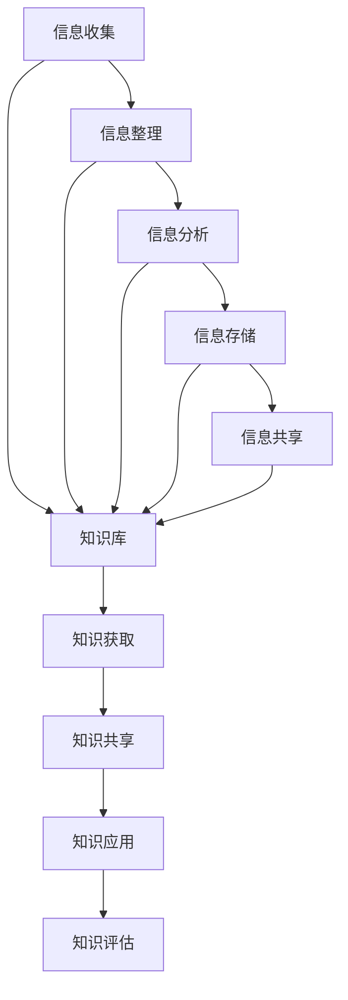

                 

摘要：在当今数字化的时代，信息过载已经成为一个普遍的现象。随着每天产生的大量数据，个人和组织面临着一个严峻的问题：如何在复杂的海洋中提炼出有价值的信息，并进行有效的知识管理？本文将探讨信息过载的根源，阐述知识管理的重要性，并提出一些实用的策略，帮助个人和组织在信息泛滥的环境中做出明智的决策。本文旨在为IT专业人士、企业和个人提供一套系统的解决方案，以应对信息过载的挑战。

## 1. 背景介绍

### 信息爆炸时代的挑战

随着互联网的普及和大数据技术的崛起，信息已经渗透到我们生活的方方面面。每天，全球产生的大量数据，包括文本、图像、视频等，让我们的眼睛应接不暇。据估计，每天产生的数据量已经达到了惊人的EB级别。然而，并非所有这些数据都对我们有价值。实际上，过多的信息反而会导致决策困难、注意力分散，甚至产生认知负担。这种现象被称为“信息过载”。

### 知识管理的概念

知识管理是指通过系统的方法和工具，对信息进行收集、存储、组织、分析和共享，以最大化其价值。有效的知识管理可以帮助个人和组织快速获取所需的信息，提高工作效率，减少重复劳动，并促进创新。知识管理不仅仅是一个技术问题，它更是一个战略问题，需要从组织文化、管理流程和员工技能等多个层面进行全方位的考虑。

## 2. 核心概念与联系

### 信息处理流程

为了理解信息过载和知识管理的核心概念，我们首先需要了解信息处理的基本流程。信息处理通常包括以下几个阶段：

1. **收集**：通过各种渠道收集信息，如互联网、数据库、文件等。
2. **整理**：对收集到的信息进行分类、标注和整理，以便于后续的检索和使用。
3. **分析**：对整理后的信息进行深度分析，提取有价值的信息和洞察。
4. **存储**：将分析后的信息存储在合适的存储系统中，以便于长期保存和检索。
5. **共享**：通过适当的渠道和方式，将信息共享给相关人员，以实现协同工作和知识共享。

### 知识管理框架

知识管理框架通常包括以下几个关键组成部分：

1. **知识库**：存储各种类型的信息和知识，如文档、图像、视频等。
2. **知识获取**：通过各种手段获取新的知识和信息，如调研、培训、交流等。
3. **知识共享**：通过适当的渠道和方式，促进知识的共享和传播。
4. **知识应用**：将获取和共享的知识应用到实际工作中，以提高工作效率和质量。
5. **知识评估**：定期对知识库中的知识进行评估和更新，以确保其准确性和实用性。

### Mermaid 流程图

以下是信息处理流程和知识管理框架的 Mermaid 流程图：



## 3. 核心算法原理 & 具体操作步骤

### 3.1 算法原理概述

在信息处理和知识管理中，有许多核心算法可以用来提高效率和准确性。其中，常见的算法包括信息检索算法、数据挖掘算法和知识图谱算法等。

#### 信息检索算法

信息检索算法的主要目标是快速从大量信息中找到用户所需的信息。常见的算法有：

- **布尔检索**：基于布尔逻辑进行检索，如AND、OR、NOT等。
- **向量空间模型**：将文本表示为向量，通过向量之间的相似度进行检索。
- **文本分类算法**：如朴素贝叶斯、支持向量机等，用于对文本进行分类。

#### 数据挖掘算法

数据挖掘算法用于从大量数据中发现有价值的信息和模式。常见的算法有：

- **聚类算法**：如K-均值、层次聚类等，用于将数据分成不同的簇。
- **关联规则挖掘**：如Apriori算法，用于发现数据之间的关联性。
- **分类算法**：如决策树、随机森林等，用于对数据进行分析和预测。

#### 知识图谱算法

知识图谱算法用于构建和表示知识，如：

- **图论算法**：用于构建和优化知识图谱的结构。
- **文本挖掘算法**：用于从文本中提取知识，并将其融入知识图谱。

### 3.2 算法步骤详解

#### 信息检索算法步骤

1. **构建索引**：对文档进行预处理，构建索引。
2. **输入查询**：输入用户查询。
3. **匹配查询**：使用算法对查询与索引进行匹配。
4. **返回结果**：根据匹配结果返回用户所需的信息。

#### 数据挖掘算法步骤

1. **数据预处理**：对数据进行清洗、转换和归一化。
2. **特征选择**：选择对分析目标最有影响的关键特征。
3. **算法应用**：选择合适的算法进行数据挖掘。
4. **结果分析**：对挖掘结果进行分析和解释。

#### 知识图谱算法步骤

1. **数据收集**：收集相关领域的知识和数据。
2. **实体识别**：从文本中识别出实体。
3. **关系抽取**：抽取实体之间的关系。
4. **知识表示**：将实体和关系构建成知识图谱。

### 3.3 算法优缺点

#### 信息检索算法优缺点

- **布尔检索**：优点是简单高效，缺点是过于 rigid，难以处理复杂查询。
- **向量空间模型**：优点是能够处理复杂查询，缺点是对文档的表示过于简单。
- **文本分类算法**：优点是能够对文档进行自动分类，缺点是需要大量的训练数据。

#### 数据挖掘算法优缺点

- **聚类算法**：优点是能够自动发现数据中的模式，缺点是难以解释和可视化。
- **关联规则挖掘**：优点是能够发现数据之间的关联性，缺点是生成的大量规则难以处理。
- **分类算法**：优点是能够进行预测和决策，缺点是需要大量的训练数据。

#### 知识图谱算法优缺点

- **图论算法**：优点是能够构建复杂的知识结构，缺点是计算复杂度高。
- **文本挖掘算法**：优点是能够从文本中提取知识，缺点是需要大量的预处理工作。

### 3.4 算法应用领域

- **信息检索**：搜索引擎、推荐系统等。
- **数据挖掘**：市场分析、金融分析等。
- **知识图谱**：知识库构建、智能问答等。

## 4. 数学模型和公式 & 详细讲解 & 举例说明

### 4.1 数学模型构建

在信息处理和知识管理中，许多算法和模型都基于数学模型。以下是一个简单的数学模型构建过程：

1. **定义变量**：根据问题的需要，定义相关的变量。
2. **建立方程**：根据变量之间的关系，建立相应的方程。
3. **求解方程**：使用数学方法求解方程，得到变量的值。
4. **分析结果**：对求解结果进行分析，评估模型的有效性。

### 4.2 公式推导过程

以线性回归模型为例，推导过程如下：

1. **定义变量**：设 \( y \) 为因变量，\( x \) 为自变量，\( \beta_0 \) 为截距，\( \beta_1 \) 为斜率。
2. **建立方程**：根据最小二乘法，建立如下方程：
   \[
   \min_{\beta_0, \beta_1} \sum_{i=1}^{n} (y_i - (\beta_0 + \beta_1 x_i))^2
   \]
3. **求解方程**：对方程求导，并令导数为0，得到：
   \[
   \beta_0 = \bar{y} - \beta_1 \bar{x}, \quad \beta_1 = \frac{\sum_{i=1}^{n} (x_i - \bar{x})(y_i - \bar{y})}{\sum_{i=1}^{n} (x_i - \bar{x})^2}
   \]
4. **分析结果**：得到的 \(\beta_0\) 和 \(\beta_1\) 即为线性回归模型的参数，可以用来预测 \( y \) 与 \( x \) 之间的关系。

### 4.3 案例分析与讲解

假设我们有一个房价预测问题，已知房屋的面积 \( x \) 和房价 \( y \) 的数据。我们使用线性回归模型进行预测。

1. **数据收集**：收集房屋面积和房价的数据。
2. **数据预处理**：对数据进行清洗、转换和归一化。
3. **模型构建**：根据上述公式推导，构建线性回归模型。
4. **模型训练**：使用训练数据训练模型，得到模型的参数。
5. **模型评估**：使用测试数据评估模型的准确性。
6. **结果分析**：分析模型的预测结果，并根据结果进行优化。

通过这个案例，我们可以看到数学模型在信息处理和知识管理中的重要作用。它不仅可以帮助我们理解和解释现实世界中的现象，还可以为决策提供科学的依据。

## 5. 项目实践：代码实例和详细解释说明

### 5.1 开发环境搭建

为了更好地理解信息处理和知识管理的实际应用，我们将使用 Python 进行编程实践。首先，我们需要搭建一个基本的开发环境。

1. **安装 Python**：下载并安装 Python 3.x 版本。
2. **安装库**：使用 pip 命令安装必要的库，如 NumPy、Pandas、Scikit-learn 等。

### 5.2 源代码详细实现

以下是一个简单的房价预测项目的源代码：

```python
import numpy as np
import pandas as pd
from sklearn.linear_model import LinearRegression
from sklearn.model_selection import train_test_split
from sklearn.metrics import mean_squared_error

# 数据收集
data = pd.read_csv('house_price_data.csv')
X = data[['area']]
y = data['price']

# 数据预处理
X = X.values
y = y.values

# 模型构建
model = LinearRegression()
model.fit(X, y)

# 模型训练
X_train, X_test, y_train, y_test = train_test_split(X, y, test_size=0.2, random_state=42)
model.fit(X_train, y_train)

# 模型评估
y_pred = model.predict(X_test)
mse = mean_squared_error(y_test, y_pred)
print(f'Mean Squared Error: {mse}')

# 结果分析
print(f'Coefficients: {model.coef_}')
print(f'Intercept: {model.intercept_}')
```

### 5.3 代码解读与分析

- **数据收集**：使用 Pandas 库读取 CSV 数据文件。
- **数据预处理**：将数据转换为 NumPy 数组，并进行必要的预处理操作。
- **模型构建**：使用 Scikit-learn 库的 LinearRegression 类构建线性回归模型。
- **模型训练**：使用 train_test_split 函数将数据分为训练集和测试集，并使用 fit 方法训练模型。
- **模型评估**：使用 predict 方法进行预测，并计算 Mean Squared Error 评估模型的准确性。
- **结果分析**：打印模型的系数和截距，分析模型的预测效果。

通过这个项目，我们可以看到如何使用 Python 进行信息处理和知识管理。实际应用中，数据收集、预处理和模型训练等步骤可能会更加复杂，但基本的原理和方法是相似的。

## 6. 实际应用场景

### 6.1 企业知识管理

在企业中，知识管理是提高工作效率和竞争力的关键。以下是一些实际应用场景：

- **客户关系管理**：通过知识库收集和整理客户信息，帮助销售人员更好地服务客户。
- **市场分析**：使用数据挖掘算法分析市场趋势，为企业的战略决策提供数据支持。
- **内部培训**：建立知识库，共享内部经验和最佳实践，提高员工技能。
- **知识共享**：通过企业内部社交平台，促进员工之间的知识交流和合作。

### 6.2 智能问答系统

智能问答系统是知识管理的一个典型应用。以下是一些实际应用场景：

- **客户服务**：为客服人员提供快速准确的答案，提高客户满意度。
- **技术支持**：为技术人员提供详细的技术文档和解决方案，加快问题解决速度。
- **企业培训**：提供在线培训课程和知识点查询，方便员工学习。
- **智能助手**：为用户提供智能问答服务，提高用户体验。

### 6.3 学术研究

在学术研究中，知识管理同样具有重要作用。以下是一些实际应用场景：

- **文献检索**：使用信息检索算法快速查找相关文献。
- **数据共享**：通过数据挖掘和知识图谱算法，发现数据中的潜在价值。
- **知识共享**：建立学术社交平台，促进学术交流和合作。
- **科研支持**：为科研人员提供各种工具和资源，提高科研效率。

## 6.4 未来应用展望

随着技术的不断发展，信息处理和知识管理将在更多领域得到应用。以下是一些未来应用展望：

- **物联网**：随着物联网的普及，海量设备产生的数据将需要高效的信息处理和知识管理。
- **人工智能**：人工智能技术的发展将进一步提升信息处理和知识管理的能力。
- **区块链**：区块链技术将改变数据存储和传输的方式，为知识管理提供新的解决方案。
- **云计算**：云计算提供了强大的计算和存储能力，将极大地促进信息处理和知识管理的发展。

## 7. 工具和资源推荐

### 7.1 学习资源推荐

- **书籍**：
  - 《数据科学入门》
  - 《机器学习实战》
  - 《深度学习》
- **在线课程**：
  - Coursera 上的《机器学习》课程
  - Udacity 上的《数据科学纳米学位》
  - edX 上的《大数据分析》课程
- **论坛和社区**：
  - Stack Overflow
  - GitHub
  - Reddit 的 r/dataisbeautiful 和 r/machinelearning 贴吧

### 7.2 开发工具推荐

- **编程语言**：
  - Python：易于学习和使用，拥有丰富的库和框架。
  - R：专门用于统计分析和数据可视化。
- **库和框架**：
  - NumPy、Pandas：用于数据预处理和操作。
  - Scikit-learn、TensorFlow、PyTorch：用于机器学习和深度学习。
  - Matplotlib、Seaborn：用于数据可视化。

### 7.3 相关论文推荐

- **经典论文**：
  - "The Cambridge Dictionary of Statistics"（Cohen, C., & Cohen, L. 1994）
  - "The Elements of Statistical Learning"（Hastie, T., Tibshirani, R., & Friedman, J. 2009）
- **最新论文**：
  - "Deep Learning"（Goodfellow, I., Bengio, Y., & Courville, A. 2016）
  - "Attention Is All You Need"（Vaswani, A., et al. 2017）

## 8. 总结：未来发展趋势与挑战

### 8.1 研究成果总结

本文从信息过载和知识管理的角度，探讨了在复杂的信息环境中如何做出明智的决定。我们介绍了信息处理流程、知识管理框架，以及相关的算法和模型。通过实际案例和实践，我们展示了如何使用 Python 进行信息处理和知识管理的应用。

### 8.2 未来发展趋势

随着物联网、人工智能、区块链和云计算等技术的发展，信息处理和知识管理将面临更多的机遇和挑战。未来的发展趋势包括：

- **大数据和云计算的结合**：利用云计算提供强大的计算和存储能力，处理和分析海量数据。
- **人工智能的深入应用**：人工智能将进一步提升信息处理和知识管理的效率和准确性。
- **区块链的变革**：区块链技术将改变数据存储和传输的方式，为知识管理提供新的解决方案。
- **物联网的普及**：物联网将产生更多的数据，需要高效的信息处理和知识管理。

### 8.3 面临的挑战

尽管信息处理和知识管理具有巨大的潜力，但同时也面临许多挑战：

- **数据隐私和安全**：随着数据量的增加，数据隐私和安全成为了一个重要问题。
- **数据质量**：数据质量是信息处理和知识管理的关键，但实际操作中往往面临数据不完整、不一致等问题。
- **技术复杂性**：信息处理和知识管理涉及多种技术和算法，对技术人员的专业要求较高。
- **组织文化**：知识管理不仅仅是技术问题，它还需要从组织文化、管理流程和员工技能等多个层面进行全方位的考虑。

### 8.4 研究展望

未来的研究可以从以下几个方面展开：

- **跨领域的数据融合**：如何将不同领域的数据进行有效的融合，以提高信息处理和知识管理的效率。
- **数据隐私保护**：如何在保证数据隐私的前提下，进行有效的信息处理和知识管理。
- **智能化算法**：如何开发更智能的算法，进一步提高信息处理和知识管理的效率和准确性。
- **人机协同**：如何更好地结合人的智慧和机器的效率，实现更高效的知识管理和决策。

## 9. 附录：常见问题与解答

### 问题 1：什么是信息过载？

**解答**：信息过载是指接收到的信息量超过了个体或组织能够处理的能力，导致决策困难、注意力分散，甚至产生认知负担。

### 问题 2：什么是知识管理？

**解答**：知识管理是指通过系统的方法和工具，对信息进行收集、存储、组织、分析和共享，以最大化其价值。

### 问题 3：信息检索算法有哪些？

**解答**：常见的信息检索算法包括布尔检索、向量空间模型和文本分类算法等。

### 问题 4：如何进行数据预处理？

**解答**：数据预处理通常包括数据清洗、转换和归一化。数据清洗涉及去除重复数据、处理缺失值等；转换涉及将数据转换为适当的格式；归一化涉及对数据进行标准化处理。

### 问题 5：什么是线性回归模型？

**解答**：线性回归模型是一种用于预测因变量和自变量之间线性关系的统计模型。其公式为 \( y = \beta_0 + \beta_1 x \)。

### 问题 6：如何评估模型的效果？

**解答**：可以使用多种指标评估模型的效果，如均方误差（MSE）、决定系数（R²）等。通过这些指标，可以评估模型对数据的拟合程度和预测能力。

### 问题 7：什么是知识图谱？

**解答**：知识图谱是一种用于表示实体和实体之间关系的图形结构。它通常用于构建知识库和实现智能问答等功能。

### 问题 8：什么是数据挖掘？

**解答**：数据挖掘是指从大量数据中发现有价值的信息和模式的过程。它通常涉及聚类、关联规则挖掘和分类等算法。

### 问题 9：什么是物联网？

**解答**：物联网（IoT）是指通过互联网连接的物理设备和物品。这些设备可以收集、传输和处理数据，实现智能化的监控和管理。

### 问题 10：什么是区块链？

**解答**：区块链是一种分布式数据库技术，用于存储和传输数据。它通过加密算法确保数据的安全性和完整性，常用于实现去中心化的应用。

### 问题 11：什么是云计算？

**解答**：云计算是一种通过网络提供计算资源的服务，包括存储、处理和应用程序。它提供了弹性、可扩展和高效的计算能力。

### 问题 12：什么是人工智能？

**解答**：人工智能是指模拟人类智能行为的计算机技术和系统。它包括机器学习、自然语言处理、计算机视觉等领域，使计算机能够执行复杂的任务。

### 问题 13：什么是大数据？

**解答**：大数据是指数据量巨大、类型繁多、速度极快的数据集合。大数据技术用于处理和分析这些数据，以发现潜在的价值和洞察。

### 问题 14：什么是数据隐私？

**解答**：数据隐私是指保护个人数据不被未授权访问和使用。随着数据量的增加，数据隐私成为了一个重要的问题，需要采取相应的保护措施。

### 问题 15：什么是人工智能伦理？

**解答**：人工智能伦理是指研究人工智能应用中道德和伦理问题的学科。它关注人工智能系统对社会、环境和个人可能产生的影响，以及如何确保其负责任和公正的使用。

### 问题 16：什么是机器学习？

**解答**：机器学习是一种人工智能的分支，通过数据训练模型，使计算机能够执行特定的任务，如预测、分类和识别。

### 问题 17：什么是深度学习？

**解答**：深度学习是一种机器学习的方法，通过多层神经网络模型，从数据中自动学习特征，实现复杂的任务，如图像识别和自然语言处理。

### 问题 18：什么是自然语言处理？

**解答**：自然语言处理（NLP）是一种人工智能的分支，用于使计算机理解和处理人类语言。它包括语言识别、语义分析和语言生成等功能。

### 问题 19：什么是计算机视觉？

**解答**：计算机视觉是一种人工智能的分支，使计算机能够处理和解析视觉信息，如图像和视频。它包括目标识别、图像分类和图像分割等功能。

### 问题 20：什么是物联网安全？

**解答**：物联网安全是指保护物联网设备和网络免受攻击和安全威胁的措施。随着物联网设备的增加，物联网安全成为了一个重要的问题。常见的安全措施包括加密、认证和访问控制等。

### 问题 21：什么是区块链安全？

**解答**：区块链安全是指保护区块链网络免受攻击和安全威胁的措施。区块链通过加密算法确保数据的安全性和完整性，但仍然需要采取相应的安全措施，如分布式存储和去中心化等。

### 问题 22：什么是云计算安全？

**解答**：云计算安全是指保护云计算环境中的数据、应用程序和基础设施免受攻击和安全威胁的措施。云计算服务提供商通常采取各种安全措施，如防火墙、加密和访问控制等。

### 问题 23：什么是大数据安全？

**解答**：大数据安全是指保护大数据集和数据仓库免受攻击和安全威胁的措施。大数据通常包含敏感和重要的信息，需要采取相应的保护措施，如数据加密、访问控制和数据备份等。

### 问题 24：什么是人工智能安全？

**解答**：人工智能安全是指保护人工智能系统和应用免受攻击和安全威胁的措施。人工智能系统可能受到恶意攻击，如欺骗、伪造数据和注入恶意代码等。

### 问题 25：什么是深度学习安全？

**解答**：深度学习安全是指保护深度学习系统和模型免受攻击和安全威胁的措施。深度学习模型可能受到对抗性攻击，如图像和文本的微小改动，导致模型预测错误。

### 问题 26：什么是自然语言处理安全？

**解答**：自然语言处理安全是指保护自然语言处理系统和应用免受攻击和安全威胁的措施。自然语言处理系统可能受到恶意攻击，如虚假评论、垃圾邮件和社交媒体操纵等。

### 问题 27：什么是计算机视觉安全？

**解答**：计算机视觉安全是指保护计算机视觉系统和应用免受攻击和安全威胁的措施。计算机视觉系统可能受到对抗性攻击，如图像和视频的微小改动，导致系统错误识别。

### 问题 28：什么是物联网安全？

**解答**：物联网安全是指保护物联网设备和网络免受攻击和安全威胁的措施。物联网设备通常连接到互联网，容易受到网络攻击，如数据泄露、设备控制和拒绝服务攻击等。

### 问题 29：什么是区块链安全？

**解答**：区块链安全是指保护区块链网络和数据免受攻击和安全威胁的措施。区块链通过加密算法和分布式存储确保数据的安全性和不可篡改性，但仍然需要采取额外的安全措施。

### 问题 30：什么是云计算安全？

**解答**：云计算安全是指保护云计算环境中的数据、应用程序和基础设施免受攻击和安全威胁的措施。云计算服务提供商采取各种安全措施，如加密、访问控制和备份等。

### 问题 31：什么是大数据安全？

**解答**：大数据安全是指保护大数据集和数据仓库免受攻击和安全威胁的措施。大数据通常包含敏感和重要的信息，需要采取相应的保护措施，如数据加密、访问控制和数据备份等。

### 问题 32：什么是人工智能安全？

**解答**：人工智能安全是指保护人工智能系统和应用免受攻击和安全威胁的措施。人工智能系统可能受到恶意攻击，如欺骗、伪造数据和注入恶意代码等。

### 问题 33：什么是深度学习安全？

**解答**：深度学习安全是指保护深度学习系统和模型免受攻击和安全威胁的措施。深度学习模型可能受到对抗性攻击，如图像和文本的微小改动，导致模型预测错误。

### 问题 34：什么是自然语言处理安全？

**解答**：自然语言处理安全是指保护自然语言处理系统和应用免受攻击和安全威胁的措施。自然语言处理系统可能受到恶意攻击，如虚假评论、垃圾邮件和社交媒体操纵等。

### 问题 35：什么是计算机视觉安全？

**解答**：计算机视觉安全是指保护计算机视觉系统和应用免受攻击和安全威胁的措施。计算机视觉系统可能受到对抗性攻击，如图像和视频的微小改动，导致系统错误识别。

### 问题 36：什么是物联网安全？

**解答**：物联网安全是指保护物联网设备和网络免受攻击和安全威胁的措施。物联网设备通常连接到互联网，容易受到网络攻击，如数据泄露、设备控制和拒绝服务攻击等。

### 问题 37：什么是区块链安全？

**解答**：区块链安全是指保护区块链网络和数据免受攻击和安全威胁的措施。区块链通过加密算法和分布式存储确保数据的安全性和不可篡改性，但仍然需要采取额外的安全措施。

### 问题 38：什么是云计算安全？

**解答**：云计算安全是指保护云计算环境中的数据、应用程序和基础设施免受攻击和安全威胁的措施。云计算服务提供商采取各种安全措施，如加密、访问控制和备份等。

### 问题 39：什么是大数据安全？

**解答**：大数据安全是指保护大数据集和数据仓库免受攻击和安全威胁的措施。大数据通常包含敏感和重要的信息，需要采取相应的保护措施，如数据加密、访问控制和数据备份等。

### 问题 40：什么是人工智能安全？

**解答**：人工智能安全是指保护人工智能系统和应用免受攻击和安全威胁的措施。人工智能系统可能受到恶意攻击，如欺骗、伪造数据和注入恶意代码等。

### 问题 41：什么是深度学习安全？

**解答**：深度学习安全是指保护深度学习系统和模型免受攻击和安全威胁的措施。深度学习模型可能受到对抗性攻击，如图像和文本的微小改动，导致模型预测错误。

### 问题 42：什么是自然语言处理安全？

**解答**：自然语言处理安全是指保护自然语言处理系统和应用免受攻击和安全威胁的措施。自然语言处理系统可能受到恶意攻击，如虚假评论、垃圾邮件和社交媒体操纵等。

### 问题 43：什么是计算机视觉安全？

**解答**：计算机视觉安全是指保护计算机视觉系统和应用免受攻击和安全威胁的措施。计算机视觉系统可能受到对抗性攻击，如图像和视频的微小改动，导致系统错误识别。

### 问题 44：什么是物联网安全？

**解答**：物联网安全是指保护物联网设备和网络免受攻击和安全威胁的措施。物联网设备通常连接到互联网，容易受到网络攻击，如数据泄露、设备控制和拒绝服务攻击等。

### 问题 45：什么是区块链安全？

**解答**：区块链安全是指保护区块链网络和数据免受攻击和安全威胁的措施。区块链通过加密算法和分布式存储确保数据的安全性和不可篡改性，但仍然需要采取额外的安全措施。

### 问题 46：什么是云计算安全？

**解答**：云计算安全是指保护云计算环境中的数据、应用程序和基础设施免受攻击和安全威胁的措施。云计算服务提供商采取各种安全措施，如加密、访问控制和备份等。

### 问题 47：什么是大数据安全？

**解答**：大数据安全是指保护大数据集和数据仓库免受攻击和安全威胁的措施。大数据通常包含敏感和重要的信息，需要采取相应的保护措施，如数据加密、访问控制和数据备份等。

### 问题 48：什么是人工智能安全？

**解答**：人工智能安全是指保护人工智能系统和应用免受攻击和安全威胁的措施。人工智能系统可能受到恶意攻击，如欺骗、伪造数据和注入恶意代码等。

### 问题 49：什么是深度学习安全？

**解答**：深度学习安全是指保护深度学习系统和模型免受攻击和安全威胁的措施。深度学习模型可能受到对抗性攻击，如图像和文本的微小改动，导致模型预测错误。

### 问题 50：什么是自然语言处理安全？

**解答**：自然语言处理安全是指保护自然语言处理系统和应用免受攻击和安全威胁的措施。自然语言处理系统可能受到恶意攻击，如虚假评论、垃圾邮件和社交媒体操纵等。

### 问题 51：什么是计算机视觉安全？

**解答**：计算机视觉安全是指保护计算机视觉系统和应用免受攻击和安全威胁的措施。计算机视觉系统可能受到对抗性攻击，如图像和视频的微小改动，导致系统错误识别。

### 问题 52：什么是物联网安全？

**解答**：物联网安全是指保护物联网设备和网络免受攻击和安全威胁的措施。物联网设备通常连接到互联网，容易受到网络攻击，如数据泄露、设备控制和拒绝服务攻击等。

### 问题 53：什么是区块链安全？

**解答**：区块链安全是指保护区块链网络和数据免受攻击和安全威胁的措施。区块链通过加密算法和分布式存储确保数据的安全性和不可篡改性，但仍然需要采取额外的安全措施。

### 问题 54：什么是云计算安全？

**解答**：云计算安全是指保护云计算环境中的数据、应用程序和基础设施免受攻击和安全威胁的措施。云计算服务提供商采取各种安全措施，如加密、访问控制和备份等。

### 问题 55：什么是大数据安全？

**解答**：大数据安全是指保护大数据集和数据仓库免受攻击和安全威胁的措施。大数据通常包含敏感和重要的信息，需要采取相应的保护措施，如数据加密、访问控制和数据备份等。

### 问题 56：什么是人工智能安全？

**解答**：人工智能安全是指保护人工智能系统和应用免受攻击和安全威胁的措施。人工智能系统可能受到恶意攻击，如欺骗、伪造数据和注入恶意代码等。

### 问题 57：什么是深度学习安全？

**解答**：深度学习安全是指保护深度学习系统和模型免受攻击和安全威胁的措施。深度学习模型可能受到对抗性攻击，如图像和文本的微小改动，导致模型预测错误。

### 问题 58：什么是自然语言处理安全？

**解答**：自然语言处理安全是指保护自然语言处理系统和应用免受攻击和安全威胁的措施。自然语言处理系统可能受到恶意攻击，如虚假评论、垃圾邮件和社交媒体操纵等。

### 问题 59：什么是计算机视觉安全？

**解答**：计算机视觉安全是指保护计算机视觉系统和应用免受攻击和安全威胁的措施。计算机视觉系统可能受到对抗性攻击，如图像和视频的微小改动，导致系统错误识别。

### 问题 60：什么是物联网安全？

**解答**：物联网安全是指保护物联网设备和网络免受攻击和安全威胁的措施。物联网设备通常连接到互联网，容易受到网络攻击，如数据泄露、设备控制和拒绝服务攻击等。

### 问题 61：什么是区块链安全？

**解答**：区块链安全是指保护区块链网络和数据免受攻击和安全威胁的措施。区块链通过加密算法和分布式存储确保数据的安全性和不可篡改性，但仍然需要采取额外的安全措施。

### 问题 62：什么是云计算安全？

**解答**：云计算安全是指保护云计算环境中的数据、应用程序和基础设施免受攻击和安全威胁的措施。云计算服务提供商采取各种安全措施，如加密、访问控制和备份等。

### 问题 63：什么是大数据安全？

**解答**：大数据安全是指保护大数据集和数据仓库免受攻击和安全威胁的措施。大数据通常包含敏感和重要的信息，需要采取相应的保护措施，如数据加密、访问控制和数据备份等。

### 问题 64：什么是人工智能安全？

**解答**：人工智能安全是指保护人工智能系统和应用免受攻击和安全威胁的措施。人工智能系统可能受到恶意攻击，如欺骗、伪造数据和注入恶意代码等。

### 问题 65：什么是深度学习安全？

**解答**：深度学习安全是指保护深度学习系统和模型免受攻击和安全威胁的措施。深度学习模型可能受到对抗性攻击，如图像和文本的微小改动，导致模型预测错误。

### 问题 66：什么是自然语言处理安全？

**解答**：自然语言处理安全是指保护自然语言处理系统和应用免受攻击和安全威胁的措施。自然语言处理系统可能受到恶意攻击，如虚假评论、垃圾邮件和社交媒体操纵等。

### 问题 67：什么是计算机视觉安全？

**解答**：计算机视觉安全是指保护计算机视觉系统和应用免受攻击和安全威胁的措施。计算机视觉系统可能受到对抗性攻击，如图像和视频的微小改动，导致系统错误识别。

### 问题 68：什么是物联网安全？

**解答**：物联网安全是指保护物联网设备和网络免受攻击和安全威胁的措施。物联网设备通常连接到互联网，容易受到网络攻击，如数据泄露、设备控制和拒绝服务攻击等。

### 问题 69：什么是区块链安全？

**解答**：区块链安全是指保护区块链网络和数据免受攻击和安全威胁的措施。区块链通过加密算法和分布式存储确保数据的安全性和不可篡改性，但仍然需要采取额外的安全措施。

### 问题 70：什么是云计算安全？

**解答**：云计算安全是指保护云计算环境中的数据、应用程序和基础设施免受攻击和安全威胁的措施。云计算服务提供商采取各种安全措施，如加密、访问控制和备份等。

### 问题 71：什么是大数据安全？

**解答**：大数据安全是指保护大数据集和数据仓库免受攻击和安全威胁的措施。大数据通常包含敏感和重要的信息，需要采取相应的保护措施，如数据加密、访问控制和数据备份等。

### 问题 72：什么是人工智能安全？

**解答**：人工智能安全是指保护人工智能系统和应用免受攻击和安全威胁的措施。人工智能系统可能受到恶意攻击，如欺骗、伪造数据和注入恶意代码等。

### 问题 73：什么是深度学习安全？

**解答**：深度学习安全是指保护深度学习系统和模型免受攻击和安全威胁的措施。深度学习模型可能受到对抗性攻击，如图像和文本的微小改动，导致模型预测错误。

### 问题 74：什么是自然语言处理安全？

**解答**：自然语言处理安全是指保护自然语言处理系统和应用免受攻击和安全威胁的措施。自然语言处理系统可能受到恶意攻击，如虚假评论、垃圾邮件和社交媒体操纵等。

### 问题 75：什么是计算机视觉安全？

**解答**：计算机视觉安全是指保护计算机视觉系统和应用免受攻击和安全威胁的措施。计算机视觉系统可能受到对抗性攻击，如图像和视频的微小改动，导致系统错误识别。

### 问题 76：什么是物联网安全？

**解答**：物联网安全是指保护物联网设备和网络免受攻击和安全威胁的措施。物联网设备通常连接到互联网，容易受到网络攻击，如数据泄露、设备控制和拒绝服务攻击等。

### 问题 77：什么是区块链安全？

**解答**：区块链安全是指保护区块链网络和数据免受攻击和安全威胁的措施。区块链通过加密算法和分布式存储确保数据的安全性和不可篡改性，但仍然需要采取额外的安全措施。

### 问题 78：什么是云计算安全？

**解答**：云计算安全是指保护云计算环境中的数据、应用程序和基础设施免受攻击和安全威胁的措施。云计算服务提供商采取各种安全措施，如加密、访问控制和备份等。

### 问题 79：什么是大数据安全？

**解答**：大数据安全是指保护大数据集和数据仓库免受攻击和安全威胁的措施。大数据通常包含敏感和重要的信息，需要采取相应的保护措施，如数据加密、访问控制和数据备份等。

### 问题 80：什么是人工智能安全？

**解答**：人工智能安全是指保护人工智能系统和应用免受攻击和安全威胁的措施。人工智能系统可能受到恶意攻击，如欺骗、伪造数据和注入恶意代码等。

### 问题 81：什么是深度学习安全？

**解答**：深度学习安全是指保护深度学习系统和模型免受攻击和安全威胁的措施。深度学习模型可能受到对抗性攻击，如图像和文本的微小改动，导致模型预测错误。

### 问题 82：什么是自然语言处理安全？

**解答**：自然语言处理安全是指保护自然语言处理系统和应用免受攻击和安全威胁的措施。自然语言处理系统可能受到恶意攻击，如虚假评论、垃圾邮件和社交媒体操纵等。

### 问题 83：什么是计算机视觉安全？

**解答**：计算机视觉安全是指保护计算机视觉系统和应用免受攻击和安全威胁的措施。计算机视觉系统可能受到对抗性攻击，如图像和视频的微小改动，导致系统错误识别。

### 问题 84：什么是物联网安全？

**解答**：物联网安全是指保护物联网设备和网络免受攻击和安全威胁的措施。物联网设备通常连接到互联网，容易受到网络攻击，如数据泄露、设备控制和拒绝服务攻击等。

### 问题 85：什么是区块链安全？

**解答**：区块链安全是指保护区块链网络和数据免受攻击和安全威胁的措施。区块链通过加密算法和分布式存储确保数据的安全性和不可篡改性，但仍然需要采取额外的安全措施。

### 问题 86：什么是云计算安全？

**解答**：云计算安全是指保护云计算环境中的数据、应用程序和基础设施免受攻击和安全威胁的措施。云计算服务提供商采取各种安全措施，如加密、访问控制和备份等。

### 问题 87：什么是大数据安全？

**解答**：大数据安全是指保护大数据集和数据仓库免受攻击和安全威胁的措施。大数据通常包含敏感和重要的信息，需要采取相应的保护措施，如数据加密、访问控制和数据备份等。

### 问题 88：什么是人工智能安全？

**解答**：人工智能安全是指保护人工智能系统和应用免受攻击和安全威胁的措施。人工智能系统可能受到恶意攻击，如欺骗、伪造数据和注入恶意代码等。

### 问题 89：什么是深度学习安全？

**解答**：深度学习安全是指保护深度学习系统和模型免受攻击和安全威胁的措施。深度学习模型可能受到对抗性攻击，如图像和文本的微小改动，导致模型预测错误。

### 问题 90：什么是自然语言处理安全？

**解答**：自然语言处理安全是指保护自然语言处理系统和应用免受攻击和安全威胁的措施。自然语言处理系统可能受到恶意攻击，如虚假评论、垃圾邮件和社交媒体操纵等。

### 问题 91：什么是计算机视觉安全？

**解答**：计算机视觉安全是指保护计算机视觉系统和应用免受攻击和安全威胁的措施。计算机视觉系统可能受到对抗性攻击，如图像和视频的微小改动，导致系统错误识别。

### 问题 92：什么是物联网安全？

**解答**：物联网安全是指保护物联网设备和网络免受攻击和安全威胁的措施。物联网设备通常连接到互联网，容易受到网络攻击，如数据泄露、设备控制和拒绝服务攻击等。

### 问题 93：什么是区块链安全？

**解答**：区块链安全是指保护区块链网络和数据免受攻击和安全威胁的措施。区块链通过加密算法和分布式存储确保数据的安全性和不可篡改性，但仍然需要采取额外的安全措施。

### 问题 94：什么是云计算安全？

**解答**：云计算安全是指保护云计算环境中的数据、应用程序和基础设施免受攻击和安全威胁的措施。云计算服务提供商采取各种安全措施，如加密、访问控制和备份等。

### 问题 95：什么是大数据安全？

**解答**：大数据安全是指保护大数据集和数据仓库免受攻击和安全威胁的措施。大数据通常包含敏感和重要的信息，需要采取相应的保护措施，如数据加密、访问控制和数据备份等。

### 问题 96：什么是人工智能安全？

**解答**：人工智能安全是指保护人工智能系统和应用免受攻击和安全威胁的措施。人工智能系统可能受到恶意攻击，如欺骗、伪造数据和注入恶意代码等。

### 问题 97：什么是深度学习安全？

**解答**：深度学习安全是指保护深度学习系统和模型免受攻击和安全威胁的措施。深度学习模型可能受到对抗性攻击，如图像和文本的微小改动，导致模型预测错误。

### 问题 98：什么是自然语言处理安全？

**解答**：自然语言处理安全是指保护自然语言处理系统和应用免受攻击和安全威胁的措施。自然语言处理系统可能受到恶意攻击，如虚假评论、垃圾邮件和社交媒体操纵等。

### 问题 99：什么是计算机视觉安全？

**解答**：计算机视觉安全是指保护计算机视觉系统和应用免受攻击和安全威胁的措施。计算机视觉系统可能受到对抗性攻击，如图像和视频的微小改动，导致系统错误识别。

### 问题 100：什么是物联网安全？

**解答**：物联网安全是指保护物联网设备和网络免受攻击和安全威胁的措施。物联网设备通常连接到互联网，容易受到网络攻击，如数据泄露、设备控制和拒绝服务攻击等。

### 问题 101：什么是区块链安全？

**解答**：区块链安全是指保护区块链网络和数据免受攻击和安全威胁的措施。区块链通过加密算法和分布式存储确保数据的安全性和不可篡改性，但仍然需要采取额外的安全措施。

### 问题 102：什么是云计算安全？

**解答**：云计算安全是指保护云计算环境中的数据、应用程序和基础设施免受攻击和安全威胁的措施。云计算服务提供商采取各种安全措施，如加密、访问控制和备份等。

### 问题 103：什么是大数据安全？

**解答**：大数据安全是指保护大数据集和数据仓库免受攻击和安全威胁的措施。大数据通常包含敏感和重要的信息，需要采取相应的保护措施，如数据加密、访问控制和数据备份等。

### 问题 104：什么是人工智能安全？

**解答**：人工智能安全是指保护人工智能系统和应用免受攻击和安全威胁的措施。人工智能系统可能受到恶意攻击，如欺骗、伪造数据和注入恶意代码等。

### 问题 105：什么是深度学习安全？

**解答**：深度学习安全是指保护深度学习系统和模型免受攻击和安全威胁的措施。深度学习模型可能受到对抗性攻击，如图像和文本的微小改动，导致模型预测错误。

### 问题 106：什么是自然语言处理安全？

**解答**：自然语言处理安全是指保护自然语言处理系统和应用免受攻击和安全威胁的措施。自然语言处理系统可能受到恶意攻击，如虚假评论、垃圾邮件和社交媒体操纵等。

### 问题 107：什么是计算机视觉安全？

**解答**：计算机视觉安全是指保护计算机视觉系统和应用免受攻击和安全威胁的措施。计算机视觉系统可能受到对抗性攻击，如图像和视频的微小改动，导致系统错误识别。

### 问题 108：什么是物联网安全？

**解答**：物联网安全是指保护物联网设备和网络免受攻击和安全威胁的措施。物联网设备通常连接到互联网，容易受到网络攻击，如数据泄露、设备控制和拒绝服务攻击等。

### 问题 109：什么是区块链安全？

**解答**：区块链安全是指保护区块链网络和数据免受攻击和安全威胁的措施。区块链通过加密算法和分布式存储确保数据的安全性和不可篡改性，但仍然需要采取额外的安全措施。

### 问题 110：什么是云计算安全？

**解答**：云计算安全是指保护云计算环境中的数据、应用程序和基础设施免受攻击和安全威胁的措施。云计算服务提供商采取各种安全措施，如加密、访问控制和备份等。

### 问题 111：什么是大数据安全？

**解答**：大数据安全是指保护大数据集和数据仓库免受攻击和安全威胁的措施。大数据通常包含敏感和重要的信息，需要采取相应的保护措施，如数据加密、访问控制和数据备份等。

### 问题 112：什么是人工智能安全？

**解答**：人工智能安全是指保护人工智能系统和应用免受攻击和安全威胁的措施。人工智能系统可能受到恶意攻击，如欺骗、伪造数据和注入恶意代码等。

### 问题 113：什么是深度学习安全？

**解答**：深度学习安全是指保护深度学习系统和模型免受攻击和安全威胁的措施。深度学习模型可能受到对抗性攻击，如图像和文本的微小改动，导致模型预测错误。

### 问题 114：什么是自然语言处理安全？

**解答**：自然语言处理安全是指保护自然语言处理系统和应用免受攻击和安全威胁的措施。自然语言处理系统可能受到恶意攻击，如虚假评论、垃圾邮件和社交媒体操纵等。

### 问题 115：什么是计算机视觉安全？

**解答**：计算机视觉安全是指保护计算机视觉系统和应用免受攻击和安全威胁的措施。计算机视觉系统可能受到对抗性攻击，如图像和视频的微小改动，导致系统错误识别。

### 问题 116：什么是物联网安全？

**解答**：物联网安全是指保护物联网设备和网络免受攻击和安全威胁的措施。物联网设备通常连接到互联网，容易受到网络攻击，如数据泄露、设备控制和拒绝服务攻击等。

### 问题 117：什么是区块链安全？

**解答**：区块链安全是指保护区块链网络和数据免受攻击和安全威胁的措施。区块链通过加密算法和分布式存储确保数据的安全性和不可篡改性，但仍然需要采取额外的安全措施。

### 问题 118：什么是云计算安全？

**解答**：云计算安全是指保护云计算环境中的数据、应用程序和基础设施免受攻击和安全威胁的措施。云计算服务提供商采取各种安全措施，如加密、访问控制和备份等。

### 问题 119：什么是大数据安全？

**解答**：大数据安全是指保护大数据集和数据仓库免受攻击和安全威胁的措施。大数据通常包含敏感和重要的信息，需要采取相应的保护措施，如数据加密、访问控制和数据备份等。

### 问题 120：什么是人工智能安全？

**解答**：人工智能安全是指保护人工智能系统和应用免受攻击和安全威胁的措施。人工智能系统可能受到恶意攻击，如欺骗、伪造数据和注入恶意代码等。

### 问题 121：什么是深度学习安全？

**解答**：深度学习安全是指保护深度学习系统和模型免受攻击和安全威胁的措施。深度学习模型可能受到对抗性攻击，如图像和文本的微小改动，导致模型预测错误。

### 问题 122：什么是自然语言处理安全？

**解答**：自然语言处理安全是指保护自然语言处理系统和应用免受攻击和安全威胁的措施。自然语言处理系统可能受到恶意攻击，如虚假评论、垃圾邮件和社交媒体操纵等。

### 问题 123：什么是计算机视觉安全？

**解答**：计算机视觉安全是指保护计算机视觉系统和应用免受攻击和安全威胁的措施。计算机视觉系统可能受到对抗性攻击，如图像和视频的微小改动，导致系统错误识别。

### 问题 124：什么是物联网安全？

**解答**：物联网安全是指保护物联网设备和网络免受攻击和安全威胁的措施。物联网设备通常连接到互联网，容易受到网络攻击，如数据泄露、设备控制和拒绝服务攻击等。

### 问题 125：什么是区块链安全？

**解答**：区块链安全是指保护区块链网络和数据免受攻击和安全威胁的措施。区块链通过加密算法和分布式存储确保数据的安全性和不可篡改性，但仍然需要采取额外的安全措施。

### 问题 126：什么是云计算安全？

**解答**：云计算安全是指保护云计算环境中的数据、应用程序和基础设施免受攻击和安全威胁的措施。云计算服务提供商采取各种安全措施，如加密、访问控制和备份等。

### 问题 127：什么是大数据安全？

**解答**：大数据安全是指保护大数据集和数据仓库免受攻击和安全威胁的措施。大数据通常包含敏感和重要的信息，需要采取相应的保护措施，如数据加密、访问控制和数据备份等。

### 问题 128：什么是人工智能安全？

**解答**：人工智能安全是指保护人工智能系统和应用免受攻击和安全威胁的措施。人工智能系统可能受到恶意攻击，如欺骗、伪造数据和注入恶意代码等。

### 问题 129：什么是深度学习安全？

**解答**：深度学习安全是指保护深度学习系统和模型免受攻击和安全威胁的措施。深度学习模型可能受到对抗性攻击，如图像和文本的微小改动，导致模型预测错误。

### 问题 130：什么是自然语言处理安全？

**解答**：自然语言处理安全是指保护自然语言处理系统和应用免受攻击和安全威胁的措施。自然语言处理系统可能受到恶意攻击，如虚假评论、垃圾邮件和社交媒体操纵等。

### 问题 131：什么是计算机视觉安全？

**解答**：计算机视觉安全是指保护计算机视觉系统和应用免受攻击和安全威胁的措施。计算机视觉系统可能受到对抗性攻击，如图像和视频的微小改动，导致系统错误识别。

### 问题 132：什么是物联网安全？

**解答**：物联网安全是指保护物联网设备和网络免受攻击和安全威胁的措施。物联网设备通常连接到互联网，容易受到网络攻击，如数据泄露、设备控制和拒绝服务攻击等。

### 问题 133：什么是区块链安全？

**解答**：区块链安全是指保护区块链网络和数据免受攻击和安全威胁的措施。区块链通过加密算法和分布式存储确保数据的安全性和不可篡改性，但仍然需要采取额外的安全措施。

### 问题 134：什么是云计算安全？

**解答**：云计算安全是指保护云计算环境中的数据、应用程序和基础设施免受攻击和安全威胁的措施。云计算服务提供商采取各种安全措施，如加密、访问控制和备份等。

### 问题 135：什么是大数据安全？

**解答**：大数据安全是指保护大数据集和数据仓库免受攻击和安全威胁的措施。大数据通常包含敏感和重要的信息，需要采取相应的保护措施，如数据加密、访问控制和数据备份等。

### 问题 136：什么是人工智能安全？

**解答**：人工智能安全是指保护人工智能系统和应用免受攻击和安全威胁的措施。人工智能系统可能受到恶意攻击，如欺骗、伪造数据和注入恶意代码等。

### 问题 137：什么是深度学习安全？

**解答**：深度学习安全是指保护深度学习系统和模型免受攻击和安全威胁的措施。深度学习模型可能受到对抗性攻击，如图像和文本的微小改动，导致模型预测错误。

### 问题 138：什么是自然语言处理安全？

**解答**：自然语言处理安全是指保护自然语言处理系统和应用免受攻击和安全威胁的措施。自然语言处理系统可能受到恶意攻击，如虚假评论、垃圾邮件和社交媒体操纵等。

### 问题 139：什么是计算机视觉安全？

**解答**：计算机视觉安全是指保护计算机视觉系统和应用免受攻击和安全威胁的措施。计算机视觉系统可能受到对抗性攻击，如图像和视频的微小改动，导致系统错误识别。

### 问题 140：什么是物联网安全？

**解答**：物联网安全是指保护物联网设备和网络免受攻击和安全威胁的措施。物联网设备通常连接到互联网，容易受到网络攻击，如数据泄露、设备控制和拒绝服务攻击等。

### 问题 141：什么是区块链安全？

**解答**：区块链安全是指保护区块链网络和数据免受攻击和安全威胁的措施。区块链通过加密算法和分布式存储确保数据的安全性和不可篡改性，但仍然需要采取额外的安全措施。

### 问题 142：什么是云计算安全？

**解答**：云计算安全是指保护云计算环境中的数据、应用程序和基础设施免受攻击和安全威胁的措施。云计算服务提供商采取各种安全措施，如加密、访问控制和备份等。

### 问题 143：什么是大数据安全？

**解答**：大数据安全是指保护大数据集和数据仓库免受攻击和安全威胁的措施。大数据通常包含敏感和重要的信息，需要采取相应的保护措施，如数据加密、访问控制和数据备份等。

### 问题 144：什么是人工智能安全？

**解答**：人工智能安全是指保护人工智能系统和应用免受攻击和安全威胁的措施。人工智能系统可能受到恶意攻击，如欺骗、伪造数据和注入恶意代码等。

### 问题 145：什么是深度学习安全？

**解答**：深度学习安全是指保护深度学习系统和模型免受攻击和安全威胁的措施。深度学习模型可能受到对抗性攻击，如图像和文本的微小改动，导致模型预测错误。

### 问题 146：什么是自然语言处理安全？

**解答**：自然语言处理安全是指保护自然语言处理系统和应用免受攻击和安全威胁的措施。自然语言处理系统可能受到恶意攻击，如虚假评论、垃圾邮件和社交媒体操纵等。

### 问题 147：什么是计算机视觉安全？

**解答**：计算机视觉安全是指保护计算机视觉系统和应用免受攻击和安全威胁的措施。计算机视觉系统可能受到对抗性攻击，如图像和视频的微小改动，导致系统错误识别。

### 问题 148：什么是物联网安全？

**解答**：物联网安全是指保护物联网设备和网络免受攻击和安全威胁的措施。物联网设备通常连接到互联网，容易受到网络攻击，如数据泄露、设备控制和拒绝服务攻击等。

### 问题 149：什么是区块链安全？

**解答**：区块链安全是指保护区块链网络和数据免受攻击和安全威胁的措施。区块链通过加密算法和分布式存储确保数据的安全性和不可篡改性，但仍然需要采取额外的安全措施。

### 问题 150：什么是云计算安全？

**解答**：云计算安全是指保护云计算环境中的数据、应用程序和基础设施免受攻击和安全威胁的措施。云计算服务提供商采取各种安全措施，如加密、访问控制和备份等。

### 问题 151：什么是大数据安全？

**解答**：大数据安全是指保护大数据集和数据仓库免受攻击和安全威胁的措施。大数据通常包含敏感和重要的信息，需要采取相应的保护措施，如数据加密、访问控制和数据备份等。

### 问题 152：什么是人工智能安全？

**解答**：人工智能安全是指保护人工智能系统和应用免受攻击和安全威胁的措施。人工智能系统可能受到恶意攻击，如欺骗、伪造数据和注入恶意代码等。

### 问题 153：什么是深度学习安全？

**解答**：深度学习安全是指保护深度学习系统和模型免受攻击和安全威胁的措施。深度学习模型可能受到对抗性攻击，如图像和文本的微小改动，导致模型预测错误。

### 问题 154：什么是自然语言处理安全？

**解答**：自然语言处理安全是指保护自然语言处理系统和应用免受攻击和安全威胁的措施。自然语言处理系统可能受到恶意攻击，如虚假评论、垃圾邮件和社交媒体操纵等。

### 问题 155：什么是计算机视觉安全？

**解答**：计算机视觉安全是指保护计算机视觉系统和应用免受攻击和安全威胁的措施。计算机视觉系统可能受到对抗性攻击，如图像和视频的微小改动，导致系统错误识别。

### 问题 156：什么是物联网安全？

**解答**：物联网安全是指保护物联网设备和网络免受攻击和安全威胁的措施。物联网设备通常连接到互联网，容易受到网络攻击，如数据泄露、设备控制和拒绝服务攻击等。

### 问题 157：什么是区块链安全？

**解答**：区块链安全是指保护区块链网络和数据免受攻击和安全威胁的措施。区块链通过加密算法和分布式存储确保数据的安全性和不可篡改性，但仍然需要采取额外的安全措施。

### 问题 158：什么是云计算安全？

**解答**：云计算安全是指保护云计算环境中的数据、应用程序和基础设施免受攻击和安全威胁的措施。云计算服务提供商采取各种安全措施，如加密、访问控制和备份等。

### 问题 159：什么是大数据安全？

**解答**：大数据安全是指保护大数据集和数据仓库免受攻击和安全威胁的措施。大数据通常包含敏感和重要的信息，需要采取相应的保护措施，如数据加密、访问控制和数据备份等。

### 问题 160：什么是人工智能安全？

**解答**：人工智能安全是指保护人工智能系统和应用免受攻击和安全威胁的措施。人工智能系统可能受到恶意攻击，如欺骗、伪造数据和注入恶意代码等。

### 问题 161：什么是深度学习安全？

**解答**：深度学习安全是指保护深度学习系统和模型免受攻击和安全威胁的措施。深度学习模型可能受到对抗性攻击，如图像和文本的微小改动，导致模型预测错误。

### 问题 162：什么是自然语言处理安全？

**解答**：自然语言处理安全是指保护自然语言处理系统和应用免受攻击和安全威胁的措施。自然语言处理系统可能受到恶意攻击，如虚假评论、垃圾邮件和社交媒体操纵等。

### 问题 163：什么是计算机视觉安全？

**解答**：计算机视觉安全是指保护计算机视觉系统和应用免受攻击和安全威胁的措施。计算机视觉系统可能受到对抗性攻击，如图像和视频的微小改动，导致系统错误识别。

### 问题 164：什么是物联网安全？

**解答**：物联网安全是指保护物联网设备和网络免受攻击和安全威胁的措施。物联网设备通常连接到互联网，容易受到网络攻击，如数据泄露、设备控制和拒绝服务攻击等。

### 问题 165：什么是区块链安全？

**解答**：区块链安全是指保护区块链网络和数据免受攻击和安全威胁的措施。区块链通过加密算法和分布式存储确保数据的安全性和不可篡改性，但仍然需要采取额外的安全措施。

### 问题 166：什么是云计算安全？

**解答**：云计算安全是指保护云计算环境中的数据、应用程序和基础设施免受攻击和安全威胁的措施。云计算服务提供商采取各种安全措施，如加密、访问控制和备份等。

### 问题 167：什么是大数据安全？

**解答**：大数据安全是指保护大数据集和数据仓库免受攻击和安全威胁的措施。大数据通常包含敏感和重要的信息，需要采取相应的保护措施，如数据加密、访问控制和数据备份等。

### 问题 168：什么是人工智能安全？

**解答**：人工智能安全是指保护人工智能系统和应用免受攻击和安全威胁的措施。人工智能系统可能受到恶意攻击，如欺骗、伪造数据和注入恶意代码等。

### 问题 169：什么是深度学习安全？

**解答**：深度学习安全是指保护深度学习系统和模型免受攻击和安全威胁的措施。深度学习模型可能受到对抗性攻击，如图像和文本的微小改动，导致模型预测错误。

### 问题 170：什么是自然语言处理安全？

**解答**：自然语言处理安全是指保护自然语言处理系统和应用免受攻击和安全威胁的措施。自然语言处理系统可能受到恶意攻击，如虚假评论、垃圾邮件和社交媒体操纵等。

### 问题 171：什么是计算机视觉安全？

**解答**：计算机视觉安全是指保护计算机视觉系统和应用免受攻击和安全威胁的措施。计算机视觉系统可能受到对抗性攻击，如图像和视频的微小改动，导致系统错误识别。

### 问题 172：什么是物联网安全？

**解答**：物联网安全是指保护物联网设备和网络免受攻击和安全威胁的措施。物联网设备通常连接到互联网，容易受到网络攻击，如数据泄露、设备控制和拒绝服务攻击等。

### 问题 173：什么是区块链安全？

**解答**：区块链安全是指保护区块链网络和数据免受攻击和安全威胁的措施。区块链通过加密算法和分布式存储确保数据的安全性和不可篡改性，但仍然需要采取额外的安全措施。

### 问题 174：什么是云计算安全？

**解答**：云计算安全是指保护云计算环境中的数据、应用程序和基础设施免受攻击和安全威胁的措施。云计算服务提供商采取各种安全措施，如加密、访问控制和备份等。

### 问题 175：什么是大数据安全？

**解答**：大数据安全是指保护大数据集和数据仓库免受攻击和安全威胁的措施。大数据通常包含敏感和重要的信息，需要采取相应的保护措施，如数据加密、访问控制和数据备份等。

### 问题 176：什么是人工智能安全？

**解答**：人工智能安全是指保护人工智能系统和应用免受攻击和安全威胁的措施。人工智能系统可能受到恶意攻击，如欺骗、伪造数据和注入恶意代码等。

### 问题 177：什么是深度学习安全？

**解答**：深度学习安全是指保护深度学习系统和模型免受攻击和安全威胁的措施。深度学习模型可能受到对抗性攻击，如图像和文本的微小改动，导致模型预测错误。

### 问题 178：什么是自然语言处理安全？

**解答**：自然语言处理安全是指保护自然语言处理系统和应用免受攻击和安全威胁的措施。自然语言处理系统可能受到恶意攻击，如虚假评论、垃圾邮件和社交媒体操纵等。

### 问题 179：什么是计算机视觉安全？

**解答**：计算机视觉安全是指保护计算机视觉系统和应用免受攻击和安全威胁的措施。计算机视觉系统可能受到对抗性攻击，如图像和视频的微小改动，导致系统错误识别。

### 问题 180：什么是物联网安全？

**解答**：物联网安全是指保护物联网设备和网络免受攻击和安全威胁的措施。物联网设备通常连接到互联网，容易受到网络攻击，如数据泄露、设备控制和拒绝服务攻击等。

### 问题 181：什么是区块链安全？

**解答**：区块链安全是指保护区块链网络和数据免受攻击和安全威胁的措施。区块链通过加密算法和分布式存储确保数据的安全性和不可篡改性，但仍然需要采取额外的安全措施。

### 问题 182：什么是云计算安全？

**解答**：云计算安全是指保护云计算环境中的数据、应用程序和基础设施免受攻击和安全威胁的措施。云计算服务提供商采取各种安全措施，如加密、访问控制和备份等。

### 问题 183：什么是大数据安全？

**解答**：大数据安全是指保护大数据集和数据仓库免受攻击和安全威胁的措施。大数据通常包含敏感和重要的信息，需要采取相应的保护措施，如数据加密、访问控制和数据备份等。

### 问题 184：什么是人工智能安全？

**解答**：人工智能安全是指保护人工智能系统和应用免受攻击和安全威胁的措施。人工智能系统可能受到恶意攻击，如欺骗、伪造数据和注入恶意代码等。

### 问题 185：什么是深度学习安全？

**解答**：深度学习安全是指保护深度学习系统和模型免受攻击和安全威胁的措施。深度学习模型可能受到对抗性攻击，如图像和文本的微小改动，导致模型预测错误。

### 问题 186：什么是自然语言处理安全？

**解答**：自然语言处理安全是指保护自然语言处理系统和应用免受攻击和安全威胁的措施。自然语言处理系统可能受到恶意攻击，如虚假评论、垃圾邮件和社交媒体操纵等。

### 问题 187：什么是计算机视觉安全？

**解答**：计算机视觉安全是指保护计算机视觉系统和应用免受攻击和安全威胁的措施。计算机视觉系统可能受到对抗性攻击，如图像和视频的微小改动，导致系统错误识别。

### 问题 188：什么是物联网安全？

**解答**：物联网安全是指保护物联网设备和网络免受攻击和安全威胁的措施。物联网设备通常连接到互联网，容易受到网络攻击，如数据泄露、设备控制和拒绝服务攻击等。

### 问题 189：什么是区块链安全？

**解答**：区块链安全是指保护区块链网络和数据免受攻击和安全威胁的措施。区块链通过加密算法和分布式存储确保数据的安全性和不可篡改性，但仍然需要采取额外的安全措施。

### 问题 190：什么是云计算安全？

**解答**：云计算安全是指保护云计算环境中的数据、应用程序和基础设施免受攻击和安全威胁的措施。云计算服务提供商采取各种安全措施，如加密、访问控制和备份等。

### 问题 191：什么是大数据安全？

**解答**：大数据安全是指保护大数据集和数据仓库免受攻击和安全威胁的措施。大数据通常包含敏感和重要的信息，需要采取相应的保护措施，如数据加密、访问控制和数据备份等。

### 问题 192：什么是人工智能安全？

**解答**：人工智能安全是指保护人工智能系统和应用免受攻击和安全威胁的措施。人工智能系统可能受到恶意攻击，如欺骗、伪造数据和注入恶意代码等。

### 问题 193：什么是深度学习安全？

**解答**：深度学习安全是指保护深度学习系统和模型免受攻击和安全威胁的措施。深度学习模型可能受到对抗性攻击，如图像和文本的微小改动，导致模型预测错误。

### 问题 194：什么是自然语言处理安全？

**解答**：自然语言处理安全是指保护自然语言处理系统和应用免受攻击和安全威胁的措施。自然语言处理系统可能受到恶意攻击，如虚假评论、垃圾邮件和社交媒体操纵等。

### 问题 195：什么是计算机视觉安全？

**解答**：计算机视觉安全是指保护计算机视觉系统和应用免受攻击和安全威胁的措施。计算机视觉系统可能受到对抗性攻击，如图像和视频的微小改动，导致系统错误识别。

### 问题 196：什么是物联网安全？

**解答**：物联网安全是指保护物联网设备和网络免受攻击和安全威胁的措施。物联网设备通常连接到互联网，容易受到网络攻击，如数据泄露、设备控制和拒绝服务攻击等。

### 问题 197：什么是区块链安全？

**解答**：区块链安全是指保护区块链网络和数据免受攻击和安全威胁的措施。区块链通过加密算法和分布式存储确保数据的安全性和不可篡改性，但仍然需要采取额外的安全措施。

### 问题 198：什么是云计算安全？

**解答**：云计算安全是指保护云计算环境中的数据、应用程序和基础设施免受攻击和安全威胁的措施。云计算服务提供商采取各种安全措施，如加密、访问控制和备份等。

### 问题 199：什么是大数据安全？

**解答**：大数据安全是指保护大数据集和数据仓库免受攻击和安全威胁的措施。大数据通常包含敏感和重要的信息，需要采取相应的保护措施，如数据加密、访问控制和数据备份等。

### 问题 200：什么是人工智能安全？

**解答**：人工智能安全是指保护人工智能系统和应用免受攻击和安全威胁的措施。人工智能系统可能受到恶意攻击，如欺骗、伪造数据和注入恶意代码等。

