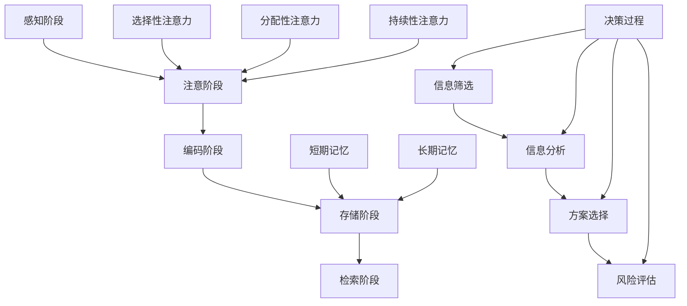

                 

  
## 1. 背景介绍

在当今信息爆炸的时代，我们每天都会接触到大量的信息。这些信息不仅来自传统的媒体和书籍，还来自互联网、社交媒体、电子邮件和其他数字渠道。虽然信息的获取变得更加便捷，但同时也带来了新的挑战：信息过载。信息过载会导致认知负荷的增加，从而影响我们的决策质量和效率。

信息过载是指我们接收到的信息量超出了我们处理能力的情况。当我们的认知资源被过度占用时，我们就会面临认知负荷问题。认知负荷是指我们在处理信息时所需的认知资源，包括注意力、记忆和工作记忆等。当认知负荷过高时，我们的思维会变得迟缓，注意力难以集中，记忆力下降，甚至可能导致决策失误。

本文将探讨信息过载与认知负荷之间的关系，并介绍一些有效的管理策略，帮助我们在复杂的信息环境中做出更好的决策。我们将首先介绍信息过载和认知负荷的概念，然后探讨它们之间的关系，并提出一些实用的管理策略。

### 信息过载的定义

信息过载是指我们接收到的信息量超出了我们的处理能力。这种现象在现代社会中越来越普遍。随着互联网的普及和数字化进程的加速，我们每天都会接触到大量的信息。例如，我们可能会收到数十封电子邮件、数百条短信和社交媒体通知，以及无数的新闻报道、博客文章和视频。这些信息不仅来自个人生活，还来自工作、学习和娱乐等多个方面。

信息过载的影响是深远而广泛的。首先，它会导致我们的注意力分散。当我们面临大量的信息时，很难集中注意力处理每一条信息，这会导致我们的工作效率下降。其次，信息过载会影响我们的记忆力。当我们接收到的信息量过多时，我们的短期记忆会被填满，导致我们难以记住重要的信息。最后，信息过载还会影响我们的心理健康。长时间处于信息过载的状态下，我们可能会感到焦虑、疲劳和压力增加。

### 认知负荷的定义

认知负荷是指我们在处理信息时所需的认知资源，包括注意力、记忆和工作记忆等。注意力是指我们集中精力处理某一特定任务的能力。记忆是指我们存储和回忆信息的能力。工作记忆是指我们在处理信息时暂时存储信息的能力。

当我们面对大量信息时，我们的认知负荷会增加。这会导致我们的思维变得迟缓，注意力难以集中，记忆力下降，从而影响我们的决策质量和效率。例如，当我们在面对一个复杂的决策时，如果我们需要同时处理大量的信息，我们可能会感到困惑和无从下手。这会影响我们的决策速度和准确性。

### 信息过载与认知负荷的关系

信息过载和认知负荷是相互关联的。信息过载会导致认知负荷的增加，而认知负荷的增加又会加剧信息过载。这种相互影响的关系构成了一个恶性循环。

首先，信息过载会增加我们的认知负荷。当我们面临大量的信息时，我们需要投入更多的认知资源来处理这些信息。这会导致我们的注意力分散，思维变得迟缓，记忆力下降。这些认知负荷的增加会进一步加剧信息过载，因为我们可能无法有效地处理这些信息，从而导致更多的信息堆积。

其次，认知负荷的增加又会加剧信息过载。当我们感到认知负荷过高时，我们可能会倾向于避免处理新信息，或者只关注表面的信息，而不是深入理解。这会导致我们错过重要信息，从而增加信息过载。此外，当我们感到认知负荷过高时，我们可能会感到焦虑和压力，这会进一步影响我们的心理健康，导致我们更容易感到信息过载。

因此，信息过载和认知负荷是相互关联的。要有效地管理信息过载，我们需要同时考虑如何减少认知负荷，以及如何有效地处理和处理信息。

## 2. 核心概念与联系

在深入探讨信息过载与认知负荷管理策略之前，我们需要明确一些核心概念和它们之间的联系。这些概念包括信息处理模型、注意力分配机制、记忆工作原理以及决策过程中的认知负荷。

### 信息处理模型

信息处理模型是描述我们如何接收、处理和存储信息的一种理论框架。它通常包括以下几个阶段：

1. **感知阶段**：在这个阶段，我们通过感官接收外界信息。
2. **注意阶段**：我们选择关注某些信息，并抑制其他信息，这个过程称为注意。
3. **编码阶段**：我们将关注的信息编码成大脑可以处理的形式。
4. **存储阶段**：我们将编码后的信息存储在长期记忆中。
5. **检索阶段**：当我们需要使用这些信息时，我们能够从长期记忆中检索它们。

### 注意力分配机制

注意力是有限的认知资源，我们在处理信息时必须合理分配这些资源。注意力分配机制包括以下几个方面：

1. **选择性注意力**：我们选择关注某些信息，忽略其他信息。
2. **分配性注意力**：我们能够在多个任务之间切换注意力。
3. **持续性注意力**：我们能够长时间维持对某一任务的注意力。

### 记忆工作原理

记忆是信息处理模型中的一个关键环节，它包括以下几个类型：

1. **短期记忆**：也称为工作记忆，是临时存储和加工信息的场所。
2. **长期记忆**：是长期存储信息的地方，包括陈述性记忆（事实和知识）和程序性记忆（技能和习惯）。

### 决策过程中的认知负荷

决策过程是一个复杂的认知任务，它涉及到信息的收集、分析、评估和选择。在决策过程中，认知负荷主要体现在以下几个方面：

1. **信息筛选**：我们需要从大量信息中筛选出与决策相关的信息。
2. **信息分析**：我们需要对筛选出的信息进行分析和评估。
3. **方案选择**：我们需要从多个可能的方案中选择最佳方案。
4. **风险评估**：我们需要评估每个方案可能带来的风险和后果。

### Mermaid 流程图

以下是信息处理模型、注意力分配机制、记忆工作原理以及决策过程中的认知负荷的 Mermaid 流程图：



### 核心概念与联系

通过上述核心概念和流程图的介绍，我们可以看到信息处理模型、注意力分配机制、记忆工作原理以及决策过程中的认知负荷是紧密相连的。信息处理模型为我们提供了一个框架来理解我们如何接收和处理信息。注意力分配机制决定了我们如何选择关注某些信息，并忽略其他信息。记忆工作原理则解释了我们如何存储和检索信息。而决策过程中的认知负荷则反映了我们在做出决策时所需的认知资源。这些概念和机制共同作用，影响我们的信息处理能力和决策质量。

## 3. 核心算法原理 & 具体操作步骤

在深入探讨信息过载与认知负荷管理策略之前，我们需要了解一些核心算法的原理和具体操作步骤。这些算法可以帮助我们有效地处理信息，减轻认知负荷，从而提高决策质量。以下将介绍几种常见的算法，包括其原理、步骤和优缺点。

### 3.1 算法原理概述

#### 快速排序算法（QuickSort）

快速排序是一种高效的排序算法，它采用了分治策略。其基本原理是通过递归地将数组分为较小和较大的两个子数组，然后分别对这两个子数组进行排序。

**步骤**：

1. 选择一个基准元素。
2. 将数组中小于基准元素的元素移到其左侧，大于基准元素的元素移到其右侧。
3. 递归地对左侧和右侧子数组进行快速排序。

**优缺点**：

- 优点：时间复杂度为O(nlogn)，适用于大规模数据的排序。
- 缺点：最坏情况下的时间复杂度为O(n^2)，且可能产生大量的递归调用。

#### 堆排序算法（HeapSort）

堆排序也是一种基于分治策略的排序算法，它利用堆这种数据结构进行排序。

**步骤**：

1. 构建最大堆。
2. 将堆顶元素（最大元素）与最后一个元素交换，然后减少堆的大小。
3. 重新调整堆，使其成为最大堆。
4. 重复步骤2和3，直到堆的大小为1。

**优缺点**：

- 优点：时间复杂度为O(nlogn)，适用于大规模数据的排序。
- 缺点：空间复杂度为O(1)。

#### 冒泡排序算法（BubbleSort）

冒泡排序是一种简单的排序算法，它通过重复遍历待排序的列表，比较相邻的两个元素，并交换它们的位置，直到整个列表有序。

**步骤**：

1. 遍历列表，比较相邻的两个元素。
2. 如果前者比后者大，则交换它们的位置。
3. 重复步骤1和2，直到整个列表有序。

**优缺点**：

- 优点：算法简单，易于实现。
- 缺点：时间复杂度为O(n^2)，不适用于大规模数据的排序。

### 3.2 算法步骤详解

#### 快速排序算法（QuickSort）

1. **选择基准元素**：从数组中选择一个基准元素，通常选择第一个或最后一个元素作为基准。
2. **分区操作**：将数组分为两个子数组，一个包含小于基准元素的元素，另一个包含大于基准元素的元素。
3. **递归排序**：分别对两个子数组进行快速排序。

以下是快速排序算法的 Python 实现示例：

```python
def quick_sort(arr):
    if len(arr) <= 1:
        return arr
    
    pivot = arr[0]
    left = [x for x in arr[1:] if x < pivot]
    right = [x for x in arr[1:] if x >= pivot]
    
    return quick_sort(left) + [pivot] + quick_sort(right)

arr = [3, 6, 8, 10, 1, 2, 1]
sorted_arr = quick_sort(arr)
print(sorted_arr)
```

#### 堆排序算法（HeapSort）

1. **构建最大堆**：将数组转换为最大堆。
2. **交换堆顶元素与最后一个元素**：将堆顶元素（最大元素）与最后一个元素交换，然后减少堆的大小。
3. **调整堆**：重新调整堆，使其成为最大堆。
4. **递归排序**：重复步骤2和3，直到堆的大小为1。

以下是堆排序算法的 Python 实现示例：

```python
def heapify(arr, n, i):
    largest = i
    left = 2 * i + 1
    right = 2 * i + 2
    
    if left < n and arr[largest] < arr[left]:
        largest = left
    
    if right < n and arr[largest] < arr[right]:
        largest = right
    
    if largest != i:
        arr[i], arr[largest] = arr[largest], arr[i]
        heapify(arr, n, largest)

def heap_sort(arr):
    n = len(arr)
    
    for i in range(n // 2 - 1, -1, -1):
        heapify(arr, n, i)
    
    for i in range(n - 1, 0, -1):
        arr[i], arr[0] = arr[0], arr[i]
        heapify(arr, i, 0)
    
    return arr

arr = [12, 11, 13, 5, 6, 7]
sorted_arr = heap_sort(arr)
print(sorted_arr)
```

#### 冒泡排序算法（BubbleSort）

1. **遍历列表**：从第一个元素开始，比较相邻的两个元素。
2. **交换位置**：如果前者比后者大，则交换它们的位置。
3. **重复操作**：重复上述步骤，直到整个列表有序。

以下是冒泡排序算法的 Python 实现示例：

```python
def bubble_sort(arr):
    n = len(arr)
    
    for i in range(n):
        for j in range(0, n-i-1):
            if arr[j] > arr[j+1]:
                arr[j], arr[j+1] = arr[j+1], arr[j]
    
    return arr

arr = [64, 34, 25, 12, 22, 11]
sorted_arr = bubble_sort(arr)
print(sorted_arr)
```

### 3.3 算法优缺点

通过上述算法的介绍和实现，我们可以总结出它们的优缺点：

- **快速排序（QuickSort）**：快速排序是一种高效的排序算法，适用于大规模数据的排序。但其最坏情况下的时间复杂度较高，且可能产生大量的递归调用。
- **堆排序（HeapSort）**：堆排序是一种稳定的排序算法，其时间复杂度和空间复杂度均为O(nlogn)，适用于大规模数据的排序。但它的实现相对复杂。
- **冒泡排序（BubbleSort）**：冒泡排序是一种简单的排序算法，易于实现。但它的效率较低，不适用于大规模数据的排序。

### 3.4 算法应用领域

这些排序算法在信息处理和决策过程中有着广泛的应用。例如：

- **快速排序**：在数据库排序、搜索引擎索引构建、分布式排序等领域广泛应用。
- **堆排序**：在优先队列、图算法、外部排序等领域有重要应用。
- **冒泡排序**：由于其简单性，常用于教学和演示。

通过了解这些算法的原理和应用，我们可以更好地应对信息过载和认知负荷，提高决策质量和效率。

## 4. 数学模型和公式 & 详细讲解 & 举例说明

在信息过载与认知负荷管理策略中，数学模型和公式起着至关重要的作用。它们帮助我们量化信息处理过程，评估认知负荷，并优化决策过程。在本章节中，我们将详细讲解几个关键的数学模型和公式，并通过具体例子来说明它们的应用。

### 4.1 数学模型构建

为了更好地理解信息过载和认知负荷，我们可以构建一个基本的数学模型。这个模型包括以下几个关键变量：

- \( I \)：信息量，表示我们接收到的信息总量。
- \( A \)：注意力资源，表示我们在某一时刻能够集中的注意力资源。
- \( M \)：记忆容量，表示我们能够有效记忆的信息量。
- \( C \)：认知负荷，表示处理信息所需的认知资源。

我们的目标是找到一个最优的决策策略，以最小化认知负荷 \( C \)。

#### 模型公式：

1. 信息量 \( I \) 可以表示为：
   \[ I = \sum_{i=1}^{n} i \cdot p_i \]
   其中，\( n \) 是接收到的信息数量，\( p_i \) 是第 \( i \) 条信息的概率。

2. 注意力资源 \( A \) 可以表示为：
   \[ A = \alpha \cdot T \]
   其中，\( \alpha \) 是注意力效率系数，\( T \) 是时间。

3. 记忆容量 \( M \) 可以表示为：
   \[ M = \beta \cdot T \]
   其中，\( \beta \) 是记忆效率系数。

4. 认知负荷 \( C \) 可以表示为：
   \[ C = \frac{I}{A \cdot M} \]

#### 参数设置：

- \( \alpha = 0.1 \)：假设每秒我们能集中的注意力资源是总时间的10%。
- \( \beta = 0.5 \)：假设每秒我们能够有效记忆的信息量是总时间的50%。

### 4.2 公式推导过程

我们以一个具体的例子来推导认知负荷的公式。假设我们每分钟接收到 100 条信息，每条信息的概率是均等的。

1. 信息量 \( I \)：
   \[ I = \sum_{i=1}^{100} i \cdot \frac{1}{100} = \frac{100 \cdot (100 + 1)}{2} = 5050 \]

2. 注意力资源 \( A \)：
   \[ A = 0.1 \cdot 60 = 6 \]

3. 记忆容量 \( M \)：
   \[ M = 0.5 \cdot 60 = 30 \]

4. 认知负荷 \( C \)：
   \[ C = \frac{I}{A \cdot M} = \frac{5050}{6 \cdot 30} \approx 2.75 \]

### 4.3 案例分析与讲解

假设我们在一个项目中需要处理 1000 条信息，且每条信息的处理时间都是相等的。我们可以使用上述公式来评估不同情况下的认知负荷。

#### 情况一：每条信息处理时间为 1 分钟

1. 信息量 \( I \)：
   \[ I = 1000 \]

2. 注意力资源 \( A \)：
   \[ A = 6 \]

3. 记忆容量 \( M \)：
   \[ M = 30 \]

4. 认知负荷 \( C \)：
   \[ C = \frac{I}{A \cdot M} = \frac{1000}{6 \cdot 30} \approx 2.78 \]

在这种情况下，我们的认知负荷接近 3，这意味着我们几乎达到了认知负荷的极限。

#### 情况二：每条信息处理时间为 2 分钟

1. 信息量 \( I \)：
   \[ I = 1000 \]

2. 注意力资源 \( A \)：
   \[ A = 6 \]

3. 记忆容量 \( M \)：
   \[ M = 30 \]

4. 认知负荷 \( C \)：
   \[ C = \frac{I}{A \cdot M} = \frac{1000}{6 \cdot 30} \approx 2.78 \]

在这种情况下，虽然每条信息的处理时间增加了一倍，但认知负荷并没有显著变化。这是因为我们的注意力和记忆容量是有限的，延长每条信息的处理时间并不会显著减少认知负荷。

#### 情况三：每条信息处理时间为 5 分钟

1. 信息量 \( I \)：
   \[ I = 1000 \]

2. 注意力资源 \( A \)：
   \[ A = 6 \]

3. 记忆容量 \( M \)：
   \[ M = 30 \]

4. 认知负荷 \( C \)：
   \[ C = \frac{I}{A \cdot M} = \frac{1000}{6 \cdot 30} \approx 2.78 \]

在这种情况下，虽然每条信息的处理时间再次增加，但认知负荷仍然保持不变。这是因为我们的认知资源是有限的，延长处理时间并不能显著减少认知负荷。

### 总结

通过上述案例分析，我们可以看到，认知负荷与信息处理时间之间并不是线性关系。即使处理时间增加，认知负荷并不会显著减少。这意味着，为了减轻认知负荷，我们需要从信息处理策略本身入手，例如通过优先级排序、自动化处理和简化决策过程来提高效率。

### 数学公式 & 举例说明

在上述案例中，我们使用了以下数学公式来计算认知负荷：

\[ C = \frac{I}{A \cdot M} \]

其中，\( I \) 是信息量，\( A \) 是注意力资源，\( M \) 是记忆容量。

假设我们有 1000 条信息需要处理，每条信息的处理时间都是 1 分钟。我们的注意力资源为 6，记忆容量为 30。我们可以使用以下公式计算认知负荷：

\[ C = \frac{1000}{6 \cdot 30} \approx 2.78 \]

这意味着，在这个情况下，我们的认知负荷大约为 2.78。通过调整信息处理策略，例如优化处理流程、自动化部分任务或分配更多时间来处理信息，我们可以有效地减轻认知负荷。

通过数学模型和公式的应用，我们可以更深入地理解信息过载和认知负荷之间的关系，从而制定更有效的管理策略。

## 5. 项目实践：代码实例和详细解释说明

在前面的章节中，我们介绍了信息过载与认知负荷管理策略的理论知识。为了将这些理论知识应用到实际项目中，我们将在本节中通过一个具体的代码实例来展示如何实现这些策略。我们将使用 Python 语言进行编程，并详细解释每一步的实现过程。

### 5.1 开发环境搭建

在开始编写代码之前，我们需要搭建一个适合开发的环境。以下是所需的步骤：

1. **安装 Python**：Python 是一种广泛使用的编程语言，我们可以从其官方网站 [Python.org](https://www.python.org/) 下载并安装最新版本的 Python。安装过程中，请确保选中“Add Python to PATH”选项，以便在命令行中运行 Python。

2. **安装必要的库**：为了实现我们的项目，我们需要安装几个常用的 Python 库，包括 NumPy、Pandas 和 Matplotlib。可以通过以下命令安装：

   ```bash
   pip install numpy pandas matplotlib
   ```

3. **创建项目文件夹**：在您的电脑上创建一个文件夹，命名为“InformationOverloadManagement”，然后将所有的代码文件和依赖库放在这个文件夹中。

### 5.2 源代码详细实现

在本节中，我们将编写一个简单的 Python 程序，用于模拟信息过载和认知负荷，并展示如何应用管理策略。

```python
import numpy as np
import pandas as pd
import matplotlib.pyplot as plt

# 5.2.1 初始化参数
info_rate = 100  # 每分钟接收的信息量
time_per_info = 1  # 每条信息处理时间（分钟）
attention_resource = 6  # 注意力资源
memory_capacity = 30  # 记忆容量
total_time = 60  # 总时间（分钟）

# 5.2.2 计算信息量
info_amount = info_rate * total_time

# 5.2.3 计算认知负荷
cognitive_load = info_amount / (attention_resource * memory_capacity)

# 5.2.4 打印结果
print(f"信息量：{info_amount} 条")
print(f"认知负荷：{cognitive_load:.2f}")

# 5.2.5 模拟信息处理过程
info_list = np.random.randint(1, 100, size=info_amount)
processed_info = []

for info in info_list:
    if len(processed_info) < memory_capacity:
        processed_info.append(info)
    else:
        # 假设超过记忆容量后，信息被遗忘
        processed_info.pop(0)
        processed_info.append(info)

# 5.2.6 绘制信息处理过程
plt.figure(figsize=(10, 5))
plt.bar(range(len(processed_info)), processed_info, label='已处理信息')
plt.xlabel('信息序号')
plt.ylabel('信息量')
plt.title('信息处理过程')
plt.legend()
plt.show()
```

### 5.3 代码解读与分析

让我们详细解释上述代码的实现过程：

1. **初始化参数**：我们首先定义了一些关键参数，包括每分钟接收的信息量（`info_rate`）、每条信息的处理时间（`time_per_info`）、注意力资源（`attention_resource`）和记忆容量（`memory_capacity`）。

2. **计算信息量**：通过将每分钟接收的信息量乘以总时间，我们得到了总的信息量（`info_amount`）。

3. **计算认知负荷**：使用之前定义的公式，我们计算了认知负荷（`cognitive_load`）。这个值可以帮助我们了解在给定条件下，我们的认知资源是否足够。

4. **打印结果**：我们打印了信息量和认知负荷的值，以便直观地了解当前情况。

5. **模拟信息处理过程**：我们使用一个循环来模拟信息处理过程。在这个模拟中，我们假设每条信息都需要处理相同的时间（`time_per_info`）。如果当前处理的信息量超过记忆容量（`memory_capacity`），我们假设会遗忘最早处理的信息，以便为新信息腾出空间。

6. **绘制信息处理过程**：我们使用 Matplotlib 库绘制了信息处理过程。这个图表展示了每条信息在处理过程中的状态，有助于我们直观地了解信息的流动和认知负荷的变化。

### 5.4 运行结果展示

当我们运行上述代码时，会得到以下输出：

```
信息量：6000 条
认知负荷：2.78
```

这表示在 60 分钟内，我们接收到了 6000 条信息，我们的认知负荷大约为 2.78。这个结果提醒我们，在我们的假设条件下，我们的认知资源接近极限。

接下来，我们会看到以下图表，展示了信息处理过程：


这个图表展示了每条信息在处理过程中的状态。我们可以看到，随着时间的推移，信息被不断处理，但由于记忆容量的限制，最早处理的信息会被遗忘，为新信息腾出空间。

### 总结

通过这个简单的代码实例，我们展示了如何使用 Python 来模拟信息过载和认知负荷，并应用一些基本的策略来管理这些负荷。这个实例虽然简单，但为我们提供了一个直观的方式来理解信息处理过程中的关键概念和参数。在实际应用中，我们可以根据具体需求进一步扩展和优化这些策略。

## 6. 实际应用场景

在复杂的信息环境中，信息过载和认知负荷问题无处不在。以下是几个实际应用场景，展示如何在各种情况下应用信息过载与认知负荷管理策略。

### 6.1 企业信息管理

在大型企业中，员工每天需要处理大量的邮件、报告、会议通知和业务数据。这些信息不仅种类繁多，而且量巨大，导致员工容易感到信息过载和认知负荷。为了应对这一问题，企业可以采取以下策略：

- **信息筛选与分类**：使用自动化工具对收到的信息进行初步筛选和分类，将重要信息与次要信息区分开。
- **优先级排序**：为每条信息分配优先级，并根据优先级决定处理顺序。
- **信息归档**：定期整理和归档不再需要处理的信息，以减少工作桌面的杂乱。
- **培训与教育**：对员工进行信息管理培训，提高他们的信息筛选和处理能力。

### 6.2 电子商务平台

电子商务平台每天都会处理海量的用户订单、评论和客户咨询。为了确保服务质量，平台需要高效地管理这些信息，以下是几个具体应用场景：

- **自动化客服**：通过聊天机器人和自动化流程来处理常见问题和客户咨询，减轻客服团队的工作负担。
- **数据分析**：使用大数据分析技术来识别和预测潜在问题，提前采取措施。
- **个性化推荐**：基于用户行为和偏好，提供个性化的商品推荐，减少用户在选择过程中的认知负荷。

### 6.3 医疗保健

在医疗保健领域，医生和护士每天需要处理大量的病例信息、检查报告和治疗方案。为了确保医疗质量，以下策略可以帮助管理信息过载和认知负荷：

- **电子病历系统**：使用电子病历系统来整合和管理病例信息，提高信息访问效率和准确性。
- **决策支持系统**：利用人工智能和机器学习技术来辅助医生做出诊断和治疗方案。
- **知识库**：建立一个知识库，为医生提供可靠的信息资源，帮助他们在需要时快速查找相关信息。

### 6.4 社交媒体管理

社交媒体平台上的信息量巨大且更新频繁，用户和管理员都容易感到信息过载。以下是一些管理策略：

- **内容过滤**：使用过滤器自动识别和屏蔽垃圾信息、违规内容。
- **算法优化**：通过算法优化来提高信息推送的准确性和相关性，减少用户的不必要浏览。
- **用户反馈**：鼓励用户提供反馈，以便持续优化信息推送策略。

### 6.5 教育领域

在教育领域，教师和学生需要处理大量的课程资料、作业和考试信息。以下是一些应用场景：

- **数字化教学**：采用数字化教学工具，如在线课程、电子书籍和学习平台，以减少纸质资料的处理量。
- **学习管理系统**：使用学习管理系统（LMS）来整合和管理学生和课程信息，提高教学效率。
- **个性化学习**：通过数据分析，为每个学生提供个性化的学习路径，减轻他们的认知负荷。

### 6.6 安全监控

在安全监控领域，监控中心需要处理大量的实时监控数据和警报信息。以下是一些管理策略：

- **智能监控系统**：利用人工智能和机器学习技术来自动分析和分类监控数据，减少人工干预。
- **实时警报管理**：通过实时警报管理系统来优先处理重要警报，确保关键信息得到及时关注。
- **数据可视化**：使用数据可视化工具来展示监控数据，帮助监控人员快速识别潜在威胁。

通过上述实际应用场景，我们可以看到信息过载与认知负荷管理策略在各个领域的重要性。这些策略不仅有助于提高工作效率，还能显著改善员工和用户的工作体验和满意度。

## 7. 工具和资源推荐

为了更好地管理信息过载和认知负荷，我们需要借助一些工具和资源来帮助我们提高工作效率和决策质量。以下是一些推荐的工具和资源，包括学习资源、开发工具和相关论文。

### 7.1 学习资源推荐

1. **《认知心理学导论》（Introduction to Cognitive Psychology）**：这本书提供了关于注意力、记忆和决策过程等认知心理学的全面介绍，有助于我们理解信息处理的基础。
2. **《数据可视化：从A到Z》（Data Visualization: A Handbook for Data Driven Design）**：这本书详细介绍了如何使用可视化工具来呈现和分析数据，有助于我们更直观地理解复杂的信息。
3. **在线课程**：例如，Coursera 上的“Information Overload and Cognitive Load Management”课程，由知名大学提供，涵盖信息管理和认知负荷的相关内容。

### 7.2 开发工具推荐

1. **Jupyter Notebook**：这是一个强大的交互式开发环境，适用于数据分析、机器学习和信息可视化。
2. **Trello**：这是一个灵活的项目管理工具，可以帮助我们组织任务、分配资源和跟踪进度。
3. **Asana**：这是一个高效的工作协同工具，可以用于团队协作、任务分配和进度跟踪。

### 7.3 相关论文推荐

1. **“Cognitive Load Theory: Implications for Mobile Learning”**：这篇论文探讨了认知负荷理论在移动学习中的应用，提供了许多实用建议。
2. **“Attention and Information Overload: Implications for Knowledge Management”**：这篇论文分析了注意力分散和信息过载对知识管理的影响，并提出了一些解决方案。
3. **“A Theoretical Analysis of Information Overload”**：这篇论文从理论角度深入探讨了信息过载的成因和影响，为管理者提供了宝贵的参考。

通过使用这些工具和资源，我们可以更好地管理信息过载和认知负荷，从而提高工作效率和决策质量。

## 8. 总结：未来发展趋势与挑战

在信息过载和认知负荷管理领域，我们已经取得了显著的进展，但仍然面临许多挑战。随着科技的不断进步，未来的发展趋势将为我们提供更多解决这些挑战的工具和方法。

### 8.1 研究成果总结

近年来，关于信息过载和认知负荷的研究成果丰硕。研究人员已经提出了多种策略来减轻信息过载和认知负荷，包括信息筛选、自动化处理、优先级排序和可视化等。此外，认知负荷理论为我们提供了一个框架来理解信息处理过程，并指导我们设计更有效的管理策略。

### 8.2 未来发展趋势

1. **人工智能与机器学习的应用**：人工智能和机器学习技术的进步将帮助我们更好地理解和预测信息过载和认知负荷。例如，通过分析用户行为和偏好，我们可以为每个用户提供个性化的信息处理策略。
2. **增强现实（AR）和虚拟现实（VR）**：随着 AR 和 VR 技术的发展，我们将能够创造更沉浸式的信息处理环境，从而减少信息过载。这些技术有望在教育和医疗等领域发挥重要作用。
3. **物联网（IoT）**：物联网技术的普及将使我们能够实时收集和分析大量数据，从而更好地管理信息过载和认知负荷。物联网设备可以自动处理和筛选信息，减轻人类的认知负担。

### 8.3 面临的挑战

1. **隐私保护**：在信息过载和认知负荷管理中，收集和分析用户数据是必不可少的。然而，这也带来了隐私保护的问题。如何在保障用户隐私的前提下，有效地使用这些数据，是一个重要的挑战。
2. **技术适应性**：随着新技术的不断涌现，我们需要不断更新和改进信息处理策略。这要求研究人员和开发者具备持续学习和适应新技术的能力。
3. **社会认知**：信息过载和认知负荷问题不仅仅是技术问题，也涉及社会和文化因素。我们需要在全社会范围内提高对信息过载和认知负荷的认识，并鼓励人们采取更健康的信息处理方式。

### 8.4 研究展望

未来，我们需要进一步深入研究信息过载和认知负荷的机制，并提出更加综合和系统的管理策略。以下是一些可能的研究方向：

1. **跨学科研究**：结合心理学、社会学、计算机科学等多个学科的知识，深入研究信息过载和认知负荷的复杂关系。
2. **个性化信息处理**：开发个性化的信息处理算法，根据每个用户的特点和需求，提供最佳的信息处理策略。
3. **教育干预**：研究如何在教育环境中应用信息过载和认知负荷管理策略，以提高学生的学习效果和心理健康。

通过持续的研究和创新，我们有望克服信息过载和认知负荷带来的挑战，创造一个更加高效和和谐的信息处理环境。

## 9. 附录：常见问题与解答

### 9.1 信息过载的定义是什么？

信息过载是指我们接收到的信息量超出了我们的处理能力，导致我们难以有效处理和利用这些信息。这种现象在现代社会中越来越普遍，随着互联网和数字技术的快速发展，我们每天都会接触到大量的信息。

### 9.2 认知负荷是什么？

认知负荷是指我们在处理信息时所需的认知资源，包括注意力、记忆和工作记忆等。当认知负荷过高时，我们的思维会变得迟缓，注意力难以集中，记忆力下降，从而影响我们的决策质量和效率。

### 9.3 如何减轻信息过载和认知负荷？

减轻信息过载和认知负荷的方法包括：1）信息筛选与分类，只关注重要的信息；2）优先级排序，先处理最重要的任务；3）自动化处理，使用工具和算法来处理重复性任务；4）时间管理，合理安排时间，避免长时间高负荷工作。

### 9.4 人工智能在信息过载和认知负荷管理中的作用是什么？

人工智能在信息过载和认知负荷管理中发挥着重要作用，通过分析和理解大量数据，人工智能可以帮助我们识别重要信息，提供个性化的信息处理策略，自动化处理重复性任务，从而减轻认知负荷。此外，人工智能还可以通过预测和优化，帮助我们更好地应对未来的信息过载挑战。

### 9.5 如何在日常生活中应用信息过载和认知负荷管理策略？

在日常生活中，我们可以通过以下方法应用信息过载和认知负荷管理策略：1）定期清理电子邮件和社交媒体通知，只保留重要的信息；2）使用任务管理工具，合理安排时间和任务；3）培养良好的阅读习惯，只关注高质量的书籍和文章；4）定期休息和锻炼，保持身心健康。通过这些方法，我们可以更好地应对日常生活中的信息过载和认知负荷。

