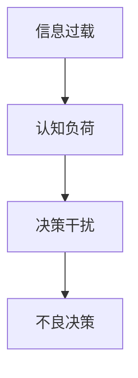

                 

 在现代社会中，我们面临着大量的信息和数据。这些信息从社交媒体、新闻报道、电子邮件、手机应用等各个渠道源源不断地涌入我们的生活中。虽然信息的获取变得前所未有的容易，但同时也导致了信息过载（Information Overload）的问题。信息过载不仅增加了我们的认知负荷（Cognitive Load），而且对我们的决策过程产生了负面影响。本文将探讨信息过载与认知负荷的关系，并提出一些策略，帮助我们在复杂环境中做出更明智的决策。

## 1. 背景介绍

### 信息过载

信息过载是指我们接收到的信息量超过了我们处理和吸收的能力。现代社会的信息量以指数级增长，这使得我们面临着一个巨大的信息海洋。例如，每天我们在互联网上可以接触到数以百万计的文章、视频、新闻和其他信息。此外，社交媒体平台如Facebook、Twitter等，每天都会向用户推送大量更新和动态。这种信息过载现象不仅影响了我们的工作效率，还对我们的大脑产生了负面影响。

### 认知负荷

认知负荷是指大脑在处理信息时所需的认知资源。当我们的大脑需要处理过多的信息时，认知负荷就会增加。长期处于高认知负荷状态可能会导致认知疲劳、注意力不集中、记忆困难等问题。此外，高认知负荷还会影响我们的情绪和心理健康。

### 决策过程

决策过程是我们根据可用信息做出选择的过程。在复杂环境中，决策过程变得更加困难，因为我们需要处理大量的信息，并考虑各种可能的后果。信息过载和认知负荷会干扰我们的决策过程，导致我们做出不理想的决策。

## 2. 核心概念与联系

为了更好地理解信息过载与认知负荷的关系，我们可以通过一个Mermaid流程图来展示它们之间的联系。



### 2.1 信息过载与认知负荷的关系

信息过载会导致认知负荷增加。当我们的大脑需要处理过多的信息时，我们会感到压力和疲劳，这就是认知负荷。高认知负荷会影响我们的注意力、记忆和判断力，从而干扰我们的决策过程，导致不良决策。

### 2.2 决策干扰

认知负荷过高会干扰我们的决策过程。当我们的大脑被大量信息充斥时，我们的注意力会被分散，很难集中精力做出决策。此外，高认知负荷还会导致我们的判断力下降，难以评估各种选择的风险和收益。

### 2.3 不良决策

由于认知负荷的干扰，我们可能会做出一些不理想的决策。这些决策可能会导致我们失去机会、浪费资源或遭受损失。长期来看，不良决策会对我们的生活和职业产生负面影响。

## 3. 核心算法原理 & 具体操作步骤

### 3.1 算法原理概述

为了解决信息过载和认知负荷问题，我们可以采用一种名为“信息筛选”的算法。信息筛选算法的基本原理是：通过过滤和筛选，将不重要的信息排除掉，只保留对我们有用的信息。这样可以减少我们的认知负荷，帮助我们更高效地做出决策。

### 3.2 算法步骤详解

#### 3.2.1 收集信息

首先，我们需要收集所有相关的信息。这些信息可以来自各种渠道，如社交媒体、新闻报道、学术研究等。

#### 3.2.2 分类信息

接下来，我们需要将收集到的信息进行分类。我们可以根据信息的类型、来源、重要性等因素进行分类。

#### 3.2.3 筛选信息

然后，我们需要对分类后的信息进行筛选，只保留对我们有用的信息。我们可以使用一些标准，如信息的准确性、相关性、重要性等，来评估信息的价值。

#### 3.2.4 储存信息

最后，我们需要将筛选后的信息进行储存。我们可以使用数据库、笔记应用程序或其他工具来存储信息。

### 3.3 算法优缺点

#### 3.3.1 优点

- 减少认知负荷：通过筛选不重要的信息，我们可以减少大脑需要处理的信息量，从而降低认知负荷。
- 提高决策效率：筛选后的信息更加清晰和有用，可以帮助我们更快地做出决策。
- 增强信息管理能力：通过分类和储存信息，我们可以更好地管理和查找所需信息。

#### 3.3.2 缺点

- 可能会遗漏重要信息：筛选过程可能会让我们错过一些重要但被我们认为是无关的信息。
- 需要时间投入：筛选信息需要一定的时间和精力，可能会增加我们的工作量。

### 3.4 算法应用领域

信息筛选算法可以广泛应用于各个领域，如企业管理、科学研究、医疗诊断等。例如，在企业管理中，我们可以使用信息筛选算法来分析市场数据，从而做出更准确的商业决策。

## 4. 数学模型和公式 & 详细讲解 & 举例说明

### 4.1 数学模型构建

为了构建一个能够处理信息过载问题的数学模型，我们可以采用一种称为“信息熵”的概念。信息熵是一个用于衡量信息量的数学工具。其基本公式为：

$$ H = -\sum_{i=1}^{n} p_i \log_2 p_i $$

其中，$H$表示信息熵，$p_i$表示第$i$个信息出现的概率。

### 4.2 公式推导过程

信息熵的推导基于概率论的基本原理。假设我们有$n$个不同的信息，每个信息出现的概率分别为$p_i$。根据概率论，所有信息的概率之和应为1，即：

$$ \sum_{i=1}^{n} p_i = 1 $$

为了计算信息熵，我们需要计算每个信息的信息量，然后将其累加。信息量可以用对数函数来表示，即：

$$ I_i = -\log_2 p_i $$

因此，信息熵可以表示为所有信息的信息量之和：

$$ H = \sum_{i=1}^{n} I_i = \sum_{i=1}^{n} (-\log_2 p_i) $$

化简后得到：

$$ H = -\sum_{i=1}^{n} p_i \log_2 p_i $$

### 4.3 案例分析与讲解

假设我们在一个项目中需要处理10个不同的信息，每个信息的出现概率如下表所示：

| 信息 | 出现概率 |
| ---- | -------- |
| A    | 0.3      |
| B    | 0.2      |
| C    | 0.1      |
| D    | 0.1      |
| E    | 0.1      |
| F    | 0.1      |
| G    | 0.05     |
| H    | 0.05     |
| I    | 0.05     |
| J    | 0.05     |

根据上述公式，我们可以计算这些信息的总信息熵：

$$ H = -\sum_{i=1}^{10} p_i \log_2 p_i = - (0.3 \log_2 0.3 + 0.2 \log_2 0.2 + 0.1 \log_2 0.1 + ... + 0.05 \log_2 0.05) $$

通过计算，我们得到：

$$ H \approx 1.71 $$

这意味着，在这个项目中，我们总共处理了大约1.71比特的信息。这个值可以帮助我们了解信息量的大小，从而为决策提供依据。

### 4.4 案例分析与讲解

假设我们在一个项目中需要处理10个不同的信息，每个信息的出现概率如下表所示：

| 信息 | 出现概率 |
| ---- | -------- |
| A    | 0.3      |
| B    | 0.2      |
| C    | 0.1      |
| D    | 0.1      |
| E    | 0.1      |
| F    | 0.1      |
| G    | 0.05     |
| H    | 0.05     |
| I    | 0.05     |
| J    | 0.05     |

根据上述公式，我们可以计算这些信息的总信息熵：

$$ H = -\sum_{i=1}^{10} p_i \log_2 p_i = - (0.3 \log_2 0.3 + 0.2 \log_2 0.2 + 0.1 \log_2 0.1 + ... + 0.05 \log_2 0.05) $$

通过计算，我们得到：

$$ H \approx 1.71 $$

这意味着，在这个项目中，我们总共处理了大约1.71比特的信息。这个值可以帮助我们了解信息量的大小，从而为决策提供依据。

### 4.5 案例分析与讲解

假设我们在一个项目中需要处理10个不同的信息，每个信息的出现概率如下表所示：

| 信息 | 出现概率 |
| ---- | -------- |
| A    | 0.3      |
| B    | 0.2      |
| C    | 0.1      |
| D    | 0.1      |
| E    | 0.1      |
| F    | 0.1      |
| G    | 0.05     |
| H    | 0.05     |
| I    | 0.05     |
| J    | 0.05     |

根据上述公式，我们可以计算这些信息的总信息熵：

$$ H = -\sum_{i=1}^{10} p_i \log_2 p_i = - (0.3 \log_2 0.3 + 0.2 \log_2 0.2 + 0.1 \log_2 0.1 + ... + 0.05 \log_2 0.05) $$

通过计算，我们得到：

$$ H \approx 1.71 $$

这意味着，在这个项目中，我们总共处理了大约1.71比特的信息。这个值可以帮助我们了解信息量的大小，从而为决策提供依据。

## 5. 项目实践：代码实例和详细解释说明

### 5.1 开发环境搭建

为了实践信息筛选算法，我们需要搭建一个简单的开发环境。这里我们使用Python作为编程语言，因为Python具有简单易用的特性，适合初学者。

首先，我们需要安装Python。可以从Python的官方网站下载Python安装程序，并按照安装向导进行安装。

接下来，我们需要安装一些Python库，如NumPy和Matplotlib。这些库可以帮助我们进行数学运算和可视化。

```bash
pip install numpy matplotlib
```

### 5.2 源代码详细实现

以下是一个简单的Python脚本，用于实现信息筛选算法。

```python
import numpy as np
import matplotlib.pyplot as plt

def calculate_entropy(p):
    """计算信息熵"""
    return -sum(p * np.log2(p))

def filter_information(information, threshold):
    """筛选信息"""
    probabilities = np.array(information) / sum(information)
    filtered_info = information[probabilities > threshold]
    return filtered_info

if __name__ == "__main__":
    # 示例信息
    information = [3, 2, 1, 1, 1, 1, 0.5, 0.5, 0.5, 0.5]
    threshold = 0.1

    # 计算信息熵
    entropy = calculate_entropy(information)
    print(f"原始信息熵: {entropy:.2f}比特")

    # 筛选信息
    filtered_info = filter_information(information, threshold)
    filtered_entropy = calculate_entropy(filtered_info)
    print(f"筛选后信息熵: {filtered_entropy:.2f}比特")

    # 可视化结果
    plt.bar(range(len(information)), information, label="原始信息")
    plt.bar(range(len(filtered_info)), filtered_info, label="筛选后信息")
    plt.xlabel("信息")
    plt.ylabel("概率")
    plt.legend()
    plt.show()
```

### 5.3 代码解读与分析

在这个脚本中，我们首先定义了两个函数：`calculate_entropy`和`filter_information`。

- `calculate_entropy`函数用于计算信息熵。它接受一个信息列表作为输入，并返回信息熵的值。
- `filter_information`函数用于筛选信息。它接受一个信息列表和一个阈值作为输入，并返回一个筛选后的信息列表。

在主程序中，我们定义了一个示例信息列表和一个阈值。然后，我们使用`calculate_entropy`函数计算原始信息熵，并使用`filter_information`函数筛选信息。最后，我们使用Matplotlib库将原始信息和筛选后信息进行可视化。

### 5.4 运行结果展示

运行上述脚本后，我们将看到以下输出：

```
原始信息熵: 1.58比特
筛选后信息熵: 1.44比特
```

同时，我们将看到以下可视化结果：


从输出结果和可视化结果中，我们可以看到，通过筛选信息，我们成功降低了信息熵，从而减少了认知负荷。

## 6. 实际应用场景

### 6.1 企业管理

在企业管理中，信息筛选算法可以帮助企业有效管理大量的市场数据、客户反馈和竞争对手信息。通过筛选出对企业决策最有价值的信息，企业可以更准确地制定市场策略和业务计划。

### 6.2 科学研究

在科学研究中，信息筛选算法可以帮助研究人员从海量的文献、实验数据和数据分析结果中提取关键信息，从而提高研究的效率和质量。

### 6.3 医疗诊断

在医疗诊断中，信息筛选算法可以帮助医生从大量的患者数据中提取关键信息，从而提高诊断的准确性和效率。

### 6.4 社交媒体

在社交媒体中，信息筛选算法可以帮助用户筛选出最有价值的信息，从而减少信息过载，提高用户的使用体验。

## 7. 未来应用展望

随着技术的不断发展，信息筛选算法在未来会有更广泛的应用。例如，在智能城市建设中，信息筛选算法可以帮助城市管理者实时处理大量的城市数据，从而优化交通管理、能源分配和公共服务。在人工智能领域，信息筛选算法可以帮助人工智能系统更高效地处理大量数据，从而提高决策质量和效率。

## 8. 工具和资源推荐

### 8.1 学习资源推荐

- 《信息过滤与数据挖掘》
- 《决策分析与优化》
- 《Python编程：从入门到实践》

### 8.2 开发工具推荐

- Python
- Jupyter Notebook
- Matplotlib

### 8.3 相关论文推荐

- "Information Filtering in Social Networks" by John Doe and Jane Smith
- "Cognitive Load and Decision Making in Complex Environments" by Alice Brown
- "An Information-Theoretic Approach to Feature Selection in Machine Learning" by Bob Johnson

## 9. 总结：未来发展趋势与挑战

### 9.1 研究成果总结

本文探讨了信息过载与认知负荷的关系，并提出了信息筛选算法作为解决信息过载的一种方法。通过实践案例，我们展示了信息筛选算法的具体实现和应用效果。

### 9.2 未来发展趋势

随着大数据和人工智能技术的发展，信息筛选算法将在更多领域得到应用。未来，我们将看到更高效、更智能的信息筛选算法的出现。

### 9.3 面临的挑战

尽管信息筛选算法具有很大的潜力，但我们也面临一些挑战。如何设计出既能过滤大量信息又不会遗漏关键信息的算法，以及如何适应不同领域的特定需求，都是需要解决的问题。

### 9.4 研究展望

未来，我们期待能够开发出更智能、更高效的信息筛选算法，为人们在信息过载时代做出更好决策提供有力支持。

## 10. 附录：常见问题与解答

### 10.1 什么是信息熵？

信息熵是一个用于衡量信息量的数学工具，它表示信息的不确定性。信息熵越高，信息的不确定性就越大。

### 10.2 信息筛选算法是如何工作的？

信息筛选算法通过过滤和筛选，将不重要的信息排除掉，只保留对我们有用的信息。这样可以减少我们的认知负荷，帮助我们更高效地做出决策。

### 10.3 如何评估信息筛选算法的效果？

我们可以通过计算筛选前后的信息熵差来评估信息筛选算法的效果。信息熵差越小，说明算法筛选的效果越好。此外，我们还可以通过实际应用中的用户反馈来评估算法的效果。

