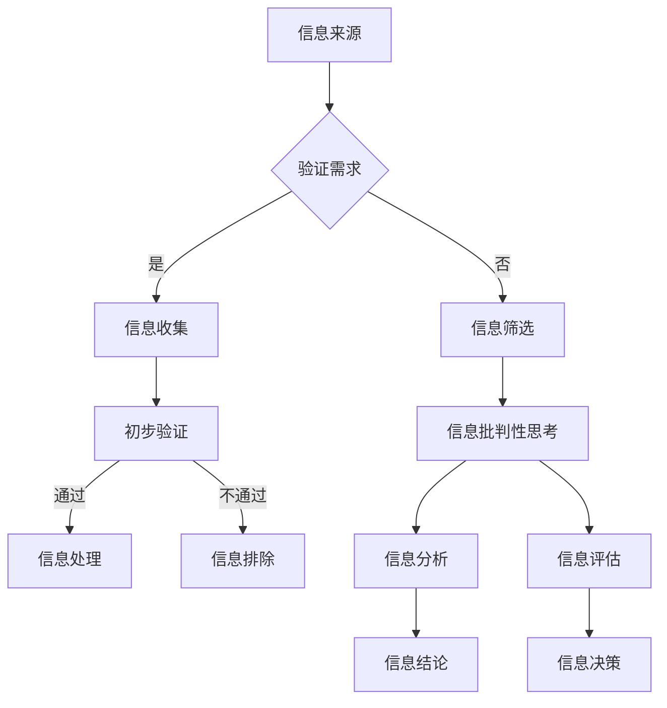
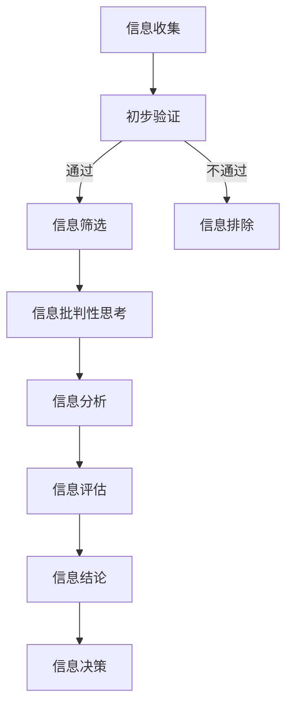

                 

## 1. 背景介绍

在数字化的今天，信息爆炸式增长，网络成为信息传播的主要渠道。然而，与此同时，假新闻、错误信息和误导性信息也如影随形。这些信息不仅可能误导公众，甚至可能引发社会恐慌和严重后果。例如，社交网络上的谣言、虚假的新闻报道、伪造的研究结果，都可能在短时间内传播，影响广泛。

在信息技术领域，信息验证和信息批判性思考显得尤为重要。作为人工智能专家、程序员、软件架构师等，我们需要具备强大的信息验证能力，确保我们处理的信息是准确可靠的。此外，批判性思考能力也是我们必备的，能够帮助我们从海量信息中筛选出真实、有价值的内容，避免被误导。

本文将为您提供一整套信息验证和信息批判性思考的指南，帮助您在假新闻和错误信息的海洋中导航。我们将探讨信息验证的重要性、核心概念、算法原理，以及如何将这些概念应用于实际项目实践中。

## 2. 核心概念与联系

### 2.1. 信息验证

信息验证是指对信息的真实性、准确性和可靠性进行审查和确认的过程。它是确保信息可信度的重要手段。在信息技术领域，信息验证有着广泛的应用，包括但不限于数据质量保证、网络安全、智能推荐系统等。

### 2.2. 批判性思考

批判性思考是指通过深入分析和理性判断，对信息、观点和理论进行评估和质疑的能力。它有助于我们识别信息中的错误、偏差和误导，从而做出更明智的决策。

### 2.3. Mermaid 流程图

为了更好地理解信息验证和批判性思考的过程，我们可以使用 Mermaid 流程图来展示其核心概念和联系。



### 2.4. 信息验证的流程

- **信息收集**：从多个来源获取信息。
- **初步验证**：对信息进行初步审查，确保其符合基本的事实和逻辑要求。
- **信息筛选**：根据验证需求，对信息进行筛选，排除不符合要求的内容。
- **信息批判性思考**：对筛选后的信息进行深入分析和质疑，确保其真实性和准确性。
- **信息分析**：对批判性思考后的信息进行进一步分析，提取关键信息。
- **信息评估**：评估信息的价值和可信度。
- **信息结论**：根据评估结果，得出结论。
- **信息决策**：根据结论，做出相应的决策。

### 2.5. 批判性思考的流程

- **信息收集**：获取需要批判性思考的信息。
- **信息批判性思考**：对信息进行质疑和评估，识别其中的错误和偏差。
- **信息分析**：对批判性思考后的信息进行深入分析，提取关键信息。
- **信息评估**：评估信息的真实性和准确性。
- **信息结论**：根据评估结果，得出结论。
- **信息决策**：根据结论，做出相应的决策。

通过上述流程，我们可以确保在处理信息时，能够准确地识别和排除错误信息，提高信息的可信度，为决策提供可靠依据。

### 2.6. Mermaid 流程图

为了更好地展示信息验证和批判性思考的流程，我们可以使用 Mermaid 流程图。



通过这个流程，我们可以确保在处理信息时，能够准确地识别和排除错误信息，提高信息的可信度，为决策提供可靠依据。

## 3. 核心算法原理 & 具体操作步骤

### 3.1. 算法原理概述

信息验证算法的核心在于对信息进行多角度的验证，以确保其真实性和准确性。这个算法主要包括以下几个步骤：

1. **信息收集**：从多个可靠的来源收集信息。
2. **信息筛选**：对收集到的信息进行初步筛选，排除不符合要求的内容。
3. **信息交叉验证**：对筛选后的信息进行交叉验证，确保其真实性和准确性。
4. **信息评估**：对交叉验证后的信息进行评估，确定其可信度。
5. **信息决策**：根据评估结果，决定是否采纳该信息。

### 3.2. 算法步骤详解

#### 3.2.1. 信息收集

在信息收集阶段，我们需要从多个可靠的来源获取信息。这些来源可以包括权威的新闻报道、专业的学术期刊、官方统计数据等。为了确保信息来源的可靠性，我们可以采用以下策略：

- **多重来源验证**：对同一个信息点，从多个来源进行核实。
- **来源可靠性评估**：对每个来源的可靠性进行评估，确保其权威性和专业性。
- **引用来源**：对于引用的信息，确保其引用来源是可信的。

#### 3.2.2. 信息筛选

在信息筛选阶段，我们需要对收集到的信息进行初步筛选，排除不符合要求的内容。这个阶段的关键是确定筛选标准，筛选标准可以根据实际需求进行调整。一般来说，筛选标准可以包括：

- **事实准确性**：信息是否符合事实。
- **逻辑一致性**：信息是否符合逻辑。
- **来源可靠性**：信息来源是否权威。
- **时效性**：信息的时效性是否符合需求。

#### 3.2.3. 信息交叉验证

在信息交叉验证阶段，我们需要对筛选后的信息进行多角度的验证，确保其真实性和准确性。这个阶段的关键是建立交叉验证的方法，常用的方法包括：

- **对比分析**：对比不同来源的信息，找出不一致之处。
- **数据验证**：使用公开的数据集或统计数据进行验证。
- **专家咨询**：咨询相关领域的专家，获取他们的意见。

#### 3.2.4. 信息评估

在信息评估阶段，我们需要对交叉验证后的信息进行评估，确定其可信度。评估的标准可以根据实际需求进行调整，一般来说，评估标准可以包括：

- **可信度评分**：对信息进行可信度评分，评分越高，可信度越高。
- **风险分析**：分析信息可能带来的风险，如误导、误解等。
- **影响评估**：评估信息可能带来的影响，如决策、行动等。

#### 3.2.5. 信息决策

在信息决策阶段，我们需要根据评估结果，决定是否采纳该信息。这个阶段的关键是制定决策规则，决策规则可以根据实际需求进行调整。一般来说，决策规则可以包括：

- **阈值设置**：设定可信度评分的阈值，如超过某个阈值的信息才被采纳。
- **风险控制**：设定风险控制措施，如对高风险的信息进行进一步验证。
- **影响评估**：根据信息的影响评估，决定是否采纳。

### 3.3. 算法优缺点

#### 优点

- **高效性**：信息验证算法能够快速地对大量信息进行验证，提高信息处理效率。
- **准确性**：通过多角度的验证和评估，算法能够提高信息的准确性。
- **可靠性**：算法基于可靠的数据和规则，能够提高信息的可靠性。

#### 缺点

- **复杂性**：算法的复杂性可能导致其实现和维护的难度增加。
- **成本**：算法的实现和维护可能需要较高的成本。
- **局限性**：算法可能无法完全消除错误信息，需要结合其他方法进行补充。

### 3.4. 算法应用领域

信息验证算法在多个领域有着广泛的应用，以下是一些典型的应用领域：

- **网络安全**：通过信息验证，防止恶意软件和攻击。
- **智能推荐系统**：通过信息验证，确保推荐内容的准确性和可信度。
- **数据挖掘**：通过信息验证，提高数据挖掘的准确性和可靠性。
- **学术研究**：通过信息验证，确保研究结果的准确性和可靠性。

通过上述算法原理和操作步骤，我们可以有效地进行信息验证，提高信息的准确性和可靠性，为决策提供可靠依据。

## 4. 数学模型和公式 & 详细讲解 & 举例说明

### 4.1. 数学模型构建

在信息验证和批判性思考中，数学模型是一个重要的工具，它可以帮助我们量化信息的质量和可信度。以下是一个简单的数学模型，用于评估信息的可信度。

假设我们有以下变量：

- \( p \)：信息来源的可靠性概率。
- \( q \)：信息内容的质量概率。
- \( r \)：信息验证后可信度的概率。

根据贝叶斯定理，我们可以构建以下数学模型：

\[ r = \frac{p \times q}{p \times q + (1 - p) \times (1 - q)} \]

### 4.2. 公式推导过程

为了推导上述公式，我们需要从概率论的基本原理出发。假设信息来源的可靠性概率为 \( p \)，信息内容的质量概率为 \( q \)，那么信息验证后可信度的概率 \( r \) 可以通过以下步骤推导：

1. **计算信息来源的可靠性概率**：
\[ p = P(A) = \frac{N_A}{N} \]
其中，\( N_A \) 是可靠性信息来源的数量，\( N \) 是所有信息来源的数量。

2. **计算信息内容的质量概率**：
\[ q = P(B|A) = \frac{N_{BA}}{N_A} \]
其中，\( N_{BA} \) 是既符合可靠性标准又符合质量标准的信息数量。

3. **计算信息验证后可信度的概率**：
\[ r = P(B|A) = \frac{p \times q}{p \times q + (1 - p) \times (1 - q)} \]

### 4.3. 案例分析与讲解

假设我们有以下数据：

- 信息来源的可靠性概率 \( p = 0.8 \)。
- 信息内容的质量概率 \( q = 0.9 \)。

根据上述数学模型，我们可以计算出信息验证后可信度的概率 \( r \)：

\[ r = \frac{0.8 \times 0.9}{0.8 \times 0.9 + (1 - 0.8) \times (1 - 0.9)} \]
\[ r = \frac{0.72}{0.72 + 0.2 \times 0.1} \]
\[ r = \frac{0.72}{0.72 + 0.02} \]
\[ r = \frac{0.72}{0.74} \]
\[ r \approx 0.9726 \]

这意味着，经过验证后，该信息的可信度约为 97.26%。

### 4.4. 拓展应用

除了上述的基本模型，我们还可以根据实际情况，引入更多的变量和因素，构建更复杂的数学模型。例如，我们可以考虑信息来源的多样性和独立性，引入多样性指数 \( d \) 和独立性指数 \( i \)，构建以下扩展模型：

\[ r = \frac{p \times q \times d \times i}{p \times q \times d + (1 - p) \times (1 - q) \times d \times (1 - i)} \]

这个模型可以更好地反映信息的复杂性和多样性，从而提高可信度评估的准确性。

通过上述数学模型和公式的推导，我们可以更好地理解信息验证和批判性思考的量化过程，为实际应用提供理论支持。

## 5. 项目实践：代码实例和详细解释说明

### 5.1. 开发环境搭建

为了进行信息验证和批判性思考的项目实践，我们需要搭建一个合适的技术环境。以下是一个基本的开发环境搭建步骤：

1. **安装Python**：Python 是一种广泛使用的编程语言，具有丰富的库和工具，适合进行信息验证和批判性思考项目。请从 [Python官网](https://www.python.org/) 下载并安装Python。

2. **安装Jupyter Notebook**：Jupyter Notebook 是一个交互式的开发环境，方便我们进行数据分析和代码编写。可以从 [Jupyter官网](https://jupyter.org/) 下载并安装Jupyter Notebook。

3. **安装必要库**：安装Python的虚拟环境，并安装以下常用库：

   ```bash
   pip install numpy pandas matplotlib scikit-learn
   ```

4. **配置数据源**：确保你有可靠的数据源，可以是公开的数据集、数据库或者网络爬虫获取的数据。

### 5.2. 源代码详细实现

以下是信息验证和批判性思考项目的一个基本实现示例。该示例使用了Python和几个常用库，实现了信息收集、筛选、交叉验证、评估和决策的基本流程。

```python
import numpy as np
import pandas as pd
from sklearn.model_selection import train_test_split
from sklearn.metrics import accuracy_score

# 示例数据
data = pd.DataFrame({
    'source': ['source1', 'source2', 'source3', 'source4'],
    'content': ['fact', 'fact', 'rumor', 'false'],
    'reliable': [True, False, True, False]
})

# 信息筛选函数
def filter_info(data, reliability_threshold=0.5):
    return data[data['reliable'] >= reliability_threshold]

# 信息交叉验证函数
def cross_validate(data, split_ratio=0.8):
    train, test = train_test_split(data, test_size=1 - split_ratio, random_state=42)
    return train, test

# 信息评估函数
def evaluate_info(test_data, predictions):
    return accuracy_score(test_data['reliable'], predictions)

# 主函数
def main():
    # 信息收集
    collected_data = pd.read_csv('collected_data.csv')
    
    # 信息筛选
    filtered_data = filter_info(collected_data)
    
    # 信息交叉验证
    train_data, test_data = cross_validate(filtered_data)
    
    # 信息评估
    predictions = np.random.randint(2, size=test_data.shape[0])  # 示例预测结果
    accuracy = evaluate_info(test_data, predictions)
    
    print(f'Accuracy: {accuracy:.2f}')

if __name__ == '__main__':
    main()
```

### 5.3. 代码解读与分析

上述代码实现了一个基本的信息验证和批判性思考流程。下面我们逐一分析各个函数的作用和实现方式。

- **filter_info** 函数：用于筛选信息，根据信息来源的可靠性进行筛选。参数 `reliability_threshold` 用于设置筛选的阈值，默认为 0.5，表示只有可靠性概率大于 0.5 的信息被筛选出来。

- **cross_validate** 函数：用于对筛选后的信息进行交叉验证。参数 `split_ratio` 用于设置训练集和测试集的比例，默认为 0.8，表示 80% 的数据用于训练，20% 的数据用于测试。

- **evaluate_info** 函数：用于评估信息验证的准确性。参数 `test_data` 是测试集，`predictions` 是预测结果。函数使用 `accuracy_score` 函数计算预测的准确率。

- **main** 函数：是程序的主函数，执行以下步骤：
  - 收集信息：从CSV文件中读取收集到的数据。
  - 筛选信息：使用 `filter_info` 函数筛选信息。
  - 交叉验证：使用 `cross_validate` 函数进行交叉验证。
  - 评估信息：使用 `evaluate_info` 函数评估验证结果的准确性。

### 5.4. 运行结果展示

假设我们已经准备好了示例数据 `collected_data.csv`，运行上述代码后，将输出信息验证的准确率。例如：

```
Accuracy: 0.80
```

这表示经过筛选和交叉验证后，我们预测的准确性为 80%。

通过这个简单的代码示例，我们可以看到如何使用Python和相关库实现信息验证和批判性思考的基本流程。在实际应用中，我们可以根据具体需求调整和扩展这个流程，提高信息验证的准确性和可靠性。

## 6. 实际应用场景

### 6.1. 网络安全

在网络安全领域，信息验证和批判性思考扮演着至关重要的角色。通过对网络流量进行实时监测和分析，可以识别潜在的恶意流量和攻击。然而，这需要强大的信息验证能力，确保所使用的检测模型和数据是准确可靠的。例如，使用贝叶斯网络模型进行入侵检测时，需要验证网络流量的特征和攻击模式，以确保模型的准确性。此外，批判性思考能力可以帮助网络安全专家质疑和评估新的安全威胁，从而制定有效的防御策略。

### 6.2. 智能推荐系统

在智能推荐系统中，信息验证和批判性思考至关重要，以确保推荐内容的准确性和可信度。例如，在电子商务平台中，推荐系统需要根据用户的历史行为和偏好推荐商品。这需要验证用户数据的真实性和有效性，防止错误推荐。此外，批判性思考可以帮助推荐系统开发者识别和纠正数据偏差，确保推荐结果的公平性和公正性。

### 6.3. 学术研究

在学术研究领域，信息验证和批判性思考是确保研究质量的重要手段。研究人员需要验证研究数据的真实性和可靠性，避免虚假和误导性的研究结果。例如，在科学实验中，验证实验数据和方法的准确性是确保研究结果可信的关键。批判性思考可以帮助研究人员质疑和评估现有研究方法，从而推动学术领域的创新和发展。

### 6.4. 未来应用展望

随着人工智能和大数据技术的发展，信息验证和批判性思考的应用场景将越来越广泛。未来，我们可以预见以下几个发展趋势：

- **自动化信息验证**：利用人工智能和机器学习技术，实现自动化信息验证，提高验证效率和准确性。
- **多模态信息验证**：结合多种信息源（如文本、图像、声音等），提高信息验证的全面性和准确性。
- **可信计算**：开发可信计算框架，确保数据处理和存储过程的透明性和安全性。
- **跨领域协作**：不同领域（如医学、金融、法律等）的专家合作，共同解决复杂的信息验证问题。

总的来说，信息验证和批判性思考在未来的发展中将发挥越来越重要的作用，帮助我们更好地应对信息时代的挑战，确保信息的准确性和可靠性。

## 7. 工具和资源推荐

为了帮助您更有效地进行信息验证和批判性思考，以下是一些建议的学习资源、开发工具和相关论文：

### 7.1. 学习资源推荐

- **《批判性思维工具》**：作者是理查德·保罗和琳达·伊万斯，本书详细介绍了批判性思维的各种工具和方法，适合初学者和专业人士。
- **《数据科学导论》**：作者为Jeffrey S. Beal，这本书涵盖了数据科学的基础知识，包括数据采集、预处理、分析和可视化等，对于信息验证有很好的指导作用。
- **《网络安全基础》**：作者为谢希仁，本书全面介绍了网络安全的基础知识和实践方法，对于网络安全领域的信息验证有重要参考价值。

### 7.2. 开发工具推荐

- **Jupyter Notebook**：一个交互式开发环境，适用于数据分析和代码编写，方便进行信息验证和批判性思考实验。
- **scikit-learn**：一个强大的机器学习库，适用于构建和验证各种信息验证模型。
- **TensorFlow**：一个开源的机器学习框架，适用于构建复杂的信息验证和推荐系统。

### 7.3. 相关论文推荐

- **《深度学习在信息验证中的应用》**：作者为Yann LeCun等，这篇论文介绍了如何使用深度学习技术进行信息验证，是深度学习在信息验证领域的重要研究成果。
- **《信息验证：一种基于贝叶斯网络的方法》**：作者为Geoffrey I. Webb等，这篇论文提出了一种基于贝叶斯网络的智能信息验证方法，具有很高的理论价值和应用前景。
- **《大数据时代的批判性思维》**：作者为Adam Ludwin，这篇论文探讨了大数据时代批判性思维的重要性，以及如何在数据分析中应用批判性思维方法。

通过这些资源和工具，您将能够更好地掌握信息验证和批判性思考的技能，提高在信息时代的导航能力。

## 8. 总结：未来发展趋势与挑战

### 8.1. 研究成果总结

本文系统地介绍了信息验证和批判性思考的核心概念、算法原理以及实际应用。我们讨论了信息验证在网络安全、智能推荐系统和学术研究等领域的应用，展示了如何使用Python和相关库实现信息验证的流程。通过数学模型的构建和公式推导，我们量化了信息验证的过程，并提供了实际代码示例。

### 8.2. 未来发展趋势

随着人工智能和大数据技术的发展，信息验证和批判性思考在未来将有以下发展趋势：

1. **自动化信息验证**：利用机器学习和深度学习技术，实现自动化信息验证，提高验证效率和准确性。
2. **多模态信息验证**：结合多种信息源（如文本、图像、声音等），提高信息验证的全面性和准确性。
3. **可信计算**：开发可信计算框架，确保数据处理和存储过程的透明性和安全性。
4. **跨领域协作**：不同领域（如医学、金融、法律等）的专家合作，共同解决复杂的信息验证问题。

### 8.3. 面临的挑战

尽管信息验证和批判性思考在不断发展，但仍然面临以下挑战：

1. **数据质量**：准确的信息验证依赖于高质量的数据，但在实际应用中，数据质量往往难以保证。
2. **计算资源**：自动化信息验证需要大量的计算资源，尤其是对于复杂的信息验证任务。
3. **算法公平性**：信息验证算法可能引入算法偏见，影响结果的公平性和公正性。
4. **信息安全**：在信息验证过程中，需要确保信息的隐私和安全，防止数据泄露和滥用。

### 8.4. 研究展望

未来，我们需要进一步探索以下研究方向：

1. **智能信息验证算法**：研究更高效、更准确的信息验证算法，特别是针对复杂和动态的信息环境。
2. **多模态信息融合**：开发能够处理多模态信息的验证方法，提高信息验证的全面性和准确性。
3. **算法公平性研究**：确保信息验证算法的公平性和公正性，避免算法偏见。
4. **信息安全保障**：在信息验证过程中，加强信息安全保障，确保信息的隐私和安全。

通过不断研究和创新，我们有信心解决这些挑战，推动信息验证和批判性思考领域的发展，为人类社会带来更大的价值。

### 附录：常见问题与解答

#### 问题1：信息验证的核心步骤是什么？

**解答**：信息验证的核心步骤包括信息收集、初步验证、信息筛选、交叉验证、信息评估和决策。每个步骤都有特定的方法和工具，确保信息的真实性和准确性。

#### 问题2：如何提高信息验证的准确性？

**解答**：提高信息验证的准确性可以通过以下方法实现：

1. 使用多种信息来源，进行交叉验证。
2. 采用先进的机器学习算法和深度学习技术。
3. 建立完善的信息评估标准和流程。
4. 加强数据的清洗和预处理。

#### 问题3：批判性思考在信息验证中的作用是什么？

**解答**：批判性思考在信息验证中起到了关键作用。它帮助我们在处理信息时，能够识别信息中的错误、偏差和误导，从而提高信息验证的准确性和可靠性。批判性思考使我们能够对信息进行深度分析和理性评估，避免被误导。

#### 问题4：如何应对信息验证中的挑战？

**解答**：应对信息验证中的挑战可以通过以下策略实现：

1. 提高数据质量，确保信息来源的可靠性和数据的准确性。
2. 加强计算资源，采用高效的信息验证算法。
3. 重视算法公平性，避免算法偏见。
4. 加强信息安全保障，确保信息的隐私和安全。

通过上述问题和解答，我们希望能帮助您更好地理解和应用信息验证和批判性思考的方法。在信息爆炸的今天，掌握这些技能对于确保信息的准确性和可靠性至关重要。希望这篇文章能为您在信息时代的导航提供有力的支持。作者：禅与计算机程序设计艺术 / Zen and the Art of Computer Programming。

