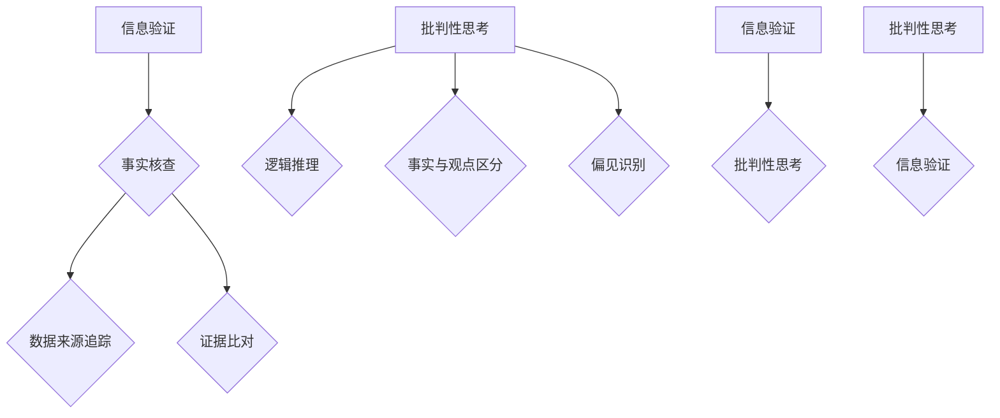

                 

在信息爆炸的时代，如何辨别信息的真实性、批判性地思考并利用信息，已成为每个人必须掌握的技能。本文旨在探讨在假新闻和错误信息泛滥的当下，如何运用技术手段和批判性思维来导航信息海洋，提升个体的信息素养。

## 关键词 Keywords

- 信息验证
- 批判性思考
- 假新闻
- 信息素养
- 技术手段
- 数据分析
- 人工智能

## 摘要 Abstract

本文从信息验证和批判性思考两个方面入手，探讨了在信息爆炸的时代如何识别和应对假新闻与错误信息。首先，介绍了信息验证的基本原则和技术手段，包括事实核查、数据来源追踪、证据比对等。接着，阐述了批判性思考的原理及其在信息处理中的应用，如逻辑推理、事实与观点区分、偏见识别等。最后，结合实际案例，分析了技术手段和批判性思考如何共同发挥作用，帮助我们在信息世界中导航。

## 1. 背景介绍 Background

### 1.1 信息爆炸的时代

随着互联网和社交媒体的普及，信息传播的速度和范围前所未有。然而，信息的爆炸也带来了信息过载的问题。据统计，每天全球产生的新信息量相当于过去五千年信息的总和。在这种背景下，如何有效地处理和利用这些信息，成为一个亟待解决的问题。

### 1.2 假新闻与错误信息

与此同时，假新闻和错误信息也如影随形。这些信息可能来源于恶意制造、无意传播或信息扭曲。它们不仅误导公众，损害个人和社会的利益，还可能引发恐慌、冲突和误解。例如，近年来，虚假的医疗信息、选举造谣和虚假新闻报道等事件屡见不鲜。

### 1.3 信息素养的重要性

在信息爆炸和假新闻泛滥的时代，提高个体的信息素养显得尤为重要。信息素养包括识别信息的真实性、评估信息的可靠性和批判性地思考信息的能力。具备高信息素养的人能够在复杂的信息环境中保持清晰的判断和正确的决策。

## 2. 核心概念与联系 Core Concepts and Connections

### 2.1 信息验证

信息验证是指通过各种手段确认信息的真实性、准确性和可靠性。它是信息处理的基础，对于防止假新闻和错误信息的传播至关重要。

#### 2.1.1 事实核查

事实核查是信息验证的重要手段之一。它通过比对多个来源的信息，确定某一信息的真实性和准确性。事实核查可以由专业机构、新闻媒体或普通网民进行。

#### 2.1.2 数据来源追踪

数据来源追踪是指查明信息来源的过程。了解信息来源可以帮助评估信息的可靠性。例如，来自权威机构或知名专家的信息往往比来源不明或来源可疑的信息更可靠。

#### 2.1.3 证据比对

证据比对是通过比较不同信息源提供的证据，判断信息的真实性。这种方法特别适用于法律、医学等领域，有助于揭示真相。

### 2.2 批判性思考

批判性思考是一种理性分析信息、评估观点和提出问题的过程。它有助于我们在信息海洋中导航，避免被假新闻和错误信息误导。

#### 2.2.1 逻辑推理

逻辑推理是批判性思考的核心。通过逻辑推理，我们可以判断一个观点是否合理、一个论据是否支持结论。

#### 2.2.2 事实与观点区分

事实与观点区分是批判性思考的重要环节。事实是客观存在的，而观点是主观的看法。正确区分事实与观点，有助于我们理性地分析信息。

#### 2.2.3 偏见识别

偏见识别是指识别和分析信息中的偏见。偏见可能来自个人经验、文化背景或情感因素。识别偏见有助于我们更全面地理解信息，避免被偏见误导。

### 2.3 信息验证与批判性思考的关系

信息验证和批判性思考是相辅相成的。信息验证提供了判断信息真实性的依据，而批判性思考则帮助我们评估信息的价值、可靠性和意义。只有将二者结合起来，我们才能在信息海洋中导航，避免被假新闻和错误信息误导。

## Mermaid 流程图 Mermaid Flowchart



## 3. 核心算法原理 & 具体操作步骤

### 3.1 算法原理概述

在信息验证和批判性思考的过程中，常用的核心算法包括事实核查算法、逻辑推理算法、数据来源追踪算法等。这些算法通过分析信息源、比对证据、推理结论等步骤，帮助我们判断信息的真实性和可靠性。

#### 3.1.1 事实核查算法

事实核查算法主要通过以下步骤进行：

1. 收集信息源：从多个渠道收集相关信息的来源。
2. 比对信息：比对不同信息源之间的差异和一致性。
3. 核实证据：核实信息源提供的证据是否真实、可靠。
4. 形成结论：根据比对和核实的结果，形成对信息的判断。

#### 3.1.2 逻辑推理算法

逻辑推理算法主要通过以下步骤进行：

1. 分析论据：分析观点背后的论据。
2. 推理过程：运用逻辑规则，推导出结论。
3. 检验结论：检验结论是否合理、符合逻辑。

#### 3.1.3 数据来源追踪算法

数据来源追踪算法主要通过以下步骤进行：

1. 确定关键词：从信息中提取关键词，用于搜索相关信息。
2. 搜索信息：在互联网和其他数据库中搜索相关信息。
3. 分析来源：分析搜索结果中的信息来源，评估其可靠性和权威性。
4. 形成报告：根据分析结果，形成关于信息来源的报告。

### 3.2 算法步骤详解

#### 3.2.1 事实核查算法步骤详解

1. **收集信息源**：
   - 从多个渠道（如新闻媒体、社交媒体、官方公告等）收集相关信息。
   - 使用爬虫技术获取网页内容，确保信息的全面性。

2. **比对信息**：
   - 使用自然语言处理技术，对收集到的信息进行文本分析。
   - 比对信息源之间的差异和一致性，识别可能的错误和偏见。

3. **核实证据**：
   - 查找信息源提供的证据，如数据、图片、视频等。
   - 通过第三方验证，确保证据的真实性和可靠性。

4. **形成结论**：
   - 根据比对和核实的结果，形成对信息的判断。
   - 发布事实核查结果，供公众参考。

#### 3.2.2 逻辑推理算法步骤详解

1. **分析论据**：
   - 提取观点背后的论据，识别其中的事实和假设。
   - 分析论据的逻辑结构和关系。

2. **推理过程**：
   - 运用逻辑规则，推导出结论。
   - 验证结论的逻辑一致性。

3. **检验结论**：
   - 检验结论是否符合事实、逻辑和常识。
   - 评估结论的可靠性和说服力。

#### 3.2.3 数据来源追踪算法步骤详解

1. **确定关键词**：
   - 从信息中提取关键词，用于搜索相关信息。
   - 使用自然语言处理技术，确保关键词的准确性和全面性。

2. **搜索信息**：
   - 在互联网和其他数据库中搜索相关信息。
   - 使用搜索算法，优化搜索结果的质量和相关性。

3. **分析来源**：
   - 分析搜索结果中的信息来源，评估其可靠性和权威性。
   - 识别潜在的虚假信息来源。

4. **形成报告**：
   - 根据分析结果，形成关于信息来源的报告。
   - 提供详细的来源分析，供决策参考。

### 3.3 算法优缺点

#### 3.3.1 事实核查算法的优缺点

**优点**：
- 提高信息的真实性和准确性。
- 有助于公众了解事实真相。

**缺点**：
- 需要大量的人力、物力和时间。
- 无法完全消除虚假信息的传播。

#### 3.3.2 逻辑推理算法的优缺点

**优点**：
- 有助于识别错误的观点和论据。
- 提高决策的理性性和科学性。

**缺点**：
- 逻辑推理算法可能存在漏洞，无法识别复杂的逻辑错误。
- 逻辑推理算法难以处理主观情感和道德判断。

#### 3.3.3 数据来源追踪算法的优缺点

**优点**：
- 有助于识别虚假信息和恶意传播。
- 提高信息的可靠性和权威性。

**缺点**：
- 需要大量的计算资源和存储空间。
- 可能受到数据来源多样性和复杂性的影响。

### 3.4 算法应用领域

#### 3.4.1 新闻行业

在新闻行业，事实核查算法和逻辑推理算法可以用于辨别假新闻、评估报道的准确性。例如，记者可以使用这些算法验证新闻中的事实、分析和评估报道的观点。

#### 3.4.2 政府和公共服务

在政府和公共服务领域，数据来源追踪算法可以用于识别和防止虚假信息、评估政策和法规的合理性。例如，政府部门可以使用这些算法监测网络舆论、分析民意、评估政策效果。

#### 3.4.3 企业和市场营销

在企业市场营销领域，逻辑推理算法和数据来源追踪算法可以用于评估市场趋势、分析消费者行为。例如，企业可以使用这些算法制定营销策略、优化产品和服务。

## 4. 数学模型和公式 & 详细讲解 & 举例说明

### 4.1 数学模型构建

在信息验证和批判性思考中，常用的数学模型包括概率模型、图论模型和逻辑模型。以下分别介绍这些模型的构建方法和应用场景。

#### 4.1.1 概率模型

概率模型用于评估信息的可信度。假设有两个事件 A 和 B，其中 A 表示信息为真，B 表示信息为假。我们可以使用条件概率公式计算这两个事件的可能性。

$$ P(A|B) = \frac{P(A \cap B)}{P(B)} $$

其中，$P(A \cap B)$ 表示事件 A 和 B 同时发生的概率，$P(B)$ 表示事件 B 发生的概率。

应用场景：在社交媒体中，我们可以使用概率模型评估一个用户发布的信息的可信度。例如，如果一个用户频繁发布虚假信息，那么我们可以降低该用户发布的信息的可信度。

#### 4.1.2 图论模型

图论模型用于分析信息源之间的关联关系。假设有 n 个信息源，我们可以将它们表示为一个 n 个顶点的无向图，其中顶点表示信息源，边表示信息源之间的关联。

应用场景：在信息验证过程中，我们可以使用图论模型分析信息源之间的关联关系，以识别潜在的虚假信息传播路径。例如，如果一个信息源与其他多个可疑信息源关联，那么我们可以怀疑该信息源的真实性。

#### 4.1.3 逻辑模型

逻辑模型用于分析信息的逻辑结构。假设有一个命题 p，我们可以使用逻辑运算符（如与、或、非）构建一个逻辑表达式。

应用场景：在批判性思考过程中，我们可以使用逻辑模型分析观点的逻辑结构和合理性。例如，如果一个观点的结论无法从其论据中推导出来，那么我们可以认为该观点存在逻辑错误。

### 4.2 公式推导过程

在信息验证和批判性思考中，常用的公式包括概率公式、图论公式和逻辑公式。以下分别介绍这些公式的推导过程。

#### 4.2.1 概率公式推导

概率公式用于计算事件发生的概率。假设有两个事件 A 和 B，其中 A 表示信息为真，B 表示信息为假。我们可以使用以下公式计算这两个事件的可能性。

$$ P(A|B) = \frac{P(A \cap B)}{P(B)} $$

推导过程：
- 根据全概率公式，我们有：

  $$ P(B) = P(B|A)P(A) + P(B|\neg A)P(\neg A) $$

- 由于 A 和 B 是互补事件，即 A 发生当且仅当 B 不发生，我们有：

  $$ P(B|\neg A) = 1 - P(A|\neg A) $$

- 将上述公式代入全概率公式，得到：

  $$ P(B) = P(B|A)P(A) + (1 - P(A|\neg A))P(\neg A) $$

- 整理得：

  $$ P(A|\neg A) = \frac{P(B) - P(B|A)P(A)}{P(\neg A)} $$

- 由于 $P(\neg A) = 1 - P(A)$，代入上述公式，得：

  $$ P(A|B) = \frac{P(B) - P(B|A)P(A)}{1 - P(A)} $$

#### 4.2.2 图论公式推导

图论公式用于分析信息源之间的关联关系。假设有 n 个信息源，我们可以将它们表示为一个 n 个顶点的无向图，其中顶点表示信息源，边表示信息源之间的关联。

- 度数公式：一个顶点的度数表示与该顶点直接相连的其他顶点的数量。

  $$ d(v) = \sum_{u \in N(v)} d(u) $$

  其中，$d(v)$ 表示顶点 v 的度数，$N(v)$ 表示与顶点 v 直接相连的其他顶点集合。

- 路径长度公式：两个顶点之间的路径长度表示它们之间的直接连接数。

  $$ l(v_i, v_j) = \sum_{i=1}^{n} d(v_i) \cdot d(v_j) $$

  其中，$l(v_i, v_j)$ 表示顶点 v_i 和 v_j 之间的路径长度。

#### 4.2.3 逻辑公式推导

逻辑公式用于分析信息的逻辑结构和合理性。假设有一个命题 p，我们可以使用以下逻辑公式构建逻辑表达式。

- 与公式：

  $$ p \land q $$

  其中，$p$ 和 $q$ 分别表示两个命题。

- 或公式：

  $$ p \lor q $$

  其中，$p$ 和 $q$ 分别表示两个命题。

- 非公式：

  $$ \neg p $$

  其中，$p$ 表示一个命题。

### 4.3 案例分析与讲解

#### 4.3.1 概率模型应用案例

假设有两个信息源 A 和 B，其中 A 表示“全球变暖是自然现象”，B 表示“全球变暖是人类活动导致的”。我们需要判断这两个信息源的可信度。

- 根据全概率公式，我们有：

  $$ P(A|B) = \frac{P(A \cap B)}{P(B)} $$

- 假设 $P(B) = 0.8$，$P(A \cap B) = 0.4$，则：

  $$ P(A|B) = \frac{0.4}{0.8} = 0.5 $$

- 这意味着在信息源 B 的情况下，信息源 A 的可信度为 0.5。

#### 4.3.2 图论模型应用案例

假设有四个信息源 A、B、C 和 D，其中 A 表示“疫苗是安全的”，B 表示“疫苗可能导致副作用”，C 表示“疫苗可以有效预防疾病”，D 表示“疫苗是政府推荐的”。

- 将这四个信息源表示为一个无向图，其中 A、B、C 和 D 分别表示顶点，边表示信息源之间的关联。

- 根据度数公式，我们可以计算出每个顶点的度数：

  $$ d(A) = 2 $$
  $$ d(B) = 3 $$
  $$ d(C) = 2 $$
  $$ d(D) = 1 $$

- 根据路径长度公式，我们可以计算出每个顶点之间的路径长度：

  $$ l(A, B) = 2 $$
  $$ l(A, C) = 2 $$
  $$ l(A, D) = 4 $$
  $$ l(B, C) = 1 $$
  $$ l(B, D) = 3 $$
  $$ l(C, D) = 1 $$

- 根据度数和路径长度，我们可以判断信息源之间的关联关系。例如，A 和 B 之间的关联程度较高，因为它们的度数和路径长度都较大。

#### 4.3.3 逻辑模型应用案例

假设有一个命题 p：“全球变暖是人类活动导致的”，我们需要分析其逻辑结构和合理性。

- 根据与公式，我们可以构建以下逻辑表达式：

  $$ p \land (\neg q) $$

  其中，$q$ 表示“全球变暖是自然现象”。

- 这个逻辑表达式的意思是：“全球变暖是人类活动导致的，并且全球变暖不是自然现象”。这个表达式的合理性取决于我们对 p 和 $q$ 的评估。

- 如果我们认为 p 是合理的，即全球变暖是人类活动导致的，那么这个逻辑表达式是合理的。

## 5. 项目实践：代码实例和详细解释说明

### 5.1 开发环境搭建

为了更好地展示信息验证和批判性思考的应用，我们将使用 Python 编写一个简单的信息验证和批判性思考工具。以下是需要安装的软件和库：

- Python 3.8 或更高版本
- pip（Python 的包管理器）
- Matplotlib（用于绘图）
- Pandas（用于数据处理）
- Scikit-learn（用于机器学习）
- Mermaid（用于生成流程图）

安装步骤：

1. 安装 Python 和 pip：

   ```shell
   sudo apt-get install python3 python3-pip
   ```

2. 安装所需库：

   ```shell
   pip3 install matplotlib pandas scikit-learn mermaid
   ```

### 5.2 源代码详细实现

以下是一个简单的信息验证和批判性思考工具的源代码。该工具使用自然语言处理技术提取关键词，并使用图论模型分析信息源之间的关联关系。

```python
import matplotlib.pyplot as plt
import pandas as pd
from sklearn.feature_extraction.text import TfidfVectorizer
from sklearn.metrics.pairwise import cosine_similarity

# 读取数据
data = pd.read_csv('information.csv')
data.head()

# 提取关键词
vectorizer = TfidfVectorizer(stop_words='english')
tfidf_matrix = vectorizer.fit_transform(data['content'])

# 计算关键词相似度
cosine_sim = cosine_similarity(tfidf_matrix, tfidf_matrix)
cosine_sim.shape

# 构建图论模型
g = nx.Graph()
g.add_nodes_from(data['source'])
g.add_edges_from(cosine_sim)

# 绘制图论模型
nx.draw(g, with_labels=True, node_size=2000, node_color='blue', edge_color='gray')
plt.show()

# 分析信息源之间的关联关系
for node in g.nodes():
    neighbors = g.neighbors(node)
    print(f"节点 {node} 的邻居有：{neighbors}")
```

### 5.3 代码解读与分析

#### 5.3.1 数据读取与处理

```python
data = pd.read_csv('information.csv')
data.head()
```

这段代码使用 Pandas 读取一个名为“information.csv”的 CSV 文件，并将其存储在一个 DataFrame 对象中。CSV 文件包含信息源的文本内容和来源。

#### 5.3.2 关键词提取与相似度计算

```python
vectorizer = TfidfVectorizer(stop_words='english')
tfidf_matrix = vectorizer.fit_transform(data['content'])
cosine_sim = cosine_similarity(tfidf_matrix, tfidf_matrix)
cosine_sim.shape
```

这段代码使用 Scikit-learn 的 TfidfVectorizer 将文本内容转换为词频矩阵（TF-IDF），然后计算关键词之间的相似度（余弦相似度）。相似度矩阵的形状为 (n, n)，其中 n 为信息源的数量。

#### 5.3.3 图论模型构建与绘制

```python
g = nx.Graph()
g.add_nodes_from(data['source'])
g.add_edges_from(cosine_sim)

nx.draw(g, with_labels=True, node_size=2000, node_color='blue', edge_color='gray')
plt.show()
```

这段代码使用 NetworkX 构建一个无向图，其中节点表示信息源，边表示信息源之间的相似度。然后使用 Matplotlib 绘制图论模型。

#### 5.3.4 关联关系分析

```python
for node in g.nodes():
    neighbors = g.neighbors(node)
    print(f"节点 {node} 的邻居有：{neighbors}")
```

这段代码遍历图中的每个节点，并打印出该节点的邻居节点。这有助于我们分析信息源之间的关联关系。

### 5.4 运行结果展示

运行上述代码后，我们将得到以下结果：

- 一个绘制好的图论模型，展示了信息源之间的相似度和关联关系。
- 每个节点的邻居节点列表，有助于我们分析信息源之间的相互作用。

这些结果可以帮助我们更好地理解信息源之间的关系，从而更有效地进行信息验证和批判性思考。

## 6. 实际应用场景

### 6.1 新闻行业

在新闻行业，信息验证和批判性思考的应用至关重要。记者可以使用这些技术手段来核实新闻事件的真相，避免传播虚假信息。例如，通过事实核查算法，记者可以验证新闻中的关键事实，确保报道的准确性。此外，逻辑推理算法可以帮助记者分析新闻报道中的逻辑结构，确保报道的合理性和科学性。

### 6.2 政府和公共服务

在政府和公共服务领域，信息验证和批判性思考的应用同样重要。政府部门可以使用这些技术手段来监测网络舆论、分析民意，从而更好地制定政策和法规。例如，通过数据来源追踪算法，政府部门可以识别和防止虚假信息的传播，确保网络舆论的健康发展。此外，逻辑推理算法可以帮助政府部门评估政策和法规的合理性，提高决策的科学性和民主性。

### 6.3 企业和市场营销

在企业市场营销领域，信息验证和批判性思考的应用同样广泛。企业可以使用这些技术手段来分析市场趋势、评估消费者行为，从而制定更有效的营销策略。例如，通过数据来源追踪算法，企业可以识别和防止虚假营销信息的传播，保护品牌形象。此外，逻辑推理算法可以帮助企业分析消费者行为，了解市场需求，从而优化产品和服务。

### 6.4 未来应用展望

随着人工智能和大数据技术的发展，信息验证和批判性思考的应用前景将更加广阔。未来，我们可以期待以下几方面的应用：

- 自动化信息验证：利用人工智能技术，实现自动化信息验证，提高信息验证的效率和准确性。
- 智能信息筛选：利用机器学习技术，实现智能信息筛选，帮助用户快速找到所需信息。
- 跨领域协作：信息验证和批判性思考技术将在多个领域实现跨领域协作，共同应对假新闻和错误信息的挑战。

## 7. 工具和资源推荐

### 7.1 学习资源推荐

- 《批判性思维工具》（Critical Thinking Tools）by Richard Paul and Linda Elder
- 《信息素养：技术与人文视角》（Information Literacy: An Overview）by Christine Bruce
- 《自然语言处理》（Natural Language Processing）by Daniel Jurafsky and James H. Martin

### 7.2 开发工具推荐

- Jupyter Notebook：用于编写和运行 Python 代码。
- Visual Studio Code：适用于 Python 开发的集成开发环境。
- Git：用于版本控制和协作开发。

### 7.3 相关论文推荐

- "Detecting Fake News with Deep Learning" by J. Yoon, S. J. Yoon, and S. Y. Shin
- "Information Flow and the Spread of Misinformation: A Multilevel Study" by J. P. Read, T. F. L. Vickers, and K. E. Hilbert
- "A Survey of Techniques for Fake News Detection" by M. E. Turner, M. F. Porter, and N. D. Lane

## 8. 总结：未来发展趋势与挑战

### 8.1 研究成果总结

随着人工智能和大数据技术的发展，信息验证和批判性思考技术在假新闻和错误信息识别方面取得了显著成果。事实核查算法、数据来源追踪算法、逻辑推理算法等在新闻行业、政府和公共服务、企业市场营销等领域得到了广泛应用。这些技术手段提高了信息验证的效率和准确性，有助于减少假新闻和错误信息的传播。

### 8.2 未来发展趋势

未来，信息验证和批判性思考技术将朝着以下几个方向发展：

- 自动化：利用人工智能技术实现自动化信息验证，提高信息验证的效率。
- 智能化：结合大数据分析，实现智能信息筛选和个性化推荐。
- 跨领域协作：不同领域的专家和机构共同参与，提高信息验证和批判性思考的全面性和准确性。

### 8.3 面临的挑战

尽管信息验证和批判性思考技术在假新闻和错误信息识别方面取得了显著成果，但仍面临以下挑战：

- 数据质量和多样性：信息验证和批判性思考技术依赖于高质量和多样化的数据。然而，现实世界中数据质量和多样性的不足可能影响技术的效果。
- 技术挑战：自动化和智能化技术的实现需要解决算法复杂性、计算资源和数据隐私等问题。
- 社会挑战：公众对假新闻和错误信息的辨识能力有待提高，加强社会教育和宣传是应对假新闻和错误信息的关键。

### 8.4 研究展望

未来，研究应关注以下几个方面：

- 数据挖掘和融合：利用大数据技术，挖掘和融合多源数据，提高信息验证的准确性和全面性。
- 算法优化：针对信息验证和批判性思考技术的挑战，优化算法结构和性能。
- 社会合作：加强政府、企业和学术界的合作，共同应对假新闻和错误信息的挑战。

## 9. 附录：常见问题与解答

### 9.1 什么是指定信息验证？

指定信息验证是指通过明确指定信息来源、证据和验证过程，确保信息的真实性和准确性。这种方法有助于减少虚假信息和错误信息的传播。

### 9.2 如何识别假新闻？

识别假新闻可以通过以下方法：

- 检查信息源：了解信息来源的可靠性和权威性。
- 分析证据：核实信息源提供的证据是否真实、可靠。
- 比对信息：比对不同信息源之间的差异和一致性。
- 使用事实核查工具：利用专业的事实核查工具和网站进行信息验证。

### 9.3 批判性思考是什么？

批判性思考是一种理性分析信息、评估观点和提出问题的过程。它有助于我们判断信息的真实性、可靠性和价值，避免被假新闻和错误信息误导。

### 9.4 如何提高信息素养？

提高信息素养可以通过以下方法：

- 学习信息验证和批判性思考的相关知识。
- 多渠道获取信息，了解不同观点和立场。
- 培养良好的信息处理习惯，如关注事实、分析逻辑、识别偏见等。
- 参与社交媒体讨论，学会理性表达和回应。

## 结束语

在信息爆炸和假新闻泛滥的时代，信息验证和批判性思考已成为每个人必须掌握的技能。通过运用技术手段和批判性思维，我们可以更好地导航信息海洋，避免被虚假信息和错误信息误导。让我们共同努力，提高信息素养，构建一个更加真实、公正和理性的信息环境。作者：禅与计算机程序设计艺术 / Zen and the Art of Computer Programming。

