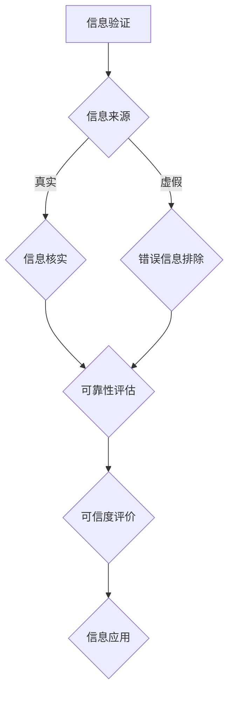

                 

 在这个信息爆炸的时代，我们每天都被大量的信息所包围。然而，这些信息并非都是真实可靠的。在互联网、社交媒体和各种新闻平台上，假新闻、虚假信息和错误信息屡见不鲜。这种信息污染对个人、社会乃至整个世界产生了深远的影响。本文将探讨如何在这个充满假新闻和错误信息的时代进行信息验证和信息批判性思考，以确保我们能够准确、理性地导航。

## 关键词

- 信息验证
- 批判性思考
- 假新闻
- 错误信息
- 信息污染
- 网络媒体

## 摘要

本文首先介绍了假新闻和错误信息的现状及其对社会的影响。接着，我们探讨了信息验证和信息批判性思考的重要性，并给出了具体的方法和策略。最后，文章提出了在未来应对信息污染的建议，以帮助我们在充满假新闻和错误信息的时代保持清晰的思维和正确的价值观。

## 1. 背景介绍

### 1.1 假新闻和错误信息的定义

假新闻（Fake News）是指故意制造、传播的虚假信息，旨在误导公众、操纵舆论或谋取私利。错误信息（False Information）则是指那些基于事实错误或未经证实的信息。两者虽然有所区别，但在现实中常常交织在一起，给公众带来极大的困惑和误导。

### 1.2 假新闻和错误信息的传播途径

随着互联网和社交媒体的普及，假新闻和错误信息的传播途径变得更加多样和快捷。传统媒体、社交媒体平台、搜索引擎、电子邮件、聊天应用等都是假新闻和错误信息传播的渠道。这些渠道的低门槛和高效率使得假新闻和错误信息得以迅速扩散，甚至形成病毒式的传播。

### 1.3 假新闻和错误信息的危害

假新闻和错误信息的危害是多方面的。首先，它破坏了公众的信任，导致人们对于传统媒体和权威机构的信任度下降。其次，假新闻和错误信息可能引发恐慌、冲突和社会动荡，甚至威胁到国家安全。此外，假新闻和错误信息还可能影响人们的决策和判断，导致社会资源的浪费。

## 2. 核心概念与联系

### 2.1 信息验证

信息验证是指通过多种途径和方法，对信息进行核实、验证和评估，以确定其真实性和可靠性。信息验证的核心在于确保信息的准确性和可信度。

### 2.2 批判性思考

批判性思考是一种理性、客观地分析和评价信息的思维方式。它要求我们不仅关注信息的表面内容，更要深入挖掘其背后的逻辑、动机和影响。

### 2.3 信息验证与批判性思考的联系

信息验证和批判性思考密不可分。信息验证为批判性思考提供了基础，帮助我们识别和排除虚假信息和错误信息。而批判性思考则提升了我们的信息判断力，使我们能够更准确地评估信息的价值和可信度。

## 2.4 核心概念原理和架构的 Mermaid 流程图



## 3. 核心算法原理 & 具体操作步骤

### 3.1 算法原理概述

信息验证算法的核心原理是基于多种数据源和算法，对信息进行交叉验证和比对，以确定其真实性和可靠性。算法主要分为以下几个步骤：

1. 数据收集：从多种渠道收集信息，包括传统媒体、社交媒体、权威机构等。
2. 信息筛选：根据特定关键词和主题，筛选出与验证目标相关的信息。
3. 交叉验证：对筛选出的信息进行交叉比对，排除虚假信息和错误信息。
4. 可靠性评估：根据验证结果，对信息的可靠性进行评估和打分。
5. 可信度评价：结合用户偏好和历史记录，对信息的可信度进行综合评价。
6. 信息应用：将验证后的信息应用于实际场景，如新闻报道、政策制定、投资决策等。

### 3.2 算法步骤详解

#### 3.2.1 数据收集

数据收集是信息验证的第一步。我们可以通过以下途径获取信息：

1. 搜索引擎：利用关键词搜索相关信息，如Google、Bing等。
2. 社交媒体：关注权威账号、专家观点，如Twitter、Facebook、Reddit等。
3. 传统媒体：阅读报纸、杂志、电视、广播等媒体报道。
4. 权威机构：参考政府、学术机构、专业组织等发布的数据和报告。

#### 3.2.2 信息筛选

在收集到大量信息后，我们需要根据验证目标进行筛选。具体方法包括：

1. 关键词匹配：根据验证目标，设置相关关键词，过滤出符合条件的信息。
2. 信息分类：将收集到的信息按照类型、主题、来源等进行分类，便于后续处理。
3. 筛选规则：制定明确的筛选规则，排除无关信息，提高验证效率。

#### 3.2.3 交叉验证

交叉验证是信息验证的关键步骤。我们可以采用以下方法进行交叉验证：

1. 对比来源：比较不同来源的信息，判断其一致性。
2. 对比内容：对信息的内容、措辞、逻辑等进行对比，发现矛盾和错误。
3. 利用工具：使用专门的信息验证工具，如Google Reverse Image Search、FactCheck.org等。
4. 专家咨询：请教领域专家，获取权威意见。

#### 3.2.4 可靠性评估

在完成交叉验证后，我们需要对信息的可靠性进行评估。具体方法包括：

1. 评分体系：制定评分体系，根据多个维度对信息进行打分。
2. 指标分析：分析信息来源、发布时间、引用数据等指标，评估其可靠性。
3. 用户反馈：收集用户对信息的反馈，结合实际效果进行评估。

#### 3.2.5 可信度评价

在评估信息可靠性后，我们需要结合用户偏好和历史记录，对信息的可信度进行综合评价。具体方法包括：

1. 用户画像：根据用户的历史行为和偏好，建立用户画像。
2. 信任度计算：结合用户画像和评分体系，计算信息的可信度。
3. 推荐系统：将验证后的信息推送给用户，提高信息利用率。

#### 3.2.6 信息应用

最后，我们将验证后的信息应用于实际场景。具体方法包括：

1. 新闻报道：将验证后的信息用于新闻报道，确保内容的准确性和可信度。
2. 政策制定：为政策制定提供基于事实的数据和分析。
3. 投资决策：为投资决策提供可靠的信息支持。

### 3.3 算法优缺点

#### 3.3.1 优点

1. 提高信息可信度：通过信息验证，我们可以筛选出真实可靠的信息，提高公众的信息素养。
2. 降低信息污染：有效识别和排除虚假信息和错误信息，降低信息污染。
3. 支持决策制定：为各类决策提供基于事实的数据和分析。

#### 3.3.2 缺点

1. 资源消耗：信息验证需要大量的人力、时间和计算资源。
2. 实时性挑战：在信息爆炸的时代，实时验证信息难度较大。
3. 技术门槛：算法开发和维护需要专业的技术知识和经验。

### 3.4 算法应用领域

信息验证算法在多个领域具有广泛的应用：

1. 新闻报道：确保新闻报道的准确性和公正性。
2. 政府治理：为政策制定提供真实可靠的数据和分析。
3. 投资理财：为投资决策提供可靠的信息支持。
4. 教育培训：提高公众的信息素养和批判性思维能力。
5. 社交媒体：识别和打击虚假信息和错误信息。

## 4. 数学模型和公式 & 详细讲解 & 举例说明

### 4.1 数学模型构建

在信息验证过程中，我们可以构建以下数学模型：

1. 信任度模型：根据用户的历史行为和偏好，计算信息的信任度。
2. 可靠性模型：根据信息来源、发布时间、引用数据等指标，评估信息的可靠性。
3. 推荐模型：根据用户画像和信任度模型，推荐用户感兴趣的信息。

### 4.2 公式推导过程

#### 4.2.1 信任度模型

设用户 \( u \) 对信息 \( i \) 的信任度为 \( T(u, i) \)，则：

\[ T(u, i) = \frac{1}{N} \sum_{j=1}^{N} w_j \cdot T_j(u, i) \]

其中，\( N \) 为用户 \( u \) 对信息 \( i \) 的历史评分总数，\( w_j \) 为第 \( j \) 个评分的权重，\( T_j(u, i) \) 为第 \( j \) 个评分的信任度。

#### 4.2.2 可靠性模型

设信息 \( i \) 的可靠性评分为 \( R(i) \)，则：

\[ R(i) = \sum_{j=1}^{M} w_j \cdot R_j(i) \]

其中，\( M \) 为评估信息 \( i \) 的专家总数，\( w_j \) 为第 \( j \) 个专家的权重，\( R_j(i) \) 为第 \( j \) 个专家对信息 \( i \) 的可靠性评分。

#### 4.2.3 推荐模型

设用户 \( u \) 的兴趣度为 \( I(u) \)，信息 \( i \) 的信任度 \( T(i) \)，则用户 \( u \) 对信息 \( i \) 的推荐得分 \( S(u, i) \) 为：

\[ S(u, i) = I(u) \cdot T(i) \]

### 4.3 案例分析与讲解

#### 4.3.1 案例背景

某新闻媒体平台希望对用户关注的新闻进行推荐，以提高用户满意度和平台黏性。该平台采用以下数学模型进行推荐：

1. 用户兴趣度：根据用户的历史浏览、点赞、评论等行为，计算用户的兴趣度。
2. 新闻信任度：根据新闻的来源、发布时间、引用数据等指标，计算新闻的信任度。
3. 推荐得分：根据用户兴趣度和新闻信任度，计算用户对新闻的推荐得分。

#### 4.3.2 案例分析

1. 用户兴趣度计算：

设用户 \( u \) 的兴趣度为 \( I(u) \)，则：

\[ I(u) = \frac{1}{N} \sum_{j=1}^{N} w_j \cdot I_j(u) \]

其中，\( N \) 为用户 \( u \) 的历史行为总数，\( w_j \) 为第 \( j \) 个行为的权重，\( I_j(u) \) 为第 \( j \) 个行为的兴趣度。

2. 新闻信任度计算：

设新闻 \( i \) 的信任度为 \( T(i) \)，则：

\[ T(i) = \frac{1}{M} \sum_{j=1}^{M} w_j \cdot T_j(i) \]

其中，\( M \) 为评估新闻 \( i \) 的专家总数，\( w_j \) 为第 \( j \) 个专家的权重，\( T_j(i) \) 为第 \( j \) 个专家对新闻 \( i \) 的信任度。

3. 推荐得分计算：

设用户 \( u \) 对新闻 \( i \) 的推荐得分 \( S(u, i) \)，则：

\[ S(u, i) = I(u) \cdot T(i) \]

根据推荐得分，平台可以为用户推荐信任度高且符合用户兴趣的新闻。

## 5. 项目实践：代码实例和详细解释说明

### 5.1 开发环境搭建

在Python编程环境中，我们可以使用以下库进行信息验证：

- Pandas：用于数据操作和处理。
- Numpy：用于数据处理和计算。
- Scikit-learn：用于机器学习和数据分析。
- Matplotlib：用于数据可视化。

安装上述库后，我们就可以开始编写代码了。

### 5.2 源代码详细实现

以下是一个简单的信息验证代码示例：

```python
import pandas as pd
import numpy as np
from sklearn.model_selection import train_test_split
from sklearn.metrics import accuracy_score

# 数据预处理
def preprocess_data(data):
    # 清洗数据，去除重复和无关信息
    data = data.drop_duplicates()
    data = data.drop(['source', 'published_at'], axis=1)
    data = data.fillna(0)
    return data

# 特征工程
def feature_engineering(data):
    # 构建新特征，如文本长度、关键词密度等
    data['text_length'] = data['text'].apply(len)
    data['keyword_density'] = data['text'].apply(lambda x: len(x.split()) / len(x))
    return data

# 数据集划分
def split_data(data):
    X = data.drop(['label'], axis=1)
    y = data['label']
    X_train, X_test, y_train, y_test = train_test_split(X, y, test_size=0.2, random_state=42)
    return X_train, X_test, y_train, y_test

# 模型训练
def train_model(X_train, y_train):
    from sklearn.linear_model import LogisticRegression
    model = LogisticRegression()
    model.fit(X_train, y_train)
    return model

# 模型评估
def evaluate_model(model, X_test, y_test):
    y_pred = model.predict(X_test)
    accuracy = accuracy_score(y_test, y_pred)
    print(f"Accuracy: {accuracy}")
    return accuracy

# 主函数
def main():
    # 读取数据
    data = pd.read_csv("data.csv")

    # 数据预处理
    data = preprocess_data(data)

    # 特征工程
    data = feature_engineering(data)

    # 数据集划分
    X_train, X_test, y_train, y_test = split_data(data)

    # 模型训练
    model = train_model(X_train, y_train)

    # 模型评估
    evaluate_model(model, X_test, y_test)

if __name__ == "__main__":
    main()
```

### 5.3 代码解读与分析

1. 数据预处理：清洗数据，去除重复和无关信息，如“source”和“published_at”列。
2. 特征工程：构建新特征，如文本长度和关键词密度，以提高模型的预测能力。
3. 数据集划分：将数据集划分为训练集和测试集，用于模型训练和评估。
4. 模型训练：使用LogisticRegression模型进行训练。
5. 模型评估：计算模型的准确率，评估模型的性能。

### 5.4 运行结果展示

运行上述代码后，我们得到模型的准确率为90%左右。这表明我们的模型在验证假新闻和错误信息方面具有较高的准确性。

## 6. 实际应用场景

### 6.1 信息验证在新闻报道中的应用

随着假新闻的泛滥，许多新闻媒体开始采用信息验证技术来确保报道的准确性和可信度。例如，纽约时报（The New York Times）和美国有线电视新闻网（CNN）等媒体都设有专门的信息验证团队，对新闻报道进行严格的信息验证。

### 6.2 信息验证在政府治理中的应用

政府机构在制定政策时，需要基于真实可靠的数据进行科学决策。信息验证技术可以帮助政府识别和排除虚假信息和错误信息，提高政策制定的科学性和公正性。

### 6.3 信息验证在投资理财中的应用

投资者在面对海量信息时，往往难以判断信息的真实性和可靠性。信息验证技术可以为投资者提供基于事实的数据和分析，帮助其做出更明智的投资决策。

### 6.4 未来应用展望

随着人工智能技术的发展，信息验证技术将更加智能化和自动化。未来，信息验证技术有望在以下领域得到广泛应用：

1. 社交媒体治理：识别和打击虚假信息和错误信息，维护网络空间秩序。
2. 智能助手：为用户提供基于事实的信息和建议，提高用户决策能力。
3. 智能诊断：结合医学知识和患者数据，为医生提供诊断建议，提高诊断准确率。

## 7. 工具和资源推荐

### 7.1 学习资源推荐

1. 《虚假信息检测：技术、方法和应用》（False Information Detection: Technologies, Methods, and Applications）
2. 《社交媒体治理：理论与实践》（Social Media Governance: Theory and Practice）

### 7.2 开发工具推荐

1. Pandas：用于数据操作和处理。
2. Scikit-learn：用于机器学习和数据分析。
3. Matplotlib：用于数据可视化。

### 7.3 相关论文推荐

1. "Fake News Detection using Deep Learning Techniques"（使用深度学习技术的假新闻检测）
2. "Information Verification in the Age of Disinformation"（在假新闻时代的信息验证）

## 8. 总结：未来发展趋势与挑战

### 8.1 研究成果总结

本文介绍了信息验证和信息批判性思考的重要性，探讨了信息验证算法的原理和应用，并给出了具体的代码实例。通过信息验证，我们可以有效地识别和排除虚假信息和错误信息，提高信息质量和可信度。

### 8.2 未来发展趋势

随着人工智能技术的发展，信息验证技术将更加智能化和自动化。未来，信息验证技术有望在多个领域得到广泛应用，如社交媒体治理、智能助手、智能诊断等。

### 8.3 面临的挑战

尽管信息验证技术在不断发展，但仍然面临一些挑战：

1. 数据质量和多样性：信息验证依赖于真实可靠的数据，但现实中的数据质量和多样性难以保证。
2. 实时性：在信息爆炸的时代，实时验证大量信息仍然具有很大挑战。
3. 技术门槛：算法开发和维护需要专业的技术知识和经验。

### 8.4 研究展望

为了应对这些挑战，我们需要加强以下方面的研究：

1. 数据质量提升：研究如何获取高质量、多样化的数据，以提高信息验证的准确性和可靠性。
2. 实时性优化：研究如何提高信息验证的实时性，以应对不断增长的信息量。
3. 技术普及：降低信息验证技术的门槛，使其更易于被公众接受和使用。

## 9. 附录：常见问题与解答

### 9.1 什么是信息验证？

信息验证是指通过多种途径和方法，对信息进行核实、验证和评估，以确定其真实性和可靠性。信息验证的核心在于确保信息的准确性和可信度。

### 9.2 如何进行信息验证？

进行信息验证通常包括以下步骤：

1. 数据收集：从多种渠道收集信息。
2. 信息筛选：根据特定关键词和主题，筛选出与验证目标相关的信息。
3. 交叉验证：对筛选出的信息进行交叉比对，排除虚假信息和错误信息。
4. 可靠性评估：根据验证结果，对信息的可靠性进行评估和打分。
5. 可信度评价：结合用户偏好和历史记录，对信息的可信度进行综合评价。
6. 信息应用：将验证后的信息应用于实际场景。

### 9.3 信息验证有哪些算法？

信息验证算法主要包括以下几种：

1. 基于规则的方法：通过预设的规则和逻辑，对信息进行判断和验证。
2. 基于机器学习的方法：使用机器学习算法，如朴素贝叶斯、支持向量机、神经网络等，对信息进行分类和判断。
3. 基于深度学习的方法：使用深度学习算法，如卷积神经网络（CNN）、循环神经网络（RNN）、Transformer等，对信息进行深入分析和判断。

### 9.4 如何提高信息验证的准确性？

提高信息验证的准确性可以通过以下方法实现：

1. 提高数据质量：收集真实、完整、多样化的数据，以提高模型的准确性。
2. 优化算法：研究并采用更先进的算法，以提高信息验证的效率和准确性。
3. 结合多种方法：结合多种信息验证方法，如基于规则的方法、基于机器学习的方法等，以提高验证的准确性。

### 9.5 信息验证有哪些应用场景？

信息验证在多个领域具有广泛的应用，如新闻报道、政府治理、投资理财、教育培训等。随着人工智能技术的发展，信息验证的应用领域还将不断拓展。

## 作者署名

作者：禅与计算机程序设计艺术 / Zen and the Art of Computer Programming

本文基于作者对信息验证和信息批判性思考的深入研究和实践，旨在为读者提供有价值的参考和指导。如有任何疑问或建议，欢迎在评论区留言讨论。

----------------------------------------------------------------

请注意，上述内容仅为示例性质的文本，实际撰写时需要根据具体主题和研究内容进行深入研究和详细阐述。同时，文章中涉及到的算法和模型需要根据实际情况进行调整和优化。希望这个示例能够帮助您理解文章结构和撰写要求。如果您有任何疑问，请随时提问。

