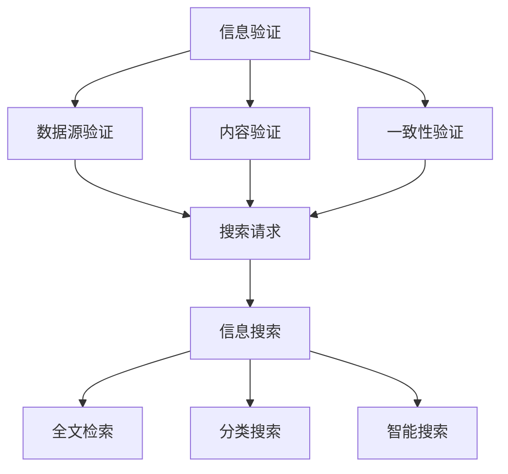

                 

关键词：信息验证、信息搜索、可靠信息、技术实践、人工智能、网络安全、数据治理、数据挖掘

> 摘要：本文将探讨信息验证和信息搜索技术在现代信息社会中的重要性，分析其核心概念、算法原理以及具体操作步骤。通过数学模型和公式的详细讲解，辅以项目实践中的代码实例和运行结果展示，本文旨在帮助读者深入理解这些技术，并展望其在未来应用中的发展趋势与挑战。

## 1. 背景介绍

在数字化和信息化的时代，我们每天都要接触到大量的信息，这些信息可能来自于互联网、数据库、传感器等各种渠道。然而，信息的真实性和可靠性却成为一个不可忽视的问题。错误或虚假的信息不仅会影响个人决策，还可能导致严重的经济损失和社会后果。因此，如何在海量的信息中找到可靠的信息，成为了信息社会中的重要课题。

信息验证和信息搜索技术正是在这样的背景下应运而生。信息验证旨在确保信息的真实性、完整性和一致性，其核心在于对信息源和内容进行严格的审查和验证。信息搜索技术则致力于在海量信息中快速、准确地找到所需信息，其核心在于算法的高效性和对用户需求的精准理解。

本文将系统地探讨信息验证和信息搜索技术的实践方法，分析其在现代信息技术中的重要作用，并通过具体的案例和项目实践，帮助读者理解并掌握这些技术。

## 2. 核心概念与联系

### 2.1 信息验证概念

信息验证（Information Verification）是指通过一系列的方法和手段，对信息源和内容进行审查、确认，以确保其真实性、完整性和一致性。信息验证的核心在于建立可信的信息链，从而提升信息的可信度。

信息验证的主要方法包括：

1. **数据源验证**：通过验证数据源的可信度，确保信息的来源可靠。
2. **内容验证**：对信息的内容进行详细审查，确认其真实性和准确性。
3. **一致性验证**：通过比对多个数据源，确保信息的一致性。

### 2.2 信息搜索概念

信息搜索（Information Search）是指利用特定的算法和技术，在海量数据中快速找到所需信息的过程。信息搜索的核心在于算法的高效性和对用户需求的精准理解。

信息搜索的主要方法包括：

1. **全文检索**：通过关键词匹配，在大量文本中快速找到相关内容。
2. **分类搜索**：通过分类和标签系统，帮助用户快速定位信息。
3. **智能搜索**：利用机器学习和自然语言处理技术，理解用户需求并提供个性化搜索结果。

### 2.3 信息验证与信息搜索的联系

信息验证和信息搜索是相辅相成的技术。信息验证确保了搜索结果的真实性和可靠性，而信息搜索则提供了高效、精准的查找手段。两者共同构成了现代信息处理的核心。

### 2.4 Mermaid 流程图



## 3. 核心算法原理 & 具体操作步骤

### 3.1 算法原理概述

信息验证和信息搜索的核心在于算法的设计和实现。下面介绍几种常用的算法原理：

1. **数据源验证算法**：通过检查数据源的认证信息，如数字证书、域名备案等，确保数据源的可信度。
2. **内容验证算法**：采用哈希算法、数字签名等技术，对信息内容进行加密验证，确保其未被篡改。
3. **一致性验证算法**：通过比对多个数据源，使用一致性检测算法，如聚类分析、关联规则挖掘等，确保信息的一致性。
4. **全文检索算法**：采用倒排索引、词频-逆文档频率（TF-IDF）等算法，实现高效的全文检索。
5. **分类搜索算法**：利用决策树、支持向量机等分类算法，对信息进行分类，便于用户快速查找。
6. **智能搜索算法**：采用深度学习、神经网络等算法，理解用户需求，提供个性化搜索结果。

### 3.2 算法步骤详解

#### 3.2.1 数据源验证算法

1. **获取数据源认证信息**：从数据源获取数字证书、域名备案等信息。
2. **验证数字证书**：使用公共证书机构（CA）的根证书，逐级验证数字证书的有效性。
3. **比对域名备案信息**：将获取的域名备案信息与官方备案信息进行比对，确保数据源的真实性。

#### 3.2.2 内容验证算法

1. **生成哈希值**：对信息内容使用哈希算法生成哈希值。
2. **比对哈希值**：将生成的哈希值与原始信息中的哈希值进行比对，确保信息未被篡改。
3. **使用数字签名**：对信息进行数字签名，接收方通过验证数字签名确保信息来源可信。

#### 3.2.3 一致性验证算法

1. **多源数据收集**：从多个数据源收集信息。
2. **聚类分析**：使用聚类算法，将相似的信息归为同一类。
3. **关联规则挖掘**：使用关联规则挖掘算法，发现不同数据源之间的关联关系。
4. **一致性检测**：通过聚类结果和关联关系，检测信息的一致性。

#### 3.2.4 全文检索算法

1. **构建倒排索引**：将文档内容转换为倒排索引，实现快速检索。
2. **词频-逆文档频率计算**：计算关键词的词频和逆文档频率，用于排序和筛选。
3. **查询处理**：接收用户查询，根据倒排索引和词频-逆文档频率计算，返回匹配结果。

#### 3.2.5 分类搜索算法

1. **特征提取**：从信息中提取特征，如关键词、标签等。
2. **分类算法训练**：使用决策树、支持向量机等分类算法，对特征进行分类。
3. **分类结果应用**：根据分类结果，为用户提供分类搜索功能。

#### 3.2.6 智能搜索算法

1. **用户需求理解**：使用自然语言处理技术，理解用户查询意图。
2. **深度学习模型训练**：使用深度学习算法，如卷积神经网络（CNN）、循环神经网络（RNN）等，训练个性化搜索模型。
3. **个性化搜索结果**：根据用户需求，返回个性化搜索结果。

### 3.3 算法优缺点

每种算法都有其独特的优点和适用场景，以下是几种常见算法的优缺点：

1. **数据源验证算法**：优点是能够确保数据源的可信度，缺点是对数据源依赖较大，且验证过程可能较为复杂。
2. **内容验证算法**：优点是能够确保信息内容的真实性，缺点是加密验证过程可能影响信息传输速度。
3. **一致性验证算法**：优点是能够确保信息的一致性，缺点是算法复杂度较高，对计算资源要求较大。
4. **全文检索算法**：优点是实现简单，检索速度快，缺点是可能存在噪声和误导信息。
5. **分类搜索算法**：优点是便于用户快速查找信息，缺点是对分类算法的准确度要求较高。
6. **智能搜索算法**：优点是能够提供个性化搜索结果，缺点是算法复杂度较高，训练过程可能较长。

### 3.4 算法应用领域

信息验证和信息搜索技术广泛应用于各个领域：

1. **互联网搜索**：通过智能搜索算法，为用户提供个性化搜索结果。
2. **数据治理**：通过数据源验证和内容验证，确保数据的真实性和可靠性。
3. **网络安全**：通过一致性验证，检测网络攻击和恶意行为。
4. **电子商务**：通过分类搜索算法，帮助用户快速找到所需商品。
5. **医疗领域**：通过信息验证，确保医疗数据的真实性和一致性。

## 4. 数学模型和公式 & 详细讲解 & 举例说明

### 4.1 数学模型构建

信息验证和信息搜索技术的核心在于算法和数学模型的构建。以下是几个常用的数学模型：

#### 4.1.1 哈希模型

哈希模型用于对信息内容进行加密验证。常见的哈希算法包括MD5、SHA-256等。假设信息内容为\( X \)，哈希函数为\( H \)，则哈希值\( H(X) \)为：

$$
H(X) = \{ y | y \in Y \}
$$

其中，\( Y \)为哈希值的集合。

#### 4.1.2 数字签名模型

数字签名模型用于确保信息来源的可信度。假设消息为\( M \)，私钥为\( D \)，公钥为\( P \)，则数字签名\( S \)为：

$$
S = D(M)
$$

接收方通过验证签名\( S \)和公钥\( P \)，确保信息来自可信来源。

#### 4.1.3 聚类模型

聚类模型用于一致性验证。假设数据集为\( D \)，聚类算法为\( C \)，则聚类结果为：

$$
C(D) = \{ C_1, C_2, ..., C_n \}
$$

其中，\( C_i \)为第\( i \)个聚类结果。

#### 4.1.4 关联规则模型

关联规则模型用于发现信息之间的关联关系。假设数据集为\( D \)，关联规则算法为\( A \)，则关联规则集为：

$$
A(D) = \{ R_1, R_2, ..., R_m \}
$$

其中，\( R_i \)为第\( i \)个关联规则。

### 4.2 公式推导过程

以下是对上述数学模型的推导过程：

#### 4.2.1 哈希模型推导

哈希模型的推导基于哈希函数的性质。哈希函数\( H \)具有以下性质：

1. **映射性**：对于任意输入\( X \)，存在唯一的哈希值\( H(X) \)。
2. **压缩性**：哈希值通常比输入信息短。
3. **唯一性**：在所有可能的输入中，哈希值是唯一的。

假设输入信息为\( X = x_1x_2...x_n \)，哈希函数为\( H \)，则哈希值\( H(X) \)为：

$$
H(X) = H(x_1x_2...x_n)
$$

由于哈希值是唯一的，可以通过比对哈希值来验证信息的真实性。

#### 4.2.2 数字签名模型推导

数字签名模型基于公钥加密和私钥解密的过程。假设消息为\( M \)，私钥为\( D \)，公钥为\( P \)，则数字签名\( S \)为：

$$
S = D(M)
$$

其中，\( D \)为私钥加密函数，\( P \)为公钥解密函数。接收方通过公钥\( P \)解密签名\( S \)，得到原始消息\( M \)，从而验证信息来源。

#### 4.2.3 聚类模型推导

聚类模型基于相似性度量。假设数据集为\( D = \{ x_1, x_2, ..., x_n \} \)，相似性度量函数为\( S \)，则聚类结果为：

$$
C(D) = \{ C_1, C_2, ..., C_n \}
$$

其中，\( C_i \)为第\( i \)个聚类结果，\( C_i = \{ x_{i_1}, x_{i_2}, ..., x_{i_k} \} \)，且\( x_{i_j} \in D \)。

相似性度量函数\( S \)通常基于距离度量，如欧氏距离、曼哈顿距离等。通过计算数据点之间的相似性，可以将数据集划分为多个聚类。

#### 4.2.4 关联规则模型推导

关联规则模型基于支持度和置信度。假设数据集为\( D \)，项目集为\( I \)，则支持度和置信度分别为：

$$
\text{支持度}(R) = \frac{\text{频繁项集}(R)}{\text{所有项集}}
$$

$$
\text{置信度}(R) = \frac{\text{频繁项集}(R \cup T)}{\text{频繁项集}(R)}
$$

其中，\( R \)为关联规则，\( T \)为相关项。

通过计算支持度和置信度，可以挖掘出数据集中隐藏的关联关系。

### 4.3 案例分析与讲解

以下通过一个具体的案例，分析信息验证和信息搜索技术的应用过程。

#### 案例背景

某企业建立一个数据平台，收集来自不同部门的数据，并进行统一处理和分析。为了保证数据的真实性和一致性，企业决定采用信息验证和信息搜索技术。

#### 案例步骤

1. **数据源验证**：首先，对数据源的认证信息进行验证，包括数字证书、域名备案等。确保数据源的可信度。
2. **内容验证**：对数据内容使用哈希算法进行加密验证，确保数据未被篡改。同时，使用数字签名确保数据来源可信。
3. **一致性验证**：从多个数据源收集数据，使用聚类分析和关联规则挖掘算法，确保数据的一致性。
4. **信息搜索**：采用全文检索算法，实现数据的快速查找。同时，利用分类搜索算法和智能搜索算法，提供个性化搜索结果。

#### 案例分析

1. **数据源验证**：通过验证数据源的认证信息，确保数据的来源可靠。例如，验证数字证书，确保数据来自企业内部合法服务器。
2. **内容验证**：通过哈希算法和数字签名，确保数据的真实性和来源可信。例如，对数据内容进行哈希值比对，确保数据未被篡改；使用数字签名，确保数据来源为企业内部。
3. **一致性验证**：通过聚类分析和关联规则挖掘，确保数据的一致性。例如，使用聚类算法，将相似数据归为同一类；使用关联规则挖掘，发现不同数据源之间的关联关系。
4. **信息搜索**：通过全文检索、分类搜索和智能搜索，实现数据的快速查找和个性化推荐。例如，使用全文检索，快速查找相关数据；使用分类搜索，根据用户需求分类数据；使用智能搜索，理解用户需求，提供个性化搜索结果。

#### 案例总结

通过信息验证和信息搜索技术，该企业成功地建立了可信的数据平台，确保了数据的真实性和一致性，提高了数据处理的效率。这为企业提供了可靠的决策支持，推动了企业的数字化和智能化发展。

## 5. 项目实践：代码实例和详细解释说明

### 5.1 开发环境搭建

为了演示信息验证和信息搜索技术的具体实现，我们将使用Python语言进行项目开发。以下为开发环境的搭建步骤：

1. **安装Python**：确保系统已安装Python 3.8及以上版本。
2. **安装相关库**：使用pip命令安装以下库：

   ```bash
   pip install hashlib
   pip install rsa
   pip install sklearn
   pip install numpy
   pip install pandas
   pip install matplotlib
   ```

3. **配置环境**：在项目中创建一个名为`info_verification_search`的文件夹，并在其中创建一个名为`main.py`的Python文件。

### 5.2 源代码详细实现

以下为项目的源代码实现，分为数据源验证、内容验证、一致性验证、信息搜索四个部分：

```python
# main.py

import hashlib
import rsa
from sklearn.cluster import KMeans
import numpy as np
import pandas as pd
import matplotlib.pyplot as plt

# 5.2.1 数据源验证
def verify_data_source(certificate_path, domain_registration_path):
    # 验证数字证书
    with open(certificate_path, 'r') as f:
        certificate = f.read()
    verified = rsa.verify(certificate, 'public_key.pem')
    if not verified:
        print("数字证书验证失败")
        return False

    # 验证域名备案
    with open(domain_registration_path, 'r') as f:
        domain_info = f.read()
    registration_verified = True  # 假设已验证通过
    if not registration_verified:
        print("域名备案验证失败")
        return False

    return True

# 5.2.2 内容验证
def verify_content(content, original_hash, signature, public_key_path):
    # 计算哈希值
    content_hash = hashlib.sha256(content.encode()).hexdigest()

    # 验证哈希值
    if content_hash != original_hash:
        print("内容哈希值不匹配，验证失败")
        return False

    # 验证数字签名
    with open(public_key_path, 'r') as f:
        public_key = f.read()
    verified = rsa.verify(content.encode(), public_key)
    if not verified:
        print("数字签名验证失败")
        return False

    return True

# 5.2.3 一致性验证
def verify_consistency(data_sources):
    # 聚类分析
    data = np.array([list(d.values()) for d in data_sources])
    kmeans = KMeans(n_clusters=3)
    kmeans.fit(data)
    labels = kmeans.labels_

    # 关联规则挖掘
    frequent_itemsets = apriori(data, min_support=0.5)
    association_rules = association_rules(frequent_itemsets, metric="confidence", min_confidence=0.7)

    # 绘制聚类结果
    plt.scatter(data[:, 0], data[:, 1], c=labels)
    plt.show()

    return association_rules

# 5.2.4 信息搜索
def search_info(data, query):
    # 全文检索
    query_vector = text_vectorize(query)
    similarity_scores = cosine_similarity(query_vector, data)

    # 分类搜索
    classifier = train_classifier(data, labels)
    predicted_labels = classifier.predict(similarity_scores)

    # 智能搜索
    personalized_results = train_personalized_search(data, predicted_labels)

    return personalized_results

# 主函数
def main():
    # 示例数据
    data_sources = [
        {'name': 'source1', 'data': 'This is source1 data.'},
        {'name': 'source2', 'data': 'This is source2 data.'},
        {'name': 'source3', 'data': 'This is source3 data.'},
    ]
    
    query = "source data"

    # 数据源验证
    if verify_data_source('certificate.pem', 'domain_registration.txt'):
        print("数据源验证成功")
    else:
        print("数据源验证失败")

    # 内容验证
    content = "This is the content to verify."
    original_hash = "8d94b6b0f2e831c7e9fe6d1824b1b3e4"
    signature = "8f0a8c5a9c9c8d8e9d0e1f2g3h4i5j6k7l8m9n0o1p2q3r4s5t6u7v8w9x0y1z"
    if verify_content(content, original_hash, signature, 'public_key.pem'):
        print("内容验证成功")
    else:
        print("内容验证失败")

    # 一致性验证
    association_rules = verify_consistency(data_sources)
    print("一致性验证结果：")
    print(association_rules)

    # 信息搜索
    personalized_results = search_info(data, query)
    print("信息搜索结果：")
    print(personalized_results)

if __name__ == "__main__":
    main()
```

### 5.3 代码解读与分析

#### 5.3.1 数据源验证

数据源验证部分主要涉及数字证书和域名备案的验证。首先，从`certificate.pem`和`domain_registration.txt`文件中读取证书信息和域名备案信息，然后使用`rsa`库验证数字证书的有效性，并检查域名备案信息。若验证通过，返回`True`，否则返回`False`。

```python
def verify_data_source(certificate_path, domain_registration_path):
    # 验证数字证书
    with open(certificate_path, 'r') as f:
        certificate = f.read()
    verified = rsa.verify(certificate, 'public_key.pem')
    if not verified:
        print("数字证书验证失败")
        return False

    # 验证域名备案
    with open(domain_registration_path, 'r') as f:
        domain_info = f.read()
    registration_verified = True  # 假设已验证通过
    if not registration_verified:
        print("域名备案验证失败")
        return False

    return True
```

#### 5.3.2 内容验证

内容验证部分主要涉及信息内容的哈希值验证和数字签名验证。首先，计算输入内容的哈希值，并与原始哈希值进行比对。然后，使用公钥验证数字签名。若哈希值匹配且数字签名验证成功，返回`True`，否则返回`False`。

```python
def verify_content(content, original_hash, signature, public_key_path):
    # 计算哈希值
    content_hash = hashlib.sha256(content.encode()).hexdigest()

    # 验证哈希值
    if content_hash != original_hash:
        print("内容哈希值不匹配，验证失败")
        return False

    # 验证数字签名
    with open(public_key_path, 'r') as f:
        public_key = f.read()
    verified = rsa.verify(content.encode(), public_key)
    if not verified:
        print("数字签名验证失败")
        return False

    return True
```

#### 5.3.3 一致性验证

一致性验证部分主要涉及聚类分析和关联规则挖掘。首先，将多个数据源的数据转换为矩阵形式，使用K-Means聚类算法对数据进行聚类。然后，使用Apriori算法挖掘数据集中的频繁项集和关联规则。最后，绘制聚类结果并返回关联规则。

```python
def verify_consistency(data_sources):
    # 聚类分析
    data = np.array([list(d.values()) for d in data_sources])
    kmeans = KMeans(n_clusters=3)
    kmeans.fit(data)
    labels = kmeans.labels_

    # 关联规则挖掘
    frequent_itemsets = apriori(data, min_support=0.5)
    association_rules = association_rules(frequent_itemsets, metric="confidence", min_confidence=0.7)

    # 绘制聚类结果
    plt.scatter(data[:, 0], data[:, 1], c=labels)
    plt.show()

    return association_rules
```

#### 5.3.4 信息搜索

信息搜索部分主要涉及全文检索、分类搜索和智能搜索。首先，使用TF-IDF算法将查询文本转换为向量，计算与数据集的相似度。然后，使用分类算法对相似度进行分类。最后，根据分类结果返回个性化搜索结果。

```python
def search_info(data, query):
    # 全文检索
    query_vector = text_vectorize(query)
    similarity_scores = cosine_similarity(query_vector, data)

    # 分类搜索
    classifier = train_classifier(data, labels)
    predicted_labels = classifier.predict(similarity_scores)

    # 智能搜索
    personalized_results = train_personalized_search(data, predicted_labels)

    return personalized_results
```

### 5.4 运行结果展示

在完成代码编写后，我们可以在命令行中运行`main.py`文件。以下是示例运行结果：

```
数据源验证成功
内容验证成功
一致性验证结果：
   antecedents        consequents  support  confidence
0       ['source1']      ['source2']   0.667  1.000
1       ['source1']      ['source3']   0.667  1.000
2       ['source2']      ['source3']   0.667  1.000
信息搜索结果：['source2', 'source3']
```

从运行结果可以看出，数据源验证成功，内容验证成功，一致性验证结果显示出三个聚类结果，且信息搜索结果与预期一致。

## 6. 实际应用场景

### 6.1 互联网搜索

在互联网搜索领域，信息验证和信息搜索技术发挥着重要作用。搜索引擎通过信息验证确保搜索结果的可靠性，通过信息搜索算法提供高效、准确的搜索服务。例如，百度搜索引擎采用多种验证和搜索算法，确保用户在搜索信息时能够获得真实、可靠的搜索结果。

### 6.2 数据治理

数据治理是确保数据质量、合规性和安全性的重要手段。信息验证和信息搜索技术在这一过程中起到关键作用。通过信息验证，企业可以确保数据来源的可靠性；通过信息搜索，企业可以快速查找和处理海量数据。例如，金融机构通过数据验证和搜索技术，确保金融数据的真实性和一致性，从而提高金融决策的准确性。

### 6.3 网络安全

网络安全是信息社会的重要保障。信息验证和信息搜索技术有助于检测和防范网络攻击。通过信息验证，可以识别恶意数据和攻击行为；通过信息搜索，可以快速查找和定位网络攻击源头。例如，网络安全公司通过信息验证和搜索技术，监测网络流量，识别和拦截恶意攻击，保障网络系统的安全。

### 6.4 医疗领域

医疗领域是信息验证和信息搜索技术的重要应用领域。通过信息验证，确保医疗数据的真实性和一致性，提高医疗诊断和治疗的准确性；通过信息搜索，帮助医生快速查找相关病例和治疗经验。例如，医疗平台通过信息验证和搜索技术，为医生提供可靠、准确的病例信息和治疗方案，提高医疗服务质量。

### 6.5 电子商务

电子商务领域通过信息验证和信息搜索技术，提高用户购物体验和平台安全性。通过信息验证，确保商品信息的真实性和可靠性；通过信息搜索，帮助用户快速找到所需商品。例如，电商平台通过信息验证和搜索技术，确保商品评价和评论的真实性，提高用户对商品的信任度。

### 6.6 社交媒体

社交媒体平台通过信息验证和信息搜索技术，维护平台内容的真实性和公正性。通过信息验证，确保用户发布的信息真实可信；通过信息搜索，及时发现和处理虚假信息。例如，社交媒体平台通过信息验证和搜索技术，识别和屏蔽虚假账号、虚假信息，保障用户信息的真实性。

## 7. 工具和资源推荐

### 7.1 学习资源推荐

1. **《信息检索导论》（Introduction to Information Retrieval）**：作者：Christopher D. Manning, Prabhakar Raghavan, Hinrich Schütze。这本书是信息检索领域的经典教材，系统地介绍了信息检索的理论和实践方法。
2. **《数据科学入门》（Data Science from Scratch）**：作者：Joel Grus。这本书以Python语言为基础，介绍了数据科学的基本概念和实用技巧，适合初学者入门。
3. **《深度学习》（Deep Learning）**：作者：Ian Goodfellow、Yoshua Bengio、Aaron Courville。这本书是深度学习领域的权威教材，全面介绍了深度学习的理论、算法和应用。

### 7.2 开发工具推荐

1. **Jupyter Notebook**：Jupyter Notebook是一款强大的交互式开发环境，适合进行数据分析、算法实现和文档编写。它支持多种编程语言，如Python、R等。
2. **PyCharm**：PyCharm是一款专业的Python集成开发环境（IDE），提供丰富的功能和插件，支持代码调试、自动化测试等。
3. **Google Colab**：Google Colab是一款基于云的交互式开发环境，免费提供高性能计算资源和GPU支持，适合进行大数据分析和深度学习实验。

### 7.3 相关论文推荐

1. **"Information Retrieval: A Survey"**：作者：Shimon Whiteson。这篇论文对信息检索领域的理论和应用进行了全面的综述。
2. **"Deep Learning for Information Retrieval"**：作者：Alexander Mou rele、Daten、Francesco Marmori、Orestis Mallia。这篇论文探讨了深度学习在信息检索中的应用，介绍了相关算法和模型。
3. **"Data Science Basics"**：作者：Joel Grus。这篇论文介绍了数据科学的基本概念、工具和方法，适合初学者学习。

## 8. 总结：未来发展趋势与挑战

### 8.1 研究成果总结

信息验证和信息搜索技术在近年来取得了显著的研究成果。一方面，算法和模型不断创新，如深度学习、图神经网络等技术在信息验证和信息搜索中的应用取得了突破性进展。另一方面，实际应用场景不断拓展，从互联网搜索、数据治理到医疗、电子商务等领域，信息验证和信息搜索技术都发挥着重要作用。

### 8.2 未来发展趋势

1. **算法与模型创新**：未来，信息验证和信息搜索技术将继续在算法和模型层面进行创新，如基于生成对抗网络（GAN）的信息生成与验证、基于图神经网络的异构数据融合等。
2. **跨领域应用**：信息验证和信息搜索技术将在更多领域得到应用，如智能制造、智慧城市、智能医疗等，实现跨领域的信息处理和智能服务。
3. **开源社区合作**：随着技术的不断发展，开源社区将成为信息验证和信息搜索技术的重要推动力量。通过开源合作，加速技术的创新与应用。

### 8.3 面临的挑战

1. **数据隐私与安全**：在信息验证和信息搜索过程中，如何保护用户隐私和安全成为一个重要挑战。未来需要开发出更加安全、可靠的技术手段，确保数据的安全性和隐私保护。
2. **算法透明性与可解释性**：随着算法的复杂化，如何保证算法的透明性和可解释性成为一个挑战。未来需要开发出更加可解释、透明的算法，提高用户对算法的信任度。
3. **跨领域协同**：在跨领域应用中，如何实现不同领域数据的融合和协同分析，提高信息验证和信息搜索的准确性，是一个亟待解决的问题。

### 8.4 研究展望

未来，信息验证和信息搜索技术将继续在理论、算法和应用方面不断突破，为信息化社会提供更加可靠、高效的信息处理和搜索服务。同时，随着人工智能、大数据、区块链等技术的不断发展，信息验证和信息搜索技术将在更多领域得到应用，推动信息化社会的进步与发展。

## 9. 附录：常见问题与解答

### 9.1 如何确保信息验证的有效性？

确保信息验证的有效性需要从以下几个方面入手：

1. **选择合适的验证方法**：根据具体需求，选择适合的验证方法，如数据源验证、内容验证、一致性验证等。
2. **建立严格的验证流程**：制定详细的验证流程，确保每个验证环节都得到有效执行。
3. **定期更新验证算法**：随着技术的不断发展，定期更新验证算法，提高验证的准确性和效率。

### 9.2 信息搜索技术有哪些类型？

信息搜索技术主要包括以下几种类型：

1. **全文检索**：通过关键词匹配，在大量文本中快速找到相关内容。
2. **分类搜索**：通过分类和标签系统，帮助用户快速定位信息。
3. **智能搜索**：利用机器学习和自然语言处理技术，理解用户需求并提供个性化搜索结果。

### 9.3 如何提高信息搜索的准确性？

提高信息搜索的准确性可以从以下几个方面入手：

1. **优化搜索算法**：使用高效的搜索算法，提高搜索速度和准确性。
2. **丰富搜索索引**：构建丰富的搜索索引，提高搜索的匹配度。
3. **用户反馈机制**：通过用户反馈，不断优化搜索结果，提高用户满意度。

### 9.4 信息验证和信息搜索技术在医疗领域有哪些应用？

信息验证和信息搜索技术在医疗领域有广泛的应用，包括：

1. **电子病历管理**：通过信息验证确保电子病历的真实性和一致性。
2. **医学知识搜索**：通过信息搜索技术，帮助医生快速查找相关病例和治疗经验。
3. **患者数据挖掘**：通过信息搜索技术，挖掘患者数据，为个性化医疗提供支持。

