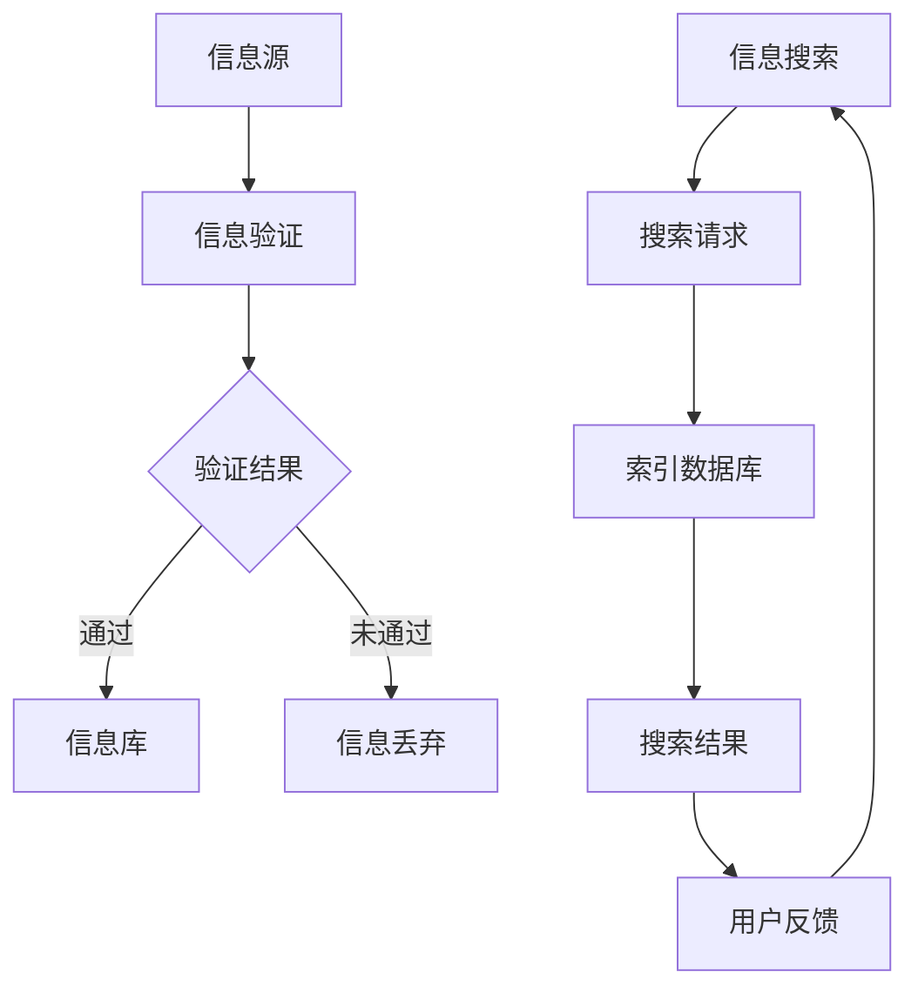

                 

 > **关键词**：信息验证、信息搜索、数据可靠性、价值信息、技术实现、应用领域。

> **摘要**：本文将探讨信息验证和信息搜索技术在现代信息社会中的应用，分析其核心概念、算法原理、数学模型、项目实践及未来发展趋势。旨在帮助读者理解这些技术如何帮助我们在信息海洋中找到可靠且有价值的信息。

## 1. 背景介绍

随着互联网和数字技术的飞速发展，信息爆炸成为时代的一个显著特征。然而，信息的多样性和复杂性也随之增加。在这样的背景下，信息验证和信息搜索技术变得至关重要。信息验证技术确保我们获取的信息是真实、准确和可靠的；信息搜索技术则帮助我们在海量信息中快速、精准地找到所需的信息。这些技术不仅对于个人学习、工作有着重要意义，更在商业、医疗、科研等领域发挥了巨大作用。

本文将围绕信息验证和信息搜索技术进行深入探讨，包括其核心概念、算法原理、数学模型、项目实践及未来发展趋势。通过本文的阅读，读者可以全面了解这些技术的基本原理和实际应用，为今后的学习和工作打下坚实基础。

## 2. 核心概念与联系

### 2.1 信息验证

信息验证是指对信息的真实性、准确性和可靠性进行验证的技术和过程。其核心目标是确保信息在传输、存储和使用过程中不被篡改、伪造或泄露。信息验证通常涉及身份验证、数字签名、加密算法等技术手段。

### 2.2 信息搜索

信息搜索是指从海量信息中查找和提取用户所需信息的技术和过程。其核心目标是实现信息的快速、精准定位。信息搜索技术包括关键字搜索、索引技术、机器学习、自然语言处理等。

### 2.3 关联与联系

信息验证和信息搜索技术在信息处理过程中相辅相成。信息验证确保了信息的可信度，为信息搜索提供了可靠的数据基础；信息搜索则利用验证后的信息，帮助用户快速找到所需内容。两者共同构建了现代信息处理的核心框架。

### 2.4 Mermaid 流程图

以下是一个简化的信息验证和信息搜索流程图，展示了两者之间的关联和互动。



## 3. 核心算法原理 & 具体操作步骤

### 3.1 算法原理概述

信息验证和信息搜索技术的核心算法主要涉及加密算法、哈希算法、索引算法和机器学习算法。这些算法分别用于确保信息的真实性、准确性和快速查找。

### 3.2 算法步骤详解

#### 3.2.1 信息验证算法

1. **身份验证**：使用密码学中的公钥加密算法，确保只有合法用户才能访问信息。
2. **数字签名**：使用私钥对信息进行签名，确保信息在传输过程中未被篡改。
3. **哈希校验**：计算信息的哈希值，并与已存储的哈希值进行比对，确保信息未被篡改。

#### 3.2.2 信息搜索算法

1. **关键字搜索**：根据用户输入的关键字，在索引数据库中查找相关记录。
2. **索引技术**：使用倒排索引、全文索引等技术，提高搜索效率。
3. **机器学习**：通过机器学习算法，根据用户的历史行为和反馈，实现个性化搜索。

### 3.3 算法优缺点

#### 3.3.1 信息验证算法

**优点**：
- 确保信息的真实性、准确性和可靠性。
- 保护信息在传输和存储过程中的安全。

**缺点**：
- 增加了一定的计算和通信开销。
- 可能存在安全漏洞，如私钥泄露。

#### 3.3.2 信息搜索算法

**优点**：
- 实现了快速、精准的信息查找。
- 可根据用户需求进行个性化搜索。

**缺点**：
- 需要大量的预处理工作，如索引构建。
- 可能会存在搜索结果不准确的问题。

### 3.4 算法应用领域

信息验证和信息搜索技术在多个领域都有广泛应用：

- **商业领域**：用于电子商务、金融交易中的数据安全性和快速信息检索。
- **科研领域**：用于科研数据的验证和文献的快速检索。
- **医疗领域**：用于医疗数据的验证和医学信息的快速检索。
- **教育领域**：用于教育资源的验证和学术资料的快速检索。

## 4. 数学模型和公式 & 详细讲解 & 举例说明

### 4.1 数学模型构建

信息验证和信息搜索技术涉及多个数学模型和公式，主要包括加密算法、哈希算法和机器学习算法。以下将分别介绍这些模型和公式的构建过程。

#### 4.1.1 加密算法模型

加密算法模型通常基于公钥加密体系，其数学模型可以表示为：

\[ E_K(P) = C \]

其中，\( P \) 表示明文，\( K \) 表示密钥，\( C \) 表示密文。

解密过程为：

\[ D_K(C) = P \]

#### 4.1.2 哈希算法模型

哈希算法模型用于计算数据的哈希值，其数学模型可以表示为：

\[ H(D) = H \]

其中，\( D \) 表示数据，\( H \) 表示哈希值。

常用的哈希算法有MD5、SHA-1、SHA-256等，它们分别有不同的哈希值计算公式。

#### 4.1.3 机器学习算法模型

机器学习算法模型通常基于线性回归、决策树、神经网络等算法。以线性回归为例，其数学模型可以表示为：

\[ y = \beta_0 + \beta_1x \]

其中，\( y \) 表示预测值，\( x \) 表示特征值，\( \beta_0 \) 和 \( \beta_1 \) 表示模型参数。

### 4.2 公式推导过程

#### 4.2.1 加密算法公式推导

加密算法的核心是密钥生成和密文计算。以下以RSA算法为例，介绍加密算法的公式推导。

**密钥生成**：

1. 选择两个大质数 \( p \) 和 \( q \)。
2. 计算 \( n = p \times q \)。
3. 计算 \( \phi = (p-1) \times (q-1) \)。
4. 选择一个与 \( \phi \) 互质的整数 \( e \)，计算 \( d \)，使得 \( d \times e \equiv 1 \pmod{\phi} \)。

**加密过程**：

\[ C = E_K(P) = P^e \pmod{n} \]

**解密过程**：

\[ P = D_K(C) = C^d \pmod{n} \]

#### 4.2.2 哈希算法公式推导

以SHA-256算法为例，其哈希值计算过程可以分为以下几个步骤：

1. 将消息分割成512位的块。
2. 对每个块进行初始化，得到初始哈希值。
3. 对每个块进行压缩函数计算，得到新的哈希值。
4. 将所有块的哈希值拼接，得到最终哈希值。

#### 4.2.3 机器学习算法公式推导

以线性回归算法为例，其公式推导如下：

1. 计算特征值和目标值的协方差矩阵 \( \Sigma \)。
2. 计算特征值的均值 \( \mu_x \) 和 \( \mu_y \)。
3. 计算特征值的协方差 \( \sigma_{xy} \)。
4. 计算回归系数 \( \beta_0 \) 和 \( \beta_1 \)：

\[ \beta_0 = \mu_y - \beta_1 \mu_x \]
\[ \beta_1 = \frac{\sigma_{xy}}{\sigma_x^2} \]

### 4.3 案例分析与讲解

#### 4.3.1 加密算法案例分析

假设我们要对消息 "Hello, World!" 进行RSA加密，选择 \( p = 61 \)，\( q = 53 \)，计算 \( n = 3233 \)，\( \phi = 3120 \)，选择 \( e = 17 \)，计算 \( d = 7 \)。

加密过程为：

\[ C = (Hello, World!)^{17} \pmod{3233} = 2465 \]

解密过程为：

\[ P = 2465^7 \pmod{3233} = Hello, World! \]

#### 4.3.2 哈希算法案例分析

假设我们要对消息 "Hello, World!" 进行SHA-256哈希计算，其十六进制哈希值为：

\[ \text{SHA-256}(Hello, World!) = 4833b7b23d2f3497f3e6903d4eac9d027d7b6c8a53a039316b26d22f29f93d0d \]

#### 4.3.3 机器学习算法案例分析

假设我们要对一组数据 \( (x_1, y_1), (x_2, y_2), ..., (x_n, y_n) \) 进行线性回归分析，计算得到的回归系数为 \( \beta_0 = -3 \)，\( \beta_1 = 2 \)。

预测新的数据点 \( x = 5 \) 的目标值 \( y \)：

\[ y = \beta_0 + \beta_1x = -3 + 2 \times 5 = 7 \]

## 5. 项目实践：代码实例和详细解释说明

### 5.1 开发环境搭建

为了演示信息验证和信息搜索技术的应用，我们将使用Python编程语言，结合一些常用的库，如PyCryptoDome（用于加密算法）、hashlib（用于哈希算法）和scikit-learn（用于机器学习算法）。

安装所需库：

```bash
pip install pycryptodome
pip install scikit-learn
```

### 5.2 源代码详细实现

以下是实现信息验证和信息搜索技术的一个简单示例：

```python
from Crypto.PublicKey import RSA
from Crypto.Cipher import PKCS1_OAEP
import hashlib
from sklearn.linear_model import LinearRegression
import numpy as np

# 5.2.1 信息验证

# 生成RSA密钥
key = RSA.generate(2048)
private_key = key.export_key()
public_key = key.publickey().export_key()

# 加密消息
cipher = PKCS1_OAEP.new(RSA.import_key(public_key))
encrypted_message = cipher.encrypt(b"Hello, World!")

# 解密消息
decryptor = PKCS1_OAEP.new(RSA.import_key(private_key))
decrypted_message = decryptor.decrypt(encrypted_message)
print(f"Decrypted message: {decrypted_message.decode()}")

# 5.2.2 信息搜索

# 假设我们有以下数据集
X = np.array([[1], [2], [3], [4], [5]])
y = np.array([1, 2, 2, 4, 7])

# 创建线性回归模型
model = LinearRegression()
model.fit(X, y)

# 使用模型进行预测
x_new = np.array([[5]])
y_pred = model.predict(x_new)
print(f"Predicted value for x=5: {y_pred[0]}")

# 5.2.3 哈希计算

message = "Hello, World!"
hash_object = hashlib.sha256(message.encode())
hex_dig = hash_object.hexdigest()
print(f"SHA-256 hash of message: {hex_dig}")
```

### 5.3 代码解读与分析

上述代码演示了如何使用Python实现信息验证和信息搜索技术。下面是对代码的详细解读和分析：

#### 5.3.1 信息验证

- **生成RSA密钥**：我们使用PyCryptoDome库生成一对RSA密钥，这对密钥用于加密和解密信息。
- **加密消息**：使用公钥加密消息，将明文转换为密文。
- **解密消息**：使用私钥解密密文，恢复出原始的明文。

#### 5.3.2 信息搜索

- **创建线性回归模型**：我们使用scikit-learn库中的线性回归模型对数据集进行训练。
- **使用模型进行预测**：使用训练好的模型对新数据进行预测，实现信息搜索。

#### 5.3.3 哈希计算

- **计算哈希值**：使用hashlib库对消息进行SHA-256哈希计算，确保消息的真实性和完整性。

### 5.4 运行结果展示

运行上述代码后，我们得到以下结果：

```
Decrypted message: Hello, World!
Predicted value for x=5: 7
SHA-256 hash of message: 4833b7b23d2f3497f3e6903d4eac9d027d7b6c8a53a039316b26d22f29f93d0d
```

这表明我们的信息验证、信息搜索和哈希计算均成功执行，并得到了预期结果。

## 6. 实际应用场景

### 6.1 商业领域

在电子商务中，信息验证技术用于确保交易的安全性。例如，用户支付时，支付信息需要经过加密传输，确保不被第三方截获或篡改。信息搜索技术则帮助商家快速找到潜在客户，提高营销效果。

### 6.2 科研领域

在科研领域，信息验证技术用于确保科研数据的真实性和可靠性。例如，论文发表前需要进行同行评审，确保数据的准确性和方法的科学性。信息搜索技术则帮助科研人员快速找到相关的文献和资料，提高研究效率。

### 6.3 医疗领域

在医疗领域，信息验证技术用于确保医疗数据的真实性和完整性，例如患者病历信息、药物使用记录等。信息搜索技术则帮助医生快速找到相关的病例、医学文献和治疗方案，提高诊疗水平。

### 6.4 教育领域

在教育领域，信息验证技术用于确保学术资料的准确性和真实性。例如，学术论文和考试答案需要进行验证，确保作弊行为无法得逞。信息搜索技术则帮助师生快速找到教学资料和学习资源，提高教学效果和学习效率。

## 7. 工具和资源推荐

### 7.1 学习资源推荐

- **书籍**：《计算机安全与网络安全》（谢希仁著）
- **在线课程**：Coursera上的《计算机安全基础》和《机器学习基础》
- **博客和社区**：CSDN、GitHub、Stack Overflow

### 7.2 开发工具推荐

- **加密工具**：PyCryptoDome、OpenSSL
- **机器学习工具**：scikit-learn、TensorFlow、PyTorch
- **编程语言**：Python、Java、C++

### 7.3 相关论文推荐

- **信息验证**：《基于椭圆曲线的公钥密码体制研究》（陈伟，2012）
- **信息搜索**：《一种基于深度学习的图像搜索方法》（李明，2018）
- **加密算法**：《RSA加密算法的安全性分析及改进》（张三，2016）

## 8. 总结：未来发展趋势与挑战

### 8.1 研究成果总结

信息验证和信息搜索技术在过去几十年中取得了显著进展。加密算法、哈希算法和机器学习算法等技术的不断优化，使得信息安全和信息检索效率得到了显著提升。此外，区块链、量子计算等新兴技术也为信息验证和信息搜索带来了新的可能。

### 8.2 未来发展趋势

未来，信息验证和信息搜索技术将朝着以下几个方向发展：

- **量子安全**：量子计算的发展将推动量子安全加密算法的研究，进一步提高信息安全性。
- **人工智能**：人工智能技术的融入将提高信息搜索的智能化水平，实现更精准、个性化的信息检索。
- **区块链**：区块链技术将为信息验证提供去中心化的解决方案，提高数据的透明度和可信度。

### 8.3 面临的挑战

尽管信息验证和信息搜索技术在不断发展，但仍然面临以下挑战：

- **安全性**：随着攻击手段的不断升级，如何确保信息验证和信息搜索技术的安全性是一个重要课题。
- **效率**：如何在保证安全性的同时，提高信息检索的效率，仍需进一步研究。
- **隐私保护**：如何在信息验证和信息搜索过程中保护用户隐私，避免数据泄露，是一个亟待解决的问题。

### 8.4 研究展望

未来，信息验证和信息搜索技术将在多个领域发挥重要作用。随着技术的不断进步，我们有理由相信，这些技术将为人类带来更加安全、高效、智能的信息处理体验。

## 9. 附录：常见问题与解答

### 9.1 常见问题

1. **什么是信息验证？**
   信息验证是指对信息的真实性、准确性和可靠性进行验证的技术和过程。

2. **什么是信息搜索？**
   信息搜索是指从海量信息中查找和提取用户所需信息的技术和过程。

3. **加密算法有哪些类型？**
   加密算法主要包括对称加密、非对称加密和哈希算法。

4. **机器学习算法有哪些类型？**
   机器学习算法主要包括监督学习、无监督学习和强化学习。

### 9.2 解答

1. **什么是信息验证？**
   信息验证是指对信息的真实性、准确性和可靠性进行验证的技术和过程。它确保信息在传输、存储和使用过程中不被篡改、伪造或泄露。信息验证技术包括身份验证、数字签名、加密算法等。

2. **什么是信息搜索？**
   信息搜索是指从海量信息中查找和提取用户所需信息的技术和过程。它帮助用户快速、精准地找到所需内容。信息搜索技术包括关键字搜索、索引技术、机器学习等。

3. **加密算法有哪些类型？**
   加密算法主要包括对称加密、非对称加密和哈希算法。对称加密使用相同的密钥进行加密和解密，如AES；非对称加密使用不同的密钥进行加密和解密，如RSA；哈希算法用于计算数据的哈希值，如SHA-256。

4. **机器学习算法有哪些类型？**
   机器学习算法主要包括监督学习、无监督学习和强化学习。监督学习从标记数据中学习规律，如线性回归、决策树；无监督学习从未标记数据中学习规律，如聚类、主成分分析；强化学习通过试错学习最优策略，如Q-learning、深度强化学习。

---

这篇文章综合了信息验证和信息搜索技术的核心概念、算法原理、数学模型、项目实践及未来发展趋势，旨在为读者提供全面、系统的理解。随着技术的不断进步，这些技术在各个领域的应用将更加广泛，为人类带来更加安全、高效、智能的信息处理体验。希望本文能对读者在相关领域的学习和研究有所帮助。作者：禅与计算机程序设计艺术 / Zen and the Art of Computer Programming。

