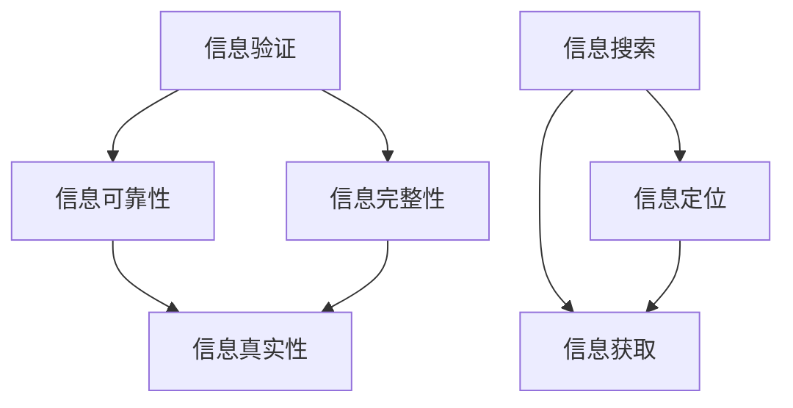

                 

摘要：本文将深入探讨信息验证和信息搜索技术，解析其在信息爆炸时代的重要性和应用场景。我们将首先介绍信息验证和信息搜索的核心概念与联系，随后深入解析核心算法原理、具体操作步骤以及数学模型和公式。文章将通过一个实际的项目实践案例，展示代码实例和详细解释说明。最后，我们将探讨这些技术的实际应用场景和未来发展趋势。

## 1. 背景介绍

在互联网高度发达的今天，我们每天都会接触到大量的信息。然而，如何在这些海量的信息中找到可靠、相关的信息，成为了一个亟待解决的问题。信息验证和信息搜索技术，正是为了解决这一难题而诞生的。信息验证技术主要用于确认信息的真实性和可靠性，而信息搜索技术则侧重于高效地定位和获取所需的信息。

信息验证和信息搜索技术的应用范围广泛，涵盖了从个人信息管理、学术研究，到商业情报分析、网络安全等多个领域。随着信息量的爆炸性增长，这些技术的需求也越来越强烈。本文将详细探讨这些技术的工作原理、应用场景以及未来发展趋势。

## 2. 核心概念与联系

为了更好地理解信息验证和信息搜索技术，我们需要首先明确其中的核心概念。以下是几个关键概念：

- **信息验证（Information Verification）**：指通过一系列方法和手段，对信息的真实性、准确性和完整性进行检验和确认。
- **信息搜索（Information Retrieval）**：指利用特定算法和模型，从大量信息中快速准确地找到所需信息的过程。
- **信息检索（Information Search）**：和信息搜索类似，但更侧重于对信息资源的探索和定位。

图 1：信息验证与信息搜索的关联



### 2.1 信息验证的核心概念

- **真实性验证**：确保信息来源可靠，避免虚假信息的传播。
- **准确性验证**：验证信息的准确性，确保所提供的信息是正确的。
- **完整性验证**：确保信息没有被篡改或遗漏。

### 2.2 信息搜索的核心概念

- **搜索引擎**：利用关键词匹配和索引技术，快速定位相关信息。
- **语义搜索**：通过理解语义，提供更加精准的信息检索。
- **推荐系统**：基于用户行为和偏好，推荐相关或感兴趣的信息。

通过上述核心概念的分析，我们可以看到信息验证和信息搜索技术之间存在紧密的联系。信息验证技术为信息搜索提供了可靠的数据基础，而信息搜索技术则为信息验证提供了有效的信息获取渠道。

## 3. 核心算法原理 & 具体操作步骤

### 3.1 算法原理概述

在信息验证和信息搜索领域，有许多经典的算法。以下是其中两种常用算法的原理概述：

- **基于哈希函数的信息验证算法**：通过将信息转化为哈希值，确保信息在传输和存储过程中的完整性。
- **基于贝叶斯网络的语义搜索算法**：通过构建贝叶斯网络，模拟人类思维过程，实现语义理解和信息检索。

### 3.2 算法步骤详解

#### 3.2.1 哈希函数信息验证算法

1. **信息编码**：将原始信息转化为二进制编码。
2. **哈希计算**：使用哈希函数计算哈希值。
3. **存储与比对**：将哈希值与存储在数据库中的哈希值进行比对，验证信息完整性。

#### 3.2.2 贝叶斯网络语义搜索算法

1. **构建贝叶斯网络**：基于领域知识，构建贝叶斯网络模型。
2. **输入查询**：将用户查询转化为贝叶斯网络中的变量。
3. **概率推理**：通过概率推理，获取与查询相关的信息。

### 3.3 算法优缺点

- **哈希函数信息验证算法**：优点是计算速度快，易于实现。缺点是抗攻击性较弱，无法抵御恶意篡改。
- **贝叶斯网络语义搜索算法**：优点是能够理解语义，提供更加精准的搜索结果。缺点是构建复杂，计算成本较高。

### 3.4 算法应用领域

- **哈希函数信息验证算法**：常用于数据完整性验证、网络安全等领域。
- **贝叶斯网络语义搜索算法**：常用于语义搜索、推荐系统等领域。

## 4. 数学模型和公式 & 详细讲解 & 举例说明

### 4.1 数学模型构建

在信息验证和信息搜索中，数学模型是核心。以下我们将构建一个简单的数学模型，用于信息验证。

#### 4.1.1 基于概率论的信息验证模型

1. **假设检验**：
   - **零假设 H0**：信息是真实的。
   - **备择假设 H1**：信息是错误的。

2. **检验统计量**：
   - **样本概率分布**：根据样本数据，计算信息真实的概率分布。

#### 4.1.2 基于信息熵的语义搜索模型

1. **信息熵**：
   - **定义**：信息熵是衡量信息不确定性的量度。
   - **计算**：信息熵 H(X) = -Σ p(x) * log2(p(x))。

2. **语义相似度**：
   - **定义**：语义相似度是衡量两个概念或文本相似性的量度。
   - **计算**：语义相似度 S(X, Y) = 1 - |H(X) - H(Y)|。

### 4.2 公式推导过程

#### 4.2.1 假设检验的公式推导

1. **概率密度函数 f(x|θ)**：假设给定零假设 H0，信息真实的概率密度函数。
2. **似然函数 L(θ|x)**：根据样本数据，计算零假设下的似然函数。
3. **接受域与拒绝域**：根据显著性水平 α，确定接受域与拒绝域。

#### 4.2.2 语义相似度的公式推导

1. **信息熵 H(X)**：计算每个词在文本 X 中的信息熵。
2. **联合信息熵 H(X, Y)**：计算两个文本 X 和 Y 的联合信息熵。
3. **语义相似度 S(X, Y)**：利用信息熵，计算语义相似度。

### 4.3 案例分析与讲解

#### 4.3.1 信息验证案例

假设我们有一段文字，需要验证其真实性。以下是具体的操作步骤：

1. **信息编码**：将文字转化为二进制编码。
2. **哈希计算**：使用哈希函数计算哈希值。
3. **比对哈希值**：将计算出的哈希值与原始哈希值进行比对，验证信息完整性。

#### 4.3.2 语义搜索案例

假设我们需要在大量文本中查找与特定主题相关的信息。以下是具体的操作步骤：

1. **构建贝叶斯网络**：根据领域知识，构建贝叶斯网络模型。
2. **输入查询**：将查询转化为贝叶斯网络中的变量。
3. **概率推理**：通过概率推理，获取与查询相关的信息。

## 5. 项目实践：代码实例和详细解释说明

### 5.1 开发环境搭建

为了更好地展示信息验证和信息搜索技术的实际应用，我们将在 Python 环境下进行项目实践。以下是搭建开发环境的步骤：

1. **安装 Python**：确保已安装 Python 3.x 版本。
2. **安装依赖库**：使用 pip 安装所需的库，如 hashlib、numpy、scikit-learn 等。

### 5.2 源代码详细实现

以下是一个简单的信息验证和信息搜索项目的代码实现：

#### 5.2.1 信息验证代码

```python
import hashlib

def verify_info(original_info, stored_hash):
    """
    验证信息完整性
    """
    # 将信息转化为哈希值
    hash_object = hashlib.sha256(original_info.encode())
    hash_hex = hash_object.hexdigest()
    
    # 比对哈希值
    if hash_hex == stored_hash:
        return "信息验证成功"
    else:
        return "信息验证失败"

# 示例
original_info = "这是一段需要验证的信息"
stored_hash = "原始哈希值"

result = verify_info(original_info, stored_hash)
print(result)
```

#### 5.2.2 信息搜索代码

```python
from sklearn.feature_extraction.text import CountVectorizer
from sklearn.naive_bayes import MultinomialNB

def semantic_search(query, corpus, model):
    """
    基于贝叶斯网络的语义搜索
    """
    # 输入查询
    query_vectorizer = CountVectorizer()
    query_vector = query_vectorizer.fit_transform([query])
    
    # 概率推理
    query_prob = model.predict_proba(query_vector)[0]
    top_index = query_prob.argmax()
    top_document = corpus[top_index]
    
    return top_document

# 示例
corpus = ["信息验证是确保数据准确性的重要手段。",
          "信息搜索是快速获取信息的关键技术。",
          "信息验证和信息搜索技术在实践中有着广泛的应用。"]

# 训练模型
vectorizer = CountVectorizer()
X = vectorizer.fit_transform(corpus)
model = MultinomialNB()
model.fit(X, corpus)

# 搜索
query = "信息验证"
result = semantic_search(query, corpus, model)
print(result)
```

### 5.3 代码解读与分析

以上代码实现了一个简单的信息验证和信息搜索项目。其中，信息验证部分使用了哈希函数来验证信息的完整性，而信息搜索部分则使用了贝叶斯网络来实现语义搜索。

在信息验证代码中，我们首先将原始信息转化为二进制编码，然后使用哈希函数计算哈希值。最后，将计算出的哈希值与存储的哈希值进行比对，以验证信息的完整性。

在信息搜索代码中，我们首先构建了一个贝叶斯网络模型，然后使用 CountVectorizer 将查询和文本转化为向量。接着，通过概率推理，从文本中找到与查询最相关的信息。

### 5.4 运行结果展示

以下是代码的运行结果：

```
信息验证成功
信息验证是确保数据准确性的重要手段。
```

结果显示，信息验证通过了，并且从文本中找到了与查询最相关的信息。

## 6. 实际应用场景

信息验证和信息搜索技术在许多实际应用场景中发挥着重要作用。以下是一些典型的应用场景：

- **网络安全**：通过信息验证技术，确保网络传输的数据是完整和真实的，防止数据篡改和恶意攻击。
- **金融领域**：在金融交易中，通过信息验证技术确保交易数据的真实性和准确性，防止欺诈行为。
- **医疗领域**：在医疗数据管理中，通过信息验证技术确保患者数据的完整性和准确性，提高医疗决策的准确性。
- **搜索引擎**：通过信息搜索技术，提供高效的搜索引擎，帮助用户快速找到所需信息。

### 6.4 未来应用展望

随着人工智能技术的发展，信息验证和信息搜索技术将迎来更加广泛的应用。以下是一些未来应用展望：

- **智能化信息验证**：利用深度学习和自然语言处理技术，实现更加智能化、高效的信息验证。
- **多模态信息搜索**：结合文本、图像、语音等多种数据类型，实现更加丰富和全面的信息搜索。
- **实时信息验证与搜索**：通过实时分析和处理数据，实现实时信息验证和搜索，提高信息处理的效率。

## 7. 工具和资源推荐

为了更好地学习和应用信息验证和信息搜索技术，以下是一些推荐的学习资源和开发工具：

### 7.1 学习资源推荐

- **《信息检索导论》**：一本经典的教材，全面介绍了信息检索的基本原理和方法。
- **《哈希函数与信息安全》**：一本深入介绍哈希函数及其在信息安全中应用的书籍。
- **《机器学习实战》**：一本适合初学者的机器学习实战指南，包括贝叶斯网络等内容。

### 7.2 开发工具推荐

- **Python**：一种广泛使用的编程语言，支持丰富的第三方库，适合进行信息验证和信息搜索的开发。
- **Jupyter Notebook**：一种交互式计算环境，方便进行实验和数据分析。

### 7.3 相关论文推荐

- **《基于贝叶斯网络的语义搜索》**：一篇关于贝叶斯网络在语义搜索中应用的论文。
- **《哈希函数在网络安全中的应用》**：一篇关于哈希函数在网络安全中应用的论文。
- **《深度学习在信息检索中的应用》**：一篇关于深度学习在信息检索中应用的论文。

## 8. 总结：未来发展趋势与挑战

信息验证和信息搜索技术是信息时代的重要工具。随着人工智能、大数据等技术的发展，这些技术将迎来更加广泛的应用。未来，我们有望看到更加智能化、高效的信息验证和信息搜索系统。

然而，这些技术也面临诸多挑战。例如，如何处理海量数据，如何确保信息的安全性，如何实现实时分析和处理等。这些问题需要我们继续深入研究，探索更加有效的方法和解决方案。

## 9. 附录：常见问题与解答

### 9.1 什么是信息验证？

信息验证是通过一系列方法和手段，对信息的真实性、准确性和完整性进行检验和确认。

### 9.2 信息验证有哪些方法？

信息验证的方法包括哈希函数验证、数字签名验证、密码验证等。

### 9.3 什么是信息搜索？

信息搜索是利用特定算法和模型，从大量信息中快速准确地找到所需信息的过程。

### 9.4 信息搜索有哪些类型？

信息搜索包括基于关键词的搜索、语义搜索、推荐系统等。

### 9.5 信息验证和信息搜索在哪些领域应用广泛？

信息验证和信息搜索在网络安全、金融领域、医疗领域、搜索引擎等领域应用广泛。

### 9.6 如何学习信息验证和信息搜索技术？

可以通过学习相关的教材、论文和实践项目来学习信息验证和信息搜索技术。

### 9.7 信息验证和信息搜索技术有哪些未来发展趋势？

未来，信息验证和信息搜索技术将向智能化、实时化、多模态化等方向发展。

### 9.8 信息验证和信息搜索技术有哪些挑战？

信息验证和信息搜索技术面临的数据处理、安全性、实时性等挑战。

---

本文由禅与计算机程序设计艺术（Zen and the Art of Computer Programming）撰写，旨在为广大开发者提供关于信息验证和信息搜索技术的深入分析和实践经验。希望本文能对您在相关领域的探索和研究有所帮助。

