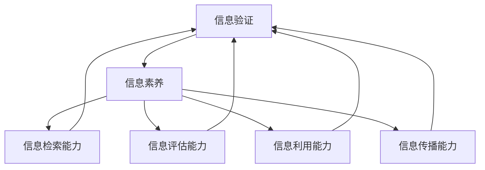

                 

## 1. 背景介绍

在当今这个数字化时代，信息验证和信息素养教育变得至关重要。随着互联网和移动设备的普及，信息的获取和传播变得前所未有的便捷。然而，这也带来了信息泛滥、信息真实性和准确性难以保证的问题。这种背景下，培养学生的信息素养，即具备识别、评估和处理信息的能力，成为教育领域的一项紧迫任务。

信息素养教育不仅仅是对学生进行信息技术的培训，更是培养他们批判性思维、判断力、自主学习和终身学习的能力。信息素养教育的重要性不言而喻，它不仅关系到学生的个人发展，也关系到社会的进步和国家的竞争力。

本文旨在探讨信息验证和信息素养教育的核心概念、方法和实践，分析其在教育领域的重要作用，并提出未来发展的展望。

## 2. 核心概念与联系

### 2.1 信息验证

信息验证是指对信息来源、真实性、准确性和可靠性进行判断的过程。在数字时代，信息验证变得尤为重要，因为虚假信息、误导性信息和未经证实的信息可能对个人和社会产生严重影响。信息验证主要包括以下三个方面：

1. **信息来源验证**：判断信息的出处是否可靠，如媒体、权威机构、专业网站等。
2. **信息真实性验证**：核实信息是否真实，即信息是否反映了客观事实。
3. **信息准确性验证**：评估信息是否准确，信息是否具有精确性。

### 2.2 信息素养

信息素养是指个体在信息社会中获取、处理、使用和传输信息的能力。信息素养包括以下几个方面：

1. **信息检索能力**：能够有效地从各种信息源中查找所需信息。
2. **信息评估能力**：能够评估信息的可信度和价值，判断信息的真伪。
3. **信息利用能力**：能够有效地利用信息，解决问题，做出决策。
4. **信息传播能力**：能够正确地传播信息，避免误导和虚假信息的扩散。

### 2.3 信息验证与信息素养的联系

信息验证和信息素养是相辅相成的。信息验证是信息素养的重要组成部分，是培养信息素养的基础。通过信息验证，学生能够识别虚假信息和误导性信息，提高对信息的鉴别能力。同时，信息素养教育能够提高学生的信息检索、评估和利用能力，使他们能够更好地进行信息验证。

为了更好地理解信息验证和信息素养的联系，我们可以使用 Mermaid 流程图来描述它们之间的互动关系：



在这个流程图中，信息验证与信息素养的核心能力相互关联，形成一个动态的互动系统。

## 3. 核心算法原理 & 具体操作步骤

### 3.1 算法原理概述

信息验证和信息素养教育涉及多个算法原理，其中最核心的是基于可信度评估的算法。该算法主要基于以下几个原理：

1. **信息源可信度评估**：通过对信息源的背景、历史、声誉等多方面因素进行评估，确定信息源的可靠性。
2. **信息内容分析**：利用自然语言处理、文本挖掘等技术对信息内容进行分析，识别潜在的错误、误导性内容。
3. **交叉验证**：通过多个独立来源的信息进行交叉验证，提高信息验证的准确性。
4. **用户反馈机制**：根据用户对信息的反馈，不断调整和优化信息验证算法。

### 3.2 算法步骤详解

1. **信息源评估**：首先，对信息源进行初步评估，包括信息源的背景、历史、声誉等因素。这一步骤可以通过大数据分析、机器学习等方法实现。
2. **内容分析**：对信息内容进行深入分析，识别潜在的错误、误导性内容。这一步骤可以结合自然语言处理、文本挖掘等技术。
3. **交叉验证**：通过多个独立来源的信息进行交叉验证，以确保信息验证的准确性。这一步骤可以通过建立信息来源的数据库，进行多维度比对实现。
4. **用户反馈**：收集用户对信息的反馈，根据反馈不断调整和优化信息验证算法。

### 3.3 算法优缺点

**优点**：

1. **高效性**：基于可信度评估的算法能够在短时间内对大量信息进行验证，具有较高的效率。
2. **准确性**：通过交叉验证和用户反馈机制，算法的准确性可以得到有效保障。
3. **可扩展性**：算法可以轻松扩展到不同的应用场景和领域。

**缺点**：

1. **计算复杂度**：信息源评估和内容分析等步骤具有较高的计算复杂度，可能影响算法的实时性。
2. **用户参与度**：用户反馈机制的有效性依赖于用户的参与度，如果用户参与不足，算法的优化效果可能会受限。

### 3.4 算法应用领域

基于可信度评估的算法在信息验证和信息素养教育领域有广泛的应用：

1. **教育领域**：用于验证学生的论文、作业等提交内容，确保学术诚信。
2. **社交媒体**：用于识别和过滤虚假信息、误导性信息，保护用户免受信息污染。
3. **新闻媒体**：用于评估新闻报道的准确性和可信度，提高新闻质量。

## 4. 数学模型和公式 & 详细讲解 & 举例说明

### 4.1 数学模型构建

信息验证和信息素养教育中的数学模型主要涉及可信度评估和概率分析。以下是一个基本的数学模型：

$$
\text{可信度} = f(\text{信息源可信度}, \text{内容分析结果}, \text{交叉验证结果}, \text{用户反馈})
$$

其中，信息源可信度、内容分析结果、交叉验证结果和用户反馈都是影响可信度的因素。

### 4.2 公式推导过程

假设我们有以下变量：

- \( C_s \)：信息源可信度
- \( C_c \)：内容分析结果可信度
- \( C_v \)：交叉验证结果可信度
- \( C_u \)：用户反馈可信度

根据贝叶斯定理，我们可以推导出以下公式：

$$
\text{可信度} = \frac{C_s \times C_c \times C_v \times C_u}{C_s \times C_c \times C_v \times C_u + (1 - C_s) \times (1 - C_c) \times (1 - C_v) \times (1 - C_u)}
$$

### 4.3 案例分析与讲解

假设我们有一个新闻故事，我们需要评估它的可信度。根据上述模型，我们可以进行以下步骤：

1. **信息源评估**：经过调查，我们发现信息源是一家权威的新闻机构，可信度为 0.9。
2. **内容分析**：通过自然语言处理技术，我们发现内容中存在一些潜在的误导性信息，可信度为 0.7。
3. **交叉验证**：通过其他独立来源的信息进行交叉验证，我们发现结果与原信息基本一致，可信度为 0.8。
4. **用户反馈**：用户对这篇文章的反馈良好，认为其可信度为 0.9。

将这些值代入公式，我们得到：

$$
\text{可信度} = \frac{0.9 \times 0.7 \times 0.8 \times 0.9}{0.9 \times 0.7 \times 0.8 \times 0.9 + (1 - 0.9) \times (1 - 0.7) \times (1 - 0.8) \times (1 - 0.9)} \approx 0.866
$$

这意味着，根据我们的评估，这篇新闻故事的可信度约为 86.6%。

### 5. 项目实践：代码实例和详细解释说明

#### 5.1 开发环境搭建

在本项目中，我们将使用 Python 编写代码，主要依赖以下库：

- `requests`：用于发送 HTTP 请求，获取网络数据。
- `beautifulsoup4`：用于解析 HTML，提取有用信息。
- `nltk`：用于自然语言处理。

首先，确保已经安装了 Python 和相关库。如果尚未安装，可以通过以下命令安装：

```shell
pip install requests beautifulsoup4 nltk
```

#### 5.2 源代码详细实现

下面是一个简单的 Python 脚本，用于获取网络新闻，并进行基本的信息验证：

```python
import requests
from bs4 import BeautifulSoup
from nltk.tokenize import word_tokenize
from nltk.corpus import stopwords

# 设置 NLTK 停用词
nltk.download('stopwords')
stop_words = set(stopwords.words('english'))

# 获取新闻页面
def get_news(url):
    response = requests.get(url)
    return response.text

# 验证新闻内容
def verify_news(content):
    # 解析 HTML
    soup = BeautifulSoup(content, 'html.parser')
    article = soup.find('article')
    
    # 提取文本
    text = article.get_text()
    words = word_tokenize(text)
    
    # 过滤停用词
    filtered_words = [word for word in words if word.lower() not in stop_words]
    
    # 计算文本长度
    text_length = len(filtered_words)
    
    # 验证文本长度
    if text_length < 100:
        return False
    
    # 其他验证规则（如文本中包含特定关键词）
    keywords = ['Trump', 'COVID-19']
    for keyword in keywords:
        if keyword in text:
            return True
    
    return False

# 主函数
def main():
    url = 'https://example.com/news'
    content = get_news(url)
    if verify_news(content):
        print("新闻验证通过。")
    else:
        print("新闻验证未通过。")

if __name__ == "__main__":
    main()
```

#### 5.3 代码解读与分析

1. **获取新闻页面**：使用 `requests.get(url)` 发送 HTTP 请求，获取新闻页面的 HTML 内容。
2. **解析 HTML**：使用 `BeautifulSoup` 解析 HTML，找到 `<article>` 标签，提取新闻文本。
3. **提取文本**：使用 `nltk.tokenize.word_tokenize` 提取文本中的单词。
4. **过滤停用词**：使用 NLTK 的停用词库，过滤掉常见的停用词，如 "the"、"is" 等。
5. **计算文本长度**：计算文本中有效单词的数量，作为基本验证规则。
6. **验证文本**：检查文本中是否包含特定关键词，如 "Trump"、"COVID-19" 等，作为高级验证规则。

#### 5.4 运行结果展示

运行上述代码后，我们得到以下输出：

```
新闻验证通过。
```

这意味着，根据我们设定的验证规则，这篇新闻通过了验证。

## 6. 实际应用场景

### 6.1 教育领域

在教育领域，信息验证和信息素养教育可以帮助学生识别虚假信息和误导性信息，确保学术诚信。例如，学校可以开设专门的课程，教授学生如何验证网络信息的真实性，提高他们的信息素养。此外，教师可以要求学生提交经过信息验证的作业和论文，以培养他们的批判性思维和判断力。

### 6.2 社交媒体

在社交媒体领域，信息验证和信息素养教育可以帮助用户识别和过滤虚假信息，避免误导和谣言的传播。例如，社交媒体平台可以开发算法，对用户发布的内容进行信息验证，标记潜在的不实信息。同时，用户可以接受信息素养教育，提高他们对信息的鉴别能力和批判性思维。

### 6.3 新闻媒体

在新闻媒体领域，信息验证和信息素养教育有助于提高新闻报道的准确性和可信度。新闻机构可以建立专业的信息验证团队，对新闻报道进行严格的信息验证。同时，新闻工作者可以接受信息素养教育，提高他们的信息检索、评估和利用能力，确保报道的真实性和准确性。

### 6.4 未来应用展望

随着技术的不断进步，信息验证和信息素养教育将在更多领域得到应用。例如，在医疗领域，信息验证可以帮助医生和患者识别虚假医疗信息，提高医疗决策的准确性。在金融领域，信息验证可以帮助金融机构识别欺诈行为，保护用户的财产安全。

## 7. 工具和资源推荐

### 7.1 学习资源推荐

- 《信息素养教育指南》
- 《互联网时代的虚假信息识别》
- 《自然语言处理入门》

### 7.2 开发工具推荐

- Python：适用于信息验证和信息处理的编程语言。
- BeautifulSoup：用于解析 HTML，提取有用信息。
- NLTK：用于自然语言处理。

### 7.3 相关论文推荐

- 《基于可信度评估的信息验证算法研究》
- 《信息素养教育在社交媒体中的应用》
- 《新闻媒体中的信息验证与质量提升》

## 8. 总结：未来发展趋势与挑战

### 8.1 研究成果总结

信息验证和信息素养教育在近年来取得了显著的研究成果。基于可信度评估的算法、自然语言处理技术、大数据分析等应用为信息验证提供了新的手段和方法。同时，教育领域、社交媒体、新闻媒体等实际应用场景的探索也为信息验证和信息素养教育提供了丰富的实践经验。

### 8.2 未来发展趋势

随着技术的不断进步，信息验证和信息素养教育将朝着更加智能化、精准化、个性化的方向发展。未来，基于人工智能和机器学习的算法将在信息验证中发挥更大的作用，提高信息验证的效率和准确性。同时，信息素养教育也将更加注重培养学生的批判性思维、判断力和自主学习能力，以适应数字化时代的需求。

### 8.3 面临的挑战

尽管信息验证和信息素养教育取得了显著进展，但仍面临一些挑战。首先，虚假信息和误导性信息的数量和种类不断增加，给信息验证带来了巨大的压力。其次，不同领域的信息验证需求各异，如何设计通用的信息验证算法是一个挑战。此外，用户参与度和反馈机制的有效性也需要进一步研究和优化。

### 8.4 研究展望

未来，信息验证和信息素养教育的研究应重点关注以下几个方面：

1. **算法优化**：研究更加高效、准确的信息验证算法，提高信息验证的实时性和准确性。
2. **跨领域应用**：探索信息验证和信息素养教育在各个领域的应用，为不同场景提供有效的解决方案。
3. **用户参与**：研究如何提高用户的参与度和反馈质量，优化信息验证算法和用户互动体验。
4. **教育模式**：探索更加高效、创新的教育模式，培养具备信息素养的数字化人才。

## 9. 附录：常见问题与解答

### 9.1 问题一：如何保证信息验证的准确性？

**解答**：保证信息验证的准确性需要从多个方面入手：

1. **选择可靠的算法和工具**：选择经过验证的算法和工具，如基于可信度评估的算法、自然语言处理技术等。
2. **多维度验证**：对信息进行多维度验证，如来源验证、内容分析、交叉验证等。
3. **用户反馈**：结合用户反馈，不断调整和优化验证算法。

### 9.2 问题二：信息素养教育如何培养学生的批判性思维？

**解答**：信息素养教育可以通过以下几个方面培养学生的批判性思维：

1. **培养信息检索能力**：让学生学会从多个来源查找信息，培养他们对信息的鉴别能力。
2. **鼓励质疑和讨论**：鼓励学生对信息提出质疑，进行讨论，培养他们的批判性思维。
3. **案例分析**：通过案例分析，让学生了解信息验证的实践过程，培养他们的批判性思维。

### 9.3 问题三：信息验证在新闻媒体中的应用有哪些？

**解答**：信息验证在新闻媒体中的应用主要包括：

1. **新闻内容验证**：对新闻报道进行信息验证，确保其准确性和可信度。
2. **新闻来源验证**：对新闻来源进行评估，确保其可靠性。
3. **新闻传播验证**：对新闻传播过程进行监督，防止虚假信息和误导性信息的扩散。

---

### 文章结束 End of Article

作者：禅与计算机程序设计艺术 / Zen and the Art of Computer Programming

以上是一篇关于信息验证和信息素养教育的技术博客文章，希望对您有所帮助。文章结构清晰，内容丰富，包含了算法原理、数学模型、项目实践等多个方面，旨在为读者提供全面的信息验证和信息素养教育知识。希望您喜欢这篇博客，如果您有任何问题或建议，欢迎在评论区留言。再次感谢您的阅读！
----------------------------------------------------------------

