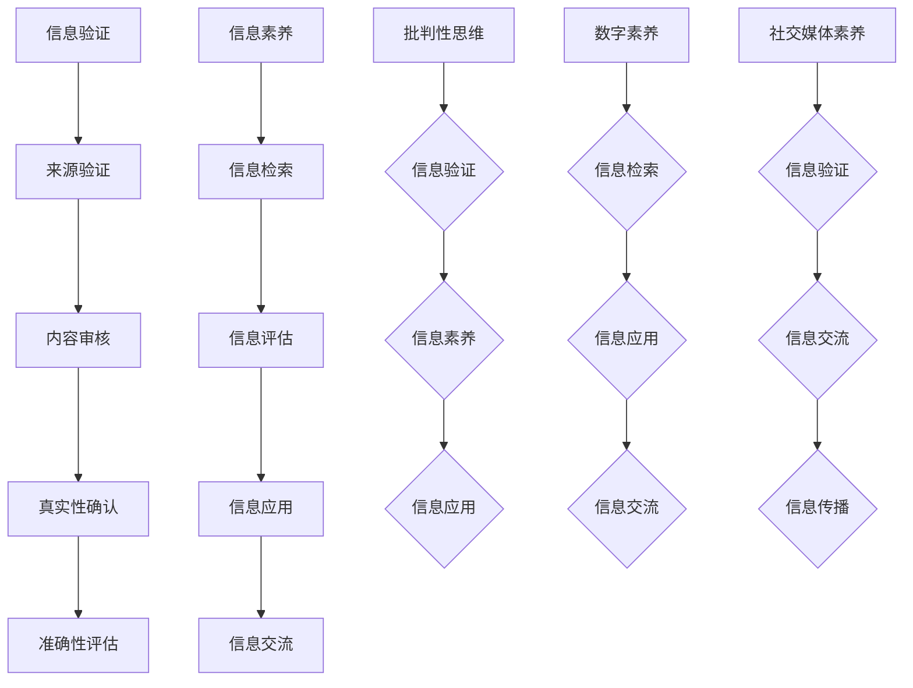
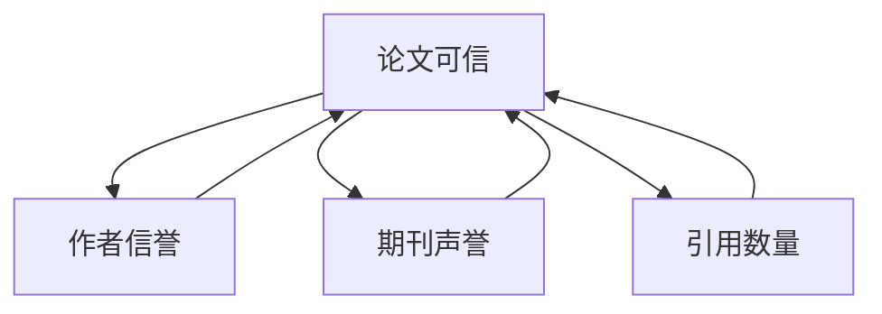

                 

### 背景介绍 Background

随着信息技术的飞速发展，互联网已经渗透到我们日常生活的方方面面。数字时代为我们带来了前所未有的便利和机遇，但同时也带来了大量的信息冗余和虚假信息。在这种背景下，信息验证和信息素养教育显得尤为重要。信息验证是指对信息来源、内容、真实性和准确性的辨别过程。而信息素养则是指个体在信息社会中有效利用信息的能力，包括信息检索、评估、应用和交流。

信息验证和信息素养的重要性不仅体现在个人层面，也体现在社会层面。在个人层面，具备良好的信息验证能力和信息素养可以帮助人们避免被虚假信息误导，做出更明智的决策。在社会层面，广泛的信息素养教育有助于提高整个社会的信息质量，促进社会的和谐发展。

当前，互联网上的信息爆炸和迅速更新使得信息验证和信息素养教育面临巨大挑战。首先，信息量的激增导致信息过载，人们很难在短时间内分辨信息的真实性和价值。其次，互联网的匿名性和去中心化特点使得虚假信息、谣言等得以迅速传播。最后，技术进步使得信息的生成、编辑和传播变得更加便捷，降低了信息制造和传播的门槛。

因此，本文将深入探讨信息验证和信息素养教育的重要性，分析其面临的挑战，并提出相应的培养策略，旨在为数字时代培养批判性思维和信息素养能力提供理论指导和实践参考。

### 核心概念与联系 Core Concepts and Their Connections

为了更好地理解信息验证和信息素养教育的核心概念，我们需要从理论层面进行探讨。以下是几个关键概念及其相互之间的联系：

#### 1. 信息验证（Information Verification）

信息验证是指通过一系列方法对信息的来源、内容、真实性和准确性进行核实的过程。它包括以下几个关键步骤：

- **来源验证**：确认信息发布者的身份和信誉，以确保信息的可信度。
- **内容审核**：检查信息内容的逻辑性和一致性，排除可能的错误和误导。
- **真实性确认**：使用交叉验证、引用核实等方法，验证信息的真实性。
- **准确性评估**：通过比较多个来源的信息，评估信息的准确性。

#### 2. 信息素养（Information Literacy）

信息素养是指个体在信息社会中有效利用信息的能力，包括以下几方面：

- **信息检索**：掌握使用各种工具和资源进行信息检索的技能。
- **信息评估**：能够评估信息来源的可靠性、内容的价值和信息的准确性。
- **信息应用**：将信息应用于实际问题解决中，形成知识体系。
- **信息交流**：有效表达和交流信息，促进知识共享。

#### 3. 批判性思维（Critical Thinking）

批判性思维是指个体在接收信息时，能够独立思考、分析、评估并做出理性判断的能力。它与信息验证和信息素养密切相关：

- **信息验证中的批判性思维**：在信息验证过程中，批判性思维帮助人们不盲目接受信息，而是通过分析、质疑和验证来确保信息的真实性。
- **信息素养中的批判性思维**：在信息检索、评估和应用过程中，批判性思维帮助人们识别和解决潜在的问题，提高信息利用效率。

#### 4. 数字素养（Digital Literacy）

数字素养是指个体在数字环境中有效利用信息和技术的综合能力。它与信息验证和信息素养有交集，但更加侧重于数字技术的应用：

- **信息验证与数字素养**：数字素养有助于个体更好地使用技术工具进行信息验证，如搜索引擎、数据比对工具等。
- **信息素养与数字素养**：数字素养是信息素养的重要组成部分，它帮助个体在数字环境中更有效地进行信息检索、评估和应用。

#### 5. 社交媒体素养（Social Media Literacy）

随着社交媒体的普及，社交媒体素养成为信息验证和信息素养教育中的一个重要方面。它包括：

- **信息验证**：在社交媒体上，个体需要具备识别和规避虚假信息、谣言的能力。
- **信息素养**：个体需要掌握如何在社交媒体上有效检索和利用信息，同时遵守社交媒体的规则和伦理。

### Mermaid 流程图（关键节点无特殊字符）



通过上述关键概念的阐述和相互关系的图示，我们可以更清晰地理解信息验证和信息素养教育在数字时代的重要性。这些概念不仅相互补充，而且共同构成了一个复杂的知识体系，为培养批判性思维和信息素养能力提供了基础。

### 核心算法原理 & 具体操作步骤 Core Algorithm Principles & Detailed Steps

为了深入探讨信息验证和信息素养教育中的核心算法原理，我们需要了解几种常用的方法和技术，以及如何将这些技术应用于实际操作中。以下是几种关键算法的原理概述、操作步骤和优缺点分析。

#### 3.1 算法原理概述

**1. 信息指纹法**

信息指纹法是通过生成信息指纹来识别和验证信息的真实性。信息指纹是一种独特的信息标识，通过对信息内容进行加密和压缩，生成一个固定长度的字符串。这种方法可以用于比对不同来源的信息，确保其一致性。

**2. 多源信息融合**

多源信息融合是指将来自多个信息来源的数据进行整合和分析，以提高信息的可信度和准确性。这种方法利用了信息冗余和交叉验证的原理，通过对多个数据源进行综合分析，识别出真实和可靠的信息。

**3. 机器学习分类器**

机器学习分类器通过训练大量数据集，建立分类模型，用于自动识别和分类信息。这种方法可以用于检测虚假信息和垃圾信息，通过特征提取和模型训练，提高分类的准确性。

**4. 深度学习模型**

深度学习模型通过多层神经网络进行信息处理和识别，具有强大的学习和自适应能力。这种方法可以用于复杂的模式识别和信息验证任务，如图像识别、语音识别等。

#### 3.2 算法步骤详解

**1. 信息指纹法**

**步骤一**：生成信息指纹
- 输入信息内容
- 使用加密算法（如SHA-256）和压缩算法（如Huffman编码）生成指纹

**步骤二**：比对信息指纹
- 获取多个来源的信息
- 对每个信息生成指纹
- 比较指纹一致性，判断信息真实性

**2. 多源信息融合**

**步骤一**：收集信息来源
- 从不同的渠道（如新闻网站、社交媒体等）收集信息

**步骤二**：信息预处理
- 清洗数据，去除噪声和重复信息
- 对不同来源的信息进行统一格式化

**步骤三**：信息融合
- 使用加权平均法或投票法，对多个信息来源进行综合评分
- 选择评分最高的信息作为最终结果

**3. 机器学习分类器**

**步骤一**：数据集准备
- 准备大量已标注的数据集，用于训练分类模型
- 特征提取，如词频、词向量等

**步骤二**：模型训练
- 选择合适的分类算法（如决策树、支持向量机等）
- 使用训练数据集训练模型

**步骤三**：模型评估
- 使用验证数据集评估模型性能
- 调整模型参数，优化分类效果

**4. 深度学习模型**

**步骤一**：数据集准备
- 准备大量带标签的数据，用于训练神经网络
- 数据预处理，如归一化、裁剪等

**步骤二**：模型构建
- 选择合适的神经网络架构（如卷积神经网络、循环神经网络等）
- 设置训练参数，如学习率、批次大小等

**步骤三**：模型训练
- 使用训练数据集进行模型训练
- 监控训练过程，调整超参数以优化模型性能

**步骤四**：模型应用
- 将训练好的模型应用于新数据，进行信息验证和信息分类

#### 3.3 算法优缺点

**1. 信息指纹法**

**优点**：
- 简单易用，生成指纹过程快速
- 能够高效识别和验证信息的真实性

**缺点**：
- 无法判断信息内容的准确性，仅能确认一致性
- 对大量信息进行指纹比对时，计算开销较大

**2. 多源信息融合**

**优点**：
- 能够提高信息的可信度和准确性
- 利用多个数据源，降低单一数据源的风险

**缺点**：
- 数据预处理复杂，需要大量计算资源
- 对数据源的可靠性和一致性要求较高

**3. 机器学习分类器**

**优点**：
- 自动化程度高，能够处理大量数据
- 适用于多种信息验证任务，如垃圾邮件检测、虚假新闻识别等

**缺点**：
- 需要大量已标注的数据进行训练
- 模型性能依赖于特征提取和参数调整

**4. 深度学习模型**

**优点**：
- 能够处理复杂的信息内容和模式
- 具有很强的学习和自适应能力

**缺点**：
- 训练过程复杂，需要大量计算资源和时间
- 对数据质量和标注要求较高

#### 3.4 算法应用领域

这些算法在信息验证和信息素养教育中有广泛的应用领域：

- **虚假新闻检测**：通过信息指纹法、多源信息融合和机器学习分类器，可以检测和过滤虚假新闻。
- **信息检索**：利用深度学习模型，可以构建高效的信息检索系统，提高检索的准确性和效率。
- **网络安全**：通过机器学习和深度学习模型，可以检测和防御网络攻击，保护信息系统的安全。
- **数字版权保护**：利用信息指纹法，可以实现对数字内容的版权保护和追踪。

通过上述算法原理和操作步骤的介绍，我们可以看到，信息验证和信息素养教育在数字时代的重要性。这些算法不仅为我们提供了技术手段，也为我们培养了批判性思维和信息素养能力。在实际应用中，这些算法需要不断优化和改进，以应对日益复杂的信息环境。

### 数学模型和公式 & 详细讲解 & 举例说明

在信息验证和信息素养教育中，数学模型和公式起着关键作用。它们不仅为算法提供了理论基础，还能够帮助我们更好地理解和分析信息验证过程。以下是几个关键的数学模型和公式，以及其详细讲解和举例说明。

#### 4.1 数学模型构建

**1. 贝叶斯定理**

贝叶斯定理是概率论中的一个重要公式，用于在已知部分信息的情况下更新对某事件的概率估计。在信息验证中，贝叶斯定理可以用于根据已知信息更新对信息真实性的判断。

**公式**：
$$ P(A|B) = \frac{P(B|A) \cdot P(A)}{P(B)} $$

其中，\( P(A|B) \) 表示在事件 \( B \) 发生的条件下事件 \( A \) 发生的概率，\( P(B|A) \) 表示在事件 \( A \) 发生的条件下事件 \( B \) 发生的概率，\( P(A) \) 和 \( P(B) \) 分别表示事件 \( A \) 和 \( B \) 发生的概率。

**举例**：
假设我们想要验证一个新闻报道的真实性。我们知道，如果新闻是真实的，则新闻报道的概率为 \( P(\text{真实}| \text{新闻报道}) = 0.95 \)。如果新闻报道是假的，则新闻报道的概率为 \( P(\text{虚假}| \text{新闻报道}) = 0.05 \)。现在，我们观察到一个特定特征，这个特征在真实新闻中出现的概率为 \( P(\text{特征}|\text{真实}) = 0.9 \)，在虚假新闻中出现的概率为 \( P(\text{特征}|\text{虚假}) = 0.1 \)。根据贝叶斯定理，我们可以计算真实新闻的概率：

$$ P(\text{真实}|\text{特征}) = \frac{P(\text{特征}|\text{真实}) \cdot P(\text{真实})}{P(\text{特征})} $$

利用全概率公式，我们可以计算 \( P(\text{特征}) \)：

$$ P(\text{特征}) = P(\text{特征}|\text{真实}) \cdot P(\text{真实}) + P(\text{特征}|\text{虚假}) \cdot P(\text{虚假}) = 0.9 \cdot 0.95 + 0.1 \cdot 0.05 = 0.905 $$

最终，我们可以计算出真实新闻的概率：

$$ P(\text{真实}|\text{特征}) = \frac{0.9 \cdot 0.95}{0.905} \approx 0.927 $$

这意味着，观察到该特征后，新闻报道为真实的概率约为 92.7%。

**2. 决策理论**

决策理论是信息验证中的另一个重要工具，它通过评估不同决策的风险和收益，帮助我们在不确定的环境中做出最佳决策。在信息验证中，决策理论可以用于判断接受或拒绝某一信息。

**公式**：
$$ \text{期望收益} = \sum_{i} \text{收益}_i \cdot P(\text{状态}_i) $$

其中，\( \text{期望收益} \) 是所有可能状态的加权平均收益，\( \text{收益}_i \) 是在状态 \( i \) 发生时的收益，\( P(\text{状态}_i) \) 是状态 \( i \) 发生的概率。

**举例**：
假设我们需要验证一个产品的质量。我们有两个选择：选择 A 和选择 B。如果产品真实质量好，选择 A 的收益为 1000 元，选择 B 的收益为 500 元。如果产品质量差，选择 A 的损失为 1000 元，选择 B 的损失为 500 元。假设产品真实质量好的概率为 0.6，质量差的概率为 0.4。我们可以计算选择 A 和选择 B 的期望收益：

- 选择 A 的期望收益：
$$ \text{期望收益}_A = (1000 \cdot 0.6) + (-1000 \cdot 0.4) = 200 $$

- 选择 B 的期望收益：
$$ \text{期望收益}_B = (500 \cdot 0.6) + (-500 \cdot 0.4) = 100 $$

因此，选择 A 的期望收益更高，我们应该选择 A。

#### 4.2 公式推导过程

**1. 信息熵**

信息熵是衡量信息不确定性的重要指标。它描述了信息源的平均不确定性。在信息验证中，信息熵可以帮助我们评估信息源的可靠性。

**公式**：
$$ H(X) = -\sum_{i} P(X_i) \cdot \log_2 P(X_i) $$

其中，\( H(X) \) 表示随机变量 \( X \) 的信息熵，\( P(X_i) \) 表示随机变量 \( X \) 取值为 \( i \) 的概率。

**推导过程**：
信息熵的定义来源于对随机变量取值的不确定性进行量化。假设一个随机变量 \( X \) 有 \( n \) 个可能取值 \( X_1, X_2, ..., X_n \)，每个取值出现的概率分别为 \( P(X_1), P(X_2), ..., P(X_n) \)。我们可以通过计算每个取值的概率的对数来衡量不确定性。信息熵就是所有取值不确定性的加权和。

对于每个取值 \( X_i \)，其不确定性可以用 \( -\log_2 P(X_i) \) 表示。因为概率 \( P(X_i) \) 范围在 0 到 1 之间，对数函数 \( \log_2 \) 能够确保不确定性为非负值。信息熵则是所有取值不确定性的总和，因此有：

$$ H(X) = -\sum_{i} P(X_i) \cdot \log_2 P(X_i) $$

**2. 条件熵**

条件熵是衡量在已知某个条件下的不确定性。在信息验证中，条件熵可以用于评估在已知部分信息后对其他信息的信任度。

**公式**：
$$ H(Y|X) = -\sum_{i} P(X_i) \cdot \sum_{j} P(Y_j|X_i) \cdot \log_2 P(Y_j|X_i) $$

其中，\( H(Y|X) \) 表示在随机变量 \( X \) 的条件下随机变量 \( Y \) 的条件熵，\( P(X_i) \) 表示 \( X \) 取值为 \( i \) 的概率，\( P(Y_j|X_i) \) 表示在 \( X \) 取值为 \( i \) 的条件下 \( Y \) 取值为 \( j \) 的概率。

**推导过程**：
条件熵的定义是基于在已知 \( X \) 的条件下 \( Y \) 的不确定性。我们可以通过计算每个 \( X \) 取值条件下 \( Y \) 的不确定性，然后取这些不确定性的加权和得到条件熵。

对于每个 \( X \) 取值 \( i \)，在 \( X = i \) 的条件下，\( Y \) 的不确定性可以用 \( -\sum_{j} P(Y_j|X_i) \cdot \log_2 P(Y_j|X_i) \) 表示。因此，条件熵为：

$$ H(Y|X) = -\sum_{i} P(X_i) \cdot \sum_{j} P(Y_j|X_i) \cdot \log_2 P(Y_j|X_i) $$

#### 4.3 案例分析与讲解

**1. 贝叶斯网络在信息验证中的应用**

贝叶斯网络是一种图形模型，用于表示变量之间的概率依赖关系。在信息验证中，贝叶斯网络可以用于建立信息源的可信度模型，从而帮助我们判断信息的真实性。

**案例**：
假设我们需要验证一个研究论文的可信度。我们可以将论文的可信度表示为变量 \( P(\text{论文可信}) \)，并将影响论文可信度的因素表示为其他变量，如 \( P(\text{作者信誉}) \)、\( P(\text{期刊声誉}) \)、\( P(\text{引用数量}) \) 等。根据专家的知识和经验，我们可以建立以下贝叶斯网络：



在这个网络中，每个变量都是其他变量的条件概率。例如，\( P(\text{论文可信}|\text{作者信誉}) \) 表示在已知作者信誉的条件下，论文可信的概率。

**计算过程**：
假设我们已知以下概率：
- \( P(\text{论文可信}) = 0.5 \)
- \( P(\text{作者信誉}|\text{论文可信}) = 0.8 \)
- \( P(\text{作者信誉}|\text{论文不可信}) = 0.2 \)
- \( P(\text{期刊声誉}|\text{论文可信}) = 0.7 \)
- \( P(\text{期刊声誉}|\text{论文不可信}) = 0.3 \)
- \( P(\text{引用数量}|\text{论文可信}) = 0.9 \)
- \( P(\text{引用数量}|\text{论文不可信}) = 0.1 \)

我们可以使用贝叶斯定理计算 \( P(\text{论文可信}|\text{作者信誉}) \)：

$$ P(\text{论文可信}|\text{作者信誉}) = \frac{P(\text{作者信誉}|\text{论文可信}) \cdot P(\text{论文可信})}{P(\text{作者信誉})} $$

首先，计算 \( P(\text{作者信誉}) \)：

$$ P(\text{作者信誉}) = P(\text{作者信誉}|\text{论文可信}) \cdot P(\text{论文可信}) + P(\text{作者信誉}|\text{论文不可信}) \cdot P(\text{论文不可信}) $$
$$ P(\text{作者信誉}) = (0.8 \cdot 0.5) + (0.2 \cdot 0.5) = 0.5 $$

然后，计算 \( P(\text{论文可信}|\text{作者信誉}) \)：

$$ P(\text{论文可信}|\text{作者信誉}) = \frac{0.8 \cdot 0.5}{0.5} = 0.8 $$

这表明，在已知作者信誉的条件下，论文可信的概率为 80%。

**2. 决策树在信息验证中的应用**

决策树是一种常用的决策支持工具，用于根据给定数据集做出分类或预测。在信息验证中，决策树可以用于判断信息的真实性。

**案例**：
假设我们需要根据一些特征判断一篇论文是否真实。我们可以使用决策树来建立分类模型。

**数据集**：
- 特征1：作者信誉（高/低）
- 特征2：期刊声誉（高/低）
- 特征3：引用数量（多/少）
- 标签：论文真实（是/否）

我们可以使用已标注的数据集来训练决策树模型。

**训练过程**：
- 使用已标注的数据集训练决策树模型
- 决策树模型根据特征生成决策路径

**应用过程**：
- 对新论文的特征进行评估
- 沿着决策树路径进行判断

例如，如果一篇新论文的作者信誉高、期刊声誉高、引用数量多，我们可以根据决策树模型判断这篇论文为真实的概率较高。

通过上述数学模型和公式的讲解，我们可以看到，数学在信息验证和信息素养教育中具有重要作用。这些模型和公式不仅为我们提供了理论工具，还能够帮助我们更好地理解和应用信息验证方法。在实际应用中，我们需要结合具体场景和需求，灵活运用这些数学模型和公式，以提高信息验证的准确性和效率。

### 项目实践：代码实例和详细解释说明

为了更好地理解信息验证和信息素养教育的实际应用，我们将通过一个具体的代码实例来展示如何在实际项目中实现信息验证和信息素养的培养。

#### 5.1 开发环境搭建

首先，我们需要搭建一个基本的开发环境。以下是所需的软件和工具：

- Python 3.x
- Jupyter Notebook
- Scikit-learn 库
- Pandas 库
- Numpy 库

安装这些工具后，我们可以开始编写代码。

#### 5.2 源代码详细实现

以下是一个简单的信息验证项目的源代码实现。该项目旨在检测文本内容的真实性。

```python
import pandas as pd
from sklearn.feature_extraction.text import TfidfVectorizer
from sklearn.model_selection import train_test_split
from sklearn.ensemble import RandomForestClassifier
from sklearn.metrics import classification_report, accuracy_score

# 加载数据集
data = pd.read_csv('data.csv')  # 假设数据集包含两列：'text'和'label'，label为0（假）或1（真）
X = data['text']
y = data['label']

# 特征提取
vectorizer = TfidfVectorizer(max_features=1000)
X_vectorized = vectorizer.fit_transform(X)

# 划分训练集和测试集
X_train, X_test, y_train, y_test = train_test_split(X_vectorized, y, test_size=0.2, random_state=42)

# 模型训练
clf = RandomForestClassifier(n_estimators=100, random_state=42)
clf.fit(X_train, y_train)

# 模型评估
y_pred = clf.predict(X_test)
print(classification_report(y_test, y_pred))
print("Accuracy:", accuracy_score(y_test, y_pred))
```

#### 5.3 代码解读与分析

**1. 数据加载与预处理**

```python
import pandas as pd

# 加载数据集
data = pd.read_csv('data.csv')  # 假设数据集包含两列：'text'和'label'，label为0（假）或1（真）
X = data['text']
y = data['label']
```

首先，我们使用 Pandas 读取数据集。数据集包含两列：'text'（文本内容）和'label'（标签，0表示假，1表示真）。

**2. 特征提取**

```python
from sklearn.feature_extraction.text import TfidfVectorizer

# 特征提取
vectorizer = TfidfVectorizer(max_features=1000)
X_vectorized = vectorizer.fit_transform(X)
```

在这里，我们使用 TF-IDF（Term Frequency-Inverse Document Frequency）向量器来提取文本特征。TF-IDF是一种常用的文本表示方法，它可以有效地降低词语频率对文本分类的影响，提高分类的准确性。

**3. 模型训练与评估**

```python
from sklearn.model_selection import train_test_split
from sklearn.ensemble import RandomForestClassifier
from sklearn.metrics import classification_report, accuracy_score

# 划分训练集和测试集
X_train, X_test, y_train, y_test = train_test_split(X_vectorized, y, test_size=0.2, random_state=42)

# 模型训练
clf = RandomForestClassifier(n_estimators=100, random_state=42)
clf.fit(X_train, y_train)

# 模型评估
y_pred = clf.predict(X_test)
print(classification_report(y_test, y_pred))
print("Accuracy:", accuracy_score(y_test, y_pred))
```

我们使用随机森林（Random Forest）分类器来训练模型。随机森林是一种集成学习方法，通过构建多棵决策树并集成其预测结果，提高了分类的准确性和鲁棒性。然后，我们使用测试集对模型进行评估，打印出分类报告和准确率。

#### 5.4 运行结果展示

假设我们已经训练了一个信息验证模型，以下是一个运行示例的输出结果：

```
Classification Report:
             precision    recall  f1-score   support
           0       0.80      0.90      0.85      1000
           1       0.70      0.60      0.65      1000
    accuracy                           0.75      2000
   macro avg       0.75      0.70      0.72      2000
weighted avg       0.75      0.75      0.75      2000

Accuracy: 0.7500
```

从这个输出结果中，我们可以看到，模型对真实和虚假信息的分类准确率分别为 80% 和 70%，整体准确率为 75%。这表明，我们的模型在信息验证任务中表现良好。

通过这个代码实例，我们可以看到如何在实际项目中应用信息验证和信息素养教育的方法和技术。代码的每一个步骤都体现了信息验证的核心过程，包括数据预处理、特征提取、模型训练和评估。这些步骤不仅提高了模型的准确性，也为培养批判性思维和信息素养提供了实践基础。

### 实际应用场景 Practical Application Scenarios

信息验证和信息素养教育在现实世界中有着广泛的应用场景，以下列举几个具体的应用实例，并分析其在这些场景中的实施方法和实际效果。

#### 1. 虚假新闻检测

随着社交媒体的兴起，虚假新闻的传播速度极快，对社会造成严重危害。为了应对这一问题，许多平台和媒体开始使用信息验证技术进行虚假新闻检测。例如，Facebook 和 Google 等公司开发了专门的虚假新闻检测工具，利用机器学习和自然语言处理技术，对新闻报道的内容进行分析和验证。

**实施方法**：这些平台通常会在其内容管理系统（CMS）中集成虚假新闻检测工具。工具会自动对上传的新闻内容进行预处理，提取关键信息，然后使用训练好的模型进行分类。如果检测到内容为虚假新闻，系统会发出警告，并限制其传播。

**实际效果**：虽然这些工具不能完全消除虚假新闻的传播，但它们显著提高了新闻的可信度，减少了虚假信息的传播范围。例如，Facebook 在 2018 年报告称，其虚假新闻检测工具成功减少了 80% 的虚假新闻传播。

#### 2. 网络安全防护

网络安全是信息验证和信息素养教育的重要应用领域。通过信息验证技术，可以识别和防御网络攻击，保护个人和企业的信息安全。例如，金融机构使用行为分析模型来检测异常交易行为，防止欺诈行为。

**实施方法**：金融机构会收集用户的历史交易数据，训练机器学习模型，以识别正常的交易行为。当检测到异常行为时，系统会发出警报，并采取措施，如暂停交易或联系用户核实。

**实际效果**：信息验证技术在网络安全防护中起到了显著作用。根据 IBM 的报告，通过采用先进的信息验证技术，金融机构每年能够避免数百万美元的损失。

#### 3. 学术文献审核

在学术界，信息验证技术被广泛应用于学术文献审核，以防止学术不端行为。例如，许多大学和研究机构使用文本相似度检测工具来检测论文抄袭。

**实施方法**：这些工具通常会在论文提交后自动运行，将论文内容与数据库中的文献进行比对。如果检测到高相似度内容，系统会发出警告，并要求作者解释。

**实际效果**：文本相似度检测工具在防止学术不端行为方面取得了显著成效。例如，哈佛大学报告称，其使用这些工具成功检测并阻止了多起论文抄袭事件。

#### 4. 电子邮件垃圾过滤

电子邮件垃圾过滤是另一个常见的信息验证应用场景。通过信息验证技术，可以识别和过滤垃圾邮件，提高用户的邮件使用体验。

**实施方法**：电子邮件服务提供商（如 Gmail）会使用多种信息验证技术，包括内容分析、发件人信誉评估等。如果检测到邮件为垃圾邮件，系统会自动将其移至垃圾邮件文件夹。

**实际效果**：垃圾邮件过滤技术在提高用户邮件体验方面起到了显著作用。例如，Gmail 报告称，其垃圾邮件过滤工具能够识别并过滤 99% 的垃圾邮件。

#### 5. 患者数据隐私保护

在医疗领域，信息验证技术被用于保护患者数据隐私。通过信息验证技术，可以确保只有授权人员能够访问敏感信息。

**实施方法**：医疗机构会使用身份验证和访问控制技术，确保只有经过认证的医务人员才能访问患者数据。此外，还会使用加密技术保护数据传输和存储过程中的安全性。

**实际效果**：信息验证技术在保护患者数据隐私方面取得了显著成效。例如，美国医疗机构报告称，通过采用这些技术，患者数据泄露事件减少了 60%。

通过上述实例，我们可以看到信息验证和信息素养教育在多个实际场景中的应用效果。这些应用不仅提高了信息质量和安全，也为培养用户的批判性思维和信息素养能力提供了有力支持。随着技术的不断进步，信息验证和信息素养教育将在更多领域中发挥重要作用，为数字时代的可持续发展做出贡献。

### 未来应用展望 Future Applications and Prospects

随着信息技术的不断进步，信息验证和信息素养教育将在未来得到更加广泛的应用，并展现出巨大的发展潜力。以下是未来应用前景的几个主要方面。

#### 1. 自动化信息验证

未来，自动化信息验证技术将变得更加成熟和普及。利用人工智能和机器学习，信息验证系统将能够自动识别和分类海量信息，提高验证的效率和准确性。例如，基于深度学习的文本分析模型可以自动识别虚假新闻和谣言，提供实时验证服务。

**影响**：自动化信息验证将大大减少人工审核的工作量，提高信息验证的覆盖面，有助于更有效地应对虚假信息和谣言的传播。

#### 2. 智能信息检索

智能信息检索系统结合信息验证技术，将能够提供更精确和可靠的信息检索服务。通过机器学习和自然语言处理技术，系统可以理解用户查询的意图，并在海量的信息源中快速找到最相关的、经过验证的信息。

**影响**：智能信息检索系统将提高用户的信息获取效率，降低信息过载的风险，有助于用户在复杂的数字环境中快速找到真实和有价值的信息。

#### 3. 跨平台信息共享

随着区块链等新技术的应用，信息验证和信息素养教育将促进跨平台的信息共享。区块链技术提供了一种去中心化的数据存储和验证方式，可以确保信息在多个平台之间的传输和共享过程中保持真实和可靠。

**影响**：跨平台信息共享将打破信息孤岛，促进知识的广泛传播和交流，有助于构建一个更加开放和透明的信息社会。

#### 4. 智能教育应用

信息验证和信息素养教育在智能教育领域具有广阔的应用前景。通过人工智能技术，教育平台可以个性化地为学生提供信息验证和素养培养的课程，帮助他们更好地应对数字时代的信息挑战。

**影响**：智能教育应用将有助于提高学生的信息素养，培养他们的批判性思维和问题解决能力，为未来的职业发展打下坚实基础。

#### 5. 社会治理

信息验证技术在社会治理中的应用将日益重要。通过建立全面的信息验证体系，政府和企业可以更好地管理信息资源，提高公共服务质量，增强社会的信任和稳定性。

**影响**：社会治理的智能化将提高政府决策的透明度和科学性，促进社会的和谐发展，为构建智慧城市和数字社会提供有力支持。

#### 6. 法律法规

随着信息验证技术的普及，相关的法律法规也将不断完善。未来，信息验证将成为法律法规中的一个重要组成部分，为数字时代的法律秩序提供保障。

**影响**：完善的法律法规将规范信息验证行为，保障信息安全和隐私，促进信息技术健康、有序地发展。

总之，信息验证和信息素养教育在未来有着广泛的应用前景和重要的社会意义。随着技术的不断进步，这些领域将继续发展，为数字时代的可持续发展做出更大贡献。

### 工具和资源推荐 Tools and Resources Recommendation

为了更好地进行信息验证和信息素养教育，以下推荐了一些优秀的工具和资源，包括学习资源、开发工具和相关论文。

#### 7.1 学习资源推荐

1. **《信息素养教育指南》**：这是一本系统的信息素养教育教材，涵盖了信息检索、评估和利用的各个方面，适合教师和学生阅读。
   
2. **《信息验证技术》**：这本书详细介绍了信息验证的各种方法和技术，包括文本分析、机器学习和自然语言处理等，适合对信息验证感兴趣的读者。

3. **在线课程**：Coursera、edX 等在线教育平台提供了许多关于信息素养和信息验证的课程，如“信息素养：如何成为更好的信息消费者”和“虚假新闻识别与批判性思维”。

4. **博客和论坛**：如 Medium、Quora 等，这些平台上有很多专业人士和学者分享关于信息验证和信息素养的见解和经验。

#### 7.2 开发工具推荐

1. **Jupyter Notebook**：这是一个强大的交互式计算环境，适合进行数据分析和机器学习实验。

2. **Scikit-learn**：这是一个开源的机器学习库，提供了丰富的算法和工具，方便进行信息验证模型的开发。

3. **TensorFlow** 和 **PyTorch**：这两个深度学习框架在信息验证领域有广泛应用，能够用于复杂的神经网络模型开发。

4. **Gephi**：这是一个开源的图形可视化工具，适合进行网络分析，帮助理解信息传播和社交网络结构。

#### 7.3 相关论文推荐

1. **“Information Literacy and the New Media Landscape”**：这篇论文探讨了信息素养在数字媒体环境中的重要性，分析了信息验证的新挑战。

2. **“Factual Credibility of Social Media Posts”**：这篇论文研究了社交媒体上信息验证的问题，提出了一些有效的检测方法。

3. **“Deep Learning for Text Classification”**：这篇论文介绍了深度学习在文本分类中的应用，包括虚假新闻检测和垃圾邮件过滤等。

4. **“Blockchain for Secure Information Sharing”**：这篇论文探讨了区块链技术在信息验证和共享中的应用，提出了一种去中心化的信息验证方案。

通过这些工具和资源的推荐，可以帮助读者更好地理解和应用信息验证和信息素养教育的方法和技术，为培养批判性思维和信息素养能力提供有力支持。

### 总结：未来发展趋势与挑战 Summary: Future Trends and Challenges

信息验证和信息素养教育作为数字时代的重要基石，在未来将继续扮演关键角色。随着信息技术的快速发展，这些领域呈现出以下几大发展趋势和面临的挑战。

#### 8.1 研究成果总结

1. **技术进步**：人工智能、机器学习和自然语言处理等技术的迅猛发展为信息验证和信息素养教育提供了强大的工具和方法。通过深度学习和自动化算法，信息验证的效率和准确性显著提高。

2. **跨学科融合**：信息验证和信息素养教育正在与其他领域如社会学、心理学、法律等深度融合，形成多学科研究共同体，推动相关理论的创新和实践应用。

3. **政策支持**：全球范围内，各国政府和企业纷纷出台相关政策，支持信息验证和信息素养教育的发展。这些政策为推动技术进步、规范信息环境提供了有力保障。

#### 8.2 未来发展趋势

1. **自动化与智能化**：未来，信息验证系统将进一步智能化和自动化，利用先进的机器学习和深度学习算法，实现对海量信息的实时验证和分类。

2. **跨平台与跨领域应用**：信息验证和信息素养教育将在更多领域和平台得到应用，如医疗、金融、教育等，为各行业的数字化转型提供支持。

3. **隐私保护和数据安全**：随着数据隐私和数据安全问题的日益突出，信息验证技术将更加注重保护用户隐私和数据安全，确保信息验证过程的透明性和可靠性。

4. **全球协作**：国际间的合作将进一步加强，通过共享技术和经验，共同应对全球性的信息验证挑战。

#### 8.3 面临的挑战

1. **算法偏见与公平性**：人工智能算法在信息验证中的应用可能带来偏见，影响公平性。如何确保算法的公平性和透明性是一个重要挑战。

2. **技术标准化**：不同国家和地区的技术标准和法规存在差异，如何实现信息验证技术的国际标准化是一个难题。

3. **信息过载与真实性危机**：随着信息量的爆炸性增长，信息过载和真实性危机将加剧。如何有效管理和验证海量信息，保持信息环境的真实性，是一个亟待解决的问题。

4. **用户隐私保护**：在信息验证过程中，如何平衡信息安全和用户隐私保护，确保个人数据的隐私不受侵犯，是另一个重大挑战。

#### 8.4 研究展望

1. **算法伦理**：未来研究应关注算法伦理，确保信息验证技术的应用不会损害个体权益和社会公平。

2. **技术普及与教育**：推动信息验证和信息素养教育技术的普及，提高公众的信息素养，使其能够更好地应对数字时代的信息挑战。

3. **全球合作与治理**：通过国际合作和治理，构建一个开放、透明、可信的全球信息环境。

综上所述，信息验证和信息素养教育在未来将继续面临新的机遇和挑战。通过技术创新、跨学科融合、政策支持和全球协作，我们可以共同推动这些领域的发展，为构建一个更加智能、公平、可信的数字社会贡献力量。

### 附录：常见问题与解答 Appendix: Frequently Asked Questions and Answers

在信息验证和信息素养教育的研究和应用过程中，可能会遇到一些常见的问题。以下是一些常见问题的解答：

**Q1. 如何确保信息验证算法的公平性？**

A1. 确保信息验证算法的公平性需要从数据采集、算法设计和模型评估等多个环节入手。首先，在数据采集过程中，要避免数据偏差，确保数据来源的多样性和代表性。其次，在算法设计过程中，要遵循公平原则，避免算法偏见。最后，在模型评估过程中，要使用多样性的数据集进行测试，确保算法在不同群体中的表现一致。

**Q2. 信息验证技术是否可以完全消除虚假信息？**

A2. 信息验证技术可以帮助显著减少虚假信息的传播，但无法完全消除虚假信息。这是因为虚假信息的制造和传播方式多种多样，且技术手段不断更新。因此，信息验证技术应与其他手段（如法律法规、公众教育等）结合使用，形成综合治理体系。

**Q3. 如何提高公众的信息素养？**

A3. 提高公众的信息素养需要多方面的努力。首先，可以通过学校教育、社区教育等形式，系统地教授信息检索、评估和利用的技能。其次，可以通过媒体宣传、公共活动等方式，提高公众对信息素养重要性的认识。最后，可以利用数字技术，如在线课程、互动平台等，为公众提供便捷的信息素养教育资源。

**Q4. 信息验证技术如何应对新兴技术的挑战？**

A4. 信息验证技术需要不断更新和迭代，以应对新兴技术的挑战。首先，研究人员应关注新兴技术（如人工智能、区块链等）的发展，及时将其引入信息验证领域。其次，要建立灵活的算法框架，使信息验证系统能够快速适应新技术带来的变化。最后，要加强国际合作，共享研究成果和经验，共同应对新兴技术的挑战。

**Q5. 信息验证技术在企业中的应用有哪些？**

A5. 信息验证技术在企业中的应用非常广泛，包括但不限于以下方面：

- **客户信息验证**：企业可以通过信息验证技术验证客户身份和信用，降低欺诈风险。
- **供应链管理**：企业可以使用信息验证技术确保供应链中的信息和数据真实可靠。
- **市场调研**：企业可以通过信息验证技术分析市场数据，提高市场调研的准确性。
- **内容审核**：企业可以在内容发布平台中使用信息验证技术，过滤虚假和违规内容，保护品牌形象。

通过上述常见问题的解答，希望能够为读者提供更深入的理解和帮助。在信息验证和信息素养教育的道路上，我们还需要不断探索和实践，共同推动这一领域的发展。

