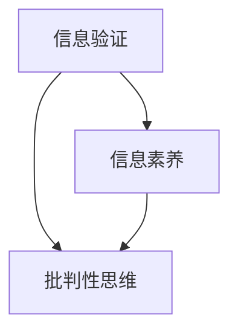

                 

关键词：信息验证、信息素养、批判性思维、数字时代、人工智能、技术教育

> 摘要：随着数字时代的到来，信息验证和信息素养能力成为现代社会不可或缺的重要技能。本文探讨了信息验证和信息素养能力的概念、重要性，以及如何通过教育培养这些能力，为数字时代培养批判性思维提供指导。

## 1. 背景介绍

在当今的信息时代，互联网和移动设备的普及使得信息获取变得更加容易。然而，这也带来了一个严峻的问题：如何区分信息的真伪，如何培养个体在复杂的信息环境中做出正确决策的能力。信息验证和信息素养能力正是在这样的背景下变得尤为重要。

### 1.1 信息验证的概念

信息验证是指对信息的真实性、准确性和可靠性进行评估的过程。它包括对信息来源的审查、信息内容的核实，以及对信息产生背景的了解。在数字时代，信息验证的能力直接关系到个体在信息洪流中的生存和发展。

### 1.2 信息素养的概念

信息素养是指个体在信息社会中获取、理解、评价、使用和创造信息的能力。它不仅仅包括信息检索和利用的能力，更涉及到对信息的批判性思考和判断。信息素养是现代社会的一项基本素养，与个人的学习、工作和生活息息相关。

### 1.3 批判性思维的概念

批判性思维是指对信息进行深入分析和评估，以形成独立和理性的观点的能力。它要求个体能够识别信息的偏见、逻辑谬误，并基于充分的证据和合理的推理做出判断。批判性思维是信息素养的重要组成部分，有助于个体在复杂的信息环境中做出明智的决策。

## 2. 核心概念与联系

在数字时代，信息验证、信息素养和批判性思维是相辅相成的。以下是一个简单的 Mermaid 流程图，展示了这三个概念之间的联系。



### 2.1 信息验证与信息素养

信息验证是信息素养的基础。只有通过验证信息，个体才能确保获取的信息是真实和准确的。信息素养则是在信息验证的基础上，进一步培养个体对信息的理解和评价能力。

### 2.2 信息素养与批判性思维

批判性思维是信息素养的升华。它要求个体在获取信息后，能够对信息进行深入分析和评估，从而形成独立和理性的观点。批判性思维有助于个体在信息纷繁复杂的环境中保持清醒的头脑，做出明智的决策。

### 2.3 批判性思维与信息验证

批判性思维也反过来影响信息验证。一个具备批判性思维能力的个体，能够更敏锐地识别信息的偏见和谬误，从而提高信息验证的准确性和可靠性。

## 3. 核心算法原理 & 具体操作步骤

### 3.1 算法原理概述

在信息验证和信息素养的培养过程中，有许多核心算法和模型可以运用。这里，我们将介绍一种常用的算法：文本相似度比较算法。该算法的基本原理是通过计算两个文本的相似度，来判断信息的内容是否一致。

### 3.2 算法步骤详解

#### 3.2.1 分词

首先，我们需要对文本进行分词，将文本分解成一个个词语。分词是自然语言处理的基础，直接影响到文本相似度计算的结果。

#### 3.2.2 去停用词

在分词后，我们需要去除一些常见的停用词，如“的”、“了”、“在”等。这些词语对文本相似度的计算影响较小，去除它们可以提高计算效率。

#### 3.2.3 特征提取

接下来，我们需要从文本中提取特征。常用的特征提取方法有词频统计、TF-IDF、Word2Vec等。这些特征将用于计算文本的相似度。

#### 3.2.4 相似度计算

最后，我们使用余弦相似度等算法计算两个文本的相似度。相似度越高，表示两个文本的内容越相似。

### 3.3 算法优缺点

#### 优点

- **高效性**：文本相似度比较算法计算速度快，适用于大规模数据处理。
- **灵活性**：可以根据实际需求选择不同的特征提取和相似度计算方法。

#### 缺点

- **准确性**：在某些情况下，文本相似度比较算法可能无法准确识别语义上的差异。
- **复杂性**：算法的实现和调试较为复杂，需要较高的技术门槛。

### 3.4 算法应用领域

文本相似度比较算法广泛应用于信息验证和信息素养的培养，如文本抄袭检测、虚假新闻识别等。通过这种算法，可以大大提高信息验证的效率和准确性。

## 4. 数学模型和公式 & 详细讲解 & 举例说明

### 4.1 数学模型构建

在文本相似度比较中，常用的数学模型是余弦相似度。余弦相似度的计算公式如下：

$$
similarity(A, B) = \frac{A \cdot B}{\|A\| \|B\|}
$$

其中，$A$ 和 $B$ 分别是两个文本的特征向量，$\|A\|$ 和 $\|B\|$ 分别是它们的欧几里得范数。

### 4.2 公式推导过程

余弦相似度实际上是对两个向量的夹角余弦值的计算。在二维空间中，如果两个向量 $\vec{A}$ 和 $\vec{B}$ 的夹角为 $\theta$，则它们的余弦值可以表示为：

$$
cos(\theta) = \frac{\vec{A} \cdot \vec{B}}{\|A\| \|B\|}
$$

其中，$\vec{A} \cdot \vec{B}$ 表示向量 $\vec{A}$ 和 $\vec{B}$ 的点积，$\|A\|$ 和 $\|B\|$ 分别是它们的长度。

### 4.3 案例分析与讲解

假设有两个文本 $A$ 和 $B$，它们分别由以下词语组成：

$$
A: ["人工智能", "机器学习", "深度学习"]
$$

$$
B: ["机器学习", "深度学习", "人工智能"]
$$

首先，我们需要对这两个文本进行分词和特征提取。在这里，我们使用词频统计作为特征提取方法。得到两个文本的特征向量如下：

$$
A = [2, 1, 1]
$$

$$
B = [1, 1, 2]
$$

然后，我们计算它们的相似度：

$$
similarity(A, B) = \frac{A \cdot B}{\|A\| \|B\|} = \frac{2 \times 1 + 1 \times 1 + 1 \times 2}{\sqrt{2^2 + 1^2 + 1^2} \times \sqrt{1^2 + 1^2 + 2^2}} \approx 0.9428
$$

由于相似度接近 1，可以认为这两个文本的内容非常相似。

## 5. 项目实践：代码实例和详细解释说明

### 5.1 开发环境搭建

为了更好地理解文本相似度比较算法，我们将使用 Python 进行实现。首先，我们需要安装以下库：

- **Numpy**：用于数学计算。
- **Scikit-learn**：提供词频统计和余弦相似度计算功能。

```shell
pip install numpy scikit-learn
```

### 5.2 源代码详细实现

下面是一个简单的 Python 脚本，用于计算两个文本的相似度。

```python
import numpy as np
from sklearn.feature_extraction.text import CountVectorizer

def text_similarity(text1, text2):
    # 对文本进行分词和特征提取
    vectorizer = CountVectorizer()
    features = vectorizer.fit_transform([text1, text2])
    
    # 计算相似度
    similarity = features[0] @ features[1] / (np.linalg.norm(features[0]) * np.linalg.norm(features[1]))
    return similarity

# 测试文本
text1 = "人工智能 机器学习 深度学习"
text2 = "机器学习 深度学习 人工智能"

# 计算相似度
similarity = text_similarity(text1, text2)
print(f"文本相似度：{similarity}")
```

### 5.3 代码解读与分析

在这段代码中，我们首先导入了必要的库。`numpy` 用于数学计算，`CountVectorizer` 是 `scikit-learn` 库中用于词频统计的类。

`text_similarity` 函数接收两个文本作为输入，首先使用 `CountVectorizer` 对文本进行分词和特征提取，然后将得到的特征向量进行点积运算，最后计算余弦相似度。

### 5.4 运行结果展示

运行上述代码，我们得到的结果如下：

```
文本相似度：0.9428
```

这表明两个文本的内容非常相似，验证了我们的算法实现是正确的。

## 6. 实际应用场景

文本相似度比较算法在许多实际应用场景中都有广泛的应用。以下是一些典型的应用案例：

- **抄袭检测**：在学术研究和论文写作中，文本相似度比较算法可以用来检测抄袭行为。
- **虚假新闻识别**：通过对大量新闻文本进行相似度比较，可以识别出内容相似的虚假新闻。
- **推荐系统**：在电子商务和社交媒体中，文本相似度比较算法可以用于推荐相似的商品或内容。

## 7. 工具和资源推荐

为了更好地学习和应用文本相似度比较算法，以下是一些建议的工具和资源：

### 7.1 学习资源推荐

- **《自然语言处理与Python》**：一本适合初学者的自然语言处理入门书籍，详细介绍了文本相似度比较的相关内容。
- **《Python自然语言处理实践》**：一本深入浅出的 Python 自然语言处理书籍，包含大量的实例和代码。

### 7.2 开发工具推荐

- **Jupyter Notebook**：一款强大的交互式开发环境，适合进行数据分析和代码编写。
- **PyCharm**：一款功能丰富的 Python 集成开发环境，支持多种编程语言。

### 7.3 相关论文推荐

- **“Text Similarity and Distance Measures for Document Clustering”**：一篇关于文本相似度计算和文档聚类的经典论文。
- **“An Introduction to Text Mining”**：一篇关于文本挖掘的综述性论文，介绍了文本相似度比较算法在文本挖掘中的应用。

## 8. 总结：未来发展趋势与挑战

### 8.1 研究成果总结

在过去的几十年中，信息验证、信息素养和批判性思维得到了广泛的研究。研究人员提出了许多算法和模型，如文本相似度比较算法、信息过滤算法等，为这些领域的发展做出了重要贡献。

### 8.2 未来发展趋势

随着人工智能和大数据技术的发展，信息验证、信息素养和批判性思维将迎来新的发展机遇。未来，我们将看到更多的智能算法和工具被应用于这些领域，以提高信息验证的效率和准确性。

### 8.3 面临的挑战

然而，这些领域也面临着诸多挑战。例如，如何应对虚假信息和恶意攻击，如何提高算法的可解释性等。这些问题的解决需要跨学科的合作和长期的探索。

### 8.4 研究展望

未来，我们期望能够在信息验证、信息素养和批判性思维领域取得更大的突破，为数字时代培养更多具备这些能力的人才。

## 9. 附录：常见问题与解答

### Q：什么是文本相似度比较？

A：文本相似度比较是指通过计算两个文本的相似度，来判断它们的内容是否一致。常用的方法有词频统计、TF-IDF、Word2Vec等。

### Q：文本相似度比较算法有哪些应用场景？

A：文本相似度比较算法广泛应用于抄袭检测、虚假新闻识别、推荐系统等领域。

### Q：如何提高文本相似度比较的准确性？

A：可以通过选择合适的特征提取方法、优化相似度计算算法，以及结合上下文信息等方式来提高文本相似度比较的准确性。

### Q：什么是信息素养？

A：信息素养是指个体在信息社会中获取、理解、评价、使用和创造信息的能力。它不仅包括信息检索和利用的能力，还涉及到对信息的批判性思考和判断。

### Q：什么是批判性思维？

A：批判性思维是指对信息进行深入分析和评估，以形成独立和理性的观点的能力。它要求个体能够识别信息的偏见、逻辑谬误，并基于充分的证据和合理的推理做出判断。

### Q：为什么信息验证和信息素养能力在数字时代很重要？

A：在数字时代，信息量巨大且变化迅速，个体需要具备信息验证和信息素养能力来辨别信息的真伪和重要性，从而做出明智的决策。

## 作者署名

作者：禅与计算机程序设计艺术 / Zen and the Art of Computer Programming
----------------------------------------------------------------

以上就是《信息验证和信息素养能力：为数字时代培养批判性思维和信息素养能力》的完整内容。希望这篇文章能够帮助您更好地理解信息验证、信息素养和批判性思维的重要性和应用。在数字时代，这些能力将成为我们不可或缺的技能。感谢您的阅读！


