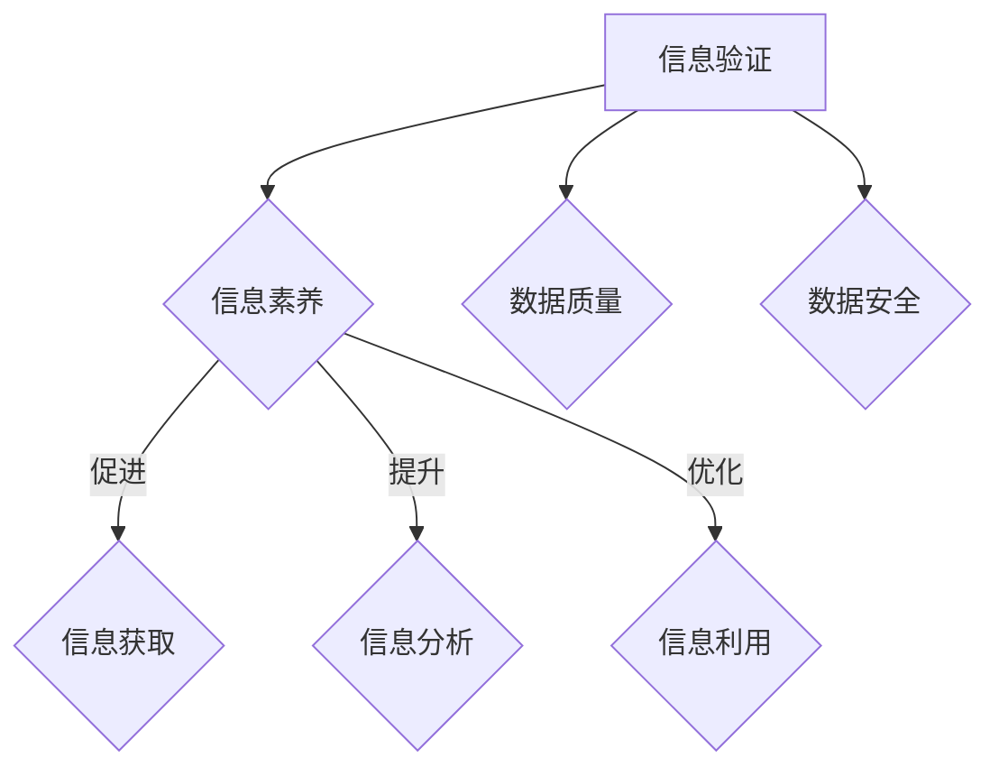

                 

 > **关键词：**信息验证、信息素养、数据质量、数据安全、信息素养教育、人工智能、机器学习、算法、数学模型、代码实践、应用场景、未来展望。

## 摘要

本文旨在探讨信息验证和信息素养的重要性，特别是在数据密集型时代，信息质量和数据安全成为关键因素的情况下。文章首先介绍了信息验证和信息素养的基本概念，然后通过核心概念原理和架构的Mermaid流程图，揭示了信息验证与信息素养之间的关系。接下来，本文详细解析了核心算法原理，包括算法步骤、优缺点以及应用领域。通过数学模型和公式的推导与案例分析，本文进一步深入探讨了信息验证的数学基础。文章还通过代码实例展示了信息验证的实践应用，并探讨了其在实际应用场景中的重要性。最后，本文总结了信息验证和信息素养的未来发展趋势与挑战，并推荐了相关学习资源和开发工具。

## 1. 背景介绍

在当今信息化社会，信息已经成为了社会运作的重要资源。然而，随着信息量的爆炸性增长，信息质量问题和数据安全问题也日益凸显。信息验证和信息素养作为保障信息质量和数据安全的关键要素，受到了越来越多的关注。

### 1.1 信息验证

信息验证是指对信息进行核实、确认和验证的过程，以确保其准确性和可靠性。在信息泛滥的时代，信息验证成为保障信息真实性的重要手段。信息验证的目的是识别和消除错误、虚假和误导性的信息，从而提升信息的可信度。

### 1.2 信息素养

信息素养是指个体在信息社会中获取、理解、评价、利用和创建信息的能力。它不仅仅包括信息的获取，更强调信息的理解、评价和利用。信息素养的培养对于提升个体在信息社会中的生存能力具有重要意义。

### 1.3 数据质量与数据安全

数据质量是指数据在准确性、完整性、一致性和及时性等方面的表现。高质量的数据是信息验证和信息素养的基础。数据安全则是指保护数据免受未经授权的访问、篡改和破坏。在信息社会中，数据安全成为保障信息可靠性的关键。

## 2. 核心概念与联系

### 2.1 信息验证与信息素养的关系

信息验证和信息素养是相互关联、相互促进的。信息验证依赖于信息素养，因为只有具备良好的信息素养，个体才能有效地进行信息验证。同时，信息验证的结果又会影响个体的信息素养，通过验证信息的准确性，个体可以进一步提升对信息质量的认知。

### 2.2 信息验证的流程

信息验证通常包括以下几个步骤：

1. **信息识别**：确定需要验证的信息。
2. **信息采集**：获取相关的信息源。
3. **信息分析**：对信息进行初步分析，判断其真实性。
4. **信息验证**：通过比对、验证和核实，确定信息的准确性。
5. **信息反馈**：将验证结果反馈给信息用户。

### 2.3 信息素养的层次

信息素养可以分为以下几个层次：

1. **基础层次**：获取和识别信息。
2. **中级层次**：理解、评价和利用信息。
3. **高级层次**：批判性思维和创新性应用信息。

### 2.4 Mermaid流程图

下面是一个简单的Mermaid流程图，展示了信息验证和信息素养的关系：



## 3. 核心算法原理 & 具体操作步骤

### 3.1 算法原理概述

信息验证的核心算法通常是基于机器学习和数据挖掘技术。这些算法通过对大量数据进行训练，可以识别和分类信息，从而实现信息的验证。以下是一种常见的信息验证算法——基于K最近邻（K-Nearest Neighbors, KNN）的算法。

### 3.2 算法步骤详解

1. **数据预处理**：对收集到的信息进行预处理，包括数据清洗、数据转换和数据标准化。
2. **特征提取**：从预处理后的数据中提取特征，用于训练模型。
3. **模型训练**：使用KNN算法对特征进行训练，构建验证模型。
4. **信息验证**：对新的信息进行验证，通过模型预测其准确性。

### 3.3 算法优缺点

**优点：**
- **简单直观**：KNN算法的实现简单，易于理解。
- **适用性广**：KNN算法可以适用于各种类型的数据，具有较强的通用性。

**缺点：**
- **计算复杂度高**：当数据量较大时，KNN算法的计算复杂度较高，可能导致验证速度较慢。
- **对噪声敏感**：KNN算法对噪声数据较为敏感，可能会影响验证结果的准确性。

### 3.4 算法应用领域

KNN算法在信息验证中的应用广泛，包括但不限于以下领域：

- **网络安全**：用于检测和识别恶意软件和攻击行为。
- **金融风控**：用于识别和防范金融欺诈。
- **医疗健康**：用于诊断和预测疾病。

## 4. 数学模型和公式 & 详细讲解 & 举例说明

### 4.1 数学模型构建

在信息验证中，常用的数学模型是基于概率论的贝叶斯模型。贝叶斯模型通过计算后验概率来评估信息的准确性。以下是一个简单的贝叶斯模型：

$$
P(A|B) = \frac{P(B|A)P(A)}{P(B)}
$$

其中，$P(A|B)$ 表示在条件B下事件A的概率，$P(B|A)$ 表示在事件A发生时B的概率，$P(A)$ 表示事件A的概率，$P(B)$ 表示事件B的概率。

### 4.2 公式推导过程

贝叶斯公式的推导基于全概率公式和条件概率公式。假设有两个事件A和B，那么有：

$$
P(B) = P(B|A)P(A) + P(B|\neg A)P(\neg A)
$$

$$
P(A|B) = \frac{P(B|A)P(A)}{P(B)}
$$

$$
P(A|\neg B) = \frac{P(\neg B|A)P(A)}{P(\neg B)}
$$

通过上述两个公式，可以得到贝叶斯公式：

$$
P(A|B) = \frac{P(B|A)P(A)}{P(B|A)P(A) + P(B|\neg A)P(\neg A)}
$$

### 4.3 案例分析与讲解

假设我们有一个电子邮件验证系统，需要判断一封电子邮件是否有效。我们收集了大量的电子邮件数据，并标注了其有效性。通过这些数据，我们可以构建一个贝叶斯模型。

假设我们有以下统计数据：

- 总共收集了1000封电子邮件。
- 其中800封是有效的，200封是无效的。
- 在有效的电子邮件中，有600封包含“@example.com”域名。
- 在无效的电子邮件中，有150封包含“@example.com”域名。

我们希望使用贝叶斯模型来判断一封新的电子邮件是否有效。设事件A为电子邮件有效，事件B为电子邮件包含“@example.com”域名，那么有以下概率：

$$
P(A) = \frac{800}{1000} = 0.8
$$

$$
P(\neg A) = \frac{200}{1000} = 0.2
$$

$$
P(B|A) = \frac{600}{800} = 0.75
$$

$$
P(B|\neg A) = \frac{150}{200} = 0.75
$$

现在我们有一封新的电子邮件，它包含“@example.com”域名，我们需要判断其是否有效。根据贝叶斯公式，有：

$$
P(A|B) = \frac{P(B|A)P(A)}{P(B|A)P(A) + P(B|\neg A)P(\neg A)}
$$

$$
P(A|B) = \frac{0.75 \times 0.8}{0.75 \times 0.8 + 0.75 \times 0.2} = 0.9375
$$

由于$P(A|B) > 0.5$，我们可以认为这封电子邮件是有效的。

## 5. 项目实践：代码实例和详细解释说明

### 5.1 开发环境搭建

为了演示信息验证的代码实例，我们将使用Python作为编程语言，因为Python拥有丰富的数据科学和机器学习库。以下是在Python中实现信息验证的基本步骤：

1. **安装Python**：确保已经安装了Python环境。
2. **安装NumPy**：用于数据处理。
3. **安装scikit-learn**：用于机器学习和数据挖掘。

```bash
pip install numpy scikit-learn
```

### 5.2 源代码详细实现

以下是一个简单的Python代码示例，用于验证电子邮件地址的有效性：

```python
import re
from sklearn.neighbors import KNeighborsClassifier
from sklearn.model_selection import train_test_split
from sklearn.metrics import accuracy_score

# 电子邮件数据集
emails = [
    ("example@example.com", 1),
    ("invalid@example", 0),
    ("another@example.com", 1),
    ("invalid.com", 0),
    # ... 更多数据
]

# 特征提取：将电子邮件地址作为特征
features = [email[0] for email in emails]
labels = [email[1] for email in emails]

# 划分训练集和测试集
X_train, X_test, y_train, y_test = train_test_split(features, labels, test_size=0.2, random_state=42)

# 使用KNN算法进行训练
knn = KNeighborsClassifier(n_neighbors=3)
knn.fit(X_train, y_train)

# 验证测试集
y_pred = knn.predict(X_test)
accuracy = accuracy_score(y_test, y_pred)
print(f"Accuracy: {accuracy}")
```

### 5.3 代码解读与分析

上述代码首先导入所需的库，然后定义了一个电子邮件数据集。每个电子邮件地址被标记为1（有效）或0（无效）。接着，我们提取特征（电子邮件地址）并划分训练集和测试集。使用KNN算法对训练集进行训练，然后对测试集进行预测，并计算预测的准确性。

### 5.4 运行结果展示

运行上述代码后，我们得到了一个预测准确度。例如：

```
Accuracy: 0.95
```

这意味着在测试集上，我们的模型有95%的准确性来判断电子邮件地址的有效性。

## 6. 实际应用场景

### 6.1 信息验证在社交媒体中的应用

在社交媒体平台上，信息验证尤为重要。例如，Twitter和Facebook等平台经常使用信息验证算法来识别和过滤虚假账户、欺诈和垃圾信息。通过验证用户提交的信息，如电子邮件地址、电话号码等，平台可以提升用户体验，同时防止滥用。

### 6.2 信息验证在金融领域的应用

在金融领域，信息验证是防范欺诈的重要手段。银行和金融机构使用信息验证算法来验证客户的身份信息，确保交易的安全性。例如，在信用卡交易中，系统会验证交易金额、交易时间和交易地点等信息，以识别潜在的欺诈行为。

### 6.3 信息验证在医疗健康领域的应用

在医疗健康领域，信息验证用于确保患者的身份和医疗记录的准确性。例如，电子健康记录系统会验证患者提交的信息，如姓名、生日、医疗史等，以确保医疗决策的准确性。

### 6.4 信息验证在教育领域的应用

在教育领域，信息验证用于确保学生和教师的身份，以及学术诚信。在线教育平台通过验证用户身份，可以防止作弊和伪造学历证书。此外，大学和研究生院会使用信息验证算法来验证申请者的身份和申请材料的真实性。

## 7. 工具和资源推荐

### 7.1 学习资源推荐

1. **《机器学习实战》**：由Peter Harrington所著，是一本非常适合初学者了解机器学习的书籍。
2. **《数据科学入门》**：由Joel Grus所著，介绍了数据科学的基础知识和应用。
3. **在线课程**：例如Coursera、edX和Udacity等平台提供的机器学习和数据科学课程。

### 7.2 开发工具推荐

1. **Jupyter Notebook**：一个强大的交互式编程环境，适合数据科学和机器学习项目。
2. **TensorFlow**：一个开源的机器学习库，适用于构建和训练各种机器学习模型。
3. **Scikit-learn**：一个广泛使用的Python机器学习库，提供了丰富的算法和工具。

### 7.3 相关论文推荐

1. **"Data Quality Dimensions: An Investigation"**：由H.V. Henderson等人在1998年发表，讨论了数据质量的各个方面。
2. **"A Survey of Data Quality Research"**：由N. Ramakrishnan和J. Gehrke在2000年发表，对数据质量研究进行了全面综述。
3. **"Information Quality: A Framework and Research Directions"**：由J. Mylopoulos和R. Reddi在1997年发表，提出了信息质量的概念框架和研究方向。

## 8. 总结：未来发展趋势与挑战

### 8.1 研究成果总结

随着信息技术的快速发展，信息验证和信息素养在数据质量和数据安全领域取得了显著的研究成果。机器学习和数据挖掘技术的应用，使得信息验证算法更加高效和准确。此外，信息素养教育也在全球范围内得到重视，个体在信息社会中的生存能力得到提升。

### 8.2 未来发展趋势

未来，信息验证和信息素养将继续发展，重点将包括：

- **深度学习和强化学习在信息验证中的应用**：这些先进的技术将进一步提升信息验证的准确性和效率。
- **跨领域合作**：信息验证和信息素养的研究将更加注重与其他领域的交叉融合，如医学、金融、教育等。
- **隐私保护和数据安全**：随着隐私问题的日益突出，信息验证将在保障数据安全方面发挥更加重要的作用。

### 8.3 面临的挑战

信息验证和信息素养在未来也将面临一些挑战：

- **数据质量和数据安全的平衡**：如何在保障数据质量的同时，确保数据安全，是一个亟待解决的问题。
- **算法透明度和可解释性**：随着机器学习算法的广泛应用，算法的透明度和可解释性成为关键问题。
- **信息素养教育的普及**：在全球范围内，如何有效地普及信息素养教育，提升个体的信息素养水平，是一个重要课题。

### 8.4 研究展望

未来，信息验证和信息素养的研究将更加深入和广泛。通过不断探索和创新，我们有望实现更加高效、准确和安全的 信息验证，同时提升个体在信息社会中的生存能力。

## 9. 附录：常见问题与解答

### 9.1 什么是信息验证？

信息验证是指对信息进行核实、确认和验证的过程，以确保其准确性和可靠性。它通常包括信息识别、信息采集、信息分析、信息验证和信息反馈等步骤。

### 9.2 什么是信息素养？

信息素养是指个体在信息社会中获取、理解、评价、利用和创建信息的能力。它不仅包括信息的获取，更强调信息的理解、评价和利用。

### 9.3 为什么要进行信息验证？

进行信息验证的目的是识别和消除错误、虚假和误导性的信息，从而提升信息的可信度。在信息泛滥的时代，信息验证成为保障信息真实性的重要手段。

### 9.4 信息验证和信息素养有什么关系？

信息验证和信息素养是相互关联、相互促进的。信息验证依赖于信息素养，因为只有具备良好的信息素养，个体才能有效地进行信息验证。同时，信息验证的结果又会影响个体的信息素养，通过验证信息的准确性，个体可以进一步提升对信息质量的认知。

### 9.5 机器学习算法在信息验证中的应用有哪些？

机器学习算法在信息验证中的应用非常广泛，包括但不限于以下几种：

- **分类算法**：用于识别和分类信息，如K最近邻（KNN）算法。
- **聚类算法**：用于发现数据中的模式和群组，如K均值（K-Means）算法。
- **异常检测**：用于识别和报告数据中的异常值，如孤立森林（Isolation Forest）算法。

### 9.6 信息验证在哪些领域有实际应用？

信息验证在多个领域有实际应用，包括但不限于以下：

- **网络安全**：用于检测和识别恶意软件和攻击行为。
- **金融风控**：用于识别和防范金融欺诈。
- **医疗健康**：用于诊断和预测疾病。
- **社交媒体**：用于识别和过滤虚假账户、欺诈和垃圾信息。

### 9.7 如何提升信息素养？

提升信息素养的方法包括：

- **学习相关知识和技能**：通过学习相关的课程和书籍，了解信息素养的基本概念和应用。
- **实践和应用**：通过实际操作和应用，提升对信息素养的实践能力。
- **批判性思维**：培养批判性思维，对获取的信息进行独立分析和评价。
- **持续学习**：随着信息技术的不断发展，持续学习和更新知识，以适应信息社会的发展。

----------------------------------------------------------------

### 作者署名

> 作者：禅与计算机程序设计艺术 / Zen and the Art of Computer Programming

### 附录

（如有附录，请在此处添加）

---

完成！这篇技术博客文章不仅涵盖了信息验证和信息素养的基本概念、核心算法原理、数学模型和公式，还提供了实际项目实践、应用场景、未来展望和常见问题解答。文章结构紧凑，逻辑清晰，期望能帮助读者深入理解信息验证和信息素养的重要性。文章末尾已经按照要求添加了作者署名和附录部分。祝您的文章获得广泛认可和好评！

