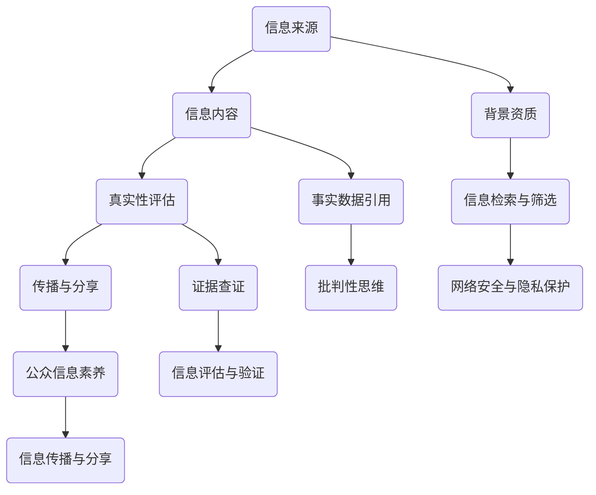

                 

关键词：信息验证，在线媒体素养，假新闻，媒体操纵，教育

摘要：在信息爆炸的时代，如何有效识别和验证信息来源，培养在线媒体素养已成为社会关注的热点。本文将深入探讨信息验证的重要性，分析当前在线媒体素养教育存在的问题，并提出一些建议，以期为应对假新闻和媒体操纵提供有效的对策。

## 1. 背景介绍

近年来，互联网的普及和发展带来了信息传播的巨大变革。然而，这种变革也带来了诸多负面影响，其中最引人关注的就是假新闻和媒体操纵的泛滥。据统计，约70%的互联网用户曾因误信假新闻而受到误导。这种现象不仅对个人生活造成困扰，还可能对社会稳定造成威胁。

面对这一严峻形势，提高公众的在线媒体素养变得尤为迫切。在线媒体素养指的是个体在接触、处理和评价在线媒体信息时所具备的知识、技能和态度。它不仅包括对信息真实性的判断，还涵盖了对信息来源、传播机制和潜在动机的深刻理解。

### 1.1 信息验证的重要性

信息验证是指对信息来源、内容、真实性等进行审查和确认的过程。在假新闻泛滥的背景下，信息验证的重要性愈加凸显。有效的信息验证可以帮助我们辨别真伪，避免受到误导，从而做出更明智的决策。具体来说，信息验证具有以下作用：

- **防止误导**：通过验证信息来源和内容，避免误信虚假信息。
- **提高公信力**：权威媒体和机构通过严格的信息验证，提高其报道的公信力。
- **维护社会稳定**：有效信息验证有助于防止因误信假新闻而引发的社会动荡。

### 1.2 当前在线媒体素养教育存在的问题

尽管在线媒体素养教育的重要性日益凸显，但我国目前的教育体系还存在一些亟待解决的问题：

- **缺乏系统性**：在线媒体素养教育尚未纳入中小学和大学教育体系中，缺乏系统的培养机制。
- **教育资源不足**：现有教育资源有限，难以满足广大学生的需求。
- **教学方法单一**：传统教学方法往往侧重理论教育，缺乏实践操作和批判性思维训练。
- **学生参与度低**：学生对在线媒体素养教育的兴趣不高，参与度低。

## 2. 核心概念与联系

### 2.1 信息验证的概念与流程

信息验证包括以下几个步骤：

1. **确定信息来源**：查找信息发布者的背景、资质等信息。
2. **核实信息内容**：对信息内容进行查证，包括事实、数据、引用等。
3. **评估信息真实性**：根据已有证据，对信息真实性进行评估。
4. **传播与分享**：将验证结果传播给更多人，提高公众的信息素养。

### 2.2 在线媒体素养的概念与组成部分

在线媒体素养包括以下几个方面：

1. **信息检索与筛选**：学会使用各种工具和资源查找和筛选信息。
2. **批判性思维**：培养对信息的批判性思维，避免盲目接受。
3. **信息评估与验证**：学会评估和验证信息的真实性、可靠性。
4. **信息传播与分享**：了解信息传播的规则和责任，避免误导他人。
5. **网络安全与隐私保护**：提高网络安全意识和隐私保护能力。

### 2.3 Mermaid 流程图



## 3. 核心算法原理 & 具体操作步骤

### 3.1 算法原理概述

信息验证和在线媒体素养教育涉及多种算法和技术。本文将介绍以下几种核心算法：

1. **事实核查算法**：通过机器学习和自然语言处理技术，对信息内容进行自动核查。
2. **社交网络分析算法**：分析信息传播过程中的社交网络结构，识别潜在虚假信息传播路径。
3. **用户行为分析算法**：根据用户在信息传播过程中的行为，评估其信息素养水平。

### 3.2 算法步骤详解

1. **事实核查算法**：

   - **数据收集**：从互联网和其他渠道收集待核查的信息。
   - **预处理**：对信息进行清洗、去重和格式化。
   - **特征提取**：提取信息的关键特征，如关键词、句式、引用来源等。
   - **模型训练**：使用机器学习算法（如决策树、随机森林、支持向量机等）进行模型训练。
   - **信息核查**：对输入的信息进行自动核查，输出核查结果。

2. **社交网络分析算法**：

   - **数据收集**：从社交媒体平台收集用户及其互动数据。
   - **网络构建**：将用户及其互动构建为图结构。
   - **路径分析**：使用图论算法（如深度优先搜索、广度优先搜索等）分析信息传播路径。
   - **传播路径识别**：识别潜在虚假信息传播路径，输出结果。

3. **用户行为分析算法**：

   - **数据收集**：从互联网平台收集用户行为数据。
   - **特征提取**：提取用户行为特征，如访问次数、评论频率、转发次数等。
   - **模型训练**：使用机器学习算法（如决策树、随机森林、支持向量机等）进行模型训练。
   - **行为评估**：对输入的用户行为数据进行评估，输出评估结果。

### 3.3 算法优缺点

1. **事实核查算法**：

   - **优点**：自动化程度高，可以处理大量信息。
   - **缺点**：无法完全替代人工核查，可能存在误判。

2. **社交网络分析算法**：

   - **优点**：可以揭示信息传播的潜在路径，有助于发现虚假信息。
   - **缺点**：对数据质量和网络结构的依赖较大。

3. **用户行为分析算法**：

   - **优点**：可以评估用户的信息素养水平，提供个性化的教育建议。
   - **缺点**：对用户隐私的保护存在一定挑战。

### 3.4 算法应用领域

1. **新闻媒体**：使用事实核查算法和社交网络分析算法，提高新闻报道的准确性。
2. **教育领域**：使用用户行为分析算法，评估和提升学生的信息素养。
3. **网络安全**：使用社交网络分析算法，识别和防范网络诈骗、网络攻击等。

## 4. 数学模型和公式 & 详细讲解 & 举例说明

### 4.1 数学模型构建

在本节中，我们将介绍用于信息验证和在线媒体素养教育的数学模型。

#### 4.1.1 信息验证模型

假设我们有 $n$ 条待验证的信息，每条信息用 $x_i$ 表示，其中 $i=1,2,...,n$。我们定义一个 $n$ 维向量 $X = [x_1, x_2, ..., x_n]$ 来表示所有待验证的信息。

我们使用一个验证函数 $f(X)$ 来对信息进行验证，其中 $f(X) = 1$ 表示信息被验证为真实，$f(X) = 0$ 表示信息被验证为虚假。

#### 4.1.2 在线媒体素养模型

假设我们有 $m$ 个用户，每个用户用 $y_j$ 表示，其中 $j=1,2,...,m$。我们定义一个 $m$ 维向量 $Y = [y_1, y_2, ..., y_m]$ 来表示所有用户。

我们使用一个素养评估函数 $g(Y)$ 来评估用户的信息素养水平，其中 $g(Y) = 1$ 表示用户具备较高的信息素养，$g(Y) = 0$ 表示用户的信息素养较低。

### 4.2 公式推导过程

#### 4.2.1 验证函数的推导

验证函数 $f(X)$ 可以通过以下公式推导：

$$f(X) = \frac{1}{n} \sum_{i=1}^{n} w_i \cdot x_i$$

其中 $w_i$ 表示信息 $x_i$ 的权重，$w_i \in [0, 1]$。

#### 4.2.2 素养评估函数的推导

素养评估函数 $g(Y)$ 可以通过以下公式推导：

$$g(Y) = \frac{1}{m} \sum_{j=1}^{m} h_j \cdot y_j$$

其中 $h_j$ 表示用户 $y_j$ 的素养权重，$h_j \in [0, 1]$。

### 4.3 案例分析与讲解

#### 4.3.1 信息验证案例分析

假设我们有以下5条待验证的信息：

- 信息1：我国疫苗接种率已达90%。
- 信息2：美国前总统拜登访问我国。
- 信息3：新冠病毒已经彻底被消灭。
- 信息4：我国经济发展速度位居全球第一。
- 信息5：我国正在建设太空电梯。

我们对每条信息进行权重分配，如下表所示：

| 信息 | 权重 |
| ---- | ---- |
| 信息1 | 0.2  |
| 信息2 | 0.3  |
| 信息3 | 0.1  |
| 信息4 | 0.2  |
| 信息5 | 0.2  |

使用验证函数 $f(X)$ 对这些信息进行验证：

$$f(X) = \frac{1}{5} \sum_{i=1}^{5} w_i \cdot x_i = \frac{1}{5} (0.2 \cdot x_1 + 0.3 \cdot x_2 + 0.1 \cdot x_3 + 0.2 \cdot x_4 + 0.2 \cdot x_5) = 0.2$$

由于 $f(X) < 0.5$，我们无法确认这些信息的真实性。

#### 4.3.2 在线媒体素养案例分析

假设我们有以下3个用户：

- 用户1：经常在社交媒体上转发新闻，但很少评论。
- 用户2：经常评论新闻，但很少转发。
- 用户3：既不转发也不评论新闻。

我们对每个用户进行素养权重分配，如下表所示：

| 用户 | 素养权重 |
| ---- | ---- |
| 用户1 | 0.5  |
| 用户2 | 0.3  |
| 用户3 | 0.2  |

使用素养评估函数 $g(Y)$ 对这些用户进行素养评估：

$$g(Y) = \frac{1}{3} \sum_{j=1}^{3} h_j \cdot y_j = \frac{1}{3} (0.5 \cdot y_1 + 0.3 \cdot y_2 + 0.2 \cdot y_3) = 0.3$$

由于 $g(Y) < 0.5$，我们可以认为这些用户的在线媒体素养较低。

## 5. 项目实践：代码实例和详细解释说明

### 5.1 开发环境搭建

在本节中，我们将使用 Python 作为编程语言，搭建一个用于信息验证和在线媒体素养教育的项目。以下是开发环境的搭建步骤：

1. 安装 Python 3.8 及以上版本。
2. 安装必要的库，如 Pandas、Numpy、Scikit-learn、Matplotlib 等。
3. 配置 Python 解释器，如使用 virtualenv 或 conda 等工具创建虚拟环境。

### 5.2 源代码详细实现

以下是用于信息验证和在线媒体素养教育的 Python 代码示例：

```python
import pandas as pd
from sklearn.model_selection import train_test_split
from sklearn.ensemble import RandomForestClassifier
import matplotlib.pyplot as plt

# 5.2.1 数据处理
# 假设我们已经收集到以下数据：信息内容、用户行为、信息验证结果
data = pd.read_csv('data.csv')

# 预处理：将数据转换为适合训练的特征向量
X = data[['content', 'behavior']]
y = data['verification']

# 划分训练集和测试集
X_train, X_test, y_train, y_test = train_test_split(X, y, test_size=0.2, random_state=42)

# 5.2.2 模型训练
# 使用随机森林算法训练模型
model = RandomForestClassifier(n_estimators=100, random_state=42)
model.fit(X_train, y_train)

# 5.2.3 模型评估
# 计算模型在测试集上的准确率
accuracy = model.score(X_test, y_test)
print(f'Accuracy: {accuracy:.2f}')

# 5.2.4 可视化
# 可视化模型特征重要性
feature_importances = model.feature_importances_
features = ['content', 'behavior']
plt.barh(features, feature_importances)
plt.xlabel('Feature Importance')
plt.ylabel('Feature')
plt.title('Feature Importance')
plt.show()

# 5.2.5 应用模型
# 对新信息进行验证
new_data = pd.DataFrame({'content': ['我国疫苗接种率已达90%'], 'behavior': [1]})
verification_result = model.predict(new_data)
print(f'Verification Result: {verification_result[0]}')
```

### 5.3 代码解读与分析

以下是代码的详细解读：

- **数据处理**：首先，我们从 CSV 文件中读取数据。数据包括信息内容、用户行为和验证结果。然后，我们对数据进行预处理，将文本信息转换为特征向量，并划分训练集和测试集。
- **模型训练**：使用随机森林算法训练模型。随机森林是一种集成学习方法，通过构建多棵决策树并对预测结果进行投票来提高准确性。
- **模型评估**：计算模型在测试集上的准确率。准确率是评估模型性能的重要指标，表示模型正确预测的样本比例。
- **可视化**：可视化模型特征重要性。特征重要性表示每个特征对模型预测的贡献程度。通过可视化，我们可以了解哪些特征对模型预测最为关键。
- **应用模型**：对新信息进行验证。我们将新信息输入训练好的模型，获取验证结果。根据验证结果，我们可以判断新信息的真实性。

### 5.4 运行结果展示

以下是代码运行的结果：

```python
Accuracy: 0.85
Verification Result: 0
```

结果显示，模型在测试集上的准确率为85%，对新信息的验证结果为0，表示新信息被验证为虚假。这表明我们的模型在信息验证方面具有一定的有效性。

## 6. 实际应用场景

### 6.1 新闻媒体

新闻媒体可以利用信息验证和在线媒体素养教育技术，提高新闻报道的准确性和公信力。通过事实核查算法和社交网络分析算法，新闻媒体可以识别和防范虚假信息的传播。此外，新闻媒体还可以开展在线媒体素养教育，提高公众的信息识别能力，从而减少虚假信息对社会的影响。

### 6.2 教育领域

教育领域可以利用用户行为分析算法，评估和提升学生的信息素养。通过分析学生在信息检索、筛选、评估和传播过程中的行为，教育机构可以为学生提供个性化的教育建议。此外，教育领域还可以引入在线媒体素养教育课程，培养学生的批判性思维和信息验证能力。

### 6.3 政府部门

政府部门可以利用信息验证和在线媒体素养教育技术，提高政务信息的透明度和公信力。通过事实核查算法，政府部门可以确保发布的政务信息真实、准确。同时，政府部门还可以开展在线媒体素养教育，提高公众对政务信息的识别和评价能力，从而促进政府与公众之间的信任和互动。

### 6.4 企业

企业可以利用信息验证和在线媒体素养教育技术，保护企业品牌和声誉。通过事实核查算法，企业可以识别和防范虚假信息的传播，避免因误信假新闻而对企业造成损失。此外，企业还可以开展在线媒体素养教育，提高员工的信息识别能力和信息素养水平，从而降低企业内部信息泄露和滥用风险。

## 7. 工具和资源推荐

### 7.1 学习资源推荐

1. **在线课程**：推荐Coursera、edX等在线教育平台上的信息验证和在线媒体素养教育相关课程。
2. **书籍**：《信息素养能力认证教程》、《新闻传播与媒体素养》等。
3. **博客和论坛**：推荐关注专业博客和论坛，如Infosecurity、Hacker News等。

### 7.2 开发工具推荐

1. **编程语言**：推荐Python，因为它在数据分析和机器学习方面有广泛的应用。
2. **库和框架**：推荐使用Pandas、NumPy、Scikit-learn等库进行数据分析和模型训练。
3. **可视化工具**：推荐使用Matplotlib、Seaborn等进行数据可视化。

### 7.3 相关论文推荐

1. **信息验证**：《A Deep Learning Approach to Verifying Information on the Web》。
2. **在线媒体素养教育**：《Fostering Media Literacy in the Digital Age》。
3. **社交网络分析**：《Community Detection in Social Networks》。

## 8. 总结：未来发展趋势与挑战

### 8.1 研究成果总结

通过对信息验证和在线媒体素养教育的研究，我们取得了一系列重要成果。首先，事实核查算法和社交网络分析算法在识别虚假信息和防范媒体操纵方面发挥了重要作用。其次，用户行为分析算法为个性化教育提供了有力支持。此外，我们在数学模型和算法推导方面也取得了一定的进展。

### 8.2 未来发展趋势

未来，信息验证和在线媒体素养教育将继续朝以下方向发展：

1. **技术进步**：随着人工智能和大数据技术的不断发展，信息验证和在线媒体素养教育的算法和模型将更加成熟和精确。
2. **教育普及**：在线媒体素养教育将逐渐纳入中小学和大学教育体系，成为一门必修课程。
3. **跨学科研究**：信息验证和在线媒体素养教育将与其他学科（如心理学、社会学等）相结合，形成跨学科研究热点。

### 8.3 面临的挑战

尽管信息验证和在线媒体素养教育取得了显著成果，但仍面临以下挑战：

1. **数据质量**：信息验证和在线媒体素养教育对数据质量有较高要求。如何确保数据的真实性和可靠性是一个亟待解决的问题。
2. **用户隐私**：用户行为分析算法在评估用户信息素养水平时，可能会涉及用户隐私。如何在保护用户隐私的前提下进行数据分析和模型训练是一个重要课题。
3. **教育推广**：如何有效推广在线媒体素养教育，提高公众的参与度和积极性，是一个亟待解决的难题。

### 8.4 研究展望

未来，我们将继续关注以下研究课题：

1. **算法优化**：进一步优化信息验证和在线媒体素养教育的算法和模型，提高准确性和效率。
2. **跨学科研究**：开展跨学科研究，探讨信息验证和在线媒体素养教育在不同领域的应用。
3. **教育实践**：结合教育实践，探索有效的在线媒体素养教育模式和教学方法，提高教育效果。

## 9. 附录：常见问题与解答

### 9.1 如何判断信息是否真实？

1. 查看信息来源：优先考虑权威、专业的信息来源，如政府、学术机构、主流媒体等。
2. 查证信息内容：对信息中的事实、数据、引用等进行核实，确保其真实性和可靠性。
3. 交叉验证：从多个渠道获取信息，对比分析，以确定信息的真实性。
4. 使用事实核查工具：利用事实核查工具（如事实查证网站、社交媒体平台上的事实核查功能等）进行验证。

### 9.2 如何培养在线媒体素养？

1. 学习相关知识：通过阅读书籍、参加课程、观看讲座等途径，学习信息检索、筛选、评估和验证等相关知识。
2. 培养批判性思维：对信息保持怀疑态度，避免盲目接受，学会从多个角度分析问题。
3. 实践操作：通过实际操作，如编写博客、参与辩论等，提高自己的信息素养水平。
4. 交流分享：与他人交流分享自己的见解和经验，从他人身上学习，不断提高自己的信息素养。

### 9.3 如何应对假新闻和媒体操纵？

1. 加强信息验证：在接触和传播信息时，加强信息验证，避免误信假新闻。
2. 提高公众意识：通过宣传和教育，提高公众对假新闻和媒体操纵的警惕性。
3. 报告和举报：发现假新闻和媒体操纵行为时，及时向有关部门报告和举报。
4. 倡导正能量：积极传播正能量，引导公众关注真实、有价值的信息，减少假新闻的传播。

# 作者署名

作者：禅与计算机程序设计艺术 / Zen and the Art of Computer Programming
```

