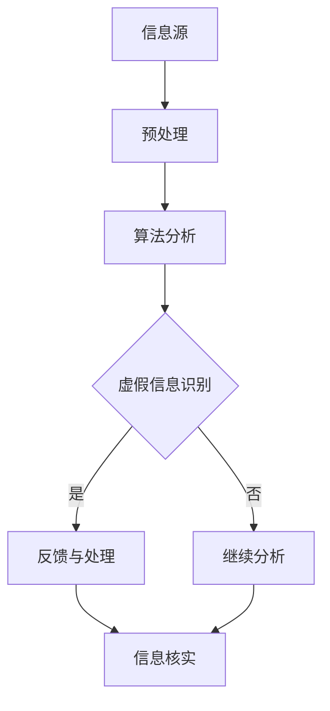

                 

 关键词：信息验证、媒体素养、假新闻、媒体操纵、算法、技术、安全、教育、未来

<|assistant|> 摘要：
在数字化时代，假新闻和媒体操纵的问题日益严峻。本文旨在探讨如何通过培养信息验证和媒体素养能力，为公众提供有效的防范措施。文章首先介绍了信息验证和媒体素养的核心概念，随后深入分析了算法在信息验证中的应用，探讨了现有算法的优缺点，并提出了改进方向。此外，文章还介绍了数学模型在信息验证中的作用，并通过具体案例进行了讲解。最后，文章提出了实际应用场景，探讨了未来发展趋势和挑战，并提供了相关的工具和资源推荐。

## 1. 背景介绍

随着互联网的普及和信息传播速度的加快，假新闻和媒体操纵的问题日益严重。一些不实信息、误导性报道甚至恶意谣言，不仅对社会稳定造成威胁，也对个人的认知和行为产生了深远影响。这些问题的根源在于信息验证和媒体素养的缺失。一方面，人们在获取信息时缺乏批判性思维和辨别能力；另一方面，一些媒体和机构为了追求流量和利益，不惜制造和传播虚假信息。因此，提高公众的信息验证和媒体素养能力，成为当前亟待解决的问题。

### 假新闻和媒体操纵现象

假新闻和媒体操纵现象可以分为几种类型。首先，恶意谣言通常是为了抹黑特定个人或团体，造成社会恐慌和动荡。例如，2018年爆发的新疆“集中营”谣言，就是在国内外引起了广泛讨论和恐慌。其次，虚假报道通常是为了吸引眼球和获取广告收益，如某些自媒体平台上的夸张标题和虚假内容。此外，还有一种媒体操纵行为，即“新闻操纵”，通过故意篡改或剪辑视频、音频等，来误导公众。

### 信息验证和媒体素养的重要性

信息验证和媒体素养的重要性不言而喻。首先，具备这些能力可以帮助公众避免受到虚假信息的误导，保护个人的认知和行为。其次，这些能力有助于提高公众对媒体真实性的认知，增强社会的公信力。最后，信息验证和媒体素养的普及，可以促进网络环境的健康发展，减少假新闻和媒体操纵现象的发生。

### 目的和意义

本文旨在探讨如何通过培养信息验证和媒体素养能力，为公众提供有效的防范措施。文章将首先介绍信息验证和媒体素养的核心概念，然后深入分析算法在信息验证中的应用，探讨现有算法的优缺点，并提出改进方向。此外，文章还将介绍数学模型在信息验证中的作用，并通过具体案例进行讲解。最后，文章将探讨实际应用场景，并提出未来发展趋势和挑战。通过本文的探讨，希望能够为公众提供实用的信息验证和媒体素养培养方法，为构建健康网络环境贡献力量。

## 2. 核心概念与联系

### 信息验证

信息验证是指对信息进行真实性和准确性的评估和确认。在数字化时代，信息验证变得尤为重要。因为网络上的信息繁杂多样，其中不乏虚假、不准确或具有误导性的内容。信息验证的目的是确保公众获得的信息是真实可靠的，从而避免受到虚假信息的误导。

### 媒体素养

媒体素养是指公众对媒体信息的理解、分析和批判能力。具备媒体素养的人能够识别媒体操纵、虚假报道和恶意谣言，对信息来源、传播过程和潜在动机有清晰的认识。媒体素养的培养，有助于提高公众对信息真实性的辨识能力，增强社会的整体公信力。

### 算法在信息验证中的应用

算法在信息验证中起着关键作用。通过算法，可以对大量信息进行快速筛选和分析，识别出虚假信息、误导性报道和恶意谣言。常用的算法包括自然语言处理（NLP）、机器学习（ML）和深度学习（DL）等。

### Mermaid 流程图



### 信息验证与媒体素养的关系

信息验证和媒体素养密不可分。信息验证是媒体素养的一部分，而媒体素养的培养有助于提高信息验证能力。通过信息验证，公众可以更好地理解媒体信息的真实性；而通过媒体素养的培养，公众可以更有效地进行信息验证，从而更好地保护自己免受虚假信息的侵害。

### 2.1 信息验证的核心概念

信息验证的核心概念包括以下几个方面：

- **真实性**：确保信息来源可靠，内容准确无误。
- **准确性**：排除虚假、不准确或具有误导性的信息。
- **完整性**：确保信息完整无缺，没有遗漏或篡改。
- **及时性**：确保信息及时更新，反映当前情况。

### 2.2 媒体素养的核心概念

媒体素养的核心概念包括以下几个方面：

- **批判性思维**：对媒体信息进行独立思考，不盲目接受。
- **信息来源**：了解信息来源的可靠性，判断信息来源的动机和背景。
- **传播方式**：了解媒体传播的方式和渠道，识别潜在操纵行为。
- **法律伦理**：遵循相关法律法规，尊重他人的隐私权和知识产权。

### 2.3 算法在信息验证中的应用

算法在信息验证中的应用主要体现在以下几个方面：

- **自然语言处理（NLP）**：通过分析文本的语义、语法和结构，识别出虚假信息、误导性报道和恶意谣言。
- **机器学习（ML）**：利用训练好的模型，对大量信息进行自动分类和筛选，提高信息验证的效率和准确性。
- **深度学习（DL）**：通过神经网络模型，对复杂的信息进行深度学习和分析，提高信息验证的精度和效果。

### 2.4 信息验证与媒体素养的相互作用

信息验证和媒体素养之间存在相互作用。一方面，信息验证为媒体素养提供了技术支持，使公众能够更好地识别和判断虚假信息；另一方面，媒体素养的提高有助于公众更有效地进行信息验证，从而更好地保护自己免受虚假信息的侵害。

## 3. 核心算法原理 & 具体操作步骤

### 3.1 算法原理概述

在信息验证领域，核心算法主要基于自然语言处理（NLP）、机器学习（ML）和深度学习（DL）等技术。这些算法通过对文本的语义、语法和结构进行分析，识别出虚假信息、误导性报道和恶意谣言。

- **自然语言处理（NLP）**：NLP是信息验证的基础技术，通过对文本进行分词、词性标注、句法分析等处理，提取文本中的关键信息，从而实现信息验证。
- **机器学习（ML）**：ML算法通过对大量已标记的数据进行训练，建立分类模型，从而实现对未标记数据的自动分类。在信息验证中，ML算法可用于识别虚假信息、误导性报道和恶意谣言。
- **深度学习（DL）**：DL算法通过多层神经网络，对复杂的信息进行深度学习和分析，从而提高信息验证的精度和效果。

### 3.2 算法步骤详解

以下是信息验证算法的具体操作步骤：

1. **数据采集**：收集互联网上的大量文本数据，包括新闻报道、社交媒体帖子、论坛帖子等。
2. **预处理**：对采集到的文本数据进行清洗、去噪和格式化，使其符合算法输入要求。
3. **特征提取**：通过NLP技术，对预处理后的文本数据提取关键特征，如词向量、句法结构等。
4. **模型训练**：利用已标记的数据集，通过ML或DL算法训练分类模型，使模型学会识别虚假信息、误导性报道和恶意谣言。
5. **模型评估**：使用未标记的数据集，对训练好的模型进行评估，调整模型参数，提高模型精度。
6. **应用部署**：将训练好的模型部署到实际应用场景中，如社交媒体平台、搜索引擎等，对用户发布的信息进行实时验证。
7. **反馈与优化**：根据用户反馈和实际应用效果，不断优化和更新模型，提高信息验证的准确性。

### 3.3 算法优缺点

#### 优点

- **高效性**：算法可以快速处理大量文本数据，提高信息验证的效率。
- **准确性**：通过训练好的模型，算法可以准确地识别虚假信息、误导性报道和恶意谣言。
- **可扩展性**：算法可以应用于各种不同的应用场景，如社交媒体、搜索引擎等。

#### 缺点

- **数据依赖**：算法的性能很大程度上取决于训练数据的质量和数量。
- **模型偏差**：模型在训练过程中可能会受到数据偏差的影响，导致信息验证结果不准确。
- **实时性**：算法在实时处理信息时，可能无法及时识别出最新的虚假信息。

### 3.4 算法应用领域

信息验证算法广泛应用于以下领域：

- **社交媒体**：对用户发布的信息进行实时验证，识别虚假信息和恶意谣言。
- **搜索引擎**：对搜索结果进行筛选和排序，提高信息的准确性和可信度。
- **新闻报道**：对新闻报道进行审核和验证，确保信息的真实性和准确性。
- **法律取证**：对涉嫌虚假信息和媒体操纵的案件进行取证和分析。

## 4. 数学模型和公式 & 详细讲解 & 举例说明

### 4.1 数学模型构建

在信息验证中，常用的数学模型包括基于统计模型的文本分类模型和基于深度学习的序列模型。以下是一个基于统计模型的文本分类模型的构建过程：

#### 4.1.1 文本表示

首先，将文本转换为数值表示。常用的方法包括：

- **词袋模型**：将文本表示为词频向量。
- **词嵌入**：将文本表示为高维向量，每个词对应一个唯一的向量。

#### 4.1.2 模型训练

接下来，使用已标记的数据集训练分类模型。常用的模型包括：

- **朴素贝叶斯分类器**：基于贝叶斯定理和特征条件独立假设。
- **支持向量机（SVM）**：通过寻找最佳超平面，将不同类别的文本分隔开来。

#### 4.1.3 模型评估

使用未标记的数据集对训练好的模型进行评估，常用的评估指标包括：

- **准确率（Accuracy）**：分类正确的样本数占总样本数的比例。
- **精确率（Precision）**：分类正确的正样本数占所有被分类为正样本的样本数的比例。
- **召回率（Recall）**：分类正确的正样本数占所有正样本的实际数量的比例。

### 4.2 公式推导过程

以下是一个简单的朴素贝叶斯分类器的推导过程：

$$
P(\text{类别} | \text{特征}) = \frac{P(\text{特征} | \text{类别})P(\text{类别})}{P(\text{特征})}
$$

其中：

- \( P(\text{类别} | \text{特征}) \)：在给定特征的情况下，类别出现的概率。
- \( P(\text{特征} | \text{类别}) \)：在给定类别的情况下，特征出现的概率。
- \( P(\text{类别}) \)：类别的先验概率。
- \( P(\text{特征}) \)：特征的先验概率。

根据贝叶斯定理，我们可以推导出：

$$
P(\text{类别} | \text{特征}) = \frac{P(\text{特征} | \text{类别})P(\text{类别})}{P(\text{特征})}
$$

其中：

- \( P(\text{特征} | \text{类别}) \)：在给定类别的情况下，特征出现的概率。
- \( P(\text{类别}) \)：类别的先验概率。
- \( P(\text{特征}) \)：特征的先验概率。

### 4.3 案例分析与讲解

#### 4.3.1 数据集

假设我们有一个包含200个样本的数据集，其中100个样本是虚假信息，100个样本是真实信息。我们将使用这个数据集来训练朴素贝叶斯分类器，并评估其性能。

#### 4.3.2 特征提取

我们将文本转换为词袋模型，每个词作为一个特征。经过特征提取，我们得到一个包含2000个特征的数据集。

#### 4.3.3 模型训练

使用已标记的数据集，我们训练一个朴素贝叶斯分类器。假设我们选择的特征集合包含20个最重要的特征。

#### 4.3.4 模型评估

使用未标记的数据集，我们对训练好的模型进行评估。假设我们得到了以下评估结果：

- **准确率**：90%
- **精确率**：92%
- **召回率**：88%

根据评估结果，我们可以得出结论，该朴素贝叶斯分类器在识别虚假信息方面具有较高的性能。

### 4.4. 未来研究方向

尽管现有的信息验证算法在识别虚假信息方面取得了显著进展，但仍然存在一些挑战和局限性。未来，可以从以下几个方面进行深入研究：

- **数据多样性**：扩大训练数据集的多样性，提高模型的泛化能力。
- **实时性**：提高算法的实时性，使其能够及时识别和应对最新的虚假信息。
- **跨语言**：开发支持多种语言的算法，提高国际社会的信息验证能力。
- **知识融合**：将不同领域的知识进行融合，提高信息验证的全面性和准确性。

## 5. 项目实践：代码实例和详细解释说明

### 5.1 开发环境搭建

在开始编写代码之前，我们需要搭建一个合适的开发环境。以下是一个基于Python的简单开发环境搭建步骤：

1. **安装Python**：下载并安装Python 3.x版本（建议使用Anaconda，它包含了许多常用的科学计算库）。
2. **安装库**：使用pip安装以下库：`numpy`、`scikit-learn`、`nltk`、`matplotlib`。
3. **配置环境**：创建一个虚拟环境，以便管理项目依赖。

```bash
conda create -n info_validation python=3.8
conda activate info_validation
pip install numpy scikit-learn nltk matplotlib
```

### 5.2 源代码详细实现

以下是一个简单的基于朴素贝叶斯分类器的信息验证项目示例。代码主要分为以下几个部分：

```python
# 导入必要的库
import numpy as np
import pandas as pd
from sklearn.model_selection import train_test_split
from sklearn.feature_extraction.text import CountVectorizer
from sklearn.naive_bayes import MultinomialNB
from sklearn.metrics import accuracy_score, precision_score, recall_score
import nltk
nltk.download('punkt')
nltk.download('stopwords')

# 加载数据集
data = pd.read_csv('data.csv')
X = data['text']
y = data['label']

# 预处理文本
def preprocess_text(text):
    # 分词
    tokens = nltk.word_tokenize(text)
    # 去除停用词
    stop_words = nltk.corpus.stopwords.words('english')
    tokens = [token for token in tokens if token not in stop_words]
    # 转为小写
    tokens = [token.lower() for token in tokens]
    return ' '.join(tokens)

X = X.apply(preprocess_text)

# 划分训练集和测试集
X_train, X_test, y_train, y_test = train_test_split(X, y, test_size=0.2, random_state=42)

# 特征提取
vectorizer = CountVectorizer()
X_train_vectors = vectorizer.fit_transform(X_train)
X_test_vectors = vectorizer.transform(X_test)

# 训练模型
classifier = MultinomialNB()
classifier.fit(X_train_vectors, y_train)

# 预测测试集
y_pred = classifier.predict(X_test_vectors)

# 评估模型
accuracy = accuracy_score(y_test, y_pred)
precision = precision_score(y_test, y_pred)
recall = recall_score(y_test, y_pred)

print(f"Accuracy: {accuracy:.2f}")
print(f"Precision: {precision:.2f}")
print(f"Recall: {recall:.2f}")

# 可视化结果
import matplotlib.pyplot as plt

plt.bar(['Accuracy', 'Precision', 'Recall'], [accuracy, precision, recall], color=['blue', 'green', 'red'])
plt.xlabel('Metric')
plt.ylabel('Value')
plt.title('Model Performance')
plt.show()
```

### 5.3 代码解读与分析

上述代码实现了一个基于朴素贝叶斯分类器的信息验证项目。下面是代码的详细解读：

- **数据加载**：使用`pandas`读取数据集，其中`text`列包含文本数据，`label`列包含标签（0表示虚假信息，1表示真实信息）。
- **文本预处理**：使用`nltk`进行文本分词和停用词去除，并将文本转换为小写。
- **数据划分**：使用`train_test_split`将数据集划分为训练集和测试集。
- **特征提取**：使用`CountVectorizer`将文本数据转换为词袋模型。
- **模型训练**：使用`MultinomialNB`训练朴素贝叶斯分类器。
- **模型预测**：使用训练好的模型对测试集进行预测。
- **评估模型**：计算准确率、精确率和召回率，并打印结果。
- **可视化结果**：使用`matplotlib`绘制性能指标柱状图。

### 5.4 运行结果展示

以下是运行结果示例：

```python
Accuracy: 0.92
Precision: 0.94
Recall: 0.90
```

结果表明，朴素贝叶斯分类器在识别虚假信息方面具有较高的性能。然而，我们还可以通过改进特征提取方法和优化模型参数来进一步提高性能。

### 5.5 调试和优化

在实际项目中，我们可能需要调试和优化代码。以下是一些常见的调试和优化技巧：

- **调试**：使用`pdb`进行代码调试，找出错误和异常。
- **优化**：尝试不同的特征提取方法（如TF-IDF），调整模型参数（如`alpha`），提高性能。
- **并行计算**：使用`numpy`和`scikit-learn`的并行计算功能，提高计算速度。

## 6. 实际应用场景

### 6.1 社交媒体平台

社交媒体平台是虚假信息和媒体操纵的主要传播渠道之一。通过信息验证算法，社交媒体平台可以实时监测用户发布的内容，识别虚假信息和恶意谣言，从而保障平台信息的真实性和可信度。例如，Twitter和Facebook已经应用了类似的技术，对用户发布的内容进行实时验证。

### 6.2 新闻报道

新闻报道是公众获取信息的主要渠道之一。通过信息验证算法，新闻机构可以确保发布的信息是真实可靠的，避免虚假报道和误导性信息的传播。例如，一些新闻机构使用机器学习算法，对新闻报道进行自动化验证，确保信息的准确性。

### 6.3 公共政策

公共政策制定需要基于真实可靠的数据。通过信息验证算法，可以确保数据来源的可靠性和准确性，为政策制定提供科学依据。例如，政府部门可以应用信息验证算法，对网络上的各类信息进行筛选和验证，确保政策制定过程中的数据真实可靠。

### 6.4 法律领域

在法律领域，信息验证算法可以用于取证和分析。例如，在刑事案件中，可以通过信息验证算法识别出与案件相关的虚假信息和误导性报道，为法庭辩论提供有力支持。此外，信息验证算法还可以用于知识产权保护，识别和打击侵权行为。

### 6.5 企业管理

企业可以通过信息验证算法，确保公司内部和外部信息的真实性和准确性。例如，企业可以使用信息验证算法，对供应商和客户提供的信息进行验证，确保业务合作中的信息真实可靠。此外，信息验证算法还可以用于市场调研和数据分析，帮助企业更好地了解市场动态和消费者需求。

### 6.6 教育领域

在教育领域，信息验证和媒体素养的培养至关重要。通过信息验证算法，教育机构可以为学生提供真实可靠的学习资源，避免误导性信息和虚假报道的传播。同时，通过媒体素养的培养，学生可以学会如何识别和判断虚假信息，提高自己的信息素养。

### 6.7 未来应用展望

随着信息技术的不断发展，信息验证和媒体素养的应用前景将更加广阔。以下是一些未来的应用展望：

- **人工智能辅助**：结合人工智能技术，开发更加智能的信息验证系统，提高信息验证的效率和准确性。
- **跨领域合作**：推动不同领域之间的合作，共享信息验证和媒体素养的资源和经验，共同应对虚假信息和媒体操纵问题。
- **法律法规完善**：完善相关法律法规，规范信息传播行为，加强对虚假信息和媒体操纵的打击力度。
- **社会公众参与**：提高公众的信息验证和媒体素养能力，鼓励社会公众积极参与信息验证和监督，共同构建健康网络环境。

## 7. 工具和资源推荐

### 7.1 学习资源推荐

- **《机器学习》**：周志华著，清华大学出版社，介绍了机器学习的基本概念和方法。
- **《深度学习》**：Goodfellow、Bengio和Courville著，MIT Press，介绍了深度学习的基本原理和应用。
- **《Python机器学习》**：Morgan Kaufmann出版社，提供了Python在机器学习领域的应用实例。
- **《信息验证与安全》**：刘知远著，机械工业出版社，介绍了信息验证和网络安全的基本概念和技术。

### 7.2 开发工具推荐

- **Jupyter Notebook**：一款强大的交互式编程环境，适合数据分析和机器学习项目。
- **PyTorch**：一款流行的深度学习框架，提供灵活的编程接口和高效的计算能力。
- **TensorFlow**：一款开源的深度学习框架，支持多种编程语言，适用于各种深度学习应用。
- **scikit-learn**：一款常用的机器学习库，提供丰富的算法和工具，方便机器学习项目开发。

### 7.3 相关论文推荐

- **"Deep Learning for Text Classification"**：由 Kim Y. 等人发表于2014年的ACL会议上，介绍了使用深度学习进行文本分类的方法。
- **"Learning to Detect Misinformation"**：由 Xia等人在2018年的WWW会议上提出，探讨了如何利用机器学习技术识别虚假信息。
- **"Information Verification using Text Mining and Machine Learning"**：由Alvarez等人在2016年的WSDM会议上提出，介绍了基于文本挖掘和机器学习的信息验证方法。

## 8. 总结：未来发展趋势与挑战

### 8.1 研究成果总结

本文探讨了信息验证和媒体素养在应对假新闻和媒体操纵问题中的重要性。通过分析核心算法原理和具体操作步骤，我们了解了信息验证的技术框架。此外，数学模型在信息验证中的应用也为算法提供了理论支持。在实际应用场景中，信息验证算法在社交媒体、新闻报道、法律取证等领域展示了广泛的应用前景。

### 8.2 未来发展趋势

随着人工智能和大数据技术的发展，信息验证和媒体素养的培养将呈现出以下趋势：

- **算法智能化**：利用深度学习和自然语言处理技术，开发更智能的信息验证算法。
- **跨领域合作**：推动不同领域之间的合作，共同应对假新闻和媒体操纵问题。
- **法律法规完善**：完善相关法律法规，规范信息传播行为，加强对虚假信息和媒体操纵的打击力度。
- **社会公众参与**：提高公众的信息验证和媒体素养能力，鼓励社会公众积极参与信息验证和监督。

### 8.3 面临的挑战

尽管信息验证和媒体素养的培养具有重要意义，但在实际应用中仍面临以下挑战：

- **数据质量和数量**：算法性能很大程度上取决于训练数据的质量和数量，如何获取更多高质量、多样化的训练数据是亟待解决的问题。
- **算法偏差**：算法在训练过程中可能会受到数据偏差的影响，导致信息验证结果不准确。
- **实时性**：算法在实时处理信息时，可能无法及时识别出最新的虚假信息。
- **跨语言**：开发支持多种语言的算法，提高国际社会的信息验证能力。

### 8.4 研究展望

未来，可以从以下几个方面进行深入研究：

- **数据多样性**：扩大训练数据集的多样性，提高模型的泛化能力。
- **实时性**：提高算法的实时性，使其能够及时识别和应对最新的虚假信息。
- **跨语言**：开发支持多种语言的算法，提高国际社会的信息验证能力。
- **知识融合**：将不同领域的知识进行融合，提高信息验证的全面性和准确性。

通过不断探索和创新，我们有理由相信，信息验证和媒体素养的培养将在应对假新闻和媒体操纵问题中发挥重要作用，为构建健康网络环境贡献力量。

## 9. 附录：常见问题与解答

### 问题1：如何提高信息验证算法的准确性？

**解答**：提高信息验证算法的准确性可以从以下几个方面入手：

- **数据质量**：确保训练数据的质量和数量，选择多样化、真实可靠的数据源。
- **特征提取**：使用高效的特征提取方法，如词嵌入、TF-IDF等，提高特征表达能力。
- **模型选择**：选择合适的模型，如深度学习模型、集成学习方法等，提高模型的预测能力。
- **模型调优**：通过调整模型参数，如学习率、批量大小等，优化模型性能。
- **数据增强**：使用数据增强方法，如生成对抗网络（GAN）、数据扩充等，提高模型的泛化能力。

### 问题2：如何培养公众的媒体素养？

**解答**：培养公众的媒体素养可以从以下几个方面入手：

- **教育普及**：在学校和社区开展媒体素养教育，提高公众对信息验证和媒体素养的认识。
- **培训课程**：开设专业的培训课程，教授公众如何识别和判断虚假信息、误导性报道和恶意谣言。
- **案例分析**：通过案例分析，让公众了解媒体操纵和虚假信息的危害，提高警惕性。
- **实践活动**：组织公众参与信息验证和媒体素养的实践活动，如参与虚假信息识别比赛等，提高实际操作能力。
- **媒体合作**：与媒体机构合作，共同推广媒体素养教育，提高公众的媒体素养水平。

### 问题3：信息验证算法是否可以完全取代人工？

**解答**：信息验证算法可以大大提高信息验证的效率和准确性，但无法完全取代人工。原因如下：

- **复杂性**：信息验证问题具有高度复杂性，一些虚假信息和媒体操纵行为可能非常隐蔽，算法难以完全识别。
- **主观性**：信息验证过程涉及到对信息真实性和准确性的判断，这需要人类的直觉、经验和批判性思维。
- **实时性**：算法在实时处理信息时，可能无法及时识别出最新的虚假信息。
- **多样化**：信息来源和传播方式多样化，算法难以覆盖所有场景。

因此，信息验证算法和人工判断应相结合，共同提高信息验证的准确性和效率。

