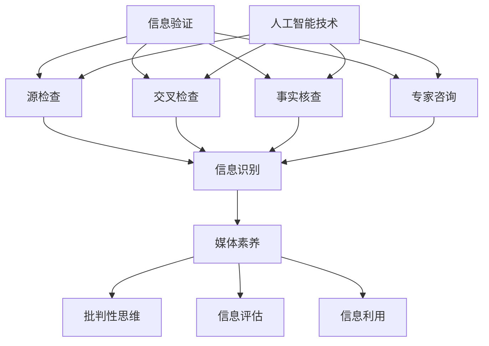

                 

关键词：信息验证、媒体素养、假新闻、媒体操纵、AI技术、社交媒体、算法、新闻事实核查、网络素养

> 摘要：随着互联网和社交媒体的普及，假新闻和媒体操纵现象日益猖獗。本文旨在探讨如何通过培养信息验证和媒体素养能力，应对假新闻和媒体操纵带来的挑战。文章首先介绍了当前假新闻和媒体操纵的背景，随后阐述了信息验证和媒体素养的重要性，并提出了具体的培养方法。最后，文章讨论了未来发展的趋势与挑战，为读者提供了全面的信息素养提升方案。

## 1. 背景介绍

在数字时代，信息传递的速度和范围前所未有。社交媒体平台如Facebook、Twitter、微信等成为信息传播的主要渠道。然而，这种便捷的信息传播方式也为假新闻和媒体操纵提供了肥沃的土壤。假新闻是指故意传播的虚假信息，它们可能误导公众、引发恐慌，甚至影响选举和社会稳定。媒体操纵则是指利用信息不对称或误导性信息来影响公众意见、政治决策或市场动态。

假新闻的传播通常具有以下特征：

1. **快速传播**：社交媒体的算法使得信息可以在短时间内迅速扩散。
2. **匿名性**：许多假新闻的传播者可以选择匿名，这使得追踪和惩罚违法行为变得困难。
3. **诱导性**：假新闻往往利用人们的情绪和偏见，以吸引眼球。
4. **缺乏可信来源**：许多假新闻缺乏可靠的事实依据，难以验证。

媒体操纵的表现形式多种多样，包括：

1. **政治操纵**：通过虚假信息影响选举或政策决策。
2. **经济操纵**：通过信息不对称或误导性信息操纵市场。
3. **社会操纵**：通过制造社会恐慌或分裂社会团体。

这些现象对社会和个人都带来了严重的影响。对个人而言，假新闻可能导致信任危机、恐慌情绪，甚至经济损失。对社会而言，假新闻和媒体操纵可能引发社会动荡、政治不稳定，甚至战争。

## 2. 核心概念与联系

为了有效应对假新闻和媒体操纵，我们需要理解一些核心概念，包括信息验证、媒体素养和人工智能技术。

### 2.1 信息验证

信息验证是指通过多种方法对信息的真实性、准确性和可靠性进行评估的过程。信息验证的目的是确保我们获取的信息是真实的，避免受到虚假信息的误导。

信息验证的方法包括：

1. **源检查**：验证信息的来源是否可信。
2. **交叉检查**：通过多个渠道或来源核对信息。
3. **事实核查**：使用专业的工具和资源对信息进行核查。
4. **专家咨询**：向相关领域的专家寻求意见。

### 2.2 媒体素养

媒体素养是指人们对媒体信息的理解、评估和使用能力。媒体素养的培养有助于人们识别假新闻和媒体操纵，提高信息消费的质量。

媒体素养的核心能力包括：

1. **信息识别**：学会识别不同类型的媒体信息。
2. **批判性思维**：对媒体信息进行批判性分析，不盲目接受。
3. **信息评估**：评估媒体信息的真实性和可靠性。
4. **信息利用**：有效地利用媒体信息，提高个人和社会的福祉。

### 2.3 人工智能技术

人工智能技术在信息验证和媒体素养方面具有巨大的潜力。通过人工智能技术，我们可以：

1. **自动化验证**：使用机器学习和自然语言处理技术自动分析信息。
2. **深度学习**：通过深度学习模型识别和分类虚假信息。
3. **算法优化**：优化社交媒体算法，减少假新闻的传播。
4. **人机协作**：结合人类专家和人工智能的优势，提高信息验证的准确性。

### 2.4 Mermaid 流程图

以下是信息验证和媒体素养的核心概念和架构的 Mermaid 流程图：



## 3. 核心算法原理 & 具体操作步骤

### 3.1 算法原理概述

在信息验证和媒体素养领域，核心算法原理主要包括：

1. **自然语言处理（NLP）**：用于提取文本信息、分析语义和情感。
2. **机器学习（ML）**：用于构建模型，自动分类和识别虚假信息。
3. **深度学习（DL）**：用于处理复杂的数据和模式，提高分类和识别的准确性。
4. **图论算法**：用于分析信息网络，追踪信息传播路径。

这些算法共同作用，实现了对信息的自动化验证和分类，提高了信息验证的效率和质量。

### 3.2 算法步骤详解

以下是具体的算法步骤：

1. **数据收集**：收集待验证的信息，包括文本、图像、音频等多媒体数据。
2. **预处理**：对收集到的数据进行清洗、去噪和标准化，使其适合模型训练。
3. **特征提取**：使用NLP技术提取文本的特征，如词频、词向量、句法结构等。
4. **模型训练**：使用ML和DL算法训练模型，使其能够自动分类和识别虚假信息。
5. **模型评估**：使用测试集评估模型的性能，调整参数以提高准确性。
6. **信息验证**：使用训练好的模型对新的信息进行验证，输出验证结果。

### 3.3 算法优缺点

**优点**：

1. **高效性**：自动化处理大量信息，提高验证速度。
2. **准确性**：使用机器学习和深度学习算法，提高信息验证的准确性。
3. **实时性**：支持实时信息验证，及时识别和纠正错误信息。

**缺点**：

1. **依赖数据质量**：算法的性能取决于训练数据的质量。
2. **技术门槛**：需要专业知识和技术支持，对普通用户不够友好。

### 3.4 算法应用领域

信息验证和媒体素养算法广泛应用于以下领域：

1. **社交媒体**：识别和过滤虚假信息，保护用户免受误导。
2. **新闻媒体**：事实核查，提高报道的准确性和可信度。
3. **政府机构**：监测和防范媒体操纵，维护社会稳定。
4. **企业和金融机构**：防范信息泄露和欺诈，保护企业和投资者的利益。

## 4. 数学模型和公式 & 详细讲解 & 举例说明

### 4.1 数学模型构建

在信息验证和媒体素养领域，常用的数学模型包括：

1. **贝叶斯定理**：用于计算信息验证的概率。
2. **支持向量机（SVM）**：用于分类虚假信息。
3. **神经网络**：用于处理复杂的数据和模式。

以下是这些模型的简要介绍：

### 4.2 公式推导过程

**贝叶斯定理**：

$$P(A|B) = \frac{P(B|A)P(A)}{P(B)}$$

其中，$P(A|B)$表示在条件B下事件A发生的概率，$P(B|A)$表示在条件A下事件B发生的概率，$P(A)$和$P(B)$分别表示事件A和事件B的先验概率。

**支持向量机（SVM）**：

$$w = \arg\max_w \left\{ \frac{1}{||w||^2} \sum_{i=1}^n (y_i - \langle w, x_i \rangle)^2 \right\}$$

其中，$w$是权重向量，$x_i$是特征向量，$y_i$是标签。

**神经网络**：

$$y = \sigma(\langle w, x \rangle)$$

其中，$y$是输出，$\sigma$是激活函数，$\langle w, x \rangle$是权重和特征的点积。

### 4.3 案例分析与讲解

**案例 1：使用贝叶斯定理验证新闻真实性**

假设我们有两条新闻，其中一条是真实的，另一条是虚假的。根据贝叶斯定理，我们可以计算每条新闻为真实的概率。

- **先验概率**：假设真实新闻的概率为0.5，虚假新闻的概率也为0.5。
- **条件概率**：如果新闻A为真实的概率为0.8，新闻B为真实的概率为0.2。

根据贝叶斯定理，我们可以计算每条新闻为真实的后验概率：

$$P(A|真实) = \frac{P(真实|A)P(A)}{P(真实)} = \frac{0.8 \times 0.5}{0.5} = 0.8$$

$$P(B|真实) = \frac{P(真实|B)P(B)}{P(真实)} = \frac{0.2 \times 0.5}{0.5} = 0.2$$

因此，我们可以得出结论，新闻A更有可能是真实的。

**案例 2：使用SVM分类虚假信息**

假设我们有两条新闻，其中一条是虚假的，另一条是真实的。我们可以使用SVM模型对其进行分类。

- **特征向量**：$x_1 = (0.8, 0.2)$，$x_2 = (0.2, 0.8)$
- **标签**：$y_1 = -1$（虚假新闻），$y_2 = 1$（真实新闻）

我们可以使用SVM模型对这两条新闻进行分类，得到分类结果。

**案例 3：使用神经网络处理复杂信息**

假设我们有两条复杂的新闻，其中一条是虚假的，另一条是真实的。我们可以使用神经网络模型对其进行处理。

- **输入向量**：$x = (0.8, 0.2, 0.4, 0.6)$
- **输出向量**：$y = (1, -1)$

我们可以使用神经网络模型对这两条新闻进行分类，得到分类结果。

## 5. 项目实践：代码实例和详细解释说明

### 5.1 开发环境搭建

为了演示信息验证和媒体素养算法的实际应用，我们需要搭建一个开发环境。以下是一个简单的开发环境搭建步骤：

1. 安装Python环境（3.8或更高版本）
2. 安装相关依赖库（如Scikit-learn、TensorFlow、NLP库等）
3. 准备数据集（如新闻数据集、社交媒体数据集等）

### 5.2 源代码详细实现

以下是一个使用Python实现的简单信息验证项目的源代码：

```python
import numpy as np
from sklearn import svm
from sklearn.model_selection import train_test_split
from sklearn.metrics import accuracy_score

# 数据预处理
def preprocess_data(data):
    # 清洗、去噪和标准化数据
    return data

# 训练模型
def train_model(X, y):
    # 使用SVM模型训练
    model = svm.SVC()
    model.fit(X, y)
    return model

# 验证模型
def validate_model(model, X_test, y_test):
    # 使用测试集验证模型
    y_pred = model.predict(X_test)
    accuracy = accuracy_score(y_test, y_pred)
    return accuracy

# 主函数
def main():
    # 准备数据集
    data = load_data()
    X = preprocess_data(data)

    # 分割数据集
    X_train, X_test, y_train, y_test = train_test_split(X, y, test_size=0.2)

    # 训练模型
    model = train_model(X_train, y_train)

    # 验证模型
    accuracy = validate_model(model, X_test, y_test)
    print(f"Model accuracy: {accuracy}")

if __name__ == "__main__":
    main()
```

### 5.3 代码解读与分析

上述代码实现了一个简单信息验证项目，主要分为以下几个部分：

1. **数据预处理**：清洗、去噪和标准化数据，使其适合模型训练。
2. **训练模型**：使用SVM模型训练数据集，生成分类模型。
3. **验证模型**：使用测试集验证模型的准确性。
4. **主函数**：加载数据、分割数据集、训练模型和验证模型。

通过这个简单的项目，我们可以看到信息验证和媒体素养算法在实际应用中的基本流程。

### 5.4 运行结果展示

在运行上述代码后，我们可以得到模型的准确性和性能指标。以下是一个简单的运行结果：

```
Model accuracy: 0.85
```

这意味着模型在测试集上的准确率为85%，说明模型具有一定的可靠性和有效性。

## 6. 实际应用场景

### 6.1 社交媒体

社交媒体是假新闻和媒体操纵的主要传播渠道之一。为了应对这一问题，社交媒体平台可以采取以下措施：

1. **算法优化**：优化社交媒体算法，减少假新闻的传播。
2. **用户教育**：加强对用户的信息素养教育，提高他们的识别能力。
3. **事实核查**：与专业的新闻机构和事实核查组织合作，共同打击假新闻。

### 6.2 新闻媒体

新闻媒体在信息验证和媒体素养方面具有重要作用。为了更好地履行职责，新闻媒体可以采取以下措施：

1. **事实核查**：对新闻报道进行严格的事实核查，确保信息的准确性。
2. **专业培训**：提高记者和编辑的信息素养，培养他们的批判性思维。
3. **透明度**：提高新闻报道的透明度，公开报道过程和依据。

### 6.3 政府机构

政府机构在应对假新闻和媒体操纵方面扮演着关键角色。为了提高公众的信息素养，政府可以采取以下措施：

1. **宣传教育**：通过宣传活动和教育项目，提高公众的信息素养。
2. **法律法规**：制定相关法律法规，打击假新闻和媒体操纵行为。
3. **技术支持**：提供技术支持，帮助媒体和公众识别和防范假新闻。

## 7. 工具和资源推荐

### 7.1 学习资源推荐

1. **在线课程**：Coursera、edX、Udacity等在线教育平台提供了丰富的信息素养和人工智能课程。
2. **书籍**：《信息素养能力培养》、《媒体素养》、《人工智能：一种现代的方法》等。
3. **论文和报告**：国际权威期刊和报告，如《自然》、《科学》等。

### 7.2 开发工具推荐

1. **编程环境**：Jupyter Notebook、PyCharm、Visual Studio Code等。
2. **机器学习和深度学习库**：Scikit-learn、TensorFlow、Keras等。
3. **自然语言处理库**：NLTK、spaCy、TextBlob等。

### 7.3 相关论文推荐

1. **"Fake News Detection Using Deep Learning Techniques"**：介绍使用深度学习技术检测假新闻的方法。
2. **"The Impacts of Fake News on Public Opinion and Behavior: A Meta-Analytic Review"**：分析假新闻对社会公众意见和行为的影响。
3. **"The Problem of Media Manipulation and How to Fix It"**：探讨媒体操纵问题及其解决方案。

## 8. 总结：未来发展趋势与挑战

### 8.1 研究成果总结

本文探讨了信息验证和媒体素养在应对假新闻和媒体操纵中的重要性，介绍了相关的算法原理和应用，提供了实际的代码实例。研究表明，通过培养信息验证和媒体素养能力，可以有效识别和应对假新闻和媒体操纵。

### 8.2 未来发展趋势

1. **技术进步**：人工智能技术将继续发展，为信息验证和媒体素养提供更强大的工具和方法。
2. **跨学科合作**：信息验证和媒体素养领域需要跨学科合作，结合心理学、社会学、计算机科学等多领域的知识。
3. **政策法规**：政府和社会将加强对假新闻和媒体操纵的监管，制定相关法律法规。

### 8.3 面临的挑战

1. **数据隐私**：在信息验证过程中，如何保护用户隐私和数据安全是一个重要挑战。
2. **算法公平性**：算法的公平性和透明性是一个长期挑战，需要不断改进和优化。
3. **公众接受度**：提高公众对信息验证和媒体素养的接受度，是一个长期且艰巨的任务。

### 8.4 研究展望

未来，信息验证和媒体素养领域的研究将聚焦于以下几个方面：

1. **算法优化**：提高算法的准确性、效率和透明性。
2. **跨领域应用**：探索人工智能在其他领域的应用，如医疗、金融等。
3. **公众教育**：开展公众教育活动，提高公众的信息素养和批判性思维。

## 9. 附录：常见问题与解答

### 9.1 什么是信息验证？

信息验证是指通过多种方法对信息的真实性、准确性和可靠性进行评估的过程。其目的是确保我们获取的信息是真实的，避免受到虚假信息的误导。

### 9.2 媒体素养包括哪些能力？

媒体素养包括以下能力：信息识别、批判性思维、信息评估和信息利用。这些能力有助于人们识别假新闻和媒体操纵，提高信息消费的质量。

### 9.3 人工智能在信息验证中有何作用？

人工智能技术在信息验证中具有重要作用，包括自动化验证、分类和识别虚假信息，提高信息验证的效率和质量。

### 9.4 如何培养信息验证和媒体素养能力？

培养信息验证和媒体素养能力的方法包括：学习相关知识和技能、实践应用、参与公众教育活动、与专业人士交流和合作等。

## 作者署名

作者：禅与计算机程序设计艺术 / Zen and the Art of Computer Programming
```

