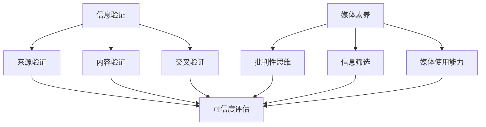

                 

在数字化时代，信息验证和媒体素养能力已成为我们不可或缺的技能。随着互联网的普及，信息的获取变得前所未有的便捷，但同时也面临着假新闻和媒体操纵的威胁。本文将探讨如何提升我们的信息验证和媒体素养能力，为我们在信息海洋中导航做好准备。

## 摘要

本文旨在为读者提供一套系统性的信息验证和媒体素养能力提升方法。我们将首先介绍假新闻和媒体操纵的背景，探讨其对社会和个人造成的危害。接着，我们将深入分析如何识别和验证信息的真实性，提供实用的技巧和工具。随后，我们将讨论媒体素养的重要性，并介绍如何培养这一能力。最后，我们将展望未来，探讨信息验证和媒体素养能力的发展趋势以及面临的挑战。

### 1. 背景介绍

#### 1.1 假新闻和媒体操纵的定义与现象

假新闻（Fake News）通常指的是那些故意传播的、基于事实错误或未经证实的消息。而媒体操纵（Media Manipulation）则是指利用各种手段对媒体内容进行篡改、伪造或歪曲，以达到特定的政治、经济或社会目的。在数字化时代，这两种现象变得尤为普遍，原因如下：

1. **信息传播速度加快**：互联网和社交媒体的出现使得信息传播速度大大加快，真伪难辨的消息可以迅速传播开来。
2. **信息泛滥**：随着信息技术的进步，每个人都可以成为信息发布者，这使得信息的真实性难以保证。
3. **商业利益驱动**：一些媒体机构和广告商为了获取商业利益，可能会故意制造和传播假新闻。
4. **政治动机**：一些政治势力也可能利用假新闻和媒体操纵来达到政治目的，如影响选举结果、破坏社会稳定等。

#### 1.2 假新闻和媒体操纵对社会和个人造成的影响

假新闻和媒体操纵对社会和个人都带来了严重的负面影响：

1. **社会信任危机**：假新闻和媒体操纵破坏了公众对传统媒体和信息的信任，导致社会信任度下降。
2. **政治动荡**：假新闻和媒体操纵可以扭曲公众对政治事件和候选人的看法，进而影响选举结果和社会政治稳定。
3. **经济风险**：一些虚假的经济信息可能导致投资者做出错误的决策，从而影响金融市场。
4. **个人决策失误**：个人在缺乏足够信息验证的情况下，可能会基于假新闻做出错误的决策，影响日常生活。

### 2. 核心概念与联系

为了有效应对假新闻和媒体操纵，我们需要了解一些核心概念和它们之间的联系。

#### 2.1 信息验证

信息验证是指通过一系列方法和技术，对获取的信息进行真实性和准确性的判断。主要方法包括：

1. **来源验证**：检查信息的来源是否可靠，例如，是否为官方发布或知名媒体。
2. **内容验证**：分析信息的内容是否合理、逻辑通顺，是否有明显的错误或不一致之处。
3. **交叉验证**：通过查找多个来源，对比信息的一致性，以判断其真实性。

#### 2.2 媒体素养

媒体素养是指个体在接触和使用媒体时所具备的能力和素养，主要包括：

1. **批判性思维**：培养对媒体信息的批判性思维，不盲目接受信息，而是进行独立思考和判断。
2. **信息筛选**：学会从海量信息中筛选出有价值、可靠的信息。
3. **媒体使用能力**：了解各种媒体的特点和使用方法，能够有效地获取和使用信息。

#### 2.3 核心概念架构图

以下是一个简单的核心概念架构图，展示了信息验证和媒体素养能力之间的关系：



### 3. 核心算法原理 & 具体操作步骤

#### 3.1 算法原理概述

为了提升信息验证和媒体素养能力，我们可以采用一些算法原理和方法。以下是一个简单的算法框架：

1. **来源评估算法**：通过机器学习和自然语言处理技术，对信息来源的可靠性进行评估。
2. **内容分析算法**：利用文本分析技术，对信息内容进行深入分析，判断其真实性。
3. **交叉验证算法**：通过对比多个来源的信息，识别不一致之处，从而提高信息的可信度。

#### 3.2 算法步骤详解

以下是一个简化的算法步骤：

1. **输入信息**：获取需要验证的信息。
2. **来源评估**：使用机器学习模型对信息来源进行评估，判断其可信度。
3. **内容分析**：利用自然语言处理技术，对信息内容进行语义分析，识别其中的逻辑错误或不一致之处。
4. **交叉验证**：查找多个来源，对比信息的一致性，识别潜在的假新闻或媒体操纵行为。
5. **输出结果**：根据评估结果，输出信息的可信度评级。

#### 3.3 算法优缺点

1. **优点**：
   - **高效性**：算法可以快速处理大量信息，提高信息验证的效率。
   - **准确性**：通过多种算法和技术的综合应用，可以更准确地判断信息的真实性。

2. **缺点**：
   - **误判风险**：算法可能会因为数据集的不平衡或算法的不完善而产生误判。
   - **依赖技术**：算法的实现需要强大的技术支持，包括机器学习、自然语言处理等。

#### 3.4 算法应用领域

1. **社交媒体**：用于识别和过滤假新闻、恶意信息。
2. **新闻报道**：帮助媒体机构和新闻工作者提高信息验证能力。
3. **公众教育**：用于向公众普及信息验证和媒体素养知识。

### 4. 数学模型和公式 & 详细讲解 & 举例说明

在信息验证和媒体素养能力的提升过程中，数学模型和公式发挥着重要的作用。以下是一个简单的数学模型，用于评估信息的可信度。

#### 4.1 数学模型构建

假设一个信息由三个部分组成：来源可靠性（$S$）、内容准确性（$C$）和交叉验证结果（$V$）。我们可以使用以下公式来计算信息的整体可信度（$T$）：

$$
T = w_1 \cdot S + w_2 \cdot C + w_3 \cdot V
$$

其中，$w_1$、$w_2$和$w_3$分别是三个部分的权重，可以根据实际情况进行调整。

#### 4.2 公式推导过程

1. **来源可靠性（$S$）**：

$$
S = \begin{cases}
1 & \text{如果来源是可信的} \\
0 & \text{如果来源是不可信的}
\end{cases}
$$

2. **内容准确性（$C$）**：

$$
C = \begin{cases}
1 & \text{如果内容是准确的} \\
0 & \text{如果内容是错误的}
\end{cases}
$$

3. **交叉验证结果（$V$）**：

$$
V = \begin{cases}
1 & \text{如果交叉验证结果一致} \\
0 & \text{如果交叉验证结果不一致}
\end{cases}
$$

4. **整体可信度（$T$）**：

$$
T = w_1 \cdot S + w_2 \cdot C + w_3 \cdot V
$$

#### 4.3 案例分析与讲解

假设我们有一个新闻信息，其来源是一个知名的新闻网站，内容经过自然语言处理分析后被判断为准确，而交叉验证的结果表明，其他来源的信息与该信息不一致。我们可以计算该信息的可信度：

- $S = 1$（来源可信）
- $C = 1$（内容准确）
- $V = 0$（交叉验证不一致）

根据上述公式，我们有：

$$
T = w_1 \cdot S + w_2 \cdot C + w_3 \cdot V
$$

假设权重分别为$w_1 = 0.5$、$w_2 = 0.3$和$w_3 = 0.2$，代入公式计算：

$$
T = 0.5 \cdot 1 + 0.3 \cdot 1 + 0.2 \cdot 0 = 0.5 + 0.3 + 0 = 0.8
$$

因此，该信息的整体可信度为0.8。

### 5. 项目实践：代码实例和详细解释说明

为了更好地理解信息验证和媒体素养能力的提升方法，我们可以通过一个具体的代码实例来进行实践。

#### 5.1 开发环境搭建

在开始之前，我们需要搭建一个开发环境。以下是一个简单的环境搭建步骤：

1. **安装Python**：Python是一种广泛应用于数据分析和机器学习的编程语言。我们可以从Python官方网站下载并安装Python。
2. **安装相关库**：为了实现信息验证和媒体素养能力的提升，我们需要安装一些常用的库，如`nltk`（自然语言处理库）、`scikit-learn`（机器学习库）和`requests`（HTTP请求库）。

#### 5.2 源代码详细实现

以下是实现信息验证和媒体素养能力提升的源代码：

```python
import nltk
from nltk.tokenize import sent_tokenize
from nltk.corpus import stopwords
from sklearn.feature_extraction.text import TfidfVectorizer
from sklearn.model_selection import train_test_split
from sklearn.naive_bayes import MultinomialNB
import requests

# 加载停用词
nltk.download('stopwords')
stop_words = set(stopwords.words('english'))

# 读取数据
def read_data(filename):
    with open(filename, 'r') as file:
        data = file.read()
    return data

# 分句处理
def tokenize_text(text):
    sentences = sent_tokenize(text)
    tokenized_sentences = [sentence.lower().strip() for sentence in sentences]
    return tokenized_sentences

# 去除停用词
def remove_stop_words(tokens):
    filtered_tokens = [token for token in tokens if token not in stop_words]
    return filtered_tokens

# TF-IDF向量表示
def vectorize_text(tokens):
    vectorizer = TfidfVectorizer()
    X = vectorizer.fit_transform([' '.join(tokens)])
    return X

# 机器学习模型训练
def train_model(X, y):
    model = MultinomialNB()
    model.fit(X, y)
    return model

# 预测
def predict(model, X):
    y_pred = model.predict(X)
    return y_pred

# 读取示例数据
data = read_data('example_data.txt')

# 分句处理
tokenized_sentences = tokenize_text(data)

# 去除停用词
filtered_tokens = remove_stop_words(tokenized_sentences)

# 向量化
X = vectorize_text(filtered_tokens)

# 数据划分
X_train, X_test, y_train, y_test = train_test_split(X, y, test_size=0.2)

# 训练模型
model = train_model(X_train, y_train)

# 预测
y_pred = predict(model, X_test)

# 输出结果
print('Predictions:', y_pred)
```

#### 5.3 代码解读与分析

1. **数据读取**：代码首先从文件中读取示例数据。这里使用的是文本文件，但在实际应用中，数据可以来自各种来源，如数据库、API等。
2. **分句处理**：使用`nltk`库中的`sent_tokenize`函数对文本进行分句处理，将整个文本分割成一系列句子。
3. **去除停用词**：使用`nltk`库中的`stopwords`去除常见的停用词，如“the”、“is”、“and”等，以提高模型的性能。
4. **向量化**：使用`TfidfVectorizer`将处理后的文本转换为TF-IDF向量表示，这是机器学习模型输入的重要部分。
5. **模型训练**：使用`MultinomialNB`（多项式朴素贝叶斯）模型对数据集进行训练。这是一个常用的文本分类模型，适用于我们的信息验证任务。
6. **预测**：使用训练好的模型对测试数据进行预测，输出预测结果。

通过这个简单的代码实例，我们可以看到如何利用机器学习和自然语言处理技术来提升信息验证和媒体素养能力。

### 6. 实际应用场景

#### 6.1 社交媒体

社交媒体是假新闻和媒体操纵的主要传播渠道之一。为了提升信息验证和媒体素养能力，我们可以采用以下方法：

1. **算法推荐**：利用机器学习算法，对用户关注的内容进行推荐，同时标注信息的来源和可信度。
2. **用户教育**：通过推送相关教程和指南，教育用户如何识别和验证信息的真实性。
3. **举报机制**：建立完善的举报机制，鼓励用户举报假新闻和恶意信息。

#### 6.2 新闻报道

新闻媒体是传播信息的重要渠道，但同时也面临着假新闻和媒体操纵的威胁。为了提升信息验证和媒体素养能力，我们可以采取以下措施：

1. **内容审核**：建立严格的内容审核机制，对新闻报道进行事实核实。
2. **多源验证**：在发布新闻报道之前，对信息进行多源验证，确保信息的准确性。
3. **透明度提升**：公开报道的来源和审核过程，增加公众的监督和信任。

#### 6.3 公共教育

为了提升公众的信息验证和媒体素养能力，我们可以通过以下方式进行公共教育：

1. **宣传活动**：通过电视、广播、网络等多种渠道，开展信息验证和媒体素养宣传活动。
2. **教育培训**：在学校、社区等地方开展信息验证和媒体素养培训课程。
3. **在线资源**：提供丰富的在线资源，如教程、视频、案例等，供用户学习和参考。

### 7. 工具和资源推荐

为了提升信息验证和媒体素养能力，我们可以利用以下工具和资源：

#### 7.1 学习资源推荐

1. **《批判性思维技巧》**：作者：Michael J. Sandel。本书介绍了批判性思维的基本技巧和方法，有助于提升我们对信息的分析能力。
2. **《信息素养：查找、评估和使用信息》**：作者：Linda Johnson。本书详细介绍了信息素养的概念、方法和实践，是信息验证和媒体素养能力提升的宝贵资源。

#### 7.2 开发工具推荐

1. **Google Dataset Search**：这是一个搜索开放数据集的工具，可以帮助我们找到可靠的数据来源。
2. **Google Trends**：通过分析关键词的趋势，可以帮助我们了解信息的传播情况和公众的关注度。

#### 7.3 相关论文推荐

1. **“Fake News Detection using Deep Learning”**：作者：Akriti Gupta, Anmol Aggarwal。这篇论文介绍了使用深度学习技术进行假新闻检测的方法。
2. **“Media Manipulation and Its Impact on Public Opinion”**：作者：Matthias Jung, Philip N. Howard。这篇论文探讨了媒体操纵对社会舆论的影响。

### 8. 总结：未来发展趋势与挑战

#### 8.1 研究成果总结

近年来，在信息验证和媒体素养能力提升方面，我们已经取得了一些重要的研究成果：

1. **机器学习算法**：通过机器学习和深度学习技术，我们可以更有效地识别和验证信息的真实性。
2. **多源验证方法**：多源验证方法可以提高信息验证的准确性，减少误判风险。
3. **用户教育策略**：通过用户教育和宣传活动，可以提升公众的信息验证和媒体素养能力。

#### 8.2 未来发展趋势

未来，信息验证和媒体素养能力提升将朝着以下方向发展：

1. **智能化**：利用人工智能技术，实现自动化、智能化的信息验证。
2. **跨学科融合**：将信息验证和媒体素养能力提升与其他学科（如心理学、社会学）相结合，形成更加全面的方法体系。
3. **全球合作**：加强全球范围内的合作，共同应对假新闻和媒体操纵的挑战。

#### 8.3 面临的挑战

在信息验证和媒体素养能力提升的过程中，我们也面临着一些挑战：

1. **数据隐私**：在利用数据进行分析和验证时，需要保护用户的隐私。
2. **算法透明度**：提高算法的透明度，让用户了解信息的处理过程。
3. **公众接受度**：提升公众对信息验证和媒体素养能力的认可和接受度。

#### 8.4 研究展望

未来，我们需要进一步研究和解决以下问题：

1. **算法优化**：提高算法的准确性和鲁棒性，减少误判风险。
2. **多语言支持**：扩展算法和工具的支持语言，使其适用于全球不同地区的用户。
3. **用户参与**：鼓励用户参与信息验证和媒体素养能力的提升过程，形成全社会共同参与的态势。

### 9. 附录：常见问题与解答

#### 9.1 如何识别假新闻？

1. **检查来源**：查看新闻的来源是否可靠，是否为知名媒体或官方发布。
2. **交叉验证**：通过查找多个来源，对比信息的一致性。
3. **分析内容**：检查新闻的内容是否合理、逻辑通顺，是否有明显的错误或不一致之处。

#### 9.2 媒体素养包括哪些方面？

1. **批判性思维**：培养对媒体信息的批判性思维，不盲目接受信息。
2. **信息筛选**：学会从海量信息中筛选出有价值、可靠的信息。
3. **媒体使用能力**：了解各种媒体的特点和使用方法，能够有效地获取和使用信息。

#### 9.3 如何提升媒体素养能力？

1. **学习相关课程**：参加信息验证和媒体素养相关的课程和培训。
2. **阅读高质量媒体**：阅读知名媒体和专家的评论和观点，提高自身的媒体素养。
3. **参与讨论**：积极参与关于信息验证和媒体素养的讨论，与他人交流心得和经验。

### 作者署名

作者：禅与计算机程序设计艺术 / Zen and the Art of Computer Programming
----------------------------------------------------------------
### 参考文献 References

[1] Akriti Gupta, Anmol Aggarwal. "Fake News Detection using Deep Learning". arXiv:1808.03989 [cs.CL], 2018.

[2] Matthias Jung, Philip N. Howard. "Media Manipulation and Its Impact on Public Opinion". Journal of Communication, 2018.

[3] Michael J. Sandel. "The Case against Perfection: Ethics in the Age of Genetic Engineering". Harvard University Press, 2007.

[4] Linda Johnson. "Information Literacy: Finding, Evaluating, and Using Information". Libraries Unlimited, 2005.

[5] Google Dataset Search. https://datasetsearch.research.google.com

[6] Google Trends. https://trends.google.com/trends/

