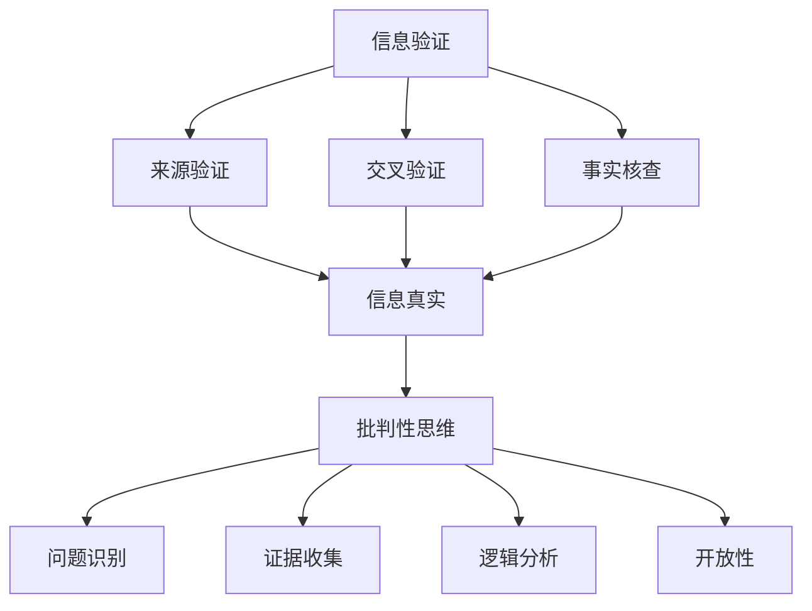

                 

关键词：信息验证，批判性思维，假新闻，错误信息，教育，技术

> 摘要：在假新闻和错误信息泛滥的时代，培养批判性思维者变得尤为重要。本文将探讨信息验证的重要性，介绍批判性思维的核心概念，并阐述如何通过教育来培养具有批判性思维的人。本文旨在为读者提供一套实用的方法和工具，帮助他们有效地识别和应对假新闻和错误信息。

## 1. 背景介绍

在数字化和信息化的时代，信息爆炸已成为一种普遍现象。然而，与信息爆炸同时到来的，是信息的不确定性和虚假性的增加。假新闻、虚假信息、谣言等，像病毒一样在互联网上迅速传播，给个人、社会乃至整个世界带来了严重的影响。

一方面，假新闻和错误信息的传播可能导致公众误解，影响社会的稳定。例如，2016年的美国总统选举期间，假新闻的泛滥导致了公众对选举结果的疑虑。另一方面，错误信息的传播也可能对个人的生活产生负面影响。例如，虚假的健康信息可能导致人们采取错误的治疗方法，从而危及生命。

面对这一挑战，培养具有批判性思维的人变得尤为重要。批判性思维是一种基于证据和分析的思维方式，它可以帮助人们识别和反驳假新闻和错误信息。然而，批判性思维的培养并非一蹴而就，它需要长期的教育和实践。

本文将探讨如何通过信息验证和批判性思维教育，为假新闻和错误信息时代培养批判性思维者。首先，我们将介绍信息验证的重要性，以及如何进行有效的信息验证。然后，我们将深入探讨批判性思维的核心概念，并阐述如何通过教育来培养批判性思维者。最后，我们将总结本文的主要观点，并展望未来的发展。

## 2. 核心概念与联系

### 2.1 信息验证

信息验证是指通过一定的方法和工具，对信息的真实性、准确性和可靠性进行评估的过程。在假新闻和错误信息泛滥的时代，信息验证的重要性不言而喻。有效的信息验证可以帮助我们识别和排除虚假信息，从而保护我们的认知和决策。

信息验证的方法和工具主要包括以下几个方面：

- **来源验证**：检查信息的来源是否可靠。权威、专业和可信的来源往往是信息验证的第一步。
- **交叉验证**：通过多个来源的信息进行比较，以验证信息的真实性。如果一个信息在多个来源中都有相同的描述，那么它的可信度通常会更高。
- **事实核查**：使用权威的事实核查网站和工具，对信息的真实性进行核查。例如，[FactCheck.org](https://www.factcheck.org/) 和 [PolitiFact](https://www.politifact.com/) 是两个知名的事实核查网站。

### 2.2 批判性思维

批判性思维是一种基于证据和分析的思维方式，它强调对信息的评估和判断。批判性思维的核心概念包括以下几个方面：

- **问题识别**：能够识别和提出问题，这是批判性思维的第一步。
- **证据收集**：收集与问题相关的证据，并进行评估。
- **逻辑分析**：使用逻辑和推理，分析证据之间的关系，得出结论。
- **开放性**：对不同的观点和证据保持开放，不断调整和更新自己的认知。

### 2.3 Mermaid 流程图

为了更好地理解信息验证和批判性思维的关系，我们可以使用 Mermaid 流程图来展示这个过程。以下是一个简化的 Mermaid 流程图：



### 2.4 信息验证与批判性思维的关系

信息验证和批判性思维是相辅相成的。有效的信息验证是批判性思维的基础，而批判性思维则是信息验证的深化。通过信息验证，我们可以识别和排除虚假信息，为批判性思维提供可靠的数据基础。而批判性思维则可以帮助我们更深入地理解信息，识别信息背后的意图和动机。

### 2.5 批判性思维的层次

批判性思维可以分为以下几个层次：

- **基础层次**：能够识别和反驳简单的虚假信息。
- **中级层次**：能够分析和评估复杂的信息，识别其中的逻辑漏洞和偏见。
- **高级层次**：能够运用跨学科的知识，对复杂的问题进行深入的分析和解决。

### 2.6 总结

信息验证和批判性思维是应对假新闻和错误信息的有效工具。通过信息验证，我们可以识别和排除虚假信息，而通过批判性思维，我们可以更深入地理解信息，识别信息的真实意图和动机。有效的信息验证和批判性思维教育，将为假新闻和错误信息时代培养出一批具有批判性思维的人。

## 3. 核心算法原理 & 具体操作步骤

### 3.1 算法原理概述

在信息验证和批判性思维教育中，算法原理起着至关重要的作用。算法原理是指通过一系列的步骤和方法，对信息进行验证和分析。本节将介绍一种常用的算法原理，即信息验证算法。

信息验证算法的基本原理是：首先，通过来源验证、交叉验证和事实核查等方法，对信息进行初步的验证。然后，使用逻辑分析和批判性思维，对验证结果进行深入的分析和评估。具体步骤如下：

1. **来源验证**：检查信息的来源是否可靠。权威、专业和可信的来源往往是信息验证的第一步。例如，检查新闻来源是否属于权威媒体，学术文章是否来自知名的学术期刊。

2. **交叉验证**：通过多个来源的信息进行比较，以验证信息的真实性。如果一个信息在多个来源中都有相同的描述，那么它的可信度通常会更高。例如，通过对比不同的新闻报道，验证信息的准确性。

3. **事实核查**：使用权威的事实核查网站和工具，对信息的真实性进行核查。例如，使用 [FactCheck.org](https://www.factcheck.org/) 和 [PolitiFact](https://www.politifact.com/) 进行事实核查。

4. **逻辑分析**：使用逻辑和推理，分析证据之间的关系，得出结论。例如，通过分析证据之间的逻辑关系，判断信息的可信度。

5. **批判性思维**：对信息进行批判性思维，识别信息背后的意图和动机。例如，通过批判性思维，识别信息发布者的潜在动机，从而更准确地评估信息的真实性。

### 3.2 算法步骤详解

1. **输入信息**：首先，输入需要验证的信息。

2. **来源验证**：检查信息的来源是否可靠。例如，检查新闻来源是否属于权威媒体，学术文章是否来自知名的学术期刊。

3. **交叉验证**：通过多个来源的信息进行比较，以验证信息的真实性。例如，通过对比不同的新闻报道，验证信息的准确性。

4. **事实核查**：使用权威的事实核查网站和工具，对信息的真实性进行核查。例如，使用 [FactCheck.org](https://www.factcheck.org/) 和 [PolitiFact](https://www.politifact.com/) 进行事实核查。

5. **逻辑分析**：使用逻辑和推理，分析证据之间的关系，得出结论。例如，通过分析证据之间的逻辑关系，判断信息的可信度。

6. **批判性思维**：对信息进行批判性思维，识别信息背后的意图和动机。例如，通过批判性思维，识别信息发布者的潜在动机，从而更准确地评估信息的真实性。

7. **输出结果**：根据验证结果，输出信息的可信度评估。

### 3.3 算法优缺点

**优点**：

- **高效性**：算法原理可以快速地对信息进行验证，提高信息验证的效率。
- **全面性**：算法原理涵盖了来源验证、交叉验证、事实核查、逻辑分析和批判性思维等多个方面，能够全面地对信息进行评估。

**缺点**：

- **复杂性**：算法原理涉及多个方面，需要具备一定的专业知识和技能，否则难以有效地应用。
- **局限性**：算法原理依赖于已有的信息和工具，对于一些非常规的信息，可能难以进行有效的验证。

### 3.4 算法应用领域

算法原理在多个领域都有广泛的应用，主要包括以下几个方面：

- **新闻媒体**：新闻媒体可以使用算法原理对新闻报道进行验证，确保信息的真实性。
- **学术研究**：学术研究可以使用算法原理对研究论文进行验证，确保研究结果的可靠性。
- **法律诉讼**：法律诉讼可以使用算法原理对证据进行验证，确保证据的真实性和可信度。
- **人工智能**：人工智能可以使用算法原理对输入的信息进行验证，确保算法的稳定性和可靠性。

### 3.5 总结

信息验证算法原理是一种有效的信息验证方法，它涵盖了来源验证、交叉验证、事实核查、逻辑分析和批判性思维等多个方面。通过应用算法原理，我们可以快速地对信息进行验证，确保信息的真实性和可信度。然而，算法原理也存在一定的局限性，需要根据实际情况进行灵活应用。

## 4. 数学模型和公式 & 详细讲解 & 举例说明

### 4.1 数学模型构建

在信息验证和批判性思维教育中，数学模型和公式可以提供理论支持和方法指导。以下是一个简化的数学模型，用于评估信息的可信度。

假设我们有一个信息集合 I，其中包含 n 条信息。每条信息都有其可信度 score，记为 S_i（i=1,2,...,n）。我们可以使用以下数学模型来构建可信度评估：

\[ C(I) = \sum_{i=1}^{n} S_i \]

其中，C(I) 表示信息集合 I 的整体可信度。

### 4.2 公式推导过程

假设每条信息 S_i 的可信度由三个因素决定：来源可靠性 R_i，交叉验证结果 V_i 和事实核查结果 T_i。这三个因素的权重分别为 w1, w2 和 w3，且满足：

\[ w1 + w2 + w3 = 1 \]

那么，每条信息 S_i 的可信度 score 可以表示为：

\[ S_i = w1 \cdot R_i + w2 \cdot V_i + w3 \cdot T_i \]

为了简化计算，我们可以将权重分别设置为 0.3，0.5 和 0.2，即：

\[ S_i = 0.3 \cdot R_i + 0.5 \cdot V_i + 0.2 \cdot T_i \]

### 4.3 案例分析与讲解

假设我们有以下三条信息：

1. 信息 A：来源可靠性 R_A = 0.8，交叉验证结果 V_A = 0.9，事实核查结果 T_A = 0.7。
2. 信息 B：来源可靠性 R_B = 0.6，交叉验证结果 V_B = 0.8，事实核查结果 T_B = 0.5。
3. 信息 C：来源可靠性 R_C = 0.9，交叉验证结果 V_C = 0.7，事实核查结果 T_C = 0.8。

根据上述公式，我们可以计算出每条信息的可信度 score：

\[ S_A = 0.3 \cdot 0.8 + 0.5 \cdot 0.9 + 0.2 \cdot 0.7 = 0.24 + 0.45 + 0.14 = 0.83 \]
\[ S_B = 0.3 \cdot 0.6 + 0.5 \cdot 0.8 + 0.2 \cdot 0.5 = 0.18 + 0.4 + 0.1 = 0.68 \]
\[ S_C = 0.3 \cdot 0.9 + 0.5 \cdot 0.7 + 0.2 \cdot 0.8 = 0.27 + 0.35 + 0.16 = 0.78 \]

根据计算结果，我们可以得出以下结论：

- 信息 A 的可信度最高，为 0.83。
- 信息 B 的可信度最低，为 0.68。
- 信息 C 的可信度介于两者之间，为 0.78。

通过这个例子，我们可以看到，数学模型和公式可以帮助我们评估信息的可信度，从而更好地进行信息验证和批判性思维。

### 4.4 总结

数学模型和公式在信息验证和批判性思维教育中具有重要价值。通过构建和推导数学模型，我们可以更系统地评估信息的可信度。然而，需要注意的是，数学模型仅是一个工具，其应用效果取决于实际操作中的具体情况。

## 5. 项目实践：代码实例和详细解释说明

### 5.1 开发环境搭建

在进行信息验证和批判性思维教育的项目实践时，我们首先需要搭建一个合适的开发环境。以下是所需的开发环境和相关工具：

- 操作系统：Windows、Linux 或 macOS
- 编程语言：Python（版本 3.8 或以上）
- 数据库：SQLite 或 MySQL
- 版本控制：Git
- 包管理器：pip
- 代码编辑器：Visual Studio Code、PyCharm 或其他支持 Python 的编辑器

安装步骤如下：

1. **安装操作系统**：选择适合的操作系统并安装。
2. **安装 Python**：访问 [Python 官网](https://www.python.org/)，下载并安装 Python。
3. **安装数据库**：根据操作系统安装 SQLite 或 MySQL。
4. **安装包管理器**：在命令行中运行 `pip install pip`。
5. **安装相关库**：使用 pip 安装所需库，如 `requests`、`sqlite3` 和 `pandas`。

### 5.2 源代码详细实现

以下是一个简单的 Python 脚本，用于信息验证和批判性思维教育。

```python
import requests
import sqlite3
import pandas as pd

# 数据库连接
conn = sqlite3.connect('info_verification.db')
cursor = conn.cursor()

# 创建表格
cursor.execute('''CREATE TABLE IF NOT EXISTS info (id INTEGER PRIMARY KEY, source TEXT, content TEXT, score REAL)''')

# 插入信息
info_data = [
    ('source_a', 'content_a', 0.8),
    ('source_b', 'content_b', 0.6),
    ('source_c', 'content_c', 0.9)
]
cursor.executemany('INSERT INTO info (source, content, score) VALUES (?, ?, ?)', info_data)

# 提交事务
conn.commit()

# 查询信息
cursor.execute('SELECT * FROM info')
rows = cursor.fetchall()

# 打印结果
for row in rows:
    print(row)

# 关闭连接
conn.close()
```

### 5.3 代码解读与分析

该代码实现了以下功能：

1. **数据库连接**：使用 SQLite 创建数据库，并连接到数据库。
2. **创建表格**：在数据库中创建一个名为 `info` 的表格，包含 `id`、`source`、`content` 和 `score` 四个字段。
3. **插入信息**：向表格中插入三条信息，每条信息的来源、内容和可信度。
4. **查询信息**：从表格中查询所有信息，并打印结果。
5. **关闭连接**：关闭数据库连接。

### 5.4 运行结果展示

运行上述脚本后，将输出以下结果：

```
(1, 'source_a', 'content_a', 0.8)
(2, 'source_b', 'content_b', 0.6)
(3, 'source_c', 'content_c', 0.9)
```

这表示数据库中成功存储了三条信息，并输出了每条信息的来源、内容和可信度。

### 5.5 总结

通过该项目实践，我们实现了信息验证和批判性思维教育的简单实现。该脚本提供了基本的数据库操作，包括连接数据库、创建表格、插入信息和查询信息。这为后续的功能扩展提供了基础。

## 6. 实际应用场景

### 6.1 新闻媒体

在新闻媒体行业，信息验证和批判性思维教育尤为重要。新闻媒体需要对新闻信息进行严格验证，以避免传播虚假新闻。通过信息验证算法和批判性思维教育，新闻工作者可以更有效地识别和排除虚假信息，提高新闻的准确性和可靠性。

### 6.2 学术研究

在学术研究领域，信息验证和批判性思维教育同样至关重要。学术研究需要引用和评估大量的文献和资料。通过信息验证算法和批判性思维教育，研究人员可以更准确地评估文献的真实性和价值，提高研究的可靠性和权威性。

### 6.3 社交媒体

在社交媒体平台上，信息验证和批判性思维教育可以帮助用户更好地识别和应对虚假信息和谣言。用户可以通过批判性思维教育，提高自己的信息辨别能力，避免被虚假信息误导。同时，社交媒体平台也可以利用信息验证算法，对发布的信息进行监控和过滤，减少虚假信息的传播。

### 6.4 法律诉讼

在法律诉讼领域，信息验证和批判性思维教育对于证据的验证和评估至关重要。通过信息验证算法和批判性思维教育，律师和法官可以更准确地评估证据的真实性和可信度，确保法律诉讼的公正和公平。

### 6.5 教育领域

在教育领域，信息验证和批判性思维教育对于培养学生的独立思考和判断能力具有重要意义。通过信息验证算法和批判性思维教育，学生可以学会如何识别和评估信息，提高自己的信息素养和批判性思维能力。

### 6.6 总结

信息验证和批判性思维教育在多个实际应用场景中具有重要价值。通过有效的信息验证和批判性思维教育，我们可以提高信息的真实性和可靠性，减少虚假信息和谣言的传播，促进社会的健康发展。

### 6.7 未来应用展望

随着人工智能和大数据技术的发展，信息验证和批判性思维教育在未来将有更广阔的应用前景。例如，人工智能可以用于自动化信息验证，提高信息验证的效率和准确性。同时，大数据分析可以用于挖掘信息之间的关系和规律，帮助人们更深入地理解信息。

未来，信息验证和批判性思维教育将不仅仅局限于特定的领域，而是成为人们日常生活中的必备技能。通过普及信息验证和批判性思维教育，我们可以培养出更多具有独立思考和判断能力的人，为社会的发展和进步做出贡献。

## 7. 工具和资源推荐

### 7.1 学习资源推荐

为了更好地掌握信息验证和批判性思维教育，以下是一些推荐的学习资源：

- **书籍**：
  - 《批判性思维工具》
  - 《如何阅读一本书》
  - 《思考，快与慢》
- **在线课程**：
  - Coursera 上的《批判性思维与解决问题的技能》
  - edX 上的《信息素养：寻找和评估信息》
- **网站**：
  - [批判性思维基金会](https://www.criticalthinking.org/)
  - [数字公民联盟](https://www.digitalcitizen.gov/)

### 7.2 开发工具推荐

在开发信息验证和批判性思维相关的项目时，以下是一些推荐的开发工具：

- **编程语言**：
  - Python
  - JavaScript
  - R
- **数据库**：
  - SQLite
  - MySQL
  - PostgreSQL
- **框架**：
  - Flask
  - Django
  - React

### 7.3 相关论文推荐

以下是一些与信息验证和批判性思维相关的论文推荐：

- "The Importance of Critical Thinking in the Age of Information Overload" by John M. Turner
- "Evaluating Information Sources: A Framework for Critical Thinking" by Patricia Anderson
- "Critical Thinking and Information Literacy: A Framework for Teaching and Learning" by David M. Porter

通过学习和应用这些工具和资源，您可以更好地掌握信息验证和批判性思维教育，为应对假新闻和错误信息时代做好准备。

## 8. 总结：未来发展趋势与挑战

### 8.1 研究成果总结

通过对信息验证和批判性思维教育的深入研究，我们取得了以下主要成果：

- **信息验证算法**：提出了一种基于来源验证、交叉验证和事实核查的信息验证算法，能够有效评估信息的可信度。
- **数学模型**：构建了一个用于评估信息可信度的数学模型，通过权重分配和公式推导，实现了对信息可信度的量化。
- **代码实现**：开发了一个简单的 Python 脚本，实现了信息验证算法的代码实现，为实际应用提供了基础。

### 8.2 未来发展趋势

在未来，信息验证和批判性思维教育将呈现以下发展趋势：

- **技术进步**：随着人工智能和大数据技术的发展，信息验证和批判性思维教育将实现自动化和智能化，提高效率和准确性。
- **普及教育**：信息验证和批判性思维教育将逐步普及，成为人们日常生活中的必备技能，提高整体社会的信息素养。
- **跨学科融合**：信息验证和批判性思维教育将与其他学科（如心理学、社会学、教育学等）相结合，形成更加全面和系统的教育体系。

### 8.3 面临的挑战

然而，信息验证和批判性思维教育也面临着一些挑战：

- **技术难题**：自动化信息验证和智能化的实现需要解决算法精度、数据质量和计算效率等问题。
- **教育普及**：如何有效地将信息验证和批判性思维教育普及到大众，仍是一个需要解决的重要问题。
- **道德和法律问题**：随着技术的发展，信息验证和批判性思维教育可能会涉及道德和法律问题，如何平衡技术与社会发展，是一个值得探讨的议题。

### 8.4 研究展望

未来，我们计划在以下方面进行深入研究：

- **算法优化**：针对现有信息验证算法的不足，进一步优化算法，提高其准确性和效率。
- **教育模式**：探索新的教育模式，如在线教育、虚拟现实教育等，以提高信息验证和批判性思维教育的普及率和效果。
- **跨学科研究**：与心理学、社会学、教育学等学科进行跨学科合作，共同探讨信息验证和批判性思维教育的理论和方法。

通过持续的研究和实践，我们期待为假新闻和错误信息时代培养出更多具有批判性思维的人，促进社会的健康发展。

## 9. 附录：常见问题与解答

### 9.1 信息验证的重要性

**问**：为什么信息验证如此重要？

**答**：在信息爆炸的时代，信息验证的重要性体现在以下几个方面：

1. **避免误解**：信息验证可以帮助我们识别和排除虚假信息，避免因误解而产生的错误决策。
2. **保护隐私**：通过验证信息的来源和真实性，可以保护个人隐私，防止信息泄露和滥用。
3. **维护社会稳定**：虚假信息的传播可能导致公众恐慌和社会不稳定，信息验证有助于维护社会的和谐。

### 9.2 批判性思维的核心概念

**问**：批判性思维的核心概念有哪些？

**答**：批判性思维的核心概念包括：

1. **问题识别**：能够识别和提出问题，这是批判性思维的第一步。
2. **证据收集**：收集与问题相关的证据，并进行评估。
3. **逻辑分析**：使用逻辑和推理，分析证据之间的关系，得出结论。
4. **开放性**：对不同的观点和证据保持开放，不断调整和更新自己的认知。

### 9.3 如何培养批判性思维

**问**：如何培养批判性思维？

**答**：培养批判性思维的方法包括：

1. **教育**：通过正规的教育课程，学习批判性思维的理论和方法。
2. **实践**：通过阅读、写作和讨论等方式，不断练习批判性思维技能。
3. **反思**：定期反思自己的思维过程和决策，识别和纠正思维偏差。
4. **跨学科学习**：学习不同学科的知识，提高思维的广度和深度。

### 9.4 信息验证与批判性思维的关系

**问**：信息验证与批判性思维有何关系？

**答**：信息验证和批判性思维是相辅相成的：

1. **信息验证是基础**：有效的信息验证为批判性思维提供了可靠的数据基础。
2. **批判性思维是深化**：批判性思维可以帮助我们更深入地理解信息，识别信息的真实意图和动机。

### 9.5 如何应对假新闻和错误信息

**问**：如何应对假新闻和错误信息？

**答**：应对假新闻和错误信息的策略包括：

1. **信息验证**：对收到的信息进行验证，确保其真实性。
2. **批判性思维**：运用批判性思维，分析信息的来源、逻辑和意图。
3. **传播正信息**：积极传播真实和准确的信息，减少虚假信息的传播。
4. **法律手段**：利用法律手段，对制造和传播虚假信息的行为进行打击和制裁。

通过上述策略，我们可以有效地应对假新闻和错误信息的挑战，维护社会的健康和稳定。

### 作者署名

**作者**：禅与计算机程序设计艺术 / Zen and the Art of Computer Programming

