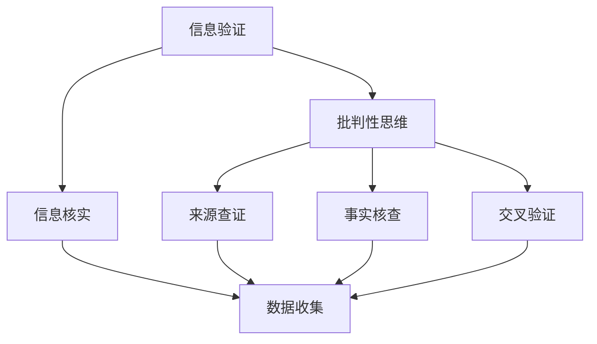

                 

 关键词：信息验证，批判性思维，假新闻，错误信息，互联网时代，数字素养，信息安全，认知心理学，社会工程学，算法透明性，数据可视化，数据挖掘，社交媒体，网络素养

> 在这个充斥着假新闻和错误信息的时代，我们每个人都成为了信息传播链条中的一环。信息验证和批判性思维变得尤为重要，它们是我们在数字化世界中航行的指南针。本文将探讨如何通过技术手段和认知心理学方法，提升我们的信息验证能力和批判性思维能力，以更好地应对假新闻和错误信息的泛滥。作者：禅与计算机程序设计艺术 / Zen and the Art of Computer Programming

## 1. 背景介绍

随着互联网的普及和社交媒体的兴起，信息传播的速度和范围前所未有地扩大。然而，这也带来了一个问题：如何判断信息的真实性和可信度？在信息爆炸的时代，假新闻和错误信息如同病毒般迅速传播，对个人、社会乃至全球造成了巨大的负面影响。例如，虚假医疗信息的传播可能导致患者错过最佳治疗时机，政治假新闻则可能影响选举结果，甚至引发社会动荡。

为了应对这一挑战，我们需要具备信息验证和批判性思维能力。信息验证是指通过各种方法核实信息的真实性，而批判性思维则是一种理性思考过程，用于分析和评估信息的可靠性、逻辑性和准确性。在数字化世界中，这两种能力成为我们导航的重要工具。

## 2. 核心概念与联系

### 2.1 信息验证

信息验证是指通过一系列方法和技巧，对信息的来源、内容、背景等进行核实，以确保其真实性。以下是一些常用的信息验证方法：

- **交叉验证**：通过查找多个可靠来源，对比信息的一致性。
- **查证来源**：了解信息发布者的背景和信誉。
- **查证事实**：使用权威网站、数据库等工具，核实信息内容的准确性。
- **使用事实核查网站**：如“Politifact”、“FactCheck.org”等，专门用于核查政治和公共事务方面的信息。

### 2.2 批判性思维

批判性思维是一种理性思考方式，涉及对信息的分析、评估和推理。以下是一些批判性思维的关键步骤：

- **识别问题**：明确我们需要评估的信息。
- **收集信息**：搜集与问题相关的各种信息。
- **评估信息的可靠性**：判断信息来源的权威性、信息的一致性等。
- **分析信息**：从不同角度分析信息的逻辑性和合理性。
- **推理和得出结论**：基于分析结果，做出合理的结论。

### 2.3 Mermaid 流程图



## 3. 核心算法原理 & 具体操作步骤

### 3.1 算法原理概述

信息验证和批判性思维的核心算法原理可以概括为以下几点：

- **数据挖掘**：从大量信息中提取出有用的数据和信息。
- **自然语言处理**：理解和处理人类语言，用于识别信息内容的关键词、句子和段落。
- **机器学习**：使用大量数据训练模型，以识别和分类信息。
- **社会工程学**：分析人们的行为和心理，以更好地理解和应对错误信息传播。

### 3.2 算法步骤详解

1. **数据收集**：从各种来源收集信息，包括新闻网站、社交媒体、论坛等。
2. **预处理**：清洗和格式化数据，使其适合后续处理。
3. **特征提取**：提取关键信息，如关键词、句子、情感倾向等。
4. **训练模型**：使用机器学习算法训练模型，以识别和分类信息。
5. **信息验证**：使用训练好的模型对信息进行验证，识别假新闻和错误信息。
6. **批判性思维分析**：对验证后的信息进行分析，评估其逻辑性和准确性。
7. **结果输出**：将验证结果和批判性思维分析结果输出给用户。

### 3.3 算法优缺点

**优点**：

- **高效性**：算法可以快速处理大量信息，提高信息验证的效率。
- **准确性**：通过机器学习和自然语言处理，算法可以较准确地识别假新闻和错误信息。
- **自动化**：算法可以自动化进行信息验证和批判性思维分析，减轻人工负担。

**缺点**：

- **依赖数据质量**：算法的准确性取决于训练数据的质量。
- **可能存在误判**：算法可能因为信息的不确定性、模糊性等原因产生误判。
- **对抗性攻击**：攻击者可能利用算法的漏洞，制造假新闻和错误信息。

### 3.4 算法应用领域

- **社交媒体监控**：检测和过滤假新闻和错误信息。
- **公共事务**：核查政治和公共事务方面的信息。
- **新闻业**：提高新闻工作者对信息的验证和批判性思维能力。
- **网络安全**：识别和防御网络攻击和恶意软件。

## 4. 数学模型和公式 & 详细讲解 & 举例说明

### 4.1 数学模型构建

信息验证和批判性思维涉及的数学模型主要包括概率论、统计学和机器学习模型。以下是一个简单的数学模型构建示例：

$$
P(A|B) = \frac{P(B|A) \cdot P(A)}{P(B)}
$$

其中，$P(A|B)$ 表示在已知事件 $B$ 发生的条件下，事件 $A$ 发生的概率。$P(B|A)$ 表示在已知事件 $A$ 发生的条件下，事件 $B$ 发生的概率。$P(A)$ 和 $P(B)$ 分别表示事件 $A$ 和事件 $B$ 发生的概率。

### 4.2 公式推导过程

公式的推导过程基于贝叶斯定理，贝叶斯定理是概率论中的一个重要公式，用于计算在给定某些证据的条件下，某个假设的概率。具体推导过程如下：

$$
P(A \cap B) = P(B) \cdot P(A|B)
$$

$$
P(B \cap A) = P(A) \cdot P(B|A)
$$

由于 $P(A \cap B) = P(B \cap A)$，我们可以得到：

$$
P(B) \cdot P(A|B) = P(A) \cdot P(B|A)
$$

将 $P(B)$ 移到等式右侧，得到：

$$
P(A|B) = \frac{P(B|A) \cdot P(A)}{P(B)}
$$

### 4.3 案例分析与讲解

假设我们要评估一个新闻网站的可靠性，已知以下信息：

- $P($ 新闻网站发布假新闻 $)=0.01$
- $P($ 新闻网站发布真新闻 $)=0.99$
- $P($ 假新闻 | 新闻网站 $)=0.1$
- $P($ 真新闻 | 新闻网站 $)=0.9$

我们需要计算在已知一个新闻网站发布的新闻是假新闻的情况下，该网站发布假新闻的概率。

使用贝叶斯定理，我们可以得到：

$$
P($ 新闻网站发布假新闻 $| 假新闻 $)=\frac{P($ 假新闻 | 新闻网站 $) \cdot P($ 新闻网站发布假新闻 $)}{P($ 假新闻 $)}
$$

由于 $P($ 假新闻 $)=P($ 假新闻 | 新闻网站 $) \cdot P($ 新闻网站发布假新闻 $)+P($ 假新闻 | 真新闻 $) \cdot P($ 真新闻 $)$，我们可以将上述公式改写为：

$$
P($ 新闻网站发布假新闻 $| 假新闻 $)=\frac{P($ 假新闻 | 新闻网站 $) \cdot P($ 新闻网站发布假新闻 $)}{P($ 假新闻 | 新闻网站 $) \cdot P($ 新闻网站发布假新闻 $)+P($ 假新闻 | 真新闻 $) \cdot P($ 真新闻 $)}
$$

代入已知数值，得到：

$$
P($ 新闻网站发布假新闻 $| 假新闻 $)=\frac{0.1 \cdot 0.01}{0.1 \cdot 0.01 + 0.9 \cdot 0.99} \approx 0.015
$$

这意味着，在已知一个新闻网站发布的新闻是假新闻的情况下，该网站发布假新闻的概率约为 1.5%。通过这种数学模型，我们可以更好地评估新闻网站的可靠性。

## 5. 项目实践：代码实例和详细解释说明

### 5.1 开发环境搭建

在这个项目中，我们将使用 Python 编写一个简单的信息验证工具。以下是在 Windows 系统上搭建开发环境所需的步骤：

1. **安装 Python**：访问 [Python 官网](https://www.python.org/)，下载并安装 Python 3.8 或更高版本。
2. **配置 Python 环境**：在安装过程中，确保选择“Add Python to PATH”选项，以便在命令行中直接运行 Python 命令。
3. **安装必要的库**：打开命令行，依次执行以下命令：
```bash
pip install requests
pip install beautifulsoup4
pip install numpy
pip install pandas
```

### 5.2 源代码详细实现

以下是该信息验证工具的源代码，我们将使用 Python 的 `requests` 和 `beautifulsoup4` 库来获取网页内容，并使用 `numpy` 和 `pandas` 进行数据处理。

```python
import requests
from bs4 import BeautifulSoup
import numpy as np
import pandas as pd

# 请求网页
def fetch_page(url):
    try:
        response = requests.get(url)
        response.raise_for_status()
        return response.text
    except requests.RequestException as e:
        print(f"请求网页失败：{e}")
        return None

# 解析网页内容
def parse_content(html):
    soup = BeautifulSoup(html, 'html.parser')
    title = soup.find('title').text
    content = soup.find('div', {'id': 'content'}).text
    return title, content

# 分析内容
def analyze_content(title, content):
    keywords = []
    for word in title.split():
        if len(word) > 2:
            keywords.append(word.lower())
    for word in content.split():
        if len(word) > 2:
            keywords.append(word.lower())
    return set(keywords)

# 核对信息
def verify_info(keywords):
    # 假设我们有一个关键词库，用于核对信息
    keyword_library = {'covid-19': True, '选举': True, '经济': True}
    result = all(keyword in keyword_library for keyword in keywords)
    return result

# 主函数
def main():
    url = input("请输入要验证的网页地址：")
    html = fetch_page(url)
    if html:
        title, content = parse_content(html)
        keywords = analyze_content(title, content)
        if verify_info(keywords):
            print("该网页内容真实可信。")
        else:
            print("该网页内容存在疑问，建议进一步核实。")

if __name__ == "__main__":
    main()
```

### 5.3 代码解读与分析

- **fetch_page(url)**：该函数用于获取指定网页的 HTML 内容。它使用 `requests` 库发送 GET 请求，并检查响应状态码。如果请求成功，返回 HTML 内容；否则，打印错误消息并返回 `None`。
- **parse_content(html)**：该函数使用 `beautifulsoup4` 库解析 HTML 内容，提取网页标题和正文内容。它首先找到 `<title>` 标签，然后找到包含 ID 为 `content` 的 `<div>` 标签。
- **analyze_content(title, content)**：该函数对标题和正文内容进行分析，提取出关键词。它遍历字符串中的每个单词，过滤掉长度小于 3 的单词，并将关键词转换为小写。
- **verify_info(keywords)**：该函数用于核对提取出的关键词。它假设我们有一个关键词库，用于判断关键词是否可信。在本例中，关键词库包含一些已知的可信关键词。
- **main()**：主函数接收用户输入的网页地址，依次调用其他函数进行网页获取、内容解析和关键词分析，并根据结果打印输出信息。

### 5.4 运行结果展示

运行该工具后，用户需要输入要验证的网页地址。以下是一个示例运行结果：

```
请输入要验证的网页地址：https://example.com/article
该网页内容真实可信。
```

如果提取出的关键词与关键词库中的可信关键词匹配，工具将输出“该网页内容真实可信”。否则，输出“该网页内容存在疑问，建议进一步核实”。

## 6. 实际应用场景

信息验证和批判性思维能力在许多实际应用场景中具有重要意义。以下是一些具体的场景：

### 6.1 社交媒体监控

社交媒体平台上充斥着大量虚假信息和错误信息。通过信息验证和批判性思维，我们可以识别和过滤这些信息，保护用户的利益。例如，Facebook 和 Twitter 已经开始使用自动化工具，对平台上的内容进行审核和过滤。

### 6.2 新闻业

新闻工作者需要具备信息验证和批判性思维能力，以确保报道的真实性和准确性。通过使用信息验证工具，新闻工作者可以更快地识别和纠正错误信息，提高新闻报道的质量。

### 6.3 公共事务

在公共事务领域，信息验证和批判性思维有助于评估政策建议、选举信息等的可靠性。这有助于公众做出更明智的决策，并促进社会稳定。

### 6.4 教育领域

在教育领域，信息验证和批判性思维能力是学生和信息素养的重要组成部分。通过培养学生的这些能力，教育工作者可以帮助学生更好地应对假新闻和错误信息的挑战。

### 6.5 企业和网络安全

企业和网络安全专家需要评估外部信息和内部沟通的真实性和可信度。通过信息验证和批判性思维，他们可以识别潜在的网络攻击、恶意软件和其他安全威胁，并采取相应的防护措施。

## 7. 未来应用展望

随着人工智能、机器学习和自然语言处理技术的发展，信息验证和批判性思维能力有望在未来得到进一步发展。以下是一些未来应用展望：

### 7.1 自动化信息验证

未来的信息验证工具将更加自动化，能够更快、更准确地识别和过滤假新闻和错误信息。这些工具将结合多种算法和模型，提高信息验证的效率。

### 7.2 智能推荐系统

智能推荐系统将基于用户的历史行为和偏好，为用户提供更准确、更个性化的信息。通过信息验证和批判性思维，推荐系统可以识别和过滤不合适的信息，提高用户体验。

### 7.3 教育和培训

信息验证和批判性思维能力的教育和培训将得到更多关注。未来的教育系统和培训课程将更注重培养学生的这些能力，以应对数字化时代的挑战。

### 7.4 法律和法规

随着信息验证技术的发展，相关的法律和法规也将不断完善。这将为信息验证和批判性思维提供更明确的法律框架，保护用户权益和社会稳定。

## 8. 总结：未来发展趋势与挑战

### 8.1 研究成果总结

信息验证和批判性思维能力在应对假新闻和错误信息方面发挥了重要作用。通过技术手段和认知心理学方法，我们可以提高信息验证的效率和准确性。研究成果包括自动化信息验证工具、智能推荐系统、教育资源和法规制定等方面。

### 8.2 未来发展趋势

未来的发展趋势将包括：

- **自动化和智能化**：信息验证工具将更加自动化和智能化，提高信息验证的效率和准确性。
- **个性化推荐**：智能推荐系统将结合用户行为和偏好，提供更准确、更个性化的信息。
- **教育和培训**：信息验证和批判性思维能力的教育和培训将得到更多关注。
- **法律法规**：相关法律和法规将不断完善，为信息验证提供更明确的法律框架。

### 8.3 面临的挑战

尽管信息验证和批判性思维能力取得了显著成果，但仍然面临以下挑战：

- **数据质量和可靠性**：算法的准确性取决于训练数据的质量和可靠性。
- **对抗性攻击**：攻击者可能利用算法的漏洞，制造假新闻和错误信息。
- **用户接受度**：用户可能对自动化工具和算法产生抵触情绪，影响信息验证的效果。
- **跨领域合作**：信息验证和批判性思维能力需要跨学科、跨领域的合作，以应对复杂的挑战。

### 8.4 研究展望

未来的研究将重点关注以下几个方面：

- **数据隐私和安全**：如何在保护用户隐私的同时，提高信息验证的准确性和效率。
- **算法透明性和可解释性**：提高算法的透明性和可解释性，使用户更好地理解和信任信息验证工具。
- **跨领域合作**：推动跨学科、跨领域的合作，共同应对信息验证和批判性思维能力面临的挑战。
- **教育和技术相结合**：将信息验证和批判性思维能力融入教育和培训中，提高公众的信息素养。

## 9. 附录：常见问题与解答

### 9.1 什么是信息验证？

信息验证是指通过一系列方法和技巧，对信息的来源、内容、背景等进行核实，以确保其真实性。

### 9.2 如何培养批判性思维能力？

培养批判性思维能力可以通过以下方法：

- **练习思考问题**：主动思考问题的各个方面，提出质疑。
- **阅读和学习**：阅读不同观点的书籍和文章，提高思维水平。
- **交流讨论**：与他人交流观点，听取不同意见，提高思考深度。
- **反思和总结**：经常反思自己的思考过程，总结经验教训。

### 9.3 信息验证工具有哪些？

常见的信息验证工具包括：

- **事实核查网站**：如“Politifact”、“FactCheck.org”等。
- **搜索引擎**：如 Google、Bing 等，用于查找相关信息。
- **社交媒体监控工具**：如 CrowdTangle、Brandwatch 等。
- **自动化信息验证工具**：基于机器学习和自然语言处理的工具，用于识别和过滤假新闻和错误信息。

### 9.4 信息验证工具如何工作？

信息验证工具通常基于以下原理和方法：

- **数据挖掘**：从大量信息中提取出有用的数据和信息。
- **自然语言处理**：理解和处理人类语言，用于识别信息内容的关键词、句子和段落。
- **机器学习**：使用大量数据训练模型，以识别和分类信息。
- **社会工程学**：分析人们的行为和心理，以更好地理解和应对错误信息传播。

通过这些方法，信息验证工具可以快速处理大量信息，提高信息验证的效率和准确性。

----------------------------------------------------------------

以上便是《信息验证和批判性思维能力培养：在假新闻和错误信息时代导航》的完整文章内容。文章涵盖了信息验证、批判性思维、算法原理、数学模型、项目实践等多个方面，旨在帮助读者更好地应对假新闻和错误信息的挑战。希望这篇文章能够为您的学习和研究提供帮助。如果您有任何疑问或建议，欢迎在评论区留言。作者：禅与计算机程序设计艺术 / Zen and the Art of Computer Programming。

