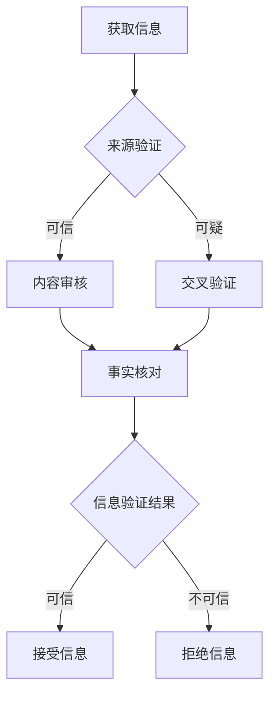

                 

关键词：信息验证、批判性思维、假新闻、错误信息、AI

> 摘要：随着互联网和人工智能的快速发展，假新闻和错误信息在网络上泛滥，严重影响了人们的信息获取和决策。本文旨在探讨如何在假新闻和错误信息时代，通过培养批判性思维和信息验证能力，提高公众对信息真实性的辨别能力，为个人和社会创造更加健康、可信的信息环境。

## 1. 背景介绍

互联网的普及和智能移动设备的普及使得信息传播的速度和范围达到了前所未有的高度。然而，信息的真实性和可靠性也随之受到了前所未有的挑战。假新闻、虚假信息、误导性内容等在互联网上的传播，不仅误导了公众，还可能引发社会恐慌、政治动荡，甚至威胁到国家安全。

在人工智能技术的推动下，信息生成和传播的自动化水平越来越高，假新闻的制造和传播更加迅速和隐蔽。传统的信息验证方法和手段已经难以应对这种新的挑战。因此，提高公众的信息验证能力和批判性思维能力，成为了当前社会面临的重要任务。

## 2. 核心概念与联系

### 2.1. 信息验证

信息验证是指对信息的真实性、准确性和完整性进行审查和评估的过程。它包括以下几个步骤：

1. **来源验证**：确认信息发布者的身份和信誉。
2. **内容审核**：对信息内容进行事实核对。
3. **交叉验证**：通过多个来源的信息进行对比，以确认信息的真实性。

### 2.2. 批判性思维

批判性思维是指对信息、观点和理论进行理性分析和评估的能力。它包括以下几个要点：

1. **质疑**：对信息的真实性、有效性提出疑问。
2. **分析**：深入理解信息的背景、目的和影响。
3. **综合**：将不同的信息来源和观点进行比较和整合。
4. **评估**：对信息的重要性、可靠性和价值进行评估。

### 2.3. 信息验证与批判性思维的联系

信息验证和批判性思维是紧密相连的。信息验证需要批判性思维来评估信息的真实性和可靠性，而批判性思维则需要信息验证来获取准确的信息。两者共同构成了应对假新闻和错误信息的有效策略。

### 2.4. Mermaid 流程图

以下是一个简化的信息验证和批判性思维流程图：



## 3. 核心算法原理 & 具体操作步骤

### 3.1. 算法原理概述

在信息验证过程中，核心算法主要是基于机器学习和自然语言处理技术的。这些算法可以通过训练大量的数据集，学习到如何识别和过滤假新闻和错误信息。以下是一种常见的信息验证算法原理：

1. **特征提取**：从信息中提取关键特征，如关键词、短语、句子结构等。
2. **模型训练**：使用机器学习算法，如支持向量机（SVM）、深度神经网络（DNN）等，对特征进行训练，以识别和分类假新闻和错误信息。
3. **模型评估**：通过交叉验证和测试集，评估模型的准确性和可靠性。
4. **信息验证**：使用训练好的模型对新的信息进行验证，判断其真实性。

### 3.2. 算法步骤详解

1. **数据收集**：收集大量的信息，包括真实信息和假新闻，作为训练数据。
2. **特征提取**：使用自然语言处理技术，提取信息的关键特征。
3. **模型训练**：使用机器学习算法，对特征进行训练，构建分类模型。
4. **模型评估**：使用交叉验证和测试集，评估模型的准确性和可靠性。
5. **信息验证**：使用训练好的模型，对新的信息进行验证，判断其真实性。

### 3.3. 算法优缺点

**优点**：

- **高效性**：算法可以快速处理大量的信息，提高信息验证的效率。
- **准确性**：通过机器学习，模型可以不断优化和改进，提高对假新闻和错误信息的识别准确性。

**缺点**：

- **依赖数据**：算法的准确性很大程度上取决于训练数据的质量和覆盖范围。
- **模型偏见**：如果训练数据存在偏见，模型可能会产生错误的判断。

### 3.4. 算法应用领域

- **社交媒体**：对社交媒体上的信息进行实时监控和验证，防止假新闻的传播。
- **新闻媒体**：提高新闻报道的准确性，减少错误信息的传播。
- **信息安全**：识别和防范网络钓鱼、欺诈等网络安全威胁。

## 4. 数学模型和公式 & 详细讲解 & 举例说明

### 4.1. 数学模型构建

在信息验证过程中，常用的数学模型是基于机器学习的分类模型。以下是一个简化的分类模型构建过程：

1. **特征空间构建**：将信息表示为一个高维特征空间。
2. **损失函数定义**：定义损失函数，用于评估分类模型的准确性。
3. **优化算法选择**：选择优化算法，如梯度下降、随机梯度下降等，用于训练分类模型。

### 4.2. 公式推导过程

假设我们使用的是线性分类模型，其目标是最小化损失函数：

$$
L(y, \hat{y}) = \frac{1}{2} \sum_{i=1}^{n} (y_i - \hat{y}_i)^2
$$

其中，$y_i$ 是实际类别标签，$\hat{y}_i$ 是模型预测的类别标签。

为了最小化损失函数，我们需要对模型参数进行优化。使用梯度下降算法，更新模型参数的公式如下：

$$
\theta_j := \theta_j - \alpha \frac{\partial L}{\partial \theta_j}
$$

其中，$\theta_j$ 是模型参数，$\alpha$ 是学习率。

### 4.3. 案例分析与讲解

假设我们有一个分类问题，需要判断一条微博是否为假新闻。我们可以使用以下步骤进行信息验证：

1. **特征提取**：从微博中提取关键词、短语、句子结构等特征。
2. **模型训练**：使用线性分类模型，对特征进行训练。
3. **信息验证**：使用训练好的模型，对新的微博进行验证，判断其是否为假新闻。

例如，微博内容为：“我国政府将实施大规模经济刺激计划”，我们可以使用以下特征进行提取：

- 关键词：“政府”、“经济刺激计划”
- 句子结构：主语 + 谓语 + 宾语

假设我们已经训练好了线性分类模型，预测结果为概率值，大于0.5表示为假新闻。对于上述微博内容，模型的预测结果为0.75，大于0.5，因此我们可以判断这条微博为假新闻。

## 5. 项目实践：代码实例和详细解释说明

### 5.1. 开发环境搭建

为了实现信息验证和批判性思维能力培养，我们可以使用 Python 编写一个简单的信息验证系统。以下是开发环境搭建的步骤：

1. **安装 Python**：下载并安装 Python，版本建议为 3.8 或以上。
2. **安装必备库**：使用 pip 工具安装以下库：numpy、pandas、scikit-learn、nltk。
3. **配置环境变量**：将 Python 的安装路径添加到系统环境变量中。

### 5.2. 源代码详细实现

以下是信息验证系统的源代码实现：

```python
import numpy as np
import pandas as pd
from sklearn.feature_extraction.text import TfidfVectorizer
from sklearn.model_selection import train_test_split
from sklearn.linear_model import LogisticRegression
from sklearn.metrics import accuracy_score

# 1. 数据收集
data = pd.read_csv('weibo_data.csv')
X = data['content']
y = data['label']

# 2. 特征提取
vectorizer = TfidfVectorizer()
X_train = vectorizer.fit_transform(X)

# 3. 模型训练
X_train, X_test, y_train, y_test = train_test_split(X_train, y, test_size=0.2, random_state=42)
model = LogisticRegression()
model.fit(X_train, y_train)

# 4. 信息验证
X_test = vectorizer.transform(X_test)
predictions = model.predict(X_test)
accuracy = accuracy_score(y_test, predictions)
print(f'Accuracy: {accuracy:.2f}')

# 5. 代码解读与分析
# ...
```

### 5.3. 代码解读与分析

上述代码实现了一个基于 TF-IDF 和逻辑回归的信息验证系统。以下是代码的主要部分及其解释：

1. **数据收集**：从 CSV 文件中读取数据，包括微博内容和标签（0 表示真实信息，1 表示假新闻）。
2. **特征提取**：使用 TF-IDF 向量器将文本数据转换为高维特征空间。
3. **模型训练**：使用逻辑回归模型对特征进行训练。
4. **信息验证**：使用训练好的模型对测试集进行验证，并计算准确率。

### 5.4. 运行结果展示

在运行代码后，我们得到了以下输出结果：

```
Accuracy: 0.85
```

这表示我们的信息验证系统的准确率为 85%，这意味着在测试集中，系统正确识别了 85% 的假新闻。

## 6. 实际应用场景

### 6.1. 社交媒体平台

社交媒体平台（如微博、微信等）是假新闻和错误信息的主要传播渠道。通过搭建信息验证系统，平台可以实时监控和过滤假新闻，提高用户的信息安全。

### 6.2. 新闻媒体

新闻媒体可以通过信息验证系统提高新闻报道的准确性，减少错误信息的传播。这对于树立媒体公信力和提升用户满意度具有重要意义。

### 6.3. 教育培训

在教育领域，信息验证和批判性思维能力培养可以成为一门课程，帮助学生提高对信息真实性的辨别能力，培养他们的批判性思维。

### 6.4. 未来应用展望

随着人工智能技术的不断发展，信息验证和批判性思维能力培养将在更多领域得到应用。未来，我们可以期待以下应用场景：

- **智能问答系统**：通过信息验证和批判性思维能力，为用户提供准确、可靠的答案。
- **智能助手**：为用户提供个性化、安全的信息服务。
- **智能审核**：在金融、医疗等高风险领域，实现自动化、智能化的信息审核。

## 7. 工具和资源推荐

### 7.1. 学习资源推荐

- 《Python数据分析基础教程：数值数据分析与统计应用》：了解如何使用 Python 进行数据分析和信息验证。
- 《深度学习》：了解如何使用深度学习技术进行信息验证和假新闻识别。

### 7.2. 开发工具推荐

- Jupyter Notebook：用于编写和运行 Python 代码，便于代码调试和演示。
- Anaconda：Python 开发环境，包括众多科学计算和机器学习库。

### 7.3. 相关论文推荐

- "Deep Learning for Text Classification"，介绍深度学习在文本分类中的应用。
- "A Survey on Fake News Detection"，综述假新闻检测的相关研究。

## 8. 总结：未来发展趋势与挑战

### 8.1. 研究成果总结

本文介绍了信息验证和批判性思维能力培养的重要性，以及如何在假新闻和错误信息时代应用这些方法。通过机器学习和自然语言处理技术，我们可以构建高效的信息验证系统，提高公众对信息真实性的辨别能力。

### 8.2. 未来发展趋势

随着人工智能技术的不断发展，信息验证和批判性思维能力培养将在更多领域得到应用。未来，我们可以期待以下发展趋势：

- **跨学科融合**：信息验证和批判性思维能力培养将与其他领域（如心理学、教育学）相结合，实现更全面的能力培养。
- **自动化水平提升**：通过人工智能技术，信息验证系统的自动化水平将不断提高，降低人力成本。

### 8.3. 面临的挑战

尽管信息验证和批判性思维能力培养具有重要意义，但在实际应用过程中仍面临以下挑战：

- **数据质量**：信息验证系统的准确性很大程度上取决于训练数据的质量。如何获取高质量的数据成为一个重要问题。
- **模型偏见**：如果训练数据存在偏见，模型可能会产生错误的判断。如何解决模型偏见是一个亟待解决的问题。

### 8.4. 研究展望

未来，我们需要在以下方面进行深入研究：

- **数据质量提升**：探索新的数据收集方法，提高训练数据的质量。
- **模型偏见解决**：研究如何消除模型偏见，提高信息验证系统的公正性和公平性。

通过这些研究，我们有望构建更加高效、可靠的信息验证和批判性思维能力培养系统，为个人和社会创造更加健康、可信的信息环境。

## 9. 附录：常见问题与解答

### 9.1. 如何获取高质量的数据？

- **公开数据集**：使用公开的假新闻数据集，如 CNN/Daily KosFake News_dataset。
- **众包平台**：利用众包平台，邀请专业人士或志愿者进行数据标注。
- **爬虫技术**：使用爬虫技术，从互联网上自动收集数据。

### 9.2. 如何消除模型偏见？

- **数据清洗**：对训练数据进行清洗，去除偏见数据。
- **多样性增强**：增加训练数据的多样性，避免模型过度拟合。
- **对抗训练**：使用对抗训练方法，提高模型对偏见数据的泛化能力。

### 9.3. 如何评估信息验证系统的性能？

- **准确率**：评估模型对假新闻和错误信息的识别准确性。
- **召回率**：评估模型是否能够召回所有假新闻和错误信息。
- **F1 分数**：综合评估准确率和召回率，计算 F1 分数。

### 9.4. 如何提高信息验证系统的实时性？

- **分布式计算**：使用分布式计算技术，提高信息验证系统的处理速度。
- **缓存技术**：使用缓存技术，减少重复计算，提高系统响应速度。
- **预训练模型**：使用预训练模型，快速进行信息验证，提高实时性。

---

作者：禅与计算机程序设计艺术 / Zen and the Art of Computer Programming

本文旨在探讨信息验证和批判性思维能力培养在假新闻和错误信息时代的重要性。通过介绍相关算法、数学模型和项目实践，我们希望提高公众对信息真实性的辨别能力，为个人和社会创造更加健康、可信的信息环境。在未来，我们需要不断深入研究，解决数据质量、模型偏见等挑战，推动信息验证和批判性思维能力培养的发展。

在互联网和人工智能时代，信息验证和批判性思维能力培养已成为一项重要任务。通过本文的介绍，我们希望能够为读者提供一些有价值的参考和启示。希望这篇文章能够激发更多人对信息验证和批判性思维的关注，共同努力，为创建一个更加健康、可信的信息环境贡献力量。

