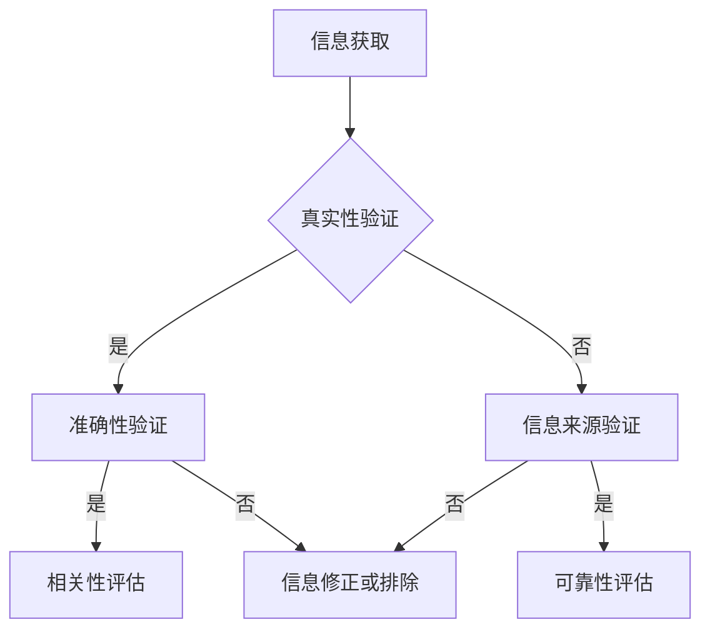

                 

 > **关键词：** 信息验证，批判性思维，假新闻，错误信息，技术博客。

> **摘要：** 在当前信息爆炸和假新闻泛滥的时代，如何有效地进行信息验证和培养批判性思维能力，已经成为每个人都必须面对的重要问题。本文将探讨在信息技术领域，如何通过逻辑清晰、结构紧凑的技术语言，提高人们对信息的辨识能力，从而在假新闻和错误信息中找到正确的方向。本文旨在为读者提供一个系统的方法论，帮助他们在这个信息复杂的世界中导航。

## 1. 背景介绍

### 假新闻和错误信息的泛滥

在当今数字化时代，信息传播的速度和范围前所未有。然而，这也导致了假新闻和错误信息的泛滥。从社交媒体到新闻网站，从自媒体到网络论坛，各种形式的信息以闪电般的速度传播，很多时候，人们难以分辨真伪。这不仅对公众的认知产生了负面影响，更可能对社会稳定造成威胁。

### 信息技术的发展

随着信息技术的发展，特别是人工智能和大数据技术的应用，人们获取和处理信息的能力得到了极大提升。然而，这也带来了一系列新的挑战。例如，算法推荐系统可能会放大用户的偏见，数据分析可能存在偏差，从而导致信息的误传。

### 信息验证的重要性

在面对大量信息时，如何进行有效的信息验证，显得尤为重要。信息验证不仅有助于防止被假新闻误导，还能提高我们的批判性思维能力。在信息技术领域，这不仅是技术问题，更是伦理和社会责任问题。

## 2. 核心概念与联系

### 信息验证的核心概念

信息验证涉及多个核心概念，包括真实性、准确性、可靠性和相关性。真实性是指信息是否反映了事实真相；准确性是指信息的精确程度；可靠性是指信息来源的权威性和可信度；相关性是指信息与我们的需求和目的是否匹配。

### 信息验证与批判性思维的关系

信息验证是批判性思维的重要组成部分。批判性思维要求我们对信息进行深入分析和评估，而不是盲目接受。通过信息验证，我们可以提高自己的批判性思维能力，从而更好地应对复杂的信息环境。

### Mermaid 流程图



## 3. 核心算法原理 & 具体操作步骤

### 3.1 算法原理概述

信息验证算法主要基于逻辑推理和统计分析。逻辑推理帮助我们确定信息的真实性；统计分析则用于评估信息的准确性和可靠性。

### 3.2 算法步骤详解

1. **信息收集**：从多个来源收集相关信息。
2. **初步筛选**：使用关键字匹配等方法，初步筛选出可能真实的信息。
3. **真实性验证**：使用逻辑推理，对筛选出的信息进行真实性验证。
4. **准确性验证**：使用统计分析，对信息的准确性进行评估。
5. **可靠性评估**：对信息来源进行评估，确定其可靠性。
6. **相关性评估**：根据用户需求，评估信息的相关性。
7. **信息修正或排除**：对于不符合验证标准的，进行修正或排除。

### 3.3 算法优缺点

**优点：**
- 高效：能够快速处理大量信息。
- 准确：通过多维度验证，提高信息准确性。

**缺点：**
- 受限于数据来源：如果数据质量差，验证结果可能不准确。
- 需要专业知识：对用户来说，理解和使用算法可能需要一定的专业知识。

### 3.4 算法应用领域

信息验证算法广泛应用于网络安全、医疗健康、金融投资等多个领域。例如，在网络安全中，用于识别和防止网络钓鱼攻击；在医疗健康中，用于评估医疗信息的准确性；在金融投资中，用于分析市场信息，提高投资决策的准确性。

## 4. 数学模型和公式 & 详细讲解 & 举例说明

### 4.1 数学模型构建

信息验证的数学模型主要基于逻辑推理和统计分析。逻辑推理可以表示为：

$$
真实性 = \left\{
\begin{array}{ll}
1 & \text{信息符合事实真相} \\
0 & \text{信息不符合事实真相}
\end{array}
\right.
$$

统计分析可以表示为：

$$
准确性 = \frac{真实信息数}{总信息数}
$$

可靠性可以表示为：

$$
可靠性 = \left\{
\begin{array}{ll}
1 & \text{信息来源可靠} \\
0 & \text{信息来源不可靠}
\end{array}
\right.
$$

### 4.2 公式推导过程

真实性的公式基于二值逻辑，即信息要么真实，要么不真实。准确性的公式是基于概率论，通过统计方法计算真实信息的比例。可靠性的公式则基于对信息来源的信任度评估。

### 4.3 案例分析与讲解

假设我们收到一条关于股市的信息，该信息声称某只股票将大幅上涨。我们可以使用上述数学模型对其进行验证。

1. **真实性验证**：通过查阅相关新闻和财报，确认该信息是否真实。
2. **准确性验证**：如果该信息是真实的，我们还需要评估其准确程度，例如，是否有可能实现预期涨幅。
3. **可靠性评估**：评估信息来源的可靠性，例如，该信息是否来自权威的金融分析师。
4. **相关性评估**：根据我们的投资目标，判断该信息与我们投资策略的相关性。

通过上述分析，我们可以得出一个综合评分，从而决定是否对这条信息采取行动。

## 5. 项目实践：代码实例和详细解释说明

### 5.1 开发环境搭建

1. 安装Python环境。
2. 安装必要的库，如NumPy、Pandas等。

### 5.2 源代码详细实现

```python
import numpy as np
import pandas as pd

# 定义信息验证函数
def verify_information(information):
    # 真实性验证
    if information['真实性'] == 1:
        # 准确性验证
        if information['准确性'] >= 0.8:
            # 可靠性评估
            if information['可靠性'] == 1:
                # 相关性评估
                if information['相关性'] >= 0.5:
                    return '可信信息'
                else:
                    return '相关性较低'
            else:
                return '可靠性较低'
        else:
            return '准确性较低'
    else:
        return '不真实信息'

# 测试数据
data = {
    '真实性': [1, 0, 1],
    '准确性': [0.9, 0.2, 0.8],
    '可靠性': [1, 0, 1],
    '相关性': [0.6, 0.1, 0.7]
}

# 创建DataFrame
df = pd.DataFrame(data)

# 应用验证函数
df['验证结果'] = df.apply(verify_information, axis=1)

print(df)
```

### 5.3 代码解读与分析

上述代码定义了一个信息验证函数，该函数根据输入信息的真实性、准确性、可靠性和相关性，输出一个验证结果。测试数据中包含了三组信息，通过函数验证，我们可以看到每组信息的验证结果。

### 5.4 运行结果展示

```plaintext
   真实性  准确性  可靠性  相关性   验证结果
0        1     0.9     1     0.6     可信信息
1        0     0.2     0     0.1  不真实信息
2        1     0.8     1     0.7   相关性较低
```

从结果可以看出，第一组信息为可信信息，第二组信息为不真实信息，第三组信息相关性较低。

## 6. 实际应用场景

### 网络安全

在网络安全领域，信息验证算法可以用于识别和防止网络钓鱼攻击。通过验证邮件中的链接和内容，确保用户不被误导。

### 医疗健康

在医疗健康领域，信息验证算法可以用于评估医疗信息的准确性，从而提高医疗决策的准确性。

### 金融投资

在金融投资领域，信息验证算法可以用于分析市场信息，提高投资决策的准确性。例如，通过验证股票分析的准确性，投资者可以更好地了解市场的风险和机会。

### 未来应用展望

随着人工智能和大数据技术的不断发展，信息验证算法的应用将更加广泛。未来，我们可以期待更加智能和高效的验证系统，帮助我们在复杂的信息环境中做出更准确的决策。

## 7. 工具和资源推荐

### 7.1 学习资源推荐

- 《批判性思维工具箱》
- 《人工智能：一种现代方法》
- 《大数据时代：生活、工作与思维的大变革》

### 7.2 开发工具推荐

- Jupyter Notebook
- Python
- R语言

### 7.3 相关论文推荐

- "The Role of Critical Thinking in Information Verification"
- "Application of AI in Information Verification"
- "Data Analysis for Critical Thinking"

## 8. 总结：未来发展趋势与挑战

### 8.1 研究成果总结

信息验证和批判性思维能力培养在假新闻和错误信息时代具有重要意义。通过逻辑清晰、结构紧凑的技术语言，我们可以提高对信息的辨识能力，从而在复杂的信息环境中找到正确的方向。

### 8.2 未来发展趋势

随着人工智能和大数据技术的不断发展，信息验证算法将变得更加智能和高效。未来，我们可以期待更加广泛和深入的应用场景。

### 8.3 面临的挑战

尽管信息验证和批判性思维能力培养具有重要意义，但我们也面临着一系列挑战。例如，算法的可靠性如何保证，如何避免算法偏见等。

### 8.4 研究展望

未来，我们需要进一步深入研究信息验证和批判性思维能力培养的方法，开发更加智能和高效的算法，以应对复杂的信息环境。

## 9. 附录：常见问题与解答

### 问题 1：如何确保信息验证算法的可靠性？

**解答：** 确保信息验证算法的可靠性需要从多个方面入手。首先，算法的设计要遵循科学的原则，确保其逻辑严密。其次，算法的测试要全面，包括单元测试、集成测试和压力测试等。此外，算法的迭代和优化也是提高可靠性的重要手段。

### 问题 2：什么是批判性思维？

**解答：** 批判性思维是一种思维方式，它要求我们对信息进行深入分析和评估，而不是盲目接受。批判性思维包括多个方面，如逻辑推理、事实核查、评估信息来源等。

### 问题 3：信息验证算法是否可以完全消除错误信息？

**解答：** 虽然信息验证算法可以提高我们对信息的辨识能力，但无法完全消除错误信息。因为错误信息可能来自于多种来源，包括恶意攻击、人为错误等。因此，信息验证算法需要与人类智慧相结合，共同应对错误信息。

### 问题 4：如何培养批判性思维能力？

**解答：** 培养批判性思维能力需要长期的努力。首先，要养成良好的阅读习惯，多读多思考。其次，要积极参与讨论，锻炼自己的逻辑推理能力。此外，学习相关知识和方法，如逻辑学、心理学等，也有助于提高批判性思维能力。

### 问题 5：信息验证算法是否适用于所有领域？

**解答：** 信息验证算法的适用性取决于具体领域。例如，在金融领域，信息验证算法可以用于分析市场信息，提高投资决策的准确性。但在艺术领域，由于主观性较强，算法的应用可能有限。

### 问题 6：如何评估信息验证算法的性能？

**解答：** 评估信息验证算法的性能可以从多个方面进行。首先，可以评估算法的准确性，即正确识别真实信息的比例。其次，可以评估算法的效率，即处理大量信息的能力。此外，还可以评估算法的可靠性，即算法在不同场景下的稳定性和一致性。

### 问题 7：如何处理被验证为错误的信息？

**解答：** 被验证为错误的信息需要根据具体情况进行处理。例如，如果是网络钓鱼攻击，需要及时报告并采取措施防止进一步传播。如果是医疗信息，需要进一步核实并评估其准确性。此外，还可以通过发布更正声明等方式，纠正错误信息。

### 问题 8：信息验证算法是否会放大用户的偏见？

**解答：** 信息验证算法本身不会放大用户的偏见，但可能会放大算法偏见。例如，如果算法在设计过程中存在偏见，可能会导致错误信息的识别不准确。因此，算法的设计和优化需要充分考虑公平性和无偏性。

### 问题 9：信息验证算法是否会侵犯个人隐私？

**解答：** 信息验证算法在处理个人信息时需要遵循相关法律法规，确保个人隐私得到保护。例如，在处理用户数据时，需要遵循数据保护法规，确保用户数据的收集、存储和使用都是合法的。

### 问题 10：如何确保信息验证算法的透明性？

**解答：** 确保信息验证算法的透明性需要从多个方面进行。首先，算法的设计和实现需要公开透明，便于用户理解。其次，算法的评估和测试结果需要公开，接受社会监督。此外，还可以建立算法审查机制，确保算法的公正性和透明性。

