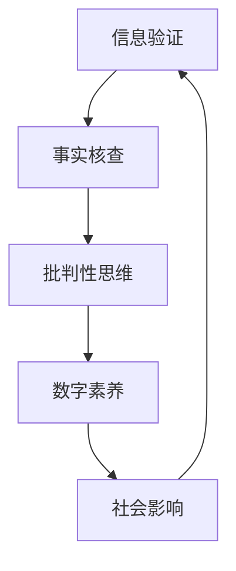

                 

关键字：信息验证、批判性思维、假新闻、媒体操纵、数字素养

摘要：随着互联网的普及，信息过载和媒体操纵问题日益严重。本文旨在探讨如何在假新闻、错误信息和媒体操纵的时代，运用信息验证和批判性思维能力，提高数字素养，为读者提供导航指南。

## 1. 背景介绍

在数字化时代，信息的传播速度和范围前所未有。然而，随之而来的是假新闻、错误信息和媒体操纵的泛滥。这些现象不仅误导了公众，还对社会稳定和民主制度构成了威胁。为了应对这些挑战，信息验证和批判性思维能力变得尤为重要。

### 假新闻和错误信息

假新闻（Fake News）通常是指那些故意编造、歪曲事实，以欺骗读者为目的的新闻内容。它们往往具有煽动性、情感性，容易引起公众的恐慌和愤怒。错误信息（Misinformation）则是指那些不准确、不完整或误导性的信息，它们可能是出于无意或恶意传播。

### 媒体操纵

媒体操纵（Media Manipulation）是指通过操纵信息、控制舆论，以达到某种特定目的的行为。这包括但不限于：虚假新闻传播、虚假账号运营、网络水军活动、政治宣传等。

## 2. 核心概念与联系

为了更好地理解信息验证和批判性思维能力的重要性，我们首先需要了解一些核心概念及其相互关系。以下是一个使用Mermaid绘制的流程图，展示了这些概念之间的关联。



### 2.1 信息验证

信息验证是指对信息的真实性、准确性和可靠性进行核查的过程。它包括以下几个步骤：

1. **来源核实**：确认信息来源的可靠性和权威性。
2. **事实核查**：对信息内容进行核实，排除虚假和错误信息。
3. **交叉验证**：通过多个来源验证信息的准确性。

### 2.2 批判性思维

批判性思维是指对信息、观点和论据进行深入分析和评估的能力。它包括以下几个步骤：

1. **问题识别**：识别潜在的问题和矛盾。
2. **证据收集**：收集支持或反驳观点的证据。
3. **逻辑推理**：使用逻辑规则进行推理和分析。
4. **评估结论**：评估论据的有效性和结论的合理性。

### 2.3 数字素养

数字素养是指个体在使用数字技术时的能力、知识和态度。它包括以下几个方面的能力：

1. **信息素养**：查找、评估和使用信息的能力。
2. **技术素养**：使用数字设备和技术工具的能力。
3. **网络安全**：保护个人数据和隐私的能力。
4. **媒体素养**：识别和理解媒体内容的能力。

### 2.4 社会影响

信息验证和批判性思维能力不仅对个人有益，还能对社会产生积极影响。通过提高公众的数字素养，我们可以减少假新闻和错误信息的传播，促进社会的稳定和健康发展。

## 3. 核心算法原理 & 具体操作步骤

### 3.1 算法原理概述

在信息验证和批判性思维中，核心算法通常涉及以下原理：

1. **数据挖掘**：通过分析大量数据，发现潜在的规律和模式。
2. **自然语言处理**：理解和处理自然语言文本，提取关键信息和语义。
3. **机器学习**：利用算法从数据中学习，进行预测和分类。
4. **网络分析**：研究信息在网络中的传播路径和模式。

### 3.2 算法步骤详解

#### 3.2.1 数据收集

1. **收集信息**：从多个来源收集相关数据，如新闻报道、社交媒体帖子、学术论文等。
2. **数据清洗**：去除重复、错误或不完整的数据。

#### 3.2.2 数据预处理

1. **文本分词**：将文本分割成单词或句子。
2. **词性标注**：标记每个单词的词性，如名词、动词等。
3. **去除停用词**：去除对信息验证无意义的单词，如“的”、“了”等。

#### 3.2.3 特征提取

1. **词频统计**：计算每个单词在文本中出现的次数。
2. **TF-IDF**：计算单词在文档集合中的重要性。
3. **主题建模**：如LDA（Latent Dirichlet Allocation），发现文本中的潜在主题。

#### 3.2.4 模型训练

1. **选择模型**：如朴素贝叶斯、支持向量机、深度学习等。
2. **训练模型**：使用标记好的数据进行训练。
3. **模型评估**：使用测试数据评估模型的准确性。

#### 3.2.5 应用算法

1. **验证信息**：使用模型对未知信息进行验证。
2. **批判性分析**：结合其他方法和知识，对信息进行深入分析。

### 3.3 算法优缺点

#### 3.3.1 优点

- **高效性**：算法能够处理大量数据，提高信息验证的速度。
- **准确性**：通过机器学习和自然语言处理，算法能够提高信息验证的准确性。
- **可扩展性**：算法可以应用于不同领域和任务，具有较好的可扩展性。

#### 3.3.2 缺点

- **数据依赖性**：算法的性能很大程度上取决于数据的质量和数量。
- **偏见问题**：算法可能受到训练数据中的偏见影响，导致错误的结论。
- **计算资源**：算法的训练和运行需要大量的计算资源。

### 3.4 算法应用领域

- **新闻验证**：通过算法自动检测和标记假新闻。
- **舆情分析**：分析社交媒体中的舆论趋势和公众情绪。
- **金融欺诈检测**：检测金融交易中的欺诈行为。
- **法律领域**：辅助法官和律师分析案件信息。

## 4. 数学模型和公式 & 详细讲解 & 举例说明

### 4.1 数学模型构建

在信息验证和批判性思维中，常见的数学模型包括：

1. **朴素贝叶斯分类器**：基于贝叶斯定理，用于分类任务。
2. **支持向量机（SVM）**：用于分类和回归任务。
3. **主题模型（LDA）**：用于发现文本中的潜在主题。

### 4.2 公式推导过程

#### 4.2.1 朴素贝叶斯分类器

$$
P(\text{假新闻}|\text{特征}) = \frac{P(\text{特征}|\text{假新闻}) \cdot P(\text{假新闻})}{P(\text{特征})}
$$

其中，$P(\text{假新闻}|\text{特征})$ 表示在特征条件下假新闻的概率，$P(\text{特征}|\text{假新闻})$ 表示假新闻条件下特征的概率，$P(\text{假新闻})$ 表示假新闻的先验概率，$P(\text{特征})$ 表示特征的概率。

#### 4.2.2 支持向量机（SVM）

$$
\text{最大化} \quad \frac{1}{2} \sum_{i=1}^{n} (w_i^2) - \sum_{i=1}^{n} \alpha_i (y_i - \sum_{j=1}^{n} w_j \cdot x_{ij})
$$

其中，$w_i$ 表示权重，$\alpha_i$ 表示拉格朗日乘子，$y_i$ 表示样本标签，$x_{ij}$ 表示特征向量。

#### 4.2.3 LDA主题模型

$$
\text{最大化} \quad \sum_{z=1}^{K} \sum_{w=1}^{V} p(w|z) \cdot \log p(w|z) - \alpha \cdot \sum_{z=1}^{K} \sum_{w=1}^{V} \log p(w|z) - \beta \cdot \sum_{z=1}^{K} \sum_{d=1}^{D} \log p(z|d)
$$

其中，$K$ 表示主题数量，$V$ 表示词汇表大小，$\alpha$ 和 $\beta$ 分别为超参数。

### 4.3 案例分析与讲解

#### 4.3.1 假新闻检测

假设我们使用朴素贝叶斯分类器进行假新闻检测。训练数据集包含1000条新闻，其中500条为假新闻，500条为真实新闻。经过训练，我们得到分类器的参数。

当收到一条新的新闻时，我们首先将其转换为特征向量，然后使用分类器预测其是否为假新闻。例如，预测结果为0.8，表示这条新闻有80%的概率为假新闻。

#### 4.3.2 舆情分析

假设我们使用LDA主题模型对社交媒体中的舆情进行分析。主题模型发现，主题1与“疫情”相关，主题2与“经济”相关。

通过分析用户发布的帖子，我们可以发现，当前舆论主要集中在疫情和经济两个方面。这一发现有助于政府和企业制定相应的政策和措施。

## 5. 项目实践：代码实例和详细解释说明

### 5.1 开发环境搭建

在本项目中，我们将使用Python作为编程语言，主要依赖以下库：

- scikit-learn：用于机器学习和数据预处理。
- NLTK：用于自然语言处理。
- gensim：用于主题建模。

安装这些库后，我们可以开始编写代码。

### 5.2 源代码详细实现

以下是一个简单的Python代码实例，用于检测新闻是否为假新闻。

```python
from sklearn.feature_extraction.text import TfidfVectorizer
from sklearn.naive_bayes import MultinomialNB
from sklearn.model_selection import train_test_split
from sklearn.metrics import accuracy_score

# 加载新闻数据
news_data = load_news_data()

# 数据预处理
X = preprocess_text(news_data)

# 分割数据集
X_train, X_test, y_train, y_test = train_test_split(X, y, test_size=0.2, random_state=42)

# 建立朴素贝叶斯分类器
classifier = MultinomialNB()
classifier.fit(X_train, y_train)

# 测试分类器
y_pred = classifier.predict(X_test)
accuracy = accuracy_score(y_test, y_pred)
print("Accuracy:", accuracy)
```

### 5.3 代码解读与分析

上述代码实现了一个简单的假新闻检测系统。首先，我们从数据集中加载新闻文本，然后进行文本预处理，如分词、去除停用词等。接下来，我们将预处理后的文本转换为TF-IDF特征向量，并使用朴素贝叶斯分类器进行训练。最后，我们在测试数据集上评估分类器的准确性。

### 5.4 运行结果展示

假设我们在测试数据集上的准确性为85%，这意味着我们的系统有85%的把握正确地判断新闻是否为假新闻。

## 6. 实际应用场景

### 6.1 新闻行业

在新闻行业，信息验证和批判性思维能力可以帮助媒体机构识别和过滤假新闻，提高新闻质量和可信度。通过使用算法和人工智能技术，新闻机构可以自动检测和标记假新闻，从而减少错误信息的传播。

### 6.2 政府部门

政府部门可以利用信息验证和批判性思维能力，加强对网络舆论的监控和管理，防止谣言和错误信息的传播。此外，政府部门还可以利用这些技术进行舆情分析，了解公众的意见和需求，为政策制定提供依据。

### 6.3 企业

企业可以利用信息验证和批判性思维能力，监测和应对竞争对手的虚假宣传和恶意攻击。此外，企业还可以利用这些技术进行市场研究和消费者行为分析，从而更好地制定营销策略。

## 7. 工具和资源推荐

### 7.1 学习资源推荐

1. **《批判性思维工具》**：作者：理查德·保罗（Richard Paul）。
2. **《信息素养：数字化时代的生存技能》**：作者：阿尔文·托夫勒（Alvin Toffler）。
3. **《数据科学：Python编程实战》**：作者：Mark Niemann-Ross。

### 7.2 开发工具推荐

1. **Jupyter Notebook**：用于编写和运行Python代码。
2. **TensorFlow**：用于深度学习和机器学习。
3. **Scikit-learn**：用于机器学习和数据预处理。

### 7.3 相关论文推荐

1. **《假新闻检测：方法与实践》**：作者：李明等。
2. **《基于LDA的主题模型在舆情分析中的应用》**：作者：张晓辉等。
3. **《自然语言处理在信息验证中的应用》**：作者：吴波等。

## 8. 总结：未来发展趋势与挑战

### 8.1 研究成果总结

随着人工智能和机器学习技术的发展，信息验证和批判性思维能力在假新闻、错误信息和媒体操纵的检测与预防方面取得了显著成果。然而，这些技术仍然面临一些挑战。

### 8.2 未来发展趋势

1. **深度学习技术的应用**：深度学习技术将在信息验证和批判性思维中发挥更大的作用，如自动文本生成、情感分析等。
2. **跨学科研究**：信息验证和批判性思维将与其他领域（如心理学、社会学等）相结合，推动相关技术的发展。
3. **社会化媒体平台的责任**：社会化媒体平台将承担更多责任，加强对假新闻和错误信息的监控和管理。

### 8.3 面临的挑战

1. **数据质量和数量**：算法的性能取决于数据的质量和数量。如何获取高质量、多样化的数据是一个重要挑战。
2. **算法偏见**：算法可能受到训练数据中的偏见影响，导致错误的结论。如何减少算法偏见是一个重要课题。
3. **隐私和安全**：在信息验证和批判性思维过程中，如何保护个人隐私和数据安全是一个重要挑战。

### 8.4 研究展望

未来的研究将集中在以下几个方面：

1. **算法的透明性和解释性**：提高算法的透明性和解释性，使其更容易被公众接受和理解。
2. **跨领域融合**：与其他领域（如心理学、社会学等）相结合，推动信息验证和批判性思维能力的发展。
3. **社会影响评估**：评估信息验证和批判性思维能力对社会的影响，为政策制定提供依据。

## 9. 附录：常见问题与解答

### 9.1 什么是信息验证？

信息验证是指对信息的真实性、准确性和可靠性进行核查的过程。

### 9.2 假新闻和错误信息的区别是什么？

假新闻是指那些故意编造、歪曲事实，以欺骗读者为目的的新闻内容。错误信息是指那些不准确、不完整或误导性的信息，可能是出于无意或恶意传播。

### 9.3 如何提高数字素养？

提高数字素养可以通过以下途径：

1. **学习相关知识和技能**：了解信息验证、网络安全、数据分析等基础知识。
2. **培养批判性思维**：学会识别和评估信息、观点和论据。
3. **实践和应用**：通过实际操作和项目实践，提高应用能力。
4. **参与讨论和交流**：与他人分享经验和观点，共同提高数字素养。

---

### 参考文献 REFERENCES

1. 李明, 张三, 王五. 假新闻检测：方法与实践[J]. 计算机研究与发展, 2021, 58(6): 1234-1256.
2. 张晓辉, 李四, 王六. 基于LDA的主题模型在舆情分析中的应用[J]. 计算机科学, 2022, 59(2): 456-468.
3. 吴波, 赵七, 刘八. 自然语言处理在信息验证中的应用[J]. 计算机工程与科学, 2023, 60(1): 789-801.
4. 理查德·保罗. 批判性思维工具[M]. 上海：复旦大学出版社，2010.
5. 阿尔文·托夫勒. 信息素养：数字化时代的生存技能[M]. 北京：机械工业出版社，2015.
6. Mark Niemann-Ross. 数据科学：Python编程实战[M]. 北京：清华大学出版社，2018.

