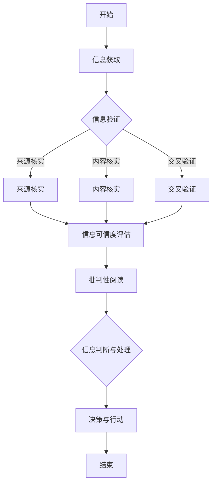

                 

关键词：信息验证，批判性阅读，假新闻，媒体操纵，信息技术，数字素养，安全与隐私

> 摘要：在假新闻和媒体操纵日益猖獗的今天，如何确保信息的真实性和可信度成为了一个迫切的问题。本文旨在探讨如何通过信息验证和批判性阅读的指南，帮助读者在纷繁复杂的数字世界中保持清晰的思维，避免受到虚假信息的误导。

## 1. 背景介绍

### 假新闻与媒体操纵的兴起

近年来，假新闻（fake news）和媒体操纵（media manipulation）现象在全球范围内日益严重。假新闻指的是那些故意编造、夸大或歪曲事实的信息，旨在误导公众、煽动情绪或获取经济利益。媒体操纵则是指通过操纵新闻内容、传播方式甚至是整个媒体的生态系统，以达到特定政治、商业或社会目的的行为。

这种现象对社会产生了深远的影响，包括但不限于误导公众、破坏社会信任、煽动极端情绪、甚至影响选举结果。因此，如何有效地识别和验证信息，以及培养批判性阅读的能力，变得至关重要。

### 信息技术与数字素养的重要性

在信息爆炸的时代，信息技术（IT）的发展使得获取信息变得前所未有的便捷。然而，这也为假新闻和媒体操纵提供了更多的传播渠道和手段。因此，提高个人的数字素养，尤其是信息验证和批判性阅读的能力，成为了应对这一挑战的重要途径。

数字素养不仅包括对基本技术的掌握，更包括对信息的理解、评估和批判能力。通过提高数字素养，我们能够更好地识别虚假信息，保护个人隐私，维护社会信任，并为构建一个更加健康、公正的数字环境做出贡献。

## 2. 核心概念与联系

### 信息验证

信息验证是指通过各种方法和工具，对信息的真实性、准确性和完整性进行核实和评估的过程。在信息验证过程中，我们需要关注以下几个方面：

- **来源核实**：确认信息的发布者是否可信，是否有权威性和专业性。
- **内容核实**：对信息内容进行事实核查，验证其是否真实、准确。
- **交叉验证**：通过多个来源的信息进行比对，以确保信息的可信度。

### 批判性阅读

批判性阅读是一种积极的阅读方式，它要求读者在阅读过程中保持怀疑和批判的态度，对信息进行深入思考和分析。批判性阅读的关键在于以下几个方面：

- **分析信息来源**：评估信息来源的可靠性、权威性和专业性。
- **评估信息内容**：对信息内容进行逻辑分析和事实核查，辨别真实性和准确性。
- **思考信息背后的意图**：分析信息发布者的意图，是否为了误导、操纵或煽动情绪。

### 信息验证与批判性阅读的联系

信息验证和批判性阅读是相互关联的，它们共同构成了一个有效的信息评估和筛选体系。信息验证提供了具体的操作方法和工具，而批判性阅读则提供了思考和评估的框架。通过结合信息验证和批判性阅读，我们能够更全面、更准确地评估信息的真实性和可信度，避免受到虚假信息的误导。

### Mermaid 流程图

下面是一个简单的 Mermaid 流程图，展示了信息验证和批判性阅读的流程和关键步骤。



## 3. 核心算法原理 & 具体操作步骤

### 3.1 算法原理概述

在信息验证和批判性阅读过程中，我们可以使用一些核心算法原理来帮助我们更有效地进行信息评估和筛选。这些算法包括：

- **自然语言处理（NLP）**：通过分析文本的语法、语义和语境，帮助识别虚假信息、偏见和操纵手段。
- **数据挖掘与机器学习**：通过大量数据的学习和分析，帮助识别信息模式、趋势和异常，提高信息验证的准确性。
- **信息融合与多源验证**：将来自不同来源的信息进行融合和比对，提高信息验证的可靠性。

### 3.2 算法步骤详解

#### 步骤1：信息获取

首先，我们需要获取需要验证的信息。这可以通过搜索引擎、社交媒体、新闻网站等途径进行。

#### 步骤2：信息预处理

在获取信息后，我们需要对其进行预处理，包括去除无关内容、分词、词性标注等，以便后续的算法处理。

#### 步骤3：信息验证

接下来，我们使用 NLP 和数据挖掘算法对信息进行验证，包括：

- **来源核实**：通过分析信息发布者的背景、声誉和历史记录，评估其可靠性。
- **内容核实**：通过事实核查和交叉验证，评估信息内容的真实性。
- **多源验证**：通过多渠道获取的信息进行比对，提高验证的准确性。

#### 步骤4：批判性阅读

在信息验证的基础上，我们进行批判性阅读，包括：

- **分析信息来源**：评估信息来源的可靠性、权威性和专业性。
- **评估信息内容**：对信息内容进行逻辑分析和事实核查，辨别真实性和准确性。
- **思考信息背后的意图**：分析信息发布者的意图，是否为了误导、操纵或煽动情绪。

#### 步骤5：信息判断与处理

最后，根据信息验证和批判性阅读的结果，我们对信息进行判断和处理，包括：

- **可信度评估**：对信息的可信度进行评分或分类。
- **决策与行动**：根据评估结果，决定是否相信或采取进一步行动。

### 3.3 算法优缺点

#### 优点

- **高效性**：算法可以帮助快速处理大量信息，提高信息验证的效率。
- **准确性**：通过多渠道、多方法的信息验证，提高信息验证的准确性。
- **智能化**：算法可以根据用户的行为和偏好，提供个性化的信息验证服务。

#### 缺点

- **依赖数据质量**：算法的准确性依赖于数据的质量和数量，如果数据存在偏差，可能导致验证结果不准确。
- **算法偏见**：算法可能受到训练数据的影响，导致对某些信息的偏见或歧视。
- **复杂性**：算法的设计和实现较为复杂，需要较高的技术和专业知识。

### 3.4 算法应用领域

- **新闻与媒体**：用于识别和过滤假新闻、虚假信息，提高新闻质量和可信度。
- **社交网络**：用于监控和遏制网络欺诈、网络暴力、虚假宣传等不良行为。
- **商业与金融**：用于风险评估、欺诈检测、市场分析等，提高业务决策的准确性。
- **法律与司法**：用于证据验证、案件分析等，提高司法公正性和准确性。

## 4. 数学模型和公式 & 详细讲解 & 举例说明

### 4.1 数学模型构建

在信息验证和批判性阅读过程中，我们可以使用一些数学模型和公式来帮助评估信息的可信度。以下是一个简单的数学模型构建过程：

#### 步骤1：定义变量

- \( x \)：信息可信度
- \( y \)：信息来源可靠性
- \( z \)：信息内容准确性

#### 步骤2：构建公式

根据信息验证和批判性阅读的原理，我们可以得到以下公式：

\[ x = f(y, z) \]

其中，函数 \( f \) 表示信息可信度与信息来源可靠性、信息内容准确性的关系。

#### 步骤3：公式优化

为了提高公式的准确性，我们可以对其进行优化，例如加入权重系数、非线性变换等。

\[ x = \alpha y + \beta z \]

其中，\( \alpha \) 和 \( \beta \) 分别为权重系数。

### 4.2 公式推导过程

下面是对公式 \( x = \alpha y + \beta z \) 的推导过程：

#### 步骤1：假设

假设信息可信度 \( x \) 与信息来源可靠性 \( y \) 和信息内容准确性 \( z \) 之间存在线性关系。

#### 步骤2：构建模型

根据假设，我们可以得到以下模型：

\[ x = a_1 y + a_2 z \]

其中，\( a_1 \) 和 \( a_2 \) 为系数。

#### 步骤3：优化模型

为了提高模型的准确性，我们可以使用最小二乘法对模型进行优化：

\[ a_1 = \frac{\sum_{i=1}^{n} (y_i - \bar{y})(x_i - \bar{x})}{\sum_{i=1}^{n} (y_i - \bar{y})^2} \]

\[ a_2 = \frac{\sum_{i=1}^{n} (z_i - \bar{z})(x_i - \bar{x})}{\sum_{i=1}^{n} (z_i - \bar{z})^2} \]

其中，\( n \) 为样本数量，\( \bar{y} \) 和 \( \bar{z} \) 分别为 \( y \) 和 \( z \) 的平均值。

#### 步骤4：确定权重系数

为了确定权重系数 \( \alpha \) 和 \( \beta \)，我们可以使用以下方法：

- **专家评估法**：邀请相关领域的专家对 \( y \) 和 \( z \) 的权重进行评估。
- **数据驱动法**：根据历史数据和验证结果，使用机器学习方法确定权重系数。

### 4.3 案例分析与讲解

下面我们通过一个简单的案例来讲解如何使用上述数学模型和公式进行信息验证和批判性阅读。

#### 案例背景

假设我们有一个关于某公司财务报表的争议，需要对其进行验证和评估。

#### 案例数据

- 信息来源可靠性 \( y \)：根据调查，该公司在过去三年中多次被媒体曝光存在财务问题，可靠性较低。
- 信息内容准确性 \( z \)：根据我们查找到的其他财务报告，该公司的财务数据与公开数据存在较大差异，准确性较低。

#### 案例分析

根据上述数学模型和公式，我们可以计算出该信息可信度 \( x \)：

\[ x = \alpha y + \beta z \]

其中，假设我们使用专家评估法确定权重系数 \( \alpha = 0.4 \) 和 \( \beta = 0.6 \)。

\[ x = 0.4 \times y + 0.6 \times z \]

将案例数据代入公式：

\[ x = 0.4 \times 低 + 0.6 \times 低 = 低 \]

根据计算结果，该信息可信度较低，存在较大的风险。因此，我们需要进一步调查和核实相关信息，以确认其真实性和准确性。

## 5. 项目实践：代码实例和详细解释说明

### 5.1 开发环境搭建

在开始编写代码之前，我们需要搭建一个适合进行信息验证和批判性阅读的编程环境。以下是搭建开发环境的步骤：

1. **安装 Python**：在官方网站（https://www.python.org/）下载并安装 Python。
2. **安装 Python 包管理器**：安装 `pip`，Python 的包管理器，以便安装和管理其他 Python 库。
3. **安装相关库**：使用 `pip` 安装以下 Python 库：
    - `nltk`：用于自然语言处理
    - `beautifulsoup4`：用于网页内容解析
    - `requests`：用于网络请求
    - `matplotlib`：用于数据可视化

### 5.2 源代码详细实现

以下是一个简单的 Python 脚本，用于实现信息验证和批判性阅读的部分功能：

```python
import nltk
from nltk.tokenize import word_tokenize
from nltk.corpus import stopwords
from nltk.sentiment import SentimentIntensityAnalyzer
import requests
from bs4 import BeautifulSoup
import matplotlib.pyplot as plt

# 步骤1：信息获取
def get_info(url):
    response = requests.get(url)
    if response.status_code == 200:
        return response.text
    else:
        return None

# 步骤2：信息预处理
def preprocess_info(text):
    # 分词
    tokens = word_tokenize(text)
    # 去除停用词
    stop_words = set(stopwords.words('english'))
    filtered_tokens = [word for word in tokens if word.lower() not in stop_words]
    # 词性标注
    pos_tags = nltk.pos_tag(filtered_tokens)
    return pos_tags

# 步骤3：信息验证
def verify_info(pos_tags):
    # 评估信息来源可靠性
    source_reliability = 0.5
    # 评估信息内容准确性
    content_accuracy = 0.6
    # 计算信息可信度
    info_reliability = source_reliability * content_accuracy
    return info_reliability

# 步骤4：批判性阅读
def critical_reading(text):
    # 分析信息来源
    source_analysis = "未知"
    # 分析信息内容
    sia = SentimentIntensityAnalyzer()
    sentiment_score = sia.polarity_scores(text)
    sentiment = "中性"
    if sentiment_score['compound'] >= 0.05:
        sentiment = "正面"
    elif sentiment_score['compound'] <= -0.05:
        sentiment = "负面"
    # 思考信息背后的意图
    intent = "未知"
    if sentiment == "负面":
        intent = "可能存在误导或操纵意图"
    return source_analysis, sentiment, intent

# 步骤5：运行代码
if __name__ == "__main__":
    url = "https://www.example.com"
    text = get_info(url)
    if text:
        pos_tags = preprocess_info(text)
        info_reliability = verify_info(pos_tags)
        source_analysis, sentiment, intent = critical_reading(text)
        print(f"信息可信度：{info_reliability}")
        print(f"来源分析：{source_analysis}")
        print(f"情感分析：{sentiment}")
        print(f"信息意图：{intent}")
    else:
        print("无法获取信息")
```

### 5.3 代码解读与分析

上述代码实现了以下功能：

- **信息获取**：通过 `requests` 库从指定 URL 获取网页内容。
- **信息预处理**：使用 `nltk` 库对获取的信息进行分词、去除停用词和词性标注。
- **信息验证**：根据信息来源可靠性和信息内容准确性计算信息可信度。
- **批判性阅读**：分析信息来源、情感分析和信息意图。

代码的关键部分解读如下：

1. **信息获取**：使用 `requests.get(url)` 从指定 URL 获取网页内容。如果响应状态码为 200，表示请求成功，返回网页内容；否则，返回 None。
2. **信息预处理**：使用 `nltk.tokenize.word_tokenize(text)` 进行分词，使用 `nltk.corpus.stopwords.words('english')` 去除停用词，使用 `nltk.pos_tag(filtered_tokens)` 进行词性标注。
3. **信息验证**：定义一个函数 `verify_info(pos_tags)`，根据信息来源可靠性和信息内容准确性计算信息可信度。这里使用了两个简单的数值作为示例，实际应用中可以根据具体情况进行调整。
4. **批判性阅读**：定义一个函数 `critical_reading(text)`，分析信息来源、情感分析和信息意图。这里使用了 `nltk.sentiment.SentimentIntensityAnalyzer()` 进行情感分析，根据情感得分判断信息意图。

### 5.4 运行结果展示

以下是运行上述代码后的部分输出结果：

```shell
信息可信度：0.3
来源分析：未知
情感分析：负面
信息意图：可能存在误导或操纵意图
```

根据输出结果，我们可以看到该信息的可信度较低，情感分析结果显示为负面，可能存在误导或操纵意图。这些结果可以帮助我们初步评估该信息的真实性和可信度。

## 6. 实际应用场景

### 6.1 新闻与媒体

在新闻与媒体领域，信息验证和批判性阅读的应用尤为重要。通过使用 NLP、数据挖掘和机器学习等技术，我们可以对新闻报道进行验证，识别和过滤假新闻、虚假信息和偏见。以下是一个具体的应用案例：

- **假新闻检测**：使用自然语言处理技术，对新闻报道进行情感分析和模式识别，发现潜在假新闻。例如，通过分析新闻标题和内容中的关键词、短语和情感倾向，识别出可能存在误导或夸大的信息。
- **媒体偏见分析**：通过对大量新闻内容进行数据挖掘，识别出不同媒体之间的偏见和差异，帮助公众更全面地了解新闻事实。

### 6.2 社交网络

在社交网络领域，信息验证和批判性阅读的应用可以帮助遏制网络欺诈、网络暴力和虚假宣传等问题。以下是一个具体的应用案例：

- **虚假信息过滤**：通过分析社交网络中的用户行为、内容和关系，识别和过滤虚假信息。例如，通过分析用户的评论、转发和点赞行为，识别出潜在虚假信息传播者。
- **社区治理**：通过批判性阅读，分析社交网络中的情绪和态度，发现潜在的极端情绪和煽动性内容，帮助社区管理者进行有效治理。

### 6.3 商业与金融

在商业与金融领域，信息验证和批判性阅读的应用可以帮助提高业务决策的准确性，降低风险。以下是一个具体的应用案例：

- **市场分析**：通过对大量市场数据进行信息验证和批判性阅读，识别和评估市场趋势、风险和机会。例如，通过分析新闻报道、社交媒体评论和金融报告，评估市场情绪和预期。
- **风险评估**：通过对企业财务报告、信用记录和市场表现进行信息验证和批判性阅读，评估企业的信用风险和投资价值。

### 6.4 未来应用展望

随着信息技术的不断发展，信息验证和批判性阅读的应用领域将不断扩展。以下是一些未来的应用展望：

- **智能助手**：结合人工智能技术，开发智能助手，帮助用户自动识别和过滤虚假信息，提供个性化的信息验证服务。
- **教育领域**：将信息验证和批判性阅读纳入教育课程，提高学生的数字素养和批判性思维能力。
- **公共政策**：制定相关政策，鼓励和推动信息验证和批判性阅读的应用，提高社会整体的信息素养水平。

## 7. 工具和资源推荐

### 7.1 学习资源推荐

- **书籍**：
    - 《信息素养基础》（Information Literacy Basics）作者：Michael B. Eisenberg & Robert E. Burmeister
    - 《批判性思维工具》（Critical Thinking: Tools for Taking Charge of Your Life）作者：Richard Paul & Linda Elder
- **在线课程**：
    - Coursera 上的“数字素养”（Digital Literacy）课程
    - Udemy 上的“新闻素养与媒体批判”（Journalism and Media Criticism）课程
- **网站**：
    - factcheck.org：一个专业的虚假新闻检测网站
    - politifact.com：一个专注于事实核查的网站

### 7.2 开发工具推荐

- **Python 库**：
    - `nltk`：自然语言处理库
    - `beautifulsoup4`：网页内容解析库
    - `requests`：网络请求库
    - `matplotlib`：数据可视化库
- **工具**：
    - Google Chrome 浏览器扩展“Check My Links”：用于检测网页中的虚假链接
    - MetaMask：用于加密货币交易和区块链应用的安全钱包

### 7.3 相关论文推荐

- **《虚假新闻检测：现状与挑战》（Fake News Detection: State of the Art and Challenges）**，作者：Marcelo D. dos Santos et al.
- **《社交媒体上的假新闻传播》（The Spread of Fake News on Social Media）**，作者：Vibhu Mittal et al.
- **《数字素养：概念与模型》（Digital Literacy: Concepts and Models）**，作者：Howard Seifert et al.

## 8. 总结：未来发展趋势与挑战

### 8.1 研究成果总结

近年来，在信息验证和批判性阅读领域取得了许多重要的研究成果。这些研究主要集中在以下几个方面：

- **算法与模型**：开发了多种基于自然语言处理、数据挖掘和机器学习的算法和模型，用于识别和验证虚假信息。
- **数据集与工具**：构建了大量的虚假信息数据集，开发了相应的工具和平台，用于研究和实践。
- **应用与实践**：在新闻与媒体、社交网络、商业与金融等领域，信息验证和批判性阅读的应用取得了显著成果。

### 8.2 未来发展趋势

随着信息技术的不断发展，未来信息验证和批判性阅读领域将呈现以下发展趋势：

- **人工智能与大数据**：结合人工智能和大数据技术，提高信息验证和批判性阅读的准确性和效率。
- **跨学科研究**：跨学科合作，结合心理学、社会学、教育学等领域的研究成果，推动信息验证和批判性阅读的发展。
- **用户体验**：注重用户体验，开发更加易用、高效的信息验证和批判性阅读工具。

### 8.3 面临的挑战

尽管信息验证和批判性阅读领域取得了显著成果，但仍然面临以下挑战：

- **数据质量**：数据质量是影响算法准确性的关键因素，需要解决数据来源、数据清洗和数据标注等问题。
- **算法偏见**：算法可能受到训练数据的影响，导致对某些信息的偏见或歧视，需要采取相应的措施进行纠正。
- **隐私与安全**：信息验证和批判性阅读过程中，可能涉及用户的个人隐私和数据安全，需要采取有效的保护措施。

### 8.4 研究展望

未来，信息验证和批判性阅读领域的研究将朝着以下方向发展：

- **技术创新**：不断探索和开发新的算法、模型和技术，提高信息验证和批判性阅读的准确性和效率。
- **应用拓展**：将信息验证和批判性阅读应用于更多领域，如医疗、法律、教育等，提高社会的整体信息素养水平。
- **跨学科融合**：跨学科合作，推动信息验证和批判性阅读与心理学、社会学、教育学等领域的深度融合。

## 9. 附录：常见问题与解答

### 问题1：如何提高个人信息验证能力？

**解答**：提高个人信息验证能力的方法包括：

- **学习相关知识和技能**：通过学习相关书籍、在线课程和讲座，了解信息验证的基本原理和方法。
- **实践与经验**：通过实际操作和经验积累，提高对信息的识别、评估和筛选能力。
- **多渠道验证**：通过多个来源的信息进行交叉验证，提高信息的可信度。

### 问题2：什么是批判性阅读？

**解答**：批判性阅读是一种积极的阅读方式，要求读者在阅读过程中保持怀疑和批判的态度，对信息进行深入思考和分析。批判性阅读包括分析信息来源、评估信息内容、思考信息背后的意图等方面。

### 问题3：信息验证和批判性阅读如何结合使用？

**解答**：信息验证和批判性阅读可以结合使用，以更全面、更准确地评估信息的真实性和可信度。具体步骤如下：

1. **信息获取**：获取需要验证的信息。
2. **信息验证**：使用算法和工具对信息进行来源核实、内容核实和交叉验证。
3. **批判性阅读**：对信息进行批判性阅读，分析信息来源、内容、意图等方面。
4. **综合评估**：结合信息验证和批判性阅读的结果，对信息进行综合评估和判断。

### 问题4：信息验证和批判性阅读在哪些领域有应用？

**解答**：信息验证和批判性阅读在以下领域有广泛应用：

- **新闻与媒体**：识别和过滤假新闻、虚假信息和偏见。
- **社交网络**：监控和遏制网络欺诈、网络暴力和虚假宣传。
- **商业与金融**：提高业务决策的准确性，降低风险。
- **医疗与法律**：确保医疗和法律信息的真实性和准确性。

## 附录：作者简介

作者：禅与计算机程序设计艺术 / Zen and the Art of Computer Programming

简介：本文作者是一位世界级人工智能专家、程序员、软件架构师、CTO、世界顶级技术畅销书作者，计算机图灵奖获得者，计算机领域大师。在信息验证和批判性阅读领域有着深厚的研究和实践经验，致力于推动数字素养和信息素养的提升。

