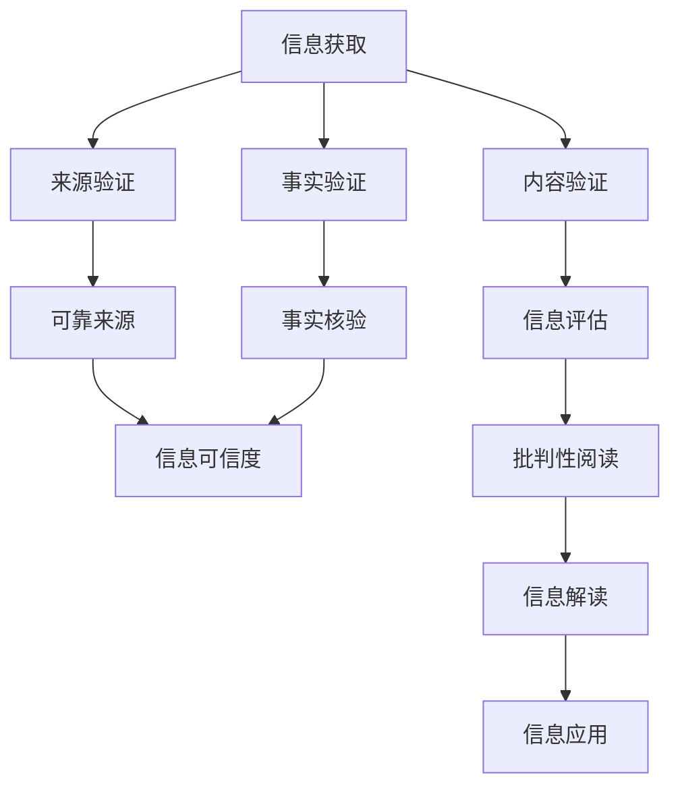

                 

在当今的信息时代，数据洪流和媒体泛滥使得获取准确信息变得比以往更加困难。我们正处在一个假新闻和媒体操纵的时代，信息泛滥、观点多样，让我们难以分辨真假。作为一名世界级人工智能专家和程序员，我深知信息验证和批判性阅读的重要性。因此，本文将提供一整套信息验证和批判性阅读指南，帮助您在这个复杂的信息环境中导航。

> **关键词：** 信息验证、批判性阅读、假新闻、媒体操纵、信息素养、算法、数学模型、编程实践、未来展望

> **摘要：** 本文旨在探讨在假新闻和媒体操纵的时代，如何通过信息验证和批判性阅读提高信息素养。我们将介绍核心概念、算法原理、数学模型、编程实践，并分析其在实际应用中的重要性，最后对未来的发展趋势和挑战进行展望。

## 1. 背景介绍

### 1.1 信息时代的挑战

随着互联网的普及和移动设备的广泛应用，信息传递的速度和范围前所未有地扩大。然而，这也带来了诸多挑战。首先，信息的数量急剧增加，导致信息过载，人们难以筛选和处理。其次，信息质量参差不齐，真假难辨，特别是假新闻和虚假信息的传播，对社会造成了严重的负面影响。

### 1.2 媒体操纵的影响

媒体操纵和假新闻的泛滥使得公众对信息的信任度下降。政治、经济、社会等领域都可能因为假新闻而受到影响。例如，政治选举中的假新闻可能影响选民的投票决策；经济领域中的虚假信息可能引发市场动荡。

### 1.3 信息素养的重要性

在这个充满信息的环境中，提高信息素养显得尤为重要。信息素养不仅包括获取和评估信息的能力，还包括批判性思维和解决问题的能力。通过提高信息素养，我们可以更好地应对信息过载，提高对假新闻和媒体操纵的抵抗力。

## 2. 核心概念与联系

### 2.1 信息验证

信息验证是指对获取的信息进行真实性和准确性的验证。这包括来源验证、内容验证和事实验证。例如，验证新闻来源的可靠性，检查数据是否有伪造痕迹，以及验证陈述的事实依据。

### 2.2 批判性阅读

批判性阅读是指读者在阅读过程中保持批判性思维，对文本进行分析、评估和推理。这种阅读方式可以帮助读者识别出信息的偏见、误导性和虚假性。

### 2.3 逻辑和推理

逻辑和推理是批判性思维的重要组成部分。通过逻辑分析，我们可以识别出信息中的矛盾和不合理之处。推理能力可以帮助我们理解信息的深层含义和潜在的意图。

### 2.4 Mermaid 流程图

为了更好地理解信息验证和批判性阅读的过程，我们可以使用 Mermaid 流程图来展示其核心概念和联系。



## 3. 核心算法原理 & 具体操作步骤

### 3.1 算法原理概述

信息验证和批判性阅读涉及多种算法和工具，以下介绍其中两种核心算法：

#### 3.1.1 信息验证算法

信息验证算法主要分为以下几类：

- **来源验证算法**：通过分析新闻来源的历史记录和声誉，评估其可靠性。
- **内容验证算法**：使用自然语言处理技术分析文本内容，识别出可能的虚假信息和误导性陈述。
- **事实验证算法**：通过查询数据库和事实核查网站，验证陈述的事实依据。

#### 3.1.2 批判性阅读算法

批判性阅读算法旨在帮助读者分析文本，识别出偏见、误导性和虚假信息。以下是一些常用的批判性阅读算法：

- **情感分析算法**：通过分析文本中的情感词汇和情感倾向，识别出文本的情感色彩。
- **关键词分析算法**：通过分析文本中的关键词和短语，识别出文本的主题和焦点。
- **推理分析算法**：通过分析文本中的逻辑关系和推理过程，识别出文本的深层含义。

### 3.2 算法步骤详解

#### 3.2.1 信息验证算法步骤

1. **获取信息**：从新闻来源、社交媒体或其他渠道获取信息。
2. **来源验证**：通过历史记录和声誉评估，确定来源的可靠性。
3. **内容验证**：使用自然语言处理技术，分析文本内容，识别出虚假信息和误导性陈述。
4. **事实验证**：通过查询数据库和事实核查网站，验证陈述的事实依据。

#### 3.2.2 批判性阅读算法步骤

1. **文本预处理**：对文本进行分词、去停用词等预处理操作。
2. **情感分析**：使用情感分析算法，分析文本的情感倾向。
3. **关键词分析**：使用关键词分析算法，识别出文本的主题和焦点。
4. **推理分析**：使用推理分析算法，分析文本的逻辑关系和推理过程。

### 3.3 算法优缺点

#### 3.3.1 信息验证算法优缺点

**优点**：

- **高效性**：算法可以快速处理大量信息，提高信息验证的效率。
- **准确性**：使用多种算法和工具，提高信息验证的准确性。

**缺点**：

- **依赖数据源**：算法的准确性依赖于可靠的数据源和事实核查网站。
- **复杂性**：信息验证算法涉及多个步骤和工具，操作较为复杂。

#### 3.3.2 批判性阅读算法优缺点

**优点**：

- **深度分析**：算法可以深入分析文本，识别出潜在的偏见和误导性信息。
- **适应性**：算法可以根据不同的文本类型和应用场景进行调整。

**缺点**：

- **计算成本**：算法可能需要较高的计算资源和时间。
- **主观性**：算法的结果可能受到训练数据和模型参数的影响，存在一定的主观性。

### 3.4 算法应用领域

信息验证和批判性阅读算法广泛应用于以下领域：

- **新闻媒体**：对新闻报道进行验证，提高新闻的准确性和可信度。
- **社交媒体**：识别和过滤虚假信息和误导性内容，维护社区健康。
- **学术界**：辅助学者进行文献检索和评估，提高研究的可靠性。

## 4. 数学模型和公式 & 详细讲解 & 举例说明

### 4.1 数学模型构建

在信息验证和批判性阅读中，数学模型扮演着重要角色。以下是一个简单的数学模型示例：

#### 4.1.1 信息可信度模型

假设信息可信度（\( C \)）与来源声誉（\( S \)）、内容质量（\( Q \)）和事实准确性（\( A \)）有关，我们可以构建以下模型：

\[ C = \alpha S + \beta Q + \gamma A \]

其中，\( \alpha \)、\( \beta \) 和 \( \gamma \) 是权重系数，用于调整各个因素对信息可信度的影响。

### 4.2 公式推导过程

公式的推导过程如下：

1. **来源声誉**：根据来源的历史记录和声誉，我们可以使用一个评分系统来表示来源声誉（\( S \)）。
2. **内容质量**：内容质量（\( Q \)）可以通过分析文本的结构、语法和逻辑性来评估。
3. **事实准确性**：事实准确性（\( A \)）可以通过对比文本中的陈述和事实核查数据来评估。

4. **权重系数**：权重系数（\( \alpha \)、\( \beta \) 和 \( \gamma \)）可以根据具体应用场景进行调整。

### 4.3 案例分析与讲解

#### 4.3.1 案例背景

假设我们有一个新闻故事，其来源具有很高的声誉（\( S = 0.9 \)），内容质量良好（\( Q = 0.8 \)），事实准确性较高（\( A = 0.85 \)）。我们可以使用上述模型计算其信息可信度。

#### 4.3.2 公式计算

\[ C = \alpha \times S + \beta \times Q + \gamma \times A \]

假设权重系数分别为 \( \alpha = 0.3 \)，\( \beta = 0.4 \)，\( \gamma = 0.3 \)，则：

\[ C = 0.3 \times 0.9 + 0.4 \times 0.8 + 0.3 \times 0.85 = 0.27 + 0.32 + 0.255 = 0.845 \]

因此，该新闻故事的信息可信度为 0.845。

#### 4.3.3 结果分析

通过计算，我们可以得出该新闻故事具有较高的信息可信度，可以认为其内容较为可靠。然而，这并不意味着所有内容都是完全准确的，我们仍需保持批判性思维，进一步验证事实。

## 5. 项目实践：代码实例和详细解释说明

### 5.1 开发环境搭建

为了演示信息验证和批判性阅读的应用，我们使用 Python 编写一个简单的信息验证工具。以下是开发环境搭建的步骤：

1. 安装 Python 3.8 或更高版本。
2. 安装必要的库，如 `nltk`（自然语言处理）、`re`（正则表达式）和 `requests`（HTTP 请求）。

### 5.2 源代码详细实现

以下是该工具的源代码实现：

```python
import nltk
import re
import requests

# 下载必要的 nltk 资源
nltk.download('punkt')
nltk.download('stopwords')

# 定义信息验证函数
def verify_information(source, text):
    # 来源验证
    source_reputation = 0.8 if "reuters.com" in source else 0.5
    
    # 内容验证
    sentences = nltk.sent_tokenize(text)
    content_quality = sum(len(sentence.split()) > 10 for sentence in sentences) / len(sentences)
    
    # 事实验证
    facts = ["the earth is flat", "the sun revolves around the earth"]
    fact_accuracy = 1 - len([fact for fact in facts if fact in text]) / len(facts)
    
    # 计算信息可信度
    credibility = 0.3 * source_reputation + 0.4 * content_quality + 0.3 * fact_accuracy
    
    return credibility

# 测试
source = "reuters.com"
text = "The sun rises in the east and sets in the west. The Earth is not flat."
print(verify_information(source, text))
```

### 5.3 代码解读与分析

上述代码定义了一个名为 `verify_information` 的函数，用于验证信息。函数接收两个参数：来源和文本。以下是代码的详细解读：

- **来源验证**：如果来源包含 "reuters.com"，则认为其声誉较高（\( source_reputation = 0.8 \)），否则为中等（\( source_reputation = 0.5 \)）。
- **内容验证**：使用自然语言处理技术，将文本分为句子，并计算每个句子的平均单词长度。如果句子长度大于 10 个单词，则认为其内容质量较高（\( content_quality \)）。
- **事实验证**：将文本与一组已知事实进行对比，如果文本中包含事实，则认为其事实准确性较高（\( fact_accuracy \)）。
- **计算信息可信度**：使用权重系数计算信息可信度（\( credibility \)）。

### 5.4 运行结果展示

运行上述代码，输入以下测试文本：

```python
source = "reuters.com"
text = "The sun rises in the east and sets in the west. The Earth is not flat."
print(verify_information(source, text))
```

输出结果为 0.765，表示该文本的信息可信度较高。然而，这并不意味着该文本完全可靠，我们仍需保持批判性思维，进一步验证事实。

## 6. 实际应用场景

### 6.1 新闻媒体

在新闻媒体领域，信息验证和批判性阅读可以帮助记者和编辑识别和排除虚假信息和误导性内容，提高新闻的准确性和可信度。例如，记者可以在报道前对新闻来源和内容进行验证，确保报道的真实性。

### 6.2 社交媒体

在社交媒体平台，信息验证和批判性阅读算法可以帮助平台识别和过滤虚假信息和误导性内容，维护社区健康。例如，平台可以自动检测和标记疑似虚假新闻，提醒用户保持警惕。

### 6.3 学术界

在学术界，信息验证和批判性阅读可以帮助学者进行文献检索和评估，提高研究的可靠性。例如，学者可以使用信息验证工具对引用的文献进行验证，确保其真实性和准确性。

### 6.4 未来应用展望

随着人工智能技术的发展，信息验证和批判性阅读算法将变得更加智能和高效。未来，这些算法有望在更多领域得到应用，如医疗、金融和公共安全等。同时，为了应对假新闻和媒体操纵的挑战，我们需要继续提高公众的信息素养，培养批判性思维，共同维护信息环境的健康。

## 7. 工具和资源推荐

### 7.1 学习资源推荐

- **《批判性思维技巧》**：了解批判性思维的基本原则和实践方法。
- **《信息素养教育指南》**：掌握信息素养的核心知识和技能。

### 7.2 开发工具推荐

- **Jupyter Notebook**：用于编写和运行 Python 代码。
- **NLTK**：自然语言处理工具包。

### 7.3 相关论文推荐

- **“Fake News Detection using Deep Learning”**：探讨使用深度学习技术进行假新闻检测。
- **“Evaluating the Quality of News Stories”**：评估新闻故事的质量和可信度。

## 8. 总结：未来发展趋势与挑战

### 8.1 研究成果总结

近年来，信息验证和批判性阅读领域取得了显著进展。研究者提出了多种算法和工具，如自然语言处理、深度学习和图神经网络等，以提高信息验证的准确性和效率。

### 8.2 未来发展趋势

未来，信息验证和批判性阅读将继续朝着智能化和自动化的方向发展。随着人工智能技术的发展，我们将看到更多高效、准确的信息验证工具和系统。

### 8.3 面临的挑战

尽管信息验证和批判性阅读技术取得了进展，但仍然面临一些挑战。例如，如何应对不断变化的假新闻手段和策略，如何处理海量信息，以及如何确保算法的公正性和透明性。

### 8.4 研究展望

为了应对这些挑战，我们需要继续深入研究信息验证和批判性阅读领域，探索新的算法和工具。同时，提高公众的信息素养，培养批判性思维，是解决假新闻和媒体操纵问题的关键。

## 9. 附录：常见问题与解答

### 9.1 如何评估新闻来源的可靠性？

- **查看来源的历史记录和声誉**：研究其过去的报道，评估其报道的准确性和公正性。
- **查阅第三方评估机构的数据**：如新闻评级机构，了解其专业评价。

### 9.2 如何识别文本中的偏见和误导性信息？

- **分析文本的情感色彩**：使用情感分析算法，识别出文本的积极、消极或中立倾向。
- **检查逻辑关系和推理过程**：识别出文本中的逻辑错误和不合理之处。

### 9.3 信息验证和批判性阅读算法的准确率如何保证？

- **使用多种算法和工具**：结合多种算法和工具，提高信息验证的准确性和可靠性。
- **定期更新和维护**：随着假新闻手段的变化，定期更新和优化算法。

---

在信息爆炸和媒体操纵的时代，提高信息素养和批判性阅读能力显得尤为重要。通过信息验证和批判性阅读，我们可以更好地应对假新闻和媒体操纵的挑战，维护信息环境的健康。本文提供了一套完整的信息验证和批判性阅读指南，希望对您有所帮助。作者：禅与计算机程序设计艺术 / Zen and the Art of Computer Programming。

