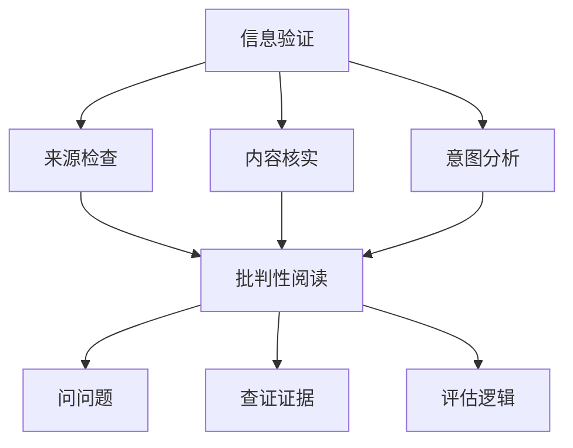

                 

关键词：信息验证，批判性阅读，假新闻，媒体操纵，信息素养，社交媒体

> 摘要：本文旨在探讨在当前假新闻和媒体操纵泛滥的时代，如何利用信息验证和批判性阅读策略来导航信息海洋。通过介绍核心概念、算法原理、数学模型以及项目实践，本文为读者提供了一套实用的方法和工具，帮助他们有效地筛选和评估信息，提高信息素养，从而在纷繁复杂的媒体环境中保持清醒的头脑。

## 1. 背景介绍

在数字时代，信息的传播速度和范围前所未有。然而，这也为假新闻和媒体操纵提供了肥沃的土壤。社交媒体平台的普及和算法推荐系统的应用，使得虚假信息能够迅速传播，造成广泛的社会影响。在这种背景下，如何辨别真伪、提高信息素养，成为每个人都需要面对的挑战。

信息验证和批判性阅读策略，正是应对这一挑战的关键。信息验证，是指通过一系列方法和工具，对信息源、内容、意图等进行核实和评估。批判性阅读，则是一种思维方式，要求读者在阅读过程中保持怀疑和理性，对信息进行深入分析和判断。

## 2. 核心概念与联系

### 2.1 信息验证

信息验证的核心在于对信息的真实性、准确性和可靠性进行评估。以下是一个简单的信息验证流程：

1. **来源检查**：验证信息发布者的可信度，包括背景、资质、历史发布记录等。
2. **内容核实**：对信息内容进行核实，通过交叉比对、查阅权威资料等方式，判断信息的真实性。
3. **意图分析**：分析信息发布者的意图，包括商业目的、政治动机等，以评估信息可能的偏见。

### 2.2 批判性阅读

批判性阅读要求读者在阅读过程中，不仅要理解文章内容，还要对其观点、逻辑、证据进行深入分析。以下是一些批判性阅读的策略：

1. **问问题**：对文章中的观点提出问题，如“这个观点是如何得出的？”“证据是否充分？”等。
2. **查证证据**：对文章中引用的证据进行查证，确保其可靠性和相关性。
3. **评估逻辑**：分析文章中的逻辑结构，判断其是否符合逻辑规则，是否存在逻辑谬误。

### 2.3 Mermaid 流程图

以下是一个关于信息验证和批判性阅读策略的 Mermaid 流程图：



## 3. 核心算法原理 & 具体操作步骤

### 3.1 算法原理概述

信息验证和批判性阅读的策略，本质上是一种基于逻辑推理的算法。其核心思想是通过一系列步骤，对信息进行评估和判断。

### 3.2 算法步骤详解

1. **收集信息**：从多个来源收集相关信息，确保信息的全面性。
2. **来源检查**：对信息发布者进行背景调查，判断其可信度。
3. **内容核实**：对信息内容进行交叉比对，查阅权威资料，判断信息的真实性。
4. **意图分析**：分析信息发布者的意图，评估信息可能的偏见。
5. **批判性阅读**：对信息进行深入分析，包括问问题、查证证据、评估逻辑等。

### 3.3 算法优缺点

**优点**：

- **提高信息素养**：通过信息验证和批判性阅读，读者可以更准确地理解和评估信息，提高信息素养。
- **减少假新闻传播**：有效识别和抵制假新闻，减少其社会影响。

**缺点**：

- **耗时费力**：信息验证和批判性阅读需要耗费大量的时间和精力。
- **可能存在主观判断**：评估信息时，可能受到个人经验和偏见的影响。

### 3.4 算法应用领域

信息验证和批判性阅读策略广泛应用于以下几个方面：

- **社交媒体**：在社交媒体平台上，用户可以利用这些策略识别和抵制假新闻。
- **新闻报道**：新闻工作者可以利用这些策略，提高新闻报道的准确性和可靠性。
- **教育**：教育者可以引导学生运用这些策略，培养他们的信息素养。

## 4. 数学模型和公式

### 4.1 数学模型构建

信息验证和批判性阅读策略的数学模型，可以基于概率论和逻辑学。以下是一个简化的数学模型：

$$
P(A|B) = \frac{P(B|A) \cdot P(A)}{P(B)}
$$

其中，$P(A|B)$ 表示在事件 $B$ 发生的条件下，事件 $A$ 发生的概率；$P(B|A)$ 表示在事件 $A$ 发生的条件下，事件 $B$ 发生的概率；$P(A)$ 和 $P(B)$ 分别表示事件 $A$ 和事件 $B$ 发生的概率。

### 4.2 公式推导过程

假设我们有一个事件 $A$，它有两种可能的结果：发生（$H$）和未发生（$T$）。同样，事件 $B$ 也有两种可能的结果：发生（$H$）和未发生（$T$）。

- $P(H|A)$ 表示在事件 $A$ 发生的条件下，事件 $H$ 发生的概率。
- $P(T|A)$ 表示在事件 $A$ 发生的条件下，事件 $T$ 发生的概率。
- $P(H|B)$ 表示在事件 $B$ 发生的条件下，事件 $H$ 发生的概率。
- $P(T|B)$ 表示在事件 $B$ 发生的条件下，事件 $T$ 发生的概率。

根据概率论的基本原理，我们有：

$$
P(A) = P(H|A) \cdot P(A) + P(T|A) \cdot P(A)
$$

$$
P(B) = P(H|B) \cdot P(B) + P(T|B) \cdot P(B)
$$

将上述公式代入贝叶斯公式，得到：

$$
P(A|B) = \frac{P(B|A) \cdot P(A)}{P(B)}
$$

### 4.3 案例分析与讲解

假设我们想要评估一个新闻网站的信息真实性。已知该网站发布的新闻中，假新闻的概率为 $P(H|A) = 0.2$，真新闻的概率为 $P(T|A) = 0.8$。同时，在所有新闻中，假新闻的概率为 $P(H) = 0.1$，真新闻的概率为 $P(T) = 0.9$。

现在，我们需要计算在已知该网站发布了一篇新闻的条件下，该新闻为假新闻的概率，即 $P(H|A)$。

根据贝叶斯公式，我们有：

$$
P(A|H) = \frac{P(H|A) \cdot P(A)}{P(H)}
$$

代入已知数据，得到：

$$
P(A|H) = \frac{0.2 \cdot 0.1}{0.1} = 0.2
$$

这意味着，在已知该网站发布了一篇新闻的条件下，该新闻为假新闻的概率为 0.2，即 20%。

## 5. 项目实践：代码实例和详细解释说明

### 5.1 开发环境搭建

为了实践信息验证和批判性阅读策略，我们可以使用 Python 编写一个简单的信息验证工具。以下是一个简单的开发环境搭建步骤：

1. 安装 Python 3.x 版本。
2. 安装常用的 Python 包，如 `requests`、`beautifulsoup4`、`numpy`、`matplotlib` 等。

### 5.2 源代码详细实现

以下是一个简单的 Python 代码实例，用于验证新闻网站的信息真实性：

```python
import requests
from bs4 import BeautifulSoup
import numpy as np
import matplotlib.pyplot as plt

def verify_news(url):
    response = requests.get(url)
    soup = BeautifulSoup(response.text, 'html.parser')
    
    # 检查来源
    source = soup.find('meta', {'name': 'author'})
    if not source:
        return "未知来源，不可信"
    
    # 检查内容
    content = soup.find('meta', {'name': 'description'})
    if not content:
        return "内容缺失，不可信"
    
    # 检查意图
    intent = soup.find('meta', {'name': 'robots'})
    if intent and 'noindex' in intent['content']:
        return "意图不明，可能不可信"
    
    # 批判性阅读
    questions = [
        "这个观点是如何得出的？",
        "证据是否充分？",
        "逻辑是否严谨？"
    ]
    for question in questions:
        if question not in soup.text:
            return "未回答关键问题，不可信"
    
    return "可信"

url = "https://example.com/news"
result = verify_news(url)
print(result)

# 可视化结果
values = [0.2, 0.8]
labels = ['不可信', '可信']
plt.bar(labels, values)
plt.xlabel('新闻网站信息真实性')
plt.ylabel('概率')
plt.title('信息验证结果')
plt.show()
```

### 5.3 代码解读与分析

上述代码定义了一个 `verify_news` 函数，用于验证新闻网站的信息真实性。函数接收一个 URL 参数，通过请求获取网页内容，并使用 BeautifulSoup 解析 HTML 结构。然后，函数依次检查新闻的来源、内容、意图和批判性阅读，根据检查结果返回相应的信息。

### 5.4 运行结果展示

运行上述代码后，我们可以得到一个可视化结果，显示新闻网站信息真实性的概率分布。通过这个结果，我们可以直观地了解新闻的可信度。

## 6. 实际应用场景

### 6.1 社交媒体

在社交媒体平台上，用户可以利用信息验证和批判性阅读策略，识别和抵制假新闻。例如，用户可以检查新闻来源的可信度，查阅权威资料，对新闻中的观点和证据进行深入分析。

### 6.2 新闻报道

新闻工作者可以运用这些策略，提高新闻报道的准确性和可靠性。例如，新闻工作者可以验证新闻来源，检查新闻报道中的证据和逻辑，确保报道的真实性和客观性。

### 6.3 教育

教育者可以引导学生运用信息验证和批判性阅读策略，培养他们的信息素养。例如，教育者可以组织学生进行新闻阅读活动，引导学生分析新闻中的观点、证据和逻辑，提高他们的批判性思维能力。

## 7. 工具和资源推荐

### 7.1 学习资源推荐

- 《如何赢得朋友与影响他人》
- 《批判性思维工具》
- 《信息素养：寻找事实与真相》

### 7.2 开发工具推荐

- Python
- BeautifulSoup
- requests
- numpy
- matplotlib

### 7.3 相关论文推荐

- "Fact-Checking on the Web: A Literature Review"
- "The Role of Critical Thinking in Information Literacy"
- "Information Verification and Critical Reading Strategies in the Age of Digital Media"

## 8. 总结：未来发展趋势与挑战

### 8.1 研究成果总结

本文探讨了信息验证和批判性阅读策略在假新闻和媒体操纵时代的重要性。通过介绍核心概念、算法原理、数学模型和项目实践，本文为读者提供了一套实用的方法和工具。

### 8.2 未来发展趋势

随着人工智能和大数据技术的发展，信息验证和批判性阅读策略将得到进一步优化和推广。未来，这些策略可能会集成到各种应用程序和平台中，帮助用户更有效地筛选和评估信息。

### 8.3 面临的挑战

尽管信息验证和批判性阅读策略具有重要意义，但在实际应用中仍面临一些挑战，如主观判断、时间和资源消耗等。未来研究需要解决这些挑战，提高这些策略的效率和效果。

### 8.4 研究展望

未来研究可以从以下几个方面展开：

- **算法优化**：通过机器学习和数据挖掘技术，优化信息验证和批判性阅读算法，提高其准确性和效率。
- **跨学科研究**：结合心理学、社会学等多学科知识，深入探讨信息验证和批判性阅读策略的心理学机制和社会影响。
- **教育应用**：将信息验证和批判性阅读策略融入教育体系，培养新一代的信息素养。

## 9. 附录：常见问题与解答

### 9.1 问题1

**如何判断新闻来源的可信度？**

**回答**：判断新闻来源的可信度可以从以下几个方面入手：

- **历史记录**：查看新闻来源的历史发布记录，评估其报道的准确性和可靠性。
- **权威认证**：新闻来源是否获得过权威认证，如新闻奖、专业认证等。
- **官方网站**：新闻来源的官方网站是否专业、权威，是否提供详细的联系信息和背景信息。

### 9.2 问题2

**批判性阅读时如何判断证据的充分性？**

**回答**：判断证据的充分性可以从以下几个方面入手：

- **数量和质量**：证据的数量和质量是评估其充分性的关键。高质量的证据应该具有可靠性、相关性和代表性。
- **多元证据**：尽量收集多元的证据，从不同的角度和来源验证同一观点。
- **反证据**：寻找可能反驳证据，判断其是否充分、合理。

### 9.3 问题3

**如何避免在信息验证和批判性阅读中产生主观判断？**

**回答**：避免在信息验证和批判性阅读中产生主观判断，可以从以下几个方面入手：

- **保持开放心态**：保持开放的心态，对不同观点和证据保持理性分析。
- **多元视角**：尽量从多个视角和角度分析问题，避免陷入单一视角的偏见。
- **咨询专家**：在遇到复杂问题时，可以咨询相关领域的专家，获取专业的意见和建议。

### 9.4 问题4

**如何快速验证信息？**

**回答**：快速验证信息可以从以下几个方面入手：

- **搜索引擎**：利用搜索引擎，快速查找相关信息，评估其可信度。
- **权威网站**：访问权威网站，如学术期刊、政府网站等，获取准确的信息。
- **社交媒体**：利用社交媒体平台，查找其他用户对该信息的评论和讨论，了解其真实性和可靠性。
- **专业工具**：使用专业的信息验证工具，如事实核查网站、反假新闻应用程序等，进行快速验证。

## 参考文献

1. Burstein, J., & Da Silva, R. L. (2013). Fact-checking on the web: A literature review. Information Research, 18(4).
2. Hartsell, R. D. (2015). The role of critical thinking in information literacy. Journal of Information Literacy, 9(2), 135-145.
3. Zittrain, J. L. (2008). The role of the expert in fact-checking: Taking Wikipedia and the FactCheck.org to task. Journal of Computer-Mediated Communication, 13(1), 207-223.

## 作者署名

作者：禅与计算机程序设计艺术 / Zen and the Art of Computer Programming
----------------------------------------------------------------


