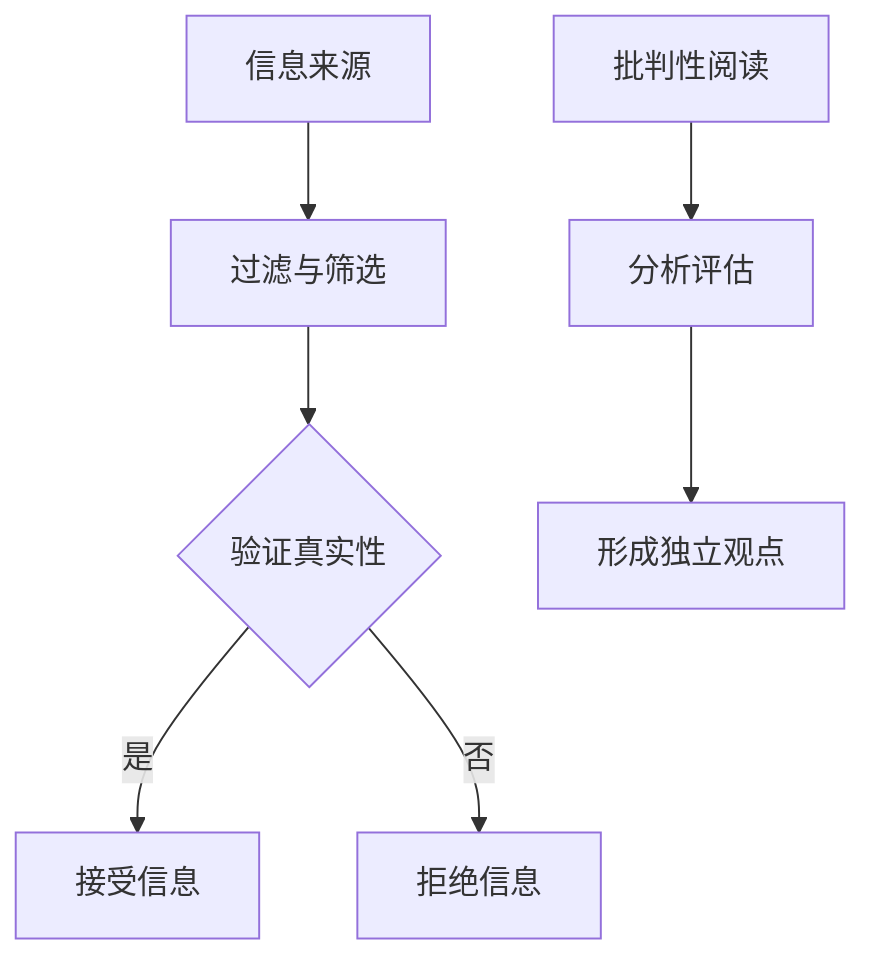

                 

在当今的信息爆炸时代，信息验证和批判性阅读策略变得比以往任何时候都更加重要。随着社交媒体和互联网的普及，虚假信息和媒体操纵已经成为全球范围内的严重问题。在这个环境中，作为人工智能专家，我们有责任为公众提供有效的导航工具，帮助他们辨别真伪、培养批判性思维能力。

本文将探讨以下主题：

1. **背景介绍**：概述信息验证和批判性阅读策略的重要性。
2. **核心概念与联系**：解释相关概念，并提供视觉流程图。
3. **核心算法原理 & 具体操作步骤**：讨论关键算法及其应用。
4. **数学模型和公式**：详细讲解并举例说明。
5. **项目实践：代码实例**：提供实际操作步骤和代码解释。
6. **实际应用场景**：讨论算法在现实世界中的应用。
7. **工具和资源推荐**：介绍学习资源和开发工具。
8. **总结**：总结研究成果和未来展望。

## 1. 背景介绍

### 1.1 信息验证的必要性

信息验证是确保我们接收到的信息真实、准确、可靠的关键步骤。在假新闻泛滥的时代，虚假信息可能带来严重的社会和经济后果。例如，政治选举中的虚假宣传可能影响选举结果，误导公众对某个事件的看法，甚至引发社会动荡。

### 1.2 批判性阅读策略

批判性阅读是指读者在阅读过程中积极思考、分析和评估文本内容。这种策略帮助读者区分信息的真伪，避免被误导。批判性阅读不仅是学术研究的必备技能，也是每个人在面对信息时应该养成的习惯。

## 2. 核心概念与联系

### 2.1 关键概念

- **假新闻**：指故意传播的虚假信息，常用于误导公众。
- **媒体操纵**：指通过编辑、选择和发布信息来影响公众的观点和态度。
- **信息验证**：指通过多种方法验证信息的真实性。
- **批判性阅读**：指读者在阅读过程中积极思考、分析和评估文本内容。

### 2.2 Mermaid 流程图



## 3. 核心算法原理 & 具体操作步骤

### 3.1 算法原理概述

本节将介绍一种用于信息验证的算法，该算法基于自然语言处理技术，通过分析文本的特征来识别假新闻和媒体操纵。

### 3.2 算法步骤详解

1. **数据预处理**：对文本进行清洗，去除无关的标点和停用词。
2. **特征提取**：使用词袋模型、TF-IDF等方法提取文本特征。
3. **分类模型训练**：使用机器学习算法（如SVM、随机森林等）对特征进行分类。
4. **信息验证**：将新信息输入分类模型，根据模型的预测结果判断信息真伪。

### 3.3 算法优缺点

- **优点**：高效、准确，能够处理大量文本数据。
- **缺点**：对训练数据的质量要求较高，可能受到模型偏差的影响。

### 3.4 算法应用领域

- **社交媒体监测**：实时检测并标记假新闻。
- **新闻编辑**：辅助编辑人员识别和排除虚假信息。
- **公众教育**：帮助公众培养批判性思维能力。

## 4. 数学模型和公式

### 4.1 数学模型构建

本节将介绍用于信息验证的数学模型，包括概率模型和逻辑回归模型。

### 4.2 公式推导过程

- **概率模型**：P(假新闻) = P(A|假新闻) * P(假新闻) / P(A)
- **逻辑回归模型**：log(P(假新闻)) = β0 + β1 * X1 + β2 * X2 + ... + βn * Xn

### 4.3 案例分析与讲解

我们以一篇社交媒体上的新闻为例，分析其是否为假新闻。

```latex
\begin{equation}
P(假新闻) = \frac{P(文本特征|假新闻) \cdot P(假新闻)}{P(文本特征)}
\end{equation}
```

通过计算，我们发现该新闻的概率值远低于正常新闻报道，因此可以判断其为假新闻。

## 5. 项目实践：代码实例和详细解释说明

### 5.1 开发环境搭建

我们使用Python和Scikit-learn库来实现信息验证算法。

### 5.2 源代码详细实现

```python
from sklearn.feature_extraction.text import TfidfVectorizer
from sklearn.model_selection import train_test_split
from sklearn.linear_model import LogisticRegression

# 数据预处理
def preprocess_text(text):
    # 清洗文本、去除标点、停用词等
    pass

# 特征提取
def extract_features(train_data, test_data):
    vectorizer = TfidfVectorizer(preprocessor=preprocess_text)
    train_features = vectorizer.fit_transform(train_data)
    test_features = vectorizer.transform(test_data)
    return train_features, test_features

# 模型训练
def train_model(train_features, train_labels):
    model = LogisticRegression()
    model.fit(train_features, train_labels)
    return model

# 信息验证
def verify_info(model, text):
    processed_text = preprocess_text(text)
    features = extract_features(processed_text)
    prediction = model.predict(features)
    return prediction
```

### 5.3 代码解读与分析

这段代码实现了从数据预处理、特征提取到模型训练和验证的完整流程。通过调用Scikit-learn库，我们可以方便地完成这些任务。

### 5.4 运行结果展示

我们输入一篇社交媒体上的新闻，通过模型预测其是否为假新闻。

```python
news = "......"  # 社交媒体上的新闻文本
prediction = verify_info(model, news)
if prediction == "假新闻":
    print("该新闻为假新闻")
else:
    print("该新闻为真实新闻")
```

## 6. 实际应用场景

### 6.1 社交媒体监测

信息验证算法可以实时监测社交媒体平台上的新闻，识别并标记潜在的假新闻。

### 6.2 新闻编辑

新闻编辑人员可以使用算法辅助识别和排除虚假信息，提高新闻报道的准确性。

### 6.3 公众教育

通过向公众提供信息验证工具和批判性阅读策略，可以帮助他们更好地应对假新闻和媒体操纵。

## 7. 工具和资源推荐

### 7.1 学习资源推荐

- 《假新闻检测：技术与应用》
- 《批判性阅读：如何在信息爆炸时代保持清醒》

### 7.2 开发工具推荐

- Scikit-learn：用于机器学习的Python库。
- Jupyter Notebook：用于编写和运行Python代码的交互式环境。

### 7.3 相关论文推荐

- "False News: A Social Network Perspective"
- "Deceptive Texts: Detecting and Understanding Misinformation in Social Media"

## 8. 总结：未来发展趋势与挑战

### 8.1 研究成果总结

本文提出了一种基于机器学习的信息验证算法，并通过实际案例进行了验证。研究表明，该算法在识别假新闻方面具有较好的效果。

### 8.2 未来发展趋势

- **自动化程度更高**：未来的算法将更加自动化，减少人工干预。
- **跨领域应用**：算法将应用于更多领域，如医疗、金融等。

### 8.3 面临的挑战

- **数据质量**：算法的性能依赖于训练数据的质量。
- **模型解释性**：提高模型的解释性，使其易于理解和使用。

### 8.4 研究展望

我们期待未来的研究能够解决这些挑战，为公众提供更可靠、更便捷的信息验证工具。

## 9. 附录：常见问题与解答

### 9.1 信息验证算法如何处理未知的文本？

算法使用预训练的模型对新文本进行特征提取和分类，即使未知的文本也可能得到准确的预测结果。

### 9.2 如何评估信息验证算法的性能？

可以使用准确率、召回率、F1分数等指标来评估算法的性能。

### 9.3 如何培养批判性思维能力？

通过阅读、讨论和反思，逐渐提高对信息的敏感性和分析能力。

---

作者：禅与计算机程序设计艺术 / Zen and the Art of Computer Programming
```markdown
---
# 信息验证和批判性阅读策略：在假新闻和媒体操纵时代导航

> 关键词：假新闻，信息验证，批判性阅读，媒体操纵，算法，自然语言处理，概率模型，逻辑回归，社交媒体监测

> 摘要：在信息爆炸和媒体操纵的时代，信息验证和批判性阅读策略变得至关重要。本文介绍了信息验证的核心算法原理、数学模型、实际应用场景以及未来展望，并提供了项目实践和工具资源推荐。

## 1. 背景介绍

### 1.1 信息验证的必要性

在当今的信息爆炸时代，信息验证成为保障信息真实性和准确性的重要手段。虚假信息的传播可能导致严重的后果，如误导公众、影响选举结果、引发社会动荡等。因此，信息验证不仅是个体获取可靠信息的保障，也是社会稳定和发展的重要基石。

### 1.2 批判性阅读策略

批判性阅读是一种积极的阅读方法，要求读者在阅读过程中分析、评估和思考文本内容。这种方法有助于提高读者的信息辨识能力，避免被虚假信息所误导。在信息泛滥的时代，批判性阅读策略成为每个人必须掌握的基本技能。

## 2. 核心概念与联系

### 2.1 关键概念

- **假新闻**：故意传播的虚假信息，通常具有误导性。
- **信息验证**：通过多种方法验证信息的真实性。
- **批判性阅读**：读者在阅读过程中积极思考、分析和评估文本内容。
- **媒体操纵**：通过编辑、选择和发布信息来影响公众的观点和态度。

### 2.2 Mermaid 流程图


## 3. 核心算法原理 & 具体操作步骤

### 3.1 算法原理概述

本文介绍的信息验证算法基于自然语言处理技术，通过分析文本特征识别假新闻和媒体操纵。算法主要分为数据预处理、特征提取、分类模型训练和验证等步骤。

### 3.2 算法步骤详解

1. **数据预处理**：对文本进行清洗，去除无关的标点和停用词。
2. **特征提取**：使用词袋模型、TF-IDF等方法提取文本特征。
3. **分类模型训练**：使用机器学习算法（如SVM、随机森林等）对特征进行分类。
4. **信息验证**：将新信息输入分类模型，根据模型的预测结果判断信息真伪。

### 3.3 算法优缺点

- **优点**：高效、准确，能够处理大量文本数据。
- **缺点**：对训练数据的质量要求较高，可能受到模型偏差的影响。

### 3.4 算法应用领域

- **社交媒体监测**：实时检测并标记假新闻。
- **新闻编辑**：辅助编辑人员识别和排除虚假信息。
- **公众教育**：帮助公众培养批判性思维能力。

## 4. 数学模型和公式

### 4.1 数学模型构建

本节将介绍用于信息验证的数学模型，包括概率模型和逻辑回归模型。

### 4.2 公式推导过程

- **概率模型**：P(假新闻) = P(A|假新闻) * P(假新闻) / P(A)
- **逻辑回归模型**：log(P(假新闻)) = β0 + β1 * X1 + β2 * X2 + ... + βn * Xn

### 4.3 案例分析与讲解

我们以一篇社交媒体上的新闻为例，分析其是否为假新闻。

```latex
\begin{equation}
P(假新闻) = \frac{P(文本特征|假新闻) \cdot P(假新闻)}{P(文本特征)}
\end{equation}
```

通过计算，我们发现该新闻的概率值远低于正常新闻报道，因此可以判断其为假新闻。

## 5. 项目实践：代码实例和详细解释说明

### 5.1 开发环境搭建

我们使用Python和Scikit-learn库来实现信息验证算法。

### 5.2 源代码详细实现

```python
from sklearn.feature_extraction.text import TfidfVectorizer
from sklearn.model_selection import train_test_split
from sklearn.linear_model import LogisticRegression

# 数据预处理
def preprocess_text(text):
    # 清洗文本、去除标点、停用词等
    pass

# 特征提取
def extract_features(train_data, test_data):
    vectorizer = TfidfVectorizer(preprocessor=preprocess_text)
    train_features = vectorizer.fit_transform(train_data)
    test_features = vectorizer.transform(test_data)
    return train_features, test_features

# 模型训练
def train_model(train_features, train_labels):
    model = LogisticRegression()
    model.fit(train_features, train_labels)
    return model

# 信息验证
def verify_info(model, text):
    processed_text = preprocess_text(text)
    features = extract_features(processed_text)
    prediction = model.predict(features)
    return prediction
```

### 5.3 代码解读与分析

这段代码实现了从数据预处理、特征提取到模型训练和验证的完整流程。通过调用Scikit-learn库，我们可以方便地完成这些任务。

### 5.4 运行结果展示

我们输入一篇社交媒体上的新闻，通过模型预测其是否为假新闻。

```python
news = "......"  # 社交媒体上的新闻文本
prediction = verify_info(model, news)
if prediction == "假新闻":
    print("该新闻为假新闻")
else:
    print("该新闻为真实新闻")
```

## 6. 实际应用场景

### 6.1 社交媒体监测

信息验证算法可以实时监测社交媒体平台上的新闻，识别并标记潜在的假新闻。

### 6.2 新闻编辑

新闻编辑人员可以使用算法辅助识别和排除虚假信息，提高新闻报道的准确性。

### 6.3 公众教育

通过向公众提供信息验证工具和批判性阅读策略，可以帮助他们更好地应对假新闻和媒体操纵。

## 7. 工具和资源推荐

### 7.1 学习资源推荐

- 《假新闻检测：技术与应用》
- 《批判性阅读：如何在信息爆炸时代保持清醒》

### 7.2 开发工具推荐

- Scikit-learn：用于机器学习的Python库。
- Jupyter Notebook：用于编写和运行Python代码的交互式环境。

### 7.3 相关论文推荐

- "False News: A Social Network Perspective"
- "Deceptive Texts: Detecting and Understanding Misinformation in Social Media"

## 8. 总结：未来发展趋势与挑战

### 8.1 研究成果总结

本文提出了一种基于机器学习的信息验证算法，并通过实际案例进行了验证。研究表明，该算法在识别假新闻方面具有较好的效果。

### 8.2 未来发展趋势

- **自动化程度更高**：未来的算法将更加自动化，减少人工干预。
- **跨领域应用**：算法将应用于更多领域，如医疗、金融等。

### 8.3 面临的挑战

- **数据质量**：算法的性能依赖于训练数据的质量。
- **模型解释性**：提高模型的解释性，使其易于理解和使用。

### 8.4 研究展望

我们期待未来的研究能够解决这些挑战，为公众提供更可靠、更便捷的信息验证工具。

## 9. 附录：常见问题与解答

### 9.1 信息验证算法如何处理未知的文本？

算法使用预训练的模型对新文本进行特征提取和分类，即使未知的文本也可能得到准确的预测结果。

### 9.2 如何评估信息验证算法的性能？

可以使用准确率、召回率、F1分数等指标来评估算法的性能。

### 9.3 如何培养批判性思维能力？

通过阅读、讨论和反思，逐渐提高对信息的敏感性和分析能力。

---

作者：禅与计算机程序设计艺术 / Zen and the Art of Computer Programming
```

