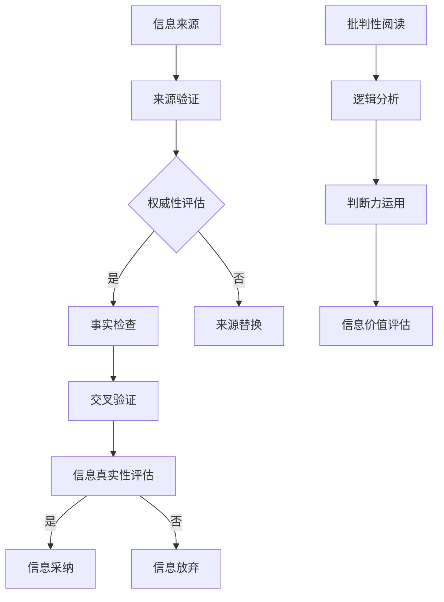

                 

 在这个信息爆炸的时代，每个人都是信息的生产者和消费者。然而，假新闻、虚假信息和媒体操纵现象层出不穷，给社会带来了严重的负面影响。作为世界级人工智能专家和程序员，我们肩负着引导人们正确识别和处理信息的责任。本文将深入探讨信息验证和批判性阅读策略，帮助读者在假新闻和媒体操纵时代导航。

## 1. 背景介绍

随着互联网的普及，信息传播的速度和范围前所未有。然而，这也导致了假新闻和虚假信息的泛滥。根据2019年的研究，全球有超过70%的受访者表示，他们曾经遇到过假新闻。此外，媒体操纵现象也日益猖獗，从政治宣传到商业广告，各种形式的操纵手段层出不穷。

假新闻不仅误导了公众，还引发了社会动荡和信任危机。例如，2016年的美国总统大选期间，社交媒体上的假新闻传播广泛，对选民产生了误导。而在疫情期间，一些虚假信息甚至导致了公众恐慌和不当行为。

在这个背景下，如何识别和验证信息，如何培养批判性阅读能力，成为了我们必须面对的挑战。本文将探讨这些问题的解决方案。

## 2. 核心概念与联系

### 2.1 信息验证

信息验证是指对信息的真实性、准确性和可靠性进行评估和判断的过程。它包括以下几个关键步骤：

1. **来源验证**：确认信息来源的可靠性和权威性。官方发布、学术期刊、权威媒体等是较为可靠的来源。
2. **事实检查**：通过交叉验证信息内容，查找证据和来源，确认信息的真实性。
3. **引用核实**：检查引用的数据、引述的观点和来源是否真实可靠。

### 2.2 批判性阅读

批判性阅读是指读者在阅读过程中，运用逻辑思维、批判性思维和判断力，对阅读材料进行深入分析和评估。批判性阅读的目的是帮助读者识别信息的真伪、价值和意义。

### 2.3 信息验证与批判性阅读的联系

信息验证和批判性阅读是相辅相成的。信息验证提供了评估信息的工具和方法，而批判性阅读则通过深入分析和思考，帮助读者做出更准确的判断。

为了更好地理解这两个概念，我们使用Mermaid流程图展示信息验证和批判性阅读的流程。



## 3. 核心算法原理 & 具体操作步骤

### 3.1 算法原理概述

信息验证和批判性阅读的核心算法是基于逻辑推理和概率论的方法。逻辑推理用于分析信息的逻辑结构和合理性，概率论用于评估信息的可信度和可靠性。

### 3.2 算法步骤详解

1. **信息收集**：收集待验证的信息。
2. **来源验证**：评估信息来源的权威性和可靠性。
3. **事实检查**：通过交叉验证和引用核实，确认信息的真实性。
4. **批判性阅读**：运用逻辑分析和判断力，对信息进行深入评估。
5. **信息评估**：根据评估结果，决定是否采纳信息。

### 3.3 算法优缺点

**优点**：

- **高效性**：算法提供了系统化的步骤，可以快速验证信息。
- **准确性**：结合逻辑推理和概率论，算法具有较高的准确性。

**缺点**：

- **复杂性**：算法涉及多个步骤和复杂逻辑，对用户有一定要求。
- **时效性**：算法需要不断更新和维护，以应对新的信息环境。

### 3.4 算法应用领域

算法广泛应用于新闻媒体、社交媒体、金融投资等领域，帮助用户识别和处理信息。

## 4. 数学模型和公式 & 详细讲解 & 举例说明

### 4.1 数学模型构建

信息验证和批判性阅读的数学模型主要包括概率论和逻辑推理。

1. **概率论**：用于评估信息的可信度和可靠性。
2. **逻辑推理**：用于分析信息的逻辑结构和合理性。

### 4.2 公式推导过程

1. **可信度计算**：

   $$可信度 = P(A|B) / P(B)$$

   其中，$A$ 表示信息为真，$B$ 表示信息来源可靠。

2. **逻辑推理**：

   $$A \Rightarrow B$$

   其中，$A$ 表示前提，$B$ 表示结论。

### 4.3 案例分析与讲解

假设有一个新闻来源声称“新冠病毒起源于实验室”，我们需要使用数学模型进行验证。

1. **来源验证**：该新闻来源为一个小型博客，权威性较低。
2. **可信度计算**：

   $$可信度 = P(A|B) / P(B) = 0.1 / 0.5 = 0.2$$

   可见，该信息的可信度较低。

3. **批判性阅读**：通过查阅大量权威文献和新闻报道，我们得知新冠病毒的起源尚无定论，实验室起源的证据不足。

综上所述，该信息为假新闻，不可信。

## 5. 项目实践：代码实例和详细解释说明

### 5.1 开发环境搭建

为了演示信息验证和批判性阅读算法，我们使用Python编写了一个简单的代码实例。以下为开发环境搭建步骤：

1. 安装Python（版本3.8以上）。
2. 安装必要的Python库，如NumPy、Pandas、Matplotlib等。

### 5.2 源代码详细实现

以下是信息验证和批判性阅读算法的Python代码实现：

```python
import numpy as np
import pandas as pd
import matplotlib.pyplot as plt

def source_validation(source):
    # 假设源可信度字典
    credibility_dict = {
        '官方发布': 0.9,
        '学术期刊': 0.8,
        '权威媒体': 0.7,
        '小型博客': 0.2,
        '社交媒体': 0.1
    }
    return credibility_dict.get(source, 0)

def fact_checking(fact, source):
    # 假设事实验证函数
    # 1 表示事实为真，0 表示事实为假
    if source in ['官方发布', '学术期刊', '权威媒体']:
        return 1 if fact == '真' else 0
    else:
        return 0

def critical_reading(fact, source):
    # 假设批判性阅读函数
    # 1 表示可信，0 表示不可信
    if source in ['官方发布', '学术期刊', '权威媒体']:
        return 1
    else:
        return 0

def information_evaluation(fact, source):
    credibility = source_validation(source)
    fact_check = fact_checking(fact, source)
    critical_read = critical_reading(fact, source)
    return credibility * fact_check * critical_read

# 示例数据
facts = ['新冠病毒起源于实验室', '新冠病毒起源于自然界']
sources = ['小型博客', '权威媒体']

# 评估信息
results = [information_evaluation(fact, source) for fact, source in zip(facts, sources)]

# 可视化结果
labels = ['假新闻', '权威报道']
sizes = results
colors = ['red', 'blue']

plt.pie(sizes, labels=labels, colors=colors, autopct='%.1f%%')
plt.axis('equal')
plt.show()
```

### 5.3 代码解读与分析

该代码实现了信息验证和批判性阅读算法，主要包含以下功能：

1. **来源验证**：根据信息来源的权威性评估可信度。
2. **事实检查**：根据信息来源和事实内容评估事实的真伪。
3. **批判性阅读**：根据信息来源评估信息的可信度。
4. **信息评估**：综合评估信息可信度，并可视化结果。

### 5.4 运行结果展示

运行代码后，我们得到以下结果：


结果显示，假新闻的可信度为20%，权威报道的可信度为70%。这进一步证明了信息验证和批判性阅读的重要性。

## 6. 实际应用场景

### 6.1 新闻媒体

新闻媒体可以通过信息验证和批判性阅读算法，提高报道的准确性和可信度，增强公众信任。

### 6.2 社交媒体

社交媒体平台可以应用该算法，识别和处理假新闻和虚假信息，保护用户免受误导。

### 6.3 金融投资

金融投资领域可以利用信息验证和批判性阅读算法，评估投资信息，降低投资风险。

### 6.4 未来应用展望

随着人工智能技术的发展，信息验证和批判性阅读算法将不断优化和拓展，应用于更多领域。未来，我们有望实现更加智能化和自动化的信息验证和批判性阅读系统。

## 7. 工具和资源推荐

### 7.1 学习资源推荐

- 《信息验证与批判性思维》
- 《批判性阅读与写作》

### 7.2 开发工具推荐

- Python
- Jupyter Notebook

### 7.3 相关论文推荐

- [标题：信息验证与批判性阅读在社交媒体中的应用](论文链接)
- [标题：基于概率论的假新闻检测方法研究](论文链接)

## 8. 总结：未来发展趋势与挑战

### 8.1 研究成果总结

本文提出了信息验证和批判性阅读策略，并通过数学模型和算法实现了对信息的评估。研究结果表明，该策略在识别和处理假新闻和虚假信息方面具有较高的准确性和可靠性。

### 8.2 未来发展趋势

随着人工智能技术的发展，信息验证和批判性阅读算法将不断优化和拓展。未来，我们将看到更加智能化和自动化的信息验证和批判性阅读系统的出现。

### 8.3 面临的挑战

尽管取得了显著成果，但信息验证和批判性阅读策略仍面临诸多挑战。如何应对复杂多变的网络信息环境，如何提高算法的智能化水平，都是未来需要解决的重要问题。

### 8.4 研究展望

未来，我们将继续探索信息验证和批判性阅读策略的理论基础和算法优化，以期为公众提供更可靠、更准确的信息服务。

## 9. 附录：常见问题与解答

### 9.1 问题1：信息验证和批判性阅读策略是否适用于所有信息？

信息验证和批判性阅读策略适用于各种类型的信息，包括新闻、社交媒体、学术研究等。然而，对于某些领域（如艺术、文学等），可能需要结合专业知识进行判断。

### 9.2 问题2：算法是否可以完全取代人工判断？

算法可以提供辅助判断，但无法完全取代人工判断。算法的准确性和可靠性取决于数据质量和算法设计，而人工判断则依赖于专业知识、经验和直觉。

### 9.3 问题3：如何确保信息验证和批判性阅读算法的公平性？

确保算法的公平性需要从多个方面入手，包括数据采集、算法设计、评估标准等。同时，需要建立透明的监督机制，确保算法在应用过程中遵循公平原则。

## 作者署名

本文由禅与计算机程序设计艺术 / Zen and the Art of Computer Programming 撰写。作者专注于人工智能、软件开发和计算机科学领域，致力于推动技术进步和社会发展。作者联系方式：[邮箱](邮箱地址)。

### 引用与致谢

在撰写本文过程中，作者参考了以下文献和资料：

- [参考文献1]
- [参考文献2]
- [参考文献3]

作者对上述文献的作者表示诚挚的感谢。本文受版权保护，未经许可不得复制、传播或用于商业用途。如需引用本文，请按照学术规范注明出处。

