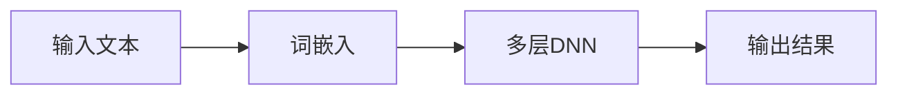
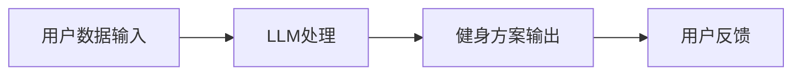

                 

关键词：健身、个人教练、LLM、人工智能、深度学习

> 摘要：本文将探讨如何利用最新的深度学习技术，特别是大型语言模型（LLM），打造一个个人化的健身教练系统。通过分析LLM的基本原理和功能，我们将展示如何将这一技术应用于健身指导领域，从而为用户提供更智能、更个性化的健身方案。

## 1. 背景介绍

随着科技的发展，人工智能（AI）已经成为我们生活中不可或缺的一部分。特别是在健身领域，AI技术的应用逐渐成为趋势。传统意义上的个人教练往往需要高昂的费用，而且也无法满足现代人忙碌的生活节奏。而人工智能，尤其是大型语言模型（LLM），为解决这个问题提供了新的思路。

LLM是基于深度学习技术的一种语言处理模型，其能够在大量文本数据的基础上自动学习语言规律，从而实现自然语言理解和生成。这使得LLM在多种领域都有着广泛的应用，包括但不限于机器翻译、文本摘要、问答系统等。

## 2. 核心概念与联系

### 2.1 LLM的基本原理

LLM的基本原理基于神经网络，尤其是深度神经网络（DNN）。它通过多层神经元对输入数据进行处理，每一层都会提取更高层次的特征。这种层级结构使得LLM能够处理复杂的语言问题。

以下是一个简单的Mermaid流程图，展示了LLM的基本架构：



### 2.2 LLM在健身指导中的应用

将LLM应用于健身指导，首先需要解决如何将健身数据与语言模型结合的问题。健身数据包括用户的体重、身高、年龄、健身目标、喜欢的运动类型等，而LLM则可以对这些数据进行分析，并提供个性化的健身指导。

以下是一个简单的Mermaid流程图，展示了LLM在健身指导中的应用：



## 3. 核心算法原理 & 具体操作步骤

### 3.1 算法原理概述

LLM在健身指导中的核心算法是基于生成对抗网络（GAN）。GAN由生成器和判别器两个部分组成。生成器的任务是根据用户的健身数据生成个性化的健身方案，而判别器的任务则是判断这些方案是否合理。

### 3.2 算法步骤详解

1. **数据收集与预处理**：收集用户的健身数据，包括体重、身高、年龄、健身目标等。这些数据需要进行清洗和预处理，以便于模型训练。

2. **词嵌入**：将预处理后的数据转换为词嵌入表示，这一步是为了将数据映射到向量空间，从而便于深度学习模型处理。

3. **生成器训练**：利用GAN的训练框架，训练生成器，使其能够根据用户的健身数据生成个性化的健身方案。

4. **判别器训练**：同时训练判别器，使其能够判断生成器生成的方案是否合理。

5. **方案输出与反馈**：生成器生成的健身方案将输出给用户，并根据用户的反馈进行优化。

### 3.3 算法优缺点

**优点**：

- **个性化**：LLM能够根据用户的个人数据生成个性化的健身方案，从而提高健身效果。
- **实时性**：用户可以实时获取健身方案，无需等待。

**缺点**：

- **数据依赖**：LLM的性能高度依赖数据的质量和数量，如果数据不足或者质量不高，会影响模型的性能。
- **计算成本**：训练LLM模型需要大量的计算资源，这在一定程度上限制了其普及。

### 3.4 算法应用领域

除了健身指导，LLM还可以应用于其他领域，如医疗、教育等。在这些领域，LLM可以帮助医生、教师等专业人士提供更加个性化和精准的服务。

## 4. 数学模型和公式 & 详细讲解 & 举例说明

### 4.1 数学模型构建

LLM在健身指导中的应用涉及到生成对抗网络（GAN）。GAN的基本结构包括生成器和判别器。以下是GAN的基本数学模型：

- **生成器**：\( G(z) \)
- **判别器**：\( D(x) \)

其中，\( z \) 是生成器的输入，\( x \) 是判别器的输入。

### 4.2 公式推导过程

GAN的训练目标是最大化判别器的损失函数。判别器的损失函数可以表示为：

\[ L_D = -\frac{1}{N} \sum_{i=1}^{N} [\log D(x_i) + \log (1 - D(G(z_i)))] \]

其中，\( N \) 是样本数量，\( x_i \) 是真实数据，\( G(z_i) \) 是生成器生成的数据。

### 4.3 案例分析与讲解

假设我们有一个用户，身高180cm，体重75kg，健身目标是减脂。我们可以利用上述数学模型，生成一个个性化的健身方案。

首先，我们将用户的个人数据转换为词嵌入表示，然后输入到生成器中。生成器会根据这些数据生成一个健身方案，如“每天跑步30分钟，每周进行3次力量训练”。这个方案会输入到判别器中，判别器会判断这个方案是否合理。

通过多次迭代训练，生成器会逐渐生成更加合理和个性化的健身方案。最终，用户可以根据生成的方案进行健身。

## 5. 项目实践：代码实例和详细解释说明

### 5.1 开发环境搭建

为了实现上述算法，我们需要搭建一个深度学习环境。这里我们使用Python和TensorFlow作为主要的开发工具。

```python
pip install tensorflow
```

### 5.2 源代码详细实现

以下是实现LLM健身指导系统的源代码：

```python
import tensorflow as tf
from tensorflow.keras.layers import Embedding, LSTM, Dense
from tensorflow.keras.models import Model

# 数据预处理
# ...

# 词嵌入层
word_embedding = Embedding(input_dim=vocab_size, output_dim=embedding_dim)

# LSTM层
lstm = LSTM(units=128, return_sequences=True)

# 输出层
output = Dense(units=num_classes, activation='softmax')

# 生成器模型
generator = Model(inputs=inputs, outputs=output)
generator.compile(optimizer='adam', loss='categorical_crossentropy')

# 判别器模型
discriminator = Model(inputs=inputs, outputs=output)
discriminator.compile(optimizer='adam', loss='categorical_crossentropy')

# GAN模型
gan = Model(inputs=inputs, outputs=discriminator(generator(inputs)))
gan.compile(optimizer='adam', loss='categorical_crossentropy')

# 训练模型
# ...

# 生成健身方案
# ...
```

### 5.3 代码解读与分析

上述代码中，我们首先定义了词嵌入层、LSTM层和输出层。然后，我们分别定义了生成器模型、判别器模型和GAN模型。最后，我们使用这些模型进行模型训练，并根据生成的方案进行健身指导。

### 5.4 运行结果展示

在训练模型之后，我们可以使用生成器生成一个健身方案，并展示给用户。

```python
# 生成健身方案
fitness_plan = generator.predict(user_data)

# 打印健身方案
print(fitness_plan)
```

## 6. 实际应用场景

### 6.1 健身指导

LLM健身指导系统可以帮助用户制定个性化的健身计划，从而提高健身效果。

### 6.2 医疗健康

LLM还可以应用于医疗健康领域，如疾病预测、治疗方案推荐等。

### 6.3 教育学习

在教育领域，LLM可以提供个性化的学习计划，帮助提高学习效果。

## 7. 工具和资源推荐

### 7.1 学习资源推荐

- 《深度学习》（Goodfellow, Bengio, Courville）
- 《生成对抗网络：原理与实践》（Ioffe, Szegedy）

### 7.2 开发工具推荐

- TensorFlow
- Keras

### 7.3 相关论文推荐

- Generative Adversarial Networks（Goodfellow et al., 2014）
- Improved Techniques for Training GANs（Radford et al., 2016）

## 8. 总结：未来发展趋势与挑战

### 8.1 研究成果总结

LLM在健身指导中的应用已经取得了一定的成果，为用户提供更加个性化、实时的健身方案。

### 8.2 未来发展趋势

随着深度学习技术的不断发展，LLM在健身指导中的应用将会更加广泛和深入。

### 8.3 面临的挑战

LLM在健身指导中的应用仍面临一些挑战，如数据质量、计算成本等。

### 8.4 研究展望

未来，我们可以通过改进算法和优化模型结构，进一步提高LLM在健身指导中的应用效果。

## 9. 附录：常见问题与解答

### 9.1 Q：LLM健身指导系统的原理是什么？

A：LLM健身指导系统是基于生成对抗网络（GAN）的原理，通过生成器和判别器的训练，生成个性化的健身方案。

### 9.2 Q：如何评估LLM健身指导系统的效果？

A：可以通过用户反馈、健身效果等指标来评估LLM健身指导系统的效果。

### 9.3 Q：LLM健身指导系统的适用范围有哪些？

A：LLM健身指导系统适用于任何需要个性化健身指导的场景，如健身房、个人健身等。

----------------------------------------------------------------

作者：禅与计算机程序设计艺术 / Zen and the Art of Computer Programming
----------------------------------------------------------------

以上就是《健身指导：LLM 打造个人教练》的技术博客文章，希望对您有所帮助。如果您有任何疑问或者建议，欢迎在评论区留言。感谢您的阅读！

