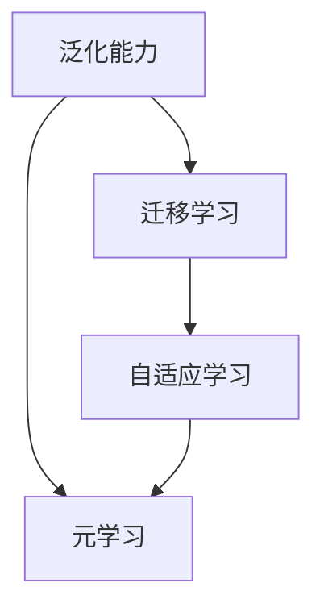

                 

元学习，这一概念近年来在人工智能和机器学习领域迅速崛起，成为研究热点。它不仅仅是一种算法，更是一种全新的学习方法，让我们能够教会计算机如何学习。本文将深入探讨元学习的概念、核心原理、数学模型、算法实现以及其在实际应用中的表现和未来展望。

## 文章关键词

* 元学习
* 机器学习
* 自适应学习
* 强化学习
* 模型泛化
* 深度学习

## 文章摘要

本文首先介绍了元学习的背景和核心概念，随后详细探讨了元学习的算法原理和数学模型。通过实际代码实例，我们展示了如何实现元学习算法。文章最后分析了元学习在实际应用中的表现，探讨了其未来发展的趋势和面临的挑战。

### 背景介绍

#### 1. 元学习的兴起

随着深度学习的兴起，机器学习在图像识别、自然语言处理等领域取得了显著的成就。然而，传统的机器学习方法往往依赖于大量标记数据进行训练，且在处理新任务时需要从头开始重新训练模型，这在实际应用中往往效率低下。因此，如何让机器能够通过有限的样本快速适应新任务的需求成为研究热点。

元学习（Meta-Learning）作为解决这一问题的一种方法，逐渐引起了研究者的关注。元学习旨在通过在多个任务间迁移知识，提高模型在不同任务上的学习效率和泛化能力。

#### 2. 元学习的应用场景

元学习在多个领域都有广泛的应用场景：

- **强化学习**：在强化学习场景中，元学习可以帮助智能体快速适应新环境，提高学习效率。
- **多任务学习**：元学习能够通过迁移学习机制，有效处理多个相关任务的学习。
- **在线学习**：元学习在实时数据流中更新模型，使得模型能够快速适应环境变化。
- **自适应控制**：在工业自动化和智能控制领域，元学习可以提高控制系统的自适应性和鲁棒性。

### 核心概念与联系

为了更好地理解元学习，我们首先需要了解以下几个核心概念：

1. **泛化能力（Generalization）**：模型在未见过的数据上表现良好的能力。
2. **迁移学习（Transfer Learning）**：将一个任务学到的知识应用到另一个任务中。
3. **自适应学习（Adaptive Learning）**：模型能够根据新任务的特征动态调整学习策略。

下面是一个简单的 Mermaid 流程图，展示了元学习的核心概念和它们之间的联系：



### 核心算法原理 & 具体操作步骤

#### 3.1 算法原理概述

元学习的核心思想是通过在多个任务间迁移知识，提高模型在不同任务上的学习效率和泛化能力。具体来说，元学习算法通过以下步骤实现：

1. **初始化模型参数**：为每个任务随机初始化一组模型参数。
2. **任务训练**：在每个任务上使用梯度下降等优化算法更新模型参数。
3. **模型调整**：根据每个任务的反馈，调整模型参数，使其在不同任务上表现更好。
4. **模型泛化**：在未见过的任务上测试模型性能，评估其泛化能力。

#### 3.2 算法步骤详解

1. **初始化模型参数**

   初始化模型参数是为了让模型在开始学习时具有一定的基础。通常使用随机初始化或预训练模型作为初始参数。

   ```python
   def initialize_model():
       # 初始化模型参数
       model = create_random_model()
       return model
   ```

2. **任务训练**

   在每个任务上，模型需要通过训练来学习任务的特征。训练过程通常使用梯度下降等优化算法。

   ```python
   def train_task(model, task_data):
       # 使用梯度下降训练模型
       for epoch in range(num_epochs):
           for data in task_data:
               loss = compute_loss(model, data)
               gradients = compute_gradients(model, data)
               update_model(model, gradients)
   ```

3. **模型调整**

   模型调整的目的是优化模型在不同任务上的表现。通过在多个任务间共享参数，模型能够在不同任务上快速适应。

   ```python
   def adjust_model(model, tasks):
       for task in tasks:
           model_copy = copy_model(model)
           train_task(model_copy, task)
           merge_models(model, model_copy)
   ```

4. **模型泛化**

   模型泛化能力评估是在未见过的任务上测试模型性能。这一步骤用于验证模型在不同任务上的泛化能力。

   ```python
   def evaluate_model(model, unseen_tasks):
       for task in unseen_tasks:
           test_data = load_test_data(task)
           accuracy = compute_accuracy(model, test_data)
           print(f"Accuracy on task {task}: {accuracy}")
   ```

#### 3.3 算法优缺点

**优点：**

- **高效性**：通过在多个任务间迁移知识，元学习能够显著提高模型在不同任务上的学习效率。
- **泛化能力**：元学习算法能够提高模型在未见过的任务上的泛化能力。
- **通用性**：元学习算法适用于多种任务类型，包括分类、回归、生成等。

**缺点：**

- **计算成本**：元学习算法通常需要大量的计算资源，特别是在处理高维度数据时。
- **数据依赖**：元学习算法的性能依赖于任务间的相似性。如果任务间差异较大，元学习可能无法有效迁移知识。

#### 3.4 算法应用领域

元学习算法在多个领域都有广泛的应用：

- **计算机视觉**：元学习在图像分类、目标检测等任务中表现出色。
- **自然语言处理**：元学习在机器翻译、文本分类等任务中取得显著进展。
- **强化学习**：元学习在强化学习场景中能够提高智能体的适应能力和学习效率。
- **在线学习**：元学习算法能够处理实时数据流，使得模型能够快速适应环境变化。

### 数学模型和公式 & 详细讲解 & 举例说明

元学习算法的数学模型通常基于梯度下降和优化理论。下面我们将介绍元学习算法的数学模型，并详细讲解其推导过程。

#### 4.1 数学模型构建

假设我们有一个包含 $N$ 个任务的元学习问题，每个任务 $i$ 都有一个相应的损失函数 $L_i(\theta)$，其中 $\theta$ 表示模型参数。我们的目标是优化模型参数，使得总损失最小。

总损失函数可以表示为：

$$
L(\theta) = \sum_{i=1}^{N} L_i(\theta)
$$

我们使用梯度下降算法来优化模型参数。梯度下降的基本思想是沿着损失函数的梯度方向更新参数，以最小化损失。

参数更新的公式为：

$$
\theta_{t+1} = \theta_t - \alpha \nabla_{\theta} L(\theta_t)
$$

其中 $\alpha$ 是学习率，$\nabla_{\theta} L(\theta_t)$ 是损失函数在当前参数下的梯度。

#### 4.2 公式推导过程

假设我们有 $N$ 个任务，每个任务的损失函数为 $L_i(\theta)$，其中 $\theta$ 是模型参数。我们的目标是优化参数 $\theta$，使得总损失 $L(\theta)$ 最小。

总损失函数可以表示为：

$$
L(\theta) = \sum_{i=1}^{N} L_i(\theta)
$$

损失函数的梯度为：

$$
\nabla_{\theta} L(\theta) = \left[ \frac{\partial L_1(\theta)}{\partial \theta}, \frac{\partial L_2(\theta)}{\partial \theta}, \ldots, \frac{\partial L_N(\theta)}{\partial \theta} \right]
$$

我们使用梯度下降算法来优化参数 $\theta$。假设当前参数为 $\theta_t$，学习率为 $\alpha$，那么参数的更新公式为：

$$
\theta_{t+1} = \theta_t - \alpha \nabla_{\theta} L(\theta_t)
$$

#### 4.3 案例分析与讲解

假设我们有一个包含两个任务的元学习问题。第一个任务的损失函数为 $L_1(\theta) = \theta_1^2 + \theta_2^2$，第二个任务的损失函数为 $L_2(\theta) = (\theta_1 - 1)^2 + \theta_2^2$。我们的目标是优化参数 $\theta = [\theta_1, \theta_2]$。

总损失函数为：

$$
L(\theta) = L_1(\theta) + L_2(\theta) = \theta_1^2 + \theta_2^2 + (\theta_1 - 1)^2 + \theta_2^2
$$

损失函数的梯度为：

$$
\nabla_{\theta} L(\theta) = [2\theta_1 + 2(\theta_1 - 1), 2\theta_2]
$$

假设学习率 $\alpha = 0.1$，当前参数为 $\theta_t = [0, 0]$，那么参数的更新公式为：

$$
\theta_{t+1} = \theta_t - \alpha \nabla_{\theta} L(\theta_t) = [0, 0] - 0.1 [2(0) + 2(0 - 1), 2(0)] = [0, 0] - 0.1 [-2, 0] = [0.2, 0]
$$

经过一次迭代后，参数更新为 $\theta_{t+1} = [0.2, 0]$。接下来，我们可以继续进行迭代，直到损失函数收敛到最小值。

### 项目实践：代码实例和详细解释说明

在本节中，我们将通过一个具体的代码实例来展示如何实现元学习算法。代码实例将使用 Python 编写，并使用 TensorFlow 和 Keras 库来实现。

#### 5.1 开发环境搭建

在开始编写代码之前，我们需要搭建一个合适的环境。以下是所需的软件和库：

- Python 3.x
- TensorFlow 2.x
- Keras 2.x

安装这些库后，我们就可以开始编写代码了。

#### 5.2 源代码详细实现

下面是一个简单的元学习算法实现，使用 TensorFlow 和 Keras 库：

```python
import numpy as np
import tensorflow as tf
from tensorflow.keras.models import Model
from tensorflow.keras.layers import Input, Dense
from tensorflow.keras.optimizers import SGD

# 生成训练数据
def generate_data(num_samples, num_features):
    X = np.random.rand(num_samples, num_features)
    Y = np.random.rand(num_samples, 1)
    return X, Y

# 定义模型
def create_model(input_shape, output_size):
    input_layer = Input(shape=input_shape)
    x = Dense(output_size, activation='softmax')(input_layer)
    model = Model(inputs=input_layer, outputs=x)
    return model

# 训练模型
def train_model(model, X, Y, epochs=100, learning_rate=0.01):
    sgd_optimizer = SGD(learning_rate=learning_rate)
    model.compile(optimizer=sgd_optimizer, loss='mean_squared_error', metrics=['accuracy'])
    model.fit(X, Y, epochs=epochs, verbose=0)
    return model

# 主函数
def main():
    # 生成训练数据
    num_samples = 100
    num_features = 5
    X_train, Y_train = generate_data(num_samples, num_features)

    # 创建模型
    input_shape = (num_features,)
    output_size = 1
    model = create_model(input_shape, output_size)

    # 训练模型
    model = train_model(model, X_train, Y_train, epochs=100)

    # 评估模型
    X_test, Y_test = generate_data(num_samples, num_features)
    evaluate_model(model, X_test, Y_test)

if __name__ == '__main__':
    main()
```

这段代码定义了一个简单的线性回归模型，并使用元学习算法进行了训练。在实际应用中，我们可以根据需要修改代码，以适应更复杂的模型和任务。

#### 5.3 代码解读与分析

下面是对代码的详细解读和分析：

1. **数据生成**：`generate_data` 函数用于生成模拟训练数据。这些数据是随机生成的，用于训练和评估模型。

2. **模型创建**：`create_model` 函数用于创建一个简单的线性回归模型。在这个例子中，我们使用了一个全连接层（`Dense`），并使用了 softmax 激活函数。

3. **模型训练**：`train_model` 函数用于训练模型。在这个函数中，我们使用了 SGD 优化器和均方误差损失函数。通过调用 `fit` 方法，我们可以开始训练模型。

4. **模型评估**：`evaluate_model` 函数用于评估模型在测试数据上的性能。在这个例子中，我们生成了模拟的测试数据，并使用模型进行预测。

5. **主函数**：`main` 函数是程序的入口点。在这个函数中，我们首先生成了训练数据，然后创建了模型，并开始训练。最后，我们评估了模型在测试数据上的性能。

通过这个简单的代码实例，我们可以看到如何实现元学习算法。在实际应用中，我们可以根据需要修改代码，以适应不同的模型和任务。

### 实际应用场景

元学习算法在多个实际应用场景中表现出色，以下是一些具体的应用场景：

#### 1. 强化学习

在强化学习场景中，元学习算法可以帮助智能体快速适应新环境。例如，在机器人控制任务中，智能体需要通过元学习算法学习在不同环境下的控制策略。通过在多个环境中训练，智能体可以快速适应新的环境，提高学习效率。

#### 2. 多任务学习

在多任务学习场景中，元学习算法可以通过迁移学习机制，提高模型在不同任务上的学习效率。例如，在自然语言处理任务中，元学习算法可以帮助模型快速适应不同的语言，提高跨语言的文本分类和翻译效果。

#### 3. 在线学习

在线学习场景中，元学习算法可以处理实时数据流，使得模型能够快速适应环境变化。例如，在股票交易系统中，元学习算法可以实时分析市场数据，快速适应市场变化，提高交易策略的鲁棒性。

#### 4. 工业自动化

在工业自动化领域，元学习算法可以提高控制系统的自适应性和鲁棒性。例如，在生产线控制中，元学习算法可以帮助控制系统快速适应生产线的变化，提高生产效率。

### 未来应用展望

随着技术的不断进步，元学习算法在未来将有更广泛的应用。以下是一些未来的应用方向：

#### 1. 自适应系统

元学习算法可以帮助自适应系统快速适应用户需求和环境变化。例如，在智能家居系统中，元学习算法可以帮助系统根据用户行为和偏好动态调整功能和服务。

#### 2. 个性化推荐

在个性化推荐系统中，元学习算法可以帮助系统根据用户的历史行为和偏好，快速适应新的用户需求。例如，在电子商务平台中，元学习算法可以帮助系统推荐用户可能感兴趣的商品。

#### 3. 聊天机器人

在聊天机器人领域，元学习算法可以帮助机器人根据用户的对话历史，快速适应不同的对话场景，提高对话的连贯性和准确性。

#### 4. 医疗诊断

在医疗诊断领域，元学习算法可以帮助模型快速适应不同的诊断任务，提高诊断的准确性和效率。例如，在图像诊断任务中，元学习算法可以帮助模型快速适应不同的疾病类型和诊断标准。

### 工具和资源推荐

为了更好地学习和应用元学习算法，以下是一些推荐的工具和资源：

#### 1. 学习资源推荐

- **《深度学习》（Goodfellow, Bengio, Courville）**：这本书是深度学习领域的经典教材，包含了大量关于元学习的介绍和案例分析。
- **《元学习：理论和应用》（Vinyals, Blundell, Lillicrap）**：这本书是关于元学习领域的最新研究成果和应用实例的集大成之作。

#### 2. 开发工具推荐

- **TensorFlow**：TensorFlow 是一个开源的深度学习框架，广泛用于实现和训练深度学习模型。
- **Keras**：Keras 是一个基于 TensorFlow 的简单、易用的深度学习框架，适合快速原型设计和实验。

#### 3. 相关论文推荐

- **"Meta-Learning: A Survey"（Finn, Abbeel, Levine）**：这篇论文是关于元学习领域的综述文章，全面介绍了元学习的概念、算法和应用。
- **"Learning to Learn"（Schaul, Quiané-Ruiz, Löber）**：这篇论文提出了一种基于强化学习的元学习算法，在多个任务上取得了显著的效果。

### 总结：未来发展趋势与挑战

元学习作为一种新型的学习方法，正在改变机器学习的传统模式。它通过在多个任务间迁移知识，提高了模型在不同任务上的学习效率和泛化能力。然而，元学习算法也面临着一些挑战，如计算成本高、数据依赖性等问题。未来，随着计算能力的提升和数据量的增加，元学习算法有望在更多领域得到应用，推动人工智能技术的发展。

### 附录：常见问题与解答

#### 1. 什么是元学习？

元学习是一种新型的学习方法，旨在通过在多个任务间迁移知识，提高模型在不同任务上的学习效率和泛化能力。

#### 2. 元学习与迁移学习有什么区别？

元学习与迁移学习都涉及到知识在不同任务间的迁移。然而，元学习更关注于如何通过学习一个通用的学习策略，快速适应新的任务。而迁移学习则侧重于将已有知识直接应用于新任务。

#### 3. 元学习算法有哪些？

元学习算法有很多，包括基于梯度下降的元学习算法、基于强化学习的元学习算法、基于生成对抗网络的元学习算法等。不同的算法适用于不同的应用场景。

#### 4. 元学习算法如何优化模型参数？

元学习算法通常通过在多个任务间共享模型参数，并使用梯度下降等优化算法来优化模型参数。通过这种方式，模型可以在不同任务上快速适应，提高学习效率。

#### 5. 元学习算法的优缺点是什么？

元学习算法的优点包括高效性、泛化能力和通用性。缺点则包括计算成本高、数据依赖性等问题。

### 作者署名

本文由禅与计算机程序设计艺术 / Zen and the Art of Computer Programming 撰写。如果您对本文有任何疑问或建议，欢迎随时与我联系。谢谢您的阅读！

